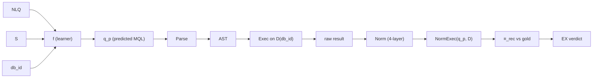
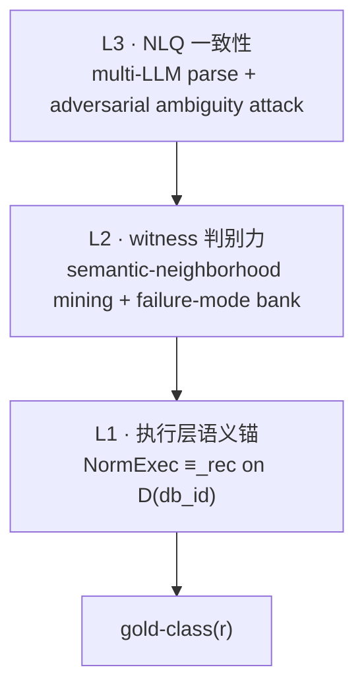
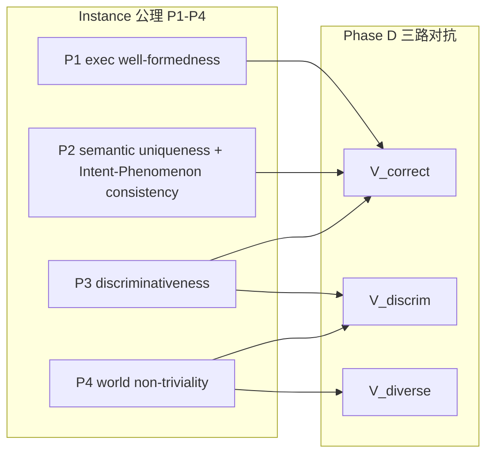

# 01 · 任务定义 (Task Definition)

> TEND 公理层文档。本文定义任务的形式化签名、输出空间约束、正确性锚、归一化契约、递归相等、以及 instance 层正确性根原则 P1-P4。下游文档 (02/03/04/05/06) 的一切规范必须与本文自洽;任何与本文冲突的下游段落视为下游的 bug,而非本文的规范更新。本文不负责"如何构造任务实例",只负责"一个合法的任务实例在形式上必须是什么"。

<a id="01-0"></a>
## §01-0 摘要

TEND (Text-to-NoSQL benchmark for Mongo-flavored pipelines) 研究如下映射的学习与评测问题:

$$
f:\ (\texttt{NLQ},\ S,\ \texttt{db\_id})\ \longrightarrow\ q^{\text{MQL}}
$$

它刻画**自然语言查询意图如何被可执行的 MongoDB 聚合管道精确表达**这一核心认知任务。TEND 与已有关系式 Text-to-SQL 基准的根本区别在于:NoSQL 数据世界原生包含嵌套文档、数组字段、稀疏列、混合类型,其意图空间 (Structured Intent, SI) 本质上**不是** SQL AST 的子集。因此 TEND 不以 MQL 字面相等作为正确性锚,而是以 **gold-as-class 等价类** + **三层语义保证** + **P1-P4 四项根原则**作为正确性公理。

### 规模锁定 (Scale Lockdown)

| 维度 | 数量 |
|------|------|
| 数据库 `db_id` | 154 |
| 领域 `domain` | 105 |
| 集合 `collection` | 347 |
| record (任务实例骨干) | 17,020 |
| 每 record NLQ 数 | 5 (五个特异性层级) |
| **NLQ 总数** | **85,100** |
| cross-domain 训练集 | 14,245 record (71,225 NLQ) |
| cross-domain 测试集 | 2,775 record (13,875 NLQ) |

cross-domain split 在 `domain` 层不相交 (即训练域与测试域无交集),保证模型泛化评测的域外性。record 字段契约、split 规则、覆盖轴定义均由 [02 §2](./02_dataset_design.md#02-2) 给出。

### 本文 5 项核心承诺

本文承诺如下 5 件事成立,下游一律引用、不得重定义:

1. **§01-1 任务签名**: IO 三元组 `(NLQ, S, db_id) → q^MQL` 的形式化,含三个原子算子 `Parse` / `Exec` / `Norm` 与复合算子 `NormExec`。
2. **§01-2 输出空间约束**: `q^MQL` 必须同时满足三条核心性质 (read-only / deterministic / mongosh-executable),以及六件禁用 operator 清单 (`$sample`, `$rand`, `$$NOW`, `$out`, `$merge`, `$function`)。
3. **§01-3 正确性锚 (gold-as-class)**: gold 是 `canonical_form_set` 等价类,不是单条 MQL 字面;并附三层正确性保证 (L1 执行层语义锚 / L2 witness 判别力 / L3 NLQ 一致性)。
4. **§01-4 Norm 契约**: 四层归一化 (标量 / 复合 / null-vs-missing / _id + shape-preserving)。
5. **§01-5 + §01-6 ≡_rec 与 P1-P4**: 执行层递归相等的四层语义,以及 instance 层根原则 P1 执行正确 / P2 语义唯一 (含 Intent-Phenomenon 一致性) / P3 判别力 / P4 世界非平凡;最后映射到 [04 §10](./04_intent_to_query_construction.md#04-10) 的 V_correct / V_discrim / V_diverse 三路对抗验证。

### 本文不负责的内容及跳转

- 数据资产目录、record 字段 schema、目录布局、coverage axes → [02](./02_dataset_design.md#02-0);
- 数据世界的正向合成 (Domain Template Bank / Schema Composer / Witness Data Generator / Phenomena Planter) → [03](./03_dataworld_synthesis.md#03-0);
- 意图到查询的构造 (Persona Bank / Intent Template Lattice / SI DSL / SI→MQL 编译 / NLQ×5 / 对抗验证) → [04](./04_intent_to_query_construction.md#04-0);
- 7 指标公式、4-panel 报表、披露规范 → [05](./05_evaluation_methodology.md#05-0);
- 解法侧 SMART 四阶段、hard boundary、审计清单 → [06](./06_solution_design.md#06-0)。

```mermaid
flowchart LR
  subgraph phaseA["Phase A DataWorld Synthesis"]
    tmplBank["Domain Template Bank"]
    composer["Schema Composer"]
    witnessGen["Witness Data Generator"]
    planter["Phenomena Planter"]
  end
  subgraph phaseB["Phase B Intent Seeding"]
    personaBank["Persona Bank"]
    lattice["Intent Template Lattice"]
    siOut["SI yaml"]
  end
  subgraph phaseC["Phase C Query Materialization"]
    compiler["SI to MQL compiler"]
    qirLift["Symbolic Lift to QIR"]
    nlqGen["NLQ x5 from SI"]
    augment["Witness Augmentation"]
  end
  subgraph phaseD["Phase D Adversarial Validation"]
    vCorrect["V_correct"]
    vDiscrim["V_discrim"]
    vDiverse["V_diverse"]
  end
  phaseA --> phaseB --> phaseC --> phaseD
  phaseD -.feedback.-> phaseA
  phaseD -.feedback.-> phaseB
```



<a id="01-1"></a>
## §01-1 任务签名

<a id="01-1-1"></a>
### §01-1-1 输入空间

任务输入是三元组 $(\texttt{NLQ},\ S,\ \texttt{db\_id})$:

- **NLQ** (Natural Language Query): 单条自然语言查询,须满足
  - *单一闭包性*: 不含 "and then answer the follow-up" 这类多轮指示,不含指向前置上下文的代词链;
  - *只读语义*: 仅描述读取 / 聚合 / 筛选意图,不描述 insert / update / delete;
  - *封闭引用*: 所有实体 / 属性 / 关系全部落入 `S`,不可隐含地依赖任何"外部世界知识"(例如"按世界银行定义的发达国家")。
- **S** (Schema): `db_id` 对应数据库的完整模式描述,以 JSON Schema + 字段树 + 类型元信息给出;`S` 还携带 **Phenomena 引用属性**——每个 collection / 字段在本实例所使用的 `phenomena_registry` 中的引用键,使得 SI→MQL 阶段对齐数据世界中被种下的现象。Phenomenon 与 phenomena_registry 的定义见 [03 §5](./03_dataworld_synthesis.md#03-5)。
- **db_id**: 数据库唯一标识符,基数 154。`db_id` 是原子外键,既索引 `S`,也索引快照 `D(db_id)` (§01-1-3)。

**形式化**: 设 $\mathcal{N}$ 为合法 NLQ 集合,$\mathcal{S}$ 为合法 Schema 集合,$\mathcal{I}$ 为合法 `db_id` 集合 ($|\mathcal{I}| = 154$),则输入空间为 $\mathcal{X}$,满足

$$
\mathcal{X} \;=\; \big\{\ (n, S, i)\ \in\ \mathcal{N} \times \mathcal{S} \times \mathcal{I}\ \big|\ S = \text{schema}(i)\ \big\}.
$$

即输入三元组中 `S` 必须是 `db_id` 所对应数据库的真 schema,不允许错位组合。

<a id="01-1-2"></a>
### §01-1-2 输出空间

任务输出 $q^{\text{MQL}}$ 是一段 **mongosh-可执行的 MongoDB 聚合管道字符串**,通常形如:

```javascript
db.<collection>.aggregate([ <stage_1>, <stage_2>, ..., <stage_k> ])
```

也允许 `db.<collection>.find(...)` 语法,当且仅当查询可退化为单 filter + 单 projection (不含聚合、分组、窗口等)。

输出空间记作 $\mathcal{Q}$。并非所有语法合法的字符串都属于 $\mathcal{Q}$:还须通过 §01-2 的三条核心性质过滤。换句话说,$\mathcal{Q}$ 是"语法合法 ∩ 性质合规"的狭义输出空间。

<a id="01-1-3"></a>
### §01-1-3 数据快照 D(db_id)

数据快照 `D(db_id)` 是 `db_id` 所对应 MongoDB 数据库在评测时刻的**冻结**快照——对该 db 下所有 collection 的全量 BSON 镜像。同一 `db_id` 下所有 record 共享同一 `D(db_id)`;不同 `db_id` 间,`D` 可以不同但必须可枚举 (154 个快照对应 154 个 db_id)。

`D(db_id)` 由 **witness data** 构成,由 [03 §3](./03_dataworld_synthesis.md#03-3) 的 Witness Data Generator 生成。witness 数据具备两个关键性质:

1. **自然分布**: witness 模拟真实世界的稀疏、偏态、空值、异常、噪声——不是 hand-crafted edge case,也不是均匀随机数据;
2. **phenomena 可见性**: 每个 record 所依赖的 phenomenon (如 `temporal_trend@Attendance`) 必须在 `D(db_id)` 中**可观测**——即该 record 的 gold MQL 在 `D(db_id)` 上执行结果必须**非平凡** (P4, §01-6-1)。

当 record 的 gold MQL 在首版 `D(db_id)` 上 P3 (判别力) 或 P4 (非平凡性) 覆盖不全时,**Witness Augmentation** (定义于 [04 §8](./04_intent_to_query_construction.md#04-8)) 会对 `D(db_id)` 进行增量 targeted 文档追加。每次 augmentation 更新 `world_signature` (对 `D(db_id)` 全量 BSON 做 canonical 序列化后的 sha256 哈希),保证评测可重现性。

<a id="01-1-4"></a>
### §01-1-4 三个原子算子 Parse/Exec/Norm 与复合算子 NormExec

定义三个原子算子如下:

| 算子 | 签名 | 含义 |
|------|------|------|
| `Parse` | $\mathcal{Q} \to \mathcal{A} \cup \{\bot\}$ | 语法解析:将 mongosh 字符串解析为 AST (BSON-doc 序列);失败返回 $\bot$。 |
| `Exec` | $\mathcal{A} \times \mathcal{D} \to \mathcal{R} \cup \{\bot_{\text{exec}}\}$ | 执行:在数据快照 $D$ 上真实运行,返回结果 $R$;运行时异常 (类型错、空引用、栈溢出等) 返回 $\bot_{\text{exec}}$。 |
| `Norm` | $\mathcal{R} \to \mathcal{R}^\ast$ | 归一化:把原生 BSON/dict/list 结果投射到规范化表示 $\mathcal{R}^\ast$,规则见 §01-4。 |

**复合算子 NormExec**:

$$
\text{NormExec}(q, D)\ \triangleq\ \text{Norm}\!\big(\text{Exec}(\text{Parse}(q),\ D)\big)
$$

语义约定:若 `Parse(q) = ⊥` 或 `Exec(…, D) = ⊥_exec`,则整体 $\text{NormExec}(q, D) = \bot$ (两级吸收)。

**下游所有执行层相等判定一律基于 `NormExec`,从不直接比较原生 `Exec` 结果**——这是为了消除 BSON 字段顺序、浮点精度抖动、ObjectId 时间戳等无语义噪声导致的伪不等。



<a id="01-2"></a>
## §01-2 输出空间约束

$q^{\text{MQL}} \in \mathcal{Q}$ 必须通过三条**核心性质**与六件**禁用 operator** 双重过滤。

<a id="01-2-1"></a>
### §01-2-1 三条核心性质 (read-only / deterministic / mongosh-executable)

| 性质 | 形式化描述 | 违反后果 |
|------|-----------|---------|
| **P_ro (read-only)** | 对任何 $D$,$\text{Exec}(\text{Parse}(q), D)$ 不改变 $D$ 的持久状态。换言之,$q$ 只读。 | 写入会污染 witness 数据,后续同 `db_id` 下的 record 执行不稳定、甚至造成跨 record 状态泄漏。 |
| **P_det (deterministic)** | 对固定 $D$,$\text{NormExec}(q, D)$ 是确定性函数;多次调用必然 ≡_rec。 | 违反者使 EX 判定成为概率事件,评测不可复现,无法做稳定 ranking。 |
| **P_mxe (mongosh-executable)** | $q$ 是合法 mongosh 字符串,`Parse` 通过,且不依赖服务端 JavaScript VM。 | 违反者在标准 MongoDB 节点无法执行,丢失跨部署 / 跨引擎可比性。 |

三条性质的逻辑关系:

- **P_mxe 是前提**——否则 `Parse` 即失败,后续性质无从谈起;
- **P_ro 与 P_det 并行**——二者彼此不可替代 (一条写但确定,或一条不写但随机,都不合格);
- 三条**合取**为输出空间的准入关卡。

<a id="01-2-2"></a>
### §01-2-2 六件禁用 operator

下表给出 6 件硬禁 operator,并标注其**最主要**破坏的性质 (部分 operator 同时破坏多条,但标注最直接的一条):

| operator | 语义 | 主要破坏的性质 | 禁用理由 |
|----------|------|--------------|---------|
| `$sample` | 随机抽样 N 条 | **P_det** | 未指定 seed 时不可重现;即使指定 seed 仍依赖游标内部状态,跨 MongoDB 版本不稳定。 |
| `$rand` | 返回 $[0, 1)$ 随机数 | **P_det** | 纯随机数发生器,无法保证 pipeline 内部任何依赖它的分支确定。 |
| `$$NOW` | 系统时钟变量 | **P_det** | 墙钟时间随执行时刻变化;跨机器、跨时区评测结果不一致。 |
| `$out` | 管道末段写入 collection | **P_ro** | 写入目标 collection,污染 witness `D`;破坏 $D$ 不可变性。 |
| `$merge` | 管道末段按键 merge 写回 | **P_ro** | 同 `$out`;更危险的是可能递归触发其他 record 的 $D$ 变更。 |
| `$function` | 服务端 JavaScript 函数 | **P_mxe** | 需要 `serverSideJS` 开启;托管集群 (Atlas shared / Serverless) 默认禁用;不可跨部署移植。 |

对"相关但不禁"的 operator 的澄清:

- `$lookup` (含外部 collection 引用): **不禁**,因为 `D(db_id)` 是该 `db_id` 下**所有** collection 的整体快照,`$lookup` 在同一 db 内是合法引用;
- `$graphLookup` (图遍历): **不禁**,但 [03 §3-3](./03_dataworld_synthesis.md#03-3-3) 的 `schema_complexity_profile` 会对图深度做 record 级别的合理约束,以避免实务 intractable 的情况;
- `$redact`, `$bucketAuto` 等确定性但复杂的 operator: **不禁**;
- `$where` (字符串 JS 过滤): 虽然与 `$function` 类似,但 `$where` 在较老 MongoDB 中仍广泛可用,属于 gray zone;TEND 不硬禁,但 Phase D 的 V_correct 会对 `$where`-heavy gold 重写为纯 aggregation 形式。

`q_p` 通过 `AST_check` 被静态扫描:一旦命中六件禁用 operator 之一,`AST_check = fail`,`q_p ∉ gold-class`,无论其 NormExec 结果是否凑巧匹配。

<a id="01-2-3"></a>
### §01-2-3 代理指标范围澄清

TEND 评测采用 7 个指标,具体公式见 [05 §1](./05_evaluation_methodology.md#05-1)。本文仅声明各自的**代理层级**与**语义权威性**:

| 指标 | 代理层 | 解读 |
|------|--------|------|
| **EM** (Exact Match) | 字面代理 | 原始字符串相等;对合法重写不鲁棒。 |
| **QSM** (Query Structure Match) | 字面代理 | AST 结构骨架 match;对字段顺序、局部重命名鲁棒。 |
| **QFC** (Query Field Consistency) | 字面代理 | 字段引用 set 相等;对 projection 合并鲁棒。 |
| **EFM** (Execution Field Match) | 执行代理 | NormExec 返回 dict 键集合相等。 |
| **EVM** (Execution Value Match) | 执行代理 | NormExec 返回值 bag/list 相等 (宽容匹配)。 |
| **QIM** (Query Intent Match) | 结构代理 | SI-level 主干算子出现。 |
| **EX** (Execution Match) | **唯一语义锚** | $q_p \in \text{gold-class}$ (§01-3-1):`AST_check = pass` 且 `NormExec(q_p, D) ≡_rec NormExec(q_g^{(rep)}, D)`。 |

**核心立场**: 只有 **EX** 是语义锚;其余 6 个指标均为诊断性 proxy。TEND 强制 report 同时披露 7 个,但 leaderboard ranking 与模型比较一律以 **EX** 为准 ([05 §4](./05_evaluation_methodology.md#05-4))。原因:

- 字面代理 (EM/QSM/QFC) 对合法重写 (e.g. `$lookup` vs subpipeline 等价化) 脆弱;
- 执行代理 (EFM/EVM) 对结果偶合鲁棒 (e.g. 巧合返回相同空集);
- 结构代理 (QIM) 对高阶语义无感 (e.g. 窗口大小写错但主干相同)。

只有"AST 结构合规 + 执行等价"的合取,才能刻画**真实的查询等价**。

<a id="01-3"></a>
## §01-3 正确性锚 (gold-as-class)

<a id="01-3-1"></a>
### §01-3-1 canonical_form_set 成员判定协议

**核心陈述**: `gold` 不是单条 MQL 字面,而是**等价类** `gold-class(r)`,由 record $r$ 的 `canonical_form_set` 字段决定。

`canonical_form_set` 是**四元组**:

```
canonical_form_set := {
  must_contain:              Set[operator],   // q_p 的 AST 中 (任意深度) 必须出现的算子
  must_not_contain:          Set[operator],   // q_p 的 AST 中 (任意深度) 不可出现的算子
  must_contain_at_root:      Set[operator],   // q_p 的 pipeline 顶层 stage list 必须包含
  must_not_contain_at_root:  Set[operator],   // q_p 的 pipeline 顶层 stage list 不可包含
}
```

**AST_check(q_p, canonical_form_set)** 是一个布尔静态检查:四个子集约束**同时**满足即 pass。`canonical_form_set` 的**派生算法** (给定 SI 如何得到 canonical_form_set) 由 [04 §9](./04_intent_to_query_construction.md#04-9) 负责。

**gold-class 成员判定**:

$$
q_p \in \text{gold-class}(r)\ \iff\ 
\begin{cases}
\text{AST\_check}(q_p,\ r.\texttt{canonical\_form\_set}) \ =\ \text{pass}, \\[2pt]
\text{NormExec}(q_p,\ D) \;\equiv_{\text{rec}}\; \text{NormExec}(q_g^{(\text{rep})},\ D).
\end{cases}
$$

其中:

- $q_g^{(\text{rep})}$ 是 record 的 `MQL` 字段,即 **canonical representative**——等价类的具名代表;
- 其余等价类成员通过 `AST_check` (结构侧) + `NormExec ≡_rec` (执行侧) 的合取被**匿名接受**。

**为什么两个条件都需要?**

单用任一条件都存在漏洞:

- **只用 NormExec ≡_rec**: 可能接受"结果凑巧对但路径完全不对"的解 (e.g. 用 `$sample` + 固定 seed 凑巧采到 full 全集) —— 破坏 §01-2 的硬性 operator 准入;
- **只用 AST_check**: 可能接受"结构对但执行错"的解 (e.g. `$setWindowFields` 窗口边界 `[-2, 0]` 写成 `[0, 2]`,AST 主干依然命中 `must_contain`) —— 破坏 semantic 正确性。

合取后: 静态约束保证**如何做**正确,执行约束保证**做对了**。两者互为防线。

<a id="01-3-2"></a>
### §01-3-2 三层正确性保证 (L1 语义锚 / L2 witness 判别力 / L3 NLQ 一致性)

TEND 的正确性不是"gold-class 能通过测试"单层保证,而是**三层堆叠**:



**L1 · 执行层语义锚**

> 对任何 $q_p \in \text{gold-class}(r)$: $\text{NormExec}(q_p, D) \equiv_{\text{rec}} \text{NormExec}(q_g^{(\text{rep})}, D)$.

这是 §01-3-1 定义的执行层锚本身。L1 规定"gold-class 内部在 witness 上执行等价",即**同类必同果**。

**L2 · witness 判别力 (Witness must discriminate)**

> 若存在"语义邻域 plausible wrong" $q_w \notin \text{gold-class}(r)$ 但 $\text{NormExec}(q_w, D) \equiv_{\text{rec}} \text{NormExec}(q_g^{(\text{rep})}, D)$,record 在构造期被**驳回**。

L2 的等价陈述:**witness 必须足够 rich,以至于所有 plausible wrong 解在 NormExec 上必然与 gold 不等**。`plausible wrong` 的具体生成由 [04 §10](./04_intent_to_query_construction.md#04-10) 的 **failure-mode bank** 负责,记作 $\mathcal{W}(r)$。构造期的强制性检查:

$$
\forall\ q_w \in \mathcal{W}(r):\quad \text{NormExec}(q_w,\ D) \;\not\equiv_{\text{rec}}\; \text{NormExec}(q_g^{(\text{rep})},\ D).
$$

若存在 $q_w$ 凑巧等价,说明 witness 判别力不足——触发 **Witness Augmentation** ([04 §8](./04_intent_to_query_construction.md#04-8)) 增量追加 targeted 文档;augment 后重跑整个 $\mathcal{W}(r)$,直到全部失败为止。

**L3 · NLQ 一致性 (NLQ converges to unique SI)**

> record 的 NLQ 在 $k \geq 3$ 个独立 LLM parser 下,各自产出 $\hat{SI}_i$ 必须满足 $\hat{SI}_i \equiv_{SI} \text{SI}(r)$;并且 **adversarial NLQ ambiguity attack** (把 NLQ 改写为词面等价但潜在歧义的变体) 产生的 $\hat{SI}'$ 必须同样 ≡_SI 到 `SI(r)`,否则 attack 视为成功、record 被驳回为 ambiguous。

L3 的责任主体是 [04 §10](./04_intent_to_query_construction.md#04-10) V_correct 路下的 *NLQ ambiguity attack* 子模块;≡_SI 的形式化定义归 [04 §4](./04_intent_to_query_construction.md#04-4)。

**三层共同构成"gold-class 作为真值"的合法性凭证**: L1 保证执行层内部自洽,L2 保证执行层外部区分,L3 保证源头 NLQ 语义收敛。三者缺一不可:

- 缺 L1: gold-class 定义本身自相矛盾;
- 缺 L2: 允许 solver 以近似路径混过;
- 缺 L3: NLQ 歧义将让同一 NLQ 对应多个不等价 SI,整个 record 失去 benchmark 意义。

<a id="01-4"></a>
## §01-4 归一化契约 Norm

`Norm` 是从 MongoDB 原生 `Exec` 结果到规范化结果空间 $\mathcal{R}^\ast$ 的**确定性**投射。下列四层是 `Norm` 的完整契约,全部下游归一化一律按这四条执行。

<a id="01-4-1"></a>
### §01-4-1 标量类型规范化

| 原生类型 | 规范化处理 |
|----------|-----------|
| `Int32`, `Int64`, `Long`, `Decimal128`, `Double` | 统一为通用数值,至少保留 12 位有效数字;纯整数值 (等于 floor) 保留 `int` 外观,否则为 `float`。 |
| `ObjectId` | 统一为 24 位 hex 小写字符串。 |
| `UUID` | 统一为标准 `8-4-4-4-12` hex 小写。 |
| `Date`, `Timestamp` | 统一为 UTC ISO-8601 字符串,精度到毫秒 (`YYYY-MM-DDTHH:MM:SS.sssZ`)。 |
| `Binary` | 统一为 base64。 |
| `Regex` | 拒绝出现在**结果**中 (Regex 只应出现在 query 端,不应作为返回值)。 |
| `String`, `Bool`, `null` | 原样保留;注意 `null` 与"缺失"严格区分 (§01-4-3)。 |

**数值稳定性约束**: 浮点比较在 ≡_rec 标量层使用**双容差** (§01-5-1):

$$
a \equiv_{\text{rec}} b \quad\iff\quad |a - b|\ \leq\ \max\!\big(10^{-9},\ 10^{-9} \cdot \max(|a|, |b|)\big).
$$

即"绝对容差 1e-9 与相对容差 1e-9 的较松者"。这样既能处理接近 0 的小数,也能处理极大数下的 ulp 抖动。

<a id="01-4-2"></a>
### §01-4-2 复合结构规范化

- **dict (对象)**: 键顺序被移除;规范化后 dict 仅由 `{键集合, 每键值}` 决定。键本身是 case-sensitive unicode 字符串,**严格相等**。
- **list (数组)**: 元素顺序**默认保留**;不做任何排序。
  - 若 gold 管道显式包含 `$sort` 或 top-N 语义算子 (`$limit` 后置、`$rank` / `$denseRank` / `$firstN` / `$lastN` 等),则顺序**有语义**;
  - 若 gold 不含上述显式顺序算子,`≡_rec` 在 list 层兜底使用 §01-5-3 的规范化全序排序后再 element-wise 比较。
- **嵌套数组 / 数组中嵌套对象**: 递归应用上两条;任意层次的 dict 都被打平为键集合 + 值映射,任意层次的 list 保留顺序 (或兜底排序)。
- **空结构**: `{}` 与 `null` 严格不同;`[]` 与 `null` 严格不同;`[]` 与 `[null]` 严格不同。

<a id="01-4-3"></a>
### §01-4-3 null vs missing 严格区分

MongoDB 语义中,`{ field: null }` (存在且为 null) 与 `{}` (不存在) **不等价**:

| 查询构造 | `{ field: null }` | `{}` |
|---------|-------------------|------|
| `$type: "null"` | 匹配 | 不匹配 |
| `$exists: true` | `true` | `false` |
| `$ifNull: ["$field", d]` | 返回 $d$ | 返回 $d$ |
| `$type: "missing"` | 不匹配 | 匹配 |

`Norm` 的契约规定:

- 原生结果中若某键**显式**为 `null`, `Norm` 保留该键 + 值 `null`;
- 原生结果中若某键**缺失**, `Norm` **不引入该键**,绝不补 `null`;
- `≡_rec` 在 dict 层对"存在且为 null" vs "不存在"判定为**不等**。

这是 NoSQL 相对 SQL 最根本的结构分歧之一;把它压平等价于默认把"稀疏"与"空"混淆,会让一大类依赖 `$ifNull` / `$exists` / `$type` 的 record 判别力坍塌。

<a id="01-4-4"></a>
### §01-4-4 _id 与 shape-preserving 子树保留

**_id 字段规则**:

- `_id` 在大部分聚合 record 中是**副作用字段**,ObjectId 值不参与语义比较。
- **默认**: 当 gold 既未在 `$project` 中显式列出 `_id`,也未在 `$group` 中将 `_id` 赋值为聚合键 (即 `$group: {_id: <非平凡表达式>, …}`) 时,`Norm` 会将顶层返回文档的 `_id` 字段**剥除**;
- **保留**: 当 gold 显式 `$project: { _id: 1 }` 或 `$group: { _id: <expr>, ... }` 时,`_id` **保留并参与比较** (此时 `_id` 是语义携带字段,不是副作用)。

**shape-preserving 子树**:

- 当 gold 管道**未 flatten** 某个嵌套数组 (即该数组没有对应的 `$unwind` / `$filter` / `$project` 到标量), 结果中该数组的**形状** (嵌套深度、每层元素个数) 有语义意义,`Norm` 严格保留;
- `Norm` 仅对 §01-4-1 的标量层做规范化,**不对 shape 做任何简化**;
- 每个 record 在字段中携带 `shape_policy ∈ {reshape, preserve, irrelevant}`,该字段的准确取值与解释归 [02 §2](./02_dataset_design.md#02-2);
- 对 `shape_policy = preserve` 的 record, 预测若 flatten 多余一层 (例如把一个 conductor 下的 `orchestra[]` 展开成逐 orchestra 行),即使**计数**凑巧等于 gold 的逐 orchestra 行数,也判 ≢_rec (因为 dict 层的键集合不同)。

<a id="01-5"></a>
## §01-5 ≡_rec 递归相等

`≡_rec` 是规范化结果空间 $\mathcal{R}^\ast$ 上的**递归等价**。定义分标量层 / 字典层 / 列表层 / 顶层四步递归展开。

<a id="01-5-1"></a>
### §01-5-1 标量层

两个规范化标量 $a, b$ 满足 $a \equiv_{\text{rec}} b$ 当且仅当:

- **类型 tag 相同** (float / int / string / bool / null / date-iso / objectid-hex / uuid / base64-binary);
- 若为 float 或 int:
$$
|a - b|\ \leq\ \max\!\big(10^{-9},\ 10^{-9} \cdot \max(|a|, |b|)\big);
$$
- 若为 string / date-iso / objectid-hex / uuid / base64-binary: **精确** Unicode 字符串相等;
- 若为 bool: `true ≡ true`, `false ≡ false`, `true ≢ false`;
- `null ≡_{rec} null`;但 `null ≢_{rec} <其他任何类型>` (包括 `null ≢ 0`, `null ≢ ""`, `null ≢ false`)。

<a id="01-5-2"></a>
### §01-5-2 字典层

两个规范化字典 $D_a, D_b$ 满足 $D_a \equiv_{\text{rec}} D_b$ 当且仅当:

- **键集合严格相同**:$\text{keys}(D_a) = \text{keys}(D_b)$ (字符串集合相等,无多余键、无缺失键);
- 对每个 $k \in \text{keys}(D_a)$,$D_a[k] \equiv_{\text{rec}} D_b[k]$ (递归下探)。

键顺序**不参与**比较。

<a id="01-5-3"></a>
### §01-5-3 列表层

两个规范化列表 $L_a, L_b$ 满足 $L_a \equiv_{\text{rec}} L_b$ 当且仅当:

- 长度相同: $|L_a| = |L_b|$;
- **顺序敏感模式** (当 gold 管道显式 `$sort` 或 top-N 类算子):$\forall i:\ L_a[i] \equiv_{\text{rec}} L_b[i]$;
- **顺序无关模式** (gold 无显式排序): 先对 $L_a, L_b$ 按以下**规范化全序**排序后,再做 element-wise ≡_rec。

**规范化全序** (同一 $\mathcal{R}^\ast$ 下可计算且唯一):

1. 元素先按 type-tag 排序,顺序为: `null < bool < int < float < string < list < dict`;
2. 同 type-tag 内:
   - `bool`: `false < true`;
   - `int` / `float`: 自然数值序;
   - `string` / `date-iso` / `objectid-hex` / `uuid` / `base64-binary`: 字典序 (Unicode code point);
   - `list`: 递归 lexicographic 序 (逐元素依规范化全序);
   - `dict`: 先按键集合的 sorted-join 字符串比较,再按每键值的递归规范化全序。

该全序的确定性保证 ≡_rec 在顺序无关模式下判定唯一。

<a id="01-5-4"></a>
### §01-5-4 顶层语义

TEND 聚合 record 的顶层返回值**永远**是 `list-of-dict` (MongoDB `aggregate` 游标的标准输出形态):

- 即使 `$limit: 1`,顶层也是 `[{...}]` 而非裸 `{...}`;
- 即使 `$count: "..."` 返回一条,顶层仍是 `[{"<count-name>": N}]`;
- `db.coll.find(...)` 的返回等价视为游标迭代产出的 list-of-dict。

因此:

- 顶层 ≡_rec 一律按 §01-5-3 的列表规则执行;
- 顶层为空 `[]` 与含空 dict 的 `[{}]`**不等**;
- 顶层为 `null` 或 $\bot$ (NormExec 失败) 与任何非 $\bot$ 返回均**不等**。

<a id="01-6"></a>
## §01-6 Instance 正确性根原则 P1-P4

<a id="01-6-1"></a>
### §01-6-1 P1 / P2 / P3 / P4

每个 record 必须同时满足 P1-P4 四项公理,否则**不是合法 record**,在构造期驳回。

**P1 · Execution Well-formedness (执行良构性)**

> $\text{NormExec}(q_g^{(\text{rep})},\ D) \;\neq\; \bot.$

即 gold representative 在 witness 快照上必须**解析成功、执行成功、归一化成功**,返回合法 list-of-dict。允许返回空 list `[]` 当且仅当 NLQ 显式问"是否不存在" (e.g. "请列出没有任何演出的 conductor"),否则空 list 触发 P4 失败 (见下文)。

**P2 · Semantic Uniqueness (语义唯一性,含 Intent-Phenomenon 一致性)**

> **(a)** NLQ 在 $k \geq 3$ 个独立 LLM parser 下收敛到唯一 SI (模 ≡_SI);
> **(b)** 该 SI 在 **Intent Template Lattice** ([04 §2](./04_intent_to_query_construction.md#04-2)) 中,**存在至少一条合法派生**从某个 $(\text{phenomenon}, \text{persona})$ 对出发;
> **(c)** 该派生**唯一至 ≡_SI** (若多条派生等价于 ≡_SI,视为同一派生;若不等价则 fail)。

P2 的子条款 **(b) (c)** 合称 **Intent-Phenomenon 一致性公理**:

- 杜绝"NLQ 问了一个 witness 里根本没被种下的现象"这类悬空 record (e.g. NLQ 暗示 temporal_trend 但 witness 里所有时间戳全相同);
- 杜绝"一个 SI 可由两个不同 phenomenon 都派生出来"这类歧义 record (会让 validation 时 fail 溯源不可定位);
- 保证 NLQ 的意图可以**双向追溯**: NLQ → SI → (phenomenon, persona),同时 (phenomenon, persona) → SI → NLQ 可重现。

**P3 · Discriminativeness (判别力)**

> 存在一个 LLM-generated **failure-mode bank** $\mathcal{W}(r)$,$|\mathcal{W}(r)| \geq 8$,覆盖 typical 错解类型 (缺算子、错窗口、错分支、错边界、错投影等),使得
> $$\forall\ q_w \in \mathcal{W}(r):\quad \text{NormExec}(q_w, D) \;\not\equiv_{\text{rec}}\; \text{NormExec}(q_g^{(\text{rep})}, D).$$
> 此外,**dual-bridge defeat** 检查 ([04 §10](./04_intent_to_query_construction.md#04-10)) 必须通过——即 SQL-bridge (NLQ→SQL→近似 MQL) 和 Template-bridge (NLQ→模板槽位填充→MQL) 两条捷径解法都不得凑巧 ∈ gold-class。

P3 声明"witness 能力拒绝所有近似错解",是对 L2 (§01-3-2) 的机器可验证形式。

**P4 · World Non-triviality (世界非平凡性)**

> $\text{NormExec}(q_g^{(\text{rep})}, D)$ 的结果必须非平凡:
>
> - **非空 list**: $|\cdot| \geq 1$,除非 NLQ 显式询问"不存在"问题;
> - **非单维度坍塌**: 若 gold 含 group-by,结果组数 $\geq$ NLQ 隐含的最小组数 (e.g. NLQ 问"每个 conductor",则结果组数 $\geq 2$,否则失去"每"的语义);
> - **非恒定值**: 若 gold 含 window / rank / top-N 等有序算子,对应列值域 $|\cdot| \geq 2$,否则"排序"无意义;
> - **非 all-null**: 若 gold 含 `$ifNull` 对某字段的兜底,witness 必须既有 null 也有非 null 的样本覆盖该字段。

P4 本质是**对 witness 的下界要求**:witness 不仅"可执行",还要"可区分"。若 witness 上 gold 结果平凡,说明 phenomenon 种得不够 prominent,Phase A 回补或 Phase C 的 Witness Augmentation 追加 targeted 文档。

<a id="01-6-2"></a>
### §01-6-2 P1-P4 与锚的耦合

P1-P4 与 §01-3-2 的三层锚不是同义重复;它们是**不同粒度**的保证——锚是"表面可检查的等价陈述",根原则是"深层必须成立的事实"。下表给出耦合关系:

| 正确性锚层 | 受保护对象 | 对应 P |
|-----------|-----------|-------|
| **L1** (NormExec ≡_rec 类内) | gold-class **内部**在 $D$ 上执行等价 | **P1** (否则 L1 LHS 即 $\bot$) |
| **L1** (NormExec ≡_rec 类外) | gold-class **外部** ≢ 内部 | **P3** (否则 L1 外部也凑巧 ≡,锚失去区分) |
| **L2** (witness discriminates) | 抗 plausible-wrong 能力 | **P3** ∧ **P4** (witness 太稀 → P3 失效;gold 本身平凡 → P4 失效) |
| **L3** (NLQ → SI 收敛) | 源头语义稳定 | **P2** (及其 Intent-Phenomenon 子条款) |

构造期任一 P 失败,record 被驳回;评测期 solver 产出的 `q_p` 若违反 P1 (e.g. Parse 失败) 或 AST_check (六件禁用 operator),EX 直接判 fail。

<a id="01-6-3"></a>
### §01-6-3 P1-P4 映射到 V_correct / V_discrim / V_diverse

TEND Phase D 的三路对抗验证 (详见 [04 §10](./04_intent_to_query_construction.md#04-10)) 与 P1-P4 严格对齐。下表给出映射:

| P | 对应 V_* 子检查 | 检查机制 (概述) |
|---|----------------|---------------|
| **P1** | **V_correct** · exec well-formedness | 在 `D(db_id)` 上直接 `NormExec` gold representative,非 $\bot$ 即通过。 |
| **P2(a)(c)** | **V_correct** · SI uniqueness + NLQ ambiguity attack | 多 LLM 独立 parse NLQ → $\hat{SI}_i$;相互按 ≡_SI 聚类;聚类数 $>1$ → fail。额外 NLQ 改写攻击,攻击成功 → fail。 |
| **P2(b)** | **V_correct** · phenomenon derivation check | 在 [04 §2](./04_intent_to_query_construction.md#04-2) 的 Intent Template Lattice 中反查:SI 是否可由 ≥1 个 (phenomenon, persona) 派生?若无 → fail。 |
| **P3** (邻域) | **V_correct** · semantic neighborhood mining | $k$ 个 LLM 独立"看 NLQ → 自行写 MQL"→ 产出集必须全部要么 ∈ gold-class 要么在 witness 上 fail。 |
| **P3** (failure bank + bridge) | **V_discrim** · failure-mode bank + dual-bridge defeat | failure-mode bank 主动生成"似是而非"错解,必须全部 fail。SQL-bridge & Template-bridge 捷径解必须 fail。 |
| **P4** (witness 非平凡) | **V_discrim** · witness non-triviality | 若 witness 上 gold 返回空 / 平凡 / 单一,触发 Phase A 回补或 Phase C Witness Augmentation。 |
| **P4** (分布均衡) | **V_diverse** · under-coverage root-cause feedback | 若某 (phenom, persona) cell 产出不足,V_diverse 反馈到 Phase B 提升 sampling 权重;min/max 双配额保护。 |



这个映射是**满射而非双射**: P3 同时触发 V_correct (邻域挖掘) 和 V_discrim (failure bank + bridge);P4 同时触发 V_discrim (witness) 和 V_diverse (分布均衡)。这种"多路对抗 × 多轴根原则"的交叉保证,确保任何一项公理违例都至少被一路 V_ 捕捉到。

<a id="01-7"></a>
## §01-7 Canonical 示例: orchestra/1001

本示例作为全文 6 个文档共享的**canonical anchor**。所有下游文档 (02/03/04/05/06) 对 orchestra/1001 的引用必须使用下列**完全相同**的数值与字符串,字节级一致。

### 标识符与元信息

| 字段 | 值 |
|------|---|
| `db_id` | `orchestra` |
| `record_id` | `1001` |
| `operator_family` | `window_function_with_facet_filter` |
| `nosql_nativeness_level` | `L4` |
| `shape_policy` | `reshape` |
| `(pr_small, pr_medium, pr_large, pr_frontier)` | `(0.0, 0.2, 0.6, 0.2)` |
| `empirical_difficulty` | `hard` |
| `world_signature` | `sha256:a47f3e...` |

四元组 `(0.0, 0.2, 0.6, 0.2)` 是 4-panel solver 的 pass rate 经验分布 (small / medium / large / frontier);small 全失败、medium 低通过、large 主通过、frontier 部分通过,综合判定为 `hard`。4-panel 与 frontier panel 的制度归 [04 §11](./04_intent_to_query_construction.md#04-11)。

### 数据世界骨架

Schema: `conductor → orchestra[] → performance[]` (3 级嵌套)。

phenomena_registry 注册的现象 (引用 [03 §5](./03_dataworld_synthesis.md#03-5)):

| phenomenon 名 | 作用对象 | 作用 |
|--------------|---------|------|
| `temporal_trend@Attendance` | `performance.Attendance` | 使 attendance 沿 `Performance_ID` 呈温和趋势,让 moving average 有区分性 |
| `cross_conductor_comparison` | `conductor[*]` | 使不同 conductor 的 last-window-avg 离散度足够,median 不退化 |
| `null_cluster@Name` | `Name` | 少数 conductor 的 Name 为 null,测试 `$ifNull` 对 Name 的兜底 |
| `pollution@Attendance` | `performance.Attendance` | 少数 performance 的 Attendance 为 null,测试 `$ifNull` 对数值的兜底 |
| `cardinality_boundary@orchestra` | `orchestra[]` | 至少 3 个 conductor,满足 median 非平凡 |

### (phenomenon, persona) 种子

$$
\big(\ \text{temporal\_trend} + \text{cross\_conductor\_comparison},\ \text{analyst}\ \big)\ \longrightarrow\ \text{SI pattern family `window\_function\_with\_facet\_filter`}.
$$

Persona 为 `analyst` (数据分析师);analyst 倾向于跨实体比较 + 时序指标 + 聚合过滤。完整 5 档 Persona Bank (analyst / ops / auditor / researcher / end-user) 见 [04 §2](./04_intent_to_query_construction.md#04-2)。

### NLQ level 0 (L1 canonical English)

> **About conductors' 3-window moving average of performance attendance, keep those whose last moving average exceeds the global median.**

即: *计算每位指挥家下属乐团演出场次的"3 点滚动平均出勤",保留最后一个窗口平均值超过全局中位数的指挥家*。五档特异性 NLQ (level 0 canonical 到 level 4 user-natural) 的拆解协议由 [04 §7](./04_intent_to_query_construction.md#04-7) 负责。

### Gold MQL (canonical representative)

```javascript
db.conductor.aggregate([
  { $unwind: { path: "$orchestra", preserveNullAndEmptyArrays: false } },
  { $unwind: { path: "$orchestra.performance", preserveNullAndEmptyArrays: false } },
  { $setWindowFields: {
      partitionBy: "$_id",
      sortBy: { "orchestra.performance.Performance_ID": 1 },
      output: {
        moving_avg_attendance: {
          $avg: { $ifNull: ["$orchestra.performance.Attendance", 0] },
          window: { documents: [-2, 0] }
        }
      }
  } },
  { $group: {
      _id: "$_id",
      Name: { $first: { $ifNull: ["$Name", "(unknown)"] } },
      last_window_avg: { $last: "$moving_avg_attendance" }
  } },
  { $facet: {
      per_conductor: [ { $project: { _id: 0, Name: 1, last_window_avg: 1 } } ],
      global_median: [
        { $sort: { last_window_avg: 1 } },
        { $group: { _id: null, vals: { $push: "$last_window_avg" } } },
        { $project: { _id: 0, median: { $arrayElemAt: ["$vals", { $floor: { $divide: [{ $size: "$vals" }, 2] } }] } } }
      ]
  } },
  { $project: {
      kept: { $filter: {
        input: "$per_conductor",
        as: "c",
        cond: { $gt: ["$$c.last_window_avg", { $arrayElemAt: ["$global_median.median", 0] }] }
      } }
  } },
  { $unwind: "$kept" },
  { $project: { _id: 0, Name: "$kept.Name", last_window_avg: "$kept.last_window_avg" } }
])
```

该 MQL 共 8 个顶层 stage:两次 `$unwind` 拆平到 performance → `$setWindowFields` 计算滚动平均 → `$group` 收敛到每 conductor 最后一窗 → `$facet` 并行计算全局中位数与逐 conductor 列表 → `$project + $filter` 筛选超过中位数的 conductor → `$unwind + $project` 拍平成最终 list-of-dict。

### canonical_form_set 四元组

```
{
  must_contain:              { "$setWindowFields", "$facet", "$ifNull" },
  must_not_contain:          { },
  must_contain_at_root:      { "$setWindowFields", "$facet" },
  must_not_contain_at_root:  { }
}
```

语义解读:

- **must_contain `$setWindowFields`**: moving average 语义的载体;无窗口函数则 NLQ 的 "3-window moving average" 无对应;
- **must_contain `$facet`**: "逐 conductor 列表 + 全局 median" 是两支并行计算,无 `$facet` 无法单管道表达;
- **must_contain `$ifNull` (任意深度)**: witness 在 `Attendance` 和 `Name` 上均有 null cluster,未用 `$ifNull` 会导致 `$avg` 对 null 返回 null,`last_window_avg` 与 gold 值不等 (触发 P3 失败);
- **must_contain_at_root `$setWindowFields` 与 `$facet`**: 这两个算子的出现位置是**顶层 stage**,不得被嵌入子管道 (如 `$lookup`'s `pipeline`、`$group` 内部表达式) —— 避免绕道解;
- **must_not_contain 为空**: 不额外禁具体 operator (六件全局硬禁由 §01-2-2 兜底);
- **must_not_contain_at_root 为空**: 不对顶层算子顺序做额外限制,允许 `$unwind` 出现在任意前置位置 (两次 `$unwind` 的顺序、`$project` 是否中间插入,都是合法变体)。

### 为什么 nosql_nativeness_level = L4 (translation_lossy)

L4 表示"该 MQL 无法在语义等价下翻译到标准 SQL (含 CTE + 窗口函数)"。本 record 的 lossy 点:

1. **`$facet` 的并行分支共享同一前置游标**: SQL 侧需要多个子查询 + UNION / JOIN,不是同一查询计划一次计算;当分支之一 (global_median) 本身是聚合、另一分支 (per_conductor) 需要引用该聚合结果时,SQL 侧必须拆成两个 CTE + 笛卡尔 join,**执行图本质不同**。
2. **`$ifNull` vs `COALESCE` 在聚合下不等价**: SQL 聚合函数 `AVG()` 默认**忽略 NULL**,MongoDB `$avg` 对 null 返回 null;所以 `$avg(COALESCE(x, 0))` 的 SQL 等价写法必须**先 coalesce 再 avg**,此种包装在 NULL 密集数据上会改变语义 (SQL 忽略 null → 平均更高;coalesce 再 avg → 平均被稀释)。witness 有 `null_cluster@Attendance` 与 `pollution@Attendance`,两种 SQL 写法会产生不等值。
3. **`$setWindowFields` partitionBy 父文档身份**: `partitionBy: "$_id"` 走 conductor 文档的 ObjectId 身份;SQL 侧需要先 `UNNEST orchestra.performance` 后保留 `conductor_id` 投射列,才能做等价窗口;MongoDB 原生 "parent-identity propagation" 在 SQL 里没有直接对应语法。
4. **双重 `$unwind` 保留 parent 链**: SQL 侧需要 `CROSS JOIN UNNEST` 两次并且显式保留 conductor 根键,进一步 lossy。

综上, record 的 nosql_nativeness 归入 L4 (translation_lossy)。5 级 nosql_nativeness_level 的完整定义归 [04 §4](./04_intent_to_query_construction.md#04-4)。

### P3 × 4 条典型 failure-mode (V_discrim 的 baseline)

failure-mode bank 为该 record 生成的 4 条典型"似是而非"错解 (实际 $|\mathcal{W}(1001)| \geq 8$,此处展示代表性 4 条):

| # | 错解核心错误 | witness 上预期 NormExec 结果 |
|---|-------------|----------------------------|
| **W1** | 遗漏 `$ifNull`,直接 `$avg: "$orchestra.performance.Attendance"` | `null_cluster@Name` 所在 conductor 的 `last_window_avg` 为 null;与 gold 的数值 (兜底为 0 后的 avg) 不等 |
| **W2** | 用全局 `$avg` (不带 window) 替代 `$setWindowFields` | 每个 conductor 只有一个恒定 avg;moving average 坍塌为全局 avg,list 元素数与 gold 不同 |
| **W3** | 用 `$match: { moving_avg_attendance: { $gt: <硬编码中位数> } }` 替代 `$facet + $filter` | 硬编码中位数依赖某次 witness 快照,augment 后数值漂移 → 结果错 (或命中 `$function` 禁用 → AST_check fail) |
| **W4** | 中位数 index `$divide: [<size>, 2]` 未做 `$floor`,在奇数 size 下得 `1.5` | `$arrayElemAt` 对非整 index 返回 `null`,筛选条件退化为 `$gt: [x, null]` = false → 最终 list 为空 |

上述 4 条在当前 witness 上必须 NormExec ≢_rec gold。若 W1 凑巧过 (e.g. witness 的 Attendance 恰好全部非 null),Witness Augmentation 增补 1 条 `Name=null, Attendance=null` 的 conductor 文档并重跑直到 W1 失败。

### P4 × witness 非平凡性要求

该 record 对 witness 的最小要求:

- **conductor 实体数 $\geq 3$**: 否则全局中位数退化 (2 条时 median 是两数均值,过滤结果恒为 $\{\text{max}\}$ 单条,失去跨实体比较语义);
- **attendance 分布偏态**: 否则 median 与均值接近,`last_window_avg > median` 的过滤无区分度;
- **Name 字段稀疏率 $\in (0,\ 0.3]$**: 测试 `$ifNull` 对 Name 兜底,但不至于全部 unknown;
- **至少 1 条 conductor 的 Attendance 全 null**: 测试 `$ifNull: ["$…Attendance", 0]`;
- **至少 1 条 conductor 的 performance[] 长度 $\geq 5$**: 窗口 `[-2, 0]` 才有 "滚动" 意义 (长度 ≤ 3 时 moving avg 每点都是"累积平均")。

以上所有指标落入 `world_signature = sha256:a47f3e...` 所锚定的 witness 快照;任何 augmentation 会更新该签名,并被记入 record 的 `witness_augmentation_log` (字段定义见 [02 §2](./02_dataset_design.md#02-2))。

<a id="01-8"></a>
## §01-8 全文符号表

| 符号 | 含义 | 首次出现 |
|------|------|---------|
| `NLQ` | Natural Language Query,单条自然语言查询 | §01-1-1 |
| `S` | Schema,数据库结构 + 字段元信息 + phenomena 引用 | §01-1-1 |
| `db_id` | 数据库标识符,基数 154 | §01-1-1 |
| `q^MQL`, `q_p` | 预测 MQL 管道字符串 | §01-1-2 |
| `q_g`, `q_g^(rep)` | gold MQL canonical representative | §01-3-1 |
| $\mathcal{X}$ | 输入空间 $\mathcal{N} \times \mathcal{S} \times \mathcal{I}$ 约束子集 | §01-1-1 |
| $\mathcal{Q}$ | 合法输出空间 (性质 + 非禁用 operator 过滤后) | §01-1-2 |
| $\mathcal{R}$, $\mathcal{R}^\ast$ | 原生结果空间、规范化结果空间 | §01-1-4 |
| `D`, `D(db_id)` | witness 数据快照 | §01-1-3 |
| `world_signature` | witness 快照的 sha256 canonical 签名 | §01-1-3 |
| `Parse` | mongosh 字符串 → AST | §01-1-4 |
| `Exec` | AST × $D$ → 原生结果 | §01-1-4 |
| `Norm` | 原生结果 → 规范化结果 (四层契约) | §01-1-4, §01-4 |
| `NormExec` | `Norm ∘ Exec ∘ Parse` | §01-1-4 |
| $\bot$, $\bot_{\text{exec}}$ | Parse 失败、Exec 异常的吸收值 | §01-1-4 |
| `P_ro`, `P_det`, `P_mxe` | 输出空间三条核心性质 | §01-2-1 |
| **EM / QSM / QFC / EFM / EVM / QIM / EX** | 7 指标 (公式归 [05 §1](./05_evaluation_methodology.md#05-1)) | §01-2-3 |
| `AST_check` | canonical_form_set 静态检查 | §01-3-1 |
| `canonical_form_set` | 四元组 {must_contain, must_not_contain, must_contain_at_root, must_not_contain_at_root} | §01-3-1 |
| `gold-class(r)` | record $r$ 的 gold 等价类 | §01-3-1 |
| `L1`, `L2`, `L3` | 三层正确性保证层 | §01-3-2 |
| $\mathcal{W}(r)$ | record $r$ 的 failure-mode bank | §01-3-2 |
| `≡_rec` | 规范化结果上的递归相等 (四层) | §01-5 |
| `≡_SI` | SI DSL 上的语义等价 (定义归 [04 §4](./04_intent_to_query_construction.md#04-4)) | §01-3-2 |
| `P1`, `P2`, `P3`, `P4` | instance 正确性四项根原则 | §01-6-1 |
| `V_correct`, `V_discrim`, `V_diverse` | Phase D 三路对抗验证 (实现归 [04 §10](./04_intent_to_query_construction.md#04-10)) | §01-6-3 |
| `SI` | Structured Intent (DSL 归 [04 §4](./04_intent_to_query_construction.md#04-4)) | §01-3-2 |
| `phenomenon`, `phenomena_registry` | 数据世界现象 (定义归 [03 §5](./03_dataworld_synthesis.md#03-5)) | §01-1-1, §01-6-1 |
| `persona` | 用户角色 (5 档,归 [04 §2](./04_intent_to_query_construction.md#04-2)) | §01-6-1 |
| `operator_family` | 算子族 (record 字段,归 [02 §2](./02_dataset_design.md#02-2)) | §01-7 |
| `nosql_nativeness_level` | NoSQL 原生度 L0–L4 (归 [04 §4](./04_intent_to_query_construction.md#04-4) SI pattern 表默认 nativeness) | §01-7 |
| `shape_policy` | 形状政策 ∈ {reshape, preserve, irrelevant} | §01-4-4, §01-7 |
| `empirical_difficulty` | 4-panel 经验难度 (归 [04 §11](./04_intent_to_query_construction.md#04-11)) | §01-7 |
| `$setWindowFields`, `$facet`, `$ifNull`, `$unwind`, `$group`, `$project`, `$filter`, `$arrayElemAt`, `$floor`, `$divide`, `$size`, `$gt`, `$first`, `$last`, `$avg`, `$sort`, `$push` | MongoDB 标准 aggregation operator | §01-7 |
| `$sample`, `$rand`, `$$NOW`, `$out`, `$merge`, `$function` | 六件禁用 operator | §01-2-2 |

---

> **本文定义了 TEND 的全部公理。下游文档 (02 / 03 / 04 / 05 / 06) 对本文引入的符号、性质、锚与原则的任何引用都必须完全对齐本文,不得重新定义或暗中弱化。任何与本文冲突的下游段落视为下游的 bug,而非本文的规范更新。**
