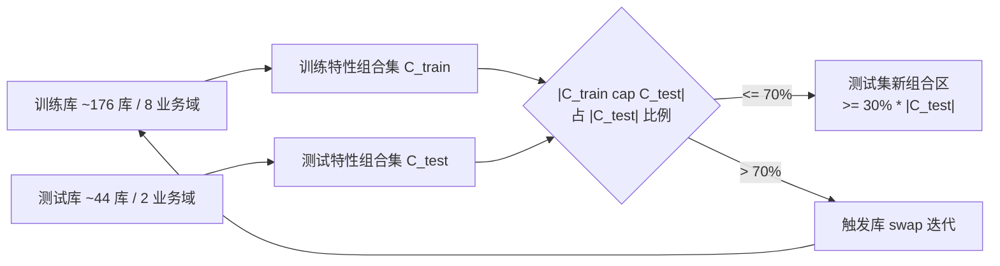

# MonGen 数据集设计

> 文档定位: 阐述 MonGen 基准的设计目标、规模、记录形式与切分策略
> 目标读者: 团队成员 / 复现者 / 评审
> 前置阅读: [01 任务定义](./01_task_definition.md)
> 最近更新: 2026-04-17

<a id="02-0"></a>
## 0. 摘要

MonGen (Mongo-native Generative Benchmark) 是首个让 **schema-less 成为一等公民** 的 Text-to-NoSQL 评估基准, 目标规模 **20,000 对 (NLQ, MQL)**, 覆盖 **200+ 逻辑库 / 10 大业务场景**, 每条 gold MQL 配 5 条等义 NLQ 改写。MonGen 不再依赖任何关系数据库的转换, 而是由 `Document Accreter` 通过事件驱动沉积合成异质文档库, 由 `MRL Sampler` 在 MRL (Meaning Representation Language) 层面定义查询意图, 再编译出 MQL 与 NLQ 骨架。

MonGen 的设计围绕四条核心原则: (i) **schema-less native** —— 同 collection 内文档结构差异化是常态而非例外; (ii) **MongoDB-aligned** —— 17 项 MongoDB 原生特性 checklist 触达率 ≥5%, 完整覆盖稀疏字段、动态键、`Decimal128`/`GeoJSON` 等原生 BSON 类型与 `$lookup`/`$graphLookup`/`$objectToArray` 等关键算子; (iii) **reverse-verified** —— 每条 (NLQ, MQL) 由独立 `Reverse Verifier` 复算, 执行结果一致才入库; (iv) **multi-faceted difficulty** —— 难度由 pipeline 深度、特性组合、歧义度三维加权。差异化方面, MonGen 以 MRL 为机械验证锚点, 实施 **cross-domain + cross-feature** 双切分, 测试集至少 30% 是训练期未出现的 MongoDB 特性组合, 真正度量 "组合泛化" 能力。

<a id="02-1"></a>
## 1. 设计目标与原则

本节展开 §0 摘要中提出的四条原则。每条原则都先回答 "为何这样设计", 再给出对应的工程化指标。

<a id="02-1-1"></a>
### 1.1 schema-less native

> 为何这样设计: 现有 Text-to-NoSQL 数据多来自关系表的简单嵌套化, 同 collection 内文档结构高度同质, 模型只要学会 "表 → collection" 的字段映射即可作弊式通过评估, 无法触达 NoSQL 真正的难点 —— 字段稀疏、类型多态、键集合演化。

落地指标:

- 同一 collection 内必须出现 **≥3 种 distinct 文档结构** (字段集合差异 + 类型差异)
- 全库平均字段稀疏率 ≥30% (即任一文档对全集字段集的平均缺失率)
- 异质来源仅允许 `Document Accreter` 的事件流沉积, 禁止由扁平表加嵌套人工拼出

<a id="02-1-2"></a>
### 1.2 MongoDB-aligned

> 为何这样设计: 评估基准若只覆盖 `find` + `$match` + `$project`, 就无法度量模型对 MongoDB 真正生产特性的掌握; 反过来, 若特性铺得过散又无重点, 单项触达率不足以做统计推断。MonGen 用 17 项 checklist 锁定边界, 并对每项设最低触达率 5%。

特性 checklist (F1-F17, 类别与具体描述见 §4 与下表):

| 类别 | 特性 ID 区间 | 关键覆盖物 |
|---|---|---|
| Schema 异质 | F1-F4 | 稀疏字段、多态类型、可选嵌套、数组元素多态 |
| 动态键 | F5-F7 | 日期/租户作 key、`$objectToArray` 转映射、key 集合演化 |
| 原生 BSON | F8-F11 | `ObjectId`、`Decimal128`、`Date`、`GeoJSON Point/Polygon` |
| 文档形态 | F12-F14 | 嵌入 vs 引用并存、多版本共存 (schema version drift)、大数组/bucket pattern |
| 查询算子 | F15-F17 | `$exists`/`$type` 存在性、`$lookup` with pipeline + `$graphLookup`、`$unwind` + preserveNullAndEmptyArrays |

每项预期触达率详见 [§2 表 2.4](#02-2)。

<a id="02-1-3"></a>
### 1.3 reverse-verified

> 为何这样设计: LLM 直接生成 (NLQ, MQL) 对存在双向幻觉风险 —— NLQ 与 MQL 看似匹配但执行语义不一致。MonGen 引入独立的 `Reverse Verifier` Agent, 从 NLQ 反向重新生成一条 verifier MQL, 在同一 MongoDB 实例上执行并比对结果集, 仅当行级结构一致 (排序无关时稳定排序后比对) 才入库。

落地指标:

- `reverse_verification.status = "pass"` 是入库充要条件
- `reverse_verification.match_ratio ≥ 0.95` (允许少量 BSON 类型抖动如 `int` vs `long`)
- Reverse Verifier 与 Sampler 必须使用 **异构模型源**, 避免同源 LLM 同时出错的盲区

<a id="02-1-4"></a>
### 1.4 multi-faceted difficulty

> 为何这样设计: 单纯按 pipeline 长度划分难度会把 "5 阶段简单 `$project` 链" 与 "2 阶段含 `$graphLookup` 递归" 错分到同档。MonGen 的 `difficulty_score` 由 pipeline 深度、激活特性数、歧义度 (NLQ 对 MQL 的多解程度) 三维加权得到, 落入 `[0, 1]` 区间。

目标分布:

| 难度档位 | `difficulty_score` 区间 | 目标占比 |
|---|---|---|
| easy | `[0.0, 0.33)` | 40% |
| medium | `[0.33, 0.67)` | 40% |
| hard | `[0.67, 1.0]` | 20% |

本节原则服务于 [01 §1 任务形式化定义](./01_task_definition.md#01-1) 界定的 Text-to-NoSQL 任务。

<a id="02-2"></a>
## 2. 数据规模与统计

> 为何这样设计: 规模指标 (库数、样本数、特性触达率) 决定 benchmark 的统计置信度与表征能力。MonGen 将 4 张表分别覆盖 "库与集合层 / 业务域分布 / 算子频次 / 17 特性触达率", 任一维度都可独立溯源到设计目标。

<a id="02-2-1"></a>
### 表 2.1 库与集合层

| 维度 | 预期数值 | 说明 |
|---|---|---|
| 逻辑库数 | 220 (200+ 目标) | 由 `Document Accreter` 按业务剧本独立沉积 |
| 业务领域数 | 10 | 电商 / IoT / 日志 / CMS / 社交 / 金融 / 医疗 / 游戏 / SaaS / 教育 |
| 每库 collection 数 | 3 - 8 (中位 5) | 与业务剧本复杂度相关 |
| 每库平均文档数 | 1,100 | 涵盖热点与长尾 |
| 文档数范围 | 50 - 50,000 | 反映真实生产分布的长尾 |
| 同 collection 内 distinct 文档结构数 | 4 - 7 (中位 5) | schema-less 异质度的核心刻画 |
| 平均字段数 (库内) | 45 | 含嵌套字段递归展开 |
| 字段稀疏率 | 35% | 任一文档对全集字段的平均缺失率 |

设计论证: 文档数与字段数的范围刻意拉开两个数量级, 是为了让评估能区分 "样本受限 / 字段稀疏" 与 "样本充足 / 字段稠密" 两种 workload 下的模型表现; 同 collection 内 distinct 结构数的中位 5 是 §1.1 schema-less 原则的硬约束实例化。

<a id="02-2-2"></a>
### 表 2.2 每业务域样本分布

| 业务域 | 预期占比 | 备注 |
|---|---|---|
| 电商 | 14% | 订单 / 库存 / 评价 / 推广位 |
| IoT | 13% | 时序 + 设备影子 + 告警 |
| 日志 | 13% | 应用日志 / 审计日志 / 异常 |
| 社交 | 12% | 用户 / 关系 / 动态 / 私信 |
| 金融 | 12% | 账户 / 交易 / 风控 / 对账 |
| SaaS | 8% | 多租户 + 订阅 + 配额 |
| CMS | 7% | 文档 / 分类 / 评论 / 修订 |
| 医疗 | 7% | 病例 / 检验 / 处方 |
| 游戏 | 7% | 角色 / 物品 / 战局 / 商城 |
| 教育 | 7% | 课程 / 学员 / 作业 / 评测 |
| 合计 | 100% | |

设计论证: 5 个高占比业务域 (电商 / IoT / 日志 / 社交 / 金融) 共占 64%, 集中刻画 "数据量大 + 形态多样" 的主流 MongoDB workload; 其余 5 个业务域均匀铺开 7% - 8%, 保证长尾领域至少有数百样本支撑分项指标统计。

<a id="02-2-3"></a>
### 表 2.3 算子频次分布 (预期)

| 算子 / 类别 | 预期占比 | 设计含义 |
|---|---|---|
| `aggregate` | 78% | 聚合管道是主流, 反映真实 MongoDB 业务复杂度 |
| `find` | 22% | 单 collection 简单查询保留比例 |
| `$match` | 62% | 过滤是绝大多数 pipeline 第一阶段 |
| `$project` | 85% | alias 与字段重排几乎无所不在 |
| `$sort` | 28% | 排序与 `$limit` 配对场景 |
| `$limit` | 20% | Top-K / 分页 |
| `$group` | 32% | 聚合维度统计 |
| `$unwind` | 38% | 数组路径展开是异质数据的常见前置 |
| `$lookup` | 18% | 跨 collection 关联 |
| `$graphLookup` | 5% | 递归关系 (评论树 / 组织架构 / 转账链) |
| `$objectToArray` | 10% | 动态键转可聚合数组 |
| `$exists` | 12% | 字段存在性判断 |
| `$type` | 8% | 类型判断 (多态字段路由) |

设计论证: `$objectToArray` / `$exists` / `$type` 三个算子合计 ≥30% 触达, 是对 Text-to-SQL benchmark 缺失的 "schema-less 算子空白" 的直接补足; `$graphLookup` 显式列出 5%, 保证递归图查询不会被边缘化。

<a id="02-2-4"></a>
### 表 2.4 17 特性触达率 (F1-F17)

| ID | 特性 | 预期占比 | 设计动机 |
|---|---|---|---|
| F1 | 稀疏字段 sparse | 45% | schema-less 最常见表现, 高频是基础 |
| F2 | 多态类型 polymorphic | 22% | 字段类型跨版本迁移 |
| F3 | 可选嵌套层 optional nesting | 35% | 子文档存在与否 |
| F4 | 数组元素多态 array-of-union | 14% | 同数组不同元素 schema |
| F5 | 日期 / 租户作 key | 12% | 时间分桶 / 多租户分区 |
| F6 | `$objectToArray` 可转映射 | 10% | 动态键查询的核心算子 |
| F7 | key 集合随文档演化 | 8% | tag map / 配置 map |
| F8 | `ObjectId` | 60% | MongoDB 默认主键, 普遍存在 |
| F9 | `Decimal128` | 11% | 金融场景必备 |
| F10 | `Date` | 55% | 时间字段在大多数业务出现 |
| F11 | `GeoJSON Point / Polygon` | 7% | 地理查询 (`$geoNear` / `$geoWithin`) |
| F12 | 嵌入 vs 引用并存 | 30% | 同库混用模式 |
| F13 | 多版本共存 (schema version drift) | 25% | 长期演化的真实表现 |
| F14 | 大数组 / bucket pattern | 9% | 时序分桶 / 评论分桶 |
| F15 | `$exists` / `$type` 存在性 | 18% | 异质字段过滤的核心 |
| F16 | `$lookup` with pipeline + `$graphLookup` | 16% | 复杂跨集合 + 递归图查询 |
| F17 | `$unwind` + preserveNullAndEmptyArrays | 13% | 处理空数组的关键开关 |

设计论证: 所有特性触达率 ≥5%, 满足 §1.2 的硬约束; F1 / F8 / F10 三项远高于其他特性, 因为它们是 MongoDB 几乎所有库都会出现的 "底色", 不刻意压低反而更贴近真实分布; F11 / F7 / F14 等小众特性保持 7% - 9%, 既稀缺到能形成评估难点又不至于样本不足。

<a id="02-3"></a>
## 3. 数据记录 schema

> 为何这样设计: 一条 MonGen 记录必须同时支撑 (i) 训练 / 评估时的 NLQ → MQL 监督, (ii) 执行验证, (iii) 难度分层与特性归因, (iv) 反向验证可追溯。下表字段是这四项需求的最小完备集。

| 字段 | 类型 | 设计含义 |
|---|---|---|
| `record_id` | int | 全局唯一 ID, 跨实验复现与错误归因主键 |
| `db_id` | str | 逻辑库标识, 与 `MonGen/mongodb_data/{db_id}.json` 一一对应 |
| `nl_queries` | list[str] (len=5) | 5 条等义 NLQ, 由 `NLQ Naturalizer` 在 NLQ 骨架基础上多风格改写 |
| `mql` | str | gold MongoDB 查询, 已在 mongosh 验证可执行 |
| `mrl` | dict | MRL 结构体 (YAML / JSON), 是 MQL 与 NLQ 的共同祖先 |
| `exec_result_head` | list[dict] | gold MQL 执行结果前 N 行, 已归一化 (字段顺序 / BSON 类型) |
| `feature_ids` | list[str] | 该样本激活的 F1-F17 子集, 例如 `["F2","F5","F15"]` |
| `difficulty_score` | float | `[0, 1]` 区间难度分, 三维加权产物 |
| `reverse_verification` | dict | `{status: "pass"/"fail", verifier_mql: str, match_ratio: float}` |

字段动机要点:

- **新增 `mrl`**: MRL 是 MQL 与 NLQ 的共同祖先, 也是机械验证的锚点。模型微调阶段可选用 MRL 作为中间监督信号 (NLQ → MRL → MQL) 来缓解长程歧义。
- **新增 `reverse_verification`**: 显式存储 verifier MQL 与执行匹配率, 让评估方可在样本级追溯 "本条样本是否经过反向闭环", 也便于剔除高风险样本做消融。
- **`exec_result_head` 归一化**: 字段按字典序排序、`Decimal128` 序列化为字符串、`Date` 统一为 ISO-8601 字符串。这样做是为了让评估侧的结果比对不被无关的格式抖动 (如 BSON 整数类型分桶) 触发假阴性。

MRL 字段结构详见 [03 §3 MRL 与编译器](./03_dataset_construction.md#03-3); 执行结果归一化规则与写盘时机详见 [03 §7 记录写盘格式](./03_dataset_construction.md#03-7)。

<a id="02-4"></a>
## 4. MongoDB 库形式

> 为何这样设计: MonGen 的核心特征是 "同 collection 内文档结构差异化"。本节用电商 `orders` 集合的三种文档形态实例化这一原则, 并标注每种形态激活了哪些 F1-F17 特性。

文档形态一: **legacy** (v1 订单, 早期版本, 无 `paid_at` 字段, 用 `Decimal` 字符串存金额)

```json
{
  "_id": ObjectId("65a000000000000000000001"),
  "schema_version": 1,
  "user_id": ObjectId("65a000000000000000000100"),
  "items": [
    {"sku": "A-001", "qty": 2, "price": "19.90"}
  ],
  "total": "39.80",
  "created_at": ISODate("2023-01-15T08:00:00Z"),
  "status": "paid"
}
```

激活特性: F8 (`ObjectId`) / F10 (`Date`) / F13 (旧版 schema 共存)。注意 `total` / `price` 此版本是字符串, 与下面 v3 的 `Decimal128` 形成 F2 多态类型对照。

文档形态二: **current** (v3 订单, 含 `paid_at`、`shipping.location` GeoJSON、`metadata` 动态键 object)

```json
{
  "_id": ObjectId("66f000000000000000000010"),
  "schema_version": 3,
  "user_id": ObjectId("65a000000000000000000200"),
  "items": [
    {"sku": "A-001", "qty": 1, "price": NumberDecimal("19.90"), "kind": "physical"},
    {"sku": "GIFT-50", "value": NumberDecimal("50.00"), "kind": "voucher"}
  ],
  "total": NumberDecimal("69.90"),
  "currency": "CNY",
  "created_at": ISODate("2026-03-20T10:11:00Z"),
  "paid_at": ISODate("2026-03-20T10:12:30Z"),
  "shipping": {
    "address": "Hangzhou, Zhejiang",
    "location": {"type": "Point", "coordinates": [120.15, 30.27]}
  },
  "metadata": {
    "2026-03-20": {"campaign": "spring", "coupon": "SP10"},
    "2026-03-25": {"refund_request": true}
  },
  "status": "shipped"
}
```

激活特性: F1 (`paid_at` 在 legacy 缺失即稀疏) / F2 (`total` 类型从 string 变 `Decimal128`) / F3 (`shipping` 子文档可选) / F4 (`items` 数组同时含 `physical` 与 `voucher` 多态结构) / F5 (`metadata` 用日期作 key) / F6 (`metadata` 可由 `$objectToArray` 转聚合) / F7 (`metadata` key 集合随文档演化) / F9 (`Decimal128`) / F10 (`Date`) / F11 (`shipping.location` GeoJSON Point)。

文档形态三: **partial** (订单已取消, 仅保留追溯所需的最小字段集, 同 collection 内的 "瘦身文档")

```json
{
  "_id": ObjectId("66f000000000000000000099"),
  "schema_version": 3,
  "user_id": ObjectId("65a000000000000000000300"),
  "created_at": ISODate("2026-03-22T07:45:00Z"),
  "status": "cancelled",
  "cancel_reason": "user_request"
}
```

激活特性: F1 (大量字段缺失) / F8 / F10 / F13 (与 v3 完整文档结构差异巨大但 schema_version 同为 3, 体现版本内的形态分支)。

要点: 上述三种形态在同一 `orders` collection 内并存, 是 MonGen 区别于关系表派生数据集的核心标志。模型若按 "字段一定存在" 的假设生成 MQL, 在 partial 与 legacy 文档上必然产生空集或 `BSONTypeError`; 反之必须主动加入 `$exists` (F15) 与 `$type` 路由 (F2) 才能稳定返回。

上述库形态的合成方式详见 [03 §2 数据库正向构建](./03_dataset_construction.md#03-2)。

<a id="02-5"></a>
## 5. 切分策略

> 为何这样设计: 仅按 db_id 做 cross-domain 切分不足以度量组合泛化 —— 不同库可能在不同业务域中复用同一组 MongoDB 特性组合, 模型仍可记忆 "见到 `$objectToArray` + `$exists` 就这么写"。MonGen 在 cross-domain 之上叠加 cross-feature 维度, 强制测试集中至少 30% 的特性组合在训练集未出现。

<a id="02-5-1"></a>
### 5.1 双维切分动机

| 维度 | 单独使用的局限 | 叠加后的收益 |
|---|---|---|
| cross-domain (按 db_id) | 库不同但 feature 组合可能完全重合, 模型仍可短路 | 杜绝 schema 记忆 |
| cross-feature (按 feature_ids 集合) | 同库内的 feature 组合无法天然区分训练 / 测试 | 度量组合泛化 |
| cross-domain + cross-feature | —— | 既测新库适应又测新特性组合, 真正逼近生产部署的 zero-shot 情形 |

<a id="02-5-2"></a>
### 5.2 切分伪代码

```text
function split(libs, train_ratio = 0.8, novel_combo_ratio = 0.3):
    domains = group_by_domain(libs)
    train_domains, test_domains = sample_domains(domains, train_ratio)
    train_libs = libs filtered by train_domains
    test_libs  = libs filtered by test_domains

    train_combos = collect_feature_id_sets(samples_in(train_libs))
    test_combos  = collect_feature_id_sets(samples_in(test_libs))

    novel_in_test = test_combos - train_combos
    while |novel_in_test| / |test_combos| < novel_combo_ratio:
        candidate = pick_lib_with_overrepresented_combo(train_libs)
        replacement = pick_lib_with_novel_combo(test_libs)
        swap(candidate, replacement)
        recompute(train_combos, test_combos, novel_in_test)

    return train_libs, test_libs
```

实施约束: 切分粒度始终是 **逻辑库**, 单库内的样本不会被分裂到训练 / 测试两侧, 避免 schema 泄漏; 若强制 30% novel combo 的迭代收敛失败 (例如某些特性组合天然只出现在少数业务域), 则降级到 25% 并记录到 §Y 风险项。

<a id="02-5-3"></a>
### 5.3 train / test 覆盖关系



train / test 比例约 8:2, 落到样本层目标为 train ≈ 16,000 / test ≈ 4,000。

<a id="02-6"></a>
## 6. 与现有 benchmark 对比

> 为何这样设计: 横向对比能直观说明 MonGen 在哪些维度填补了空白。MonGen 的独特组合是 "schema 异质 + 17 特性覆盖率 + 独立 Agent 逆向验证", 此前任何 Text-to-SQL 基准均未具备。

| 基准 | 规模 | 任务 | gold 可执行 | 多 NLQ | schema 异质 | 特性覆盖率 | 逆向验证 |
|---|---|---|---|---|---|---|---|
| WikiSQL | ~80k | Text-to-SQL | 部分 | 否 | 否 (扁平表) | N/A | 否 |
| Spider | 10,181 | Text-to-SQL | 是 | 否 | 否 (关系表) | N/A | 否 |
| BIRD | 12,751 | Text-to-SQL | 是 | 否 | 否 (关系表) | N/A | 否 |
| **MonGen** | **20,000** | **Text-to-NoSQL (MongoDB)** | **是 (mongosh)** | **5 条** | **是 (事件驱动沉积)** | **17 特性 ≥5%** | **是 (独立 Agent)** |

对比要点:

- 规模上 MonGen 处于中等量级, 与 BIRD 同数量级, 显著小于 WikiSQL, 但每条样本的信息密度更高 (5 条 NLQ + MRL + 反向验证元数据)。
- 任务上 MonGen 是首个面向 MongoDB 的、强调 schema-less 与 17 项原生特性覆盖的可执行基准。
- "schema 异质" 与 "逆向验证" 两列为 MonGen 独有, 是与既有 Text-to-SQL 基准的本质差异化, 也是 Text-to-NoSQL 评估范式的填空。

<a id="02-7"></a>
## 7. 已知偏差

- **业务场景的领域偏差**: 10 个业务域由 LLM 生成的剧本驱动, 仍无法覆盖全部生产场景 (如 LBS / 区块链账本 / 边缘计算指标), 因此 MonGen 的特性分布是 "10 域加权平均" 的偏估而非全域无偏估计。
- **事件流模拟与真实生产 workload 的分布差距**: `Document Accreter` 的事件模板由人工/LLM 草拟, 时间戳分布、热点 key 分布、写入并发模式与真实业务存在系统性差距, 评估上的 EX 上限与生产实测的 EX 不可线性外推。
- **Reverse Verifier 自身的 LLM 偏差**: 若 Reverse Verifier 与 Sampler 同源 (例如同为某家 LLM 同版本), 二者会同时对相同语言现象误解, 反向验证会失去独立性。MonGen 的对策是强制使用异构模型源, 但异构组合的覆盖度仍有限。
- **MRL 原语表覆盖有限**: MRL 顶层 `intent` / `scope` / `projection` / `grouping` / `ordering` / `limits` / `features` / `difficulty` 八字段所能表达的算子是 MongoDB 全集的子集, 例如 `$densify` / `$fill` / `$setWindowFields` 等较新算子可能暂未编入, 此类查询不会进入 MonGen, 形成盲区。
- **`difficulty_score` 公式的经验加权**: 三维加权 (pipeline 深度 / 特性数 / 歧义度) 的权重由人工经验设定, 与人类标注员的认知难度评级的相关性尚未做统计验证, 难度分层可能存在系统性误判。

<a id="02-X"></a>
## X. 主要构件清单

| 主题 | 文件 / 目录 |
|---|---|
| MonGen 训练集 | [MonGen/train.json](../MonGen/train.json) |
| MonGen 测试集 | [MonGen/test.json](../MonGen/test.json) |
| MongoDB 数据目录 | [MonGen/mongodb_data/](../MonGen/mongodb_data/) |
| MongoDB schema 目录 | [MonGen/mongodb_schema/](../MonGen/mongodb_schema/) |
| MRL YAML 目录 | [MonGen/mrl/](../MonGen/mrl/) |

<a id="02-Y"></a>
## Y. 未尽事项与已知风险

- TODO(@team): 真实生产 workload 对齐度量化 —— 取脱敏生产日志样本, 与 §2 表 2.3 的算子分布、表 2.4 的特性触达率做卡方对齐检验, 给出对齐度区间。
- TODO(@team): MRL 原语表完整性评估 —— 与 MongoDB Release Notes 的算子列表对齐, 输出覆盖率报告并制定原语扩充节奏。
- TODO(@team): 人工复核抽样规模敲定 —— 在 20,000 对中抽 1% - 2% 做人工 NLQ ↔ MQL ↔ exec_result 三向检查, 估计 Reverse Verifier 的实际假阳率。
- TODO(@team): `difficulty_score` 与人类认知难度的相关性验证 —— 邀请 ≥3 名 MongoDB 工程师对随机 200 条样本做难度评级, 计算 Spearman 相关系数, 必要时重标定权重。
- 风险: **特性分布漂移** —— 随 MonGen 后续迭代 (新版本 Sampler / Naturalizer), 各 F-ID 的实际占比可能偏离 §2 表 2.4 目标值, 需在每次重建后自动回归检查并出报告。
- 风险: **20,000 对目标规模的可达性** —— Sampler → Compiler → Naturalizer → Reverse Verifier 多道筛选下, 通过率未知。若实际通过率显著低于预期, 需调整 `MRL Sampler` 的特性组合采样权重以放大入库基数, 否则规模不达标。
- 风险: **cross-feature 切分迭代不收敛** —— 当某特性组合天然只出现在极少业务域时, 30% novel combo 约束可能强制把整域划入测试集, 引入域级泄漏的反向风险, 需要在迭代器中加入回退策略。
