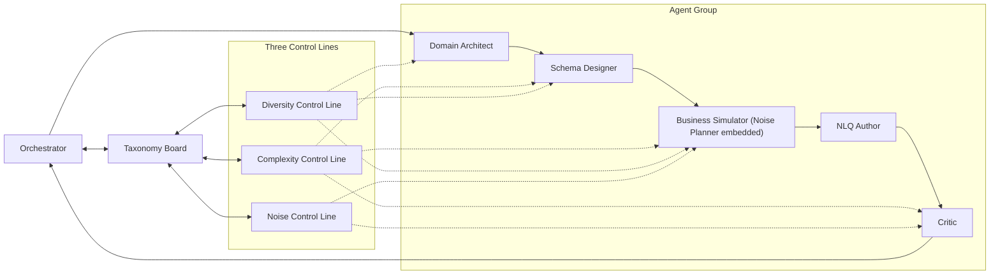
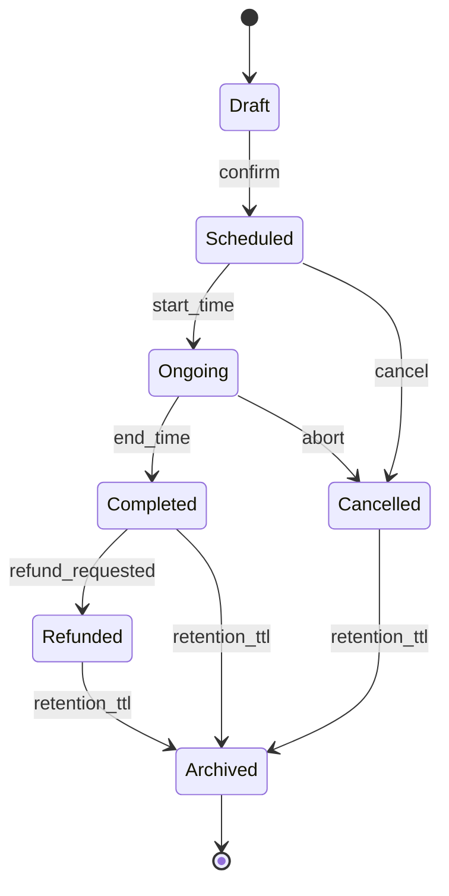
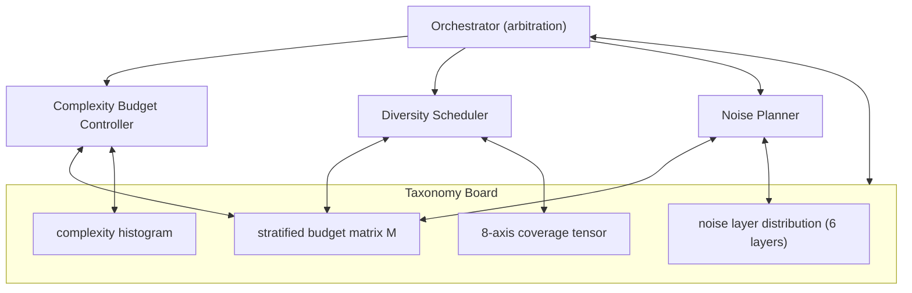

# 03 Agentic Database Synthesis

> 本文档是 **Agentic 数据库合成方法** 的 Single Source of Truth（SSoT）。
> 负责定义：6-Agent 协作框架、三线正交控制（Complexity / Diversity / Noise）、Taxonomy Board 共享态、以及与下游 [04 Dataset Construction](./04_dataset_construction.md) 的接口契约。

---

<a id="03-0"></a>
## §0 摘要

本节给出本文档的定位与五条核心原则。

- **本文档是 Agentic 数据库合成方法的 SSoT**。所有"如何把一个业务想法长成一个可被 NLQ 提问、可被 MQL 求解的 NoSQL 数据库"的决策，都收敛在本文档。
- 下游规整化、record schema 落盘、切分与 QA 汇入由 [04 §3](./04_dataset_construction.md#04-3) 起接管；资产落盘形态与路径由 [02 §1](./02_dataset_design.md#02-1) 登记；任务 IO 与正确性锚 ≡_rec 由 [01 §1](./01_task_definition.md#01-1) 定义。

**五条核心原则**

1. **业务驱动（非 schema 驱动）**：先立题一个真实业务叙事（who / what / why），再由 Business Simulator 用离散事件生成具体数据，schema 只是叙事的副产物，而不是起点。这保证字段不是凭空捏造的装饰，而是某条业务事件链的可观测残留。
2. **三线正交控制**：Complexity / Diversity / Noise 三个维度被显式解耦为三条独立的控制线，各自拥有独立的 Budget、独立的 Scheduler、独立的 Auditor，共享同一张 Taxonomy Board。噪声轴覆盖 6 层（Literal / Structural / Semantic / Historical / Pollution / Type-Polymorphism）、topology 轴覆盖 $\mathcal{F}_{topo}$ 特性集合，nosql_nativeness 作为独立多样性轴参与 Taxonomy Board 调度。
3. **预算化调度**：154 databases / 105 domains / 347 collections / 17,020 records 的覆盖，不是事后统计的结果，而是 `Stratified Budget Matrix` 事前声明、事中消费、事后校验的结果。
4. **SI 耦合**：每一条合成 record 输出的 `noise_plan` 都必须能无缝转译为 SI DSL 中的 `noise_policies` 字段（见 [04 §3](./04_dataset_construction.md#04-3)），字段名、类型、语义三端字面一致。这样 gold MQL 的每个去噪算子都与合成时注入的噪声条目形成一一对应的契约。
5. **完全可复现**：任何一条 record 的完整合成轨迹——domain 立题、schema 演化、world 采样、噪声注入——都由 `(db_id, record_id, noise_seed)` 三元组唯一确定，产物落盘为 `audit/*` 下的 `business_narrative.json` / `complexity_vector.json` / `noise_trace.json` 三件套（交由 [02 §1](./02_dataset_design.md#02-1) 登记）。

---

<a id="03-1"></a>
## §1 整体架构

Agentic 合成采用 **6-Agent 协作 + Taxonomy Board 共享态 + 三条 Control Line 横切**的结构。Orchestrator 负责调度与仲裁，5 个专业 Agent 负责具体工序，Taxonomy Board 在 Agent 之间同步"当前覆盖态"，三条 Control Line 读写 Taxonomy Board 并对每个 Agent 下发约束。

### §1.1 架构图



### §1.2 数据流

一条 record 从无到有的主路径是：

`Orchestrator → Domain Architect → Schema Designer → Business Simulator（内嵌 Noise Planner）→ NLQ Author → Critic → 入库 / 回炉`

- **Orchestrator** 首先读 Taxonomy Board，挑出一个"最缺覆盖"的 cell（8 轴单元格，见 [§4](#03-4)），连同一个 `target_difficulty` 一起发给 Domain Architect。
- **Domain Architect** 立题：给出 `domain_id`、一句业务叙事、一组核心实体与其业务语义。
- **Schema Designer** 在业务叙事上长出 schema：选嵌套 vs 引用、定 topology 特性集合、选 operator family 偏好、定 nosql_nativeness 目标档位。
- **Business Simulator** 拉起一个离散事件引擎，按状态机把业务跑一遍，产出 K=2 个 worlds 的原始数据；同时内嵌的 **Noise Planner** 按照 `noise_plan` 沿途注入噪声（不集中在 pipeline 末端）。
- **NLQ Author** 读当前 world，按 L0–L4 写 5 条 NLQ。
- **Critic** 在这 5 条 NLQ 上预估 gold MQL，跑 NormExec 自检，验证 `noise_plan` 中的每条噪声都有对应的去噪算子，并前置检查 nosql_nativeness 与 canonical_form_set 声明与 gold MQL AST 的一致性、以及 V7' SQL-bridge defeat 对抗准入先验。
- **Orchestrator** 根据 Critic 的判定决定：入库（写 `audit/*` 三件套，交下游 [04 §3](./04_dataset_construction.md#04-3)）、局部重做（只重跑某个 Agent）、或整体回炉（改 cell 重选）。

### §1.3 三条控制线的横切

Complexity / Diversity / Noise 不是 Agent，而是横切 Agent 群的"约束面"。它们的存在使得：

- 复杂度不由 Schema Designer 的冲动决定，而由 Complexity Budget 预算；
- 多样性不靠随机采样的运气，而由 Diversity Scheduler 基于 deficit 主动拉平，且 Diversity Scheduler 在 8 轴 × $\mathcal{F}_{topo}$ × nosql_nativeness 的联合 cell 上调度；
- 噪声不由 Business Simulator 的喜好决定，而由 Noise Planner 按噪声预算和 Noise Contracts 定向注入。

---

<a id="03-2"></a>
## §2 Agent 角色清单

| Agent | 职责 | 主输入 | 主输出 | 与 Complexity 线 | 与 Diversity 线 | 与 Noise 线 |
|---|---|---|---|---|---|---|
| Orchestrator | 调度、仲裁、资产签发 | Taxonomy Board 当前态、Critic 判定 | cell 指派、target_difficulty、回炉指令 | 下发 `budget_vector` $\vec{B}$ | 下发 cell 坐标 | 下发 `noise_budget_vector` |
| Domain Architect | 立题、业务画像 | cell 的 `T_domain` 轴取值 | `domain_id`、业务叙事、核心实体 | 确定 `C_intent` 的上游语义复杂度 | 填充 `T_domain` | 选噪声叙事模板 |
| Schema Designer | 长 schema、选 topology | 业务叙事、预算 `C_schema` / `C_nosql` / `C_cross` | `schema.json`、嵌套与引用结构 | 直接落 `C_schema` / `C_nosql` / `C_cross` | 填充 `T_pattern` / $\mathcal{F}_{topo}$ / `T_operator_family` / `T_nosql_nativeness`，选择 $\mathcal{F}_{topo}$ 特性集合 | 为 Noise Planner 暴露 target_field 候选 |
| Business Simulator | 离散事件、产出 worlds | schema、业务画像、参数 | K=2 个 worlds 数据、`world_signature` | 直接落 `C_data` | 填充 `T_nosql_feature_mix` | 内嵌 Noise Planner 按 `noise_plan` 注入 |
| NLQ Author | 写 5 NLQ（L0–L4） | world、schema、业务叙事 | 5 条 NLQ + 明确意图签名 | 直接落 `C_intent` / `C_query` | 填充 `T_difficulty` | 承接噪声的歧义语言表述 |
| Critic | 判 gold MQL、V 前置自检 | NLQ、world、`noise_plan` | gold MQL 候选、`pass_rate`、reject 原因 | 复核 $\vec{C}$ 与 $\vec{B}$ 偏差 | 复核 cell 单元格未越格 | 复核 Noise Contracts 四条均满足；前置检查 nosql_nativeness 与 canonical_form_set 声明与 gold MQL AST 的一致性；前置检查 V7' SQL-bridge defeat 对抗准入 |

说明：

- Critic 的 gold MQL 只在本阶段**初判**；最终 gold MQL 的固化与 V1'–V5' 验证（见 [04 §8](./04_dataset_construction.md#04-8)）、以及 V6' RP_diff 校准（见 [04 §9](./04_dataset_construction.md#04-9)）在下游完成。
- Critic 的 P1–P4（见 [01 §6](./01_task_definition.md#01-6)）先验检查属于本阶段快筛，重判仍以下游执行侧为准。
- Critic 的 V7' SQL-bridge 对抗先验属于本阶段快筛，重判以下游 [04 §8.6](./04_dataset_construction.md#04-8) 执行侧为准。

---

<a id="03-3"></a>
## §3 Complexity Control Line

本节定义如何测量、预算、注入与审计一条 record 的复杂度。

<a id="03-3-1"></a>
### §3.1 6 维复杂度向量 $\vec{C}$

$$\vec{C} = (C_{schema},\; C_{data},\; C_{intent},\; C_{query},\; C_{nosql},\; C_{cross})$$

每个分量均归一化到 $[0, 1]$，通过 `clip` 截断。$w_*$ 为权重，$Z_*$ 为分维常数，$\mathcal{F}_{nosql}$ 为受控 NoSQL 算子集合。

| 维度 | 含义 | 测量公式 | 取值范围 |
|---|---|---|---|
| $C_{schema}$ | schema 结构复杂度 | $C_{schema} = \mathrm{clip}_{[0,1]}\!\left(\dfrac{w_d \cdot d_{nest} + w_f \cdot \log_2(\lvert F \rvert + 1) + w_r \cdot \rho_{ref}}{Z_{schema}}\right)$ | $[0, 1]$ |
| $C_{data}$ | 数据规模与分布复杂度 | $C_{data} = \mathrm{clip}_{[0,1]}\!\left(\dfrac{w_v \cdot \log_{10}(\lvert D \rvert + 1) + w_s \cdot H_{norm}(D) + w_k \cdot \kappa(D)}{Z_{data}}\right)$ | $[0, 1]$ |
| $C_{intent}$ | NLQ 语义意图复杂度 | $C_{intent} = \mathrm{clip}_{[0,1]}\!\left(\dfrac{w_o \cdot \lvert \mathrm{ops}_{NLQ} \rvert + w_p \cdot n_{pred} + w_s \cdot d_{sem}}{Z_{intent}}\right)$ | $[0, 1]$ |
| $C_{query}$ | gold MQL 查询复杂度 | $C_{query} = \mathrm{clip}_{[0,1]}\!\left(\dfrac{w_s \cdot \lvert \mathrm{stages} \rvert + w_o \cdot \log_2(\lvert \mathrm{ops} \rvert + 1) + w_n \cdot d_{nest}^{Q}}{Z_{query}}\right)$ | $[0, 1]$ |
| $C_{nosql}$ | NoSQL 特性使用强度 | $C_{nosql} = \mathrm{clip}_{[0,1]}\!\left(\displaystyle\sum_{f \in \mathcal{F}_{nosql}} \lambda_f \cdot \mathbb{1}[f \in Q]\right)$ | $[0, 1]$ |
| $C_{cross}$ | 跨集合 / 跨域耦合度 | $C_{cross} = \mathrm{clip}_{[0,1]}\!\left(\dfrac{\lvert E_{cross} \rvert}{\lvert E_{total} \rvert + \epsilon}\right)$ | $[0, 1]$ |

其中：

- $d_{nest}$：schema 最大嵌套深度；$\lvert F \rvert$：总字段数；$\rho_{ref}$：引用密度。
- $\lvert D \rvert$：单个 world 下数据体量；$H_{norm}(D)$：关键字段取值归一化熵；$\kappa(D)$：高基数字段占比。
- $\lvert \mathrm{ops}_{NLQ} \rvert$：NLQ 中显式的聚合 / 筛选 / 排序等操作数；$n_{pred}$：谓词数；$d_{sem}$：需要的语义层级跳转数。
- $\lvert \mathrm{stages} \rvert$、$\lvert \mathrm{ops} \rvert$、$d_{nest}^{Q}$：gold MQL 的 stage 数、算子数、嵌套深度。
- $\mathcal{F}_{nosql}$：`$unwind / $lookup / $graphLookup / $facet / $bucket / $setWindowFields / $mergeObjects / $addFields / $map / $reduce / $objectToArray / $switch / $convert / $arrayElemAt / $filter` 等 NoSQL 典型算子。
- $E_{cross}$：跨 collection 的有效引用边；$E_{total}$：全部引用边。

<a id="03-3-2"></a>
### §3.2 Complexity Budget Controller

Orchestrator 基于 `target_difficulty` 从档位锚点产出预算向量 $\vec{B}$ 下发给 Schema Designer、Business Simulator、NLQ Author、Critic：

| 档位 | $B_{schema}$ | $B_{data}$ | $B_{intent}$ | $B_{query}$ | $B_{nosql}$ | $B_{cross}$ |
|---|---|---|---|---|---|---|
| easy | 0.20 | 0.20 | 0.20 | 0.20 | 0.20 | 0.10 |
| medium | 0.50 | 0.50 | 0.50 | 0.50 | 0.50 | 0.25 |
| hard | 0.70 | 0.70 | 0.70 | 0.70 | 0.70 | 0.50 |
| expert | 0.85 | 0.85 | 0.85 | 0.85 | 0.85 | 0.75 |

预算不是硬边界，而是**分量中心锚点**，配合 §3.4 的容差 $\tau$ 形成允许区。

<a id="03-3-3"></a>
### §3.3 Complexity Injector

注入点按分量分散布置：

- $B_{schema}$ / $B_{cross}$ → 写入 Schema Designer 的 prompt 与硬约束，如"至少 4 层嵌套"、"至少 1 条跨 collection 引用"。
- $B_{data}$ → 写入 Business Simulator 的参数，控制 worlds 中事件规模与分布偏斜。
- $B_{nosql}$ → 指定 Schema Designer 暴露哪些结构以自然吸引 `$unwind` / `$lookup` / `$addFields+$map` / `$switch on $type` / `$graphLookup` 等算子。$B_{nosql}$ 下发时联动 nosql_nativeness level 的目标档位（L0–L4）：L0 偏好无嵌套 / 单表意图，L4 偏好 shape-preserving / in-place array / `$graphLookup recursive`。
- $B_{intent}$ / $B_{query}$ → 约束 NLQ Author 产出的 NLQ 语义层级与 Critic 预估的 gold MQL stage 数下限。

**关键设计**：复杂度不是"在一个 Agent 里堆满"，而是**沿 pipeline 分散耦合**，避免某一维度过载（例如 $C_{nosql}$ 高但 $C_{data}$ 低会让 pipeline 显得"做作"）。

<a id="03-3-4"></a>
### §3.4 Complexity Auditor

record 产出后，Critic 重新测量 $\vec{C}_{measured}$，与预算向量 $\vec{B}$ 对比：

$$\mathrm{reject\ if}\quad \max_{i} \lvert C_{i,\mathrm{measured}} - B_i \rvert \;>\; \tau$$

默认 $\tau = 0.20$（每维）。越界时：

1. 若只有 1 维越界，下发**局部重做**给对应 Agent（例如 $C_{query}$ 越低则要求 NLQ Author 加复杂度）。
2. 若 $\geq 2$ 维越界或跨维失衡，交回 Orchestrator 做整体回炉。

审计结果写入 `audit/<db_id>/<record_id>/complexity_vector.json`。

---

<a id="03-4"></a>
## §4 Diversity Control Line

本节定义 8 轴 Taxonomy、Diversity Scheduler、以及防止 mode collapse 与轴间塌陷的机制。

<a id="03-4-1"></a>
### §4.1 8 轴 Taxonomy

| 轴 | 含义 | 取值集合（示例） |
|---|---|---|
| `T_domain` | 业务域 | 覆盖 105 个 domain（如 orchestra / hospital / logistics / academic / ecommerce / finance / …） |
| `T_pattern` | 查询意图模式 | 23 个 pattern（14 关系代数可表达 + 9 NoSQL-native）：`simple_filter` / `group_aggregate` / `top_k_by_aggregate` / `lookup_join` / `window_function` / `facet_split` / `graph_traverse` / `shape_preserving_augment` / `polymorphic_branch` / `type_introspection` / `dynamic_key_expansion` / `dynamic_key_aggregate` / `array_positional_select` / `nested_in_place_aggregate` / `graph_recursive_deep` / `null_vs_missing_disambig` / … |
| $\mathcal{F}_{topo}$ | schema 拓扑特性集合 | $\mathcal{F}_{topo} \subseteq \{\texttt{flat},\ \texttt{nested\_N\_deep (N}\in\{2,3,4,5+\}\texttt{)},\ \texttt{polymorphic\_collection},\ \texttt{dynamic\_key\_document},\ \texttt{sparse\_embedded},\ \texttt{mixed\_embed\_ref},\ \texttt{intentional\_denormalization}\}$ 的幂集经有效性剪枝；采样下限：easy 1 / medium 2 / hard 3 / expert 4+ |
| `T_operator_family` | MQL 算子族 | `shape_preserving_augment` / `aggregate_only` / `find_plus_project` / `lookup_heavy` / `graphlookup` / `facet_multi_branch` / `window_fn` / `polymorphic_switch` / `dynamic_key_ops` / `in_place_array_ops` / … |
| `T_difficulty` | 难度档 | `easy` / `medium` / `hard` / `expert`（与 §3.2 对齐） |
| `T_nosql_feature_mix` | NoSQL 特性混合 | 由 $\mathcal{F}_{nosql}$ 幂集离散化（扩展含 `$objectToArray`、`$switch`、`$convert`、`$map`、`$reduce`、`$arrayElemAt`、`$filter`、`$graphLookup with maxDepth ≥ 3` 等） |
| `T_noise_mix` | 噪声层混合 | 由 6 层噪声（Literal / Structural / Semantic / Historical / Pollution / Type-Polymorphism）的开关组合离散化 |
| `T_nosql_nativeness` | 意图的 NoSQL 原生度档 | L0 / L1 / L2 / L3 / L4；取值分布按 [04 §3.1](./04_dataset_construction.md#04-3) 的 `nosql_nativeness.level`；构造期目标 L2+ 占比 ≥ 40%、L4 占比 ≥ 15% |

<a id="03-4-2"></a>
### §4.2 Diversity Scheduler

单元格（cell）定义：8 轴 Taxonomy 的正交积 $\prod_i T_i$（其中 $\mathcal{F}_{topo}$ 的取值是特性幂集子集）经过离散化与剪枝后的有效组合。

调度优先级：

$$P(\mathrm{cell}) \;=\; \alpha \cdot \mathrm{deficit}(\mathrm{cell}) \;+\; \beta \cdot \mathrm{novelty}(\mathrm{cell}) \;-\; \gamma \cdot \mathrm{cost}(\mathrm{cell})$$

- $\mathrm{deficit}(\mathrm{cell}) = \max(0,\; \mathrm{target}(\mathrm{cell}) - \mathrm{current}(\mathrm{cell}))$：当前与目标覆盖差距。
- $\mathrm{novelty}(\mathrm{cell})$：§4.3 的 facility-location 边际增益。
- $\mathrm{cost}(\mathrm{cell})$：合成该 cell 的历史平均资源消耗（token、工序步数）。

**Viability 先验**：对每个 cell 维护一个 $v(\mathrm{cell}) \in [0,1]$，由历史成功率学得（已完成 / 已尝试）。最终派单时对 $P$ 做折减：

$$\tilde{P}(\mathrm{cell}) \;=\; v(\mathrm{cell})^{\eta} \cdot P(\mathrm{cell})$$

避免反复派到高优先但几乎不可能合成成功的 cell。

<a id="03-4-3"></a>
### §4.3 Novelty Gate

record 嵌入到特征空间 $\mathcal{X}$（编码 domain / schema / NLQ 语义）后，用 facility-location 边际增益：

$$g(x) \;=\; \Big(\max_{x' \in S \cup \{x\}} \phi(x, x')\Big) \;-\; \Big(\max_{x' \in S} \phi(x, x')\Big) \;\geq\; \epsilon$$

$S$ 为当前已入库语料池，$\phi(\cdot,\cdot)$ 为相似度函数。低于 $\epsilon$ 的新 record 被判为"近似重复"，回炉重做。

<a id="03-4-4"></a>
### §4.4 Mode Collapse Detector

若连续 $N$ 轮的合成产出落在同一 cell 族（例如相邻 8 轴坐标只差 1 维，且差在 `T_difficulty` 这种弱差异上），则对该 cell 族的调度权重做指数衰减：

$$w^{(t+1)}_{\mathrm{cell\ family}} \;=\; w^{(t)}_{\mathrm{cell\ family}} \cdot e^{-\lambda_{mc}}$$

直到调度跳出该族。默认 $N = 5$、$\lambda_{mc} = 0.5$。

<a id="03-4-5"></a>
### §4.5 Cross-Axis Correlation Watcher

滑窗内对 8 轴两两计算相关性（分类轴用 Cramér's V，数值轴用 Pearson）。若存在某对 $(T_i, T_j)$ 满足

$$\rho(T_i, T_j) \;>\; \rho_{\max}$$

（默认 $\rho_{\max} = 0.7$），则对该轴对做**强制去相关重派**：下一批 cell 派单优先选 $(T_i, T_j)$ 对角线之外的组合。典型场景：

- `T_domain = finance` 与 `T_pattern = window_function` 绑死时，强制扩展到其它 pattern；
- `T_nosql_nativeness = L0` 与 `T_operator_family = aggregate_only` 绑死时，强制向 `T_nosql_nativeness ∈ {L2, L3, L4}` 扩展。

---

<a id="03-5"></a>
## §5 Noise Control Line

本节定义噪声的分层、契约、计划、注入与守卫。

<a id="03-5-1"></a>
### §5.1 Noise Taxonomy 6 层主体

| 层 | 直觉 | 代表条目 |
|---|---|---|
| **Literal** | 写法层面不一致 | 拼写误差、编码变体、大小写漂移 |
| **Structural** | 文档结构层面不一致 | 字段缺失、嵌套层漂移、空数组 |
| **Semantic** | 业务语义层面不一致 | 状态别名、单位、时区 |
| **Historical** | 时间演化层面不一致 | schema 版本遗迹、重命名残留 |
| **Pollution** | 数据完整性层面不一致 | 重复、孤儿、部分写入 |
| **Type-Polymorphism** | 字段类型层面不一致 | 同字段多类型并存、BSON 类型混用、inline vs separated 共存 |

6 层是**主体框架**，具体条目共 36 条在附录 [§A](#03-A) 完整给出。

<a id="03-5-2"></a>
### §5.2 四条 Noise Contracts

> 这 4 条 Noise Contracts 是噪声模型的**硬契约**，任何不满足四条之一的 record 必须回炉。

1. **Noise-Intent 强耦合**：每一条注入的噪声条目必须对应至少一个 gold MQL 处理算子，从以下集合中选取：

   $$\mathcal{O}_{denoise} = \{\, \$\texttt{ifNull},\; \$\texttt{type},\; \$\texttt{convert},\; \$\texttt{exists},\; \$\texttt{regex},\; \$\texttt{addFields},\; \$\texttt{switch},\; \$\texttt{isNumber},\; \$\texttt{getField},\; \$\texttt{toString},\; \$\texttt{toDecimal},\; \$\texttt{toInt},\; \$\texttt{map},\; \$\texttt{reduce},\; \ldots \,\}$$

   这保证"噪声"与"gold MQL 的某条去噪算子"一一配对，没有孤立的、无处理算子可收的噪声。

2. **SI 策略显式声明**：在 SI（Synthesis Instruction）中，必须用 `noise_policies` 字段显式登记：注入了哪些噪声类型（`type_id`）、每个类型对应的去噪算子（`coupling_operator`）、以及该去噪算子在 SI 中的策略键（`si_policy_key`）。SI DSL 定义见 [04 §3](./04_dataset_construction.md#04-3)。

3. **噪声预算与可控性**：每条 record 维护一个 6 维噪声预算向量

   $$\vec{B}^{noise} = (b_{literal},\; b_{structural},\; b_{semantic},\; b_{historical},\; b_{pollution},\; b_{typepoly})$$

   注入计数满足 $n_{layer} \leq b_{layer}$ 于 6 层上都成立，且预算上限由 `target_difficulty` 与 cell 的 `T_noise_mix` 共同决定（由 Orchestrator 下发、Noise Planner 消费）。

4. **可复现**：噪声注入由三元组 $(\texttt{db\_id},\; \texttt{record\_id},\; \texttt{noise\_seed})$ 唯一确定。对同一三元组重跑整个 pipeline，必须得到字节级一致的 `noise_trace.json`。

<a id="03-5-3"></a>
### §5.3 Noise Planner

在 Business Simulator 阶段内嵌执行。产出 `noise_plan`，包含：

- `injection_schedule`：每条噪声挂钩到业务状态机的哪个状态转移或哪个事件时间戳，确保"噪声来自业务事件"而非事后点缀。
- `target_fields`：字段路径列表，使用点号路径表示嵌套。
- `coupling_operators`：每条噪声在 gold MQL 侧对应的去噪算子（满足 Noise Contract #1）。
- `layer_budget`：当前 record 在 6 层各自的剩余预算。

<a id="03-5-4"></a>
### §5.4 Noise Injector

实现策略：**Business Simulator 内嵌式分散注入**。

- 事件驱动：当状态机跑到某个状态转移，若 `injection_schedule` 在该事件上有命中，则当场修改事件的写入数据（例如把 `status = "completed"` 改写为别名 `"done"`，触发 `m_status_alias`）。
- 字段就地：直接修改将要落盘的 world document 子树，不在流水线末端做一次"全局污染扫描"。
- 一致性：同一条噪声在同一 record 的多次事件中保持一致注入规则（例如若选择 `"done"` 作为 `"completed"` 的别名，则整个 record 内所有命中位置都用 `"done"`，避免"半噪声"）。
- Type-Polymorphism 层的注入在事件写入时对字段类型做受控切换，例如 `p_duplicate` 写入时把 `amount` 字段换用 Decimal128 而非 double，保持跨文档一致的多态分布。

> 这一选择避免了"集中式 noise layer"把原本有业务故事的数据退化为随机扰动的问题。

<a id="03-5-5"></a>
### §5.5 Noise Guard

在 Critic 之前，自动化跑一次"gold MQL 在带噪 world 上的可执行性检查"：

- 若 gold MQL 的某个 stage 无法在带噪数据上得到非空 / 合理中间结果（例如 `$convert` 遇到完全无法解析的字符串），则回炉。
- 若 gold MQL 的某个去噪算子在该 record 的带噪 world 上从未被触发（即没有一条文档真的命中了它要处理的噪声），则说明 Noise Contract #1 只是纸面耦合，视为失败并回炉。

<a id="03-5-6"></a>
### §5.6 业务叙事模板

Noise Planner 不是凭空挑噪声类型，而是从"业务叙事模板"库里采样。示例：

- **"订单补录"** → 触发 `p_partial_write`（先建单后补字段）+ `p_silent_backfill`（后续批量回填缺失字段，无 audit 痕迹）+ `m_timezone_drift`（补录设备时区与原单据时区不一致）。
- **"租户合并"** → 触发 `s_dynamic_key_tenant`（两家租户 key 合并后的混合动态键）+ `p_duplicate`（同一实体在两端都存在）+ `h_denorm_rollback`（嵌入结构因规模压力退回引用结构）。
- **"状态码演化"** → 触发 `m_status_alias`（新老状态码共存）+ `h_deprecated_enum`（部分老值弃用但仍在历史数据中出现）+ `h_rename_residue`（伴随字段重命名残留）。
- **"系统割接"** → 触发 `h_split_ghost`（拆分后幽灵引用）+ `h_collection_split_trace`（新老集合并存）+ `s_nested_shift`（新老结构混用）。
- **"支付方式演化"** → 触发 `tp_union_payment`（部分订单 `payment` 为 `"paid_offline"` 字符串、部分为 `{method, amount, currency}` 对象）+ `m_currency_drift` + `h_deprecated_enum`。
- **"多币种计费"** → 触发 `tp_decimal_vs_double`（`amount` 早期为 double、后期为 Decimal128）+ `m_unit_mismatch` + `m_currency_drift`。
- **"客户端 ID 风格迁移"** → 触发 `tp_typed_vs_untyped`（`_id` 早期为字符串字面量、后期为 ObjectId）+ `m_id_format` + `h_rename_residue`。

这些模板以可枚举的 JSON 配置登记，保证 `noise_seed` → 模板 → 具体 `noise_plan` 的链路可复现。

---

<a id="03-6"></a>
## §6 Business Simulator

Business Simulator 是**离散事件驱动**的 world 生成器。它不是按字段顺序生成记录，而是按业务时间线生成事件、由事件自然写出数据。

<a id="03-6-1"></a>
### §6.1 事件引擎

- **事件类型**：业务领域各自定义，例如 `create_order` / `confirm_order` / `dispatch` / `complete` / `refund` / `archive`。
- **事件时间戳**：由泊松过程或自定义到达强度给出；事件在时间轴上单调推进，以支持 Historical 层噪声（如"2022-03 之后才有 `refund_reason` 字段"）。
- **因果依赖**：事件之间有前驱 / 后继关系（DAG），例如 `refund` 必依赖 `complete`。因果违反被视为非法轨迹。

<a id="03-6-2"></a>
### §6.2 驱动参数

| 参数 | 含义 | 与复杂度绑定 |
|---|---|---|
| 业务规模 | 每个 world 的实体数量（订单数、演出数等） | $C_{data}$ |
| 事件强度 | 单位时间事件到达率 $\lambda$ | $C_{data}$ |
| 状态机转移概率 | 每个状态的转出分布 | $C_{intent}$（间接影响意图语义丰度） |
| schema 演化频率 | 每 world 内预期发生的 schema 演化次数 | $C_{schema}$、Historical 层噪声 |
| 噪声预算 $\vec{B}^{noise}$ | 6 层注入上限 | 全部噪声层 |

<a id="03-6-3"></a>
### §6.3 业务状态机（示意）

以通用"业务作业"为例（适用于订单 / 演出 / 诊疗单 / 配送单）：



每个转移可挂钩 Noise Planner 的 `injection_schedule`，例如：

- `confirm` 转移上挂 `m_status_alias`（"confirmed" vs "scheduled"）。
- `complete` 转移上挂 `p_partial_write`（刚 complete 还没来得及写 `completion_summary`）。
- `abort` 转移上挂 `s_array_empty`（`shows: []`）。

---

<a id="03-7"></a>
## §7 Schema Evolution Simulator

Schema Evolution Simulator 在 Business Simulator 中作为子系统，负责让同一个 database 在其时间轴内"长出"schema 演化痕迹，为 Historical 层与 Type-Polymorphism 层噪声提供业务叙事支撑。

<a id="03-7-1"></a>
### §7.1 schema 演化时间轴

在每个 database 的时间轴内标注若干演化事件点：

- **字段重命名**：`founded_in` → `founding_year`（触发 `h_rename_residue`）。
- **类型收紧**：`date_string` → `ISODate`（触发 `m_unit_mismatch` / `$convert` 耦合）。
- **集合拆分**：原 `shows` 拆成 `performances` 和 `rehearsals`（触发 `h_collection_split_trace`、`h_split_ghost`）。
- **反规范化回退**：原本嵌入的 `conductor` 子文档因规模过大改为引用（触发 `h_denorm_rollback`）。
- **字段弃用**：`status = "planned"` 弃用、改用 `"draft"`（触发 `h_deprecated_enum`）。
- **类型收紧进化**：同字段从 `string` 过渡到 Decimal128 或 ObjectId（触发 `tp_numeric_string_mix` / `tp_typed_vs_untyped`）。

<a id="03-7-2"></a>
### §7.2 驱动效应

- 老数据保留老 shape 的残留，**不是**"向后兼容"，而是"历史痕迹"；
- $C_{nosql}$ 因为 gold MQL 需要用 `$ifNull`、`$lookup`、`$unionWith`、`$exists` 等去兼容历史数据而被推高；
- `T_noise_mix` 中的 Historical 层因此具有业务真实性，而不是凭空凑出的过期字段；
- Type-Polymorphism 层的历史痕迹在 $C_{nosql}$ 上体现为 gold MQL 需要 `$switch on $type` / `$convert`。

---

<a id="03-8"></a>
## §8 Taxonomy Board 与三线联动

Taxonomy Board 是三条控制线的**共享白板**，数据结构与访问协议在此定义。

<a id="03-8-1"></a>
### §8.1 Taxonomy Board 数据结构

```
TaxonomyBoard := {
  coverage_tensor  : Tensor[T_domain × T_pattern × F_topology × T_operator_family × T_difficulty × T_nosql_feature_mix × T_noise_mix × T_nosql_nativeness] -> int,
  noise_distribution : Map[layer -> Distribution over type_id],
  complexity_histogram : Map[dim -> Histogram over [0,1]],
  budget_matrix : StratifiedBudgetMatrix,
  mode_collapse_log : RingBuffer<cell_family>,
  cross_axis_corr : Matrix[8 × 8]
}
```

- `coverage_tensor`：8 轴正交积下每个 cell 的当前已产出数量，其中 $\mathcal{F}_{topo}$ 的取值是特性幂集子集、`T_nosql_nativeness` 的取值是 L0–L4。
- `noise_distribution`：6 层各自下 `type_id` 的出现频次分布，用于 §5 的噪声轴覆盖。
- `complexity_histogram`：6 维复杂度分量的直方图，用于 §3.4 的事后审计与档位漂移检测。
- `budget_matrix`：见 §8.2。

<a id="03-8-2"></a>
### §8.2 Stratified Budget Matrix

把"8 轴 cell × 复杂度桶 × 噪声预算"编码为一张三模张量 $\mathbf{M}$：

$$\mathbf{M}[\mathrm{cell},\; \mathrm{diff\_bucket},\; \mathrm{noise\_dim}] \;=\; \mathrm{quota}$$

- `cell`：8 轴坐标（来自 `T_domain / T_pattern / F_topology / T_operator_family / T_difficulty / T_nosql_feature_mix / T_noise_mix / T_nosql_nativeness`）；
- `diff_bucket`：`easy / medium / hard / expert`；
- `noise_dim`：`literal / structural / semantic / historical / pollution / typepoly`（6 层）。

三条控制线以**不同视图**消费同一张 $\mathbf{M}$：

- **Diversity Scheduler** 把 $\mathbf{M}$ 沿 `cell` 聚合，看哪些 cell 还欠配额 → 决定下一个派单的 cell 坐标。
- **Complexity Budget Controller** 把 $\mathbf{M}$ 沿 `diff_bucket` 聚合，检查档位覆盖是否均衡 → 给当前派单配 $\vec{B}$。
- **Noise Planner** 把 $\mathbf{M}$ 沿 `noise_dim` 聚合 + 当前 cell 的 `T_noise_mix` → 给当前 record 配 $\vec{B}^{noise}$。

> 同一张 $\mathbf{M}$ 保证三条线"只争配额、不争底表"，避免各自维护一份 budget 导致口径漂移。`cell` 指 8 轴坐标。

<a id="03-8-3"></a>
### §8.3 三线联动图



资产落盘：Taxonomy Board 每次派单前后都写快照到 `audit/taxonomy_board/board_snapshot_*.json`；`budget_matrix` 单独落盘到 `audit/taxonomy_board/budget_matrix.json`（供 [02 §1.1](./02_dataset_design.md#02-1) 登记）。

---

<a id="03-9"></a>
## §9 反馈回路

三级反馈保证合成不是单向流水线，而是有收敛能力的迭代系统。

<a id="03-9-1"></a>
### §9.1 Agent 内反馈

例：**Schema Designer 自反馈**。先产 schema 草案 → 自测 $C_{schema}$、$C_{cross}$ → 若偏离 $\vec{B}$ 则局部改写（提升 / 降低嵌套深度、增 / 减跨集合引用、调整 $\mathcal{F}_{topo}$ 特性集合），直到达到档位锚点再交棒给 Business Simulator。

<a id="03-9-2"></a>
### §9.2 Agent 间协商

例：**Business Simulator ↔ NLQ Author**。若 NLQ Author 发现当前 world 中不存在支持某类 NLQ（如 L4 specificity 要求的"指名道姓具体实体"）的数据，则回发 `data_request` 给 Business Simulator；后者在不违反 `noise_plan` 的前提下追加一批事件（而不是当场伪造数据），再把更新后的 world 交还 NLQ Author。

<a id="03-9-3"></a>
### §9.3 Orchestrator 仲裁

Critic reject 时，Orchestrator 根据 reject 原因做统一仲裁：

| Reject 原因 | 仲裁策略 |
|---|---|
| $\vec{C}$ 1 维越界 | 局部重做：仅重跑对应 Agent |
| $\vec{C}$ ≥ 2 维越界 | 整体回炉：重选 cell |
| Noise Contract #1 / #5 不满足 | 局部重做：重跑 Noise Planner + Business Simulator |
| Novelty Gate 未过 | 回炉：以更远的 cell 重选 |
| world 不支持任一 NLQ | 局部重做：仅重跑 Business Simulator 的事件生成 |
| Mode Collapse 命中 | 强制 cell 跳转：由 Diversity Scheduler 选非相邻 cell |
| V7' SQL-bridge 对抗先验命中 | 强制重合成：由 Noise Planner + Schema Designer 引入更多 NoSQL-exclusive 结构，目标是下一批候选在 V7' 上被接受 |

---

<a id="03-10"></a>
## §10 与下游 Dataset Construction 的接口契约

<a id="03-10-1"></a>
### §10.1 输出物清单

本文档产物，移交 [04 Dataset Construction](./04_dataset_construction.md)：

| 产物 | 路径 | 下游消费方 |
|---|---|---|
| canonical world data（K=2 worlds，每 record） | `worlds/<db_id>/<record_id>/world_{0,1}.json` | 交 04 规整化与汇入 |
| schema.json | `schemas/<db_id>.json` | 交 04 |
| `noise_plan` | `audit/<db_id>/<record_id>/noise_trace.json` 的上游结构 | 转译为 SI 的 `noise_policies` 字段，由 [04 §3](./04_dataset_construction.md#04-3) 消费 |
| `business_narrative.json` | `audit/<db_id>/<record_id>/business_narrative.json` | 留痕 |
| `complexity_vector.json` | `audit/<db_id>/<record_id>/complexity_vector.json` | 留痕 |
| `noise_trace.json` | `audit/<db_id>/<record_id>/noise_trace.json` | 留痕 |
| Taxonomy Board 快照 | `audit/taxonomy_board/board_snapshot_*.json` | 留痕 |
| Stratified Budget Matrix | `audit/taxonomy_board/budget_matrix.json` | 留痕 |

资产路径统一按 [02 §1.1](./02_dataset_design.md#02-1) 的资产清单格式登记。

<a id="03-10-2"></a>
### §10.2 与 SI DSL 的对齐

本节声明 `NoisePlan`（本文档输出）与 SI DSL 中 `noise_policies`（[04 §3](./04_dataset_construction.md#04-3) 消费）在字段名、类型、语义三个维度**字面一致**。字段字典如下：

| NoisePlan 字段 | SI `noise_policies` 字段 | 类型 | 语义 |
|---|---|---|---|
| `layer` | `layer` | `enum{Literal, Structural, Semantic, Historical, Pollution, Type-Polymorphism}` | 所属噪声层 |
| `type_id` | `type_id` | `string` | Noise Taxonomy 条目 id（见 [§A](#03-A)） |
| `target_field` | `target_field` | `string`（点号路径） | 注入目标字段 |
| `coupling_operator` | `coupling_operator` | `enum` over $\mathcal{O}_{denoise}$ | 绑定的 MQL 去噪算子 |
| `si_policy_key` | `policy_key` | `string` | SI 侧策略键，指向 SI 中的具体处理指令 |
| `budget_weight` | `budget_weight` | `float ∈ [0,1]` | 在 $\vec{B}^{noise}$ 中占用的权重 |
| `seed_offset` | `seed_offset` | `int` | 由 $(\texttt{db\_id}, \texttt{record\_id}, \texttt{noise\_seed})$ 派生 |
| `injection_hook` | `injection_hook` | `string` | 业务状态机事件锚点（用于可复现注入） |

对齐契约：

- 对每个 `layer ∈ {Literal, Structural, Semantic, Historical, Pollution, Type-Polymorphism}`，NoisePlan 的 `layer` 字段与 SI `noise_policies.applied_layers` 中的枚举字面严格对齐；
- `type_id` 取值范围为 [§A](#03-A) 附录中的 36 条条目；
- `coupling_operator` 枚举集合 $\mathcal{O}_{denoise}$ 取值范围：`$ifNull` / `$type` / `$convert` / `$exists` / `$regex` / `$addFields` / `$switch` / `$isNumber` / `$getField` / `$toString` / `$toDecimal` / `$toInt` / `$map` / `$reduce`；
- 对齐检查由 Critic 在入库前强制执行；任何一条 `noise_plan` 条目无法转译为合法 SI `noise_policies` 条目者一律 reject。

<a id="03-10-3"></a>
### §10.3 不做的事

本文档**不**定义：

- V1'–V5' 验证规则（属 [04 §8](./04_dataset_construction.md#04-8)）；
- V6' RP_diff 校准（属 [04 §9](./04_dataset_construction.md#04-9)）；
- V7' SQL-bridge defeat 构造期对抗准入（属 [04 §8.6](./04_dataset_construction.md#04-8)）；
- 6 项评测指标 EM / QSM / QFC / EX / EFM / EVM 及 QIM 诊断代理（属下游评测方案）；
- 求解侧（solver）的硬边界约束与 Forbidden operators 六件的执行侧拒绝策略。

本文档只保证：输出的 record 在"业务叙事、schema 结构、worlds 数据、noise_plan"四件套上形成闭环契约，其后一切验证 / 指标 / 求解行为不在本 SSoT 范围。

---

<a id="03-11"></a>
## §11 orchestra/99001 端到端 walkthrough

贯穿 6 个 Agent，给出 `record_id = 99001` 的完整合成轨迹。与 [01](./01_task_definition.md)、[02](./02_dataset_design.md)、[04](./04_dataset_construction.md) 字面一致：
`db_id = orchestra`、canonical NLQ (L1) = `"For each conductor, attach a total_performances field counting all performances across their orchestras, while preserving the original conductor document structure."`、`target_difficulty = medium`、`empirical_difficulty = medium`、`pass_rate = 0.6`、`idiomatic_score = 0.92`、`nosql_nativeness.level = L4`、`world_signature = sha256:9c1f4a...`。

<a id="03-11-1"></a>
### §11.1 Domain Architect

- Orchestrator 从 Taxonomy Board 取到 deficit 最大的 8 轴 cell：

  ```
  (T_domain               = orchestra,
   T_pattern              = shape_preserving_augment,
   F_topology             = {nested_4_deep, sparse_embedded},
   T_operator_family      = shape_preserving_augment,
   T_difficulty           = medium,
   T_nosql_feature_mix    = {$addFields, $map, $ifNull, $size, $sum},
   T_noise_mix            = {Structural},
   T_nosql_nativeness     = L4)
  ```

- Domain Architect 立题："古典音乐演出管理 SaaS 的子集，核心实体为 conductor / orchestra / performance / show；conductor 下嵌套 orchestra 数组，orchestra 下嵌套 performance 数组，performance 下嵌套 show 数组，共 4 层嵌套。`conductor.Name` 作为稀疏可选字段，仅在半数文档出现（`sparse_embedded` 特性）"。选 `domain_id = orchestra`。

<a id="03-11-2"></a>
### §11.2 Schema Designer

- 在业务叙事上长出 4 层嵌套 + `sparse_embedded` 特性：`conductor → orchestra[] → orchestra.performance[] → orchestra.performance.show[]`，`conductor.Name` 允许稀疏缺失。
- $\mathcal{F}_{topo}$ 取值 = `{nested_4_deep, sparse_embedded}`；`T_operator_family = shape_preserving_augment`；`T_nosql_nativeness = L4`。
- 目标 $\vec{B} = (0.50, 0.50, 0.50, 0.50, 0.60, 0.25)$。测量到 $C_{schema} \approx 0.55$，$C_{nosql} \approx 0.65$（为 shape-preserving + `$map` 留出用武之地），$C_{cross} \approx 0.30$。

<a id="03-11-3"></a>
### §11.3 Business Simulator

- 跑 $K = 2$ worlds，每 world 覆盖一个完整演出季（含 refund 分支）。
- Noise Planner 从"订单补录"相邻的"人员档案补录"模板派生出一条 Structural 层噪声：

  - `s_missing_field` on `conductor.Name`（对应 `Structural.sparse_optional_name` 的业务叙事），绑定 `$ifNull` 作为去噪算子。

- 落盘 `world_signature = sha256:9c1f4a...`。

<a id="03-11-4"></a>
### §11.4 NLQ Author

- 写 5 层 specificity 的 NLQ，`nlq_specificity_levels = ["L1", "L0", "L2", "L3", "L4"]`。

  - **L1（canonical）**：`"For each conductor, attach a total_performances field counting all performances across their orchestras, while preserving the original conductor document structure."`
  - **L0（模糊）**：`"Add performance totals to conductors."`
  - **L2（明确意图）**：`"For each conductor document in the conductor collection, add a field total_performances equal to the total count of entries in the embedded orchestra.performance arrays, without flattening the document."`
  - **L3（明确算子族）**：`"For each conductor document, augment with a top-level total_performances field aggregating the sizes of nested performance arrays; preserve the embedded orchestra-performance-show array structure."`
  - **L4（中文 / 指名道姓）**：`"在每位指挥家的文档上附加 total_performances 字段，记录其旗下所有乐团的演出总数，并保持原文档的嵌套结构不变。"`

<a id="03-11-5"></a>
### §11.5 Critic

- 预判 gold MQL 为单 stage `$addFields + $map + $ifNull + $size + $sum` 管道，字面如下（与共享契约一致）：

  ```javascript
  db.conductor.aggregate([
    { $addFields: {
        total_performances: {
          $sum: {
            $map: {
              input: { $ifNull: ["$orchestra", []] },
              as: "orch",
              in: { $size: { $ifNull: ["$$orch.performance", []] } }
            }
          }
        }
    } }
  ]);
  ```

- SI 模式 = `shape_preserving_augment`；`nosql_nativeness.level = L4`；`output.shape = shape_preserved_augmented`；`operator_family = "shape_preserving_augment"`。
- `tds_cell = "nested_4_deep+sparse_embedded × shape_preserving_augment × medium × schema_naive × english"`。
- `canonical_form_set = {must_contain: ["$addFields","$map"], must_not_contain_at_root: ["$unwind","$group"]}`；Critic 通过 AST 检查确认 gold MQL 根级不含 `$unwind` / `$group`，且包含 `$addFields` 与 `$map`。
- `noise_policies`：`applied_layers = [Structural]`，`type_ids = ["Structural.sparse_optional_name"]`，`coupling_operators = ["$ifNull"]`，`noise_seed = 42`。
- 与 NLQ L1 的意图签名匹配。
- P1–P4 自检通过（见 [01 §6](./01_task_definition.md#01-6)）；Noise Guard 通过（`s_missing_field` 能在带噪 world 上被 `$ifNull` 触发）；V7' SQL-bridge defeat 对抗准入先验通过（shape_preserving_augment 属 L4 形态，NL2SQL_panel ∘ sqltomongo_translator 预计难以生成等价 AST）。
- 自测 `pass_rate = 0.6`、`idiomatic_score = 0.92`、`target_difficulty = medium`、`empirical_difficulty = medium`。

<a id="03-11-6"></a>
### §11.6 Orchestrator

- 写 `audit/orchestra/99001/business_narrative.json`、`audit/orchestra/99001/complexity_vector.json`、`audit/orchestra/99001/noise_trace.json`、`audit/orchestra/99001/derived/canonical_form_set.json`、`audit/orchestra/99001/derived/sql_bridge_defeat.json`。
- 交付 [04 Dataset Construction](./04_dataset_construction.md) 规整化与汇入；同时更新 Taxonomy Board 的 8 维 `coverage_tensor` 与 6 层 `noise_distribution`。

<a id="03-11-7"></a>
### §11.7 `complexity_vector.json`（示例字段）

```json
{
  "db_id": "orchestra",
  "record_id": "99001",
  "target_difficulty": "medium",
  "empirical_difficulty": "medium",
  "budget_vector": {
    "C_schema":  0.50,
    "C_data":    0.50,
    "C_intent":  0.50,
    "C_query":   0.50,
    "C_nosql":   0.60,
    "C_cross":   0.25
  },
  "measured_vector": {
    "C_schema":  0.55,
    "C_data":    0.55,
    "C_intent":  0.50,
    "C_query":   0.55,
    "C_nosql":   0.65,
    "C_cross":   0.30
  },
  "max_deviation": 0.05,
  "tolerance_tau": 0.20,
  "within_tolerance": true
}
```

<a id="03-11-8"></a>
### §11.8 `noise_trace.json`（示例片段）

record 99001 的 `noise_seed = 42`，在 `T_noise_mix = {Structural}` 约束下仅含 1 条 Structural 层条目：

```json
{
  "db_id": "orchestra",
  "record_id": "99001",
  "noise_seed": 42,
  "entries": [
    {
      "layer": "Structural",
      "type_id": "s_missing_field",
      "target_field": "conductor.Name",
      "coupling_operator": "$ifNull",
      "si_policy_key": "name_sparsity_fallback",
      "injection_hook": "state:Draft"
    }
  ]
}
```

说明：`m_status_alias` / `h_rename_residue` / `l_typo_name` / `tp_union_payment` / 等其它层条目属于同一 `db_id` 下其它 record 的代表性噪声示例，不出现在 99001 的 `noise_trace.json`；record 99001 在 `T_noise_mix` 约束下仅 Structural 一层被激活。

---

<a id="03-12"></a>
## §12 符号表

| 符号 / 术语 | 含义 |
|---|---|
| $\vec{C}$ | 6 维复杂度向量 $(C_{schema}, C_{data}, C_{intent}, C_{query}, C_{nosql}, C_{cross})$ |
| $\vec{B}$ | 复杂度预算向量（按 `target_difficulty` 档位锚点） |
| $\vec{B}^{noise}$ | 6 层噪声预算向量 $(b_{literal}, b_{structural}, b_{semantic}, b_{historical}, b_{pollution}, b_{typepoly})$ |
| $\tau$ | 复杂度容差（默认 $0.20$） |
| $\mathcal{F}_{nosql}$ | 受控 NoSQL 算子集合 |
| $\mathcal{F}_{topo}$ | schema 拓扑特性集合（flat / nested_N_deep / polymorphic_collection / dynamic_key_document / sparse_embedded / mixed_embed_ref / intentional_denormalization） |
| $\mathcal{O}_{denoise}$ | 去噪算子集合（`$ifNull` / `$type` / `$convert` / `$exists` / `$regex` / `$addFields` / `$switch` / `$isNumber` / `$getField` / `$toString` / `$toDecimal` / `$toInt` / `$map` / `$reduce` 等） |
| $T_{\ast}$ | 多样性 8 轴：`T_domain / T_pattern / F_topology / T_operator_family / T_difficulty / T_nosql_feature_mix / T_noise_mix / T_nosql_nativeness` |
| `T_nosql_nativeness` | nosql_nativeness 档多样性轴（L0–L4），构造期目标 L2+ 占比 ≥ 40%、L4 占比 ≥ 15% |
| `tp_*` | Type-Polymorphism 层 6 条条目 `type_id` 前缀（`tp_union_payment` / `tp_numeric_string_mix` / `tp_array_or_scalar` / `tp_nested_vs_flat` / `tp_typed_vs_untyped` / `tp_decimal_vs_double`） |
| `canonical_form_set` | SI 中结构约束集合，含 `must_contain` / `must_not_contain` / `must_contain_at_root` / `must_not_contain_at_root` 四子集 |
| V7' | SQL-bridge defeat 构造期验证（[04 §8.6](./04_dataset_construction.md#04-8)） |
| $P(\mathrm{cell})$ | Diversity Scheduler 的 cell 优先级 |
| $v(\mathrm{cell})$ | cell 可合成性先验 |
| $g(x)$ | facility-location 边际增益（Novelty Gate） |
| $\epsilon$ | Novelty Gate 阈值 |
| $\rho_{\max}$ | 轴间相关性阈值（默认 $0.7$） |
| $K$ | 每 record 的 world 数（$K = 2$） |
| Orchestrator | 调度仲裁 Agent |
| Domain Architect | 业务立题 Agent |
| Schema Designer | schema 设计 Agent |
| Business Simulator | 离散事件 world 生成 Agent（内嵌 Noise Planner） |
| NLQ Author | 5 层 NLQ 作者 Agent |
| Critic | gold MQL 初判与 P1–P4 前置检查 Agent |
| Taxonomy Board | 三线共享白板 |
| Stratified Budget Matrix $\mathbf{M}$ | 三线共消费的 budget 底表 |
| NormExec / ≡_rec | 归一化执行与 record 级等价（见 [01 §3](./01_task_definition.md#01-3)） |
| P1–P4 | gold MQL 前置正确性约束（见 [01 §6](./01_task_definition.md#01-6)） |
| Forbidden operators 六件 | `$sample` / `$rand` / `$$NOW` / `$out` / `$merge` / `$function` |

---

<a id="03-A"></a>
## §A 附录：完整 Noise Taxonomy 清单

共 36 条，覆盖 6 层：Literal / Structural / Semantic / Historical / Pollution 各 6 条，Type-Polymorphism 6 条。`budget_dimension` 对应 $\vec{B}^{noise}$ 的某个分量。

| `type_id` | `layer` | `business_narrative` | `gold_coupling_operator` | `SI_policy_key` | `budget_dimension` | `example` |
|---|---|---|---|---|---|---|
| `l_typo_name` | Literal | 前台人工录入姓名时拼写错误 | `$regex` | `name_typo_tolerance` | `b_literal` | "Mozrt" 用于 "Mozart" |
| `l_polysemy` | Literal | 多义词导致的筛选歧义 | `$match` + `$or` | `polysemy_guard` | `b_literal` | "bass" 作乐器 vs 作声部 |
| `l_encoding_variant` | Literal | 字符编码变体共存 | `$regex` | `unicode_fold` | `b_literal` | "Beethoven" vs "Beethöven" |
| `l_whitespace` | Literal | 前后 / 中间空格不一致 | `$regex` / `$trim` | `whitespace_norm` | `b_literal` | `" Mahler "` vs `"Mahler"` |
| `l_case_drift` | Literal | 大小写漂移 | `$regex` (`/i`) | `case_insensitive` | `b_literal` | `"BACH"` vs `"bach"` |
| `l_unicode_nfc` | Literal | NFC / NFD 归一化差异 | `$regex` | `nfc_normalize` | `b_literal` | `"café"` 在 NFC 与 NFD 下字节序不同 |
| `s_missing_field` | Structural | 某业务阶段字段尚未填写 | `$ifNull` | `sparsity_policy` | `b_structural` | 15% 的 `attendance` 缺失 |
| `s_nested_shift` | Structural | 多租户下嵌套层级漂移 | `$addFields` + `$cond` | `depth_guard` | `b_structural` | 部分文档多嵌套一层 |
| `s_dynamic_key_tenant` | Structural | 租户 id 作为动态键 | `$objectToArray` | `tenant_expand` | `b_structural` | 顶层 `tenant_{id}` 作为键 |
| `s_array_empty` | Structural | 空数组 / null 数组歧义 | `$ifNull` + `$size` | `empty_array_guard` | `b_structural` | `shows: []` 表示取消 |
| `s_doc_skew` | Structural | 同集合内分支结构偏斜 | `$type` + `$switch` | `schema_branch` | `b_structural` | 20% 文档使用备选 shape |
| `s_key_order_drift` | Structural | 键顺序漂移影响覆盖索引 | `$addFields` | `key_order_norm` | `b_structural` | 跨分片键顺序差异 |
| `m_synonym` | Semantic | 业务同义词并存 | `$in` / `$lookup` | `synonym_map` | `b_semantic` | "maestro" = "conductor" |
| `m_status_alias` | Semantic | 状态码别名并存 | `$in` | `status_alias_map` | `b_semantic` | "done" = "completed" |
| `m_unit_mismatch` | Semantic | 度量单位不一致 | `$convert` | `unit_normalize` | `b_semantic` | USD 与 cents 混用 |
| `m_timezone_drift` | Semantic | 时间戳时区漂移 | `$dateToString` + tz | `tz_normalize` | `b_semantic` | UTC 与 local 混用 |
| `m_id_format` | Semantic | ID 格式不一致 | `$convert` + `$regex` | `id_format_norm` | `b_semantic` | "ORCH-001" vs "orch_001" |
| `m_currency_drift` | Semantic | 币种混用 | `$switch` + 汇率表 | `currency_normalize` | `b_semantic` | USD / EUR 同字段混用 |
| `h_legacy_field` | Historical | 遗留字段与新字段共存 | `$ifNull` | `legacy_field_fallback` | `b_historical` | `founding_year` vs `founded_in` |
| `h_rename_residue` | Historical | 重命名后老字段残留 | `$ifNull` | `rename_residue` | `b_historical` | `performer_name` vs `artist_name` |
| `h_split_ghost` | Historical | 集合拆分导致的幽灵引用 | `$lookup` + `$cond` | `split_ghost_guard` | `b_historical` | shows → performances 拆分遗产 |
| `h_denorm_rollback` | Historical | 反规范化回退后遗症 | `$lookup` | `denorm_rollback` | `b_historical` | 嵌入 + 引用两种共存 |
| `h_deprecated_enum` | Historical | 弃用枚举值仍出现在历史数据 | `$in` | `deprecated_enum_map` | `b_historical` | "planned" 已弃用但仍存在 |
| `h_collection_split_trace` | Historical | 集合拆分后新老集合并存 | `$unionWith` | `split_trace_merge` | `b_historical` | 老集合尚未迁移完 |
| `p_duplicate` | Pollution | 完全或近似重复记录 | `$group` + `$first` | `dedup_policy` | `b_pollution` | 同一 show_id 重复两次 |
| `p_orphan_ref` | Pollution | 孤儿引用指向已删除实体 | `$lookup` + `$match` | `orphan_filter` | `b_pollution` | `performance.show_id` 指向已删除 show |
| `p_cross_entity_drift` | Pollution | 跨实体属性漂移 | `$lookup` + `$cond` | `cross_drift_reconcile` | `b_pollution` | 同一 conductor 在两乐团简介不一致 |
| `p_partial_write` | Pollution | 部分写入、事务未落盘完 | `$ifNull` + `$exists` | `partial_write_guard` | `b_pollution` | 已建单未填字段 |
| `p_silent_backfill` | Pollution | 静默回填缺失字段 | `$cond` + `$exists` | `backfill_trace` | `b_pollution` | 批量回填无 audit 痕迹 |
| `p_late_arrival` | Pollution | 迟到数据与时间戳错位 | `$sort` + `$cond` | `late_arrival_policy` | `b_pollution` | 出席数据在演出后数日补入 |
| `tp_union_payment` | Type-Polymorphism | 支付方式演化（offline 字符串 vs inline 对象） | `$switch` + `$type` | `payment_union_switch` | `b_typepoly` | `"paid_offline"` 与 `{method, amount}` 共存 |
| `tp_numeric_string_mix` | Type-Polymorphism | 数值与数值字符串并存 | `$convert` / `$toInt` / `$toDecimal` | `numeric_coerce` | `b_typepoly` | `"42"` 与 `42` 共存 |
| `tp_array_or_scalar` | Type-Polymorphism | 字段单值与数组并存 | `$cond` + `$isArray` | `array_scalar_unify` | `b_typepoly` | `tags: "pop"` 与 `tags: ["pop", "rock"]` 共存 |
| `tp_nested_vs_flat` | Type-Polymorphism | inline 对象与拆分字段并存 | `$ifNull` + `$getField` | `inline_flatten_unify` | `b_typepoly` | `address: {city, zip}` 与分离字段 `address_city, address_zip` 共存 |
| `tp_typed_vs_untyped` | Type-Polymorphism | ObjectId 类型与字面量字符串并存 | `$convert` + `$type` | `id_typed_or_str` | `b_typepoly` | `ObjectId("...")` 与 `"507f..."` 共存 |
| `tp_decimal_vs_double` | Type-Polymorphism | Decimal128 与 double 混用 | `$convert` + `$toDecimal` | `decimal_promote` | `b_typepoly` | 金额字段早期数据 `59.99 (double)`、后期数据 `Decimal128("59.99")` |
