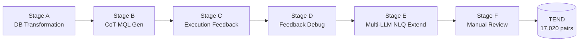
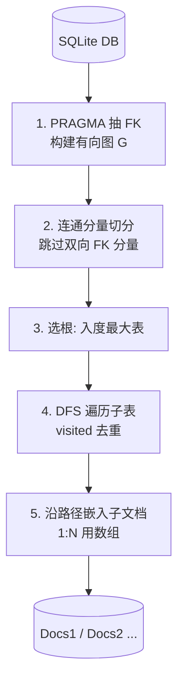

# TEND 数据集构建方法

> 文档定位: 阐述 TEND 6 阶段构建流水线的设计意图、质控策略与已知限制
> 目标读者: 数据团队 / 复现者
> 前置阅读: [01 任务定义](./01_task_definition.md), [02 数据集设计](./02_dataset_design.md)
> 最近更新: 2026-04-17

## 0. 摘要

TEND 用 6 阶段流水线把 Spider 关系型语料转写为可执行的 (NLQ, MQL) 配对: A 重塑 SQLite 为嵌套文档; B 用 CoT 生成初稿 MQL; C 在 mongosh 执行采证; D 据反馈迭代修复; E 多 LLM 扩写 NLQ; F 抽样人工审核。链路采用"自动化 + 人工"双闭环, 以"执行结果一致"为最终 gate, 任何执行失败一票否决, 保证 17,020 条样本可执行且语义对齐。

## 1. 流水线总览

| Stage | 输入             | 任务           | 输出                  | 关键质控点          |
| ----- | -------------- | ------------ | ------------------- | -------------- |
| A     | Spider SQLite  | 表 -> 嵌套文档    | MongoDB schema/data | 外键图无环、根表唯一     |
| B     | NLQ + schema   | CoT 生成初稿 MQL | 初稿 MQL              | 别名与 stage 顺序规范 |
| C     | 初稿 MQL         | mongosh 执行采证 | 结果/错误/超时            | BSON 类型归一化     |
| D     | C 反馈           | LLM 修复 MQL   | 修复 MQL              | 与 SQL 结果一致     |
| E     | 1 条 (NLQ, MQL) | 多 LLM 扩写     | 5 条改写 NLQ           | 嵌入去重、风格多样      |
| F     | 全量样本           | 抽样审核 + 全量执行  | 终版 TEND             | 一票否决           |

执行验证贯穿 Stage C/D/F, 是最终 gate: 文本再合理, 只要 mongosh 无法返回与 SQL 一致结果就不入终版。该流水线服务于的任务定义见 [01 §1 任务形式化定义](./01_task_definition.md#01-1); 流水线产物对应的数据集设计见 [02 §1 设计目标与原则](./02_dataset_design.md#02-1)。

## 2. Stage A 数据库变换

Stage A 是 6 阶段中唯一完全确定性的步骤, 决定后续所有 LLM 阶段依赖的"目标数据库形态"。我们把每个库建模为有向图 G=(\mathcal{T},\mathcal{E}): 节点是表, 边是外键依赖, 然后做选根 + 沿路径嵌入两件事。

伪代码: 对每个连通分量, 选入度最大的表作根并物化; 从根 DFS, 每访问一条 FK 边就把子表元组以"父字段名 -> 数组"追加进父文档; 用全局 visited 防止重复嵌入与环路爆炸; 一个分量产出一个根集合 `Docs_i`。

为何 DFS 而非 BFS: 嵌入是"父先就位、孙子追加到父子数组"的递归形态, DFS 沿一条路径深入到叶子再回溯, 同一父-子-孙链在父落盘前被填齐, 自底向上一次序列化即可。BFS 需每层暂存中间引用, 序列化时再走索引回填, 实现复杂且在共享依赖处易重复嵌入。

为何嵌入而非引用: NoSQL 的核心卖点是"读时不必 join"。直接嵌入让一段 aggregation 就能完成 SQL 多路 join 的语义, 真实暴露 `$unwind` / `$lookup` / `$project` / `$group` 等算子, 也是 TEND 区别于"SQL 同形翻译"的关键。代价是子表被多父引用时会复制膨胀, 用 visited 限制重复并放弃双向 FK 分量 (黑名单见 §Y) 把膨胀压在可控范围。

Stage A 产出对应的记录字段定义见 [02 §3 数据记录 schema](./02_dataset_design.md#02-3); 嵌套文档对应的库形式说明见 [02 §4 MongoDB 库形式](./02_dataset_design.md#02-4)。

## 3. Stage B CoT MQL 生成

让 LLM 显式做 schema -> operator -> pipeline stage 的链式推理, 而不是端到端"想到什么写什么"。设计依据: (i) aggregation pipeline 是 stage 的有序组合, stage 间存在别名传递, 缺一步即崩, CoT 强制模型说出"为什么需要这个 stage", 减少幻觉跳步; (ii) 用强模型 (`gpt-4o`) 提供示范 CoT, 二档模型 (`gpt-4o-mini` / `deepseek-v3`) 在示范引导下生成, 在质量与成本间取 Pareto 折中。

提示模板捆绑 NLQ + markdown schema + 参考 SQL 推断出的目标字段集, 温度 0 以保证别名 (例如 `sum_<field>`) 和 stage 顺序稳定。输出仅作初稿, 由 Stage C/D 负责筛与修。

## 4. Stage C 执行反馈生成

把初稿 MQL 与参考 SQL 同时丢进各自的执行引擎 (mongosh + SQLite), 双方结果归一为 JSON 并比对, 收集三类反馈: (1) 成功且一致 -> 进 Stage F; (2) 成功但不一致 -> 把差异作为证据交 Stage D; (3) 执行失败 (语法错、超时、BSON 序列化异常) -> 异常 trace 交 Stage D。

设计依据: 没有真机执行就拿不到运行时事实, 而 NoSQL 中间 stage 会无声重塑文档 (`$unwind` 改字段路径、`$lookup` 产临时数组), 静态分析无能为力。每个差异结构化落盘 (期望/实得 JSON、MQL、集合列表), 是 Stage D 精确修复的前提。归一化统一处理 `ObjectId` / `Date` 等 BSON 类型并截断前 10 条以保证比对可算。

## 5. Stage D Feedback-driven Debug

Stage D 的任务是"按证据改 MQL": LLM 拿到原 NLQ、原 MQL、Stage C 证据、schema markdown, 输出修复 MQL 再回 Stage C 重跑, 形成闭环。

权衡: 单轮成本低但收敛差, 复杂 pipeline 常需 2-3 轮; 多轮无上限又会被卡死案例耗光 token。折中是软上限 2-3 轮 + 模型分级升级 (二档失败 2 次后升强模型再试 1 次), 仍失败直接丢弃, 不入终版。终止条件: (i) Stage C 判一致; (ii) 强模型也修不动 -> 丢弃。"硬丢弃"是质量优先而非规模优先的选择。

## 6. Stage E Multi-LLM 问题扩展

经 Stage C/D 验证的 (NLQ, MQL) 只有一种 NLQ 表达, 模型容易记住模板而非语义。Stage E 用多个 LLM 对同一条 MQL 做 5 次改写, 例如 `gpt-4o-mini` / `gpt-4o` / `claude-3.5-sonnet`, 每条 MQL 最终配 5 条 NLQ。

提示风格按"简洁 / 口语 / 正式 / 疑问 / 命令"五类差异化设计, 强制模型走出舒适表达; 共享嵌入空间内做相似度去重过滤退化改写。设计依据: 单模型自改写会塌缩到固定句式, 多模型多风格能在词汇与句法上拉开距离, 显著提升下游模型对未见 NLQ 表达的鲁棒性, 也是把 \sim 3{,}400 条 MQL 扩到 17,020 条配对的关键。

## 7. Stage F 人工审核

Stage F 是"结果集对齐"之外的最后一道语义闸门: 全量执行验证 + 抽样人工复核。

全量执行: 17,020 条样本逐条在 mongosh 重跑, 报错/超时/与 SQL 参考结果不一致的一票否决。抽样人工 rubric 四维: (i) NLQ 与 MQL 是否语义对齐; (ii) 别名是否符合 `[op]_[obj]` 规范; (iii) projection 顺序是否标准化; (iv) 不需要时是否显式排除 `_id`。执行通过但语义错配的, 直接打回上游或丢弃。具体抽样比例与审核排班 TODO(@dataset-team) 落档。

## 8. 质量控制策略

TEND 质控是 3 层防御而非单点 gate:

1. **可审计中间产物**: Stage A-E 的中间 JSON、prompt、LLM 响应按 `record_id` 落盘, 便于事后 trace 与回归。
2. **执行 gate (C+F)**: 每条终版 MQL 必须在 mongosh 上执行通过且与 SQL 参考结果一致。
3. **抽样人工 (F)**: 复核语义对齐, 防"碰巧一致但语义错配"的伪样本污染评估集。

为何 3 层而非单层: 只靠人工覆盖率不足且主观偏差大; 只靠执行 gate 会漏"双侧都返回空"这种退化样本; 只保留中间产物则没有 enforce。三层叠加, 才能在 17,020 量级上同时拿到"可执行 + 语义对"。

## 9. 数据导入 MongoDB

Stage A 产出 154 个嵌套 JSON, 必须导入本地 MongoDB 实例后才能给 Stage C/D/F 与下游评估使用。导入脚本对每个库做"先 drop_database 再批量 insert_many"保证幂等; 失败 collection 落日志不中断, 便于断点续插。该步是 Stage C 反馈采集与最终 EX/EFM/EVM 评估的前置, 缺则整条下游停摆。导入后用于评估执行的环境配置见 [04 §3 执行环境](./04_evaluation_methodology.md#04-3)。

## X. 主要构件清单

| 主题                              | 文件                                                                                  |
| ------------------------------- | ----------------------------------------------------------------------------------- |
| 数据库变换主脚本 (Stage A, Algorithm 1) | [dataset_construct/sqlite_to_mongodb.py](../dataset_construct/sqlite_to_mongodb.py) |
| 流水线相关脚本/笔记本目录 (Stage B-F)       | [dataset_construct/](../dataset_construct/)                                         |
| mongosh 子进程执行封装 (Stage C/F 依赖)  | [SMART/utils/mongosh_exec.py](../SMART/utils/mongosh_exec.py)                       |
| 输出数据集                           | [TEND/](../TEND/)                                                                   |

## Y. 未尽事项与已知风险

- **路径硬编码**: Stage A 重建脚本默认从 `spider/` 子目录读取 Spider 原始 SQLite, 新机器复现时必须先把 Spider 数据手动放到对应位置, 否则直接失败。建议把根路径改成 CLI 参数或环境变量。
- **黑名单不透明**: Stage A 因 schema 异常 (双向外键、无主键、`PRAGMA` 抽不到 FK 等) 或下游执行频繁失败, 共 12 库被排除。具体故障类型未单独归档, 也没有恢复策略。TODO(@dataset-team): 建立黑名单故障清单与恢复计划。
- **Stage E 改写质量缺定量评估**: 目前仅在嵌入空间做相似度去重, 没有指标衡量"5 条改写是否真覆盖不同表达分布"。TODO(@dataset-team): 补 NLQ 多样性 + 语义保真双维度评估表。
- **离线复现门槛高**: Stage B/D/E 全靠商用 LLM API (OpenAI / Anthropic / DeepSeek), 离线复现成本极高。代码仓 API key 应改环境变量并以 `<REDACTED>` 占位防泄漏。TODO(@infra-team): 评估用 Llama-3 70B / Qwen-2 72B 等本地模型兜底的质量损耗。
- **mongosh 路径耦合**: `SMART/utils/mongosh_exec.py` 依赖本机 mongosh 路径, 跨 OS 需手动调整搜索目录, 影响 Stage C 在并行机上的复用。

