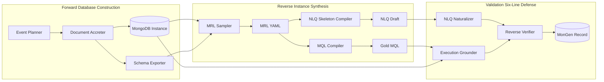

# MonGen 数据集构建方法

> 文档定位: 阐述 MonGen Pipeline 的三层分治架构 / MRL 枢纽 / 六道防线验证
> 目标读者: 数据团队 / 复现者
> 前置阅读: [01 任务定义](./01_task_definition.md), [02 数据集设计](./02_dataset_design.md)
> 最近更新: 2026-04-17

<a id="03-0"></a>
## 0. 摘要

MonGen Pipeline 把 (NLQ, MQL) 配对的合成拆为三层分治: **数据库正向构建** 用事件驱动沉积法生成具备 MongoDB 异质性的库, **MRL 实例逆向合成** 以 Meaning Representation Language 作为 MQL 与 NLQ 的共同祖先, 通过机械编译保证语法、类型与阶段顺序天生正确, **独立验证** 由 Reverse Verifier 等六道防线把幻觉与语义漂移压在可接受率以下。

MRL 是整条管线的语义枢纽: `MQL = MQLCompiler(MRL)` 与 `NLQ_skeleton = NLQSkeletonCompiler(MRL)` 同源同构, 杜绝了"先写 MQL 再人工挂自然语言"或"先写 NLQ 再翻 MQL"两条 lossy 通路。MRL Sampler 用加权约束求解在 17 大 MongoDB 特性上做覆盖、难度、去重三向平衡; 六道防线 (MRL Validator / MQL Compiler self-check / Execution Grounder / Skeleton Coverage / Reverse Verifier / Human Sampling) 各自独立, 任一失败即整条样本丢弃, 质量优先于规模。

<a id="03-1"></a>
## 1. 总览架构

把"数据库 + 配对样本"的合成拆成三层而不是单链, 是为了让每一层都能独立验证、独立替换、独立扩展。一条端到端"NLQ -> MQL"链路若在中段塌缩, 上游证据全部失效; 三层分治把责任分到不同模块, 任一层故障都能在本层被捕捉。



三层缺一不可, 理由如下:

- **正向构建不可省**: 真实异质 MongoDB 库 (稀疏字段、多态类型、动态键、bucket pattern 等) 无法从关系型源转换得到, 只能由事件驱动的 Document Accreter 沉积, 才能让 17 大特性自然出现, 而不是"人为贴标"。
- **MRL 枢纽不可省**: 若 MQL 与 NLQ 由两条独立通路并行生成再事后对齐, 两侧的语义偏移必须由更下游的 verifier 反复校正, 引入额外噪声; 让两者从同一份 MRL 机械编译出, 语义一致变成代数恒等式而非概率事件。
- **独立验证不可省**: Reverse Verifier 调用与生成端**异源**的 LLM, 仅凭 NLQ 与 schema 重构 MQL 并执行结果比对, 用以剔除"自圆其说"的样本; 缺这一层就只能信任生成端自检, 幻觉无法暴露。

本 pipeline 服务于 [01 §1 任务形式化定义](./01_task_definition.md#01-1)。

<a id="03-2"></a>
## 2. 数据库正向构建 (Forward)

正向构建的目的不是"造一个能跑的库", 而是"让 17 大 MongoDB 特性按可控比例出现在最终库形态中"。这要求库的生成必须由可解释的事件流驱动, 而不是从 schema 反推记录。

<a id="03-2-1"></a>
### 2.1 MongoDB 17 特性 Checklist

下表列出本 benchmark 必须覆盖的 17 大特性 (F1-F17), Accreter 的突变规则与 Sampler 的采样目标都必须对照此表设计。

| 类别 | ID | 特性 | 触发机制(关键词) | 典型查询算子 |
|---|---|---|---|---|
| Schema 异质 | F1 | 稀疏字段 | 部分事件省略字段 | `$exists: true/false` |
| Schema 异质 | F2 | 多态类型 | 同字段跨版本类型变化 | `$type`, `$cond` 类型路由 |
| Schema 异质 | F3 | 可选嵌套层 | 嵌套对象可空 / 可缺 | 嵌套路径 + `$exists` |
| Schema 异质 | F4 | 数组元素多态 | 数组内元素结构异构 | `$filter` + `$type` |
| 动态键 | F5 | 日期 / 租户作 key | map 结构 key 是数据维度 | `$objectToArray` |
| 动态键 | F6 | `$objectToArray` 可转映射 | map 需转 array 聚合 | `$objectToArray` + `$unwind` |
| 动态键 | F7 | key 集合随文档演化 | 新版本引入新 key | `$ifNull` 分支 |
| 原生 BSON | F8 | ObjectId | 系统生成 id | `ObjectId()` 构造 |
| 原生 BSON | F9 | Decimal128 | 金融精度 | `NumberDecimal()` |
| 原生 BSON | F10 | Date | 时间维度 | `$dateToString`, `$dateDiff` |
| 原生 BSON | F11 | GeoJSON | 地理查询 | `$geoWithin`, `$near` |
| 文档形态 | F12 | 嵌入 vs 引用并存 | 1:N 用嵌入, 大粒度用引用 | `$lookup` pipeline |
| 文档形态 | F13 | 多版本共存 (schema drift) | 不回填新字段 | `$ifNull`, `$type` 分支 |
| 文档形态 | F14 | 大数组 / 分桶 | bucket pattern 按时间分桶 | `$unwind` + `$bucket` |
| 查询算子 | F15 | 存在性 | 稀疏字段检测 | `$exists` / `$type` |
| 查询算子 | F16 | 深连接 | 递归层级 | `$lookup` with pipeline + `$graphLookup` |
| 查询算子 | F17 | unwind 保空 | 空数组保留 | `$unwind` + preserveNullAndEmptyArrays |

Accreter 与 Sampler 的每个设计决策都必须对照此表, 确保下游 benchmark 在每条特性上都有足够样本量。

<a id="03-2-2"></a>
### 2.2 Event Planner

直接编造文档容易得到"贴出来的库", Event Planner 把库形态降维为"业务事件流", 让数据按时间顺序长出来, 自然产生版本演化、稀疏字段、动态键这些通过静态模板很难合成的特性。

事件流以 YAML DSL 描述: 顶层为业务域, 内含一组事件, 每个事件指定其触发主体、时间规则与对底层文档的突变。示例 (电商域):

```yaml
domain: ecommerce
events:
  - name: OrderCreated
    actor: customer
    timestamp_rule: business_hours_uniform
    mutations:
      - {op: insert, collection: orders,
         fields: {status: pending, total: decimal128, created_at: now}}

  - name: PaymentReceived
    actor: payment_gateway
    timestamp_rule: after(OrderCreated, lag=[1m, 30m])
    mutations:
      - {op: update, collection: orders, filter: {by: order_id},
         set: {status: paid, paid_at: now}}
      - {op: sub-insert, collection: customers, filter: {by: customer_id},
         array_field: payment_history,
         element: {order_id: ref, amount: decimal128, ts: now}}

  - name: ShipmentUpdated
    actor: logistics
    timestamp_rule: after(PaymentReceived, lag=[1h, 72h])
    mutations:
      - {op: dynamic-key-set, collection: orders, filter: {by: order_id},
         map_field: shipment_events, key: "{ts:YYYYMMDD}",
         value: {carrier: str, status: str}}

  - name: OrderCancelled
    actor: customer
    timestamp_rule: after(OrderCreated, lag=[5m, 7d])
    mutations:
      - {op: update, collection: orders, filter: {by: order_id},
         set: {status: cancelled, cancelled_at: now}}
```

各业务域的预设事件模板规模如下, 设计目标是让事件粒度匹配真实 workload 的复杂度:

| 业务域 | 事件数 | 代表事件 |
|---|---|---|
| 电商 | 8-12 | OrderCreated / PaymentReceived / ShipmentUpdated / OrderCancelled / Refunded / Reviewed |
| IoT | 5-8 | SensorRegistered / ReadingPushed / ThresholdAlert / FirmwareUpgraded |
| 日志 | 3-5 | LogIngested / SeverityEscalated / LogArchived |
| CMS | 6-10 | ArticleDrafted / Published / Edited / Commented / Archived |
| 社交 | 8-12 | UserJoined / Posted / Followed / Liked / Messaged / Blocked |
| 金融 | 10-14 | AccountOpened / Deposited / Withdrew / Transferred / Frozen / Settled |
| 医疗 | 7-10 | PatientAdmitted / Diagnosed / Prescribed / LabReported / Discharged |
| 游戏 | 8-12 | PlayerCreated / LeveledUp / ItemPurchased / MatchPlayed / AchievementUnlocked |
| SaaS | 6-10 | TenantProvisioned / SubscriptionUpgraded / UsageReported / Invoiced |
| 教育 | 6-10 | CourseCreated / Enrolled / AssignmentSubmitted / Graded / CertificateIssued |

事件之间存在偏序约束 (partial order): `OrderCreated` 必须先于 `PaymentReceived`, 后者必须先于 `ShipmentUpdated`。Event Planner 用 DAG 表达此偏序, 在生成事件流时按 DAG 拓扑序抽样, 同时为每个事件按 `timestamp_rule` 加扰动 (poisson lag / business-hour 分布), 既保证因果合理又保留时间分布的真实长尾。

<a id="03-2-3"></a>
### 2.3 Document Accreter

Accreter 是事件 -> 文档突变的执行器, 设计核心是"沉积 (accrete) 而非重建": 老文档不会因 schema 演化被回写, 这正是真实 MongoDB 库长尾形态 (F1 稀疏 / F13 多版本) 的成因。

突变规则共 4 类:

| 突变 op | 语义 | 触发的特性 |
|---|---|---|
| `insert` | 全新文档落库 | 引入当前 schema 版本的字段集 |
| `update` | 给已有文档打 patch | 仅写入 `set` 指定字段, 保留旧字段 -> F1 / F13 |
| `sub-insert` | 往嵌套数组追加元素 | F4 (数组元素多态), 取决于元素 schema 是否随时间演化 |
| `dynamic-key-set` | 往 map 字段写 key | F5 / F6 / F7 (动态键) 直接由此触发 |

事件流执行的伪代码:

```python
def apply_event(db, event):
    for mut in event.mutations:
        target = db[mut.collection]
        if mut.op == "insert":
            target.insert(render_doc(mut.fields))
        elif mut.op == "update":
            target.update(mut.filter, apply_patch(mut.set))
        elif mut.op == "sub-insert":
            target.update(
                mut.filter,
                {"$push": {mut.array_field: render_doc(mut.element)}},
            )
        elif mut.op == "dynamic-key-set":
            target.update(
                mut.filter,
                {"$set": {f"{mut.map_field}.{mut.key}": mut.value}},
            )
```

**Schema 演化不迁移规则**: 当事件模板新增字段时, Accreter 只在新事件触发的 `insert` / `update` 中写入该字段, 不对历史文档回填。这意味着同一 collection 在不同时间窗口内的文档会有不同字段集, F1 稀疏与 F13 多版本因此自然涌现, 不需要额外人为注入。

<a id="03-2-4"></a>
### 2.4 异质注入 hook

某些特性 (BSON 类型、数组多态、显式动态键) 不能仅靠事件演化自然出现, 需要 Accreter 在 `render_doc` 阶段主动注入。注入 hook 概率参数化, 事后由 Schema Exporter 统计触达率, 不达标则反馈调参。

| Hook | 概率 / 触发条件 | 对应特性 | 实现要点 |
|---|---|---|---|
| 稀疏注入 | `p_sparse = 0.15-0.30`, 省略可选字段 | F1 | 字段需在事件 schema 中标记 `optional: true` 才参与抽样 |
| 多态注入 | `p_poly = 0.05-0.10`, 切换字段类型 | F2 / F4 | 同字段维护 `type_pool: [int, str, ...]`, 抽样写入 |
| 动态键注入 | 字段标记 `dynamic_key: true` | F5 / F7 | 由 `dynamic-key-set` 突变触发, key 取自数据维度 (date / tenant_id) |
| BSON 类型注入 | 字段绑定 `bson_type` | F8-F11 | 见下表 |

BSON 特殊类型的注入点必须显式绑定字段, 否则下游模型会失去触发线索:

| BSON 类型 | 字段命名约定 | 触发特性 |
|---|---|---|
| ObjectId | 任意 `_id` 字段 / 引用字段 (`*_ref`) | F8 |
| Decimal128 | 金额 / 价格类字段 (`amount`, `price`, `total`, `balance`) | F9 |
| Date | 时间戳字段 (`*_at`, `*_ts`) | F10 |
| GeoJSON | 经纬度容器 (`location`, `geo`, `coords`) | F11 |

**采样控制**: Schema Exporter 跑完后统计每个 F1-F17 的触达率 (= 含该特性的文档数 / 总文档数), 目标下界 5%。低于阈值则:

1. 调整对应 `p_*` 参数重抽该 collection;
2. 或追加事件批次 (例如多触发 `OrderCancelled` 以补 F2 / F13);
3. 或在事件模板中增加包含目标特性的事件类型。

<a id="03-2-5"></a>
### 2.5 Schema Exporter

下游 MRL Sampler 与 Reverse Verifier 都需要"这条 collection 字段 X 实际可能是哪些类型 / 出现率多少", Schema Exporter 把这些运行时事实从生成的库中反向推断, 与 Accreter 解耦后可随时重抽。

推断流程:

1. 遍历每个 collection 的所有文档, 对每条文档展开嵌套路径 (`a.b.c`);
2. 对每条路径合并类型集合 (union types), 记录出现次数;
3. 计算字段稀疏度 `sparsity = 1 - 出现次数 / 文档总数`;
4. 抽样 5-10 条非空 `example_values` 供 Sampler 选值参考。

输出格式:

```yaml
orders:
  status:
    types: [string]
    sparsity: 0.00
    examples: [pending, paid, cancelled, refunded]
  total:
    types: [Decimal128]
    sparsity: 0.00
    examples: ["12.50", "199.99"]
  shipment_events:
    types: [object]
    sparsity: 0.42
    is_dynamic_key_map: true
    inner_value_schema:
      carrier: {types: [string]}
      status: {types: [string]}
  cancelled_at:
    types: [Date, null]
    sparsity: 0.78
```

Schema Exporter 的输出同时是 MRL Sampler 字段引用合法性校验的字典, 也是 Reverse Verifier 重构 MQL 时的 schema markdown 来源。

上述库形态在 MonGen 记录中的可视化示例见 [02 §4 MongoDB 库形式](./02_dataset_design.md#02-4)。

<a id="03-3"></a>
## 3. MRL 与编译器 (Reverse, 核心)

MRL 是本 pipeline 设计的"心脏"。MQL 在阶段顺序与 alias 上极易出错, NLQ 在自然语言生成中容易漂移; 让两者都从同一份结构化中间表示机械编译出, 是把"NLQ 与 MQL 语义一致"从概率问题变成代数恒等式的关键。

<a id="03-3-1"></a>
### 3.1 MRL 规范

MRL (Meaning Representation Language) 是 YAML / JSON 形式的结构化意图表示, 顶层字段固定如下:

| 字段 | 类型 | 作用 |
|---|---|---|
| `intent` | enum | `retrieve` / `aggregate` / `count` / `exists` |
| `scope` | object | `{collection, filters[], joins[], unwinds[]}` |
| `projection` | object | 返回字段集 + alias 规范 |
| `grouping` | object | 分组维度 + 聚合算子 |
| `ordering` | array | 排序键与方向 |
| `limits` | object | `{limit, skip}` |
| `features` | list[str] | 激活的特性 id 列表 (F1-F17) |
| `difficulty` | float | [0, 1] 范围, 由 §6 公式计算 |

约束: `intent = count` 时 `projection` 与 `grouping` 必须为空; `intent = exists` 时 `limits.limit = 1`; `joins` 中的 `localField` / `foreignField` 必须 in union schema (由 Schema Exporter 提供)。

MRL 共定义约 30 个原语, 分类如下表 (compiler 对每个原语都有对应的代码路径):

| 类别 | 数量 | 原语列表 |
|---|---|---|
| Filter | 12 | `eq` / `ne` / `lt` / `lte` / `gt` / `gte` / `in` / `nin` / `exists` / `type` / `regex` / `geoWithin` |
| Projection | 5 | `include` / `exclude` / `alias` / `compute` / `objectToArray` |
| Grouping | 8 | `sum` / `avg` / `min` / `max` / `count` / `stdDev` / `push` / `addToSet` |
| Join | 3 | `lookup_simple` / `lookup_pipeline` / `graphLookup` |
| Array | 5 | `unwind` / `filter` / `map` / `reduce` / `slice` |
| Sort / Page | 4 | `sort_asc` / `sort_desc` / `limit` / `skip` |

样例 1 — 聚合:

```yaml
intent: aggregate
scope:
  collection: orders
  filters:
    - {field: status, op: eq, value: paid}
    - {field: created_at, op: gte, value: "2024-01-01", type: Date}
  unwinds:
    - {path: items, preserveNullAndEmptyArrays: false}
grouping:
  by: [customer_id]
  aggs:
    - {alias: total_spent, op: sum, field: items.price}
projection:
  include: [customer_id, total_spent]
ordering: [{field: total_spent, direction: desc}]
limits: {limit: 10}
features: [F10, F15, F17]
difficulty: 0.45
```

样例 2 — 递归连接:

```yaml
intent: retrieve
scope:
  collection: employees
  filters:
    - {field: department, op: eq, value: engineering}
  joins:
    - op: graphLookup
      from: employees
      startWith: $manager_id
      connectFromField: manager_id
      connectToField: _id
      as: management_chain
      maxDepth: 5
projection:
  include: [name, department, management_chain.name]
limits: {limit: 50}
features: [F8, F16]
difficulty: 0.72
```

`MQL = MQLCompiler(MRL)`, `NLQ_skeleton = NLQSkeletonCompiler(MRL)`, 两条编译路径共享 MRL 作为唯一真源。

<a id="03-3-2"></a>
### 3.2 MRL Sampler

随机抽样会塌缩到模板高频区, 必须用带约束的优化目标在多样性、覆盖率、难度三向取平衡。

采样目标函数:

```
obj = w1 * op_diversity
    + w2 * feature_hit
    + w3 * difficulty_balance
    - w4 * duplication

推荐: w1 = 0.35, w2 = 0.30, w3 = 0.20, w4 = 0.15
```

四项含义:

- `op_diversity`: 当前 batch 中 MRL 原语集合的香农熵, 鼓励高频原语之外的 join / array / objectToArray 出现;
- `feature_hit`: 17 大特性的累计触达率与目标 (各自 >=5%) 的差距, 缺什么补什么;
- `difficulty_balance`: 当前 difficulty 直方图与目标比例 (easy:medium:hard = 4:4:2) 的 KL 距离;
- `duplication`: 与历史样本的 MinHash 签名相似度 (canonical MRL), 高于阈值则倒扣。

约束条件:

1. **特性下界**: 每个 F1-F17 触达率 >=5%;
2. **难度分布**: easy (0.00-0.33) : medium (0.33-0.66) : hard (0.66-1.00) = 4 : 4 : 2;
3. **schema 一致性**: 所有字段引用必须 in `schema_exporter.union_schema`, 否则采样失败。

采样算法主循环:

```python
def sample_mrl(target_count, schema, history):
    out = []
    while len(out) < target_count:
        cand = weighted_random_mrl(schema, weights=current_weights)
        if not validate_against_schema(cand, schema):
            continue
        if minhash_dup(cand, history, threshold=0.8):
            continue
        gain = score(out + [cand]) - score(out)
        if gain > 0:
            out.append(cand)
        update_weights_for_uncovered(out)
    return out
```

`update_weights_for_uncovered` 是 iterative boosting: 每 N 步统计当前 batch 中触达率不足的 (F_i 或 op) 集合, 临时上调它们的采样权重, 直至覆盖率达标。与 Schema Exporter 的关系是强耦合的: 字段选择必须 in union schema, 否则在 `validate_against_schema` 阶段直接退回。

<a id="03-3-3"></a>
### 3.3 MQL Compiler

编译器的存在意义是"把语法 / 类型 / 阶段顺序的正确性变成机械保证", 而不是依赖 LLM 自回归生成时的运气。

确定性 AST 编译规则的伪代码:

```python
def compile(mrl):
    stages = []
    if mrl.scope.filters:
        stages.append({"$match": compile_filters(mrl.scope.filters)})
    for j in mrl.scope.joins:
        stages.append({"$lookup": compile_join(j)})
    for u in mrl.scope.unwinds:
        stages.append({"$unwind": compile_unwind(u)})
    if mrl.grouping:
        stages.append({"$group": compile_group(mrl.grouping)})
    if mrl.projection:
        stages.append({"$project": compile_project(mrl.projection)})
    if mrl.ordering:
        stages.append({"$sort": compile_sort(mrl.ordering)})
    stages.extend(compile_limits(mrl.limits))
    return f"db.{mrl.scope.collection}.aggregate({stages})"
```

编译器内置 self-check (即 §5 防线 2 的执行点), 任何一项失败都抛 error 并回 Sampler 重抽:

| 检查 | 规则 |
|---|---|
| 字段引用合法 | `compile_filters` / `compile_project` 中所有字段路径 in `schema.union_schema` |
| alias 不冲突 | `compile_group` 与 `compile_project` 的 alias 在同一 pipeline 内唯一 |
| 阶段顺序合法 | `$group` 必须在 `$lookup` / `$unwind` 之后, `$sort` 不得早于产生其排序键的阶段 |
| 类型与算子兼容 | `gt` / `lt` 仅适用于数值 / Date, `regex` 仅适用于 string, `geoWithin` 仅适用于 GeoJSON |
| BSON 字面量正确 | `Decimal128` 写为 `NumberDecimal("...")`, `Date` 写为 `ISODate("...")`, `ObjectId` 写为 `ObjectId("...")` |

self-check 失败的样本不会进入下游, 由 Sampler 在更新权重后重抽。

<a id="03-3-4"></a>
### 3.4 NLQ Skeleton Compiler

NLQ Skeleton Compiler 把同一份 MRL 编译为带槽位的英文骨架串, 与 MQL Compiler 共享祖先, 保证 NLQ 与 MQL 语义同源。骨架阶段不追求自然度, 只确保槽位与 MRL 字段一一对应。

模板引擎按 MRL 顶层字段拼接子句:

| MRL 段 | 骨架片段 |
|---|---|
| `intent: retrieve` | `Find {projection}` |
| `intent: aggregate + grouping` | `Find the {agg.op} of {agg.field} {grouped_by group.by}` |
| `intent: count` | `Count {scope.collection}` |
| `scope.filters` | `where {filter.field} {filter.op} {filter.value}` |
| `scope.joins` | `joined with {join.from}` |
| `scope.unwinds` | `expanding {unwind.path}` |
| `ordering` | `sorted by {ordering.field} {ordering.direction}` |
| `limits.limit` | `taking the top {limits.limit}` |

举例: 对 §3.1 样例 1 的 MRL, 骨架编译为:

```
Find the {agg:sum} of {field:items.price} {grouped_by customer_id}
where {filter:status=paid} and {filter:created_at>=2024-01-01},
sorted by total_spent desc, taking the top 10.
```

槽位标记 `{filter:status=paid}` 等不是给人读的, 而是供后续 NLQ Naturalizer 替换为自然表达, 同时供 Skeleton Coverage 校验槽位完整性 (防线 4)。

编译器产出的 MRL / MQL / NLQ 三者一一对应, 最终写入 MonGen 记录, 字段对应见 [02 §3 数据记录 schema](./02_dataset_design.md#02-3)。

<a id="03-4"></a>
## 4. LLM Agent 精确职责 (约束下的创造性)

LLM 在 MonGen Pipeline 中的角色是"在确定性框架的窄缝里发挥创造力", 而不是"端到端写出可执行样本"。每个 Agent 的输入空间、输出空间、合法性校验都被严格约束。

<a id="03-4-1"></a>
### 4.1 Document Content Synthesizer

**职责**: 给 Accreter `render_doc` 阶段填充字段值 (姓名、地址、商品名、文本描述), 保证业务真实感而不破坏 schema。

**约束**:

- 不得新增字段, 不得删字段, 输出 JSON 必须严格匹配 Accreter 传入的字段名集合;
- 字段值类型必须与 schema 标注一致 (string / int / Decimal128 / Date / GeoJSON);
- 业务域上下文 (例如电商 `orders.items[].name` 取自合理商品类目) 通过 prompt 显式注入。

**防 hallucination**:

```python
def validate_synth_output(out_json, expected_schema):
    keys_out = set(out_json.keys())
    keys_exp = set(expected_schema.keys())
    extra = keys_out - keys_exp
    for k in extra:
        del out_json[k]
    for k, v in out_json.items():
        if not type_match(v, expected_schema[k]):
            raise SchemaMismatch(k)
    return out_json
```

输出 JSON 的所有键必须 in schema, 多余键直接弃; 类型不匹配则抛错由上游重生成。

<a id="03-4-2"></a>
### 4.2 NLQ Naturalizer

**职责**: 把 §3.4 产出的骨架串改写为流畅自然的英文问句。

**约束**:

- 必需语义槽 (field / operator / filter value / aggregation alias) 100% 保留, **禁止丢槽或加槽**;
- 不得引入骨架未承载的实体 (例如骨架未提及 `country`, 自然化输出也不能出现);
- 输出必须为单个英文问句, 不得拆为多句。

**校验**: 对输出做 span alignment, 用 NER + 正则匹配槽位, 命中率必须 = 100%。

**失败处理**:

```python
def naturalize_with_retry(skeleton, slots, max_try=3):
    for i in range(max_try):
        nlq = llm_naturalize(skeleton)
        if span_alignment(nlq, slots) == 1.0:
            return nlq
    raise NaturalizationFailed
```

连续 3 次失败标记丢弃, 整条样本不入终版, 不做"概率性放行"。

<a id="03-4-3"></a>
### 4.3 Paraphraser

**职责**: 对 NLQ Naturalizer 的输出做 5 种风格改写, 把每条 MQL 的 NLQ 数从 1 扩到 5, 让下游模型在表面形式上有足够多样性。

**5 种风格**:

| 风格 | 特征 | 示例片段 |
|---|---|---|
| 简洁 | 短句, 删冗余 | `Top 10 customers by paid total in 2024.` |
| 口语 | 第二人称, 带情感 | `Hey, can you list the ten customers who spent the most after they paid up since 2024?` |
| 正式 | 完整主谓宾, 名词化 | `Provide the ten customers with the highest total payment amount among orders placed since January 2024.` |
| 疑问 | 完整 wh- 疑问句 | `Which ten customers have the largest sum of paid item prices in 2024 and beyond?` |
| 命令 | 祈使句, 直接动词 | `Return the ten customers with maximum total spending on paid items from 2024 onward.` |

**约束**:

- 共享嵌入空间内做去重, cosine 相似度 < 0.85 才算合格变体;
- 仍需通过 §3.4 的 Skeleton Coverage 检查, 任一改写丢槽则丢弃该改写而非整条样本;
- 5 种风格的 prompt 模板互相独立, 避免风格塌缩。

<a id="03-5"></a>
## 5. 多层正确性保证 (六道防线)

任何单一校验都有 false pass 风险, 6 道独立机制以"且"关系串联才能把整体错误率压到可接受。每道防线对应不同的故障模式, 失败样本一律丢弃, 不做"概率性放行"。

| 序号 | 防线 | 机制 | 失败后果 |
|---|---|---|---|
| 1 | MRL Validator | 句法 / 引用完整性校验 | Sampler 重抽 |
| 2 | MQL Compiler self-check | 类型 / alias / 阶段顺序 | Sampler 重抽 |
| 3 | Execution Grounder | mongosh 实跑, 结果非空且无错 | 丢弃或重抽 |
| 4 | Skeleton Coverage | NLQ 骨架槽位对齐 | Naturalizer 重生成 |
| 5 | Reverse Verifier | 异源 Agent 用 NLQ + schema 重构 MQL, 执行结果比对 | 标记低置信度 -> 丢弃 |
| 6 | Human Sampling | 随机 1% 人工 rubric | 回流修正 |

各防线设计要点:

- **防线 3 Execution Grounder**: gold MQL 必须在真实 MongoDB 实例上执行, 返回非空且无 BSON / 类型错误。结果集前 10 行经归一化后写入 `exec_result_head`, 供下游训练与评估直接使用。
- **防线 5 Reverse Verifier**: 调用与生成端**异源**的 LLM (例如生成端 OpenAI, 验证端 Anthropic 或 Google), 仅给 NLQ 与 schema markdown, 让其重构 MQL, 再在同一 MongoDB 实例上执行, 与 gold 结果做行集比对; 不一致即标记低置信度并丢弃。同源 LLM 会同源出错, 异源是关键。
- **防线 6 Human Sampling**: 随机抽 1% 样本走人工 rubric (语义对齐 / alias 规范 / projection 顺序 / 字段拼写), 命中错误反馈到上游 prompt 与 Sampler 权重。

为什么 6 道而非更少: MRL Validator 只能保 MRL 自身合法, MQL Compiler self-check 只能保 MQL 形式正确, Execution Grounder 只能保库里能跑通, Skeleton Coverage 只能保 NLQ 不漏槽, Reverse Verifier 才能跨模态比对语义, Human Sampling 是兜底。任一道单独使用都有显著 false pass 类型, 6 道独立机制的"且"关系才能把错误率压到可接受。

上述防线守护的产物是 [§3 MRL 与编译器](#03-3) 的输出, 形成"合成 -> 校验"的闭环。

<a id="03-6"></a>
## 6. 多样性 / 复杂度 / 难度量化控制

把"难度"定义清楚才能做分层评估; 否则模型在难样本上崩溃也看不出来。本节给出 difficulty 的归一化公式与配套的多样性度量。

**难度分公式**:

```
difficulty = 0.30 * pipeline_depth_norm
           + 0.25 * feature_count_norm
           + 0.20 * ambiguity_score
           + 0.15 * filter_cardinality_norm
           + 0.10 * join_depth_norm
```

每项归一化到 [0, 1]:

| 维度 | 含义 | 归一化方式 |
|---|---|---|
| `pipeline_depth_norm` | aggregation pipeline 阶段数 | `min(stages, 12) / 12` |
| `feature_count_norm` | 该 MRL 激活的 F1-F17 特性数 | `min(count, 8) / 8` |
| `ambiguity_score` | 槽位中可省略 / 可代指部分占比 (例如 `the recent orders`) | 由 ambiguity rule set 打分 0-1 |
| `filter_cardinality_norm` | 过滤条件数 | `min(filters, 6) / 6` |
| `join_depth_norm` | join + graphLookup 的最大递归深度 | `min(depth, 5) / 5` |

**分布目标**:

- easy: difficulty in [0.00, 0.33], 占比 40%
- medium: difficulty in [0.33, 0.66], 占比 40%
- hard: difficulty in [0.66, 1.00], 占比 20%

**去重**: 对每条 MRL 做 canonical 化 (字段排序 / op 归一 / 字面值哈希), 用 MinHash 签名计算 Jaccard 相似度, 阈值 0.8 视为重复, Sampler 直接丢弃。

**Cross-feature 组合覆盖**: 统计 (F_i, F_j) 二元组 (i ≠ j) 的同时触达率, 目标 >= 60% 的二元组至少有 1 条样本。这条约束防止"每个特性都覆盖了, 但从未两两组合"的退化覆盖。

若任一分布偏离目标, Sampler 触发 iterative boosting: 临时把欠覆盖区域的采样权重上调 (推荐 1.5-2.0 倍), 直至再次达标。

<a id="03-7"></a>
## 7. 记录写盘格式

每条 MonGen 记录的字段与产出阶段一一对应, 便于事后回溯到上游故障点:

| 字段 | 产出阶段 |
|---|---|
| `record_id` | MRL Sampler 阶段分配 |
| `db_id` | Document Accreter 生成 |
| `nl_queries` (5) | NLQ Skeleton + Naturalizer + Paraphraser |
| `mql` | MQL Compiler |
| `mrl` | MRL Sampler |
| `exec_result_head` | Execution Grounder (BSON 类型归一化后取前 10 行) |
| `feature_ids` | MRL Sampler 显式标注 |
| `difficulty_score` | §6 公式 |
| `reverse_verification` | Reverse Verifier |

**写盘时机**: 6 道防线全通过后一次性 atomic write 到 `MonGen/train.json` 或 `MonGen/test.json`; 任一道未通过则不落盘。

**中间态产物**: Event Planner 事件流、Schema Exporter 输出、MRL YAML、各 Agent 的 prompt / response、Reverse Verifier 重构 MQL 都按 `record_id` 落到 `staging/` 目录, 即使最终丢弃也保留, 便于错误分析与回归。

**BSON 归一化规则** (`exec_result_head` 写盘前必跑):

| BSON 类型 | 归一化目标 | 示例 |
|---|---|---|
| `ObjectId` | hex 字符串 | `"6512..."` |
| `Date` | ISO8601 字符串 | `"2024-01-15T08:00:00.000Z"` |
| `Decimal128` | string (保留全精度) | `"199.99"` |
| `Long` | int (若不溢出 53 bit, 否则 string) | `123456789` |
| `Binary` | base64 字符串 | `"AQID..."` |

字段完整定义见 [02 §3 数据记录 schema](./02_dataset_design.md#02-3)。

<a id="03-X"></a>
## X. 主要构件清单

| 主题 | 文件 (占位路径, 待实现) |
|---|---|
| Event Planner | [dataset_construct/event_planner.py](../dataset_construct/event_planner.py) |
| Document Accreter | [dataset_construct/doc_accreter.py](../dataset_construct/doc_accreter.py) |
| Schema Exporter | [dataset_construct/schema_exporter.py](../dataset_construct/schema_exporter.py) |
| MRL Sampler | [dataset_construct/mrl_sampler.py](../dataset_construct/mrl_sampler.py) |
| MRL 规范 (YAML schema) | [dataset_construct/mrl_spec.yaml](../dataset_construct/mrl_spec.yaml) |
| MQL Compiler | [dataset_construct/mql_compiler.py](../dataset_construct/mql_compiler.py) |
| NLQ Skeleton Compiler | [dataset_construct/nlq_skeleton_compiler.py](../dataset_construct/nlq_skeleton_compiler.py) |
| NLQ Naturalizer | [dataset_construct/nlq_naturalizer.py](../dataset_construct/nlq_naturalizer.py) |
| Reverse Verifier | [dataset_construct/reverse_verifier.py](../dataset_construct/reverse_verifier.py) |
| 输出数据集 | [MonGen/](../MonGen/) |

<a id="03-Y"></a>
## Y. 未尽事项与已知风险

- TODO(@dataset-team): MRL 原语覆盖度评估 — 对照 MongoDB Release Notes 算子列表 (尤其 7.0+ 引入的 `$median` / `$percentile` / `$rank` 等), 评估当前 30 原语的 coverage gap 并给出补全计划。
- TODO(@dataset-team): Event Planner 业务域扩展方式 — 10 业务域之外 (法律 / 物流 / 公共数据等) 的事件模板抽象层, 应给出"添加新业务域只需写 1 份 yaml"的工作流。
- TODO(@dataset-team): 6 道防线各自的 false pass / false reject 率实测 — 用人工标注的 200-500 样本子集回归, 给出每道防线的混淆矩阵, 据此调超参。
- TODO(@dataset-team): 人工复核规模敲定 — 防线 6 当前定为 1%, 是否升至 2% 取决于防线 3-5 的 false pass 率, 待实测后定档。
- 风险: Reverse Verifier 与 MQL Compiler 若共用同一 LLM 家族, 可能同源出错 — **必须强制使用不同供应商或异构模型**, 否则防线 5 失效, 整条独立验证层退化为 self-check。
- 风险: Event Planner 模板表达力不足 — 合成事件流是模板组合的产物, 缺乏真实 workload 的长尾形态 (突发事件、人为脏数据、跨业务域的并发 mutation), 需用脱敏真实日志做对齐校准。
- 风险: MinHash 去重阈值敏感 — 阈值过低会误杀语义近但 MRL 表达不同的样本 (例如同一过滤条件用 `eq` 与 `in[x]` 表达), 阈值过高则去不掉真重复, 需 grid search 实测后定档。
- 风险: Document Content Synthesizer 对字段值"真实感"依赖 LLM 常识 — 领域专业术语 (医疗 ICD 编码、金融 ISIN 代码、IoT 传感器型号) 容易失真, 必要时需绑定领域词典做后校验。
