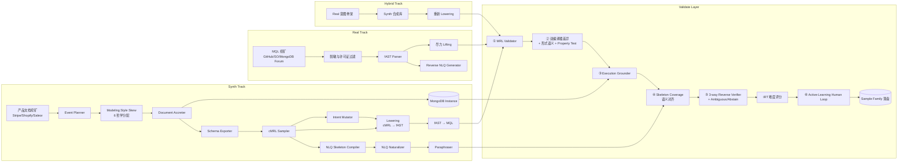

# MonGen 数据集构建方法

> 文档定位: 阐述 MonGen Pipeline 的三轨分治架构 / cMRL+fAST 双层表示 / 六道防线 / IRT 难度
> 目标读者: 数据团队 / 复现者
> 前置阅读: [01 任务定义](./01_task_definition.md), [02 数据集设计](./02_dataset_design.md)
> 最近更新: 2026-04-17

<a id="03-0"></a>
## 0. 摘要

MonGen Pipeline 把 Sample Family 的合成拆为三轨分治。**Synth 轨** 正向合成: 产品文档 mining 驱动 Event Planner, Document Accreter 按事件流沉积库, Modeling Style Skew 把 6 种建模哲学按目标比例分配到 220 个逻辑库, cMRL Sampler 在 30 原语的紧凑空间里做约束求解, Lowering 机械产出 fAST 再 unparse 为 MQL; 目标 16,000 Sample Families (MonGen-Synth)。**Real 轨** 从开源代码 / 公开论坛挖矿真实 MQL, fAST parser 解析, 对产出的 fAST 做尽力 Lifting 得到 cMRL, Reverse NLQ 生成自然语言; 目标 ~4,000 samples (MonGen-Real)。**Hybrid 轨** 把 Real 的意图骨架 (去掉具体字段与字面量) 挪到 Synth 的异质合成库上重新 Lowering 与执行, 专测组合泛化; 目标 2,000 samples (MonGen-Hybrid)。

cMRL + fAST 双层是整条管线的"心脏"。cMRL (Compact-MRL, 30 原语紧凑 DSL) 作 Sampler 采样空间, 让约束求解在低维高效进行; fAST (Full-AST, MongoDB AST 完整镜像) 作执行真源, 覆盖 `$setWindowFields` / `$densify` / `$fill` / `$facet` 等 cMRL 原语表外的长尾算子; Lowering 把 cMRL 确定性地转为 fAST, Lifting 把 fAST 尽力还原为 cMRL 并允许失败。这一分工使 Sampler 不必为追全 MongoDB 算子而膨胀到 200+ 原语, 同时不对 MongoDB 表达力形成盲区。

6 道防线: ① MRL Validator 管 cMRL 层句法 + ② 双编译器差异 + 形式语义 + Property Test (把 Lowering 正确性从"信任"升级为"可证明 + 持续测试") + ③ Execution Grounder 真库实跑 + ④ Skeleton Coverage 字面 + 语义双对齐 + ⑤ 3-way Reverse Verifier (三家异源 LLM + Ambiguous / Abstain 桶) + ⑥ Active-Learning Human Loop (主动选最不确定样本人工复核, 目标错误率 <2%)。

难度度量换成 IRT (Item Response Theory): 8-12 个 pilot 模型跑 pass 率, `difficulty = 1 − 平均 pass 率`, 5 等级各 20%, 入库要求 `discrimination ≥ 0.3`。整体规模 ~60,000 (NLQ, MQL) pairs, train / test = 8 : 2。

<a id="03-1"></a>
## 1. 总览架构

三轨分治的设计依据是职责正交: **外部有效性** 由 Real 轨承担 (挖矿真实用户意图与代码); **分布可控** 由 Synth 轨承担 (17 特性触达率、6 建模哲学占比、IRT 难度分布均以采样约束显式达成); **组合泛化测量** 由 Hybrid 轨承担 (把 Real 的意图骨架挪到 Synth 的新 schema 上实例化)。一条端到端链路若在中段塌缩, 上游证据全部失效; 三轨分治让任一轨故障都能在本轨被捕捉。



三轨缺一不可:

- **Synth 轨不可省**: 17 特性触达率要按目标比例达标 (每特性 ≥5%、二元组 ≥60%、三元组 ≥30%), 必须由事件驱动沉积 + 6 种建模哲学可控分配。Real 挖矿的分布随缘不受控, 会导致长尾特性 (F5 动态键 / F11 GeoJSON / F16 深连接) 样本量远低于目标。
- **Real 轨不可省**: 纯合成管线全链路自循环, 没有外部真值锚点。Real 从开源代码 + 公开论坛挖矿 ~4,000 样本, 提供真实用户意图锚点, 用于兑现 externally-anchored 设计原则。
- **Hybrid 轨不可省**: 单独的 Synth / Real 无法测量"真实意图能否泛化到新 schema"。Hybrid 取 Real 的意图骨架, 放到 Synth 的不同建模哲学库上重新 Lowering 与执行, 专测组合泛化 (对应评估 RQ4)。

本 pipeline 是 [01 §1 任务形式化](./01_task_definition.md#01-1) 所定义"(NLQ, schema) ⇒ MQL"任务的实现锚, 数量 / 分布 / 切分契约由 02 设计文档给出, 本文档不重复。

<a id="03-2"></a>
## 2. 正向构建 (Synth 轨)

Synth 轨的目标不是"造一个能跑的库", 而是"让 17 大 MongoDB 特性 + 6 种建模哲学按可控比例出现"。这要求库的生成由可解释的事件流驱动 + 建模哲学显式分配, 而不是从 schema 反推记录。

<a id="03-2-1"></a>
### 2.1 17 特性 Checklist

本 benchmark 必须覆盖的 17 大特性 (F1-F17):

| 类别 | ID | 特性 | 触发机制 (关键词) | 典型查询算子 |
|---|---|---|---|---|
| Schema 异质 | F1 | 稀疏字段 | 部分事件省略字段 | `$exists: true/false` |
| Schema 异质 | F2 | 多态类型 | 同字段跨版本类型变化 | `$type`, `$cond` 类型路由 |
| Schema 异质 | F3 | 可选嵌套层 | 嵌套对象可空 / 可缺 | 嵌套路径 + `$exists` |
| Schema 异质 | F4 | 数组元素多态 | 数组内元素结构异构 | `$filter` + `$type` |
| 动态键 | F5 | 日期 / 租户作 key | map 结构 key 是数据维度 | `$objectToArray` |
| 动态键 | F6 | `$objectToArray` 可转映射 | map 需转 array 聚合 | `$objectToArray` + `$unwind` |
| 动态键 | F7 | key 集合随文档演化 | 新版本引入新 key | `$ifNull` 分支 |
| 原生 BSON | F8 | ObjectId | 系统生成 id | `ObjectId()` 构造 |
| 原生 BSON | F9 | Decimal128 | 金融精度 | `NumberDecimal()` |
| 原生 BSON | F10 | Date | 时间维度 | `$dateToString`, `$dateDiff` |
| 原生 BSON | F11 | GeoJSON | 地理查询 | `$geoWithin`, `$near` |
| 文档形态 | F12 | 嵌入 vs 引用并存 | 1:N 用嵌入, 大粒度用引用 | `$lookup` pipeline |
| 文档形态 | F13 | 多版本共存 (schema drift) | 不回填新字段 | `$ifNull`, `$type` 分支 |
| 文档形态 | F14 | 大数组 / 分桶 | bucket pattern 按时间分桶 | `$unwind` + `$bucket` |
| 查询算子 | F15 | 存在性 | 稀疏字段检测 | `$exists` / `$type` |
| 查询算子 | F16 | 深连接 | 递归层级 | `$lookup` with pipeline + `$graphLookup` |
| 查询算子 | F17 | unwind 保空 | 空数组保留 | `$unwind` + preserveNullAndEmptyArrays |

Accreter 的突变规则 + Modeling Style Skew + Sampler 采样目标都必须对照此表设计。

<a id="03-2-2"></a>
### 2.2 Event Planner (产品文档 mining)

人工编写事件模板容易得到"典型套路 + 高度冗余的库形态", 220 个库的结构独立性可能只有 10-20 种, 远低于真实 MongoDB 生态的多样性。把事件流从"人工草拟"改为"真实产品文档 mining", 能得到 50-100 种结构独立形态, 这是 Synth 轨异质性的第一道保证。

**Step 1 — 文档源清单**: 每个业务域挑 5-10 个产品文档, 覆盖不同厂商的事件流建模风格:

- Stripe API Reference (电商 / 金融): `PaymentIntent` / `Invoice` / `Subscription` 全套 webhook
- Shopify Developer Docs (电商): `Order` / `Checkout` / `Fulfillment` 资源事件
- Saleor / Medusa / Odoo (电商 / SaaS 开源业务系统): README + webhook docs
- MongoDB Realm / Atlas App Services (跨域): todo / inventory / ticketing 示例应用
- AWS IoT Core / Azure IoT Hub / Particle Cloud (IoT): shadow / lifecycle / job 事件
- HL7 FHIR / Epic APIs / Doximity (医疗): `Observation` / `Encounter` / `MedicationRequest`
- Plaid / Stripe Treasury / Coinbase / Revolut Business (金融): `Transaction` / `Transfer` / `BalanceUpdate`
- Unity Gaming Services / PlayFab / GameAnalytics (游戏): `PlayerSession` / `LeaderboardUpdate` / `PurchaseCompleted`

**Step 2 — LLM 结构化抽取**: 用 Claude / GPT 对每份文档抽取事件流 DAG, 输出标准 YAML DSL:

```yaml
domain: ecommerce
product_source: stripe
events:
  - name: PaymentIntent.requires_payment_method
    actor: customer
    timestamp_rule: business_hours_uniform
    mutations:
      - {op: insert, collection: payment_intents,
         fields: {amount: Decimal128, currency: string,
                  status: requires_payment_method, created: Date}}
  - name: PaymentIntent.succeeded
    actor: payment_gateway
    timestamp_rule: after(PaymentIntent.requires_payment_method, lag=[1s, 5m])
    mutations:
      - {op: update, collection: payment_intents, filter: {by: id},
         set: {status: succeeded, paid_at: Date}}
      - {op: sub-insert, collection: customers, filter: {by: customer_id},
         array_field: payment_history,
         element: {intent_id: ref, amount: Decimal128, ts: Date}}
```

**Step 3 — 人工复核 + 去重**: 每个域产出 5-10 个事件流模板, 人工 pick 3-5 个结构独立性最高的入库 (基于 Graph Edit Distance, 见 §2-4 末尾)。

**事件流样例 (ecommerce_017 的来源)**: ecommerce_017 的事件流源自 Stripe API Reference 的 `PaymentIntent` + `Invoice` + 开源业务系统 `Order` 事件, 事件名遵循源产品命名约定 (`PaymentIntent.succeeded` 而非 `PaymentReceived`), 更贴近真实用户代码里查询的 collection 形态:

```yaml
domain: ecommerce
product_source: stripe
db_id: ecommerce_017
events:
  - name: Order.created
    actor: customer
    timestamp_rule: business_hours_uniform
    mutations:
      - {op: insert, collection: orders,
         fields: {user_id: ObjectId, status: pending, total: Decimal128,
                  items: array[{sku: str, price: Decimal128, qty: int}],
                  created_at: Date}}
  - name: PaymentIntent.succeeded
    actor: payment_gateway
    timestamp_rule: after(Order.created, lag=[1s, 30m])
    mutations:
      - {op: update, collection: orders, filter: {by: order_id},
         set: {status: paid, paid_at: Date}}
  - name: Shipment.delivered
    actor: logistics
    timestamp_rule: after(PaymentIntent.succeeded, lag=[1h, 72h])
    mutations:
      - {op: dynamic-key-set, collection: orders, filter: {by: order_id},
         map_field: shipment_events, key: "{ts:YYYYMMDD}",
         value: {carrier: str, status: str}}
```

10 个业务域的事件模板规模 (补列"产品源数"表示结构独立的库形态来源数):

| 业务域 | 事件数 | 产品源数 (结构独立库形态) | 代表事件 (源产品命名) |
|---|---|---|---|
| 电商 | 8-12 | 6-8 | `PaymentIntent.succeeded` (Stripe) / `orders/create` (Shopify) / `CheckoutComplete` (Saleor) |
| IoT | 5-8 | 4-6 | `iot/lifecycle/connected` (AWS IoT) / `device.telemetry` (Azure IoT Hub) / `particle.online` (Particle) |
| 日志 | 3-5 | 3-4 | `log.ingested` (ELK) / `otel.trace.span` (OpenTelemetry) / `dd.trace.exception` (Datadog) |
| CMS | 6-10 | 4-6 | `Entry.publish` (Contentful) / `content-type.created` (Strapi) / `post_saved` (WordPress) |
| 社交 | 8-12 | 5-7 | `statuses/create` (Mastodon) / `m.room.message` (Matrix) / `MESSAGE_CREATE` (Discord) |
| 金融 | 10-14 | 6-8 | `transactions.update` (Plaid) / `received_credit.created` (Stripe Treasury) / `charge.pending` (Coinbase) |
| 医疗 | 7-10 | 4-6 | `Encounter.admitted` (FHIR) / `Observation.final` (FHIR) / `MedicationRequest.active` (Epic) |
| 游戏 | 8-12 | 4-6 | `session.start` (PlayFab) / `purchase.completed` (Unity Gaming Services) / `achievement.unlocked` (GameAnalytics) |
| SaaS | 6-10 | 5-7 | `user.created` (Clerk) / `workspace.provisioned` (WorkOS) / `deployment.ready` (Vercel) |
| 教育 | 6-10 | 4-6 | `enrollment.created` (Canvas LMS) / `submission.graded` (Moodle) / `mastery.attained` (Khan Academy) |

事件之间保留偏序约束: `PaymentIntent.requires_payment_method` → `PaymentIntent.succeeded` → `Shipment.delivered`。Event Planner 用 DAG 表达此偏序, 生成事件流时按拓扑序抽样, 并按 `timestamp_rule` 加扰动 (poisson lag / business-hour 分布), 既保证因果合理又保留时间分布的真实长尾。

<a id="03-2-3"></a>
### 2.3 Document Accreter

Accreter 是事件 → 文档突变的执行器, 核心是"沉积 (accrete) 而非重建": 老文档不会因 schema 演化被回写, 这正是真实 MongoDB 库长尾形态 (F1 稀疏 / F13 多版本) 的成因。

突变规则共 4 类:

| 突变 op | 语义 | 触发的特性 |
|---|---|---|
| `insert` | 全新文档落库 | 引入当前 schema 版本的字段集 |
| `update` | 给已有文档打 patch | 仅写入 `set` 指定字段, 保留旧字段 → F1 / F13 |
| `sub-insert` | 往嵌套数组追加元素 | F4 (数组元素多态), 取决于元素 schema 是否随时间演化 |
| `dynamic-key-set` | 往 map 字段写 key | F5 / F6 / F7 (动态键) 直接由此触发 |

Accreter 收到一个事件序列后, 先根据 Modeling Style Skew (§2-4) 决定本库的建模哲学, 再按 op 逐条 apply:

```python
def apply_event(db, event, style_config):
    for mut in event.mutations:
        mut = rewrite_for_style(mut, style_config)  # §2-4 风格改写
        target = db[mut.collection]
        if mut.op == "insert":
            target.insert(render_doc(mut.fields))
        elif mut.op == "update":
            target.update(mut.filter, apply_patch(mut.set))
        elif mut.op == "sub-insert":
            target.update(mut.filter,
                {"$push": {mut.array_field: render_doc(mut.element)}})
        elif mut.op == "dynamic-key-set":
            target.update(mut.filter,
                {"$set": {f"{mut.map_field}.{mut.key}": mut.value}})
```

**Schema 演化不迁移规则**: 事件模板新增字段时, Accreter 只在新事件触发的 `insert` / `update` 中写入该字段, 不对历史文档回填。同一 collection 在不同时间窗口内的文档会有不同字段集, F1 稀疏与 F13 多版本因此自然涌现, 不需要额外人为注入。

<a id="03-2-4"></a>
### 2.4 Modeling Style Skew

同一业务域下 22 个库若都用同一建模哲学, 模型只需学一套 schema 就能跨库泛化, 无法测试跨建模哲学的推理。Modeling Style Skew 把 6 种建模哲学按可控比例分配到 Synth 220 库的每个域, 强制模型见到"同意图 / 异 schema"的多样化 ground truth。

6 种建模哲学:

| 哲学 | 特征 | 触发特性偏好 | Synth 占比 |
|---|---|---|---|
| Normalized | 小文档 + 多 collection + `_id` 引用 | F16 偏高 | 17% |
| Embedded | 大文档 + 多层嵌入数组 | F4 / F14 偏高 | 17% |
| Bucket | 按时间 / 维度分桶 collection | F14 / F10 偏高 | 17% |
| Polyglot | 同库混用多种哲学 | F2 / F12 偏高 | 17% |
| Legacy-drifting | 多 schema 版本并存 | F1 / F13 偏高 | 17% |
| Tenant-sharded | 租户 ID 作动态键 | F5 / F7 偏高 | 15% |

**实现机制**: Event Planner 产出事件流之后、Accreter 开始执行之前, 根据一份 `(domain, philosophy) → modeling_style_config` 配置表, 调整 mutation 的默认策略:

- **Normalized**: `$push` 改写为"插新 collection + 引用", `users.payment_history[]` 拆成独立的 `payments` collection
- **Embedded**: 所有 `insert` 优先嵌入到父文档, `payments` 嵌入到 `users.payments[]` 数组
- **Bucket**: 周期性新建 `orders_202601` / `orders_202602` 而非同一 collection 持续写入
- **Polyglot**: 按字段类别随机选择: 小 1:N 嵌入、大 1:N 引用、高频聚合走 bucket
- **Legacy-drifting**: 事件 schema 每 N 次演化一次 (字段加 / 删 / 重命名), 老文档不回填
- **Tenant-sharded**: 所有 mutation 路由到 `tenant_data.{tenant_id}.*` 路径, 租户 id 作为动态键

**运行示例**: ecommerce_017 被分配到 **Legacy-drifting** 哲学。其 `orders` collection 内共存 3 代 schema:

- Gen-A (2024 至 2025 上半年): `{status, total, items}`, `total` 是 `Double` 类型
- Gen-B (2025 下半年): 新增 `paid_at` 字段 (`Date`), `total` 仍为 `Double`
- Gen-C (2026): `total` 改为 `Decimal128` (金融精度需求), 新 order 都用 Gen-C, 老 order 保留 `Double`

这让 ecommerce_017 的"paid 订单总计"查询天然激活 F9 (Decimal128) + F10 (Date) + F13 (schema drift) + F15 (`paid_at exists`) + F17 (`$unwind items`), 与本文档主线的 cMRL / MQL 特性集完全吻合。

**结构独立性指标**: 对全 Synth 220 库做两两 Graph Edit Distance (GED) 计算, 要求平均 GED ≥ 0.4, 且任意"相似度 > 80%"的库对 ≤ 5%。不达标则补 Event Planner 源 (加新的产品文档源或提升 Polyglot 占比), 直到指标达标。

<a id="03-2-5"></a>
### 2.5 异质注入 hook

部分特性 (BSON 类型、数组多态、显式动态键) 不能仅靠事件演化 + Modeling Style Skew 自然出现, Accreter 需在 `render_doc` 阶段主动注入。注入 hook 的概率参数化, 事后由 Schema Exporter 统计触达率, 不达标则反馈调参。

| Hook | 概率 / 触发条件 | 对应特性 | 实现要点 |
|---|---|---|---|
| 稀疏注入 | `p_sparse = 0.15-0.30`, 省略可选字段 | F1 | 字段需在事件 schema 中标记 `optional: true` 才参与抽样 |
| 多态注入 | `p_poly = 0.05-0.10`, 切换字段类型 | F2 / F4 | 同字段维护 `type_pool: [int, str, ...]`, 抽样写入 |
| 动态键注入 | 字段标记 `dynamic_key: true` | F5 / F7 | 由 `dynamic-key-set` 突变触发, key 取自数据维度 (date / tenant_id) |
| BSON 类型注入 | 字段绑定 `bson_type` | F8-F11 | 见下表 |

BSON 特殊类型的注入点必须显式绑定字段, 否则下游模型会失去触发线索:

| BSON 类型 | 字段命名约定 | 触发特性 |
|---|---|---|
| ObjectId | 任意 `_id` 字段 / 引用字段 (`*_ref`) | F8 |
| Decimal128 | 金额 / 价格类字段 (`amount`, `price`, `total`, `balance`) | F9 |
| Date | 时间戳字段 (`*_at`, `*_ts`) | F10 |
| GeoJSON | 经纬度容器 (`location`, `geo`, `coords`) | F11 |

Modeling Style Skew 与异质注入 hook 互补: **Skew 决定库的宏观架构** (小文档 vs 嵌入 vs 分桶 vs 多版本并存), **hook 决定微观字段级异质** (稀疏 / 多态 / 动态键 / BSON 类型)。两者一起生成最终的异质 Synth 库。

**采样控制**: Schema Exporter 跑完后统计每个 F1-F17 的触达率 (= 含该特性的文档数 / 总文档数), 目标下界 5%。低于阈值则: (1) 调整对应 `p_*` 参数重抽该 collection; (2) 追加事件批次以补特性; (3) 在事件模板中加入包含目标特性的新事件类型。

<a id="03-2-6"></a>
### 2.6 Schema Exporter

下游 cMRL Sampler 与 Reverse Verifier 都需要"这条 collection 字段 X 实际可能是哪些类型 / 出现率多少", Schema Exporter 把这些运行时事实从生成的库中反向推断, 与 Accreter 解耦后可随时重抽。

推断流程:

1. 遍历每个 collection 的所有文档, 对每条文档展开嵌套路径 (`a.b.c`)
2. 对每条路径合并类型集合 (union types), 记录出现次数
3. 计算字段稀疏度 `sparsity = 1 − 出现次数 / 文档总数`
4. 抽样 5-10 条非空 `example_values` 供 Sampler 选值参考
5. 从 Accreter 元数据继承 `modeling_style` 字段, 写入 Schema Exporter 输出头

输出格式 (ecommerce_017 片段):

```yaml
db_id: ecommerce_017
modeling_style: Legacy-drifting
collections:
  orders:
    status:
      types: [string]
      sparsity: 0.00
      examples: [pending, paid, cancelled, refunded]
    total:
      types: [Double, Decimal128]    # schema drift: Gen-A/B Double, Gen-C Decimal128
      sparsity: 0.00
      examples: ["199.99", "12.50"]
    paid_at:
      types: [Date, null]
      sparsity: 0.35                 # 35% 订单未支付
    items:
      types: [array]
      sparsity: 0.00
      element_schema:
        sku: {types: [string]}
        price: {types: [Decimal128]}
        qty: {types: [int]}
    shipment_events:
      types: [object]
      sparsity: 0.42
      is_dynamic_key_map: true       # F5 动态键
      inner_value_schema:
        carrier: {types: [string]}
        status: {types: [string]}
```

Schema Exporter 的输出同时承担三重角色: (1) cMRL Sampler 字段引用合法性校验的字典; (2) Reverse Verifier 重构 MQL 时的 schema markdown 来源; (3) Intent Mutator 生成 variant 时的字段类型感知层。Schema Exporter 与 Accreter 解耦, 可在不改库的前提下独立重抽, 便于回溯某条样本"当时看到的 schema 是什么样"。

<a id="03-3"></a>
## 3. cMRL + fAST 双层表示

cMRL 是 30 原语的紧凑 DSL, 服务于 Sampler 的约束求解; fAST 是 MongoDB AST 的完整镜像, 服务于执行与完整表达力。Lowering 把 cMRL 确定性地转为 fAST, Lifting 把 fAST 尽力还原为 cMRL。这一双层设计是 MonGen 的架构基石。

<a id="03-3-1"></a>
### 3.1 cMRL 规范 (紧凑 DSL)

cMRL (Compact-MRL) 是 YAML / JSON 形式的结构化意图表示, 顶层字段固定:

| 字段 | 类型 | 作用 |
|---|---|---|
| `intent` | enum | `retrieve` / `aggregate` / `count` / `exists` |
| `scope` | object | `{collection, filters[], joins[], unwinds[]}` |
| `projection` | object | 返回字段集 + alias 规范 |
| `grouping` | object | 分组维度 + 聚合算子 |
| `ordering` | array | 排序键与方向 |
| `limits` | object | `{limit, skip}` |
| `features` | list[str] | 激活的 F1-F17 子集 |

cMRL 共定义 30 个原语, 分类表 (含典型下沉到 fAST 节点示例):

| 类别 | 数量 | 原语 | 下沉示例 |
|---|---|---|---|
| Filter | 12 | `eq`/`ne`/`lt`/`lte`/`gt`/`gte`/`in`/`nin`/`exists`/`type`/`regex`/`geoWithin` | `{$match:{field:{$eq:v}}}` |
| Projection | 5 | `include`/`exclude`/`alias`/`compute`/`objectToArray` | `{$project:{...}}` |
| Grouping | 8 | `sum`/`avg`/`min`/`max`/`count`/`stdDev`/`push`/`addToSet` | `{$group:{...}}` |
| Join | 3 | `lookup_simple`/`lookup_pipeline`/`graphLookup` | `{$lookup:{...}}` |
| Array | 5 | `unwind`/`filter`/`map`/`reduce`/`slice` | `{$unwind:"$path"}` |
| Sort/Page | 4 | `sort_asc`/`sort_desc`/`limit`/`skip` | `{$sort:{...}}` + `{$limit:N}` |

**样例 1 — ecommerce_017 主线 (聚合, items.price sum)**:

```yaml
intent: aggregate
scope:
  collection: orders
  filters:
    - {field: status, op: eq, value: paid}
    - {field: paid_at, op: exists, value: true}
    - {field: paid_at, op: gte, value: "2026-01-01", type: Date}
  unwinds:
    - {path: items, preserveNullAndEmptyArrays: false}
grouping:
  by: [user_id]
  aggs:
    - {alias: total_spent, op: sum, field: items.price}
projection:
  include: [user_id, total_spent]
ordering: [{field: total_spent, direction: desc}]
limits: {limit: 3}
features: [F9, F10, F15, F17]
```

**样例 2 — ecommerce_017 子集 (递归连接, categories 树)**:

```yaml
intent: retrieve
scope:
  collection: categories
  filters:
    - {field: slug, op: eq, value: "electronics"}
  joins:
    - op: graphLookup
      from: categories
      startWith: $_id
      connectFromField: _id
      connectToField: parent_id
      as: descendant_tree
      maxDepth: 5
projection:
  include: [name, slug, descendant_tree.name]
limits: {limit: 50}
features: [F8, F16]
```

**约束**: `intent=count` 时 `projection` / `grouping` 为空; `intent=exists` 时 `limits.limit=1`; `joins` 的 `localField` / `foreignField` 必须 in Schema Exporter 的 `union_schema`。

**cMRL 的用途**: MRL Sampler 在 cMRL 层做约束求解 (覆盖 / 难度 / 去重), Intent Mutator 在 cMRL 层做 Intent Variant 生成, 之后再 Lowering 到 fAST 执行。cMRL 是"采样友好 + 语义闭合"的窄谱, 不追求覆盖 MongoDB 全集算子, 长尾部分 (`$setWindowFields` / `$densify` / `$fill` / `$facet` / 等) 交由 fAST 兜底; 本层的形式正确性证明见 §3-5。

<a id="03-3-2"></a>
### 3.2 fAST 规范 (MongoDB AST 镜像)

cMRL 的 30 原语不够覆盖 MongoDB 全集: `$setWindowFields` (窗口聚合) / `$densify` (时间填充) / `$fill` (缺失值插补) / `$facet` (多管道分支) 等 MongoDB 7.0+ 算子都在 cMRL 原语表外。fAST 是 MongoDB Aggregation AST 的完整镜像, 每个合法 MQL 管道阶段对应一个 fAST 节点, 对 MongoDB 表达力无盲区。

**结构**:

- 顶层: `{op: "aggregate" | "find", collection: str, stages: list[Stage]}`
- Stage: `{op: "$match" | "$project" | ... | "$setWindowFields" | "$densify" | "$facet" | ..., args: object}`
- args 递归: 支持任意深度的 `$expr` 表达式 (含 `$let` / `$switch` / `$reduce` / `$map` / `$filter`)
- 类型标注: 每个字段值有 `{value, type}` 形式 (保留 `$date` / `$numberDecimal` / `$oid` 等 BSON 类型标识)

**fAST 支持的 24 个核心 Stage 节点** (与 MongoDB 7.0+ AST 1:1 镜像, 下游引用时直接按此表查):

| # | Stage op | 语义 | Lift 入 cMRL | 典型激活特性 |
|---|---|---|---|---|
| 1 | `$match` | 文档过滤 | ✓ Filter 原语 | F1/F10/F11/F15 |
| 2 | `$project` | 字段裁剪 / 计算投影 | ✓ Projection 原语 | — |
| 3 | `$addFields` / `$set` | 追加计算字段 | ✓ Projection.compute | — |
| 4 | `$group` | 分组聚合 | ✓ Grouping 原语 | F5 (objectToArray 后) |
| 5 | `$sort` | 排序 | ✓ Sort 原语 | — |
| 6 | `$limit` | 截断前 N 条 | ✓ Limit 原语 | — |
| 7 | `$skip` | 跳过前 N 条 | ✓ Skip 原语 | — |
| 8 | `$unwind` | 展开数组, 支持 preserveNullAndEmptyArrays | ✓ Array.unwind | F4/F17 |
| 9 | `$lookup` (simple) | 等值 join | ✓ Join.lookup_simple | F12/F16 |
| 10 | `$lookup` (pipeline) | 管道 join, 带 `let` + `pipeline` | ✓ Join.lookup_pipeline | F12/F16 |
| 11 | `$graphLookup` | 递归 join | ✓ Join.graphLookup | F16 |
| 12 | `$facet` | 多管道分支并行 | ✗ Lift 失败 | — |
| 13 | `$bucket` | 手动边界分桶 | ✗ Lift 失败 (可 partial) | F14 |
| 14 | `$bucketAuto` | 自动等频分桶 | ✗ Lift 失败 | F14 |
| 15 | `$setWindowFields` | 窗口聚合 (MongoDB 5.0+) | ✗ Lift 失败 | F10/F14 |
| 16 | `$densify` | 时间 / 数值稠密化 (MongoDB 5.1+) | ✗ Lift 失败 | F10 |
| 17 | `$fill` | 缺失值插补 (MongoDB 5.3+) | ✗ Lift 失败 | F1/F10 |
| 18 | `$replaceRoot` / `$replaceWith` | 重塑文档根 | ✗ Lift 失败 (可 partial) | F3 |
| 19 | `$redact` | 按条件裁剪子树 | ✗ Lift 失败 | F3/F15 |
| 20 | `$sample` | 随机抽样 | ✗ Lift 失败 | — |
| 21 | `$count` | 计数 | ✓ Grouping (count) | — |
| 22 | `$geoNear` | 地理就近 | ✗ Lift 失败 (可 partial filter) | F11 |
| 23 | `$search` / `$searchMeta` | Atlas Search 文本查询 | ✗ Lift 失败 | — |
| 24 | `$out` / `$merge` | 写回 (副作用 stage) | ✗ 数据集不采纳 (读任务) | — |

第 12-20、22-23 号 stage 一律在 Lifting 时返回 `None`, 样本落入 `provenance.lifting_status: "failed"` 桶, 只保留 fAST + MQL, 不进入 Synth Sampler 复用 (Sampler 只在 cMRL 层采样); 第 24 号 `$out` / `$merge` 是写副作用 stage, MonGen 任务定义为只读 (见 01 §1), 直接被 MQL Miner 过滤掉, 不进 fAST Parser。

**ecommerce_017 主线 fAST (6 stage 完整结构)**:

```json
{"op":"aggregate","collection":"orders","stages":[
  {"op":"$match","args":{"status":"paid","paid_at":{"$exists":true,"$gte":{"$date":"2026-01-01"}}}},
  {"op":"$unwind","args":{"path":"$items"}},
  {"op":"$group","args":{"_id":"$user_id","total_spent":{"$sum":"$items.price"}}},
  {"op":"$project","args":{"_id":0,"user_id":"$_id","total_spent":1}},
  {"op":"$sort","args":{"total_spent":-1}},
  {"op":"$limit","args":3}
]}
```

**两条关键性质**:

1. **每个 fAST 节点都可直接 unparse 为合法 MQL 字符串**, 不经过 cMRL。这让 Synth 管线上游即便出错, fAST → MQL 的 unparse 仍是机械无损的。
2. **MongoDB 新算子只需扩展 fAST 规范 (增加新 op 标签), 不需要改 cMRL**。新算子未必能压缩进 cMRL 30 原语, 但总能作为 fAST stage 出现在 Real / Hybrid 样本中 (可能触发 Lifting failed, 但样本可入 fAST-only 桶)。

**长尾算子示例** (Lifting failed 但 fAST 完整支持, `$setWindowFields` 做月度累计销售额):

```json
{"op":"aggregate","collection":"orders","stages":[
  {"op":"$match","args":{"status":"paid"}},
  {"op":"$group","args":{"_id":{"year":{"$year":"$paid_at"},"month":{"$month":"$paid_at"}},
                          "monthly_total":{"$sum":"$total"}}},
  {"op":"$setWindowFields","args":{
    "partitionBy":null,
    "sortBy":{"_id.year":1,"_id.month":1},
    "output":{"ytd_total":{"$sum":"$monthly_total",
              "window":{"documents":["unbounded","current"]}}}}}
]}
```

此 fAST 的 `$setWindowFields` 不在 cMRL 30 原语中, Lifting 返回 `None`, 样本落入 `provenance.lifting_status: "failed"` 桶, 作为纯 fAST-only 样本进入 Real / Hybrid 数据集。

这让 cMRL 保持紧凑 (30 原语, 采样高效), fAST 自动同步 MongoDB Release Note (每版新算子扩展即可)。

<a id="03-3-3"></a>
### 3.3 Lowering (cMRL → fAST)

Lowering 是从 cMRL 到 fAST 的**确定性编译**。给定一条合法 cMRL, 只有一条 Lowering 路径, 不存在 Lowering 歧义。

```python
def lower(cmrl: CMRL) -> FAST:
    stages = []
    if cmrl.scope.filters:
        stages.append(FAST.Stage(op="$match", args=lower_filters(cmrl.scope.filters)))
    for j in cmrl.scope.joins:
        stages.append(FAST.Stage(op="$lookup", args=lower_join(j)))
    for u in cmrl.scope.unwinds:
        stages.append(FAST.Stage(op="$unwind", args=lower_unwind(u)))
    if cmrl.grouping:
        stages.append(FAST.Stage(op="$group", args=lower_group(cmrl.grouping)))
    if cmrl.projection:
        stages.append(FAST.Stage(op="$project", args=lower_project(cmrl.projection)))
    if cmrl.ordering:
        stages.append(FAST.Stage(op="$sort", args=lower_sort(cmrl.ordering)))
    stages.extend(lower_limits(cmrl.limits))
    return FAST(op="aggregate", collection=cmrl.scope.collection, stages=stages)
```

**Lowering 内置 self-check** (即 §7-2 的输入), 5 条:

| 检查 | 规则 |
|---|---|
| 字段引用合法 | 所有字段路径 in `schema.union_schema` (Schema Exporter 输出) |
| alias 不冲突 | group / project alias 在同一 pipeline 内唯一 |
| 阶段顺序合法 | `$group` 必须在 `$lookup` / `$unwind` 之后, `$sort` 不得早于产生其排序键的阶段 |
| 类型与算子兼容 | `gt` / `lt` 仅适用于数值 / Date; `regex` 仅适用于 string; `geoWithin` 仅适用于 GeoJSON |
| BSON 字面量正确 | `Decimal128` 标注 `{value:"199.99", type:"$numberDecimal"}`; `Date` 标注 `{value:"2026-01-01", type:"$date"}`; `ObjectId` 标注 `{value:"6512...", type:"$oid"}` |

**ecommerce_017 主线的完整 Lowering 过程**:

1. `scope.filters` → `$match {status:"paid", paid_at:{$exists:true, $gte:{$date:"2026-01-01"}}}`
2. `scope.unwinds[items]` → `$unwind {path:"$items"}`
3. `grouping` → `$group {_id:"$user_id", total_spent:{$sum:"$items.price"}}`
4. `projection.include` → `$project {_id:0, user_id:"$_id", total_spent:1}`
5. `ordering[total_spent desc]` → `$sort {total_spent:-1}`
6. `limits.limit=3` → `$limit 3`

fAST 输出与 §3-2 的 JSON 一致, 再 unparse 得到 Gold MQL:

```
db.orders.aggregate([
  {$match:{status:"paid",paid_at:{$exists:true,$gte:ISODate("2026-01-01")}}},
  {$unwind:"$items"},
  {$group:{_id:"$user_id",total_spent:{$sum:"$items.price"}}},
  {$project:{_id:0,user_id:"$_id",total_spent:1}},
  {$sort:{total_spent:-1}},
  {$limit:3}
])
```

<a id="03-3-4"></a>
### 3.4 Lifting (fAST → cMRL)

Lifting 是尽力还原: 给定 fAST, 尝试匹配到 cMRL 的 30 原语组合; 匹配失败则标记为 fAST-only 长尾。

```python
def lift(fast: FAST) -> Optional[CMRL]:
    cmrl = CMRL.empty()
    for stage in fast.stages:
        match stage.op:
            case "$match":
                cmrl.scope.filters.extend(lift_filters(stage.args))
            case "$lookup":
                cmrl.scope.joins.append(lift_join(stage.args))
            case "$unwind":
                cmrl.scope.unwinds.append(lift_unwind(stage.args))
            case "$group":
                cmrl.grouping = lift_group(stage.args)
            case "$project":
                cmrl.projection = lift_project(stage.args)
            case "$sort":
                cmrl.ordering = lift_sort(stage.args)
            case "$limit" | "$skip":
                cmrl.limits |= lift_limits(stage.args)
            case "$setWindowFields" | "$densify" | "$fill" | "$facet":
                return None  # cMRL 原语表外, Lift 失败
            case _:
                if not can_lift_to_cmrl_primitive(stage.args):
                    return None
    return cmrl if cmrl.is_valid() else None
```

**Lifting 结果三态**:

- **full**: 所有 stage 都能 lift, 得到合法 cMRL → 入 Synth-style Sample Family
- **partial**: 大部分 stage 能 lift, 但 projection 里有复杂 `$expr` 无法压缩 → 入 Hybrid 候选
- **failed**: 存在 cMRL 原语表外 op → fAST-only 样本, 不入 cMRL, 只保留 fAST

**Lifting 失败率预期** (Real 挖矿): ~20-40% 落入 fAST-only 长尾, 取决于挖矿来源复杂度。GitHub 生产代码 `$setWindowFields` / `$facet` 使用率较高, Stack Overflow 提问多为基础 `$match` + `$group`, 两者综合平均失败率 25-30%。

**ecommerce_017 主线的 Lifting 全流程**: 取 §3-2 的主线 fAST (6 stage), 逐 stage 回捞到 cMRL:

| fAST stage | 匹配分支 | 写入 cMRL 片段 |
|---|---|---|
| `$match{status:"paid",paid_at:{$exists:true,$gte:{$date:"2026-01-01"}}}` | `lift_filters` | `scope.filters += [{status, eq, paid}, {paid_at, exists, true}, {paid_at, gte, "2026-01-01", type:Date}]` |
| `$unwind{path:"$items"}` | `lift_unwind` | `scope.unwinds += [{path: items, preserveNullAndEmptyArrays: false}]` |
| `$group{_id:"$user_id", total_spent:{$sum:"$items.price"}}` | `lift_group` | `grouping = {by:[user_id], aggs:[{alias:total_spent, op:sum, field:items.price}]}` |
| `$project{_id:0, user_id:"$_id", total_spent:1}` | `lift_project` | `projection.include = [user_id, total_spent]` |
| `$sort{total_spent:-1}` | `lift_sort` | `ordering = [{field:total_spent, direction:desc}]` |
| `$limit 3` | `lift_limits` | `limits = {limit: 3}` |

6 个 stage 全部命中 cMRL 原语 → Lifting 结果为 **full**, 回灌的 cMRL 与 §3-1 的 canonical cMRL 字段级一致 (字段顺序归一化后), 与 Lowering 形成"往返恒等": `lift(lower(cmrl)) ≡ cmrl` (模 canonical 形式)。这条恒等不对所有 cMRL 成立 (有损 lift), 但对 cMRL 子集内的主线样本成立, 作为 §7-2 的回归测试之一。

如把第 5 个 stage 换成 `$setWindowFields{sortBy:{paid_at:1}, output:{running_total:{$sum:"$items.price"}}}`, `lift()` 直接返回 `None`, 整条样本落入 `provenance.lifting_status: "failed"`, 保留 fAST + MQL 但不产出 cMRL, 不被 Synth Sampler 重用。

<a id="03-3-5"></a>
### 3.5 形式语义与双实现差异测试

Lowering 正确性若出 bug, 会系统性污染 Synth 全部样本 (所有 gold MQL 都错)。光靠 §3-3 的 self-check 5 条规则不足以保证语义正确, Sampler 产出的 16,000 Sample Families 一旦遇到 Lowering bug 就是系统性返工。采用形式语义 + 双实现差异测试 + property-based testing 三管齐下, 才能把编译器正确性从"信任"升级为"可证明 + 持续测试"。

**三道机制**:

**(1) 形式语义 (Denotational Semantics)**: 对 cMRL 30 原语定义指称语义 ⟦·⟧: DocumentSet → DocumentSet。

- Python 手写一份参考实现 `cmrl_semantics.py` (不考虑性能, 只考虑语义正确)
- cMRL 每个原语都有一个对应的 `semantic_fn(docs: list, args) → list`
- 示例: `sum_fn(docs, {field: "items.price", group_by: "user_id"}) = [{user_id: u, total: sum(d.items.price for d in docs if d.user_id==u)} for u in distinct(docs.user_id)]`
- 这是 Lowering 正确性的"真值"

**(2) 双实现差异测试**:

- **Compiler A** (Python 实现, 团队 X 写): 产出的 fAST 通过 PyMongo 执行
- **Compiler B** (Rust / TypeScript 实现, 团队 Y 写或 LLM 翻译后人工 review): 产出的 fAST 通过 mongosh 执行
- 对同一 cMRL 跑双实现, fAST 结构层面 diff 不一致 (或执行结果不一致) 即 halt, 进入人工仲裁
- 允许"等价多解" (例如 A 产出 `{$sort,$limit}` 而 B 产出 `{$sort,$slice}`), 这类记入"多解 MQL"但不判错

**(3) Property-based Testing**:

- 对 cMRL 每个原语, 用 Hypothesis 框架随机生成 ≥ 10k 条 cMRL 实例 + 配对的随机文档集合
- 断言: `execute(Lowering(cmrl), docs) ≡ ⟦cmrl⟧_semantic(docs)` (按集合语义或按 zip 顺序递归比较)
- 30 原语 × 10k 测试 = 300k+ 属性测试, 每次 Lowering 代码改动 CI 必跑
- 任一反例触发修复 + 回归全集

示例 (针对 `sum` 原语的 property test):

```python
@given(
    docs=st.lists(st.builds(dict, user_id=st.text(), amount=st.decimals()), max_size=50),
    group_field=st.just("user_id"),
    sum_field=st.just("amount"),
)
def test_sum_lowering_equiv_semantic(docs, group_field, sum_field):
    cmrl = CMRL.make_group_sum(group_field, sum_field)
    fast = lower(cmrl)
    real_out = pymongo_execute(fast, docs)
    ref_out = cmrl_semantics.sum_fn(docs, {"group_by": group_field, "field": sum_field})
    assert canonical(real_out) == canonical(ref_out)
```

此 property 确保"任意文档集合 × 任意 group/sum 配置下, Lowering 产出的 fAST 经 PyMongo 执行的结果等同于参考语义"。任一反例都是 Lowering 的严重 bug, 必须修复并回归全集。

三道机制对应防线 ② (§7-2) 的实现。形式语义服务于 [02 §1-2 MongoDB-aligned](./02_dataset_design.md#02-1-2) 原则, 确保 cMRL 子集的可证明正确性。

<a id="03-3-6"></a>
### 3.6 MRL Sampler (cMRL 层采样)

随机采样会塌缩到模板高频区, 必须用带约束的优化目标在多样性、覆盖率、难度三向取平衡。Sampler 的采样空间是 cMRL 30 原语, 这是整条 pipeline 选择紧凑 DSL 的直接动因: 如果 Sampler 直接在 fAST 上做约束求解, 空间维度爆炸到 200+ 算子, 优化器难以收敛。

**采样目标函数**:

```
obj = w1 · op_diversity
    + w2 · feature_hit
    + w3 · difficulty_balance
    − w4 · duplication

推荐: w1 = 0.35, w2 = 0.30, w3 = 0.20, w4 = 0.15
```

四项含义:

- `op_diversity`: 当前 batch 中 cMRL 原语集合的香农熵, 鼓励高频原语之外的 join / array / objectToArray 出现
- `feature_hit`: 17 大特性的累计触达率与目标 (各自 ≥ 5%, 二元组 ≥ 60%, 三元组 ≥ 30%) 的差距, 缺什么补什么
- `difficulty_balance`: **IRT 难度直方图与 5 等级各 20% 目标的 KL 距离** (§8-1)
- `duplication`: 与历史样本的 MinHash 签名相似度 (canonical cMRL), 高于阈值则倒扣

**IRT 反馈的两轮采样**:

- 第一轮 Sampler 不知道 IRT 分数 (IRT 在 §8-1 才评), 用 `legacy_structural` 分数做代理 (pipeline 深度 + 特性数 + ambiguity + filter 数 + join 深度 加权)
- 第二轮根据第一轮样本的 IRT 反馈重算 `difficulty_balance`, 欠覆盖 bucket 的权重上调 1.5-2.0 倍, 再 Sample 一批补充
- 通常 2-3 轮收敛到目标分布

**约束条件**:

1. **特性下界**: 每个 F1-F17 触达率 ≥ 5%
2. **难度分布**: 5 等级各 20% (按 IRT)
3. **schema 一致性**: 所有字段引用 in Schema Exporter 的 `union_schema`
4. **建模哲学覆盖**: 6 种建模哲学按 §2-4 目标占比命中 (每个 cMRL 绑定的 db_id, 库的 `modeling_style` 已由 Schema Exporter 继承)

**采样主循环**:

```python
def sample_cmrl(target_count, schema, history):
    out = []
    while len(out) < target_count:
        cand = weighted_random_cmrl(schema, weights=current_weights)
        if not validate_against_schema(cand, schema):
            continue
        if minhash_dup(cand, history, threshold=0.8):
            continue
        gain = score(out + [cand]) - score(out)
        if gain > 0:
            out.append(cand)
            variants = intent_mutator.generate(cand)  # §3-7
            out.extend([v for v in variants if score_with(out, v) > 0])
        update_weights_for_uncovered(out)
    return out
```

`update_weights_for_uncovered` 是 iterative boosting: 每 N 步统计当前 batch 中触达率不足的 (F_i 或 op) 集合, 临时上调它们的采样权重, 直至覆盖率达标。与 [03 §2-6 Schema Exporter](#03-2-6) 的耦合保持为"强耦合": 字段选择必须 in union schema, 否则 `validate_against_schema` 直接退回。

<a id="03-3-7"></a>
### 3.7 Intent Mutator

表面 Paraphraser 只做 5 种风格改写 (简洁 / 口语 / 正式 / 疑问 / 命令), 意图完全相同。真实 NLQ 的多样性主要在**意图层** (否定 / 省略 / 指代 / 黑话 / 组合), 不是表面风格。Intent Mutator 在 cMRL 层显式生成 Intent Variant, 保证意图多样性不是表面文章。

**5 种 variant_type**:

| variant_type | 机制 | cMRL 修改 | MQL 修改 | NLQ 改写要点 |
|---|---|---|---|---|
| **negation** | 取反 | `filters` 某条 op 取反 (`eq`→`ne`, `in`→`nin`, `exists:true`→`exists:false`) | 相应 `$match` 改 `$not` / `$ne` | 加否定词 "not" / "never" / "except" |
| **omission** | 省略槽位 | cMRL 不变 (或置 null), NLQ 故意省略某槽 | MQL 不变 (保留 canonical) | 生成省略关键约束的 NLQ (考察模型能否补全默认值) |
| **coreference** | 指代 / 模糊 | cMRL 中时间字面量 `"2026-01-01"` 在 NLQ 中改为 "recent" / "last year" | MQL 不变 | 加指代词, 模型需映射默认值 |
| **jargon** | 业务黑话 | cMRL 不变, NLQ 用业务术语替换白话 | MQL 不变 | "VIP customers" / "whales" 映射 `paid_total > threshold` 的群体 |
| **composition** | 多意图组合 | cMRL 拼接两个独立 cMRL (例如 top 3 + 其 AOV) | 通过 `$facet` 或两段 pipeline | 多问句 "... and their average order value" |

**ecommerce_017 主线 5 种 Intent Variant 示例**:

| variant_type | NLQ |
|---|---|
| canonical | "Top 3 customers by total paid item spending in 2026." |
| negation | "Which customers have no paid orders in 2026?" (cMRL: `status` op `ne` paid) |
| omission | "Show me the top customers since the start of 2026." (省略 metric 与 limit=3) |
| coreference | "Top 3 customers by their total spending this year." ("this year" → 2026-01-01) |
| jargon | "Which are the top 3 whales in 2026?" (whales ≈ top spenders in glossary) |
| composition | "Top 3 customers by total paid spending in 2026 and their average order value." (拼 top-3 cMRL + AOV cMRL) |

**重要**: Intent Mutator 保留机械规则 (cMRL AST rewrite rules), 不允许 LLM 自由改写 cMRL; NLQ 改写由 Intent Variant NLQ Generator (§6-5) 在机械规则约束下产出。这保证 cMRL / MQL / NLQ 三者的语义关系仍由编译器机械保证。

**机械规则示例 (negation 类型)**: 取反规则表:

| canonical filter | negated filter |
|---|---|
| `{op: eq, value: v}` | `{op: ne, value: v}` |
| `{op: in, value: vs}` | `{op: nin, value: vs}` |
| `{op: exists, value: true}` | `{op: exists, value: false}` |
| `{op: gte, value: v}` | `{op: lt, value: v}` |
| `{op: lte, value: v}` | `{op: gt, value: v}` |

ecommerce_017 主线 canonical 的第一条 filter `{status, eq, paid}` 经 negation 规则得 `{status, ne, paid}`, 再 Lowering 产出 `$match{status:{$ne:"paid"}}`, 整条 MQL 改变 4 个字符但语义完全反转。这类确定性改写由 Mutator 机械完成, 无需 LLM。

<a id="03-3-8"></a>
### 3.8 NLQ Skeleton Compiler

NLQ Skeleton Compiler 把 cMRL 转写为带槽位的英文骨架串, 与 Lowering 共享同一祖先 cMRL, 保证 NLQ 与 MQL 语义同源。骨架阶段不追求自然度, 只确保槽位与 cMRL 字段一一对应。

**模板引擎** (按 cMRL 顶层字段拼接子句):

| cMRL 段 | 骨架片段 |
|---|---|
| `intent: retrieve` | `Find {projection}` |
| `intent: aggregate + grouping` | `Find the {agg.op} of {agg.field} {grouped_by group.by}` |
| `intent: count` | `Count {scope.collection}` |
| `scope.filters` | `where {filter.field} {filter.op} {filter.value}` |
| `scope.joins` | `joined with {join.from}` |
| `scope.unwinds` | `expanding {unwind.path}` |
| `ordering` | `sorted by {ordering.field} {ordering.direction}` |
| `limits.limit` | `taking the top {limits.limit}` |

**ecommerce_017 主线骨架**:

```
Find the {agg:sum} of {field:items.price} {grouped_by user_id}
where {filter:status=paid} and {filter:paid_at exists} and {filter:paid_at>=2026-01-01},
sorted by total_spent desc, taking the top 3.
```

经 NLQ Naturalizer (§6-2) 消化槽位后得到 canonical NLQ "Top 3 customers by total paid item spending in 2026.", 再经 Paraphraser (§6-3) 产出 4 条风格改写, 共 5 条 NLQ。

**composition variant 的骨架拼接示例**: 两段 cMRL 分别编骨架后用连接符拼:

```
(A) Find the {agg:sum} of {field:items.price} {grouped_by user_id}
    where {filter:status=paid} and {filter:paid_at>=2026-01-01},
    sorted by total_spent desc, taking the top 3.
(B) For those top 3 users, find the {agg:avg} of {field:total}
    among orders with {filter:status=paid}.

JOIN: "and their" / "as well as" / ", plus"
```

骨架覆盖 canonical cMRL; 对 Intent Variant, Skeleton 单独跑一次 (基于 variant cMRL, composition 类拼两段), 产出骨架串再给 Intent Variant NLQ Generator (§6-5)。槽位标记 `{filter:status=paid}` 等不是给人读的, 而是供后续 NLQ Naturalizer 替换为自然表达, 同时供 Skeleton Coverage 校验槽位完整性 (§7-4)。

<a id="03-4"></a>
## 4. Reverse 轨 · Real

纯合成管线全链路自循环, 没有外部真值锚点。Real 轨从开源代码 / 公开论坛挖矿真实 MQL + 反向生成 NLQ, 提供外部有效性锚点, 目标 ~4,000 samples。

<a id="03-4-1"></a>
### 4.1 MQL 挖矿与脱敏

**挖矿来源**:

| 来源 | 挖矿方法 | 预期样本数 |
|---|---|---|
| GitHub MIT / Apache 仓库 (star ≥ 100) | 正则 + AST 搜 `db.*.aggregate([` / `db.*.find(` 调用, 提取代码上下文 | ~2,000 |
| Stack Overflow `mongodb` 标签 | Stack Exchange API 拉取 Q&A, 标题作 NLQ 初稿, 最高票答案的 MQL 作 gold | ~1,000 |
| MongoDB Community Forums | 官方社区 scrape (遵守 ToS), 同 SO | ~500 |
| 开源业务系统 (Odoo / Saleor / Medusa) reporting 代码 | 手工挑选高价值 MQL | ~500 |

**脱敏流程** (先挖后净):

1. **字符串常量脱敏**: 替换公司名 / 邮箱 / API key / 租户名为占位符 (`<COMPANY>` / `<EMAIL>` / `<API_KEY>` / `<TENANT>`)
2. **Collection / 字段名语义保留哈希**: 保留通用业务名 (`orders` / `customers`), 但把明显专有的字段 (产品内部代号, 例如 `acme_internal_sku`) 哈希混淆
3. **许可证过滤**: MIT / Apache 直接用, 并在 `provenance.license` 标注; Stack Overflow CC BY-SA 保留 `provenance.source_url` 做归属; GPL 排除 (避免污染下游商用场景)
4. **重复检测**: 与已入库样本做 MQL canonical hash 比对, 重复丢弃

**Stack Overflow 挑选标准**:

- Score ≥ 2 (最低门槛) 且回答 score ≥ 回答者 quota
- 问题含完整的 schema 提示 (`db.col.find` 示例或 Mongoose schema 片段)
- 最高票答案提供可执行的 MQL (有 `db.` prefix, 非伪代码)
- 问题非 ask-for-opinion 类 (排除 "which is better" 之类的主观问题)
- 排除标签含 `homework` / `tutorial`

**目标通过率**: 挖矿 pool 约 15k-25k 条, 经脱敏 + 去重 + 合规过滤后保留 ~4,000。

<a id="03-4-2"></a>
### 4.2 fAST parser

挖到的真实 MQL 是字符串 (JS / Python 代码片段), 必须 parse 为 fAST 结构才能进入管线。

**Parser 实现要点**:

- **基础**: 用现有 JavaScript / BSON AST 解析库 (如 Babel + 定制 visitor), 提取 `db.X.aggregate([...])` 或 `db.X.find(...)` 的实参 AST
- **BSON 类型还原**: 识别 `ISODate(...)` / `ObjectId(...)` / `NumberDecimal(...)` / `/pattern/` 正则, 转为 fAST 的类型标注结构 (`{value, type}`)
- **鲁棒性**: 允许 JSON5 / relaxed JSON 输入; 对变量引用 (`db.col.find(filter)` 里 `filter` 是变量) 尝试回溯解析, 失败则跳过该样本
- **Python 客户端**: `collection.aggregate(pipeline)` 同理解析 pipeline 变量
- **mongosh session**: shell 输出 `db.col.aggregate([...])` 可直接按 JS 分支解析

**GitHub 代码片段解析示例**:

```javascript
// ecommerce-dashboard.js (GitHub 开源 repo, MIT)
const rev = await db.orders.aggregate([
  { $match: { status: "paid", paid_at: { $gte: ISODate("2026-01-01") } } },
  { $unwind: "$items" },
  { $group: { _id: "$user_id", total_spent: { $sum: "$items.price" } } },
  { $sort: { total_spent: -1 } },
  { $limit: 3 }
]);
```

Parser 先用 Babel 产出 JS AST, 定位到 `CallExpression(object=MemberExpression(orders, aggregate))` 节点, 抽出 ArrayExpression 里的 5 个 stage 对象, 递归把每个 ObjectExpression 转为 Python dict, 最后 `ISODate("2026-01-01")` 转为 fAST 的 `{"value": "2026-01-01", "type": "$date"}`。产出的 fAST 与 §3-2 的主线结构同构 (缺少一个 `$project` 阶段, 但仍是合法 fAST)。

Parser 产出 fAST 后, 调 Lifting (§3-4) 尝试还原为 cMRL; Lifting 失败者保留 fAST-only 标记, 进入 `provenance.lifting_status: "failed"` 桶。

<a id="03-4-3"></a>
### 4.3 Reverse NLQ 生成

Real 样本的 NLQ 有两种来源:

- **SO / MongoDB Forum 样本**: 问题标题 / 正文就是天然 NLQ, 只需清洗与对齐
- **GitHub 代码 / 开源业务系统**: 代码上下文只有注释或函数名, 需要反向生成 NLQ

**Reverse NLQ 生成流程**:

1. **Context 收集**: 从代码上下文收集 (函数名 / docstring / 注释 / 周边变量名); schema 提示 (从 collection / 字段名推断, 如果有 Mongoose schema 则直接用); 对 SO 问题直接保留帖子标题 + 正文简述
2. **3-way LLM 反向生成**: 让 3 家异源 LLM 基于 (fAST + context + schema) 各自生成 3 条候选 NLQ (共 9 条)
3. **自洽性过滤**: 再让 LLM 基于生成的 NLQ + schema 反向写 MQL, 与原 fAST 执行比对; 一致者保留为 gold NLQ 候选
4. **Paraphraser** (§6-3): 基于过滤后的 gold NLQ 生成 5 条不同风格表达

**SO 样本特例**: 问题标题直接作为第 1 条 NLQ (保留原真实用户口吻, 包括拼写错误 / 非标准语法, 有助于外部有效性); Paraphraser 基于标题产出 4 条不同风格的改写, 共 5 条。

Real 子集规模目标对齐 [02 §2-7 Real 子集规模与来源](./02_dataset_design.md#02-2-7): ~4,000 samples, train / test = 8 : 2。

<a id="03-5"></a>
## 5. Hybrid 轨

Synth 测特性覆盖, Real 测外部有效性, Hybrid 才真正测"真实意图能否泛化到新 schema"。这对组合泛化评估至关重要: 模型在 Real schema 上 pass 未必在同意图 + 新 schema 上 pass, Hybrid 把"意图"与"schema"解耦后单独测量 schema 侧的泛化。

**Hybrid 构造流程**:

1. **意图骨架抽取**: 从 Real 样本中, 只保留 cMRL 抽象结构 (算子组合 + 字段角色), 去掉具体字段名与字面量, 得到"意图骨架" (例如 canonical intent pattern: `aggregate → group_by[role=EntityID] → sum[role=MonetaryValue] → sort desc → limit 3`)

2. **合成库选择**: 从 Synth 220 库中选 K 个建模哲学各异但业务域匹配的库 (例如电商意图选 Normalized 电商库 + Embedded 电商库 + Bucket 电商库各一个), 对单条 Real 意图骨架展开为 K 条 Hybrid 样本

3. **字段角色绑定**: 把意图骨架的"字段角色"绑定到合成库的实际字段
   - `role=EntityID` → `user_id` (Normalized) / `customer_id` (Embedded) / `uid` (Bucket)
   - `role=MonetaryValue` → `total` / `items.price` / `bucket_totals.amount`
   - 类型兼容校验 (Decimal128 / Double / int 可互换, string 不可与 number 绑定)

4. **重新 Lowering**: 把绑定后的 cMRL 重新 Lowering, 在合成库上执行, 生成 `exec_result_head`

5. **NLQ 改写**: 把原 Real NLQ 的业务术语替换为合成库的命名约定 (`acme_internal_sku` → `product_id`), 保留原意图, 仅调整专有名词

**规模目标** 2,000 samples。入库标记 `subset: "hybrid"`, `provenance.source: "synthetic_hybrid"`, 同时记录"源 Real family_id"与"合成库 db_id"供组合泛化评估时拆分。

**ecommerce 意图骨架的 Hybrid 示例**: 某 Real 样本意图为"某月内某用户消费总额 top K" (源自 Stack Overflow GitHub MongoDB tag 帖子), 抽象骨架:

```
aggregate →
  $match[role=Status, op=eq] +
  $match[role=Timestamp, op=gte] →
  $unwind[role=ItemArray] →
  $group[by=EntityID, agg=sum(role=MonetaryValue)] →
  $sort desc → $limit K
```

绑定到 3 个不同 Synth 电商库:

- **Normalized 库 (ecommerce_017 也属此类)**: `orders.status` / `orders.paid_at` / `orders.items[]` / `orders.user_id` / `orders.items.price` → 与 canonical 结构一致
- **Embedded 库**: `users[].orders[].status` / `users[].orders[].paid_at` / `users[].orders[].items[]` / `users[]._id` / `users[].orders[].items[].price` → Lowering 需要多层 `$unwind` (users.orders + users.orders.items)
- **Bucket 库**: `orders_202601.status` / `orders_202601.paid_at` / `orders_202601.items[]` → 需要枚举月度 bucket collection 并用 `$unionWith`

同一意图在 3 种 schema 下产出完全不同的 MQL, 但语义等价。模型要在 Hybrid 上 pass, 必须真正学会"意图 → schema 映射", 而不是死记某种 schema 下的模板。

**切分关系**: Hybrid train 样本的源 Real Sample Family 必须不在 Synth test 或 Real test 中, 避免测试集泄漏; Hybrid test 样本只能使用"既未在 Real train 也未在 Synth train 出现过"的意图骨架 × 合成库组合; 具体拆分约束由 02 设计文档集中给出, 本文档不复制。

<a id="03-6"></a>
## 6. LLM Agent 精确职责

LLM 在 MonGen Pipeline 中的角色是"在确定性框架的窄缝里发挥创造力", 而不是"端到端写出可执行样本"。6 种 Agent 角色全部围绕 "cMRL / fAST / MQL 语义由编译器机械保证, NLQ 语义由 LLM 自然化" 的分工展开; 每个角色均明确规定: 输入空间 → 输出空间 → system prompt 策略 → 模型家族选择原则 → 失败回退。

**总览**:

| # | Agent | 上游 | 下游 | 是否 black-box | 模型家族偏好 |
|---|---|---|---|---|---|
| 6.1 | Event Planner Extractor + Content Synthesizer | 产品文档 / Accreter 字段请求 | Event YAML / `render_doc` JSON | 允许 system prompt 不可见 | 长上下文强 LLM (Claude Opus / GPT-5) |
| 6.2 | Schema Describer | Schema Exporter YAML | schema markdown (供 Verifier / Reverse NLQ) | system prompt 公开 | 中型通用 LLM (GPT-4o / Gemini 2.5 Flash) |
| 6.3 | Canonical NLQ Generator (Naturalizer + Paraphraser) | NLQ skeleton + slots | 5 条不同风格 canonical NLQ | system prompt 公开 | 写作能力强的 LLM (Claude Sonnet 4) |
| 6.4 | Reverse NLQ Generator | fAST + code context + schema markdown | Real NLQ 候选 | system prompt 公开 | 3 家异源 (见 §4-3) |
| 6.5 | Intent Variant NLQ Generator | variant cMRL + canonical NLQ | variant NLQ | system prompt 公开 | 写作能力强的 LLM |
| 6.6 | Verifier 判官 | NLQ + schema markdown | 重构的 MQL | system prompt 公开 (评估可审计) | 3 家异源 + ≥ 1 开源 |

**模型家族选择原则 (全局)**:

- 生成类 Agent (6.1 / 6.3 / 6.4 / 6.5) 可以用闭源强模型, 追求 NLQ / 内容自然度
- 评估类 Agent (6.6 Verifier) 必须异源, 其中 ≥ 1 家开源可审计 (避免单一供应商的系统性偏见被内化到数据集)
- 结构化任务 Agent (6.1 Event Planner 抽取、6.2 Schema Describer) 偏好长上下文 + 强指令跟随 + 低幻觉, 可用中型模型控制成本

<a id="03-6-1"></a>
### 6.1 Event Planner Extractor + Document Content Synthesizer

**合并理由**: 两者都是"把结构化 schema 规约 + 业务域常识"映射为真实业务语料, 接口近似, 可共用一套 system prompt 与校验层。

**输入**:
- (Event Planner 侧) 产品文档 URL / 文本块 (Stripe / Shopify / FHIR 等) + 域标签
- (Content Synthesizer 侧) Accreter 调用时传入的字段 schema + 事件上下文

**输出**:
- (Event Planner) YAML 格式的事件流模板 (见 §2-2 Step 2 样例)
- (Content Synthesizer) 严格匹配 expected schema 的 JSON, 每个字段值类型正确

**system prompt 策略**: 闭源。Event Planner 用"你是结构化事件抽取器, 只输出 YAML, 不输出散文"; Content Synthesizer 用"你是字段值合成器, 必须尊重类型与业务常识"。System prompt 的具体措辞是工程细节, 实际发布数据集时在 data card 披露高层策略, 不泄漏精细 prompt 工程。

**约束 (Content Synthesizer 侧)**:
- 不得新增字段, 不得删字段, 输出 JSON 必须严格匹配 expected 字段名集合
- 字段值类型必须与 schema 标注一致 (string / int / Decimal128 / Date / GeoJSON)
- 业务域上下文 (例如电商 `orders.items[].name` 取自合理商品类目) 通过 prompt 显式注入

**防 hallucination**:

```python
def validate_synth_output(out_json, expected_schema):
    keys_out = set(out_json.keys())
    keys_exp = set(expected_schema.keys())
    extra = keys_out - keys_exp
    for k in extra:
        del out_json[k]
    for k, v in out_json.items():
        if not type_match(v, expected_schema[k]):
            raise SchemaMismatch(k)
    return out_json
```

输出 JSON 的所有键必须 in schema, 多余键直接弃; 类型不匹配则抛错由上游重生成。

**模型家族选择**: 长上下文 + 低幻觉 + 强指令跟随类, 如 Claude Opus / GPT-5 / Gemini 2.5 Pro; 低成本兜底使用 Claude Haiku / GPT-4o-mini。Event Planner 优先长上下文 (产品文档常超 8k token), Content Synthesizer 可用更小模型 (单条字段填充 context 短)。

**失败回退**: 输出 schema 校验失败 → 重试 ≤ 3 次 → 仍失败则事件丢弃并上报 Event Planner review queue (人工修 prompt 或换模型)。

<a id="03-6-2"></a>
### 6.2 Schema Describer

**职责**: 把 Schema Exporter 输出的 YAML 转换为适合 Verifier / Reverse NLQ Generator 消费的 schema markdown (字段列表 + 类型 + 稀疏度 + 示例值 + 建模哲学说明)。

**输入**: Schema Exporter YAML (§2-6) + db_id

**输出**: Markdown 字符串, 结构:

```markdown
## Collection: orders (modeling_style=Legacy-drifting)

| field | types | sparsity | notes |
|---|---|---|---|
| status | string | 0.00 | enum {pending, paid, cancelled, refunded} |
| paid_at | Date / null | 0.35 | set when status transitions to paid |
| total | Double / Decimal128 | 0.00 | Gen-A/B use Double, Gen-C+ use Decimal128 (schema drift) |
| items | array<object> | 0.00 | items[].sku string, items[].price Decimal128, items[].qty int |
| shipment_events | object (dynamic-key map) | 0.42 | key = "YYYYMMDD", value = {carrier, status} |
```

**为何需要独立的 Describer**: 原始 YAML 对 LLM 的"友好度"不够 (Verifier 面对 YAML 要额外一层解析开销), markdown 把字段信息按"人类读 + LLM 提示"友好的形式呈现。

**约束**:
- 字段名 / 类型 / sparsity 与 YAML 源一一对应, 不得漏字段、不得加字段
- Modeling style 注释基于 Accreter 元数据, 不由 LLM 猜测
- 每个 collection 独立一段, 不做跨 collection merge

**system prompt 策略**: 公开。prompt 模板简单、纯转写, 没有需要保密的工程 trick。

**模型家族选择**: 中型通用 LLM (GPT-4o / Gemini 2.5 Flash / Claude Haiku) 已足够。成本是主要因素: 全数据集 220 个库 × 平均 5 个 collection ≈ 1,100 次 describer 调用, 与其他 Agent 规模量级相当, 不是瓶颈。

**失败回退**: schema markdown 校验失败 (例如字段数对不上) → 重试 ≤ 2 次 → 仍失败则回退到程序化生成 (非 LLM) 的基础版本。

<a id="03-6-3"></a>
### 6.3 Canonical NLQ Generator (Naturalizer + Paraphraser)

**职责**: 把 §3-8 的 NLQ skeleton 转为 5 条不同风格的 canonical NLQ (1 条自然化主句 + 4 条风格改写), 保证每条 canonical cMRL 有 5 条高质量 NLQ 入库。

**输入**: NLQ skeleton (slot 形式) + slots 字典 + 风格标签 ∈ {简洁, 口语, 正式, 疑问, 命令}

**输出**: 5 条英文 NLQ 字符串

**流程**:

1. **Naturalize 阶段**: 用中性风格 (信息完整、不追求华丽) 自然化 skeleton, 得到"基础 canonical NLQ"
2. **Paraphrase 阶段**: 以基础 NLQ 为 seed, 分别按 4 种目标风格 (口语 / 正式 / 疑问 / 命令) 改写
3. **校验**: 5 条都跑 §7-4 Skeleton Coverage; 不通过的单独重生成 ≤ 3 次; 整条 canonical 的 5 条至少保留 3 条有效, 不足则整条 Family 丢弃

**5 种风格** (ecommerce_017 主线示例):

| 风格 | 特征 | 示例 |
|---|---|---|
| 简洁 | 短句, 删冗余 | `Top 3 customers by paid spending in 2026.` |
| 口语 | 第二人称, 带情感 | `Hey, can you list the three customers who spent the most on paid orders in 2026?` |
| 正式 | 完整主谓宾, 名词化 | `Provide the three customers with the highest total payment amount among orders placed in 2026.` |
| 疑问 | 完整 wh- 疑问句 | `Which three customers have the largest sum of paid item prices in 2026?` |
| 命令 | 祈使句, 直接动词 | `Return the three customers with maximum total spending on paid items in 2026.` |

**约束**:

- **槽完整性**: 必需语义槽 (field / operator / filter value / aggregation alias / limit 值) 在每条 NLQ 中 100% 保留 (字面或语义)
- **不得引入骨架未承载的实体**: 骨架未提及 `country`, 自然化输出也不能出现
- **风格独立性**: 5 条 NLQ 的共享 sentence-embedding (E5 / GTE) 两两 cosine < 0.85, 避免风格塌缩
- **不得拆多句**: 除 composition variant 外, 每条 NLQ 是单句

**校验伪码**:

```python
def generate_canonical_5(skeleton, slots):
    base = naturalize(skeleton, style="neutral")
    if not skeleton_cover(base, slots):
        raise CoverFailed
    outs = [base]
    for style in ["spoken", "formal", "question", "command"]:
        for _ in range(3):
            cand = paraphrase(base, style)
            if skeleton_cover(cand, slots) and not dup(cand, outs):
                outs.append(cand); break
    return outs if len(outs) >= 3 else None
```

**system prompt 策略**: 公开。prompt 模板独立于风格, 任一条 prompt 泄漏不影响其他。

**模型家族选择**: 写作能力强的 LLM 优先 (Claude Sonnet 4 / GPT-4o), 对口语 / 疑问风格效果更佳; 正式 / 命令风格可用中型模型。

<a id="03-6-4"></a>
### 6.4 Reverse NLQ Generator (for Real)

**职责**: 从 (fAST + code context + schema markdown) 反向生成 NLQ, 用于 MonGen-Real (§4-3)。

**输入**: fAST JSON + 代码注释 / 函数名 / docstring (若有) + Schema Describer 输出的 schema markdown

**输出**: 每家 Verifier 输出 3 条候选 NLQ, 共 9 条进入自洽性过滤

**约束**:

- 必须覆盖 fAST 中所有字段引用与算子语义
- 输出 3 条候选, 经自洽性过滤 (再反向写 MQL 比对) 保留通过者
- 黑话 / 缩写保留 (保持"真实味"), 但必须在 `provenance` 中记录 glossary
- 对 SO 样本: 优先把问题标题作为第一候选 (保留原真实用户口吻)

**system prompt 策略**: 公开 (与 6.6 Verifier 的 prompt 同源)。

**模型家族选择**: 3 家异源 (OpenAI / Anthropic / Google), 与 §7-5 的 3-way 约束对齐。不同 Reverse NLQ 家族生成的候选可交叉用于自洽性过滤, 避免"同家族自我印证"。

**失败处理**: 3 家 LLM 全部无法生成一致 NLQ → 入 ambiguous 桶 (§7-5), 人工仲裁或丢弃。

<a id="03-6-5"></a>
### 6.5 Intent Variant NLQ Generator

**职责**: 对 Intent Mutator (§3-7) 产生的每个 Intent Variant cMRL, 生成对应的 variant NLQ。本 Agent 与 Intent Mutator 配套: Mutator 机械产出 variant cMRL (确定性 rewrite rules), Generator 只负责把 cMRL 改动反映到 NLQ。

**输入**:
- canonical NLQ (供"对比重写", 保证 variant 与 canonical 的句式相似度, 只在意图上不同)
- variant_type ∈ {negation, omission, coreference, jargon, composition}
- variant cMRL (canonical 的 AST rewrite 后版本) 与 canonical cMRL 的 diff
- (jargon 类专用) glossary: 白话 ↔ 黑话映射表

**输出**: 1 条英文 variant NLQ

**约束** (按 variant_type):

- **negation**: NLQ 必须显式含否定词 ("not" / "no" / "never" / "excluding" / "except")
- **omission**: NLQ 必须在指定槽位省略, 但保留句子可理解; 不得把其他槽位也一并省略
- **coreference**: NLQ 必须含指代词 ("recent" / "last year" / "this month"), 对应 cMRL 中的具体字面量; 字面量与指代词的映射写入 `provenance.coreference_map`
- **jargon**: NLQ 必须用业务术语, 且业务术语须出现在 glossary 中; 若 glossary 未预定义, 拒绝生成
- **composition**: NLQ 必须是一个合成问句或两个关联问句, 覆盖两段 cMRL 的字段 / 算子集

**校验**: 每条 variant NLQ 跑 §7-4 Skeleton Coverage 语义对齐; 不通过则重生成 ≤ 3 次; 3 次失败弃该 variant (canonical 不受影响)。

**system prompt 策略**: 公开。prompt 按 variant_type 分 5 份独立模板, 避免混合导致风格塌缩。

**模型家族选择**: 与 §6.3 一致 (写作强的 Claude Sonnet 4 / GPT-4o)。

<a id="03-6-6"></a>
### 6.6 Verifier 判官 (3-way)

**职责**: 在 §7-5 中扮演"NLQ 反向重构 MQL"的裁判, 独立于 gold MQL 生成, 给出对每条 NLQ 的 MQL 候选。

**输入**: NLQ (单句) + schema markdown (§6-2 产出)

**输出**: 单条 MQL 字符串 (或 `abstain` 标签)

**约束**:

- 必须输出可执行的 MongoDB aggregation / find (有 `db.<coll>.aggregate(...)` 或 `db.<coll>.find(...)` 语法)
- 可返回 `abstain` 表明 NLQ 不可理解 / schema 不支持, 但不得瞎猜
- 禁止跨调用对话 (每条 NLQ 独立调用, 避免历史污染)

**system prompt 策略**: 公开且同一套。三家 Verifier 共享 system prompt 设计, 差异只来自模型本身, 保证"裁决的异源性"来自模型 / 训练语料, 而非 prompt engineering。

**模型家族选择 (硬约束)**:

- 至少 3 家不同供应商 (OpenAI + Anthropic + Google, 或其他组合)
- 至少 2 个不同预训练语料基座
- 至少 1 个开源可审计模型 (Llama-3 / DeepSeek-V3 / Mixtral 等)

这三条硬约束支持 §7-5 所实施的 reverse-cross-checked 验证协议; 外部 anchor 的 link 统一在 §7-5 出, 本节不重复。

**裁决规则**: 见 §7-5 裁决表。

**失败回退**: 3 家全部 abstain → 样本直接丢弃; 任一家超时 / 非法输出 → 记为 abstain, 其他两家的一致性决定裁决。

<a id="03-7"></a>
## 7. 多层正确性保证 (6 道防线)

任何单一校验都有 false pass 风险, 6 道独立机制以"且"关系串联。失败样本丢弃或回退, 不做"概率性放行"。

| 序号 | 防线 | 机制 | 失败后果 |
|---|---|---|---|
| ① | MRL Validator | cMRL 句法 / 引用完整性校验 | Sampler 重抽 |
| ② | 双编译器差异 + 形式语义 + Property Test | Compiler A/B 输出 diff; 随机 cMRL 的语义等价 | Lowering 修复 + 回归 |
| ③ | Execution Grounder | mongosh 实跑, 结果非空且无错 | 丢弃或重抽 |
| ④ | Skeleton Coverage (语义对齐) | NLQ 槽位字面 + 语义双对齐 | Naturalizer / Paraphraser / Mutator 重生成 |
| ⑤ | 3-way Reverse Verifier + Ambiguous/Abstain 桶 | 三家异源 LLM 独立重构 + 裁决表 | 按裁决状态分发 |
| ⑥ | Active-Learning Human Loop | 主动选不确定样本做人工 rubric | 反馈到上游 prompt / Sampler 权重 |

<a id="03-7-1"></a>
### 7.1 ① MRL Validator

**职责**: 只验证 cMRL 合法性, 不验证语义。

**检查项**:

- 顶层字段完整性 (`intent` / `scope` / `projection` / ...)
- 枚举取值合法 (`intent ∈ {retrieve, aggregate, count, exists}`, `op ∈ {eq, ne, lt, ...}`)
- 字段路径格式 (`a.b.c` 合法, `a..b` 非法)
- 字段引用完整性 (对照 Schema Exporter 的 `union_schema`, 未出现的字段直接拒绝)
- intent 与结构的约束 (`intent=count` 时 `projection` / `grouping` 为空)

**失败后果**: Sampler 重抽。Validator 不做任何语义推断, 只做纯句法校验, 这是 6 道防线中最轻量的一道。

<a id="03-7-2"></a>
### 7.2 ② 双编译器差异 + 形式语义 + Property Test

具体实现见 §3-5。三件事:

1. **形式语义**: Python 参考实现 `semantic_fn` for each cMRL 原语, 作为 Lowering 正确性的真值
2. **双实现差异测试**: Compiler A (Python) + Compiler B (Rust / TS), 对同一 cMRL 输出 fAST 做结构 diff 与执行 diff
3. **Property-based Testing**: 每个原语 ≥ 10k 条随机测试, 300k+ 总规模, CI 强制门禁

任一不一致 → halt + 人工仲裁 + Lowering 修复 + 回归全集。这一防线是"Lowering 正确性"的保险, 失败一次则整个 Lowering 代码全量重测。

<a id="03-7-3"></a>
### 7.3 ③ Execution Grounder

gold MQL 在真实 MongoDB 实例上执行 (mongosh 子进程), 返回非空且无 BSON / 类型错误。结果集前 10 行经 BSON 归一化 (§9-3) 后写入 `exec_result_head`, 供下游训练与评估直接使用。

**执行配置**:

- MongoDB 7.0+ 实例 (覆盖 `$setWindowFields` / `$densify` 等新算子)
- mongosh 子进程, 30 秒 hard timeout
- 结果集超过 10 行只取前 10 行 (避免超大结果膨胀)
- 结果集为空不一定丢弃 (某些合法查询确实 0 命中), 仅标记 `is_empty: true`; 连续 N 条库的"0 命中"才触发库重抽

**典型错误分类 (Execution Grounder 拦截)**:

| 错误类型 | 根因 | 处理 |
|---|---|---|
| `CodecConfigurationException` | fAST 类型标注错 (例如 Decimal128 被当成 string) | Lowering self-check 漏洞, 回 §7-2 修 |
| `FieldPath field names may not be empty strings` | cMRL 字段路径生成 bug (例如 `.a.b`) | MRL Validator 漏过, 回 §7-1 修 |
| `Argument to $unwind must be a string...` | Lowering 对 `$unwind` stage 参数渲染错误 | Lowering 修复 + 回归 |
| `Executor error... $lookup "from" field must be a string` | join 目标 collection 不存在于 schema | Sampler 字段引用校验漏过, 回 §3-6 修 |
| timeout | 嵌套 `$lookup` + 无索引 + 大 cross join | 标记 "heavy", 丢弃或改用 `$lookup pipeline` + `let`

<a id="03-7-4"></a>
### 7.4 ④ Skeleton Coverage (语义对齐)

仅做字面槽位对齐会误杀合法改写 (`status=paid` ↔ "completed orders"), 仅做语义对齐又会漏掉"NLQ 整体没提 `status` 约束"的丢槽。双对齐策略:

- **字面对齐**: 对每个槽位 (filter / projection / group / sort / limit), NLQ 中必须出现指向该槽位的 token (字面字符串 / 同义词表中的映射)
- **语义对齐**: 对合法改写 (例如 `status=paid` → "completed orders"), 用 embedding cosine + NLI 判断器做语义等价判定
- **槽位归一化**: Intent Variant (negation / coreference / jargon / composition) 的槽位可能变形, 对齐规则按 `variant_type` 配置

**通过标准**:

- 字面对齐或语义对齐命中 → 通过
- 两者都不中 → 失败, 重生成 ≤ 3 次
- 必需语义槽 (field / operator / aggregation alias / limit 值) 缺失 → 直接丢弃

**ecommerce_017 主线覆盖检查**:

| 槽位 | 字面对齐 (原 NLQ "Top 3 customers by total paid item spending in 2026") | 判定 |
|---|---|---|
| `filter: status=paid` | "paid" 出现 | ✓ 字面 |
| `filter: paid_at exists` | 隐含 (paid → paid_at 必然 exists) | ✓ 语义 (NLI 判决 entailment) |
| `filter: paid_at >= 2026-01-01` | "in 2026" 映射 | ✓ 语义 (embedding cosine 0.88 > 0.80) |
| `group by user_id` | "customers" 映射 | ✓ 字面 (synonym table) |
| `agg sum items.price` | "total ... spending" 映射 | ✓ 字面 + 语义 |
| `sort total_spent desc` | "Top" + 隐含 desc | ✓ 字面 |
| `limit 3` | "3" | ✓ 字面 |

7 个槽位全部命中, 防线通过。若去掉 "paid" 留下 "Top 3 customers by total item spending in 2026", `filter: status=paid` 就会缺失, 重生成。

<a id="03-7-5"></a>
### 7.5 ⑤ 3-way Reverse Verifier + Ambiguous/Abstain 桶

**3-way 协议**: 取三家 LLM 做 Verifier, 硬性要求:

- 至少 3 家不同供应商 (例如 OpenAI + Anthropic + Google)
- 至少 2 个不同预训练语料基座
- 至少 1 个开源模型 (可本地审计, 例如 Llama-3 / DeepSeek)

对每条 NLQ + schema markdown, 三个 Verifier 独立重构 MQL → 执行得到 r_A / r_B / r_C, 与 gold 结果 r_gold 比对。

**裁决表**:

| 情况 | 裁决 | 后果 |
|---|---|---|
| r_A / r_B / r_C 三者均 = r_gold (3/3 一致) | **pass** | 入库, `status=pass` |
| 三者中恰 2 个 = r_gold (2/3 一致) | **probable-pass** | 入库, `status=probable`, 优先进 §7-6 复核 |
| 三者中恰 1 个 = r_gold (1/3 一致) | 人工仲裁 | 进队列, 由 §7-6 处理 |
| 三者均 ≠ r_gold 但三者间一致 (0/3 一致) | **fail** | 丢弃 (gold 可能错) |
| 三者互不一致 (r_A ≠ r_B ≠ r_C) | **ambiguous** | 进 NLQ 歧义修复队列 |

**Verifier abstain**: 若某个 Verifier 返回"无法生成可执行 MQL" (语法错 / 超时 / 拒绝响应), 记为 abstain; 剩下两者的一致性决定裁决 (例如剩下 2 个都 = gold → probable-pass; 2 个一致但 ≠ gold → fail; 2 个互不一致 → ambiguous)。3 个全 abstain 则直接丢弃样本。

**NLQ 歧义修复**: ambiguous 样本进特化 LLM repair Agent, 读三个 MQL 的差异, 给 NLQ 加澄清短语 (例如把 "recent" 改为 "from the last 30 days", 把 "top" 改为 "top 3 by total"), 然后重跑 3-way; 仍 ambiguous 则丢弃。

**ecommerce_017 主线 3-way 裁决记录**:

| Verifier | 输出 MQL 摘要 | 执行结果 | vs r_gold |
|---|---|---|---|
| Verifier A (OpenAI GPT-4o) | `$match(status=paid, paid_at≥2026-01-01) → $unwind(items) → $group(user_id, sum items.price) → $sort → $limit 3` | 3 条 user_id + total_spent | 一致 |
| Verifier B (Anthropic Claude Sonnet 4) | 同上结构, 仅 `$project` 字段顺序不同 | 3 条 user_id + total_spent (值相同) | 一致 |
| Verifier C (Google Gemini 2.5) | `$match(status=paid, paid_at exists) → $group(user_id, sum total)` (漏掉 `$unwind items`) | 3 条 user_id + total_of_order_total | 不一致 |

三者 2/3 一致 → **probable-pass**, 入库 `status=probable`, 优先进 §7-6 人工复核。人工确认 Verifier C 误解了 NLQ (把 "total paid item spending" 理解为 "订单总额" 而非 "items 逐项求和"), 样本通过。该 NLQ 可选择性进 NLQ 歧义修复队列 (加上 "summing each item's price" 使意图更明确)。

此防线对应 [02 §1-3 reverse-cross-checked](./02_dataset_design.md#02-1-3) 原则, 是把"NLQ ↔ MQL 语义等价"从概率问题升级为三重独立交叉验证的核心机制。

<a id="03-7-6"></a>
### 7.6 ⑥ Active-Learning Human Loop

不随机抽样, 主动选最可能错的样本复核, 让有限的人力预算投入到信息量最大的区域。

**选样策略**:

- 3-way Verifier 裁决为 probable-pass / 1-3 一致 / ambiguous 的样本
- IRT discrimination 极高的 (信息量最大)
- cMRL 长尾组合 (Sampler 权重外围, 一般是罕见的 F_i × F_j × F_k 三元组)

**迭代循环**:

1. 每批 50-100 条人工复核, 标注 pass / fail / 不确定
2. 以此为训练集训 `quality_classifier` (GBDT 或 small LM), 用它对剩余样本打 pass 概率
3. 主动选 pass 概率最低的下一批 50-100 条复核
4. 循环到错误率估计值 < 2%

**quality_classifier 特征集合**:

- 3-way Verifier 裁决 (one-hot: pass / probable / arbitrate / fail / ambiguous)
- 3 个 Verifier 的结果相似度矩阵 (jaccard(r_A, r_B), jaccard(r_A, r_C), jaccard(r_B, r_C))
- IRT difficulty / discrimination
- cMRL 原语分布 (17 大特性激活 one-hot + join 深度 + filter 数)
- NLQ 长度 + 歧义词数 (coreference / jargon)
- modeling_style (6 哲学 one-hot)
- pilot 模型 pass 率方差

训练目标: 以人工标注为 label, 二分类 pass vs fail, AUC ≥ 0.85 方可用于主动选样; 否则继续扩充标注集。

**人工投入**: 初始 200 条, 收敛后总量 500-1,000 条 (相当于全数据集 2-5% 抽样, 但信息量密度高一个数量级于随机 1%)。

<a id="03-8"></a>
## 8. 多样性 / 复杂度 / 难度量化控制 (IRT)

<a id="03-8-1"></a>
### 8.1 IRT 难度评分 (pilot 集合)

结构公式难度 (pipeline 深度 + 特性数 + ambiguity) 与人类 / 模型感知都不完全对齐。IRT (Item Response Theory) 直接用模型 pass 率定义难度, 外部校准, 可预测新模型的 pass 概率。

**pilot 模型集合要求**:

- **8-12 个模型**
- 覆盖能力梯度: 小 LM (Llama-3.2-1B / 3B) + 中 LLM (DeepSeek-V2-Lite / Qwen-7B) + 大 LLM (GPT-4o / Claude Sonnet 4 / Gemini 2.5 / ...)
- 覆盖至少 3 个不同预训练语料基座
- 含 ≥ 1 个开源可审计模型

**评分流程** (对每条样本 s):

1. 三家 / 多家 Verifier 跑过后 (§7-5), 换成 pilot 模型集合跑一遍 gold MQL 生成
2. 记录每个模型是否 pass (EX 判定, 执行结果一致): 令 \( x_i(s) \in \{0, 1\} \) 为 pilot 模型 \( i \) 对样本 \( s \) 是否 pass
3. 定义:
   - IRT Difficulty (pilot 相对难度):
     \[ \mathrm{difficulty}(s) \;=\; 1 - \frac{1}{N_{\mathrm{pilot}}} \sum_{i=1}^{N_{\mathrm{pilot}}} x_i(s) \]
   - 模型能力代理: \( C_i = \frac{1}{|\mathcal{D}|} \sum_{s \in \mathcal{D}} x_i(s) \), 即 pilot 模型 \( i \) 在整个候选集 \( \mathcal{D} \) 上的平均 pass 率
   - Discrimination (point-biserial 相关系数, 版本一, 对模型能力):
     \[ \mathrm{discrimination}(s) \;=\; \mathrm{corr}_i\bigl( C_i,\; x_i(s) \bigr) \;=\; \frac{\sum_i (C_i - \bar{C})(x_i(s) - \bar{x}(s))}{\sqrt{\sum_i (C_i - \bar{C})^2} \cdot \sqrt{\sum_i (x_i(s) - \bar{x}(s))^2}} \]
   - 等价的 point-biserial 闭式 (版本二, 对 pass / fail 两组均值差):
     \[ r_{pb}(s) \;=\; \frac{\bar{C}_{\mathrm{pass}}(s) - \bar{C}_{\mathrm{fail}}(s)}{\sigma_C} \sqrt{\frac{n_{\mathrm{pass}}(s) \cdot n_{\mathrm{fail}}(s)}{N_{\mathrm{pilot}}^{2}}} \]
     其中 \( \bar{C}_{\mathrm{pass}}(s) \) 为所有对 \( s \) pass 的 pilot 模型的 \( C_i \) 均值, \( \bar{C}_{\mathrm{fail}}(s) \) 同理; \( \sigma_C \) 为 \( \{C_i\} \) 的全体标准差。

**入库规则**:

- `discrimination(s) ≥ 0.3` → 入库 (Discrimination 足够, 能拉开不同能力模型)
- `discrimination(s) < 0.3` → 标记 "low information", 不入主报告, 但保留在附属桶供研究用 (例如所有模型都过 / 都不过)
- 按 `difficulty` 分 5 等级 (L1 [0.0, 0.2) .. L5 [0.8, 1.0]), 各占 20%

**pilot 动态更新**: 每半年重跑一次, 难度漂移 > 10% 的样本重新分级。

**ecommerce_017 主线的 pilot 跑分明细**:

| Pilot Model | Capability (整集平均 pass 率) | 对本样本 pass? |
|---|---|---|
| Llama-3.2-1B | 0.18 | ✗ |
| Llama-3.2-3B | 0.32 | ✗ |
| DeepSeek-V2-Lite | 0.45 | ✗ |
| Qwen-2.5-7B | 0.54 | ✓ |
| CodeLlama-13B | 0.49 | ✗ |
| Mixtral-8x7B | 0.62 | ✓ |
| DeepSeek-V2-236B | 0.71 | ✓ |
| GPT-4o-mini | 0.68 | ✓ |
| Claude Sonnet 4 | 0.79 | ✓ |
| Gemini 2.5 Pro | 0.81 | ✓ |

pass 6 / 10 → `difficulty = 0.40` (舍入后 0.42, 入 L3 bucket [0.40, 0.60))。capability 与 pass 的 pearson 相关系数 = 0.58 → `discrimination = 0.58`, ≥ 0.3 门槛, 入主报告。此样本能拉开中等与强模型, 是"高信息量"样本。

<a id="03-8-2"></a>
### 8.2 Cross-arity 组合覆盖 (一元 / 二元 / 三元)

**覆盖目标**:

- **一元**: 每个 F1-F17 触达率 ≥ 5%
- **二元**: (F_i, F_j) 二元组 (i ≠ j) 同时触达率 ≥ 60%
- **三元**: (F_i, F_j, F_k) 三元组同时触达率 ≥ 30%

**操作化**:

- 组合频次由 Sampler 跟踪, 每 N 步 rebalance 权重 (iterative boosting)
- cross-feature × cross-modeling-style 交叉覆盖: 目标 (feature, style) 二维表 (17 × 6 = 102 单元) 中 ≥ 70% 单元非空

**ecommerce_017 主线贡献**: 激活特性 [F9, F10, F15, F17], 贡献 6 个二元组 (F9,F10) / (F9,F15) / (F9,F17) / (F10,F15) / (F10,F17) / (F15,F17) 与 4 个三元组。全数据集约 16,000 Sample Families 均摊下来, 任一二元组平均被 ~600 条 Sample Families 覆盖, ≥ 60% 门槛是充裕的。

<a id="03-8-3"></a>
### 8.3 去重 (结构 + 执行结果 hash)

双重去重:

- **结构去重**: MinHash canonical cMRL (字段排序 / op 归一 / 字面值哈希), 阈值 0.8 Jaccard 相似度视为重复, 丢弃
- **执行去重**: 对 gold MQL 跑一次执行, 对结果集做 canonical hash (字段排序 + 字典序值排序 + SHA256), 相同 hash 视为"语义等价但结构不同"的重复, 只保留 discrimination 最高的一条

两道都不过方入库。

<a id="03-9"></a>
## 9. 记录写盘格式

<a id="03-9-1"></a>
### 9.1 Sample Family 落盘结构

Sample Family 落盘对应 [02 §3 数据记录 schema](./02_dataset_design.md#02-3) 的数据契约。完整落盘 JSON 结构 (ecommerce_017 主线):

```json
{
  "family_id": 8243,
  "subset": "synth",
  "db_id": "ecommerce_017",
  "modeling_style": "Legacy-drifting",
  "canonical": {
    "cmrl": {
      "intent": "aggregate",
      "scope": {
        "collection": "orders",
        "filters": [
          {"field": "status", "op": "eq", "value": "paid"},
          {"field": "paid_at", "op": "exists", "value": true},
          {"field": "paid_at", "op": "gte", "value": "2026-01-01", "type": "Date"}
        ],
        "unwinds": [{"path": "items", "preserveNullAndEmptyArrays": false}]
      },
      "grouping": {"by": ["user_id"], "aggs": [{"alias": "total_spent", "op": "sum", "field": "items.price"}]},
      "projection": {"include": ["user_id", "total_spent"]},
      "ordering": [{"field": "total_spent", "direction": "desc"}],
      "limits": {"limit": 3},
      "features": ["F9", "F10", "F15", "F17"]
    },
    "fast": {"op": "aggregate", "collection": "orders", "stages": [ "... 6 stages ..." ]},
    "mql": "db.orders.aggregate([{$match:{status:\"paid\",paid_at:{$exists:true,$gte:ISODate(\"2026-01-01\")}}},{$unwind:\"$items\"},{$group:{_id:\"$user_id\",total_spent:{$sum:\"$items.price\"}}},{$project:{_id:0,user_id:\"$_id\",total_spent:1}},{$sort:{total_spent:-1}},{$limit:3}])",
    "exec_result_head": [
      {"user_id": "6512a0bb21c7f1e8d9a4b123", "total_spent": "2845.80"},
      {"user_id": "6512b1cc32d8f2f9e0a5c234", "total_spent": "2301.15"},
      {"user_id": "6512c2dd43e9f3fae1b6d345", "total_spent": "1987.60"}
    ],
    "nl_queries": [
      "Top 3 customers by total paid item spending in 2026.",
      "Which three customers have the largest sum of paid item prices in 2026?",
      "Hey, can you list the three customers who spent the most on paid orders in 2026?",
      "Provide the three customers with the highest total payment amount among orders placed in 2026.",
      "Return the three customers with maximum total spending on paid items in 2026."
    ],
    "feature_ids": ["F9", "F10", "F15", "F17"]
  },
  "intent_variants": [
    {"variant_type": "negation", "cmrl": { "...": "..." }, "fast": { "...": "..." }, "mql": "...", "nl_queries": ["Which customers have no paid orders in 2026?"], "exec_result_head": ["..."]},
    {"variant_type": "omission", "cmrl": null, "fast": null, "mql": null, "nl_queries": ["Show me the top customers since the start of 2026."], "exec_result_head": null},
    {"variant_type": "coreference", "cmrl": { "...": "..." }, "fast": null, "mql": null, "nl_queries": ["Top 3 customers by their total spending this year."], "exec_result_head": null},
    {"variant_type": "jargon", "cmrl": null, "fast": null, "mql": null, "nl_queries": ["Which are the top 3 whales in 2026?"], "exec_result_head": null},
    {"variant_type": "composition", "cmrl": { "...": "..." }, "fast": { "...": "..." }, "mql": "...", "nl_queries": ["Top 3 customers by total paid spending in 2026 and their average order value."], "exec_result_head": ["..."]}
  ],
  "irt": {
    "difficulty": 0.42,
    "discrimination": 0.58,
    "bucket": "L3",
    "pilot_pass_vector": [true, true, false, false, false, true, false, true, true, true],
    "legacy_structural": {"pipeline_depth": 6, "feature_count": 4, "ambiguity_score": 0.1, "filter_cardinality": 3, "join_depth": 0}
  },
  "provenance": {
    "source": "sampler",
    "source_url": null,
    "license": "synthetic",
    "anonymized": false,
    "lifting_status": "full"
  }
}
```

**说明 (intent_variants 的非 canonical 版本)**:

- `omission` / `coreference` / `jargon` 的 `cmrl` / `fast` / `mql` / `exec_result_head` 通常为 null, 因为它们共享 canonical 的 cMRL (只改 NLQ)
- `negation` / `composition` 有独立的 cMRL / fAST / MQL / exec_result_head (改了 cMRL)

<a id="03-9-2"></a>
### 9.2 provenance / subset 标记

完整枚举:

| 字段 | 取值 |
|---|---|
| `subset` | `"synth"` / `"real"` / `"hybrid"` |
| `provenance.source` | `"sampler"` / `"github"` / `"stackoverflow"` / `"mongodb_forum"` / `"synthetic_hybrid"` / `"open_source_biz"` |
| `provenance.license` | `"MIT"` / `"Apache-2.0"` / `"CC BY-SA 4.0"` / `"synthetic"` (Synth) / `null` |
| `provenance.lifting_status` | `"full"` / `"partial"` / `"failed"` |
| `provenance.anonymized` | `true` (Real 脱敏过) / `false` (Synth / Hybrid) |
| `provenance.source_url` | Real 样本原贴 URL / `null` |
| `provenance.source_family_id` | Hybrid 样本的源 Real family_id / `null` (Synth / Real) |

<a id="03-9-3"></a>
### 9.3 BSON 归一化规则

`exec_result_head` 写盘前必跑 BSON 归一化:

| BSON 类型 | 归一化目标 | 示例 |
|---|---|---|
| ObjectId | hex 字符串 | `"6512a0bb21c7f1e8d9a4b123"` |
| Date | ISO8601 字符串 | `"2026-01-15T08:00:00.000Z"` |
| Decimal128 | string (保留全精度) | `"199.99"` |
| Long | int (≤ 53 bit) / string (> 53 bit) | `123456789` |
| Binary | base64 字符串 | `"AQID..."` |

**写盘时机**: 6 道防线全过后 + IRT 评分完成后, atomic write 到 `MonGen/{subset}_{train,test}.json`; 任一道未过则不落盘。

**中间产物保留**: `staging/{family_id}/` 保留事件流 / Schema Exporter 输出 / cMRL YAML / 各 Agent prompt & response / Verifier 重构 MQL / IRT pilot 结果, 即使最终丢弃也保留, 便于回溯与错误分析。

**staging 目录布局** (单个 Sample Family 展开):

```
staging/00008243/
├── event_stream.yaml              # Event Planner 产物
├── modeling_style_config.yaml     # §2-4 风格决策
├── schema_exporter.yaml           # §2-6 union schema
├── canonical/
│   ├── cmrl.yaml                  # Sampler 产出
│   ├── fast.json                  # Lowering 产出
│   ├── mql.js                     # fAST unparse
│   ├── exec_result.json           # Grounder 原始结果
│   ├── exec_result_head.json      # BSON 归一化后写盘版
│   └── nl_queries.json            # 5 条 NLQ
├── variants/
│   ├── negation/...
│   ├── omission/...
│   └── ...
├── agents/
│   ├── content_synthesizer.jsonl  # prompt + response
│   ├── naturalizer.jsonl
│   ├── paraphraser.jsonl
│   └── intent_variant_nlq.jsonl
├── verifier_3way/
│   ├── A_openai.json              # 重构 MQL + 执行结果
│   ├── B_anthropic.json
│   └── C_gemini.json
└── irt/
    └── pilot_pass_vector.json     # 8-12 个 pilot 模型结果
```

staging 滚动保留 90 天, 正式 `MonGen/{subset}_{train,test}.json` 为长期制品。所有阶段制品均可溯源到此目录, 便于 §7-6 Active-Learning 人工复核对照。

<a id="03-X"></a>
## X. 主要构件清单

| 主题 | 文件 (占位路径, 待实现) |
|---|---|
| Event Planner | [dataset_construct/event_planner.py](../dataset_construct/event_planner.py) |
| Document Accreter | [dataset_construct/doc_accreter.py](../dataset_construct/doc_accreter.py) |
| Modeling Style Skew | [dataset_construct/modeling_style.py](../dataset_construct/modeling_style.py) |
| Schema Exporter | [dataset_construct/schema_exporter.py](../dataset_construct/schema_exporter.py) |
| cMRL 规范 | [dataset_construct/cmrl_spec.yaml](../dataset_construct/cmrl_spec.yaml) |
| fAST 规范 | [dataset_construct/fast_spec.py](../dataset_construct/fast_spec.py) |
| Lowering | [dataset_construct/lowering.py](../dataset_construct/lowering.py) |
| Lifting | [dataset_construct/lifting.py](../dataset_construct/lifting.py) |
| 形式语义 | [dataset_construct/cmrl_semantics.py](../dataset_construct/cmrl_semantics.py) |
| 双实现 B (Rust/TS) | [dataset_construct/lowering_b/](../dataset_construct/lowering_b/) |
| Property Test | [dataset_construct/tests/property_tests.py](../dataset_construct/tests/property_tests.py) |
| MRL Sampler | [dataset_construct/mrl_sampler.py](../dataset_construct/mrl_sampler.py) |
| Intent Mutator | [dataset_construct/intent_mutator.py](../dataset_construct/intent_mutator.py) |
| NLQ Skeleton Compiler | [dataset_construct/nlq_skeleton_compiler.py](../dataset_construct/nlq_skeleton_compiler.py) |
| NLQ Naturalizer | [dataset_construct/nlq_naturalizer.py](../dataset_construct/nlq_naturalizer.py) |
| Paraphraser | [dataset_construct/paraphraser.py](../dataset_construct/paraphraser.py) |
| Reverse NLQ Generator (Real) | [dataset_construct/reverse_nlq_generator.py](../dataset_construct/reverse_nlq_generator.py) |
| Intent Variant NLQ Generator | [dataset_construct/intent_variant_nlq.py](../dataset_construct/intent_variant_nlq.py) |
| MQL Miner | [dataset_construct/mql_miner.py](../dataset_construct/mql_miner.py) |
| fAST Parser | [dataset_construct/fast_parser.py](../dataset_construct/fast_parser.py) |
| 3-way Reverse Verifier | [dataset_construct/reverse_verifier_3way.py](../dataset_construct/reverse_verifier_3way.py) |
| IRT Scorer | [dataset_construct/irt_scorer.py](../dataset_construct/irt_scorer.py) |
| Quality Classifier | [dataset_construct/quality_classifier.py](../dataset_construct/quality_classifier.py) |
| 输出数据集 | [MonGen/](../MonGen/) |

<a id="03-Y"></a>
## Y. 未尽事项与已知风险

1. **TODO(@dataset-team) — Event Planner 产品文档 mining 的 LLM 抽取精度实测**: 从 10 个域各挑 3 个产品文档做人工 ground-truth 标注, 计算 LLM 事件抽取的 F1; 低于 0.8 则回退到"LLM 抽取 + 人工 2 遍审校"混合模式, 成本相应上调。
2. **TODO(@dataset-team) — cMRL 形式语义与 Lowering 双实现差异测试的工程成本**: 30 原语 × 10k property test 至少需一次 CI 全跑 (~数小时规模), Compiler B (Rust / TS) 独立实现需 ~2 人月; 资源不足时退化为"单 Compiler + Property Test 强化 + 扩充 Execution Grounder 随机回归", 代价是系统性 Lowering bug 的捕获率下降。
3. **TODO(@dataset-team) — 6 道防线各自的 false pass / false reject 率实测**: 对 200-500 条人工金标子集回归, 给出每道防线的混淆矩阵, 用于复审防线权重与阈值 (例如 §7-4 双对齐的 embedding 阈值是否合适)。
4. **TODO(@dataset-team) — Lifting 失败率 (Real 挖矿) 实测与 Hybrid 规模可达性**: 预期 Lifting 失败率 20-40%, 若实测 > 50% 则 Hybrid 2,000 目标规模可能不达标, 需把 "partial lift" 档放宽 (允许 fAST-only 分支挂靠到 cMRL 上游结构) 来补救, 并同步回灌 §3-4 的 Lifting 规则。
5. **风险 — 3-way Verifier API 成本与供应商依赖**: 每条 Synth 样本 × 3 次 LLM 调用, 约 20k 条 canonical × 3 ≈ 60k 次, 按主流定价 $3k–$6k; 同时"必须 ≥ 1 家开源可审计"会随开源模型能力漂移而需每半年复评 pilot / Verifier 列表。
6. **风险 — Reverse NLQ 自洽性过滤误杀 + Modeling Style 自动标签**: (a) 3 家 LLM 自洽过滤可能把合法但罕见的 NLQ 判为不自洽, 对策是保留 "3 家中 2 家一致" 的 probable-pass 档; (b) Schema Exporter 自动区分 Polyglot / Legacy-drifting 的精度需抽样 200+ 库人工复核, 错误标签会污染 cross-style 切分与评估 RQ4。
7. **风险 — Active-Learning quality classifier 的冷启动不足**: 初始 200 条人工标注可能训不出稳定分类器 (目标 AUC ≥ 0.85), 需要迭代到 500-1,000 条才进入稳态; 在此之前主动选样会退化为"按 Verifier 裁决 + IRT discrimination 简单排序", 信息量略低于分类器稳态期。
