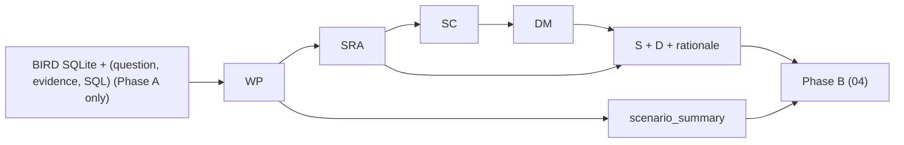

# 03 · DataWorld Construction (Document-Aggregate Recovery)

> 本文件是 TEND **DataWorld 构造(Phase A)** 的单一真源。
> 它定义：**BIRD mini-dev** 如何作为 **数据源 + 查询工作负载源** 驱动 MongoDB 文档世界构造;**Document-Aggregate Recovery (DAR)** 第一性原理——异构是「反范式化恢复文档聚合」的涌现属性而非注入装饰,且**必须 query-bearing**;WP / SRA / SC / DM 四 Agent 的角色与契约;11 种官方 design pattern 与 3 种 anti-pattern;**五种异构机制(多态/稀疏/动态键/嵌套/版本)↔ 真实信号 ↔ 查询族**;Gate-QB / Gate-SD 发布门禁。
> 它**不定义**：record 发布格式 ([02](./02_dataset_design.md))、Phase B 查询构造 ([04](./04_agent_framework.md))、评测协议 ([05](./05_evaluation_methodology.md))。
>
> **构造源**：BIRD mini-dev(`minidev/MINIDEV/`,11 真实业务库),**test-only**(11 库全部进 test,无 train/holdout,见 [02 §02-3](./02_dataset_design.md#02-3))。

---

## Part I

## TL;DR

TEND 的 DataWorld 以 **BIRD mini-dev** 11 个真实业务库为 **数据源 + 查询工作负载源**：提供行级实例(脏数据:大量 NULL、可选列、枚举码、历史字段)、`database_description` 列语义(含 `value_description` 枚举)、以及 `(question, evidence, SQL, difficulty)` 真实工作负载。**BIRD 的 NL/SQL 不是 MQL 金锚**——Phase B 的 MQL 由 RAR `intent` + 参照 R 锁死；BIRD 的 SQL/join 模式仅作为真实信号驱动聚合发现与异构机制识别。

**第一性原理(DAR)**:schema-less 制造难度的唯一机制是「迫使查询在运行时处理异构」(`$switch`/`$ifNull`/`$objectToArray`/`$unwind`),故**异构必须 query-bearing**——其存在须改变至少一条 record 的 echo-gold 结果,否则即装饰、删除。关系范式化恰把本该异构的文档结构压平了;DAR 不凭空造 variant(噪声),也不照搬同构表(Spider 死路),而是**反范式化恢复文档原生聚合**,异构作为忠实恢复的**涌现属性**。

对每个 `db_id`,四 Agent 子流水线 **WP → SRA → SC → DM** 产出库级三元组:MongoDB schema、冻结 witness 数据、SRA 设计 rationale;WP 另产出 `scenario_summary`(域语义,Phase B NLP 取用)。**WP** 解析 BIRD gold SQL → join 图 + 共现频率 + 聚合深度(真实工作负载,非桩)。**SRA** 两阶段:**Stage A** 按 join 图聚类**聚合**、在 11 pattern 菜单下选 embed/reference 布局;**Stage B** 对每个聚合用五机制探测器从真实信号产出 `__variants` + 稀疏/版本/动态键契约(见 [§03-6](#03-6)),**H0 强制合成路径删除**。**SC** 对抗性审查 + **query-bearing 门禁(Gate-QB)前置**;供给不足时如实下调机制,不合成兜底。**DM** **反范式化物化**:把真实行按聚合恢复成文档,**分层采样**保留稀有子类型,**忠实落地异构**(行的真实 NULL → 缺字段;判别值 → 其子类型形状)。

设计立场:**异构不是 DM 迁移后注入的一步,而是迁移本身(= 聚合设计 = 反范式化)的产物**;判别器键名为真实列名(如 `bond_type`),禁止合成 `field_a`/`variant_a`/`__type` 与冗余 `payload` 镜像。`schema` 须声明恢复后的真实字段结构,与 `data` 一致(Gate-SD,修 v9 `{_id,payload}` 塌缩)。

MongoDB 设计采用 **11 官方 pattern + 3 anti-pattern** 菜单(见 §03-2)。Pattern 包括 embedded、extended reference、polymorphic、attribute、bucket、computed、subset、tree、outlier、schema versioning、mixed。Anti-pattern 包括 unnecessary collections、excessive lookups、over-indexing——SC 与 publish gate 必须拒绝命中项。

> **Canonical anchor**:跨卷锚 `financial/1001` 取自 BIRD 真实库 `financial`(test-only 集内),**pending DAR Phase A 执行验证**——异构信号(稀疏 `loan` 682/4500、多态 `trans`)实测,account 反范式化布局 / gold MQL / `world_signature` 待 DAR Phase A 在 MongoDB 上构造 + 执行验证后冻结。**注**:本卷 §03 端到端构造走查中的 `orchestra` 仅为 smoke fixture,不是 production release 记录,待 DAR Phase A 实现 financial 构造后替换;§03-II-9 嵌入的 canonical record 块已为 `financial/1001`。库级资产路径与 record 契约见 [02 §02-2](./02_dataset_design.md#02-2)。

---

<a id="03-0"></a>
## §03-0 摘要与立场

**本章定位**：TEND 构造流水线的 **Phase A（DataWorld）**，职责是在 Phase B 出现之前产出可消费的二元组：

$$
\mathcal{W} \;=\; (\text{Schema},\ \text{WitnessData})
$$

外加 per-db **agent_design_rationale**（SRA 决策链）与 WP **scenario_summary**（场景语境，Tier-2 audit 路径，Phase B NLP 消费）。

**立场声明 (DAR · BIRD as data + workload source)**：

1. **BIRD 是数据源 + 查询工作负载源，不是 MQL oracle**。BIRD 提供 SQLite 脏数据、`database_description` 列语义、`(question, evidence, SQL, difficulty)` 真实工作负载;Phase B 的 MQL 由 `intent` 与独立参照 R 锁死,**不**以 BIRD NL/SQL 为金锚;但 BIRD 的 SQL/join 模式与列统计**作为真实信号**驱动聚合发现与五机制识别。
2. **异构 = 反范式化恢复,且必须 query-bearing**。关系范式化把文档原生异构压平;SRA 用真实信号(判别列、NULL 率、EAV 表、时间列、FK+join 频率)**恢复**聚合而非注入装饰。任一异构机制须被至少一条 record 的 MQL 利用(删除它会改变 echo-gold 结果),否则删除(Gate-QB,见 [§03-6-3](#03-6-3))。
3. **DataWorld 是自足的且 schema≡data**。schema + witness + rationale 须支撑该库访问模式的可执行性论证;schema 声明的字段/变体须与 data 一致(Gate-SD)。
4. **Phase A / Phase B 分离**。03 产出 S、D、rationale、scenario_summary;04 消费上述资产构造 record。03 不定义 canonical_form_set、不产出 MQL、不进行 NNC / dual-bridge 裁决。

---

<a id="03-1"></a>
## §03-1 架构与数据流

### §03-1-1 整体架构

Phase A 以 **Profile → Design (2-stage) → Critique → Migrate** 四拍推进：

1. **WP** 读取 BIRD catalog 条目、SQLite schema、`(question, evidence, SQL)` 工作负载，输出 workload profile（`wp_output.yaml`，含真实 join 图）与 `scenario_summary`。
2. **SRA Stage A** 读取 WP 输出 + BIRD DDL，应用 11 pattern 菜单，产出 baseline layout。
3. **SRA Stage B** 对 Stage A layout 用五机制(①多态/②稀疏/③类型/④嵌套/⑤版本)探测器从真实信号恢复异构；命中时在 `mongodb_schema` 写入 `__variants`，在 rationale 写入 `heterogenization`（见 [§03-6](#03-6)）。
4. **SC** 对抗性审查 SRA 输出 + **query-bearing 门禁(Gate-QB)前置**；命中 anti-pattern、装饰性异构或 workload 覆盖缺口则 **reject → SRA 修订**（最多 2 轮）；并行执行 query-bearing 供给 pre-audit，写入全局供给报告。
5. **DM** 按 SRA 映射（含 variant 路由）反范式化物化 BIRD 行级数据 → `mongodb_data/<db_id>.json`；写入 `audit/<db_id>/migration_log.json`；计算 `world_signature`。
6. **Audit detectors**（非 Agent）扫描 witness，登记自然涌现现象至 `audit/<db_id>/phenomena_audit.json`（Tier-2，可选）。

Phase B（[04](./04_agent_framework.md)）消费 Tier-1 库级资产 S、D、rationale 与 WP `scenario_summary`；**不**消费 BIRD `(question, evidence, SQL)` 工作负载作为 MQL oracle。03 不回流 Phase B 产物。



### §03-1-2 单库主路径（以 orchestra 为例 · 过渡示意）

> **过渡锚**:本节用 `orchestra` 作为 smoke fixture 演示 schema-less 难度的端到端路径;`orchestra` 不是 BIRD test-only production release 记录,标注 `PENDING BIRD migration`,待 DAR 实现后由真实 BIRD 记录(参考 `financial`,见 [§03-6-4](#03-6-4))替换。

1. **Catalog 选中**：`bird_db_catalog.json` 中 `db_id = orchestra`，`selected = true`。
2. **WP 剖析 workload**：四表 join 链 conductor → orchestra → performance → show；62% 查询触及 performance/show 度量；38% 需 per-entity 序列聚合。同步产出 `scenario_summary`（古典音乐机构域：指挥–乐团–演出–观众出勤等业务问题样态）。
3. **SRA 设计 layout**：单集合 `conductor` 根文档；embed `orchestra[]`；embed `performance[]`（Attendance 来自 show 表 denormalize）；pattern 主标签 `embed` + `mixed`（show 字段折叠）。
4. **SC 审查**：确认无 unnecessary collection（仅 1 个 Tier-1 集合）；$lookup 深度预算 0（embed 消解）；workload 热路径覆盖；该库五机制均无真实信号,不产出 query-bearing 异构。
5. **DM 迁移**：12 行 conductor → 12 文档；嵌套 orchestra / performance 数组；migration log 逐行可追溯。
6. **发布**：`mongodb_schema/orchestra.json`、`mongodb_data/orchestra.json`、`agent_design_rationale/orchestra.yaml` 写入 Tier-1；`scenario_summary` 写入 `audit/orchestra/wp_output.yaml`（Tier-2）。

### §03-1-3 确定性与可复现性

给定同一 BIRD SQLite 快照、同一 Agent prompt 版本、同一 `--seed`，DM 输出 bit-by-bit 可复现；`world_signature = sha256(JCS(mongodb_data/<db_id>.json))` 完全相同。SRA 设计 rationale 须记录 seed 与 prompt 版本供 audit 重放。

---

<a id="03-2"></a>
## §03-2 MongoDB Design Pattern 菜单

SRA Stage A 只允许从下列 **11 官方 pattern** 组合选型；`patterns_applied[0]` 写入 record 的 `schema_pattern` 字段（六轴覆盖轴，见 [02 §4](./02_dataset_design.md#02-4)）。**Stage B 五机制**在 Stage A layout 上从真实信号恢复 schema 异构（见 [§03-6](#03-6)）。

| # | Pattern ID | 含义 | 典型触发（WP 信号） | Stage B 关联 |
|---|---|---|---|---|
| 1 | `embed` | 1:N 子文档嵌入父文档数组/对象 | 共现率 ≥ 0.7；子实体无独立查询 | **④ 嵌套** |
| 2 | `extended_reference` | 冗余常用字段到引用侧，避免二次 fetch | 热字段跨集合重复读取 | — |
| 3 | `polymorphic` | 单集合多形状，以判别字段区分 | BIRD 低基数判别列 + `value_description` 枚举 | **① 多态** |
| 4 | `attribute` | 稀疏列折叠为键值或嵌套属性包 | 宽表大量 NULL 列 | **② 稀疏** |
| 5 | `bucket` | 按时间/哈希分桶子文档，控制文档大小 | 高基数时间序列或日志 | — |
| 6 | `computed` | 预计算派生字段服务热聚合 | WP 标记重复 aggregate 表达式 | — |
| 7 | `subset` | 仅嵌入满足谓词的子集 | 查询始终带同一 filter | — |
| 8 | `tree` | 物化路径 / 父指针表达层级 | BIRD 自引用 FK 或 closure 表 | — |
| 9 | `outlier` | 极端值单独子文档或标记字段 | 分布长尾；稳健统计查询 | — |
| 10 | `schema_versioning` | 文档带 schema 版本号，多代字段共存 | BIRD 时间/季节列 → 历史字段并存 | **⑤ 版本** |
| 11 | `mixed` | 同一实体部分 embed、部分 reference | WP 共现率分裂（0.3–0.7） | — |
| — | *(Stage B only)* | EAV 表晋升为动态键文档 | BIRD attribute_name/value 列对 | **④ 动态键** |

**3 Anti-Pattern（SC 必须拒绝）**

| Anti-Pattern ID | 定义 | 检测摘要 |
|---|---|---|
| `unnecessary_collections` | 存在从不被 workload 独立访问、且可被 embed/reference 合并的集合 | 集合零独立 query hit 且行数 < 父实体 10× |
| `excessive_lookups` | 代表 MQL 预估 $lookup 链深度 > WP 建议 join_depth p95 + 1 | SRA 布局迫使 >2 次 $lookup 才能覆盖 50% workload |
| `over_indexing` | 索引数 > 集合数 × 3 且无 workload 谓词支撑 | 索引字段未出现在 WP hot_fields top-20 |

Pattern 选取须写进 `agent_design_rationale` 的 `decisions[]`，每条含 `id`（D01…）、`type`、`parent/child`、`rationale`、引用的 WP `pattern_id` 或 query 证据。

---

<a id="03-3"></a>
## §03-3 反范式化恢复 Schema 设计（SRA）

SRA 输入：WP `wp_output.yaml`、BIRD `tables.json` / `columns.json`（含 `database_description` 列语义）、可选 SQLite 采样行。输出：`mongodb_schema/<db_id>.json` 与 `agent_design_rationale/<db_id>.yaml`（schema 见 `schemas/agent_design_rationale.schema.json`）。

**Stage A — baseline layout**

1. **Workload coverage**：WP 标记的 top-10 access pattern 必须能在 SRA layout 上表达为 ≤2 次 `$unwind` 或可避免的 `$lookup`。
2. **Referential sanity**：每个 BIRD FK 在 MongoDB 中必须有 embed 路径或 `_id` 引用目标；DM 不得产生 dangling ref。
3. **Document size budget**：单文档 BSON < 16 MB；超限时 SRA 须切换 bucket 或 reference，并在 rationale 中记录。
4. **Primary pattern 标签**：`patterns_applied[0]` 取对 workload 覆盖贡献最大的 pattern；其余模式写入 `patterns_applied[1:]`。
5. **No phenomena planting**：SRA 不为「未来现象」人工注入 outlier / null cluster；稀疏与异常来自 BIRD 源数据与 DM 保真迁移。

**Stage B — schema heterogenization（反范式化恢复）**

6. 对 Stage A layout 运行五机制探测器（[§03-6-2](#03-6-2)）从真实信号恢复异构；任一命中则写入 collection-level `__variants` 与 rationale `heterogenization`。
7. 异构化是 **layout 设计决策（= 聚合设计 = 反范式化）**，不是 DM 事后注入；DM 仅按真实判别值路由填充。
8. 无真实信号时 `__variants` 省略，`schema_flex = none`（见 [02 §2](./02_dataset_design.md#02-2)）；不合成兜底异构。

**orchestra 决策摘要**（smoke fixture, not production release；待 DAR 实现后由真实 BIRD 记录(`financial`,见 [§03-6-4](#03-6-4))替换）

- D01 embed：orchestra[] ⊂ conductor（WP AP02 co_access 0.91）
- D02 embed：performance[] ⊂ orchestra（WP AP01 nested_traversal 0.62）
- D03 extended_reference：Attendance 自 show 表 denormalize 至 performance（WP hot_field show.Attendance）
- patterns_applied: `[embed, mixed]`

---

<a id="03-4"></a>
## §03-4 数据迁移（DM）与自然现象

DM 输入：SRA schema + rationale、BIRD SQLite。输出：`mongodb_data/<db_id>.json`、`audit/<db_id>/migration_log.json`、`world_signature`。

**迁移原则（反范式化物化）**

1. **Lossless at workload grain**：WP 热路径涉及的列必须可追溯到 witness 字段路径。
2. **PK 稳定**：BIRD 主键映射为 MongoDB `_id` 或业务键字段，全库一致。
3. **Null as missing**：BIRD NULL → 字段缺失（非 JSON null），保留 empty-vs-missing 自然现象。
4. **分层采样保真**：按真实判别值路由 source row 到对应 variant 形状,确定性分层抽样(sha256 排序)保留稀有子类型;禁止 `idx % N` round-robin 与 `f"{fname}_{idx}"` 占位。
5. **Append-only audit**：migration log 仅追加条目，不修改已发布 witness。

**自然涌现现象（audit-only detectors）**

Detector 在 DM 完成后只读 witness，典型登记类包括：

| _detector_ | 自然来源 | 用途 |
|---|---|---|
| sparse_field | 源库 NULL / 缺失列 | null-coalesce 提示 |
| type_drift | BIRD 类型不一致 | 鲁棒解析题 |
| outlier_value | 源库极端值或录入错误 | 稳健统计题 |
| cardinality_boundary | embed 数组长度 0/1 | 组大小敏感聚合 |
| empty_vs_missing | DM null-as-missing 策略 | $ifNull / 存在性题 |

Detector **禁止**修改 witness；若 RA 后续 augment，须 append-only 且重算 `world_signature`（边界见 [02 §2](./02_dataset_design.md#02-2)）。

---

<a id="03-6"></a>
## §03-6 Heterogeneity Recovery Layer (SRA Stage B · DAR)

### §03-6-1 第一性原理动机

MongoDB 与关系数据库的根本差异是 **schema-less**:同一 collection 内文档可拥有不同字段集。其制造查询难度的**唯一**机制,是迫使查询在运行时处理异构(`$switch`/`$ifNull`/`$objectToArray`/`$unwind`)——这正是 SQL(schema 固定)表达不出的部分。

**DAR 立场**:Spider 那种人工清洗的关系表 H1–H4 几乎不触发,被迫走 H0 合成 `field_a`(噪声,非 query-bearing)。BIRD 是真实业务库,异构信号**自然存在**(实证:11 库共 165 稀疏列 + 78 判别列,`bond_type` 被 19 条 SQL 引用)。SRA Stage B 不再"注入"异构,而是用 deterministic 真实信号探测器**反范式化恢复**被关系范式压平的文档聚合;每个机制都配对它在查询侧逼出的算子族,并须通过 **query-bearing 门禁**(§03-6-3)。**H0 强制合成路径删除;判别器用真实列名,禁止 `field_a`/`variant_a`/`__type`/`payload` 镜像。** **RAR 收紧:五机制无一例外仅由真实信号恢复(含③类型漂移——仅当真实混合类型列存在才恢复),全流水线零合成兜底;无真实信号则 `schema_flex = none`。**

<a id="03-6-2"></a>
### §03-6-2 五机制 ↔ 真实信号 ↔ 查询族

每个机制反转一种关系范式化,由一类 BIRD 真实信号 deterministic 驱动,并配对其在查询侧逼出的算子族(对齐 [04](./04_agent_framework.md) 与 NNC 难度链):

| 机制 | 反转的关系范式 | 真实信号(BIRD,deterministic) | `__variants`/契约 | schema_flex / 难度 |
|---|---|---|---|---|
| **① 多态子类型** | 子类型拆表 / 宽表 NULL 簇 | 低基数判别列(2–8 值)+ `value_description` 枚举;被 ≥1 条 SQL 条件化 | 各子类型真实字段集(按判别值分组真实列得出) | `polymorphic` / L4 `structural_schema_flex` |
| **② 可选/稀疏** | 可空列 | 列 NULL 率 ∈ (0.05, 0.95) | 字段 presence(行级忠实,p = 1−null_rate) | (presence,自然现象) / `semantic` |
| **③ 类型/结构** | (关系强类型) | **真实混合类型列**(SQLite affinity/取值混型,如某列部分行 text 部分 int);**永不合成** | 标量↔嵌套对象↔数组(按真实类型分布) | `dynamic_key` / L4 |
| **④ 嵌套** | 1:N 父子拆表 | FK + 查询 join 频率(共现) | 子表 embed 为数组(高基数则 reference) | (`schema_pattern`+`join_depth` 轴) / L2–L3 |
| **⑤ 版本演进** | 历史用时间列 | 时间/季节列(如 `Match.season`) | 多版本字段(改名/增/弃),按时间桶偏态 | `schema_versioning` / `semantic` |

典型算子:① `$switch`/`$cond`;② `$ifNull`/`$exists`;③ `$objectToArray`/`$type`;④ `$unwind`/`$filter`;⑤ `$ifNull` 多层链。机制 ↔ 查询族 ↔ 难度是一枚硬币的两面。**多机制可在一个聚合上叠加**(各自独立按真实信号触发与采样),笛卡尔积产生开放式形状分布(非 v9 恒 2 形状)。

**`__variants` 结构**(collection-level,optional;判别器键 = **真实列名**,非合成 `__type`):

```json
"__variants": [
  {
    "discriminator": { "assessment_type": "written" },
    "fields": { "written_score": "REAL", "word_count": "INT" },
    "coverage": 0.55,
    "source_signal": "①polymorphic: Candidate_Assessments.assessment_type=written (value_description enum)"
  },
  {
    "discriminator": { "assessment_type": "oral" },
    "fields": { "oral_score": "REAL", "duration_minutes": "INT" },
    "coverage": 0.45,
    "source_signal": "①polymorphic: Candidate_Assessments.assessment_type=oral"
  }
]
```

`coverage` 为 witness 中该 variant 真实占比(天然偏态,允许不满 1.0,残差落 baseline 形状);DM 按**真实判别值**路由 source row,**禁止** `idx % N` round-robin 与 `f"{fname}_{idx}"` 占位填充。

**混合披露契约(RAR · solver-facing)**:`__variants` 是**混合披露**——它向 solver 声明判别列 + 各 variant 的字段集 + `coverage`(presence 率),但**不**承诺「判别值 → 精确字段集」的**确定函数**,也**不**声明逐 doc 形状。即:solver 读 S 知道「有哪些 variant、各自可能有哪些字段、大致占比」,但运行时仍须 per-doc 处理真实形状(某个 `assessment_type=written` 的 doc 仍可能缺 `word_count`)。这是 schema-less 难度的**甜区**:全披露(逐 doc 确定形状)会把难度声明掉、潜隐(S 不声明)会让 S 失效;混合披露恰好让 [06](./06_solution_design.md) 的 probe-based solver 有意义——**S 给线索,D 给真相**。难度留给 solver:正确 dispatch + 处理 per-doc 缺字段。

<a id="03-6-3"></a>
### §03-6-3 Query-bearing 门禁(Gate-QB)与反样板

> **Gate-QB**:数据中出现的每个异构机制实例(一个 `__variant` / 一个稀疏字段 / 一个版本),必须至少有一条已发布 record 的 MQL 真正利用它——即抹平该机制后 echo-gold 结果改变。否则判定为装饰,从 schema 与 data 一并删除(记 `audit/_global/dropped_decoration.json`)。

> **Gate-SD(schema≡data,集合级)**:`mongodb_schema` 声明的每个字段/变体须在 `mongodb_data` 出现,`mongodb_data` 每个字段/变体须在 S 契约下**可声明**(无未声明字段);守在**集合层**——不要求 S 钉死逐 doc 形状(混合披露,§03-6-2),逐 doc 形状是运行时真相。修 v9 `{_id, payload}` 塌缩与 schema/data 互相矛盾。

**反样板硬约束**(publish 拒绝):合成字段名 `field_a/field_b/variant_a/variant_b`、冗余 `payload` 镜像(除 ⑤ 合法 `payload.{v1,v2,legacy}`)、值为 `f"{fname}_{idx}"` 的占位、合成判别器键 `__type`(须用真实列名)。**废止** `heterogeneous_ratio` 形状计数作为构造目标(降级为 audit 描述统计);构造目标改为最大化 **query-bearing 异构覆盖**。

<a id="03-6-4"></a>
### §03-6-4 参考示例(`financial`,DAR)

聚合发现:`account`(根) ←embed `disp`/`order`(co_access 高、低基数);←reference `trans`(106 万行 → 引用 + 分层采样)。机制:① `account.frequency`[3 值,被 8 条 SQL 引用] → 月结/周结/交易后结子类型;① `card.type`[+enum] → gold/classic/junior;② `trans.k_symbol`(55% null)、`trans.bank`(69% null) → 行级 present/absent;⑤ 按 `account.date` 时间分位 → 版本桶。查询族:"按结算频率分别统计平均余额" → `$switch`(L4);"有银行转账记录的账户数" → `$exists`(semantic)。Gate-QB:frequency/type/k_symbol 均被真实 BIRD SQL 引用 → 全部 bearing ✓。对照 v9:`financial` 原产出 = `{_id, payload}` 塌缩 schema + `account` 单表 + `field_a` → 全部不合格。

---

<a id="03-5"></a>
## §03-5 与下游的接口契约

### §03-5-1 Tier-1 输出资产

| 资产 | 路径 | 消费者 |
|---|---|---|
| MongoDB schema | `mongodb_schema/<db_id>.json` | Phase B MS/PV/RTV、solver、评测 |
| Witness data | `mongodb_data/<db_id>.json` | NormExec、RA |
| Design rationale | `agent_design_rationale/<db_id>.yaml` | 研究者、NNC 诊断 |
| WP profile + scenario | `audit/<db_id>/wp_output.yaml` | Phase B NLP（`scenario_summary`）；SRA 复现（Tier-2） |

### §03-5-2 Phase B 消费边界

Phase B（[04](./04_agent_framework.md)）**消费**：

| 输入 | 来源 | 用途 |
|---|---|---|
| S（schema） | SRA Tier-1 | intent 字段路径、schema_flex 套路选择 |
| D（witness） | DM Tier-1 | NormExec、PV 性质探测、RA realism |
| agent_design_rationale | SRA Tier-1 | pattern 证据、heterogenization 上下文 |
| scenario_summary | WP Tier-2 | NLP 逆向 paraphrase 域语境与业务问题样态 |

Phase B **不消费** BIRD `(question, evidence, SQL)` 工作负载、WP `access_patterns` 中的 SQL 模板、或 BIRD `question_id` 作为 query oracle。

### §03-5-3 query-bearing 供给联动

SC 在 schema review 通过后，对每个 `db_id` 执行 query-bearing 供给判定（五机制任一从真实信号 would-recover 且能通过 Gate-QB → `query_bearing: true`），写入 `bird_db_catalog.json` 对应条目。test-only：11 库全部进 test,供给统计覆盖全集。

全局供给报告写入 `audit/_global/query_bearing_supply_report.json`：

| 字段 | 说明 |
|---|---|
| `min_query_bearing_ratio` | 配置阈值（默认 0.30）；库中 `query_bearing` 比例须 ≥ 此值，否则触发供给下调 |
| `query_bearing_ratio` | 当前库的 `query_bearing` 占比 |
| `supply_ceiling` | 实际可达上限（= `query_bearing_ratio`） |
| `h7_relaxed` | bool；若 `query_bearing_ratio < min_query_bearing_ratio`，Coverage Controller 将 H7 下限放宽至 `max(0.15, supply_ceiling)` |
| `h9_relaxed` | bool；structural_schema_flex 下限放宽至 `max(0.10, supply_ceiling × 0.8)` |

Coverage Controller（[04](./04_agent_framework.md)）读取该报告，在 Phase B 采样时应用供给下调（详见 [02 §4](./02_dataset_design.md#02-4) H7/H9）。

### §03-5-4 03 不负责的内容

| 主题 | 归属 |
|---|---|
| record 字段、test-only 基准组织 | [02](./02_dataset_design.md) |
| MQL、canonical_form_set、mutations | [04](./04_agent_framework.md) |
| EX、七指标 | [05](./05_evaluation_methodology.md) |
| SMART solver | [06](./06_solution_design.md) |

---

## Part II

### §03-II-1 Agent 契约总览

| Agent | 输入 | 输出 | 边界（禁止） |
|---|---|---|---|
| **WP** | `db_id`, BIRD SQLite, `(question, evidence, SQL)` 工作负载, catalog metadata | `audit/<db_id>/wp_output.yaml`（含真实 join 图与 `scenario_summary`） | 不得输出 MongoDB schema 或 MQL |
| **SRA** | WP output, BIRD DDL, pattern menu, 五机制探测 spec | `mongodb_schema/<db_id>.json`（含 optional `__variants`）, `agent_design_rationale/<db_id>.yaml`（含 optional `heterogenization`） | 不得读 Phase B 产物；不得 plant 现象；不得合成兜底异构；Stage B 仅写 layout |
| **SC** | SRA schema + rationale, WP output, anti-pattern rules, `min_query_bearing_ratio` config | `pass/reject` verdict + `issues[]`；Gate-QB 裁决；per-db `query_bearing`；`audit/_global/query_bearing_supply_report.json` | 不得重写 witness；不得产出最终 schema 文件 |
| **DM** | SRA schema + rationale, BIRD SQLite | `mongodb_data/<db_id>.json`, `migration_log.json`, `world_signature` | 不得改 schema 字段集；按真实判别值路由 `__variants`；不得 delete 源映射行 |

Prompt 文件：`agent_prompts/wp_workload_profiler.md`、`sra_schema_rearchitect.md`、`sc_schema_critic.md`、`dm_data_migrator.md`。

---

### §03-II-2 WP Agent 契约

**Input**

| 字段 | 来源 | 必需 |
|---|---|---|
| `db_id` | catalog | ✓ |
| `sqlite_path` | catalog | ✓ |
| `bird_queries` | mini_dev_sqlite.json 过滤 | ✓ |
| `tables` / `columns` | BIRD schema JSON（含 `database_description`） | ✓ |

**Output**（`schemas/wp_output.schema.json`）

| 字段 | 说明 |
|---|---|
| `db_id`, `source_version`, `generated_at` | 元数据 |
| `source.tables`, `source.query_count` | 源库摘要 |
| `access_patterns[]` | 真实 join 路径、频率、示例 question_id、NL hint |
| `hot_fields[]` | 字段级访问计数 |
| `co_location_signals[]` | embed 候选对的共现率（真实 join 图） |
| `join_depth_distribution` | 驱动 $lookup 预算 |
| `design_constraints[]` | 传给 SRA 的硬约束句子 |
| `scenario_summary` | 域语义、实体关系自然语言、典型业务问题样态（≥3 条 pattern 描述）；**禁止 SQL / MQL / 算子术语**；专供 Phase B NLP paraphrase |

**Boundaries**

- 不猜测 MongoDB layout；不输出 pattern 选型。
- 频率统计对同一 SQL 模板去重后计数；join 图取自真实 BIRD SQL（非桩）。
- `scenario_summary` 不得引用 BIRD 具体 question 文本或 SQL 片段；仅抽象业务语境。
- 若 `query_count < 10`，输出 `insufficient_workload: true` 并建议 catalog reject。

---

### §03-II-3 SRA Agent 契约

**Input**

| 字段 | 来源 | 必需 |
|---|---|---|
| `wp_output.yaml` | WP | ✓ |
| `tables` / `columns` | BIRD（含 `database_description`） | ✓ |
| `pattern_menu` | 本卷 §03-2 | ✓ |

**Output**

| 文件 | Schema |
|---|---|
| `mongodb_schema/<db_id>.json` | `schemas/library.schema.json#mongodb_schema` |
| `agent_design_rationale/<db_id>.yaml` | `schemas/agent_design_rationale.schema.json` |

**Stage B 附加输出**（任一机制从真实信号恢复时）

| 字段 | 位置 | 说明 |
|---|---|---|
| `__variants` | `mongodb_schema` collection 节点 | variant 形状声明（判别器键 = 真实列名） |
| `heterogenization` | rationale YAML | 命中机制、BIRD 真实信号、variant 参数 |

**Boundaries**

- 每个 `decisions[]` 必须引用 ≥1 条 WP 证据（`access_pattern` id 或 `hot_field` path）。
- 不得创建 anti-pattern 命中布局；不得合成兜底异构（无真实信号则不恢复）。
- SC reject 后仅修订 rationale 与 schema，不得调用 DM。
- Stage B 机制探测须 deterministic（见 [§03-II-10](#03-ii-10)）；不得用 LLM 判断是否异构化。

---

### §03-II-4 SC Agent 契约

**Input**

| 字段 | 来源 | 必需 |
|---|---|---|
| SRA schema + rationale | SRA | ✓ |
| `wp_output.yaml` | WP | ✓ |
| `anti_pattern_rules` | §03-II-5 | ✓ |
| `min_query_bearing_ratio` | 全局配置（默认 0.30） | ✓ |

**Output**

| 字段 | 说明 |
|---|---|
| `verdict` | `pass` \| `reject` |
| `issues[]` | `{rule_id, severity, message, evidence}` |
| `coverage_gaps[]` | WP pattern 无 layout 表达 |
| `suggested_fixes[]` | 自然语言修订建议（非自动 patch） |
| `query_bearing` | bool；该 `db_id` 是否有五机制从真实信号 would-recover 且能通过 Gate-QB（deterministic 预演，不要求 Stage B 已写入 `__variants`） |
| `query_bearing_supply_report` | 全局报告片段；所有 db 审查完成后汇总至 `audit/_global/query_bearing_supply_report.json` |

**Query-bearing 供给 pre-audit**

1. 对每个 `db_id` 运行与 [§03-II-10](#03-ii-10) 相同的五机制 deterministic 预演（只读 WP + BIRD DDL/SQLite，不写 schema）。
2. 任一机制从真实信号 would-recover 且能通过 Gate-QB → `query_bearing: true`；否则 `false`。
3. 写入 `bird_db_catalog.json` 对应条目的 `query_bearing` 字段。
4. test-only:11 库全部审查完成后，计算 `query_bearing_ratio = count(query_bearing) / count(selected)`。
5. 若 `query_bearing_ratio < min_query_bearing_ratio`，在 `query_bearing_supply_report` 中设置 `h7_relaxed: true`、`h9_relaxed: true`，并写入 `supply_ceiling = query_bearing_ratio`；Coverage Controller 读取后应用 H7/H9 供给下调（[02 §4](./02_dataset_design.md#02-4)）。

**Boundaries**

- 最多 2 轮 reject；仍 fail 则 catalog 标记 `schema_review_failed`。
- 不写入 Tier-1 文件；人类或 SRA 编排器应用 fixes。
- 供给 pre-audit 不得修改 SRA schema；仅只读判定 + catalog/report 写入。

---

<a id="03-ii-5"></a>
### §03-II-5 Anti-Pattern Detector 规则

| Rule ID | 条件 | Severity | 动作 |
|---|---|---|---|
| AP-UC-01 | 集合 `C` 满足：`independent_query_hits(C) = 0` AND `rows(C) < 10 × rows(parent(C))` AND `C` 非 polymorphic 判别集合 | error | reject |
| AP-UC-02 | Tier-1 集合数 > WP `access_patterns` 中 distinct root entity 数 + 1 | error | reject |
| AP-EL-01 | 预估覆盖 50% workload 所需 `$lookup` 次数 > `floor(join_depth_p95) + 1` | error | reject |
| AP-EL-02 | 同一查询路径需链式 `$lookup` ≥ 3 且无 bucket 豁免 | warning | reject if ≥2 warnings |
| AP-OI-01 | 索引字段 ∉ WP `hot_fields` top-20 且非 `_id`/FK | warning | reject if warnings ≥ 3 |
| AP-OI-02 | 索引数 > 3 × 集合数 | error | reject |
| AP-WC-01 | WP top-5 `access_patterns` 中任一无法在 SRA layout 表达（SC 仿真 unwind/lookup） | error | reject |
| AP-WC-02 | WP `design_constraints` 任一条无对应 `decisions[]` 引用 | error | reject |

**Workload coverage 仿真**：SC 对每个 access pattern 做静态路径解析——若需 >2 `$unwind` 或 >1 `$lookup` 且 SRA 未声明 `mixed`/`extended_reference` 豁免，则记 AP-WC-01。

---

### §03-II-6 DM Agent 契约

**Input**

| 字段 | 来源 | 必需 |
|---|---|---|
| `mongodb_schema/<db_id>.json` | SRA | ✓ |
| `agent_design_rationale/<db_id>.yaml` | SRA | ✓ |
| BIRD SQLite | catalog | ✓ |

**Output**

| 文件 | Schema |
|---|---|
| `mongodb_data/<db_id>.json` | `schemas/library.schema.json#mongodb_data` |
| `audit/<db_id>/migration_log.json` | `schemas/migration_log.schema.json` |
| `world_signature` | `sha256:` + 64 hex |

**Boundaries**

- 不得增删 schema 声明字段；仅填充值。
- 若 SRA 声明 `__variants`，按真实判别值（`discriminator`）路由 source row 到对应 variant 形状；确定性分层抽样（sha256 排序）保留稀有子类型。
- 每条 source row 至少一条 migration log entry；variant 路由须记入 `operation: variant_route`。
- 禁止 `idx % N` round-robin 与 `f"{fname}_{idx}"` 占位填充。
- FK 违反写入 `integrity_checks.orphan_refs`；>0 则 DM fail。

---

### §03-II-7 Migration Log Schema 参考

完整 JSON Schema：`schemas/migration_log.schema.json`。

**顶层字段**

| 字段 | 类型 | 说明 |
|---|---|---|
| `db_id` | string | BIRD db_id |
| `generated_at` | date-time | 迁移完成时间 |
| `source_sqlite` | string | 源 SQLite 路径 |
| `target_collections` | string[] | 产出集合列表 |
| `stats` | object | `source_rows`, `target_documents`, `tables_migrated` |
| `entries` | array | 行级映射（见下） |
| `integrity_checks` | object | `referential_pass`, `row_count_reconciled`, `orphan_refs` |

**Entry 字段**

| 字段 | 类型 | 说明 |
|---|---|---|
| `entry_id` | string | `M` + 序号，如 `M0001` |
| `source_table` | string | BIRD 表名 |
| `source_pk` | string | 主键字符串化 |
| `target_collection` | string | MongoDB 集合 |
| `target_id` | string \| number | 目标 `_id` |
| `operation` | enum | `root_insert` / `embed_push` / `field_denorm` / `ref_link` / `variant_route` |
| `target_path` | string | 点路径；根插入时为 null |
| `embedded_children` | string[] | 嵌套表名列表 |

**校验命令**

```bash
jsonschema --schema proposals/schemas/migration_log.schema.json \
  --instance proposals/schemas/migration_log.schema.valid.json

jsonschema --schema proposals/schemas/agent_design_rationale.schema.json \
  --instance proposals/schemas/agent_design_rationale.schema.valid.json

# mongodb_schema with __variants (validate against library.schema.json oneOf)
jsonschema --schema proposals/schemas/library.schema.json \
  --instance proposals/schemas/mongodb_schema.variants.valid.json

jsonschema --schema proposals/schemas/library.schema.json \
  --instance proposals/schemas/mongodb_schema.variants.invalid.json
# 期望：非零退出码
```

---

### §03-II-8 JSON Schema 索引

| 文件 | 校验对象 |
|---|---|
| `schemas/wp_output.schema.json` | WP Agent 输出 |
| `schemas/agent_design_rationale.schema.json` | SRA rationale YAML |
| `schemas/agent_design_rationale.schema.valid.json` | valid 示例 |
| `schemas/agent_design_rationale.schema.invalid.json` | invalid 示例 |
| `schemas/migration_log.schema.json` | DM migration log |
| `schemas/migration_log.schema.valid.json` | valid 示例 |
| `schemas/migration_log.schema.invalid.json` | invalid 示例 |
| `schemas/mongodb_schema.variants.valid.json` | mongodb_schema with `__variants` (valid) |
| `schemas/mongodb_schema.variants.invalid.json` | mongodb_schema with `__variants` (invalid) |

---

<a id="03-ii-10"></a>
### §03-II-10 五机制探测器伪代码（DAR）

# uses: collections, hashlib, re, sqlite3

每个机制从真实 BIRD 信号 deterministic 探测,**无 H0 强制合成兜底**(无信号则不恢复);判别器键用**真实列名**,非合成 `__type`;抽样用确定性分层(sha256 排序,保留稀有子类型)。

```
def eval_h1_polymorphic(bird_columns, value_descriptions, bird_sql) -> dict | None:
    """① polymorphic: low-cardinality discriminator col (2-8 distinct) carrying a
    value_description enum, conditioned by >=1 real BIRD SQL. Returns the real
    discriminator column + subtype values, or None (no synthesis fallback)."""
    for table, cols in bird_columns.items():
        for c in cols:
            vals = distinct_values(table, c)                 # real column values
            if not (2 <= len(vals) <= 8):
                continue
            if not value_descriptions.get((table, c)):       # must carry enum semantics
                continue
            if count_type_conditional_sql(bird_sql, table, c) < 1:  # query-bearing precondition
                continue
            return {"table": table, "discriminator_col": c, "subtype_values": vals}
    return None

def eval_h2_sparse(sqlite_conn, table) -> list[str]:
    """② sparse: columns whose real NULL rate ∈ (0.05, 0.95) → row-level presence."""
    null_rates = column_null_rates(sqlite_conn, table)
    return [col for col, r in null_rates.items() if 0.05 < r < 0.95]

def eval_h3_schema_version(bird_columns, table) -> bool:
    """⑤ versioning: time/season column → multi-version fields skewed by time bucket."""
    cols = bird_columns.get(table, [])
    has_time = any("date" in c.lower() or "time" in c.lower() or "season" in c.lower()
                   for c in cols)
    has_rename = detect_column_rename_pair(cols)  # e.g. old_name + new_name
    return has_time and has_rename

def eval_h4_eav(sqlite_conn, table) -> str | None:
    """④ dynamic_key: entity-attribute-value table → dynamic-key document.
    Returns the real attribute-name column, or None."""
    cols = table_columns(sqlite_conn, table)
    name_col = find_col(cols, suffixes=["attribute_name", "attr_name", "property_name"])
    val_col = find_col(cols, suffixes=["attribute_value", "attr_value", "property_value"])
    if not (name_col and val_col):
        return None
    rows = sqlite_conn.execute(f"SELECT COUNT(DISTINCT entity_id) FROM {table}").fetchone()[0]
    return name_col if rows >= 3 else None

def recover_mechanisms(wp, bird_meta, sqlite_conn) -> list[dict]:
    """Probe all five mechanisms from real signal; multiple may stack on one
    aggregate. No priority arbitration, no H0/force_document_flex fallback —
    if a db yields zero query-bearing signal, return [] (schema_flex=none)."""
    recovered = []
    h1 = eval_h1_polymorphic(bird_meta.columns, bird_meta.value_descriptions, bird_meta.sql)
    if h1:
        recovered.append({"mechanism": "①polymorphic", **h1})
    for table in bird_meta.tables:
        sparse = eval_h2_sparse(sqlite_conn, table)
        if sparse:
            recovered.append({"mechanism": "②sparse", "table": table, "cols": sparse})
        eav = eval_h4_eav(sqlite_conn, table)
        if eav:
            recovered.append({"mechanism": "④dynamic_key", "table": table, "name_col": eav})
        if eval_h3_schema_version(bird_meta.columns, table):
            recovered.append({"mechanism": "⑤versioning", "table": table})
    return recovered  # empty list ⇒ no heterogeneity recovered (no synthesis)

def apply_h1_variants(stage_a_schema, table, discriminator_col, subtype_values):
    """Emit __variants keyed by the REAL discriminator column (not __type).
    fields_for_subtype groups the real columns present for rows of that value."""
    variants = []
    for val in subtype_values:
        variants.append({
            "discriminator": {discriminator_col: val},          # real column name
            "fields": fields_for_subtype(table, discriminator_col, val),
            "coverage": real_coverage(table, discriminator_col, val),  # true witness share
            "source_signal": f"①polymorphic: {table}.{discriminator_col}={val}",
        })
    return attach_variants(stage_a_schema, collection=root_collection(table), variants=variants)

def stratified_sample(rows, discriminator_col, n):
    """Deterministic stratified sampling: sha256-sort within each subtype stratum so
    rare subtypes survive (never round-robin / placeholder fill)."""
    by_subtype = collections.defaultdict(list)
    for r in rows:
        by_subtype[r[discriminator_col]].append(r)
    out = []
    for subtype, group in by_subtype.items():
        group.sort(key=lambda r: hashlib.sha256(stable_key(r).encode()).hexdigest())
        out.extend(group[:max(1, round(n * len(group) / len(rows)))])  # keep >=1 per stratum
    return out
```

**错误处理**

| 异常 | 触发条件 | 动作 |
|---|---|---|
| `VariantCoverageError` | 某 variant coverage < 0.05 | 合并到 nearest variant 或 skip ①（残差落 baseline 形状） |
| `EmptyVariantError` | ① 仅 1 distinct subtype | 不恢复 ①（无合成兜底） |
| `NoSignalNotice` | 全库五机制零真实信号 | `schema_flex = none`;不合成异构 |

---

### §03-II-9 Canonical Anchor Record

> **⚠ PENDING DAR Phase A**:下方 `financial/1001` 取自 BIRD 真实库 `financial`,跨卷逐字节一致(Gate 3);异构信号实测,但 account 反范式化布局、gold MQL 与 `world_signature`(确定性占位)尚未经 DAR Phase A 在 MongoDB 上构造 + 执行验证。**本卷 §03 构造走查仍为 legacy orchestra 示意**,待 DAR Phase A financial 构造替换。

<!-- canonical-anchor: financial/1001 -->
```json
{
  "record_id": 1001,
  "db_id": "financial",
  "nl_queries": {
    "canonical": "为每个 account 附加一个字段 loan_to_credit_ratio:若该 account 有 loan,取 loan.amount 除以该 account 所有贷记交易(trans.type = 'PRIJEM')的 amount 之和(该和为 0 时按 1 计);若该 account 无 loan,则该字段为 0。保留每个 account 文档(含无 loan 的),只在原文档上新增该字段,不改变文档数与嵌套结构;不要求排序。",
    "colloquial": "给每个账户标注它的贷款相对贷记流水的占比;没有贷款的账户记 0,一个账户都别漏。"
  },
  "MQL": "db.account.aggregate([
  { $lookup: {
      from: \"trans\",
      let: { aid: \"$_id\" },
      pipeline: [
        { $match: { $expr: { $and: [ { $eq: [\"$account_id\", \"$$aid\"] }, { $eq: [\"$type\", \"PRIJEM\"] } ] } } },
        { $group: { _id: null, credit_sum: { $sum: \"$amount\" } } }
      ],
      as: \"_credit\"
  } },
  { $addFields: {
      loan_to_credit_ratio: {
        $cond: [
          { $ne: [ { $type: \"$loan\" }, \"missing\" ] },
          { $divide: [ \"$loan.amount\", { $max: [ { $ifNull: [ { $arrayElemAt: [\"$_credit.credit_sum\", 0] }, 0 ] }, 1 ] } ] },
          0
        ]
      }
  } },
  { $project: { _credit: 0 } }
])",
  "canonical_form_set": {
    "must_contain": ["$lookup"],
    "must_not_contain": ["$sample", "$rand", "$$NOW", "$out", "$merge", "$function"],
    "must_contain_at_root": [],
    "must_not_contain_at_root": ["$unwind", "$group"]
  },
  "difficulty": "L4",
  "sql_infeasibility_class": "structural_schema_flex",
  "shape_policy": "preserve",
  "world_signature": "sha256:58d575b0eb62b1499642ec46e9efe5d5576082ce45d871df0326821f44751346",
  "agent_design_rationale_ref": "fixtures/financial/sra.yaml",
  "mutations_ref": "fixtures/financial/mutations.json"
}
```

Legacy `orchestra` smoke DDL 仅为历史过渡材料；该 smoke fixture 不定义当前 BIRD production contract。
