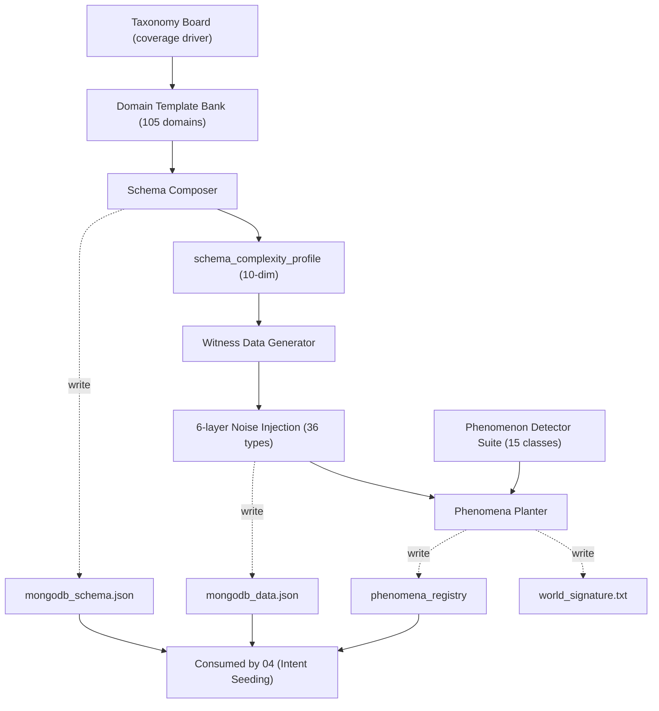

# 03 DataWorld Synthesis (TEND Phase A)

<a id="03-0"></a>
## 03-0 摘要 (正向合成立场)

**本章定位**：TEND 构造流水线的 Phase A，即 DataWorld Synthesis。其职责是在任何查询出现之前，以**正向合成 (forward synthesis)** 的方式独立产出一个可消费的三元组：

$$
\mathcal{W} \;=\; (\text{Schema},\ \text{WitnessData},\ \text{PhenomenaRegistry})
$$

其中 Schema 描述 MongoDB 集合的字段契约与拓扑 (topology)，WitnessData 是按领域自然先验 (natural prior) 生成的真实文档集合，PhenomenaRegistry 注册了这份 WitnessData 中可被观察、可被消费的数据现象 (phenomenon) 实例。

**立场声明 (forward synthesis stance)**：

1. **世界先于问题**。DataWorld 的合成*不*以"将要提出的某条具体查询"为条件。一个 db 及其 witness、phenomena 先独立成世界；此后 Phase B / C / D (由 [04 §1](./04_intent_to_query_construction.md#04-1) 负责) 再基于这个世界派生 Semantic Intent、查询与自然语言问题。
2. **DataWorld 是自足的**。即便从未生成任何查询，$\mathcal{W}$ 本身就应具备意义：schema 有自然异构性，witness 有自然分布与噪声层 (noise layer)，phenomena 覆盖可能被"问"的数据侧结构事实。
3. **查询是消费者，不是生产者**。03 不定义 Semantic Intent、不定义 NLQ、不产出任何查询语言字面、不进行 checker / canonical_form_set 推导、不涉及评测指标。这些概念的所有权属于 [04](./04_intent_to_query_construction.md) 与 [05](./05_evaluation_methodology.md)。03 只生产，不消费。

**四个子模块 (Phase A 内部分解)**：

- **Domain Template Bank**：承载 105 个领域模板 (domain template)，每个模板声明实体清单、关系、F_topology 倾向 (hints)、字段级自然分布先验。详见 [03-2](#03-2)。
- **Schema Composer**：采样某一 domain template，依据 F_topology 特性与复杂度预算 (complexity budget) 把 schema 具体化。详见 [03-3](#03-3)。
- **Witness Data Generator**：按字段自然分布生成文档，并按 6 层噪声 taxonomy (共 36 条) 注入自然瑕疵。详见 [03-4](#03-4)。
- **Phenomena Planter**：在 witness 上运行现象检测器 (detector)，对未自然出现的重要现象主动 plant 证据，最终生成 phenomena_registry。详见 [03-5](#03-5)。

**与下游的契约**：03 的输出目录、record 字段结构、phenomena_registry 发布格式、domain_catalog 发布格式，统一由 [02 §1](./02_dataset_design.md#02-1) 与 [02 §2](./02_dataset_design.md#02-2) 规定；03 端内部的生产 schema 与发布层字段内容严格一致。

---

<a id="03-1"></a>
## 03-1 架构与数据流

<a id="03-1-1"></a>
### 03-1-1 整体架构图



Phase A 以"生成—检测—登记"三拍节奏推进：Schema Composer 负责结构生成，Witness Data Generator 负责内容填充，Phenomena Planter 同时扮演"现象检测器 (detector)"与"现象主动注入器 (planter)"两个角色。所有产出仅写入 [02 §1](./02_dataset_design.md#02-1) 规定的目录，不回流到上游模板。

<a id="03-1-2"></a>
### 03-1-2 一个 db 的主路径

为单个 db (以 `orchestra` 为例) 合成 DataWorld 的 7 步主路径：

1. **Taxonomy Board 选域**：依据全局 coverage audit ([02 §5](./02_dataset_design.md#02-5)) 给出的 domain 优先级，选中目标 cluster 与 domain_id。
2. **Domain Template 加载**：从 Domain Template Bank 读出对应模板 YAML (entity list、relation、f_topology_hints、distribution_priors)。
3. **Schema Composer 采样 F_topology**：在 `topology_seed` 控制下，结合模板 hints 与全局预算约束，采出本 db 的 F_topology 激活子集 (见 [03-3-1](#03-3-1))。
4. **Schema Complexity Profile 计算**：把 schema 具体化后计算 10 分量复杂度向量 (见 [03-3-3](#03-3-3))，写入 `audit/<db_id>/schema_complexity_profile.json`。
5. **Witness Data 生成**：在 `noise_seed` 控制下，按字段自然分布先验生成文档；对 6 层噪声 taxonomy 逐层采样注入 (见 [03-4-3](#03-4-3))。
6. **Phenomena Planter 运行**：
   - **检测阶段**：15 类检测器扫描 witness，登记所有自然已存在的现象实例；
   - **主动 plant 阶段**：对本 db schema 必需、但 witness 中实例数不足的现象，planter 以最小扰动 (minimal perturbation) 追加文档或修改字段值；
   - **登记阶段**：汇总全部现象写入 phenomena_registry。
7. **发布与审计**：schema、witness、phenomena_registry 写入 [02 §1](./02_dataset_design.md#02-1) 规定的 publish 层路径；`world_signature` 与每阶段 seed、每次 planter 决策前后差分写入 `audit/<db_id>/` 子树。

<a id="03-1-3"></a>
### 03-1-3 确定性与可复现性

Phase A 的全部随机性由一个 5 元 seed 元组控制：

$$
\text{Seed}_{\mathcal{W}} = (\text{grammar\_seed},\ \text{domain\_seed},\ \text{topology\_seed},\ \text{noise\_seed},\ \text{phenomena\_seed})
$$

- `grammar_seed`：全局顶层种子，控制 TEND 一次实例化任务的伪随机主流。
- `domain_seed`：控制 Taxonomy Board 的 domain 选择。
- `topology_seed`：控制 Schema Composer 的 F_topology 激活与 cardinality 采样。
- `noise_seed`：控制 Witness Data Generator 的字段值采样与 6 层噪声注入。
- `phenomena_seed`：控制 Phenomena Planter 主动 plant 阶段的位置与参数采样。

给定同一 5 元组和同一代码版本，schema、witness、phenomena_registry 均 bit-by-bit 可复现；`world_signature` 完全相同。

---

<a id="03-2"></a>
## 03-2 Domain Template Bank

<a id="03-2-1"></a>
### 03-2-1 Domain 分类 (105 domain)

Domain Template Bank 收录 **11 个 cluster、共 105 个 domain**。每个 cluster 同时追求行业覆盖广度与 F_topology 倾向多样性：每个 cluster 至少可诱导 3 种以上不同的 F_topology 特性。

| cluster_id | 代表 domain (仅列 3–5 个) | domain_count |
|---|---|---|
| performing_arts | orchestra, theater, opera, concert_hall, ballet | 10 |
| sports | football_league, tennis_tour, olympics, basketball, chess_federation | 10 |
| education | university, k12_school, mooc_platform, research_group, academic_conference | 10 |
| healthcare | hospital, clinic, pharmacy, clinical_trial, vaccination_program | 10 |
| transportation | airline, railway, bus_network, shipping, ride_share | 10 |
| finance | bank, stock_market, insurance_fund, crypto_exchange, tax_agency | 10 |
| retail | supermarket, e_commerce, bookstore, warehouse, auction_house | 10 |
| government | city_council, court, election, census, permit_office | 10 |
| natural_science | astronomy_observatory, ecology_survey, meteorology, genetics_lab, oceanography | 10 |
| hobbies_and_community | board_game_club, hiking_club, gardening_society, book_club, photography_forum | 10 |
| technology_and_media | software_company, podcast_network, video_game_studio, social_network, news_outlet | 5 |
| **总计** | | **105** |

每个 domain 对应 Domain Template Bank 中一条模板 YAML (见 [03-2-2](#03-2-2))；bank 总索引由 `domain_catalog` 发布 ([02 §3-6](./02_dataset_design.md#02-3-6))。domain 的增删必须伴随 Taxonomy Board 的 coverage audit 更新。

<a id="03-2-2"></a>
### 03-2-2 模板结构 (entity list + relation + f_topology_hints + distribution_priors)

Domain template 是一个半结构化 YAML：声明实体清单 (entity list)、实体间关系、F_topology 倾向 (f_topology_hints)、字段级自然分布先验 (distribution_priors)。以 `orchestra` 为例：

```yaml
domain_id: orchestra
cluster: performing_arts
description: "指挥家 → 乐团 → 演出的三级层次"
entities:
  - name: conductor
    role: root
    key_fields: [Conductor_ID]
    attributes:
      - {name: Conductor_ID, type: int, role: pk}
      - {name: Name, type: string, sparse: 0.15, realistic_pool: "classical_conductor_name_pool"}
      - {name: Age, type: int, range: [25, 85]}
      - {name: Nationality, type: string, realistic_pool: "country_name_pool"}
      - {name: Year_of_Work, type: int, range: [1950, 2024]}
  - name: orchestra
    role: nested_child
    parent: conductor
    relation: embedded_array
    cardinality: [1, 5]
    key_fields: [Orchestra_ID]
    attributes:
      - {name: Orchestra_ID, type: int, role: pk}
      - {name: Orchestra, type: string, realistic_pool: "orchestra_name_pool"}
      - {name: Record_Company, type: string, realistic_pool: "label_pool"}
      - {name: Year_of_Founded, type: int, range: [1850, 2010]}
      - {name: Major_Record_Format, type: string, enum: [LP, CD, Digital, SACD]}
  - name: performance
    role: nested_child
    parent: orchestra
    relation: embedded_array
    cardinality: [1, 10]
    key_fields: [Performance_ID]
    attributes:
      - {name: Performance_ID, type: int, role: pk}
      - {name: Date, type: date, range: ["1960-01-01", "2024-12-31"]}
      - {name: Attendance, type: int, distribution: log_normal, mean: 1500, sigma: 0.5, missing_rate: 0.10}
f_topology_hints:
  - nested_3_deep
  - sparse_embedded
  - optional: [polymorphic_collection]
distribution_priors:
  Name: {type: zipf_from_pool, alpha: 1.3, sparsity: 0.15}
  Age: {type: uniform_int, range: [25, 85]}
  Attendance: {type: log_normal, mean: 1500, sigma: 0.5, missing_rate: 0.10}
  Date: {type: uniform_date, min: "1960-01-01", max: "2024-12-31"}
```

字段说明：

- `entities`：实体清单，每个实体声明自身 attributes 与在本 domain 中的角色 (`root` / `nested_child` / 交叉引用)。
- `relation`：实体间关系 — `embedded_array` / `embedded_single` / `cross_collection_ref` / `polymorphic_variant`。
- `f_topology_hints`：本 domain 推荐激活的 F_topology 特性；带 `optional:` 前缀的为弱倾向，由 Schema Composer 在预算下自行决定。
- `distribution_priors`：字段值生成的概率分布参数。缺省时 Witness Data Generator 回落到类型兜底先验 (见 [03-4-1](#03-4-1))。

<a id="03-2-3"></a>
### 03-2-3 采样策略与 grammar_seed

给定 domain template 与 `topology_seed`：

1. 按 `f_topology_hints` 必选部分直接激活；
2. 对 `optional:` 部分以 $\mathrm{PRNG}(\text{topology\_seed})$ 作伯努利 (Bernoulli) 采样，激活概率由 cluster 级权重和全局 F_topology 覆盖审计联合决定；
3. 对每个 `embedded_array` / `embedded_single` 关系采样具体 cardinality，采样区间由 `cardinality: [lo, hi]` 给出；
4. 对每条 attribute 解析 `distribution_priors`，将具体参数 (mean、sigma、missing_rate 等) 写入 schema 落盘副本。

所有采样决定记录到 `audit/<db_id>/schema_composition_trace.json`，便于重放。

<a id="03-2-4"></a>
### 03-2-4 domain_catalog.json 输出

Domain Template Bank 在每次 TEND 实例化开始前产出索引文件 `domain_catalog.json`，供 Taxonomy Board 调度。发布路径与发布格式见 [02 §3-6](./02_dataset_design.md#02-3-6)。03 端内部保证字段集至少覆盖：

- `domain_id`、`cluster_id`、`description`、`entity_count`、`default_f_topology_hints`、`realistic_pool_refs`、`grammar_version`。

---

<a id="03-3"></a>
## 03-3 Schema 合成

<a id="03-3-1"></a>
### 03-3-1 F_topology 7 特性定义与注入

TEND 将 MongoDB schema 的"拓扑异质性"正交分解为 **7 个 F_topology 特性**。每个特性对应一类 schema 级结构事实，Schema Composer 按预算与 domain hints 决定激活哪些。

| 特性 ID | 中文名 | 触发条件 | schema 层表现 | 预算成本 |
|---|---|---|---|---|
| flat | 扁平 | 默认基线，所有 collection 均无嵌套 | 字段均为标量或单层 object | 1 |
| nested_N_deep | N 级嵌套 | 存在 `embedded_array` 链长度 ≥ 2 | N 级 array-of-object 嵌套 (如 `orchestra[] → performance[]`) | N |
| polymorphic_collection | 多态集合 | 单集合中存在 ≥ 2 判别变体 | 文档带 `__type` 判别字段，不同 type 下字段集不同 | 3 |
| dynamic_key_document | 动态键文档 | 某字段为 map/dict，键非固定 schema | key 为任意字符串 (如指标名)，value 类型一致 | 2 |
| sparse_embedded | 稀疏嵌入 | 嵌入字段存在缺失率 > 5% | 嵌入 object 中某 attribute 在部分文档里不存在 | 1 |
| mixed_embed_ref | 嵌入引用混用 | 同一实体类型在不同父文档下表达不一 | 部分走 embedded_array，部分走 cross-collection id | 3 |
| intentional_denormalization | 有意反范式 | 同一业务属性在多个 collection 冗余 | 父子文档都持有某 name/title 的冗余副本 | 2 |

每个特性在 Schema Composer 中对应一个 **inject_<feature>** 函数，接收当前 schema 中间表示和 `topology_seed`，返回注入后的 schema。注入顺序固定为表内从上到下：先确定是否 flat → 再决定嵌套深度 → 再叠加多态 / 动态键 → 最后做稀疏与冗余。该顺序保证后序特性可以读取前序特性已施加的结构。

<a id="03-3-2"></a>
### 03-3-2 Schema 复杂度预算

TEND 的全局复杂度预算 (complexity budget) 是一个 6 维向量：

$$
\mathbf{C}(\mathcal{W}) \;=\; \bigl(C_\text{schema},\ C_\text{data},\ C_\text{intent},\ C_\text{query},\ C_\text{nosql},\ C_\text{cross}\bigr)
$$

- $C_\text{schema}$：Schema 结构复杂度，由 [03-3-3](#03-3-3) 的 10 分量聚合得到。
- $C_\text{data}$：Witness 层复杂度，由 witness 规模、激活噪声层数量、字段值 entropy 等决定。
- $C_\text{intent}$：**schema-side 意图承载上限** — 本 schema 可合法承载的 Semantic Intent 种类的数量上限。注意这是 *schema 侧* 的理论上限，不是某条具体 SI 的复杂度；具体 SI 的复杂度度量由 04 负责。
- $C_\text{query}$：**schema-side 查询承载上限** — 由 $C_\text{intent}$ 乘以平均 intent-to-query 展开因子得到的、schema 层的理论查询复杂度容量。同样是 schema 的上界，不等于某一条 query 的复杂度 (后者由 04 度量)。
- $C_\text{nosql}$：schema 偏离规范化 (normalized) 关系范式的程度；越接近纯反范式 / 多态，该值越大。
- $C_\text{cross}$：跨集合连接复杂度，综合 cross_collection_ref_count 与 mixed_embed_ref_count 的协同代价。

Phase A 仅保证 $C_\text{schema}$、$C_\text{data}$ 可由本 phase 内部量直接计算；$C_\text{intent}$、$C_\text{query}$ 为 schema 推断的理论上界 (由 10 分量加 cluster 历史数据的保守拟合公式给出)；具体 SI / 查询复杂度由 04 在其阶段再度量。

<a id="03-3-3"></a>
### 03-3-3 schema_complexity_profile 10 分量

| # | 分量 ID | 定义 | 备注 |
|---|---|---|---|
| 1 | normalized_ratio | referenced_fields / total_fields | 近似规范化程度；1.0 = 完全范式化 |
| 2 | max_embed_depth | 所有 collection 中最大嵌套层数 | 扁平 schema = 0 |
| 3 | polymorphism_rate | 含 `__type` 判别字段的 collection 数 / 总 collection 数 | 0 表示无多态 |
| 4 | sparsity_rate | sparsity > 0 的 field 数 / 总 field 数 | 含 field-level 稀疏 |
| 5 | type_drift_count | 同字段存在多种运行时类型的字段个数 | 来自 T01–T06 噪声 |
| 6 | dynamic_key_count | 采用 map / dict 结构的字段个数 | 键名不固定 |
| 7 | cross_collection_ref_count | 跨集合外键引用个数 | 不含集合内嵌引用 |
| 8 | polymorphic_collection_count | 至少含 2 判别变体的 collection 数 | 与第 3 项互为分子分母 |
| 9 | mixed_embed_ref_count | 同一逻辑关系既走嵌入又走引用的个数 | 触发 mixed_embed_ref 特性时不为 0 |
| 10 | sparse_embedded_rate | 嵌入 object 中稀疏 attribute 数 / 嵌入 object 总 attribute 数 | 专门度量嵌入深层稀疏 |

聚合：$C_\text{schema}$ = 10 分量的 `normalize → 加权求和`；权重由 F_topology 激活情况动态调节 (嵌套深度高时 `max_embed_depth` 权重上调，避免极端嵌套结构被低估)。

<a id="03-3-4"></a>
### 03-3-4 Schema 指纹与落盘

**Schema Fingerprint**：将 `mongodb_schema.json` 按 RFC 8785 JSON Canonicalization Scheme (JCS) 规范化后取 SHA-256：

```
schema_fingerprint = sha256( JCS( mongodb_schema.json ) )
```

落盘清单：

- `publish/<db_id>/mongodb_schema.json` — schema 本体，发布格式见 [02 §3](./02_dataset_design.md#02-3)
- `audit/<db_id>/schema_signature.txt` — fingerprint (形如 `sha256:xxxxxxxx...`)
- `audit/<db_id>/schema_complexity_profile.json` — 10 分量具体值
- `audit/<db_id>/schema_composition_trace.json` — Schema Composer 的采样决定链

---

<a id="03-4"></a>
## 03-4 Witness Data 合成

<a id="03-4-1"></a>
### 03-4-1 自然分布规范 (非单 query 定制, 按 domain 先验生成)

Witness Data Generator 的核心原则是**自然生成 (natural generation)**：不为任何单一查询定制，而严格按 domain template 的 `distribution_priors` 生成。

| 类型 | 缺省先验 | 参数 | 示例 |
|---|---|---|---|
| string (自由文本) | zipf 长尾采样自 realistic_pool | alpha = 1.3, pool_size ≥ 50 | `Name` 从指挥家名池采样 |
| string (枚举) | 带先验权重的 categorical | weights 来自 domain template | `Major_Record_Format` ∈ {LP, CD, Digital, SACD} |
| int (计数 / 年龄) | uniform 或 log_normal | range 或 (mean, sigma) | `Attendance` log_normal(1500, 0.5) |
| float | log_normal 或 normal | (mean, sigma) | 温度、重量、汇率等 |
| date | uniform 时段内采样 | [min_date, max_date] | `Date` 1960–2024 uniform |
| bool | Bernoulli(p) | p 默认 0.5，domain 可覆盖 | 是否订阅、是否在线 |
| FK (外键) | 按父 `_id` 池均匀采样 | 含 dangling_rate | `Conductor_ID` → conductor._id |
| id (自增主键) | 自增整数，偶尔跳号 | gap_rate | `Performance_ID` 1, 2, 3, 5, 6, ... |

每个 field 的 `sparsity_rate` 决定该字段在多少比例的文档里*不存在*。缺失时字段从文档中**被删除**，而非置 null — 这自然产生 `empty_vs_missing` phenomenon。

**realistic_pool**：字符串类字段的取值来源于"真实池 (realistic pool)"，即手工整理的可信值集合 (指挥家姓名、国家名、公司名、药品名、行星名等)。每个 pool 作为 domain template 的引用资产独立管理，其版本与 seed 一并记录。

<a id="03-4-2"></a>
### 03-4-2 规模下界 (按 F_topology 特性与 cardinality 约束)

为避免 F_topology 特性被"装饰化"，Witness Data Generator 对每个激活特性设最小规模要求：

| F_topology 特性 | 最小 witness 规模要求 |
|---|---|
| flat | 顶层文档数 ≥ 20 |
| nested_N_deep | 第 N 层嵌入 object 总数 ≥ 5；N 层以下平均数组长度 ≥ 2 |
| polymorphic_collection | 每个判别变体 ≥ 3 个文档实例 |
| dynamic_key_document | 不同 key 的独立值 ≥ 5 |
| sparse_embedded | 嵌入 object 总数 ≥ 10，且稀疏 attribute 的非缺失实例数 ≥ 3 |
| mixed_embed_ref | 嵌入与引用两种表达各自 ≥ 5 个实例 |
| intentional_denormalization | 冗余字段在父子文档间至少有 3 组一致取值 |

若按 domain template + `noise_seed` 自然生成后仍不满足下界，则触发 **backfill**：保持分布与噪声参数不变，仅增加文档数量直至达标；过程写入 `audit/<db_id>/witness_backfill_trace.json`。

<a id="03-4-3"></a>
### 03-4-3 6 层噪声注入

真实数据不是"干净的"。TEND 以 6 层噪声模型 (six-layer noise model) 系统性地引入自然瑕疵。每层对应一种根源不同的脏化机制，彼此正交。

- **Literal (L01–L06)**：字面层噪声 — 值的表面书写形式变体。
- **Structural (S01–S06)**：结构层噪声 — 字段组织形态变体 (缺失、标量 vs 数组等)。
- **Semantic (SE01–SE06)**：语义层噪声 — 同义、缩写、一义多表。
- **Historical (H01–H06)**：历史层噪声 — schema 演化留下的冗余、命名混用。
- **Pollution (P01–P06)**：污染层噪声 — 录入错误、异常值、跨字段污染。
- **Type-Polymorphism (T01–T06)**：类型多态层噪声 — 同字段跨文档的类型漂移。

每层激活强度由 `noise_seed` 与 per-layer budget 控制。Budget 对应一个维度：`B_lit` / `B_struct` / `B_sem` / `B_hist` / `B_pollut` / `B_type`。

<a id="03-4-4"></a>
### 03-4-4 36 条 noise taxonomy 完整表

| type_id | layer | 中文叙述 | typical_coupling_semantic | budget_dim | 样例 |
|---|---|---|---|---|---|
| L01 | Literal | 字符串字面大小写歧义 | case normalize | B_lit | `"Berlin"` vs `"berlin"` |
| L02 | Literal | 前后空白字符冗余 | whitespace trim | B_lit | `"  Vienna "` vs `"Vienna"` |
| L03 | Literal | Unicode 规范化不一致 | unicode normalize (NFC/NFD) | B_lit | `"café"` (NFC) vs `"café"` (NFD) |
| L04 | Literal | 数字字面含千分位 / 科学计数 | numeric literal parse | B_lit | `"1,200"` vs `"1200"` vs `"1.2e3"` |
| L05 | Literal | 日期字面多格式并存 | date parse | B_lit | `"2023-01-05"` / `"Jan 5, 2023"` / `"05/01/2023"` |
| L06 | Literal | 布尔字面文本变体 | boolean coerce | B_lit | `"yes"` / `"Y"` / `"1"` / `true` |
| S01 | Structural | 单元素数组 vs 标量歧义 | singleton array unwrap | B_struct | `"phones": ["123"]` vs `"phones": "123"` |
| S02 | Structural | 字段存在 vs 缺失 | existence check | B_struct | 有无 `Email` 字段 |
| S03 | Structural | 空数组 vs 字段缺失 | empty array coalesce | B_struct | `"tags": []` vs 无 `tags` |
| S04 | Structural | 嵌套 object 深度不一致 | depth-adaptive flatten | B_struct | 有的文档 3 层嵌套, 有的 2 层 |
| S05 | Structural | 数组元素顺序不稳定 | order-insensitive compare | B_struct | `[1, 2, 3]` vs `[3, 1, 2]` |
| S06 | Structural | 可选嵌套对象整体缺失 | branch null coalesce | B_struct | 整个 `address` 对象缺失 |
| SE01 | Semantic | 同义词混用 | synonym unify | B_sem | `composer` vs `writer` |
| SE02 | Semantic | 缩写与全称混用 | abbreviation expand | B_sem | `"NYC"` vs `"New York City"` |
| SE03 | Semantic | 单位同名不同义 | unit qualify | B_sem | `amount` 在不同文档为 USD / EUR |
| SE04 | Semantic | 同实体多重命名 | entity resolve | B_sem | `"Mozart"` vs `"Wolfgang Amadeus Mozart"` |
| SE05 | Semantic | 地理层级同名歧义 | geographic disambiguate | B_sem | `"Washington"` 州 vs 市 |
| SE06 | Semantic | 代码表与自然语言混排 | code-vs-text coerce | B_sem | `"USA"` vs `"United States"` |
| H01 | Historical | schema 演化遗留旧字段 | legacy field coalesce | B_hist | `author_old` 与 `author` 并存 |
| H02 | Historical | 新旧字段并存未删除 | dual-field union | B_hist | `email` 与 `primary_email` 共存 |
| H03 | Historical | 废弃 enum 值未清理 | enum remap | B_hist | 历史值 `"paper"` 仍出现 |
| H04 | Historical | 命名风格不统一 | name style normalize | B_hist | `createdAt` vs `created_at` |
| H05 | Historical | 多代 id 体系共存 | id family merge | B_hist | 旧 UUID 与新自增整数并存 |
| H06 | Historical | 单位体系混用 (英制 / 公制) | unit system convert | B_hist | `height_cm` 与 `height_in` 并存 |
| P01 | Pollution | 极端异常值 (outlier) | outlier clip / robust stat | B_pollut | `Age: 250` |
| P02 | Pollution | 录入 typo | fuzzy match | B_pollut | `"New Yrok"` |
| P03 | Pollution | 乱码 / 编码错位 (mojibake) | encoding fix | B_pollut | `"caf�"` |
| P04 | Pollution | 重复文档 (duplicate) | dedup on key | B_pollut | 同 `_id` 之外字段完全相同 |
| P05 | Pollution | 字段串扰 (cross-field leak) | field swap repair | B_pollut | `Name` 栏存了 `Email` 值 |
| P06 | Pollution | 错位 / 悬挂引用 (dangling ref) | referential integrity check | B_pollut | FK 指向不存在的父 `_id` |
| T01 | Type-Polymorphism | 同字段 int 与 string 并存 | numeric / string coerce | B_type | `Year`: `2023` vs `"2023"` |
| T02 | Type-Polymorphism | 同字段 object 与 scalar 并存 | scalar-to-object wrap | B_type | `address` 有时字符串, 有时 object |
| T03 | Type-Polymorphism | 数组元素异构类型 | element-wise type dispatch | B_type | `tags: ["a", 2, true]` |
| T04 | Type-Polymorphism | 数字 vs 字符串化数字 | numeric cast | B_type | `42` vs `"42"` |
| T05 | Type-Polymorphism | 日期 vs ISO 字符串 vs epoch | datetime parse | B_type | `Date(2023,1,5)` / `"2023-01-05"` / `1672876800` |
| T06 | Type-Polymorphism | null / 空串 / 0 三态语义混淆 | three-state null coalesce | B_type | `value: null` vs `""` vs `0` |

**说明**：`typical_coupling_semantic` 一列描述的是"为消解该噪声、下游处理需要执行的语义操作 (semantic de-noising operation)"，保持为抽象语义 (如 "null coalesce"、"date parse"、"unit qualify") — 这层抽象与任何具体查询语言无关。将此语义翻译为特定查询语言的具体算子由 [04 §3](./04_intent_to_query_construction.md#04-3) 与 [04 §4](./04_intent_to_query_construction.md#04-4) 负责。

<a id="03-4-5"></a>
### 03-4-5 world_signature 与确定性

**world_signature** 是一个 DataWorld 的密码学哈希 (cryptographic hash)，用于唯一标识一份 witness：

$$
\text{world\_signature} \;=\; \texttt{sha256}\bigl(\,\texttt{JCS}(\text{mongodb\_data.json})\,\bigr)
$$

- `JCS`：RFC 8785 JSON Canonicalization Scheme，确保字段顺序、空白、Unicode 表示无歧义。
- 输入是*最终 witness*，即已叠加所有噪声层、已完成 phenomena plant 的 witness。
- 落盘：`audit/<db_id>/world_signature.txt`，形如 `sha256:a47f3e...` (64 hex 字符)。

**确定性保证**：给定固定 seed 元组 $(\text{grammar\_seed}, \text{domain\_seed}, \text{topology\_seed}, \text{noise\_seed}, \text{phenomena\_seed})$ 与固定代码版本，world_signature 在任意机器上都应完全相同。这支持：

- **版本间比较**：代码升级后跑同一 seed，若 world_signature 变化，即可定位到 DataWorld 生成差异。
- **复现**：研究者凭 seed + code commit 可复现同一 $\mathcal{W}$。
- **下游绑定**：[04 §8](./04_intent_to_query_construction.md#04-8) 的 Witness Augmentation 会在 witness 上追加文档；此时 world_signature 被重新计算，旧值保留在 audit 中形成可追溯链 (见 [03-6-4](#03-6-4))。

---

<a id="03-5"></a>
## 03-5 Phenomena Planting

<a id="03-5-1"></a>
### 03-5-1 Phenomena 分类 (15 类)

Phenomenon (数据现象) 是 witness 中可被结构化观察、可被下游 intent 消费的数据事实 (data fact)。TEND 定义 **15 个现象类** (phenomenon class)，其中 12 为主干类，3 为扩展类。每个现象类独立定义其数据形态与 intent 钩子，但 intent 的具体消费方式由 [04 §2](./04_intent_to_query_construction.md#04-2) 设计。

| # | class_id | 定义 | intent 钩子 (抽象, 非查询语言) |
|---|---|---|---|
| 1 | tie_cluster | 在某度量上存在并列 (tie) 的文档簇 | top-k 稳定性、并列分档 |
| 2 | outlier | 显著偏离分布主体的极端取值 | 异常检测、分位数、稳健统计 |
| 3 | null_cluster | 某字段在特定子群体上系统性缺失 | null coalescing、存在性过滤 |
| 4 | long_tail | 计数 / 值呈幂律分布的重尾 | pareto、top-contributor |
| 5 | polymorphic_branch | 文档子集拥有额外或差异化字段 | 类型分派、条件投影 |
| 6 | temporal_trend | 时间序列上的单调 / 季节模式 | 时间窗聚合、change point |
| 7 | graph_cycle | 递归关系上存在有向环 | 图遍历、环检测 |
| 8 | sparse_cross_ref | 父文档的子引用 / 数组为空或缺失 | outer-join / preserveNull 语义 |
| 9 | cardinality_boundary | 某分组 size 为 0 或 1 的极端情形 | 组大小敏感聚合 |
| 10 | unit_mix | 同字段在不同文档持有不同单位 | 单位感知转换 |
| 11 | nested_depth_mix | 同集合内嵌套深度不齐 | 自适应 flatten |
| 12 | empty_vs_missing | 字段缺失 / null / 空数组三态并存 | 三态存在性检查 |
| 13 | duplicate_record | 业务键外其它字段高度重复的文档 | 去重、冗余识别 |
| 14 | cross_entity_comparison | 多个同级 entity 间存在值得对照的可比度量 | 分组对比、相对排名 |
| 15 | pollution | 某字段上高密度异常 / 错误值聚集 (P 层噪声) | 稳健估计、污染识别 |

扩展类 13–15 的动机：
- 13 覆盖 Pollution·P04 的语义表征；
- 14 承接如 orchestra 这类"多指挥家之间对比"的自然场景；
- 15 将 Pollution 层噪声的密集表现独立登记，便于单独评估稳健处理。

<a id="03-5-2"></a>
### 03-5-2 每类的 detector 与 witness 证据格式

每个现象类配备一个确定性检测器 (deterministic detector) — 即从 (witness, schema) 到证据列表的函数：

```
detect_<class_id>(witness: Iterable[Document], schema: Schema)
    -> List[Evidence]
```

Evidence 的通用形态：

```json
{
  "document_ids": ["<collection>/<_id>", "..."],
  "path": "<dotted.field.path>",
  "phenomenon_instance_params": { "...": "..." }
}
```

- `document_ids`：命中该现象的文档定位符列表，格式 `<collection_name>/<_id_value>` (嵌套下钻见 [03-6-3](#03-6-3))。
- `path`：现象发生的字段路径，支持数组展开，如 `orchestra[].performance[].Attendance`。
- `phenomenon_instance_params`：该现象实例的具体参数 (趋势斜率、null 比例、outlier z-score 等)。

各现象类的 detector 关键信号与 evidence 参数约定：

| class_id | detector 关键信号 | phenomenon_instance_params 示例字段 |
|---|---|---|
| tie_cluster | group by metric，找出 top-k 中 ≥ 2 份 metric 相同的文档 | `{metric, k, tie_size}` |
| outlier | 稳健 z-score > 3 | `{threshold, z_score, method}` |
| null_cluster | 某子群体的 null 率 > 3× 全局 null 率 | `{subset_predicate, null_rate}` |
| long_tail | 拟合 pareto → alpha；top 10% 承担 > 50% 总量 | `{alpha, top10_share}` |
| polymorphic_branch | 检测 `__type` 或文档形状分裂 ≥ 2 支 | `{branch_labels, sizes}` |
| temporal_trend | 线性回归斜率 / 季节自相关 | `{slope, window_size, season_period}` |
| graph_cycle | 引用图上做 SCC，size ≥ 2 | `{cycle_nodes, length}` |
| sparse_cross_ref | 子数组 / 引用为空缺失的比例 > 15% | `{parent_collection, child_path, sparse_rate}` |
| cardinality_boundary | 分组大小分布 p05 ≤ 1 | `{min_group_size, affected_groups}` |
| unit_mix | 值域出现双峰分布，暗示单位差异 | `{suspected_units, ratio}` |
| nested_depth_mix | 同集合内每文档 embed 深度方差 ≥ 1 | `{depth_distribution}` |
| empty_vs_missing | 同字段 missing / null / empty-array 三态各 ≥ 5% | `{missing_rate, null_rate, empty_rate}` |
| duplicate_record | 非主键字段集合上 ≥ 2 份完全相同 | `{duplicate_sets, size}` |
| cross_entity_comparison | 多个同级 entity 拥有可比 metric 路径 | `{peer_entities, shared_metric}` |
| pollution | 某字段的 P 层噪声密度超阈 | `{field, pollution_rate, noise_types}` |

每个 detector 自身带一个 `detector_signature = sha256(source_code + config)`。detector 升级时旧 signature 在 audit 保留，便于结果对齐。

<a id="03-5-3"></a>
### 03-5-3 phenomena_registry 输出 schema

phenomena_registry 的 03 端内部 schema 与 [02 §3-3](./02_dataset_design.md#02-3-3) 的发布格式**字段内容一致**。输出 schema (YAML 示意)：

```yaml
db_id: "<db_id>"
generation_timestamp: "<ISO 8601>"
grammar_seed: <int>
domain_seed: <int>
topology_seed: <int>
noise_seed: <int>
phenomena_seed: <int>
world_signature: "sha256:<64hex>"
phenomena:
  - phenomenon_id: "<phenomenon_class>@<primary_locator>"
    phenomenon_class: "<class_id>"
    alias: "<optional human-friendly id>"
    detector:
      signature: "sha256:<64hex>"
      version: "<semver>"
    witness_evidence:
      collection: "<collection_name>"
      path: "<dotted.field.path>"
      document_ids: ["<collection>/<_id>", "..."]
      parameters:
        # class-specific params
    intent_hooks:
      - "<abstract-hook-name>"
    provenance:
      source: "detected" | "planted" | "hybrid" | "augmented"
      planter_action: "<operation description, null if not planted>"
```

字段含义：

- `phenomenon_id`：全局唯一 id，命名规则见 [03-6-2](#03-6-2)。
- `alias`：可选的自然语言别名 (如 `cross_conductor_comparison`)，便于人类阅读。
- `provenance.source`：`detected` 表示现象自然出现；`planted` 表示 planter 主动注入；`hybrid` 表示自然出现但 planter 扩展了规模；`augmented` 表示由 [04 §8](./04_intent_to_query_construction.md#04-8) 的 Witness Augmentation 产生。
- `provenance.planter_action`：若 planter 介入，记录具体操作 (追加 N 文档 / 修改字段 X)。
- `intent_hooks`：抽象的意图钩子，**不含任何查询语言字面**。

<a id="03-5-4"></a>
### 03-5-4 phenomenon feasibility 检查

并非任何现象都能被 plant 到任意 schema。Phenomenon Planter 维护 **feasibility matrix**：行为 phenomenon_class，列为 F_topology 特性激活状态；单元格 ∈ {required, supported, blocked}。

| phenomenon_class | flat | nested_N_deep | polymorphic_collection | dynamic_key_document | sparse_embedded | mixed_embed_ref | intentional_denormalization |
|---|---|---|---|---|---|---|---|
| tie_cluster | supported | supported | supported | supported | supported | supported | supported |
| outlier | supported | supported | supported | supported | supported | supported | supported |
| null_cluster | supported | supported | supported | supported | **required** | supported | supported |
| long_tail | supported | supported | supported | supported | supported | supported | supported |
| polymorphic_branch | blocked | supported | **required** | supported | supported | supported | supported |
| temporal_trend | supported | supported | supported | supported | supported | supported | supported |
| graph_cycle | blocked | blocked | supported | supported | blocked | **required** | supported |
| sparse_cross_ref | blocked | supported | supported | supported | **required** | **required** | supported |
| cardinality_boundary | supported | **required** | supported | supported | supported | supported | supported |
| unit_mix | supported | supported | supported | supported | supported | supported | supported |
| nested_depth_mix | blocked | **required** | supported | supported | supported | supported | supported |
| empty_vs_missing | supported | supported | supported | supported | supported | supported | supported |
| duplicate_record | supported | supported | supported | supported | supported | supported | supported |
| cross_entity_comparison | supported | supported | supported | supported | supported | supported | supported |
| pollution | supported | supported | supported | supported | supported | supported | supported |

- **required**：该现象需要此 F_topology 特性激活才能 plant。
- **blocked**：该现象在此 topology 下无法表达 (如 `graph_cycle` 需跨集合引用，否则无环可言)。
- **supported**：可 plant 但非必须。

Planter 决定是否为某现象 plant 时先查 feasibility；对 blocked 情形记 `skipped_due_to_topology` 到 `audit/<db_id>/phenomena_planter_trace.json`。

<a id="03-5-5"></a>
### 03-5-5 Phenomena 多样性预算与反馈

**多样性预算 (diversity budget)**：TEND 设定每个现象类的全局最小覆盖率 — 至少在 5% 的 db 上该现象类至少被 plant 或 detect 一次。

**反馈回路**：

- [02 §5](./02_dataset_design.md#02-5) 的 coverage audit 定期扫描当前 dataset 的 phenomena 分布；
- 若某现象类覆盖低于阈值，反馈给 Taxonomy Board 以提升利好该现象的 cluster / domain 优先级；
- 对后续新 db 上调该现象的 planter 优先级 (在 feasibility 允许的前提下)。

该回路**不回写已发布 db 的 phenomena_registry**；只影响未来 db 的生成。对已发布 db，phenomena_registry 的修改仅允许由 [04 §8](./04_intent_to_query_construction.md#04-8) 的 Witness Augmentation 增量触发，且必须更新 world_signature、保留 diff 链。

---

<a id="03-6"></a>
## 03-6 与 04 的接口契约

<a id="03-6-1"></a>
### 03-6-1 输出资产清单

Phase A 每个 db 的完整产出资产：

| 资产 | 路径 | 由谁消费 | 生产阶段 |
|---|---|---|---|
| mongodb_schema.json | `publish/<db_id>/mongodb_schema.json` | 04 Intent Seeding / 04 SI→Query | Schema Composer |
| mongodb_data.json | `publish/<db_id>/mongodb_data.json` | 04 Query 验证 / 05 评测 | Witness Generator |
| phenomena_registry | `publish/<db_id>/phenomena_registry.(json\|yaml)` | 04 Intent Seeding (采 SI 起点) | Phenomena Planter |
| schema_signature.txt | `audit/<db_id>/schema_signature.txt` | Release check / 对比工具 | Schema Composer |
| schema_complexity_profile.json | `audit/<db_id>/schema_complexity_profile.json` | 05 分层分析 (4-panel) | Schema Composer |
| world_signature.txt | `audit/<db_id>/world_signature.txt` | 完整性检验 / 复现 | Planter (最终) |
| schema_composition_trace.json | `audit/<db_id>/schema_composition_trace.json` | 调试 / 复现 | Schema Composer |
| witness_backfill_trace.json | `audit/<db_id>/witness_backfill_trace.json` | 调试 | Witness Generator |
| phenomena_planter_trace.json | `audit/<db_id>/phenomena_planter_trace.json` | 调试 / 复现 | Phenomena Planter |
| noise_injection_manifest.json | `audit/<db_id>/noise_injection_manifest.json` | 调试 / 覆盖审计 | Witness Generator |

目录根、文件命名、字段顺序等发布层契约详见 [02 §1](./02_dataset_design.md#02-1) 与 [02 §2](./02_dataset_design.md#02-2)。

<a id="03-6-2"></a>
### 03-6-2 phenomenon_id 命名规则

为保证跨 db 的稳定唯一性，采用受限命名法：

```
phenomenon_id ::= <phenomenon_class> "@" <primary_locator>
primary_locator ::= <field_path>        # 当现象锚定某字段时
                  | <collection_name>   # 当现象锚定某集合 / 分组时
                  | <parameter_key>     # 当现象锚定某参数概念 (少数情形)
```

示例：

- `temporal_trend@Attendance` — 字段锚定
- `null_cluster@Name` — 字段锚定
- `cardinality_boundary@orchestra` — 集合锚定
- `pollution@Attendance` — 字段锚定
- `cross_entity_comparison@conductor` — 集合锚定，带 `alias: cross_conductor_comparison`

若同一 db 内某现象类在多个字段上独立成立，必须在 id 中加字段后缀予以区分 (`outlier@Attendance`、`outlier@Year_of_Founded`)。Planter 保证 phenomenon_id 在同一 db 内不碰撞。

<a id="03-6-3"></a>
### 03-6-3 witness 证据路径协议

phenomena_registry 中 `document_ids` 的取值形如 `<collection>/<_id>`：

- `<collection>`：MongoDB collection 名，必须与 `mongodb_schema.json` 声明一致；
- `<_id>`：`_id` 字段值的字符串化形式 — 数字按十进制，ObjectId 按 hex，字符串按字面；
- **嵌套下钻**：当证据指向嵌入文档而非顶层文档时，使用 `<collection>/<_id>#<path_to_sub>`，其中 `<path_to_sub>` 是带数组索引的 dotted path，例如 `conductor/1#orchestra[0].performance[2]`。

下游 04 的 SI→Query 阶段在选取 seed 文档时，严格依赖本协议的字符串格式。

<a id="03-6-4"></a>
### 03-6-4 04 Witness Augmentation 的回写边界

[04 §8](./04_intent_to_query_construction.md#04-8) 的 Witness Augmentation 可以向既有 db 的 witness 追加文档，但受以下边界严格约束：

- **仅允许追加 (append-only)**：新增文档在 `mongodb_data.json` 末尾 *append*；严禁修改既存文档字段值。
- **严禁删除**：不能删除既存文档，也不能删除既存字段。
- **phenomena_registry 允许追加**：augmentation 新增的 phenomenon 实例标记 `provenance.source = "augmented"`，且必须指向新增文档。
- **世界签名重算**：每次 augmentation 完成后重新计算 `world_signature`；旧值追加到 `audit/<db_id>/world_signature_history.jsonl`。
- **增量追踪**：每次 augmentation 的前后 diff 写入 `audit/<db_id>/<record_id>/witness_augmentation_trace.json` (以 04 §8 的 `record_id` 粒度)。
- **不回改 Schema**：schema 字段集严禁在 augmentation 中改变；若 04 发现 schema 本身不足 (例如需新增字段)，必须回到 Phase A 从头重新合成整个 db，而非在既有 db 上"打补丁"。

这条边界保证了 03 产出的 DataWorld 的结构稳定性，与 [01 §3](./01_task_definition.md#01-3) 的 gold-as-class、[05 §1](./05_evaluation_methodology.md#05-1) 的评测协议形成闭环 — 任一 db 的 schema 在其生命周期内不再改变。

---

<a id="03-7"></a>
## 03-7 canonical 示例 (orchestra DataWorld)

本节用 `orchestra` 这一 canonical 例子具象化 Phase A 的全部阶段输出。所有关键数字与 [01](./01_task_definition.md)、[02](./02_dataset_design.md)、[04](./04_intent_to_query_construction.md)、[05](./05_evaluation_methodology.md)、[06](./06_solution_design.md) 完全 byte-identical。

<a id="03-7-1"></a>
### 03-7-1 domain 选中

- `db_id`: `orchestra`
- `domain_id`: `orchestra`
- `cluster_id`: `performing_arts`
- **选中理由**：Taxonomy Board 观察到 `performing_arts` cluster 在当前 dataset 下 `nested_3_deep` 覆盖低于阈值，优先选中 orchestra 以补齐覆盖。
- **激活的 seed 元组 (示例)**：
  - `grammar_seed = 0`
  - `domain_seed = 13`
  - `topology_seed = 47`
  - `noise_seed = 91`
  - `phenomena_seed = 108`

<a id="03-7-2"></a>
### 03-7-2 schema 合成结果

激活 F_topology: `nested_3_deep`, `sparse_embedded`。

schema JSON (关键字段节选)：

```json
{
  "db_id": "orchestra",
  "collections": [
    {
      "name": "conductor",
      "fields": {
        "_id": {"type": "int", "role": "pk"},
        "Conductor_ID": {"type": "int", "role": "business_key"},
        "Name": {"type": "string", "sparse": true, "sparsity_rate": 0.15},
        "Age": {"type": "int", "range": [25, 85]},
        "Nationality": {"type": "string"},
        "Year_of_Work": {"type": "int", "range": [1950, 2024]},
        "orchestra": {
          "type": "array",
          "element_type": "object",
          "cardinality": {"min": 1, "max": 5},
          "element_schema": {
            "Orchestra_ID": {"type": "int", "role": "business_key"},
            "Orchestra": {"type": "string"},
            "Record_Company": {"type": "string"},
            "Year_of_Founded": {"type": "int", "range": [1850, 2010]},
            "Major_Record_Format": {
              "type": "string",
              "enum": ["LP", "CD", "Digital", "SACD"]
            },
            "performance": {
              "type": "array",
              "element_type": "object",
              "cardinality": {"min": 1, "max": 10},
              "element_schema": {
                "Performance_ID": {"type": "int", "role": "business_key"},
                "Date": {"type": "date", "range": ["1960-01-01", "2024-12-31"]},
                "Attendance": {
                  "type": "int",
                  "distribution": "log_normal",
                  "mean": 1500,
                  "sigma": 0.5,
                  "sparse": true,
                  "sparsity_rate": 0.10
                }
              }
            }
          }
        }
      }
    }
  ]
}
```

schema_complexity_profile (10 分量示例值)：

| 分量 | 值 |
|---|---|
| normalized_ratio | 0.10 |
| max_embed_depth | 3 |
| polymorphism_rate | 0.00 |
| sparsity_rate | 0.22 |
| type_drift_count | 0 |
| dynamic_key_count | 0 |
| cross_collection_ref_count | 0 |
| polymorphic_collection_count | 0 |
| mixed_embed_ref_count | 0 |
| sparse_embedded_rate | 0.25 |

`schema_fingerprint` (示例): `sha256:3e2b8c...`

`world_signature`: `sha256:a47f3e...` — byte-identical 也出现在 [01 §7](./01_task_definition.md#01-7)、[02 §6](./02_dataset_design.md#02-6) 等文档。

<a id="03-7-3"></a>
### 03-7-3 witness 样本片段

```json
{
  "conductor": [
    {
      "_id": 1,
      "Conductor_ID": 1,
      "Name": "Antal Dorati",
      "Age": 82,
      "Nationality": "Hungarian",
      "Year_of_Work": 1978,
      "orchestra": [
        {
          "Orchestra_ID": 11,
          "Orchestra": "Detroit Symphony Orchestra",
          "Record_Company": "Decca",
          "Year_of_Founded": 1914,
          "Major_Record_Format": "LP",
          "performance": [
            {"Performance_ID": 101, "Date": "1977-03-14", "Attendance": 2100},
            {"Performance_ID": 102, "Date": "1978-11-02", "Attendance": 1850},
            {"Performance_ID": 103, "Date": "1979-01-20"}
          ]
        }
      ]
    },
    {
      "_id": 2,
      "Conductor_ID": 2,
      "Age": 71,
      "Nationality": "Italian",
      "Year_of_Work": 1986,
      "orchestra": [
        {
          "Orchestra_ID": 21,
          "Orchestra": "Chicago Symphony Orchestra",
          "Record_Company": "DG",
          "Year_of_Founded": 1891,
          "Major_Record_Format": "CD",
          "performance": [
            {"Performance_ID": 201, "Date": "1985-09-10", "Attendance": 3200},
            {"Performance_ID": 202, "Date": "1987-05-22", "Attendance": 2950},
            {"Performance_ID": 203, "Date": "1989-04-01", "Attendance": 3100},
            {"Performance_ID": 204, "Date": "1991-02-15", "Attendance": 3400}
          ]
        },
        {
          "Orchestra_ID": 22,
          "Orchestra": "La Scala Philharmonic",
          "Record_Company": "EMI",
          "Year_of_Founded": 1982,
          "Major_Record_Format": "CD",
          "performance": [
            {"Performance_ID": 221, "Date": "1990-12-01", "Attendance": 1500}
          ]
        }
      ]
    },
    {
      "_id": 3,
      "Conductor_ID": 3,
      "Name": "Leonard Bernstein",
      "Age": 72,
      "Nationality": "American",
      "Year_of_Work": 1990,
      "orchestra": [
        {
          "Orchestra_ID": 31,
          "Orchestra": "New York Philharmonic",
          "Record_Company": "Sony",
          "Year_of_Founded": 1842,
          "Major_Record_Format": "LP",
          "performance": [
            {"Performance_ID": 301, "Date": "1985-12-31", "Attendance": 2800},
            {"Performance_ID": 302, "Date": "1988-06-15", "Attendance": 99999}
          ]
        }
      ]
    }
  ]
}
```

可观察到的自然现象：

- `_id = 2` 的 conductor 无 `Name` 字段 → 触发 `sparse_embedded` 与 `empty_vs_missing`；
- `_id = 1, Performance_ID = 103` 无 `Attendance` 字段 → 参与 `null_cluster` 的局部样本；
- `_id = 3, Performance_ID = 302` 的 `Attendance = 99999` 为极端异常 → 被标记为 `pollution@Attendance`；
- `_id = 2` 的 `orchestra` 数组有 2 个元素，其中 `Orchestra_ID = 22` 只有 1 条 performance → 触发 `cardinality_boundary@orchestra`；
- 3 位 conductor 的 Attendance 分布差异显著 → 支持 `cross_entity_comparison@conductor` (别名 `cross_conductor_comparison`)；
- `_id = 2, Performance_ID = 201..204` 的 Attendance 呈上升趋势 → `temporal_trend@Attendance`。

<a id="03-7-4"></a>
### 03-7-4 registered phenomena 列表

orchestra 的 phenomena_registry (完整列出 5 条注册记录)：

```yaml
db_id: "orchestra"
generation_timestamp: "2026-04-19T08:00:00Z"
grammar_seed: 0
domain_seed: 13
topology_seed: 47
noise_seed: 91
phenomena_seed: 108
world_signature: "sha256:a47f3e..."
phenomena:
  - phenomenon_id: "temporal_trend@Attendance"
    phenomenon_class: "temporal_trend"
    detector:
      signature: "sha256:c1d2..."
      version: "0.1.0"
    witness_evidence:
      collection: "conductor"
      path: "orchestra[].performance[].Attendance"
      document_ids:
        - "conductor/2#orchestra[0].performance[0]"
        - "conductor/2#orchestra[0].performance[1]"
        - "conductor/2#orchestra[0].performance[2]"
        - "conductor/2#orchestra[0].performance[3]"
      parameters:
        slope: 0.12
        window_size: 4
        season_period: null
    intent_hooks: ["window_aggregate", "change_point"]
    provenance:
      source: "detected"
      planter_action: null

  - phenomenon_id: "cross_entity_comparison@conductor"
    alias: "cross_conductor_comparison"
    phenomenon_class: "cross_entity_comparison"
    detector:
      signature: "sha256:b8a4..."
      version: "0.1.0"
    witness_evidence:
      collection: "conductor"
      path: "orchestra[].performance[].Attendance"
      document_ids:
        - "conductor/1"
        - "conductor/2"
        - "conductor/3"
      parameters:
        peer_entities: ["conductor/1", "conductor/2", "conductor/3"]
        shared_metric: "average Attendance per performance"
    intent_hooks: ["group_compare", "relative_rank"]
    provenance:
      source: "detected"
      planter_action: null

  - phenomenon_id: "null_cluster@Name"
    phenomenon_class: "null_cluster"
    detector:
      signature: "sha256:9f71..."
      version: "0.1.0"
    witness_evidence:
      collection: "conductor"
      path: "Name"
      document_ids:
        - "conductor/2"
      parameters:
        subset_predicate: "all conductors"
        null_rate: 0.15
    intent_hooks: ["existence_filter", "null_coalesce"]
    provenance:
      source: "detected"
      planter_action: null

  - phenomenon_id: "pollution@Attendance"
    phenomenon_class: "pollution"
    detector:
      signature: "sha256:7d5e..."
      version: "0.1.0"
    witness_evidence:
      collection: "conductor"
      path: "orchestra[].performance[].Attendance"
      document_ids:
        - "conductor/3#orchestra[0].performance[1]"
      parameters:
        field: "Attendance"
        pollution_rate: 0.03
        noise_types: ["P01"]
        outlier_value: 99999
    intent_hooks: ["outlier_detect", "robust_stat"]
    provenance:
      source: "planted"
      planter_action: "replace_attendance_value_with_outlier_on_conductor/3#orchestra[0].performance[1]"

  - phenomenon_id: "cardinality_boundary@orchestra"
    phenomenon_class: "cardinality_boundary"
    detector:
      signature: "sha256:4c2a..."
      version: "0.1.0"
    witness_evidence:
      collection: "conductor"
      path: "orchestra[].performance"
      document_ids:
        - "conductor/2#orchestra[1]"
      parameters:
        min_group_size: 1
        affected_groups: ["conductor/2#orchestra[1]"]
    intent_hooks: ["group_size_guard", "singleton_vs_plural_logic"]
    provenance:
      source: "detected"
      planter_action: null
```

完整发布形态、路径与 schema check 规则见 [02 §3-3](./02_dataset_design.md#02-3-3)。

---

<a id="03-8"></a>
## 03-8 符号表

| 符号 / 术语 | 含义 | 归属 |
|---|---|---|
| $\mathcal{W}$ | 一个 db 的 DataWorld 三元组 (Schema, WitnessData, PhenomenaRegistry) | 03 |
| Domain Template | 一个 domain 的结构化生成规范 (YAML) | 03-2 |
| F_topology | schema 拓扑特性集合，7 维正交特性 | 03-3-1 |
| schema_complexity_profile | 10 分量 schema 复杂度向量 | 03-3-3 |
| $C_\text{schema}$, $C_\text{data}$ | Schema 与 witness 层复杂度 | 03-3-2 |
| $C_\text{intent}$, $C_\text{query}$ | schema-side 理论上界；具体 SI / query 度量见 04 | 03-3-2 (schema-side), 04 (SI / query-side) |
| $C_\text{nosql}$, $C_\text{cross}$ | schema 反范式度量与跨集合连接复杂度 | 03-3-2 |
| Witness Data | 按自然先验生成的文档集合 | 03-4 |
| realistic_pool | 字符串字段值来源的真实池 | 03-4-1 |
| 6-layer noise model | Literal / Structural / Semantic / Historical / Pollution / Type-Polymorphism | 03-4-3 |
| B_lit, B_struct, B_sem, B_hist, B_pollut, B_type | 6 层噪声预算维度 | 03-4-3 |
| typical_coupling_semantic | 消解某噪声所需的抽象语义操作 (与查询语言无关) | 03-4-4 |
| world_signature | witness 的 RFC 8785 + SHA-256 哈希 | 03-4-5 |
| Phenomenon | 数据现象实例 | 03-5 |
| phenomenon_class | 现象类 (15 类) | 03-5-1 |
| detector_signature | detector 源码与配置的 SHA-256 | 03-5-2 |
| phenomena_registry | 现象实例的注册表 | 03-5-3 |
| feasibility matrix | 现象与 F_topology 的可行性矩阵 | 03-5-4 |
| phenomenon_id | 现象全局 id，形如 `<class>@<locator>` | 03-6-2 |
| Witness Augmentation | 04 对 witness 的只追加回写操作 | 03-6-4 (与 04 §8 共定) |
| seed 元组 | (grammar_seed, domain_seed, topology_seed, noise_seed, phenomena_seed) | 03-1-3 |

**不属于本章的术语**：`Semantic Intent (SI)`、`Intent Template Lattice`、`SI→MQL compiler`、`Symbolic Lift`、`QIR`、`NLQ×5`、`checker`、`canonical_form_set`、`V_correct` / `V_discrim` / `V_diverse` 均由 [04](./04_intent_to_query_construction.md) 拥有；`NormExec`、`≡_rec`、`output constraints`、P1–P4 由 [01](./01_task_definition.md) 拥有；`4-panel 评测`与各项评估指标由 [05](./05_evaluation_methodology.md) 拥有；`SMART`、`solver boundaries` 由 [06](./06_solution_design.md) 拥有。本章仅生产 DataWorld，不对上述概念承担定义或实现责任。
