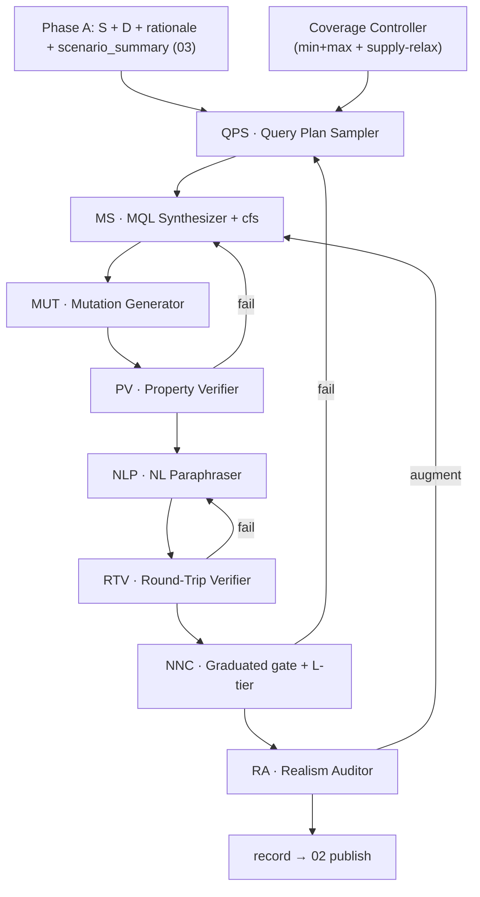

# TEND §04 · Agent Framework

> 本卷是 TEND **Phase B · Reverse-Engineered NL–MQL Construction** 的单一真源 (SSoT)。上游读取 [03](./03_dataworld_construction.md) 产出的 MongoDB schema、冻结 witness 数据、SRA rationale 与 `scenario_summary`；下游向 [02 §2](./02_dataset_design.md#02-2) 提交可发布的 record 字段。本卷**不**重复定义任务签名、NormExec、gold-as-class、EX 双条件与 ≡_rec，统一交叉引用 [01](./01_task_definition.md)。BIRD mini-dev（11 库）在本架构中仅充当**数据源 + 场景源**；Phase B **不**以 BIRD NL/SQL 为 MQL oracle，但 BIRD SQL/join 作为真实信号驱动 Phase A 聚合与异构识别。

---

## Part I

## TL;DR

TEND 在 BIRD mini-dev 锚定数据世界上，用 **QPS → MS → MUT → PV → NLP → RTV → NNC → RA** 八 Agent 流水线把 NL–MQL 对物化为可发布 record。构造路径（**RAR · Reference-Anchored Reverse**）：**枚举异构驱动 intent → 合成 gold 并对独立参照 R 锁死 → 派生 thin cfs → 生成 mutations → 性质验证 → 从 intent 派生自然 NLQ → 结果级往返 → 难度/原生性裁决 → realism 审计**。正确性由 P1 参照锚定（gold ≡_rec R）+ gold-as-class（EX 双条件）+ P1–P4 担保。逆向骨架（gold 先锁、NLQ 后派）保留，但**种子是信息需求（非算子）、NLQ 从 intent（非管线）派**——根治 operator-first 的不自然/自证两病。

**QPS (Query Plan Sampler → Intent Enumerator)** 在 Coverage Controller 的 min+max 双配额驱动下，从 Phase A query-bearing 异构清单 × **archetype 目录**（§04-2-4）× `scenario_summary` 枚举结构化 `intent`：seed_mechanism、seed_signal、archetype、domain_framing、analytical_op、semantic_properties。design-mode QPS **不输出** `reference_oracle`；workflow 根据 archetype/catalog 在下游注入 hidden certification oracle。**不再产出 primary_pattern / operator_graph**；难度由 `mechanism × archetype` 派生。**不**以 BIRD SQL/NL 为 oracle（BIRD SQL/join 仅作 Phase A 真实信号）。

**MS (MQL Synthesizer)** 以 `intent` 为输入，用 ≥2 条独立合成策略产出 `mql_primary`/`mql_alt`；若 workflow 注入隐藏 R，**gold 锁死判据 = `NormExec(gold,D) ≡_rec R(D)` ∧ 两路 ≡_rec**（参照 R 独立 certification aid + 双路三角，取代纯逆向「gold 自证」）。MS 先于下游机械派生 **thin canonical_form_set**（idiom-不变量 + output 守卫），供 AST_check 消费。

**MUT (Mutation Generator)** 基于 `(intent, mql_primary, canonical_form_set)` 产出 **5–8 条** plausible wrong 变体，覆盖算子/参数、shape、null、异构 stress（漏 present/missing 分支、忽略判别键）等维度；全部须 EX fail（P3，靠 witness 判别）。

**PV (Property Verifier)** 对 gold MQL 与 mutations 执行 plan 声明的语义性质断言、witness probe 与 AST_check；mutations 全 reject 为硬约束。

**NLP (NL Paraphraser)** 从 **intent（信息需求，非锁定 MQL 管线）** paraphrase 二联 NLQ：canonical（L1、schema-naive）与 colloquial（L0、口语 underspecified）；从 intent 派根治「NLQ 沦为伪代码」；colloquial 不得引入第二意图（P2 / L3）。

**RTV (Round-Trip Verifier)** 使用与 QPS/MS/NLP **模型池 disjoint** 的独立 NL→MQL agent，对 canonical NLQ 再合成 `mql_round_trip_canonical`，**必须 NormExec ≡_rec gold**（结果级，验意图唯一；不要求命中 cfs 指纹）；colloquial 走软检查。混合披露使 S 携结构提示，故 L4 异构记录的自然 NLQ 仍可往返。

**NNC (NoSQL Nativeness Critic)** 负责 L0–L4 难度**确认**（派生自 mechanism×archetype）、`sql_infeasibility_class` 赋值、canonical_form_set 校验、意图级歧义攻击，以及 **graduated dual-bridge gate**：两桥**始终计算**，仅当 `sql_infeasibility_class ≠ feasible` 时作发布门（**RAR 纯结果**：两桥均不得 NormExec ≡_rec gold，去 QIM 拐杖）；`feasible` 类仅写诊断字段。

**RA (Realism Auditor)** 审计 witness 与 gold 的生产 realism：字段覆盖率、null/missing 共现、嵌套深度与 SRA pattern 一致、结果基数非平凡（P4）。必要时 targeted augment 并重算 `world_signature`，回流 MS 重跑 NormExec。

**L0–L4 配额**：L0 ≤ 5%，L1 ≈ 20%，L2 ≈ 25%，L3 ≈ 25%，L4 ≥ 20%（全库分布目标）；**test 集 L4 ≥ 30%** 为发布硬约束（[02 H5](./02_dataset_design.md#02-4-3)）。L4 含两类 translation-lossy 子类：**structural_pipeline**（如 `$setWindowFields + $facet`）与 **structural_schema_flex**（DAR 异构机制下的原生表达，如多态分派、动态键聚合）。

**canonical_form_set（RAR thin）** 由 MS 从 gold 不可避免结构 + shape_policy 派生，**坍缩为 idiom-不变量 + output 守卫**；六件禁用 operator 恒入 must_not_contain；结构判别力交 witness（L2/P3），不锁可替换 idiom。gold representative 存 record.MQL。

Canonical 锚（pending DAR Phase A）**financial/1001**：account 反范式化、`preserve`、稀疏 `loan` + 多态 `trans` 异构的 L4 record；graduated gate 下 SQL-bridge（INNER JOIN drop 丢无 loan 账户）预期 EX=0。完整 JSON 见 [CANONICAL_ANCHOR.md](./_meta/CANONICAL_ANCHOR.md) 与本卷 §04-6；**本卷构造侧 worked example（§04-6 走查、MUT/NNC 示例）仍为 legacy orchestra 示意**，待 DAR Phase A financial 构造替换。

---

<a id="04-1"></a>
### 04-1 管线总览

TEND 构造分 Phase A（DataWorld）与 Phase B（Reverse-Engineered NL–MQL Construction）。Phase A 由 [03](./03_dataworld_construction.md) 的 WP → SRA → SC → DM 负责；Phase B 为本卷八 Agent 流水线。

| 阶段 | Agent | 输入 | 输出 | 失败动作 |
|---|---|---|---|---|
| B1 | QPS | S, D 摘要, scenario_summary, **Gate-QB 异构清单**, archetype 目录, 配额状态 | **intent**, qps_trace（workflow 后续注入 hidden R） | cell 不可行 → Coverage Controller supply-relax |
| B2 | MS | intent | mql_primary, mql_alt, **thin canonical_form_set**, shape/join/agg 元数据 | gold ≢_rec R 或 双路不 ≡_rec → 回 MS / 重采 intent |
| B3 | MUT | intent, mql_primary, canonical_form_set | mutations[5–8] | 生成失败 → 回 MS |
| B4 | PV | mql_*, mutations, intent, R, cfs, D | property_verification | gold≢R / 性质 fail / mutation 未全 reject → 回 MS |
| B5 | NLP | **intent**, cfs, scenario_summary | nl_queries | paraphrase 违规 → 重试 |
| B6 | RTV | nl_queries, S, D | round_trip_verification | canonical ≢_rec gold → 回 NLP（≤2 轮） |
| B7 | NNC | 全部上游产物 | difficulty, sql_infeasibility_class, nnc_verdict | gate fail（纯结果）/ 意图歧义 → 回 QPS 或 RA |
| B8 | RA | NNC 通过候选, D | ra_audit, 可选 augment, world_signature' | P4 失败 → augment → 回流 MS |



**BIRD 边界**：WP 在 Phase A 读取 BIRD（question, evidence, SQL）工作负载以推断访问模式与域语义，BIRD SQL/join 作为真实信号驱动 Phase A 聚合与异构识别，输出用于 schema 设计与 `scenario_summary` 提取；Phase B **禁止**以 BIRD SQL 或 BIRD NL 作为 MQL/NLQ 的金锚或收敛 oracle。

**P1–P4 构造期映射**

| 原则 | 主要承担 Agent |
|---|---|
| P1 执行良构 | MS + PV |
| P2 语义唯一性 | QPS + NLP + RTV + NNC 歧义攻击 |
| P3 判别力 | MUT + PV |
| P4 世界非平凡性 | RA + PV probe |

---

<a id="04-1-2"></a>
#### 04-1-2 Design Defenses

本节锁定逆向构造管线的七项结构性防御，防止时序错配、shortcut 与供给不足导致的 silent regression。

<a id="04-1-2-1"></a>
##### 04-1-2-1 canonical_form_set 时序（cfs timing）

`canonical_form_set`（RAR thin：idiom-不变量 + output 守卫）**必须**在 MS 阶段机械派生并作为 MS 输出的一部分写入 audit，时序上**先于** MUT、PV、NLP、NNC。任何下游 AST_check（含 PV、NNC、评测期 EX 条件 (a)）均直接消费 MS 产出的 cfs，**禁止**在 NNC 或更晚阶段才首次派生。**RTV 不再消费 cfs**（改判结果级，§04-4-4）。派生算法见 §04-3-2 与 Part II §04-II-3。

<a id="04-1-2-2"></a>
##### 04-1-2-2 mutations 归属（MUT ownership）

P3 判别力由专用 Agent **MUT** 承担。MUT 消费 `(intent, mql_primary, canonical_form_set)`，产出 5–8 条 plausible wrong 变体（含「漏 present/missing 分支」「忽略判别键」等 RAR 异构 stress——这些靠 witness 判别，cfs 已不锁）；PV 验证 ∀m, EX_verdict(m) = false。MUT 与 MS 模型池 disjoint；mutations 不得由 MS 或 NLP 顺带生成。

<a id="04-1-2-3"></a>
##### 04-1-2-3 RTV capability envelope

RTV 使用固定中段 NL→MQL agent（能力上界约 gpt-4o-mini 等级），且与 QPS、MS、MUT、NLP 模型池及评测期 `S_solver` **三向 disjoint**（详见 [05 §3](./05_evaluation_methodology.md#05-3)、[06 §4](./06_solution_design.md#06-4)）。RTV 对 canonical NLQ 最多重试 2×（确定性 seed）；仍失败则回 NLP 重写 canonical，**不**直接拒绝 record。canonical 判据为 `NormExec ≡_rec gold`（结果级，§04-4-4），非 cfs 指纹闭包。colloquial 走软检查：允许 round-trip ≢_rec gold，但 NNC 须记录可归因原因（underspec 边界、字段名缺失等）。

<a id="04-1-2-4"></a>
##### 04-1-2-4 Coverage Controller

QPS 受 Coverage Controller 调度，按 **`seed_mechanism × archetype × domain`** min+max 双配额（[02 §4](./02_dataset_design.md#02-4)）推进分布；难度/join/agg 为派生观测，不设目标。欠填 cell 的采样权重正比于 `max(0, MIN[c] − count[c])`。若某 cell 在当前 `db_id` 上不可行（例如该机制未在该库触发真实信号），标记 `supply_constrained` 并由 Controller 自动放宽 MIN 为 `min(target, supply_ceiling)`，写入 `audit/_global/coverage_report.json`。

<a id="04-1-2-5"></a>
##### 04-1-2-5 SQL-shortcut graduated gate

NNC 对每条 record **始终**计算 SQL-bridge（canonical NLQ → NL2SQL → sql_to_mongo）与 Template-bridge（关键词 → 外部模板库填槽）的 `NormExec ≡_rec gold` **结果**（RAR 去 QIM 拐杖），写入可选 `_diagnostic_bridge_ref`。

**发布门决策**（与 `sql_infeasibility_class` 联动）：

| sql_infeasibility_class | dual-bridge 角色 |
|---|---|
| `feasible` | **仅诊断**；不据桥接结果拒绝 record |
| `semantic`, `performative`, `structural_pipeline`, `structural_schema_flex` | **发布门**；两桥均不得 `NormExec ≡_rec gold`（够不到答案） |

`feasible` 类记录仍须通过 NNC 的 L-tier 赋值、cfs 校验与意图歧义攻击；桥接结果供 [05](./05_evaluation_methodology.md) 的 `functional_sql_solvable`（= SQL-bridge 结果 ≡_rec gold）诊断切片披露（`structural_sql_solvable` 在 RAR thin cfs 下退化，列 05 协调项）。

<a id="04-1-2-6"></a>
##### 04-1-2-6 query-bearing 供给端联动

Phase A SC 执行 flex-eligible DB 比例 pre-audit（`min_flex_db_ratio` 配置，见 [03 §6](./03_dataworld_construction.md#03-6)）；`bird_db_catalog.json` 写入 `flex_eligible: bool`。若选中库的 flex_eligible 比例 < 30%，[02 H7/H9](./02_dataset_design.md#02-4-3) 自动 supply-relax：query-bearing 供给（`schema_flex ≠ none`）下限放宽至 `max(15%, supply_ceiling)`，`structural_schema_flex` 下限放宽至 `max(10%, supply_ceiling × 0.8)`。Coverage Controller 读取 supply-relax 状态，避免在供给不足域强行采样不可行 plan。

<a id="04-1-2-7"></a>
##### 04-1-2-7 NNC 歧义攻击 disjointness

NNC 对 canonical NLQ 的歧义攻击使用 ≥3 个独立 LLM 解析，其模型池与 QPS、MS、MUT、NLP、RTV 以及评测期 `S_solver` **全部 disjoint**。若存在一个「人类合理」的解读，其在 D 上结果 `≢_rec gold`（NLQ 指向第二个不等价答案）→ P2 失败，回 QPS 重采或 NLP 重写 canonical。判据为**意图/结果级**，非 MQL 结构级。

---

<a id="04-2"></a>
### 04-2 QPS · Query Plan Sampler

<a id="04-2-1"></a>
#### 04-2-1 职责

QPS 在 RAR 下从「算子采样器」重定位为 **意图枚举器**：它**不**采样算子骨架，而是从 Phase A 已过 Gate-QB 的 **query-bearing 异构清单** × **archetype 目录**（§04-2-4）× `scenario_summary` 域语义，枚举结构化 `intent`——一个由真实异构逼出的业务信息需求。算子骨架、难度、canonical_form_set 全是下游 gold 锁死后**派生**的果；QPS **不再产出** `primary_pattern` / `operator_graph`。`intent` 是 Phase B 唯一上游意图原子；不对外暴露其序列化格式或外部模板格点。

<a id="04-2-2"></a>
#### 04-2-2 intent 核心字段

`intent` 取代旧 operator-centric `query_plan`：种子是信息需求（因），算子是下游派生的果。**无** `primary_pattern` / `operator_graph` 作为输入。

| 字段 | 含义 |
|---|---|
| `seed_mechanism` | DAR 机制（①多态 / ②稀疏 / ④嵌套·动态键 / ⑤版本）或 `none`（域/工作负载基线）；来自 Phase A，**不采样** |
| `seed_signal` | Phase A 真信号：`{collection, discriminator/field, values/variants}` |
| `archetype` | §04-2-4 封闭目录条目（问题原型） |
| `domain_framing` | `scenario_summary` 域名词：`{entity_noun, metric_noun, …}` |
| `analytical_op` | 语义级操作：`{group_key?, metric?, filter?, dispatch_rule?}`（非算子） |
| `shape_policy` | preserve / reshape / reduce（由 archetype 落出） |
| `semantic_properties` | PV 将断言的性质（分派覆盖全 variant、null 覆盖、基数 ≥2、tie 等） |
| `target_difficulty` | L0–L4，由 `seed_mechanism × archetype` **派生**（非采样目标） |

design-mode QPS 的公开输出严格是 `intent + qps_trace`，**不得**发出 top-level 或 nested `reference_oracle`。参照 R 由 workflow/runtime 根据 archetype 目录与运行时 design card 注入给 MS/PV，作为隐藏 certification oracle。为避免把 oracle 模板暴露成公共契约，QPS 必须把业务意图本身写完整：特别是 `preserve + structural_schema_flex` 记录，`analytical_op` 要明确 exact labels / discriminator values、target output fields、metric/source fields、aggregation scope，以及 null/missing/default 的非空落值语义；这些语义再由 NLP/RTV 用自然语言公开表达。

<a id="04-2-3"></a>
#### 04-2-3 与 Coverage Controller 的交互

QPS 每轮读取覆盖 cell 计数与 min/max 配额，优先采样 deficit 最大的可行 cell。**RAR 覆盖 cell 换底座**：从「算子 pattern」改为 **`seed_mechanism × archetype × domain`**（见 [02 §02-4](./02_dataset_design.md#02-4)）；难度 / join_depth / aggregation_depth 降为 gold 落出的**派生观测**，不再设目标。异构段（①②④⑤）供给 L3–L4，`none` 段（WP 真实 join/filter/group access pattern）供给 L0–L2；两段经**同一**下游流水线。目标 L 级**不受** BIRD SQL 表达力上限约束。

<a id="04-2-4"></a>
#### 04-2-4 Archetype 目录与参照实现 R（RAR 拱心石）

archetype 目录是一张**按 DAR 机制索引的封闭目录**；每条目挂三样：**问题形状**、**参照实现 R 模板**、**落出难度**。`intent / gold 判据 / NLQ / 覆盖` 全从此流出——「从异构枚举业务问题」**不是**放任 LLM 想象，而是 `机制实例 × archetype × 域名词` 的确定性叉乘，LLM 仅做域表面措辞。三重免费性质：覆盖**可数**、query-bearing **由构造保证**（每个 archetype 的定义即「必须撞上机制 M 的操作」）、确定性强。

| seed 机制（Phase A 真信号） | archetype（问题形状） | 逼出的分析操作 | 参照 R 模板（naive·可审计） | 落出难度 |
|---|---|---|---|---|
| **①多态子类型**（低基数判别列+enum） | 按子类型分别聚合 · 子类型条件投影 · 跨子类型比较 · 限定子类型用其专属字段 | 按判别键 group / `$switch` 分派；专属字段缺失须处理 | 按 discriminator 分桶 → 各桶算 metric / 按子类型规则取专属字段 | L3–**L4** `structural_schema_flex` |
| **②可选/稀疏**（NULL率∈.05–.95 / 稀疏 embed） | 存在性计数 · null-coalesce 聚合 · present/missing 条件投影 · 有无对比 | `$exists` / `$ifNull` / `$type:"missing"` 分支 | 逐 doc 判字段在否 → 在则用值、缺则默认/记 0 | L2–L3 `semantic`；稀疏 embed 提至 **L4** |
| **④嵌套/动态键**（FK共现 / EAV列对） | 动态键折叠 · 跨异构键集取值 | `$objectToArray`+`$unwind` / `$arrayToObject` | 遍历每 doc 键值对聚合 | L2–**L4** |
| **⑤版本演进**（时间分桶字段改名） | 跨版本聚合（字段改名/增删） | 多层 `$ifNull` fallback | 按版本取对应字段名 → 统一聚合 | L2–L3 `semantic` |
| **none**（WP 真实 join/filter/group） | 单集合过滤投影 · topN · 分组计数 · join+嵌套 group | 常规 | 朴素 filter/group/sort | L0–L2 |

**参照 R 的角色**：R ≠ gold。R 是独立 Python、跨执行范式的 naive 参照，**定义答案**；gold 是原生 MongoDB idiom，**演示拿到答案的 native 方式**。design-mode 中 QPS 只选择 archetype 并完整描述业务语义，workflow/runtime 再把隐藏的 R 注入给 MS/PV。MS 的 gold 锁死判据是 `NormExec(gold,D) ≡_rec R(D)`（§04-3），取代纯逆向「gold 自证」——抓得到 gold 的系统性 bug（如 `$ifNull` 默认值写错）。R 须按 MongoDB 算子语义编写（null-vs-missing、类型序），其结果过同一 Norm 后比较；R 与双路合成正交三角定位 gold。**纪律**：只有「naive R 可审计」的操作才进目录；无简单 R 的 intent 不构造——这把 gold 可信度焊在目录层。

**worked example（financial/1001，机制②稀疏）**：seed_signal = `loan` 稀疏 embed（682/4500 present）；archetype = present/missing 条件投影；analytical_op =「有 loan 取 amount/credit_sum（0→1），无 loan 记 0」。R = 逐 account 判 loan 在否、在则除以 PRIJEM 贷记和、缺则 0。gold = `$lookup`（贷记和）+ `$cond[$type:loan]`（present/missing 分支），`≡_rec R` → 锁死。NLQ 从 intent（非管线）派生 → 自然。难度 L4 `structural_schema_flex`（relational 普遍 `INNER JOIN loan` 静默丢账户，反范式化后 present/missing 须显式处理 = 不可 SQL 平移）。

---

<a id="04-3"></a>
### 04-3 MS · MQL Synthesizer

<a id="04-3-1"></a>
#### 04-3-1 合成与 runtime gold-lock

MS 接收 `intent`（以及 workflow 可选注入的 hidden `reference_oracle` certification aid），输出一个代表性可执行 `MQL` 与 `shape_policy`。当 hidden oracle 属于 workflow 可直接编译的模板时，workflow 可先用 `_canonical_reference_mql` 生成 deterministic gold 并跳过 MS 的 LLM 生成；否则 MS 负责 fallback 合成。MS 可提供 `mql_alt` / `synthesis_trace` 作为诊断，但双路不再是 public hard-output contract。

| 路径 | 方法 | 产物 |
|---|---|---|
| **workflow direct compile** | hidden reference_oracle → `_canonical_reference_mql` | deterministic `MQL`（可绕过 MS LLM） |
| **MS fallback** | intent semantics → representative MongoDB aggregation | `MQL` |
| **可选等价变换** | 代数等价重写（stage 重排、accumulator 等价替换） | optional `mql_alt` / `synthesis_trace` |

**收敛条件（合取）· RAR gold-lock**

1. **参照锚定**：若 workflow 注入 R，则 NormExec(MQL, D) ≡_rec **R(D)**（archetype 参照实现，§04-2-4）——gold 正确性的独立 certification aid，取代纯逆向「gold 自证」，抓得到系统性 bug；MS 不从 `intent.reference_oracle` 读取 QPS 公开输出
2. **可选双路诊断**：若 MS 输出 `mql_alt`，则 NormExec(MQL, D) ≡_rec NormExec(mql_alt, D) ≠ ⊥；若没有 alternate，不因缺少双路本身判失败
3. AST_check 使用 runtime/postprocess 派生的 canonical_form_set 对选定 MQL pass
4. 禁用 operator 扫描均 pass
5. shape_policy 推断与 intent 一致

代表实例写入 record.MQL。alternate 与 R 比较证据可写入 `synthesis_trace` 供诊断。任一 hard convergence 条件不满足 → 回流：R 不一致 = gold 有 bug → 回 MS 重合成；R 本身不可实现 → 回 QPS 重采 intent。

<a id="04-3-2"></a>
#### 04-3-2 canonical_form_set 派生（MS 所有权）

RAR 下 cfs **坍缩为 idiom-不变量 + output-space 守卫**（[01 §01-3-1](./01_task_definition.md#01-3-1)）；结构判别力交由 witness（L2/P3），cfs 不再 police native idiom。MS 从**锁死的 gold MQL** 与 intent **机械派生**四元组：

**must_not_contain**（恒定）

- 六件禁用 operator：`{$sample, $rand, $$NOW, $out, $merge, $function}`

**must_contain / must_contain_at_root**（仅不变量）

- 该 schema 下**不可避免**的结构算子——所有正确 idiom 共有者（如引用集合的唯一关联手段 `$lookup`、唯一窗口/分面结构算子 `$setWindowFields`/`$facet`、深层 `$graphLookup`）
- **不**收 idiom 特定可替换算子（`$addFields`↔`$project`、`$cond`↔`$switch`↔`$ifNull`、`$type`↔`$exists`）——否则误杀等价解。「是否正面处理了异构变体」不靠 cfs 锁算子，靠 rich witness 令漏分支解 `≡_rec` 必败

**must_contain_at_root / must_not_contain_at_root**（shape 守卫）

- shape_policy = preserve：根禁 `{$unwind, $group}`（保文档数与嵌套）
- shape_policy = reduce：根须含 `$group`
- shape_policy = reshape：按 intent 显式声明放行 `$unwind`

派生只读 gold 的**不可避免结构 + shape_policy**，**不**再用「primary_pattern → 算子集」查表（该机制随 operator-first 一并废止）。AST_check 协议所有权在 [01 §3-1](./01_task_definition.md#01-3-1)；NNC 仅**确认** cfs 与 MQL 一致（§04-5-4），不重新派生。

> **worked example（financial/1001）**：不变量 = `$lookup`（trans 引用唯一关联手段）；shape 守卫 = preserve 根禁 `$unwind`/`$group`。`$addFields`/`$cond`/`$type` **不**入 must_contain（可被 `$project`/`$switch`/`$ifNull` 等价替换）；「无 loan 记 0」的分支正确性由 witness（含 present 与 missing 两类 account）判别。锚 JSON 已采用该 RAR thin cfs；剩余 PENDING 仅是 DAR Phase A 对布局/gold MQL/`world_signature` 的真实 MongoDB 构造与执行验证。

---

<a id="04-4"></a>
### 04-4 MUT · PV · NLP · RTV

<a id="04-4-1"></a>
#### 04-4-1 MUT · mutations 5–8 条 / record

mutations 是 **plausible wrong** 变体库，评测期与构造期 P3 共用。每条 mutation 须 EX fail。

| 维度 | 示例子轴 | 每 record 建议条数 |
|---|---|---|
| **A operator / param** | 缺 $facet、window size ±1、sortBy 反转、partition 字段替换 | 2–3 |
| **B shape / output** | shape_policy 邻接错标、缺 output key、错误 dtype | 1–2 |
| **C null / missing** | 丢弃 $ifNull、错误 disambig | 1–2 |
| **D canonical_form_set stress** | 移除 must_contain 算子、加入禁用 operator | 1 |
| **E DAR 异构 stress** | 忽略判别键分支、假设统一 schema、丢弃 `$ifNull` fallback、错误 dispatch | 1 |

**总量**：5 ≤ |mutations| ≤ 8。序列化至 audit 或 fixtures `mutations.json`（见 `schemas/mutations.schema.json`）。

orchestra/1001 典型 mutation（均须 EX fail）：

1. 移除 $ifNull，Attendance 缺失时不 coalesce
2. 用全局 $avg 替代 $setWindowFields 窗口均值
3. global median 索引未 $floor
4. 缺少 $facet，无法在单管道并行计算 median
5. partitionBy 误用 Name 而非 $_id

<a id="04-4-2"></a>
#### 04-4-2 PV · Property Verifier

PV 对 gold MQL 与 mutations 执行：

1. **性质断言 + 参照锚定**：逐条检验 `intent.semantic_properties`（结果基数 ≥ 2、tie 可区分、null/missing 覆盖、shape 与 shape_policy 一致等），并验 `NormExec(gold,D) ≡_rec R(D)`（P1）
2. **witness probe**：在 D 上执行针对性子查询，验证边界 doc 存在
3. **AST_check**：gold 与 mutations 分别扫描 cfs
4. **P3 硬约束**：∀m ∈ mutations, EX_verdict(m, record, D) = false
5. **gold accept**：EX_verdict(MQL, record, D) = true 且 NormExec(MQL, D) ≡_rec R(D)（P1 参照锚定，§04-2-4）

失败时回流 MS（intent 不可实现 / 与 R 不一致）或 MUT（mutation 未 sufficiently wrong）。

<a id="04-4-3"></a>
#### 04-4-3 NLP · 二联 NLQ

| 字段 | specificity | 约束 |
|---|---|---|
| nl_queries.canonical | L1 | schema-naive；无 `$` operator 术语；单一闭包意图；若运行时输入携带 oracle/result 语义，须自然表达 exact labels、target fields、metric/source fields、aggregation 与 missing/default semantics |
| nl_queries.colloquial | L0 | 口语 underspecified；不得出现 schema 字段名；不得引入第二意图 |

Paraphrase 由 NLP 从 **intent（信息需求）+ `scenario_summary` 域语义**生成，**不从锁死的 gold MQL 管线转写**——这是 RAR 根治「NLQ 沦为伪代码」的关键：NLQ 描述的是「为每个账户标注贷款相对贷记流水占比、没有则记 0」式业务问题，而非 `$lookup`/`$cond`/`$type` 的 stage 序列。gold MQL 仅供 RTV 往返校验（§04-4-4），不作 paraphrase 输入。canonical 须完整覆盖 intent 的语义闭包；colloquial 为 optional robustness 子集。混合披露（[03 §03-6](./03_dataworld_construction.md#03-6)）下结构提示在 S、不在 NLQ，故 canonical 可保持自然又不丢唯一性。

<a id="04-4-4"></a>
#### 04-4-4 RTV · Round-Trip Verifier

RTV 使用独立 NL→MQL agent（与构造池 disjoint），读取 `(nl_queries, S, D)`：

| NLQ 档位 | 要求（RAR 结果级） |
|---|---|
| **canonical** | `mql_round_trip_canonical` 必须 **NormExec ≡_rec gold**（意图唯一可复原）；失败 → 回 NLP 重写，最多 2 轮 |
| **colloquial** | 软检查；允许 ≢_rec，但 NNC 须记录 underspec 归因 |

RTV 改判**结果等价**而非 gold-class 指纹闭包：它验的是「NLQ 唯一确定答案」（P2 意图清晰度），不是难度或结构——cfs 指纹是评测期反作弊（EX），与构造期唯一性**解耦**。混合披露下 S 携带结构提示，故 gpt-4o-mini 级 RTV 能对 L4 异构记录复原**结果**而不必让 NLQ 泄漏管线——这正是 RAR 化解「自然度 vs 往返可闭包」张力之处。

---

<a id="04-5"></a>
### 04-5 NNC · NoSQL Nativeness Critic

<a id="04-5-1"></a>
#### 04-5-1 L0–L4 难度层级

| 层级 | 名称 | 典型算子 / 结构 | SQL 可直译性 |
|---|---|---|---|
| **L0** | SQL-trivial | $match、$project | 完全可直译 |
| **L1** | light aggregation | $group、$sort、$limit | 可直译 |
| **L2** | multi-stage | $lookup、$unwind、嵌套 $group | 多数可直译 |
| **L3** | window / branch | $setWindowFields、$switch、$graphLookup 浅层 | 部分 lossy |
| **L4** | NoSQL-native | $facet + window、$objectToArray、深 $graphLookup、**按判别键 $switch 分派** | structural_pipeline / structural_schema_flex |

**分布目标（全库）**

| 层级 | 目标占比 |
|---|---|
| L0 | ≤ 5% |
| L1 | ≈ 20% |
| L2 | ≈ 25% |
| L3 | ≈ 25% |
| L4 | ≥ 20% |

**发布硬约束**：test 集 `difficulty = L4` 比例 ≥ 30%（[02 H5](./02_dataset_design.md#02-4-3)）；test 集 L0 ≤ 5%（[02 H8](./02_dataset_design.md#02-4-3)）。NNC 赋值须与 canonical_form_set / MQL 算子相容（record C7）。

**`sql_infeasibility_class` 枚举**（NNC 必填，见 `agent_prompts/nnc_nosql_nativeness_critic.md`）：

| 类别 | 含义 | 典型 record |
|---|---|---|
| `feasible` | SQL 完全可直译 | L0–L1 |
| `semantic` | SQL 可表达但 null/missing 语义 lossy | L2–L3 with `$ifNull` |
| `performative` | SQL 需 CTE/window 拼装，性能/结构 lossy | L3–L4 pipeline |
| `structural_pipeline` | 管线结构 SQL 不可同步表达 | L4 `$facet + $setWindowFields` |
| `structural_schema_flex` | schema 形状 SQL 不可表达 | L4 按判别键 `$switch` 分派、`$objectToArray` 动态键聚合 |

当 query-bearing 供给为 DAR 异构形状（`schema_flex != none`）且 MQL 含相应异构算子作用于该形状时，NNC **必须**标注 `structural_schema_flex` 且 `difficulty = L4`。该判别由真实判别器支撑。

<a id="04-5-2"></a>
#### 04-5-2 graduated dual-bridge gate

**目标**：对 translation-lossy 记录，杜绝 solver 通过「SQL 翻译」或「固定模板填槽」不经 NoSQL 推理即拿到正确结果。

| 桥 | 路径 | 发布门判据（仅 non-feasible） |
|---|---|---|
| **SQL-bridge** | canonical NLQ → NL2SQL LLM → sql_to_mongo → mql_sql_bridge | 在 D 上 **NormExec ≢_rec gold**（够不到答案） |
| **Template-bridge** | canonical NLQ → 关键词 → 外部 MQL 模板库 → mql_template_bridge | 同上 |

**通过判据（non-feasible，RAR 纯结果）**：两桥均不得 `NormExec ≡_rec gold`——即 SQL/模板路线**都够不到正确结果**。RAR 下 cfs 已坍缩、QIM 退化（[01 §01-3-1](./01_task_definition.md#01-3-1)），故**去 QIM 拐杖**，判据回归「难度 = 答案不可被 SQL/模板路线触及」这一本质。`feasible` 类记录跳过发布门，桥接结果写入 `_diagnostic_bridge_ref` 供报表。

financial/1001（`structural_schema_flex`）预期：
- SQL-bridge：relational `INNER JOIN loan` 静默丢无 loan 账户 → 文档数与 present/missing 分支错 → NormExec ≢_rec gold
- Template-bridge：关键词误导至 join 模板 → 漏 present/missing 调和 → NormExec ≢_rec gold

失败处理：优先 RA targeted augment；2 轮仍失败 → QPS 重采 intent 或拒绝 record。

<a id="04-5-3"></a>
#### 04-5-3 歧义攻击

独立 LLM（模型池与 QPS/MS/MUT/NLP/RTV/S_solver 全部 disjoint）读取 **仅** canonical NLQ + schema，产出 ≥3 个**意图解读**。RAR 判据为**意图/结果级唯一**：若存在一个「人类合理」的解读，其在 D 上的结果 `≢_rec gold`（即 NLQ 指向第二个不等价答案）→ P2 失败，回 QPS 或 NLP 重写 canonical。不再要求 MQL 级结构等价（那是 cfs/评测期的事）。

<a id="04-5-4"></a>
#### 04-5-4 三元校验

NNC 在赋 difficulty 前执行（RAR thin cfs 对齐）：

1. canonical_form_set.must_contain ⊆ ops(MQL)（仅不变量算子）
2. must_contain_at_root ⊆ root_ops(MQL)；**RAR 下可空**——cfs 非空性由 must_not_contain（恒含 6 禁用）+ shape 守卫承担，不再强制 must_contain_at_root 非空（[02 C6](./02_dataset_design.md#02-2) 同步放宽）
3. must_not_contain 与禁用 operator 扫描一致（恒含 6 禁用）
4. shape_policy 与 pipeline 形状一致（preserve / reshape / reduce）；must_not_contain_at_root shape 守卫与之相容
5. difficulty 由 `seed_mechanism × archetype` 派生（§04-2-4），NNC **确认**而非独立赋分

---

<a id="04-6"></a>
### 04-6 Canonical 锚 `financial/1001`（pending DAR Phase A）· RAR 构造走查

financial/1001 是 **RAR 构造管线**的示范：QPS 从 Phase A 的 query-bearing 异构（稀疏 `loan` embed，682/4500 present）× archetype「present/missing 条件投影」× 域名词 {account, 贷款占比} 枚举 `intent`（**不**采样算子）；archetype 目录提供参照 R（逐 account 判 loan 在否、在则 amount/credit_sum、缺则 0）；MS 合成 gold（`$lookup` 贷记和 + `$cond[$type:loan]` present/missing 分支），**对 R 锁死**（`NormExec(gold,D) ≡_rec R(D)`）+ 双路三角；MS 派生 **thin cfs**（不变量 `$lookup` + preserve shape 守卫，不锁 `$addFields/$cond/$type`）；NLP **从 intent**（非管线）派自然 NLQ；NNC 确认 `difficulty = L4`、`sql_infeasibility_class = structural_schema_flex`。

该 record **不是** BIRD SQL 的翻译产物，而是稀疏 loan 异构逼出的真实业务意图；relational 普遍 `INNER JOIN loan` 静默丢无 loan 账户，反范式化后 present/missing 须显式处理——dual-bridge（纯结果）下两桥均够不到 `≡_rec gold`。

> **⚠ PENDING DAR Phase A**: 下方 canonical record 块为 `financial/1001`（跨卷逐字节一致，Gate 3）；布局/gold MQL/`world_signature` 待 DAR Phase A 在真实 MongoDB 构造 + 执行验证。锚 cfs 已是 RAR thin contract（`$lookup` 不变量 + 6 禁用 operator + preserve root guard）。`agent_prompts/` 中的 `orchestra` Example 1 仅为 smoke fixture,不是 production release 记录。

<!-- canonical-anchor: financial/1001 -->
```json
{
  "record_id": 1001,
  "db_id": "financial",
  "nl_queries": {
    "canonical": "为每个 account 附加一个字段 loan_to_credit_ratio:若该 account 有 loan,取 loan.amount 除以该 account 所有贷记交易(trans.type = 'PRIJEM')的 amount 之和(该和为 0 时按 1 计);若该 account 无 loan,则该字段为 0。保留每个 account 文档(含无 loan 的),只在原文档上新增该字段,不改变文档数与嵌套结构;不要求排序。",
    "colloquial": "给每个账户标注它的贷款相对贷记流水的占比;没有贷款的账户记 0,一个账户都别漏。"
  },
  "MQL": "db.account.aggregate([
  { $lookup: {
      from: \"trans\",
      let: { aid: \"$_id\" },
      pipeline: [
        { $match: { $expr: { $and: [ { $eq: [\"$account_id\", \"$$aid\"] }, { $eq: [\"$type\", \"PRIJEM\"] } ] } } },
        { $group: { _id: null, credit_sum: { $sum: \"$amount\" } } }
      ],
      as: \"_credit\"
  } },
  { $addFields: {
      loan_to_credit_ratio: {
        $cond: [
          { $ne: [ { $type: \"$loan\" }, \"missing\" ] },
          { $divide: [ \"$loan.amount\", { $max: [ { $ifNull: [ { $arrayElemAt: [\"$_credit.credit_sum\", 0] }, 0 ] }, 1 ] } ] },
          0
        ]
      }
  } },
  { $project: { _credit: 0 } }
])",
  "canonical_form_set": {
    "must_contain": ["$lookup"],
    "must_not_contain": ["$sample", "$rand", "$$NOW", "$out", "$merge", "$function"],
    "must_contain_at_root": [],
    "must_not_contain_at_root": ["$unwind", "$group"]
  },
  "difficulty": "L4",
  "sql_infeasibility_class": "structural_schema_flex",
  "shape_policy": "preserve",
  "world_signature": "sha256:58d575b0eb62b1499642ec46e9efe5d5576082ce45d871df0326821f44751346",
  "agent_design_rationale_ref": "fixtures/financial/sra.yaml",
  "mutations_ref": "fixtures/financial/mutations.json"
}
```

---

<a id="04-7"></a>
### 04-7 RA · Realism Auditor 与边界声明

<a id="04-7-1"></a>
#### 04-7-1 审计维度

| 检查项 | 说明 | 关联原则 |
|---|---|---|
| field observability | intent 引用字段在 D 上有非空实例 | P1 |
| null/missing coverage | $ifNull / $type 字段同时含 null 与 non-null | P4 |
| result cardinality | 非空结果；group/window 值域 ≥ 2（除非 NLQ 问不存在） | P4 |
| embed depth | $unwind 层数与 SRA embed 一致 | realism |
| type sanity | 无 impossible cast；日期/数值范围合理 | realism |

<a id="04-7-2"></a>
#### 04-7-2 targeted augment 协议

- **append-only**：新 doc 新 _id；不修改已有 doc
- **minimal**：integer programming 求最小注入集
- **traceable**：写入 audit/ra_augment_trace.json
- augment 后 **重算 world_signature**，同 db_id 全部 record 的 gold_cache 失效；**回流 MS** 重跑 NormExec 与 PV

<a id="04-7-3"></a>
#### 04-7-3 与上游回流

| 失败类型 | 回流 |
|---|---|
| P4 cardinality | RA augment → 回流 MS → PV → … → NNC 重验 |
| dual-bridge 近 miss（bridge `NormExec ≡_rec gold`，non-feasible） | RA 增 boundary doc → NNC 重验 |
| realism 不可修复 | 拒绝 record |

<a id="04-7-4"></a>
#### 04-7-4 构造期自检清单

record 发布前须通过：

1. **gold accept**：EX_verdict(MQL, record, D) = true 且 NormExec(MQL,D) ≡_rec R(D)（P1 参照锚定）
2. **mutations 全 reject**：∀m ∈ mutations, EX_verdict(m.MQL, record, D) = false
3. **RTV canonical 闭包**：mql_round_trip_canonical 的 NormExec ≡_rec gold（结果级，非 cfs 指纹）
4. **graduated gate**（若 sql_infeasibility_class ≠ feasible）：两桥均 NormExec ≢_rec gold（纯结果，去 QIM）
5. **P4 非平凡**：RA 签发的 ra_audit.pass = true

<a id="04-7-5"></a>
#### 04-7-5 边界声明

| 主题 | 归属 |
|---|---|
| 任务签名、EX、≡_rec、AST_check | [01](./01_task_definition.md) |
| record 字段、split、L4 ≥ 30%、L0 ≤ 5% | [02](./02_dataset_design.md) |
| WP/SRA/SC/DM、scenario_summary、flex supply | [03](./03_dataworld_construction.md) |
| 7 指标、4-panel 观测、SQL-route 诊断切片 | [05](./05_evaluation_methodology.md) |
| SMART solver、disjointness 池 | [06](./06_solution_design.md) |

Agent prompt 模板：`agent_prompts/qps_query_plan_sampler.md`（legacy filename; active prompt emits `intent`）、`ms_mql_synthesizer.md`、`mut_mutation_generator.md`、`pv_property_verifier.md`、`nlp_nl_paraphraser.md`、`rtv_round_trip_verifier.md`、`nnc_nosql_nativeness_critic.md`、`ra_realism_auditor.md`。

---

## Part II

> 实现附录。下列契约、伪代码与 schema 索引供构造流水线与单元测试直接对照 Part I；非 normative prose 的补充说明。

<a id="04-ii-1"></a>
### 04-II-1 Agent I/O 契约

#### QPS

| 方向 | 字段 | 类型 | 必填 |
|---|---|---|---|
| In | schema | object | ✓ |
| In | snapshot_summary | object | ✓ |
| In | scenario_summary | string | ✓ |
| In | sra_rationale | object | ✓ |
| In | quota_state | object | ✓ |
| In | heterogeneity_inventory | object | ✓ |
| In | archetype_catalog | object | ✓ |
| Out | intent | object | ✓ |
| Out | qps_trace | object | ✓ |

#### MS

| 方向 | 字段 | 类型 | 必填 |
|---|---|---|---|
| In | intent | object | ✓ |
| In | reference_oracle | object | 可选（workflow-injected certification aid） |
| In | schema | object | ✓ |
| In | snapshot | object | ✓ |
| Out | MQL | string | ✓ |
| Out | mql_alt | string | 可选（diagnostic alternate） |
| Out | canonical_form_set | object | runtime/postprocess 派生；agent 可选提供 |
| Out | shape_policy | enum | ✓ |
| Out | join_depth | int | 可选/derived |
| Out | aggregation_depth | enum | 可选/derived |
| Out | synthesis_trace | object | 可选 |

#### MUT

| 方向 | 字段 | 类型 | 必填 |
|---|---|---|---|
| In | intent | object | ✓ |
| In | MQL | string | ✓ |
| In | canonical_form_set | object | ✓ |
| Out | mutations | array[5–8] | ✓ |
| Out | mut_trace | object | ✓ |

#### PV

| 方向 | 字段 | 类型 | 必填 |
|---|---|---|---|
| In | MQL | string | ✓ |
| In | mql_alt | string | ✓ |
| In | mutations | array | ✓ |
| In | intent | object | ✓ |
| In | canonical_form_set | object | ✓ |
| In | snapshot | object | ✓ |
| Out | property_verification | object | ✓ |
| Out | pv_pass | boolean | ✓ |

#### NLP

| 方向 | 字段 | 类型 | 必填 |
|---|---|---|---|
| In | intent | object | ✓ |
| In | scenario_summary | string | ✓ |
| Out | nl_queries | {canonical, colloquial} | ✓ |

#### RTV

| 方向 | 字段 | 类型 | 必填 |
|---|---|---|---|
| In | nl_queries | object | ✓ |
| In | schema | object | ✓ |
| In | snapshot | object | ✓ |
| In | MQL (gold) | string | ✓ |
| Out | mql_round_trip_canonical | string | ✓ |
| Out | mql_round_trip_colloquial | string | ✓ |
| Out | round_trip_verification | object | ✓ |
| Out | rtv_pass | boolean | ✓ |

#### NNC

| 方向 | 字段 | 类型 | 必填 |
|---|---|---|---|
| In | MQL | string | ✓ |
| In | nl_queries | object | ✓ |
| In | canonical_form_set | object | ✓ |
| In | intent | object | ✓ |
| In | snapshot | object | ✓ |
| In | shape_policy | string | ✓ |
| In | round_trip_verification | object | ✓ |
| Out | difficulty | L0–L4 | ✓ |
| Out | sql_infeasibility_class | enum | ✓ |
| Out | nnc_verdict | object | ✓ |
| Out | diagnostic_bridge | object | ✓ |
| Out | functional_sql_solvable | boolean | ✓ |
| Out | structural_sql_solvable | boolean | ✓ |

#### RA

| 方向 | 字段 | 类型 | 必填 |
|---|---|---|---|
| In | MQL | string | ✓ |
| In | nl_queries | object | ✓ |
| In | intent | object | ✓ |
| In | snapshot | object | ✓ |
| In | schema | object | ✓ |
| Out | ra_audit | object | ✓ |
| Out | snapshot' | object | 可选（augment 后） |
| Out | world_signature' | string | 可选 |

---

<a id="04-ii-2"></a>
### 04-II-2 graduated dual-bridge 评估器

# uses: typing
```

def bridge_verdict(mql_bridge: str, record: dict, snapshot: dict) -> dict:
    """Return pure-result bridge diagnostics. AST is observation-only."""
    ast_ok = AST_check(mql_bridge, record["canonical_form_set"])
    rp = NormExec(mql_bridge, snapshot)
    rg = NormExec(record["MQL"], snapshot)
    result_equiv = equiv_rec(
        rp,
        rg,
        order_sensitive=pipeline_has_order_semantics(record["MQL"]),
    )
    return {"normexec_equiv_gold": result_equiv, "ast_check_pass": ast_ok}

def graduated_gate(record, snapshot, *, sql_bridge_mql, template_bridge_mql) -> dict:
    """Gate only when sql_infeasibility_class != feasible."""
    sql_v = bridge_verdict(sql_bridge_mql, record, snapshot)
    tpl_v = bridge_verdict(template_bridge_mql, record, snapshot)
    cls = record.get("sql_infeasibility_class", "feasible")
    gate_required = cls != "feasible"
    defeat = all(not v["normexec_equiv_gold"] for v in (sql_v, tpl_v))
    return {
        "sql_bridge": sql_v,
        "template_bridge": tpl_v,
        "gate_required": gate_required,
        "gate_pass": (not gate_required) or defeat,
        "functional_sql_solvable": sql_v["normexec_equiv_gold"],
        "structural_sql_solvable": sql_v["normexec_equiv_gold"] and sql_v["ast_check_pass"],
    }
```

---

<a id="04-ii-3"></a>
### 04-II-3 derive_canonical_form_set（MS 内部）

# uses: typing
```

DISABLED = {"$sample", "$rand", "$out", "$merge", "$function", "$$NOW"}

# operators that are structurally unavoidable for ANY correct idiom (cross-collection join,
# window/facet/graph stages). NOT $addFields/$project, $cond/$switch/$ifNull, $type/$exists.
INVARIANT_STRUCTURAL_OPS = {"$lookup", "$setWindowFields", "$facet", "$graphLookup", "$unionWith"}

def derive_canonical_form_set(intent: dict, gold_mql: str) -> dict:
    """RAR thin cfs: idiom-invariant operators + output-space guard ONLY. Structural
    discrimination ('did it handle the heterogeneity?') is carried by the witness (L2/P3),
    NOT by cfs — so we never lock idiom-specific replaceable ops (that false-rejects)."""
    shape = intent["shape_policy"]
    ops_all, ops_root = all_ops(gold_mql), root_ops(gold_mql)
    must_contain = ops_all & INVARIANT_STRUCTURAL_OPS
    must_contain_at_root = ops_root & INVARIANT_STRUCTURAL_OPS
    if shape == "reduce":
        must_contain_at_root |= {"$group"}
    must_not_contain = set(DISABLED)
    must_not_contain_at_root = {"$unwind", "$group"} if shape == "preserve" else set()
    return {
        "must_contain": sorted(must_contain),
        "must_not_contain": sorted(must_not_contain),
        "must_contain_at_root": sorted(must_contain_at_root),       # MAY be empty under RAR
        "must_not_contain_at_root": sorted(must_not_contain_at_root),
    }
```

financial/1001（RAR thin）：`shape_policy = preserve` → must_not_contain_at_root `{$unwind, $group}`；不变量 `$lookup` 入 must_contain；`$addFields/$cond/$type` **不**入（可替换，由 witness 判别）。§04-6 锚 JSON 已按该 contract 表达；执行验证只负责确认 gold/result/world_signature,不扩张 cfs。

---

<a id="04-ii-4"></a>
### 04-II-4 mutations 生成器（MUT）

# uses: random
```

MUTATION_SUBAXES = {
    "A": ["drop_must_contain_op", "window_size_delta", "sort_reverse", "partition_swap"],
    "B": ["shape_policy_swap", "drop_output_key"],
    "C": ["drop_ifNull", "wrong_disambig"],
    "D": ["inject_disabled_op", "remove_root_op"],
    "E": ["ignore_variants", "assume_uniform_schema", "drop_ifNull_fallback", "wrong_dispatch"],
}

def generate_mutations(intent, gold_mql, canonical_form_set, *, seed=0, min_n=5, max_n=8):
    rng = random.Random(seed)
    n = rng.randint(min_n, max_n)
    muts = []
    for i in range(n):
        dim = rng.choice(list(MUTATION_SUBAXES.keys()))
        sub = rng.choice(MUTATION_SUBAXES[dim])
        mql = apply_subaxis(gold_mql, intent, canonical_form_set, dim, sub)
        muts.append({
            "mutation_id": f"m{i+1:03d}",
            "dimension": dim,
            "subaxis": sub,
            "MQL": mql,
            "expected_reject": True,
        })
    return muts

def validate_mutations(muts, record, snapshot):
    for m in muts:
        assert EX_verdict(m["MQL"], record, snapshot) is False
```

---

<a id="04-ii-5"></a>
### 04-II-5 MS 双路合成

# uses: typing
```

def ms_synthesize(intent, schema, snapshot, *, reference_oracle_payload=None) -> dict:
    R = (
        reference_oracle(reference_oracle_payload, snapshot)
        if reference_oracle_payload is not None
        else None
    )  # workflow-injected certification aid, not QPS public output
    mql_primary = compile_intent(intent, schema, strategy="direct")
    mql_alt = compile_intent(intent, schema, strategy="algebraic_rewrite")
    cfs = derive_canonical_form_set(intent, mql_primary)   # thin: invariant + output-guard
    if not gold_locks(mql_primary, mql_alt, R, cfs, snapshot):
        raise MSSynthesisError(intent)
    mql = mql_primary if ast_tighter(mql_primary, cfs) else mql_alt
    return {
        "MQL": mql,
        "mql_alt": mql_alt if mql == mql_primary else mql_primary,
        "canonical_form_set": cfs,
        "synthesis_trace": {
            "primary": mql_primary,
            "alt": mql_alt,
            "reference_used": R is not None,
            "reference": R,
        },
    }

def gold_locks(mql_a, mql_b, R, cfs, snapshot) -> bool:
    # thin cfs: disabled-ops + shape + invariant only
    if not (AST_check(mql_a, cfs) and AST_check(mql_b, cfs)):
        return False
    ra, rb = NormExec(mql_a, snapshot), NormExec(mql_b, snapshot)
    if ra is BOT:
        return False
    # RAR gold-lock: reference-anchored (independent oracle) AND dual-path triangulation
    if R is not None and not equiv_rec(ra, R, order_sensitive=True):
        return False
    return equiv_rec(ra, rb, order_sensitive=True)
```

---

<a id="04-ii-6"></a>
### 04-II-6 RTV round-trip 验证

# uses: typing
```

def rtv_verify(nl_queries, schema, snapshot, gold_mql, *, max_retries=2) -> dict:
    """Independent NL→MQL agent. RAR result-level: canonical must NormExec ≡_rec gold
    (intent recoverable), NOT hit the cfs fingerprint — that decoupling is what lets a
    ~gpt-4o-mini RTV close an L4 record without forcing the NLQ to leak the pipeline."""
    os_flag = pipeline_has_order_semantics(gold_mql)
    rg = NormExec(gold_mql, snapshot)
    canonical_mql = nl_to_mql(nl_queries["canonical"], schema)
    canonical_ok = equiv_rec(NormExec(canonical_mql, snapshot), rg, order_sensitive=os_flag)
    colloquial_mql = nl_to_mql(nl_queries["colloquial"], schema)
    colloquial_ok = equiv_rec(NormExec(colloquial_mql, snapshot), rg, order_sensitive=os_flag)
    return {
        "mql_round_trip_canonical": canonical_mql,
        "mql_round_trip_colloquial": colloquial_mql,
        "canonical_pass": canonical_ok,   # result-equivalence, NOT cfs fingerprint
        "colloquial_pass": colloquial_ok,
        "rtv_pass": canonical_ok,         # colloquial is soft
    }
```

---

<a id="04-ii-7"></a>
### 04-II-7 NLQ paraphraser（NLP）

# uses: typing
```

def paraphrase_nlq_pair(intent: dict, scenario_summary: str) -> dict:
    """RAR: paraphrase canonical (L1) + colloquial (L0) NLQ from the INTENT (information
    need), NOT from the locked gold MQL pipeline — this is what keeps the NLQ a natural
    business question instead of a stage-by-stage transcription. gold MQL is used only by
    RTV (result-level), never as paraphrase input."""
    canonical = llm_paraphrase(
        intent=intent,
        scenario=scenario_summary,
        mode="canonical",
        rules={"no_dollar_ops": True, "schema_naive": True, "min_tokens": 20, "max_tokens": 120},
    )
    colloquial = llm_paraphrase(
        intent=intent,
        scenario=scenario_summary,
        mode="colloquial",
        rules={"no_field_names": True, "underspecified": True, "min_tokens": 8, "max_tokens": 40},
    )
    assert single_intent(parse_loose(colloquial), intent)
    return {"nl_queries": {"canonical": canonical, "colloquial": colloquial}}
```

机器可读 NLQ 形状：`schemas/nlq.schema.json`。

---

<a id="04-ii-8"></a>
### 04-II-8 JSON Schema 索引

| 文件 | 校验对象 |
|---|---|
| `schemas/intent.schema.json` | QPS 输出 `intent + qps_trace` |
| `schemas/synthesis_trace.schema.json` | MS 双路合成轨迹 |
| `schemas/property_verification.schema.json` | PV 性质断言表 |
| `schemas/round_trip_verification.schema.json` | RTV 往返验证 |
| `schemas/canonical_form_set.schema.json` | 四元组 |
| `schemas/canonical_form_set.schema.valid.json` | valid 示例（financial/1001） |
| `schemas/canonical_form_set.schema.invalid.json` | invalid 示例（空 must_contain_at_root） |
| `schemas/mutations.schema.json` | per-record mutations 文件 |
| `schemas/mutations.schema.valid.json` | valid 示例 |
| `schemas/mutations.schema.invalid.json` | invalid 示例（缺 mutation_id） |
| `schemas/nlq.schema.json` | nl_queries 二联 |

**校验命令**

```bash
jsonschema --schema proposals/schemas/intent.schema.json \
  --instance proposals/schemas/intent.schema.valid.json

jsonschema --schema proposals/schemas/canonical_form_set.schema.json \
  --instance proposals/schemas/canonical_form_set.schema.valid.json

jsonschema --schema proposals/schemas/mutations.schema.json \
  --instance proposals/schemas/mutations.schema.valid.json

jsonschema --schema proposals/schemas/nlq.schema.json \
  --instance proposals/schemas/nlq.schema.valid.json
```

---

> **本卷职责结束于：** 通过 QPS → MS → MUT → PV → NLP → RTV → NNC → RA 八 Agent 产出满足 P1–P4 与 [02](./02_dataset_design.md) record 契约的候选，并附 audit 轨迹供 Tier-2 复现。评测期指标与 4-panel 报告由 [05](./05_evaluation_methodology.md) 负责。
