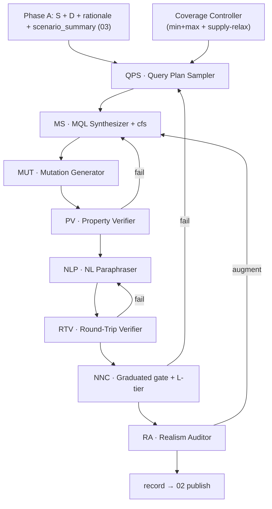

# TEND §04 · Agent Framework

> 本卷是 TEND **Phase B · Reverse-Engineered NL–MQL Construction** 的单一真源 (SSoT)。上游读取 [03](./03_spider_anchored_dataworld.md) 产出的 MongoDB schema、冻结 witness 数据、SRA rationale 与 `scenario_summary`；下游向 [02 §2](./02_dataset_design.md#02-2) 提交可发布的 record 字段。本卷**不**重复定义任务签名、NormExec、gold-as-class、EX 双条件与 ≡_rec，统一交叉引用 [01](./01_task_definition.md)。Spider 1.0 在本架构中仅充当**数据源 + 场景源**；Phase B **不**消费 Spider NL/SQL 作为查询 oracle。

---

## Part I

## TL;DR

TEND 在 Spider 锚定数据世界上，用 **QPS → MS → MUT → PV → NLP → RTV → NNC → RA** 八 Agent 流水线把逆向构造的 NL–MQL 对物化为可发布 record。构造路径为：**先采样 query_plan → 合成 MQL → 派生 canonical_form_set → 生成 mutations → 性质验证 → 逆向 paraphrase NLQ → 圆桌往返 → 形态/原生性裁决 → realism 审计**。正确性由 gold-as-class（canonical_form_set 四元组 + EX 双条件）与 P1–P4 根原则直接担保。

**QPS (Query Plan Sampler)** 在 Coverage Controller 的 min+max 双配额驱动下，从 schema、witness 摘要与 `scenario_summary` 采样结构化 `query_plan`：primary_pattern、operator_graph、shape_policy、null_missing_strategy、目标 L 级、schema_flex 选用及 join/aggregation depth 目标。**不**读取 Spider SQL 作为计划金锚。

**MS (MQL Synthesizer)** 以 `query_plan` 为输入，用 ≥2 条独立合成策略（直接编译 vs 等价代数变换）产出 `mql_primary` 与 `mql_alt`，并要求 NormExec 两路 ≡_rec。**MS 在时序上先于 MUT/PV/NLP/RTV/NNC 机械派生 `canonical_form_set` 四元组**，供下游 AST_check 与 mutations 生成直接消费。

**MUT (Mutation Generator)** 基于 `(query_plan, mql_primary, canonical_form_set)` 产出 **5–8 条** plausible wrong 变体，覆盖算子/参数、shape、null、canonical_form_set stress、schema_flex stress 五维度；全部须 EX fail（P3）。

**PV (Property Verifier)** 对 gold MQL 与 mutations 执行 plan 声明的语义性质断言、witness probe 与 AST_check；mutations 全 reject 为硬约束。

**NLP (NL Paraphraser)** 从锁定 MQL 与 query_plan **逆向** paraphrase 二联 NLQ：canonical（L1、schema-naive、最显式）与 colloquial（L0、口语 underspecified）；colloquial 不得引入第二意图（P2 / L3）。

**RTV (Round-Trip Verifier)** 使用与 QPS/MS/NLP **模型池 disjoint** 的独立 NL→MQL agent，对 canonical NLQ 再合成 `mql_round_trip_canonical`，**必须** ∈ gold-class；colloquial 走软检查——允许失败但须 NNC 可归因。

**NNC (NoSQL Nativeness Critic)** 负责 L0–L4 难度标注、`sql_infeasibility_class` 赋值、canonical_form_set 三元校验、歧义攻击，以及 **graduated dual-bridge gate**：SQL-bridge 与 Template-bridge **始终计算**，但仅当 `sql_infeasibility_class ≠ feasible` 时作为**发布门**（两桥均不得 EX=1 ∧ QIM=1）；`feasible` 类记录仅写入诊断字段。

**RA (Realism Auditor)** 审计 witness 与 gold 的生产 realism：字段覆盖率、null/missing 共现、嵌套深度与 SRA pattern 一致、结果基数非平凡（P4）。必要时 targeted augment 并重算 `world_signature`，回流 MS 重跑 NormExec。

**L0–L4 配额**：L0 ≤ 5%，L1 ≈ 20%，L2 ≈ 25%，L3 ≈ 25%，L4 ≥ 20%（全库分布目标）；**test 集 L4 ≥ 30%** 为发布硬约束（[02 H5](./02_dataset_design.md#02-4-3)）。L4 含两类 translation-lossy 子类：**structural_pipeline**（如 `$setWindowFields + $facet`）与 **structural_schema_flex**（如 `$switch by __type`、`$objectToArray` 动态键聚合）。

**canonical_form_set** 由 MS 从 operator_graph + shape_policy + null/missing 策略机械派生四元组；六件禁用 operator 恒入 must_not_contain。gold representative 存 record.MQL。

Canonical anchor **orchestra/1001**：针对 orchestra 嵌入式 schema 逆向设计的 L4 窗口+facet+ifNull 主模式；graduated gate 下 SQL-bridge 预期 EX=0。完整 JSON 见 [CANONICAL_ANCHOR.md](./_meta/CANONICAL_ANCHOR.md) 与本卷 §04-6。

---

<a id="04-1"></a>
### 04-1 管线总览

TEND 构造分 Phase A（DataWorld）与 Phase B（Reverse-Engineered NL–MQL Construction）。Phase A 由 [03](./03_spider_anchored_dataworld.md) 的 WP → SRA → SC → DM 负责；Phase B 为本卷八 Agent 流水线。

| 阶段 | Agent | 输入 | 输出 | 失败动作 |
|---|---|---|---|---|
| B1 | QPS | S, D 摘要, scenario_summary, 配额状态 | query_plan | cell 不可行 → Coverage Controller supply-relax |
| B2 | MS | query_plan | mql_primary, mql_alt, **canonical_form_set**, shape/join/agg 元数据 | 双路不 ≡_rec → 重采样 plan 或跳过 |
| B3 | MUT | query_plan, mql_primary, canonical_form_set | mutations[5–8] | 生成失败 → 回 MS |
| B4 | PV | mql_*, mutations, query_plan, cfs, D | property_verification | 性质 fail / mutation 未全 reject → 回 MS |
| B5 | NLP | mql_primary, query_plan, cfs, scenario_summary | nl_queries | paraphrase 违规 → 重试 |
| B6 | RTV | nl_queries, S, D, cfs | round_trip_verification | canonical 未 ∈ gold-class → 回 NLP（≤2 轮） |
| B7 | NNC | 全部上游产物 | difficulty, sql_infeasibility_class, nnc_verdict | gate fail / 歧义 → 回 QPS 或 RA |
| B8 | RA | NNC 通过候选, D | ra_audit, 可选 augment, world_signature' | P4 失败 → augment → 回流 MS |



**Spider 边界**：WP 在 Phase A 仍读取 Spider NL/SQL 以推断访问模式与域语义，但输出仅用于 schema 设计与 `scenario_summary` 提取；Phase B **禁止**以 Spider SQL 或 Spider NL 作为 MQL/NLQ 的金锚或收敛 oracle。

**P1–P4 构造期映射**

| 原则 | 主要承担 Agent |
|---|---|
| P1 执行良构 | MS + PV |
| P2 语义唯一性 | QPS + NLP + RTV + NNC 歧义攻击 |
| P3 判别力 | MUT + PV |
| P4 世界非平凡性 | RA + PV probe |

---

<a id="04-1-2"></a>
#### 04-1-2 Design Defenses

本节锁定逆向构造管线的七项结构性防御，防止时序错配、shortcut 与供给不足导致的 silent regression。

<a id="04-1-2-1"></a>
##### 04-1-2-1 canonical_form_set 时序（cfs timing）

`canonical_form_set` **必须**在 MS 阶段机械派生并作为 MS 输出的一部分写入 audit，时序上**先于** MUT、PV、NLP、RTV、NNC。任何下游 AST_check（含 PV、RTV、NNC、评测期 EX 条件 (a)）均直接消费 MS 产出的 cfs，**禁止**在 NNC 或更晚阶段才首次派生。派生算法见 §04-3-2 与 Part II §04-II-3。

<a id="04-1-2-2"></a>
##### 04-1-2-2 mutations 归属（MUT ownership）

P3 判别力由专用 Agent **MUT** 承担。MUT 消费 `(query_plan, mql_primary, canonical_form_set)`，产出 5–8 条 plausible wrong 变体；PV 负责验证 ∀m ∈ mutations, EX_verdict(m) = false。MUT 与 MS 模型池 disjoint；mutations 不得由 MS 或 NLP 顺带生成。

<a id="04-1-2-3"></a>
##### 04-1-2-3 RTV capability envelope

RTV 使用固定中段 NL→MQL agent（能力上界约 gpt-4o-mini 等级），且与 QPS、MS、MUT、NLP 模型池及评测期 `S_solver` **三向 disjoint**（详见 [05 §3](./05_evaluation_methodology.md#05-3)、[06 §4](./06_solution_design.md#06-4)）。RTV 对 canonical NLQ 最多重试 2×（确定性 seed）；仍失败则回 NLP 重写 canonical，**不**直接拒绝 record。colloquial 走软检查：允许 round-trip 未 ∈ gold-class，但 NNC 须记录可归因原因（underspec 边界、字段名缺失等）。

<a id="04-1-2-4"></a>
##### 04-1-2-4 Coverage Controller

QPS 受 Coverage Controller 调度，按六轴 min+max 双配额（[02 §4](./02_dataset_design.md#02-4)）推进分布。欠填 cell 的采样权重正比于 `max(0, MIN[c] − count[c])`。若某 cell 在当前 `db_id` 上不可行（例如 schema_flex 需要 `__variants` 但 H1–H4 未触发），标记 `supply_constrained` 并由 Controller 自动放宽 MIN 为 `min(target, supply_ceiling)`，写入 `audit/_global/coverage_report.json`。

<a id="04-1-2-5"></a>
##### 04-1-2-5 SQL-shortcut graduated gate

NNC 对每条 record **始终**计算 SQL-bridge（canonical NLQ → NL2SQL → sql_to_mongo）与 Template-bridge（关键词 → 外部模板库填槽）的 `(EX, QIM)` 指纹，写入可选 `_diagnostic_bridge_ref`。

**发布门决策**（与 `sql_infeasibility_class` 联动）：

| sql_infeasibility_class | dual-bridge 角色 |
|---|---|
| `feasible` | **仅诊断**；不据桥接结果拒绝 record |
| `semantic`, `performative`, `structural_pipeline`, `structural_schema_flex` | **发布门**；两桥均不得 EX=1 ∧ QIM=1 |

`feasible` 类记录仍须通过 NNC 的 L-tier 赋值、cfs 三元校验与歧义攻击；桥接结果供 [05](./05_evaluation_methodology.md) 的 `functional_sql_solvable` / `structural_sql_solvable` 诊断切片披露。

<a id="04-1-2-6"></a>
##### 04-1-2-6 schema_flex 供给端联动

Phase A SC 执行 flex-eligible DB 比例 pre-audit（`min_flex_db_ratio` 配置，见 [03 §6](./03_spider_anchored_dataworld.md#03-6)）；`spider_db_catalog.json` 写入 `flex_eligible: bool`。若选中库的 flex_eligible 比例 < 30%，[02 H7/H9](./02_dataset_design.md#02-4-3) 自动 supply-relax：`schema_flex ≠ none` 下限放宽至 `max(15%, supply_ceiling)`，`structural_schema_flex` 下限放宽至 `max(10%, supply_ceiling × 0.8)`。Coverage Controller 读取 supply-relax 状态，避免在供给不足域强行采样不可行 plan。

<a id="04-1-2-7"></a>
##### 04-1-2-7 NNC 歧义攻击 disjointness

NNC 对 canonical NLQ 的歧义攻击使用 ≥3 个独立 LLM 解析，其模型池与 QPS、MS、MUT、NLP、RTV 以及评测期 `S_solver` **全部 disjoint**。若存在与 gold query_plan 不等价且「人类合理」的解读 → P2 失败，回 QPS 重采样或 NLP 重写 canonical。

---

<a id="04-2"></a>
### 04-2 QPS · Query Plan Sampler

<a id="04-2-1"></a>
#### 04-2-1 职责

QPS 主动控制 record 的**覆盖轴与复杂度**，从 schema、witness 统计摘要、`agent_design_rationale` 与 `scenario_summary` 采样结构化 `query_plan`。plan 是 Phase B 的唯一上游意图原子；不对外暴露内部 plan 序列化格式或外部模板格点。

<a id="04-2-2"></a>
#### 04-2-2 query_plan 核心字段

| 字段 | 含义 |
|---|---|
| `primary_pattern` | 主模式 ID（如 `window_facet_filter`, `polymorphic_dispatch`） |
| `operator_graph` | 预期 stage 骨架与算子依赖 |
| `shape_policy` | preserve / augment / reshape / reduce |
| `null_missing_strategy` | none / ifNull / type / cond |
| `target_difficulty` | 目标 L0–L4 |
| `schema_flex_mode` | none 或 H1–H4 对应模式 |
| `join_depth_target` | 0–3+ |
| `aggregation_depth_target` | shallow / medium / deep |
| `target_fields` | plan 须观测的 schema 路径列表 |
| `semantic_properties` | PV 将断言的性质清单（基数、tie、null 覆盖等） |

<a id="04-2-3"></a>
#### 04-2-3 与 Coverage Controller 的交互

QPS 每轮读取六轴 cell 计数与 min/max 配额，优先采样 deficit 最大的可行 cell。plan-template 库覆盖 NoSQL-native 主模式：`polymorphic_dispatch`、`dynamic_key_aggregation`、`attribute_bag_unfold`、`schema_version_fallback`、`window_facet_filter`、`graph_traversal`、`bucket_summary`、`extended_reference_join`、`nested_unwind`、`set_window` 等。目标 L 级与 schema_flex 套路由 QPS 直接驱动，**不受** Spider SQL 表达力上限约束。

---

<a id="04-3"></a>
### 04-3 MS · MQL Synthesizer

<a id="04-3-1"></a>
#### 04-3-1 双路合成

MS 接收 `query_plan`，执行 ≥2 条独立合成路径：

| 路径 | 方法 | 产物 |
|---|---|---|
| **直接编译** | query_plan → stage 骨架 → MQL | mql_primary |
| **等价变换** | 代数等价重写（stage 重排、accumulator 等价替换） | mql_alt |

**收敛条件（合取）**

1. NormExec(mql_primary, D) ≡_rec NormExec(mql_alt, D) ≠ ⊥
2. AST_check 对两者使用 MS 派生的同一 canonical_form_set 均 pass
3. 禁用 operator 扫描均 pass
4. shape_policy 推断与 query_plan 一致

代表实例写入 record.MQL（默认 mql_primary；若 mql_alt AST 更紧则取 mql_alt）。另一路写入 audit `synthesis_trace` 供诊断。

<a id="04-3-2"></a>
#### 04-3-2 canonical_form_set 派生（MS 所有权）

给定 query_plan 的 operator_graph、shape_policy、null_missing_strategy，MS **机械派生**四元组：

**must_contain**

- primary_pattern 核心算子（如 window+facet → `{$setWindowFields, $facet}`）
- schema-flex primary_pattern 核心算子（见下表）
- null/missing 策略算子（ifNull → `{$ifNull}`；type → `{$type}`；cond → `{$cond}`）
- aggregations 用到的 accumulator（mean → `{$avg}`；median → `{$median}` 或手动百分位集合）

**schema-flex primary_pattern → must_contain**

| primary_pattern | must_contain（至少） | must_contain_at_root（至少） |
|---|---|---|
| `polymorphic_dispatch` | `$switch` 或 `$type` | `$addFields` 或 `$project`（含 dispatch stage） |
| `dynamic_key_aggregation` | `$objectToArray`, `$unwind`, `$arrayToObject` | `$unwind` |
| `attribute_bag_unfold` | `$arrayToObject` 或 `$reduce` | `$addFields` |
| `schema_version_fallback` | `$ifNull`（≥2 处引用） | `$addFields` 或 `$project` |

**must_contain_at_root**（通用）

- primary stage 算子（$setWindowFields、$facet、$graphLookup、$lookup 等按 pattern）
- shape_policy = reduce 时 $group 须在 root

**must_not_contain**

- 六件禁用 operator：`{$sample, $rand, $$NOW, $out, $merge, $function}`
- pattern 特定禁止集（如 simple_filter 禁 `{$group, $setWindowFields, $facet}`）

**must_not_contain_at_root**

- shape_policy ∈ {preserve, augment}：根禁 `{$unwind, $group}`（除非 pattern 豁免）
- shape_policy = reduce：根禁纯 $project 独占（须含 $group）

AST_check 协议所有权在 [01 §3-1](./01_task_definition.md#01-3-1)；本卷定义派生来源。NNC 仅**确认** cfs 与 MQL 一致，不重新派生。

---

<a id="04-4"></a>
### 04-4 MUT · PV · NLP · RTV

<a id="04-4-1"></a>
#### 04-4-1 MUT · mutations 5–8 条 / record

mutations 是 **plausible wrong** 变体库，评测期与构造期 P3 共用。每条 mutation 须 EX fail。

| 维度 | 示例子轴 | 每 record 建议条数 |
|---|---|---|
| **A operator / param** | 缺 $facet、window size ±1、sortBy 反转、partition 字段替换 | 2–3 |
| **B shape / output** | shape_policy 邻接错标、缺 output key、错误 dtype | 1–2 |
| **C null / missing** | 丢弃 $ifNull、错误 disambig | 1–2 |
| **D canonical_form_set stress** | 移除 must_contain 算子、加入禁用 operator | 1 |
| **E schema_flex_stress** | 忽略 `__type` 分支、假设统一 schema、丢弃 `$ifNull` fallback、错误 dispatch | 1 |

**总量**：5 ≤ |mutations| ≤ 8。序列化至 audit 或 fixtures `mutations.json`（见 `schemas/mutations.schema.json`）。

orchestra/1001 典型 mutation（均须 EX fail）：

1. 移除 $ifNull，Attendance 缺失时不 coalesce
2. 用全局 $avg 替代 $setWindowFields 窗口均值
3. global median 索引未 $floor
4. 缺少 $facet，无法在单管道并行计算 median
5. partitionBy 误用 Name 而非 $_id

<a id="04-4-2"></a>
#### 04-4-2 PV · Property Verifier

PV 对 gold MQL 与 mutations 执行：

1. **plan 性质断言**：逐条检验 `query_plan.semantic_properties`（结果基数 ≥ 2、tie 可区分、null/missing 覆盖、shape 与 shape_policy 一致等）
2. **witness probe**：在 D 上执行针对性子查询，验证边界 doc 存在
3. **AST_check**：gold 与 mutations 分别扫描 cfs
4. **P3 硬约束**：∀m ∈ mutations, EX_verdict(m, record, D) = false
5. **gold accept**：EX_verdict(MQL, record, D) = true

失败时回流 MS（plan 不可实现）或 MUT（mutation 未 sufficiently wrong）。

<a id="04-4-3"></a>
#### 04-4-3 NLP · 二联 NLQ

| 字段 | specificity | 约束 |
|---|---|---|
| nl_queries.canonical | L1 | schema-naive；无 `$` operator 术语；单一闭包意图 |
| nl_queries.colloquial | L0 | 口语 underspecified；不得出现 schema 字段名；不得引入第二意图 |

Paraphrase 由 NLP 在 MQL 与 query_plan 确定后，结合 `scenario_summary` 域语义生成（见 Part II §04-II-6）。canonical 须完整覆盖 plan 中的语义闭包；colloquial 为 optional robustness 子集。

<a id="04-4-4"></a>
#### 04-4-4 RTV · Round-Trip Verifier

RTV 使用独立 NL→MQL agent（与构造池 disjoint），读取 `(nl_queries, S, D, canonical_form_set)`：

| NLQ 档位 | 要求 |
|---|---|
| **canonical** | `mql_round_trip_canonical` 必须 EX=1（∈ gold-class）；失败 → 回 NLP 重写，最多 2 轮 |
| **colloquial** | `mql_round_trip_colloquial` 软检查；允许 EX=0，但 NNC 须记录 underspec 归因 |

RTV 验证 NL 信息在逆向 paraphrase 后仍可闭包回 gold-class，是 P2 的核心机制之一（与 NNC 歧义攻击互补）。

---

<a id="04-5"></a>
### 04-5 NNC · NoSQL Nativeness Critic

<a id="04-5-1"></a>
#### 04-5-1 L0–L4 难度层级

| 层级 | 名称 | 典型算子 / 结构 | SQL 可直译性 |
|---|---|---|---|
| **L0** | SQL-trivial | $match、$project | 完全可直译 |
| **L1** | light aggregation | $group、$sort、$limit | 可直译 |
| **L2** | multi-stage | $lookup、$unwind、嵌套 $group | 多数可直译 |
| **L3** | window / branch | $setWindowFields、$switch、$graphLookup 浅层 | 部分 lossy |
| **L4** | NoSQL-native | $facet + window、$objectToArray、深 $graphLookup、**$switch by __type** | structural_pipeline / structural_schema_flex |

**分布目标（全库）**

| 层级 | 目标占比 |
|---|---|
| L0 | ≤ 5% |
| L1 | ≈ 20% |
| L2 | ≈ 25% |
| L3 | ≈ 25% |
| L4 | ≥ 20% |

**发布硬约束**：test 集 `difficulty = L4` 比例 ≥ 30%（[02 H5](./02_dataset_design.md#02-4-3)）；test 集 L0 ≤ 5%（[02 H8](./02_dataset_design.md#02-4-3)）。NNC 赋值须与 canonical_form_set / MQL 算子相容（record C7）。

**`sql_infeasibility_class` 枚举**（NNC 必填，见 `agent_prompts/nnc_nosql_nativeness_critic.md`）：

| 类别 | 含义 | 典型 record |
|---|---|---|
| `feasible` | SQL 完全可直译 | L0–L1 |
| `semantic` | SQL 可表达但 null/missing 语义 lossy | L2–L3 with `$ifNull` |
| `performative` | SQL 需 CTE/window 拼装，性能/结构 lossy | L3–L4 pipeline |
| `structural_pipeline` | 管线结构 SQL 不可同步表达 | L4 `$facet + $setWindowFields` |
| `structural_schema_flex` | schema 形状 SQL 不可表达 | L4 `$switch by __type`、`$objectToArray` |

当 `schema_flex != none` 且 MQL 含 schema-flex 算子作用于 `__variants` 字段时，NNC **必须**标注 `structural_schema_flex` 且 `difficulty = L4`。

<a id="04-5-2"></a>
#### 04-5-2 graduated dual-bridge gate

**目标**：对 translation-lossy 记录，杜绝 solver 通过「SQL 翻译」或「固定模板填槽」不经 NoSQL 推理即 ∈ gold-class。

| 桥 | 路径 | 发布门判据（仅 non-feasible） |
|---|---|---|
| **SQL-bridge** | canonical NLQ → NL2SQL LLM → sql_to_mongo → mql_sql_bridge | 在 D 上 EX = 0 **或** QIM = 0 |
| **Template-bridge** | canonical NLQ → 关键词 → 外部 MQL 模板库 → mql_template_bridge | 同上 |

**通过判据（non-feasible）**：两桥均不得同时 EX = 1 ∧ QIM = 1。`feasible` 类记录跳过发布门，桥接结果写入 `_diagnostic_bridge_ref` 供报表。

orchestra/1001（`structural_pipeline`）预期：
- SQL-bridge：SQL 无法同步表达 facet + 分区窗口 → 翻译失败或 AST fail → EX = 0
- Template-bridge：关键词误导至 lookup_join 模板 → 结构错位 → EX = 0

失败处理：优先 RA targeted augment；2 轮仍失败 → QPS 重采样 plan 或拒绝 record。

<a id="04-5-3"></a>
#### 04-5-3 歧义攻击

独立 LLM（模型池与 QPS/MS/MUT/NLP/RTV/S_solver 全部 disjoint）读取 **仅** canonical NLQ + schema，产出 ≥3 个 query_plan 解读。若存在与 gold query_plan 不等价且「人类合理」的解读 → P2 失败，回 QPS 或 NLP 重写 canonical。

<a id="04-5-4"></a>
#### 04-5-4 三元校验

NNC 在赋 difficulty 前执行：

1. canonical_form_set.must_contain ⊆ ops(MQL)
2. must_contain_at_root ⊆ root_ops(MQL) 且非空
3. must_not_contain 与禁用 operator 扫描一致
4. shape_policy 与 pipeline 形状一致（preserve / reshape / reduce）

---

<a id="04-6"></a>
### 04-6 Canonical Anchor · orchestra/1001

orchestra/1001 是逆向构造管线的 canonical 示范：QPS 在 orchestra 嵌入式 schema（conductor → orchestra[] → performance[]，Attendance 来自 show 表 denormalize，见 [03 §1](./03_spider_anchored_dataworld.md#03-1)）上采样 `primary_pattern = window_facet_filter` 的 query_plan；MS 合成 `$setWindowFields` 分区滑动窗口 + `$facet` 并行 median 分支 + `$ifNull` null coalesce；NLP 逆向 paraphrase 出二联 NLQ；NNC 标注 `difficulty = L4`、`sql_infeasibility_class = structural_pipeline`。

该 record **不是** Spider SQL 的翻译产物，而是针对 embed schema 主动设计的 NoSQL-native 主模式；graduated gate 下 SQL-bridge 预期无法同时结构匹配又执行等价。

<!-- canonical-anchor: orchestra/1001 -->
```json
{
  "record_id": 1001,
  "db_id": "orchestra",
  "nl_queries": {
    "canonical": "对每位 conductor，先在其指挥的 orchestra 的 performance 上按 Performance_ID 升序、对 Attendance 计算窗口大小为 (当前, 前 2 场) 的滑动平均；取该 conductor 的最后一次窗口平均值作为代表值 (Attendance 缺失视为 0)。然后计算所有 conductor 代表值的中位数。最终只输出代表值严格大于该中位数的 conductor，字段为 Name 与 last_window_avg；若 Name 缺失则显示为 (unknown)；不要求排序。",
    "colloquial": "列出最近场次出勤趋势高于同行中位数的指挥。"
  },
  "MQL": "db.conductor.aggregate([
  { $unwind: { path: \"$orchestra\", preserveNullAndEmptyArrays: false } },
  { $unwind: { path: \"$orchestra.performance\", preserveNullAndEmptyArrays: false } },
  { $setWindowFields: {
      partitionBy: \"$_id\",
      sortBy: { \"orchestra.performance.Performance_ID\": 1 },
      output: {
        moving_avg_attendance: {
          $avg: { $ifNull: [\"$orchestra.performance.Attendance\", 0] },
          window: { documents: [-2, 0] }
        }
      }
  } },
  { $group: {
      _id: \"$_id\",
      Name: { $first: { $ifNull: [\"$Name\", \"(unknown)\"] } },
      last_window_avg: { $last: \"$moving_avg_attendance\" }
  } },
  { $facet: {
      per_conductor: [ { $project: { _id: 0, Name: 1, last_window_avg: 1 } } ],
      global_median: [
        { $sort: { last_window_avg: 1 } },
        { $group: { _id: null, vals: { $push: \"$last_window_avg\" } } },
        { $project: { _id: 0, median: { $arrayElemAt: [\"$vals\", { $floor: { $divide: [{ $size: \"$vals\" }, 2] } }] } } }
      ]
  } },
  { $project: {
      kept: { $filter: {
        input: \"$per_conductor\",
        as: \"c\",
        cond: { $gt: [\"$$c.last_window_avg\", { $arrayElemAt: [\"$global_median.median\", 0] }] }
      } }
  } },
  { $unwind: \"$kept\" },
  { $project: { _id: 0, Name: \"$kept.Name\", last_window_avg: \"$kept.last_window_avg\" } }
])",
  "canonical_form_set": {
    "must_contain": ["$setWindowFields", "$facet", "$ifNull"],
    "must_not_contain": [],
    "must_contain_at_root": ["$setWindowFields", "$facet"],
    "must_not_contain_at_root": []
  },
  "difficulty": "L4",
  "shape_policy": "reshape",
  "world_signature": "sha256:a47f3e8b1c2d4e5f6a7b8c9d0e1f2a3b4c5d6e7f8a9b0c1d2e3f4a5b6c7d8e90",
  "agent_design_rationale_ref": "fixtures/orchestra/sra.yaml",
  "mutations_ref": "fixtures/orchestra/mutations.json"
}
```

---

<a id="04-7"></a>
### 04-7 RA · Realism Auditor 与边界声明

<a id="04-7-1"></a>
#### 04-7-1 审计维度

| 检查项 | 说明 | 关联原则 |
|---|---|---|
| field observability | query_plan 引用字段在 D 上有非空实例 | P1 |
| null/missing coverage | $ifNull / $type 字段同时含 null 与 non-null | P4 |
| result cardinality | 非空结果；group/window 值域 ≥ 2（除非 NLQ 问不存在） | P4 |
| embed depth | $unwind 层数与 SRA embed 一致 | realism |
| type sanity | 无 impossible cast；日期/数值范围合理 | realism |

<a id="04-7-2"></a>
#### 04-7-2 targeted augment 协议

- **append-only**：新 doc 新 _id；不修改已有 doc
- **minimal**：integer programming 求最小注入集
- **traceable**：写入 audit/ra_augment_trace.json
- augment 后 **重算 world_signature**，同 db_id 全部 record 的 gold_cache 失效；**回流 MS** 重跑 NormExec 与 PV

<a id="04-7-3"></a>
#### 04-7-3 与上游回流

| 失败类型 | 回流 |
|---|---|
| P4 cardinality | RA augment → 回流 MS → PV → … → NNC 重验 |
| dual-bridge 近 miss（EX=1, QIM=0 边界，non-feasible） | RA 增 boundary doc → NNC 重验 |
| realism 不可修复 | 拒绝 record |

<a id="04-7-4"></a>
#### 04-7-4 构造期自检清单

record 发布前须通过：

1. **gold accept**：EX_verdict(MQL, record, D) = true
2. **mutations 全 reject**：∀m ∈ mutations, EX_verdict(m.MQL, record, D) = false
3. **RTV canonical 闭包**：mql_round_trip_canonical ∈ gold-class
4. **graduated gate**（若 sql_infeasibility_class ≠ feasible）：两桥均非 (EX=1 ∧ QIM=1)
5. **P4 非平凡**：RA 签发的 ra_audit.pass = true

<a id="04-7-5"></a>
#### 04-7-5 边界声明

| 主题 | 归属 |
|---|---|
| 任务签名、EX、≡_rec、AST_check | [01](./01_task_definition.md) |
| record 字段、split、L4 ≥ 30%、L0 ≤ 5% | [02](./02_dataset_design.md) |
| WP/SRA/SC/DM、scenario_summary、flex supply | [03](./03_spider_anchored_dataworld.md) |
| 7 指标、4-panel 观测、SQL-route 诊断切片 | [05](./05_evaluation_methodology.md) |
| SMART solver、disjointness 池 | [06](./06_solution_design.md) |

Agent prompt 模板：`agent_prompts/qps_query_plan_sampler.md`、`ms_mql_synthesizer.md`、`mut_mutation_generator.md`、`pv_property_verifier.md`、`nlp_nl_paraphraser.md`、`rtv_round_trip_verifier.md`、`nnc_nosql_nativeness_critic.md`、`ra_realism_auditor.md`。

---

## Part II

> 实现附录。下列契约、伪代码与 schema 索引供构造流水线与单元测试直接对照 Part I；非 normative prose 的补充说明。

<a id="04-ii-1"></a>
### 04-II-1 Agent I/O 契约

#### QPS

| 方向 | 字段 | 类型 | 必填 |
|---|---|---|---|
| In | schema | object | ✓ |
| In | snapshot_summary | object | ✓ |
| In | scenario_summary | string | ✓ |
| In | sra_rationale | object | ✓ |
| In | quota_state | object | ✓ |
| Out | query_plan | object | ✓ |
| Out | qps_trace | object | ✓ |

#### MS

| 方向 | 字段 | 类型 | 必填 |
|---|---|---|---|
| In | query_plan | object | ✓ |
| In | schema | object | ✓ |
| In | snapshot | object | ✓ |
| Out | MQL | string | ✓ |
| Out | mql_alt | string | ✓ |
| Out | canonical_form_set | object | ✓ |
| Out | shape_policy | enum | ✓ |
| Out | join_depth | int | ✓ |
| Out | aggregation_depth | enum | ✓ |
| Out | synthesis_trace | object | ✓ |

#### MUT

| 方向 | 字段 | 类型 | 必填 |
|---|---|---|---|
| In | query_plan | object | ✓ |
| In | MQL | string | ✓ |
| In | canonical_form_set | object | ✓ |
| Out | mutations | array[5–8] | ✓ |
| Out | mut_trace | object | ✓ |

#### PV

| 方向 | 字段 | 类型 | 必填 |
|---|---|---|---|
| In | MQL | string | ✓ |
| In | mql_alt | string | ✓ |
| In | mutations | array | ✓ |
| In | query_plan | object | ✓ |
| In | canonical_form_set | object | ✓ |
| In | snapshot | object | ✓ |
| Out | property_verification | object | ✓ |
| Out | pv_pass | boolean | ✓ |

#### NLP

| 方向 | 字段 | 类型 | 必填 |
|---|---|---|---|
| In | MQL | string | ✓ |
| In | query_plan | object | ✓ |
| In | canonical_form_set | object | ✓ |
| In | scenario_summary | string | ✓ |
| Out | nl_queries | {canonical, colloquial} | ✓ |
| Out | nlp_trace | object | ✓ |

#### RTV

| 方向 | 字段 | 类型 | 必填 |
|---|---|---|---|
| In | nl_queries | object | ✓ |
| In | schema | object | ✓ |
| In | snapshot | object | ✓ |
| In | canonical_form_set | object | ✓ |
| Out | mql_round_trip_canonical | string | ✓ |
| Out | mql_round_trip_colloquial | string | ✓ |
| Out | round_trip_verification | object | ✓ |
| Out | rtv_pass | boolean | ✓ |

#### NNC

| 方向 | 字段 | 类型 | 必填 |
|---|---|---|---|
| In | MQL | string | ✓ |
| In | nl_queries | object | ✓ |
| In | canonical_form_set | object | ✓ |
| In | query_plan | object | ✓ |
| In | snapshot | object | ✓ |
| In | shape_policy | string | ✓ |
| In | round_trip_verification | object | ✓ |
| Out | difficulty | L0–L4 | ✓ |
| Out | sql_infeasibility_class | enum | ✓ |
| Out | nnc_verdict | object | ✓ |
| Out | diagnostic_bridge | object | ✓ |
| Out | functional_sql_solvable | boolean | ✓ |
| Out | structural_sql_solvable | boolean | ✓ |

#### RA

| 方向 | 字段 | 类型 | 必填 |
|---|---|---|---|
| In | MQL | string | ✓ |
| In | nl_queries | object | ✓ |
| In | query_plan | object | ✓ |
| In | snapshot | object | ✓ |
| In | schema | object | ✓ |
| Out | ra_audit | object | ✓ |
| Out | snapshot' | object | 可选（augment 后） |
| Out | world_signature' | string | 可选 |

---

<a id="04-ii-2"></a>
### 04-II-2 graduated dual-bridge 评估器

# uses: typing
```

def bridge_verdict(mql_bridge: str, record: dict, snapshot: dict) -> dict:
    """Return {ex: 0|1, qim: 0|1} for one bridge product."""
    ast_ok = AST_check(mql_bridge, record["canonical_form_set"])
    qim = 1 if ast_ok else 0
    if not ast_ok:
        return {"ex": 0, "qim": 0}
    rp = NormExec(mql_bridge, snapshot)
    rg = NormExec(record["MQL"], snapshot)
    ex = 1 if equiv_rec(rp, rg, order_sensitive=pipeline_has_order_semantics(record["MQL"])) else 0
    return {"ex": ex, "qim": qim}

def graduated_gate(record, snapshot, *, sql_bridge_mql, template_bridge_mql) -> dict:
    """Gate only when sql_infeasibility_class != feasible."""
    sql_v = bridge_verdict(sql_bridge_mql, record, snapshot)
    tpl_v = bridge_verdict(template_bridge_mql, record, snapshot)
    cls = record.get("sql_infeasibility_class", "feasible")
    gate_required = cls != "feasible"
    defeat = all(not (v["ex"] == 1 and v["qim"] == 1) for v in (sql_v, tpl_v))
    return {
        "sql_bridge": sql_v,
        "template_bridge": tpl_v,
        "gate_required": gate_required,
        "gate_pass": (not gate_required) or defeat,
        "functional_sql_solvable": sql_v["ex"] == 1,
        "structural_sql_solvable": sql_v["ex"] == 1 and sql_v["qim"] == 1,
    }
```

---

<a id="04-ii-3"></a>
### 04-II-3 derive_canonical_form_set（MS 内部）

# uses: typing
```

DISABLED = {"$sample", "$rand", "$out", "$merge", "$function", "$$NOW"}

PATTERN_CORE_OPS = {
    "window_facet_filter": {"$setWindowFields", "$facet"},
    "simple_filter": set(),
    "lookup_join": {"$lookup"},
    "polymorphic_dispatch": {"$switch", "$type"},
    "dynamic_key_aggregation": {"$objectToArray", "$unwind", "$arrayToObject"},
    "attribute_bag_unfold": {"$arrayToObject", "$reduce"},
    "schema_version_fallback": {"$ifNull"},
}

NULL_OP = {"ifNull": "$ifNull", "type": "$type", "cond": "$cond"}

def derive_canonical_form_set(query_plan: dict) -> dict:
    pattern = query_plan["primary_pattern"]
    shape = query_plan["shape_policy"]
    must_contain = set(PATTERN_CORE_OPS.get(pattern, set()))
    for agg in query_plan.get("aggregations", []):
        must_contain |= accumulator_ops(agg)
    strat = query_plan.get("null_missing_strategy", "none")
    if strat in NULL_OP:
        must_contain.add(NULL_OP[strat])
    must_not_contain = set(DISABLED) | pattern_forbidden_ops(pattern)
    must_contain_at_root = root_required_ops(pattern, shape)
    must_not_contain_at_root = root_forbidden_ops(shape)
    return {
        "must_contain": sorted(must_contain),
        "must_not_contain": sorted(must_not_contain),
        "must_contain_at_root": sorted(must_contain_at_root),
        "must_not_contain_at_root": sorted(must_not_contain_at_root),
    }
```

orchestra/1001：`primary_pattern = window_facet_filter`，`null_missing_strategy = ifNull`，`shape_policy = reshape` → 与 §04-6 JSON 一致。

---

<a id="04-ii-4"></a>
### 04-II-4 mutations 生成器（MUT）

# uses: random
```

MUTATION_SUBAXES = {
    "A": ["drop_must_contain_op", "window_size_delta", "sort_reverse", "partition_swap"],
    "B": ["shape_policy_swap", "drop_output_key"],
    "C": ["drop_ifNull", "wrong_disambig"],
    "D": ["inject_disabled_op", "remove_root_op"],
    "E": ["ignore_variants", "assume_uniform_schema", "drop_ifNull_fallback", "wrong_dispatch"],
}

def generate_mutations(query_plan, gold_mql, canonical_form_set, *, seed=0, min_n=5, max_n=8):
    rng = random.Random(seed)
    n = rng.randint(min_n, max_n)
    muts = []
    for i in range(n):
        dim = rng.choice(list(MUTATION_SUBAXES.keys()))
        sub = rng.choice(MUTATION_SUBAXES[dim])
        mql = apply_subaxis(gold_mql, query_plan, canonical_form_set, dim, sub)
        muts.append({
            "mutation_id": f"m{i+1:03d}",
            "dimension": dim,
            "subaxis": sub,
            "MQL": mql,
            "expected_reject": True,
        })
    return muts

def validate_mutations(muts, record, snapshot):
    for m in muts:
        assert EX_verdict(m["MQL"], record, snapshot) is False
```

---

<a id="04-ii-5"></a>
### 04-II-5 MS 双路合成

# uses: typing
```

def ms_synthesize(query_plan, schema, snapshot) -> dict:
    mql_primary = compile_query_plan(query_plan, schema, strategy="direct")
    mql_alt = compile_query_plan(query_plan, schema, strategy="algebraic_rewrite")
    cfs = derive_canonical_form_set(query_plan)
    if not paths_converge(mql_primary, mql_alt, cfs, snapshot):
        raise MSSynthesisError(query_plan)
    mql = mql_primary if ast_tighter(mql_primary, cfs) else mql_alt
    return {
        "MQL": mql,
        "mql_alt": mql_alt if mql == mql_primary else mql_primary,
        "canonical_form_set": cfs,
        "synthesis_trace": {"primary": mql_primary, "alt": mql_alt},
    }

def paths_converge(mql_a, mql_b, cfs, snapshot) -> bool:
    if not (AST_check(mql_a, cfs) and AST_check(mql_b, cfs)):
        return False
    ra = NormExec(mql_a, snapshot)
    rb = NormExec(mql_b, snapshot)
    return ra is not BOT and equiv_rec(ra, rb, order_sensitive=True)
```

---

<a id="04-ii-6"></a>
### 04-II-6 RTV round-trip 验证

# uses: typing
```

def rtv_verify(nl_queries, schema, snapshot, canonical_form_set, *, max_retries=2) -> dict:
    """Independent NL→MQL agent; canonical must hit gold-class."""
    canonical_mql = nl_to_mql(nl_queries["canonical"], schema)
    canonical_ok = EX_verdict(canonical_mql, {"MQL": canonical_mql, "canonical_form_set": canonical_form_set}, snapshot)
    colloquial_mql = nl_to_mql(nl_queries["colloquial"], schema)
    colloquial_ok = EX_verdict(colloquial_mql, {"MQL": canonical_mql, "canonical_form_set": canonical_form_set}, snapshot)
    return {
        "mql_round_trip_canonical": canonical_mql,
        "mql_round_trip_colloquial": colloquial_mql,
        "canonical_pass": canonical_ok,
        "colloquial_pass": colloquial_ok,
        "rtv_pass": canonical_ok,  # colloquial is soft
    }
```

---

<a id="04-ii-7"></a>
### 04-II-7 NLQ paraphraser（NLP）

# uses: typing
```

def paraphrase_nlq_pair(mql: str, query_plan: dict, scenario_summary: str) -> dict:
    """Reverse-engineer canonical (L1) and colloquial (L0) NLQ from locked MQL."""
    canonical = llm_paraphrase(
        mql=mql,
        plan=query_plan,
        scenario=scenario_summary,
        mode="canonical",
        rules={"no_dollar_ops": True, "schema_naive": True, "min_tokens": 20, "max_tokens": 120},
    )
    colloquial = llm_paraphrase(
        mql=mql,
        plan=query_plan,
        scenario=scenario_summary,
        mode="colloquial",
        rules={"no_field_names": True, "underspecified": True, "min_tokens": 8, "max_tokens": 40},
    )
    assert single_intent(parse_loose(colloquial), query_plan)
    return {"canonical": canonical, "colloquial": colloquial}
```

机器可读 NLQ 形状：`schemas/nlq.schema.json`。

---

<a id="04-ii-8"></a>
### 04-II-8 JSON Schema 索引

| 文件 | 校验对象 |
|---|---|
| `schemas/query_plan.schema.json` | QPS 输出 query_plan |
| `schemas/synthesis_trace.schema.json` | MS 双路合成轨迹 |
| `schemas/property_verification.schema.json` | PV 性质断言表 |
| `schemas/round_trip_verification.schema.json` | RTV 往返验证 |
| `schemas/canonical_form_set.schema.json` | 四元组 |
| `schemas/canonical_form_set.schema.valid.json` | valid 示例（orchestra/1001） |
| `schemas/canonical_form_set.schema.invalid.json` | invalid 示例（空 must_contain_at_root） |
| `schemas/mutations.schema.json` | per-record mutations 文件 |
| `schemas/mutations.schema.valid.json` | valid 示例 |
| `schemas/mutations.schema.invalid.json` | invalid 示例（缺 mutation_id） |
| `schemas/nlq.schema.json` | nl_queries 二联 |

**校验命令**

```bash
jsonschema --schema proposals/schemas/canonical_form_set.schema.json \
  --instance proposals/schemas/canonical_form_set.schema.valid.json

jsonschema --schema proposals/schemas/mutations.schema.json \
  --instance proposals/schemas/mutations.schema.valid.json

jsonschema --schema proposals/schemas/nlq.schema.json \
  --instance proposals/schemas/nlq.schema.valid.json
```

---

> **本卷职责结束于：** 通过 QPS → MS → MUT → PV → NLP → RTV → NNC → RA 八 Agent 产出满足 P1–P4 与 [02](./02_dataset_design.md) record 契约的候选，并附 audit 轨迹供 Tier-2 复现。评测期指标与 4-panel 报告由 [05](./05_evaluation_methodology.md) 负责。
