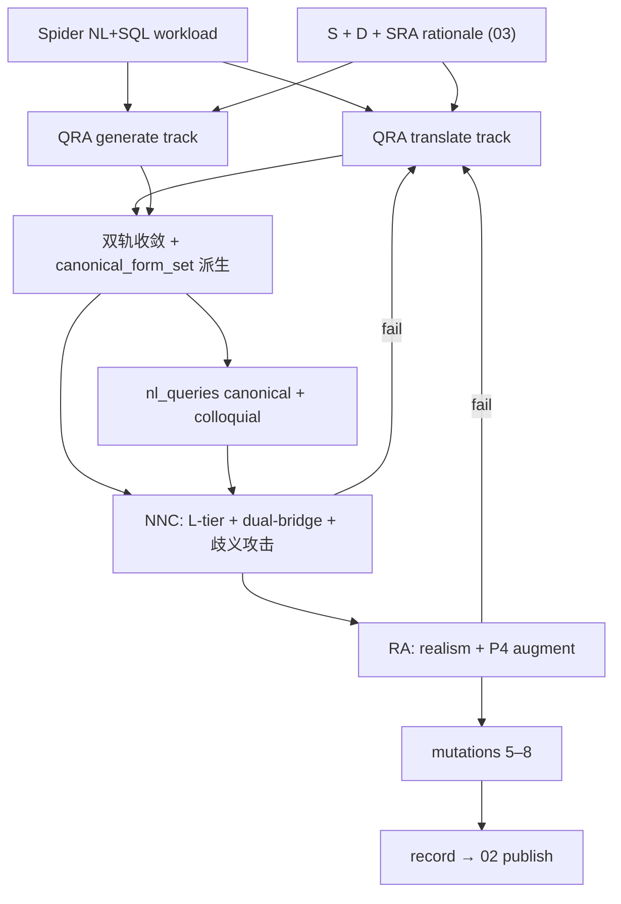

# TEND §04 · Agent Framework (v2-Agent)

> 本卷是 TEND v2-Agent **Phase E · Query Construction & Validation** 的单一真源 (SSoT)。上游读取 [03](./03_spider_anchored_dataworld.md) 产出的 Spider 锚定 schema、witness 数据与 SRA rationale；下游向 [02 §2](./02_dataset_design.md#02-2) 提交可发布的 record 字段。本卷**不**重复定义任务签名、NormExec、gold-as-class、EX 双条件与 ≡_rec，统一交叉引用 [01](./01_task_definition.md)。v2-original 的 SI DSL、Intent Template Lattice、Symbolic Lift → QIR、V_correct 语义邻域挖掘已删除。

---

## Part I

## TL;DR

TEND v2-Agent 在 Spider 锚定数据世界上，用 **QRA / NNC / RA** 三 Agent 把 Spider workload 物化为 NoSQL-native record。构造期不再经过 SI 模板格点或 QIR 不动点；正确性由 gold-as-class（canonical_form_set 四元组 + EX 双条件）与 P1–P4 根原则直接担保。

**QRA (Query Re-author)** 采用 **双轨** 策略。**Translate 轨**读取 Spider (NL, SQL) 对，在 SRA schema 与冻结 witness 上把 SQL 意图重写成 MongoDB 聚合管道；**Generate 轨**从 schema + sample documents + workload hint 直接生成 NoSQL-native MQL。两轨必须收敛：NormExec 结果 ≡_rec，且 AST_check 同时通过由 QRA 派生的 canonical_form_set。收敛失败则 record 驳回。QRA 还产出 **二联 NLQ**：canonical（L1、schema-naive、最显式）与 colloquial（L0、口语 underspecified）；colloquial 不得引入第二意图（P2 / L3）。

**NNC (NoSQL Nativeness Critic)** 负责 **L0–L4 难度标注**、canonical_form_set 三元校验（算子集合、shape_policy、禁用 operator 扫描），以及 **dual-bridge defeat**。SQL-bridge：NLQ → NL2SQL → sql_to_mongo → mql_sql_bridge；Template-bridge：NLQ 关键词 → 外部模板库槽位填充 → mql_template_bridge。两桥产物在 witness 上须满足 EX = 0 或 QIM = 0（即不得同时结构像 gold 又执行等价）。任一桥命中 EX = 1 ∧ QIM = 1 → witness 不足或 NLQ 过宽，回 RA augment 或 QRA 重写。NNC 还对 canonical NLQ 做 **歧义攻击**：独立 LLM 产出 ≥3 个意图解读，全部须与 gold-class 一致。

**RA (Realism Auditor)** 审计 witness 与 gold 的 **生产 realism**：字段覆盖率、null/missing 共现、嵌套深度与 SRA pattern 一致、结果基数非平凡（P4）。必要时做 **targeted augment**（append-only、最小 doc 集、可追溯日志），并重算 world_signature。

**L0–L4 配额**：L0 ≤ 10%，L1 ≈ 20%，L2 ≈ 25%，L3 ≈ 25%，L4 ≥ 20%（全库分布目标）；**test 集 L4 ≥ 15%** 为发布硬约束（[02 §4](./02_dataset_design.md#02-4)）。L4 含两类 translation-lossy 子类：**structural_pipeline**（如 `$setWindowFields + $facet`）与 **structural_schema_flex**（如 `$switch by __type`、`$objectToArray` 动态键聚合）；后者 SQL 完全不可表达。

**canonical_form_set** 由 QRA 从 operator_graph + shape_policy + null/missing 策略 **机械派生** 四元组（must_contain / must_not_contain / must_contain_at_root / must_not_contain_at_root）；六件禁用 operator 恒入 must_not_contain。gold representative 存 record.MQL；等价 grammar 变体仅用于构造期自检，不对外暴露。

**mutations**：每条 record **5–8 条** plausible wrong 变体（较 v2-original 35 条缩减），覆盖算子缺失、参数错位、shape 错标、null 策略丢弃等子轴；全部须 EX fail（P3）。典型错解示例：缺 $ifNull、用全局 $avg 替代窗口、median 索引未 $floor。

Canonical anchor **orchestra/1001**：L4、reshape、$setWindowFields + $facet + $ifNull；dual-bridge 须拒绝纯 SQL 翻译与 lookup 模板捷径。完整 JSON 见 [CANONICAL_ANCHOR.md](./_meta/CANONICAL_ANCHOR.md) 与本卷 §04-6。

---

<a id="04-1"></a>
### 04-1 管线总览

v2-Agent 查询构造位于七 Agent 流水线的末三段：

| 阶段 | Agent | 输入 | 输出 | 失败动作 |
|---|---|---|---|---|
| E1 | QRA | Spider (NL, SQL)、S、D、SRA rationale | MQL 双轨产物、nl_queries、qra_trace、canonical_form_set 草案 | 双轨不收敛 → 重试或跳过该 workload |
| E2 | NNC | QRA 产物、D | difficulty、nnc_verdict、dual_bridge_defeat | 桥接命中或 L 级冲突 → 回 QRA 或 RA |
| E3 | RA | NNC 通过的候选、D | ra_audit、可选 augment、world_signature' | P4 失败 → targeted augment；仍失败 → 拒绝 |

**删除项（相对 v2-original §04）**

| 删除概念 | v2-Agent 替代 |
|---|---|
| Intent Template Lattice + SI DSL | QRA 内部 query_plan（不对外暴露） |
| Symbolic Lift → QIR | QRA 编译器单元测试 + 双轨 NormExec 一致 |
| V_correct 语义邻域 mining ≥5 LLM | QRA 双轨 + NNC 歧义攻击 |
| V_discrim failure-mode bank ≥30/族 | mutations 5–8/record + dual-bridge |
| NLQ×5 specificity 排列 | 二联 NLQ（canonical + colloquial） |

**保留项**

- gold-as-class / canonical_form_set 四元组
- EX = AST_check pass ∧ NormExec ≡_rec
- dual-bridge defeat（SQL + Template）
- P1–P4 构造期保证（见 [01 §6](./01_task_definition.md#01-6)）



---

<a id="04-2"></a>
### 04-2 QRA · Query Re-author

<a id="04-2-1"></a>
#### 04-2-1 职责

QRA 将 Spider relational workload 重作者化为 **NoSQL-native MQL**，并产出构造 record 所需的 NLQ、shape_policy、join_depth、aggregation_depth 统计，以及 canonical_form_set 派生输入（operator_graph、null_missing_strategy）。

<a id="04-2-2"></a>
#### 04-2-2 双轨策略

| 轨道 | 输入 | 方法 | 产物 |
|---|---|---|---|
| **Translate** | Spider NL、Spider SQL、S、D | SQL → 关系代数骨架 → Mongo stage 映射（$lookup / embed 路径优先） | mql_translate |
| **Generate** | S、D sample、workload hint、SRA patterns_applied | 直接从访问模式生成嵌套/窗口/facet 管道 | mql_generate |

**收敛条件（合取）**

1. NormExec(mql_translate, D) ≡_rec NormExec(mql_generate, D) ≠ ⊥
2. AST_check 对两者使用同一 canonical_form_set 均 pass
3. 禁用 operator 扫描均 pass
4. shape_policy 推断一致

代表实例写入 record.MQL（默认取 translate 轨，若 generate 轨 AST 更紧则取 generate）。另一轨写入 audit qra_trace 供诊断。

<a id="04-2-3"></a>
#### 04-2-3 二联 NLQ

| 字段 | specificity | 约束 |
|---|---|---|
| nl_queries.canonical | L1 | schema-naive；无 `$` operator 术语；单一闭包意图 |
| nl_queries.colloquial | L0 | 口语 underspecified；不得出现 schema 字段名；不得引入第二意图 |

Paraphrase 由 QRA 在 MQL 与 query_plan 确定后调用 NLQ paraphraser（见 Part II §04-II-6）。NNC 对 canonical 执行歧义攻击；colloquial 须能通过「宽松解析」仍映回同一 gold-class。

<a id="04-2-4"></a>
#### 04-2-4 query_plan（内部，不发布）

QRA 内部维护结构化 query_plan（非 SI DSL）：primary_pattern、stage_skeleton、partition_fields、window_spec、facet_branches、output_keys、null_missing_ops。该 plan 仅用于 canonical_form_set 派生与 mutations 生成；**不**写入 Tier-1 record。

---

<a id="04-3"></a>
### 04-3 NNC · NoSQL Nativeness Critic

<a id="04-3-1"></a>
#### 04-3-1 L0–L4 难度层级

| 层级 | 名称 | 典型算子 / 结构 | SQL 可直译性 |
|---|---|---|---|
| **L0** | SQL-trivial | $match、$project | 完全可直译 |
| **L1** | light aggregation | $group、$sort、$limit | 可直译 |
| **L2** | multi-stage | $lookup、$unwind、嵌套 $group | 多数可直译 |
| **L3** | window / branch | $setWindowFields、$switch、$graphLookup 浅层 | 部分 lossy |
| **L4** | NoSQL-native | $facet + window、$objectToArray、深 $graphLookup、**$switch by __type** | `structural_pipeline` / `structural_schema_flex` |

**分布目标（全库）**

| 层级 | 目标占比 |
|---|---|
| L0 | ≤ 10% |
| L1 | ≈ 20% |
| L2 | ≈ 25% |
| L3 | ≈ 25% |
| L4 | ≥ 20% |

**发布硬约束**：test 集 `difficulty = L4` 比例 ≥ 15%（[02 H5](./02_dataset_design.md#02-4-3)）。NNC 赋值须与 canonical_form_set / MQL 算子相容（record C7）。

**`sql_infeasibility_class` 枚举**（NNC 必填，见 `nnc_nosql_nativeness_critic.md`）：

| 类别 | 含义 | 典型 record |
|---|---|---|
| `feasible` | SQL 完全可直译 | L0–L1 |
| `semantic` | SQL 可表达但 null/missing 语义 lossy | L2–L3 with `$ifNull` |
| `performative` | SQL 需 CTE/window 拼装，性能/结构 lossy | L3–L4 pipeline |
| `structural_pipeline` | 管线结构 SQL 不可同步表达 | L4 `$facet + $setWindowFields` |
| `structural_schema_flex` | **schema 形状 SQL 不可表达** | L4 `$switch by __type`、`$objectToArray` |

当 `schema_flex != none` 且 MQL 含 schema-flex 算子作用于 `__variants` 字段时，NNC **必须**标注 `structural_schema_flex` 且 `difficulty = L4`。

<a id="04-3-2"></a>
#### 04-3-2 dual-bridge defeat

**目标**：杜绝 solver 通过「SQL 翻译」或「固定模板填槽」不经 NoSQL 推理即 ∈ gold-class。

| 桥 | 路径 | 失败判据 |
|---|---|---|
| **SQL-bridge** | canonical NLQ → NL2SQL LLM → sql_to_mongo → mql_sql_bridge | 在 D 上 EX = 0 **或** QIM = 0 |
| **Template-bridge** | canonical NLQ → 关键词 → 外部 MQL 模板库 → mql_template_bridge | 同上 |

**通过判据**：两桥均不得同时 EX = 1 ∧ QIM = 1。

**schema-flex record 的天然优势**：当 gold MQL 依赖 `$switch` / `$objectToArray` / 跨 variant `$type` 分派时，SQL-bridge 因强 schema 前提无法生成等价 AST → 通常 EX = 0 ∧ QIM = 0，dual-bridge defeat 自动满足。NNC 须标注 `sql_infeasibility_class = structural_schema_flex`（见 §04-3-1）。

orchestra/1001 预期：
- SQL-bridge：SQL 无法同步表达 facet + 分区窗口 → 翻译失败或 AST fail → EX = 0
- Template-bridge：关键词误导至 lookup_join 模板 → 结构错位 → EX = 0

失败处理：优先 RA targeted augment（增加 tie / null / boundary doc）；2 轮仍失败 → QRA 重写或拒绝 record。

<a id="04-3-3"></a>
#### 04-3-3 歧义攻击（替代 V_correct NLQ 攻击）

独立 LLM（与 QRA 模型 disjoint）读取 **仅** canonical NLQ + schema，产出 ≥3 个 query_plan 解读。若存在与 gold query_plan 不等价且「人类合理」的解读 → P2 失败，回 QRA 重写 canonical。

<a id="04-3-4"></a>
#### 04-3-4 三元校验

NNC 在赋 difficulty 前执行：

1. canonical_form_set.must_contain ⊆ ops(MQL)
2. must_contain_at_root ⊆ root_ops(MQL) 且非空
3. must_not_contain 与禁用 operator 扫描一致
4. shape_policy 与 pipeline 形状一致（preserve / reshape / reduce）

---

<a id="04-4"></a>
### 04-4 canonical_form_set 派生与 mutations

<a id="04-4-1"></a>
#### 04-4-1 四元组派生（QRA → NNC 确认）

给定 QRA query_plan 的 operator_graph、shape_policy、null_missing_strategy：

**must_contain**

- primary_pattern 核心算子（如 window+f facet → {$setWindowFields, $facet}）
- **schema-flex primary_pattern** 核心算子（见下表）
- null/missing 策略算子（ifNull → {$ifNull}；type → {$type}；cond → {$cond}）
- aggregations 用到的 accumulator（mean → {$avg}；median → {$median} 或手动百分位集合）

**schema-flex primary_pattern → must_contain**

| primary_pattern | must_contain（至少） | must_contain_at_root（至少） |
|---|---|---|
| `polymorphic_dispatch` | `$switch` 或 `$type` | `$addFields` 或 `$project`（含 dispatch stage） |
| `dynamic_key_aggregation` | `$objectToArray`, `$unwind`, `$arrayToObject` | `$unwind` |
| `attribute_bag_unfold` | `$arrayToObject` 或 `$reduce` | `$addFields` |
| `schema_version_fallback` | `$ifNull`（≥2 处引用） | `$addFields` 或 `$project` |

**must_contain_at_root**（通用）

- primary stage 算子（$setWindowFields、$facet、$graphLookup、$lookup 等按 pattern）
- shape_policy = reduce 时 $group 须在 root

**must_not_contain**

- 六件禁用 operator：{$sample, $rand, $$NOW, $out, $merge, $function}
- pattern 特定禁止集（如 simple_filter 禁 {$group, $setWindowFields, $facet}）

**must_not_contain_at_root**

- shape_policy ∈ {preserve, augment}：根禁 {$unwind, $group}（除非 pattern 豁免）
- shape_policy = reduce：根禁纯 $project 独占（须含 $group）

AST_check 协议所有权在 [01 §3-1](./01_task_definition.md#01-3-1)；本卷定义派生来源。

<a id="04-4-2"></a>
#### 04-4-2 mutations · 5–8 条 / record

mutations 是 **plausible wrong** 变体库，评测期与构造期 P3 共用。每条 mutation 须 EX fail。

| 维度 | 示例子轴 | 每 record 建议条数 |
|---|---|---|
| **A operator / param** | 缺 $facet、window size ±1、sortBy 反转、partition 字段替换 | 2–3 |
| **B shape / output** | shape_policy 邻接错标、缺 output key、错误 dtype | 1–2 |
| **C null / missing** | 丢弃 $ifNull、错误 disambig | 1–2 |
| **D canonical_form_set stress** | 移除 must_contain 算子、加入禁用 operator | 1 |
| **E schema_flex_stress** | 忽略 `__type` 分支、假设统一 schema、丢弃 `$ifNull` fallback、错误 dispatch | 1 |

**总量**：5 ≤ |mutations| ≤ 8。序列化至 audit 或 fixtures `mutations.json`（见 schemas/mutations.schema.json）。

orchestra/1001 典型 mutation（均须 EX fail）：

1. 移除 $ifNull，Attendance 缺失时不 coalesce
2. 用全局 $avg 替代 $setWindowFields 窗口均值
3. global median 索引未 $floor
4. 缺少 $facet，无法在单管道并行计算 median
5. partitionBy 误用 Name 而非 $_id

<a id="04-4-3"></a>
#### 04-4-3 构造期自检

record 发布前须通过：

1. **gold accept**：EX_verdict(MQL, record, D) = true
2. **mutations全 reject**：∀m ∈ mutations, EX_verdict(m.MQL, record, D) = false
3. **dual-bridge defeat**：两桥均非 (EX=1 ∧ QIM=1)
4. **P4 非平凡**：RA 签发的 ra_audit.pass = true

---

<a id="04-5"></a>
### 04-5 RA · Realism Auditor

<a id="04-5-1"></a>
#### 04-5-1 审计维度

| 检查项 | 说明 | 关联原则 |
|---|---|---|
| field observability | query_plan 引用字段在 D 上有非空实例 | P1 |
| null/missing coverage | $ifNull / $type 字段同时含 null 与 non-null | P4 |
| result cardinality | 非空结果；group/window 值域 ≥ 2（除非 NLQ 问不存在） | P4 |
| embed depth | $unwind 层数与 SRA embed 一致 | realism |
| type sanity | 无 impossible cast；日期/数值范围合理 | realism |

<a id="04-5-2"></a>
#### 04-5-2 targeted augment 协议

与 v2-original witness augmentation 同构但范围收窄：

- **append-only**：新 doc 新 _id；不修改已有 doc
- **minimal**：integer programming 求最小注入集
- **traceable**：写入 audit/ra_augment_trace.json
- augment 后 **重算 world_signature**，同 db_id 全部 record 的 gold_cache 失效

<a id="04-5-3"></a>
#### 04-5-3 与 NNC / QRA 回流

| 失败类型 | 回流 |
|---|---|
| P4 cardinality | RA augment → 重跑 NormExec → NNC 重验 |
| dual-bridge 近 miss（EX=1, QIM=0 边界） | RA 增 boundary doc → NNC 重验 |
| realism 不可修复 | 拒绝 record |

---

<a id="04-6"></a>
### 04-6 Canonical Anchor · orchestra/1001

<!-- canonical-anchor: orchestra/1001 -->
```json
{
  "record_id": 1001,
  "db_id": "orchestra",
  "nl_queries": {
    "canonical": "对每位 conductor，先在其指挥的 orchestra 的 performance 上按 Performance_ID 升序、对 Attendance 计算窗口大小为 (当前, 前 2 场) 的滑动平均；取该 conductor 的最后一次窗口平均值作为代表值 (Attendance 缺失视为 0)。然后计算所有 conductor 代表值的中位数。最终只输出代表值严格大于该中位数的 conductor，字段为 Name 与 last_window_avg；若 Name 缺失则显示为 (unknown)；不要求排序。",
    "colloquial": "列出最近场次出勤趋势高于同行中位数的指挥。"
  },
  "MQL": "db.conductor.aggregate([
  { $unwind: { path: \"$orchestra\", preserveNullAndEmptyArrays: false } },
  { $unwind: { path: \"$orchestra.performance\", preserveNullAndEmptyArrays: false } },
  { $setWindowFields: {
      partitionBy: \"$_id\",
      sortBy: { \"orchestra.performance.Performance_ID\": 1 },
      output: {
        moving_avg_attendance: {
          $avg: { $ifNull: [\"$orchestra.performance.Attendance\", 0] },
          window: { documents: [-2, 0] }
        }
      }
  } },
  { $group: {
      _id: \"$_id\",
      Name: { $first: { $ifNull: [\"$Name\", \"(unknown)\"] } },
      last_window_avg: { $last: \"$moving_avg_attendance\" }
  } },
  { $facet: {
      per_conductor: [ { $project: { _id: 0, Name: 1, last_window_avg: 1 } } ],
      global_median: [
        { $sort: { last_window_avg: 1 } },
        { $group: { _id: null, vals: { $push: \"$last_window_avg\" } } },
        { $project: { _id: 0, median: { $arrayElemAt: [\"$vals\", { $floor: { $divide: [{ $size: \"$vals\" }, 2] } }] } } }
      ]
  } },
  { $project: {
      kept: { $filter: {
        input: \"$per_conductor\",
        as: \"c\",
        cond: { $gt: [\"$$c.last_window_avg\", { $arrayElemAt: [\"$global_median.median\", 0] }] }
      } }
  } },
  { $unwind: \"$kept\" },
  { $project: { _id: 0, Name: \"$kept.Name\", last_window_avg: \"$kept.last_window_avg\" } }
])",
  "canonical_form_set": {
    "must_contain": ["$setWindowFields", "$facet", "$ifNull"],
    "must_not_contain": [],
    "must_contain_at_root": ["$setWindowFields", "$facet"],
    "must_not_contain_at_root": []
  },
  "difficulty": "L4",
  "shape_policy": "reshape",
  "world_signature": "sha256:a47f3e8b1c2d4e5f6a7b8c9d0e1f2a3b4c5d6e7f8a9b0c1d2e3f4a5b6c7d8e90",
  "agent_design_rationale_ref": "fixtures/orchestra/sra.yaml",
  "mutations_ref": "fixtures/orchestra/mutations.json"
}
```

---

<a id="04-7"></a>
### 04-7 边界声明

| 主题 | 归属 |
|---|---|
| 任务签名、EX、≡_rec、AST_check | [01](./01_task_definition.md) |
| record 字段、split、L4 ≥ 15% | [02](./02_dataset_design.md) |
| WP/SRA/SC/DM | [03](./03_spider_anchored_dataworld.md) |
| 7 指标、4-panel 观测 | [05](./05_evaluation_methodology.md) |
| SMART solver | [06](./06_solution_design.md) |

Agent prompt 模板：`agent_prompts/qra_query_reauthor.md`、`nnc_nosql_nativeness_critic.md`、`ra_realism_auditor.md`。

---

## Part II

> 实现附录。下列契约、伪代码与 schema 索引供构造流水线与单元测试直接对照 Part I；非 normative prose 的补充说明。

<a id="04-ii-1"></a>
### 04-II-1 Agent I/O 契约

#### QRA

| 方向 | 字段 | 类型 | 必填 |
|---|---|---|---|
| In | spider_nl | string | ✓ |
| In | spider_sql | string | ✓ |
| In | schema | object | ✓ |
| In | snapshot | object | ✓ |
| In | sra_rationale | object | ✓ |
| Out | MQL | string | ✓ |
| Out | nl_queries | {canonical, colloquial} | ✓ |
| Out | query_plan | object | ✓（audit only） |
| Out | operator_graph | object | ✓ |
| Out | shape_policy | enum | ✓ |
| Out | qra_trace | object | ✓ |
| Out | join_depth | int | ✓ |
| Out | aggregation_depth | enum | ✓ |

#### NNC

| 方向 | 字段 | 类型 | 必填 |
|---|---|---|---|
| In | MQL | string | ✓ |
| In | nl_queries | object | ✓ |
| In | canonical_form_set | object | ✓ |
| In | snapshot | object | ✓ |
| In | shape_policy | string | ✓ |
| Out | difficulty | L0–L4 | ✓ |
| Out | nnc_verdict | object | ✓ |
| Out | dual_bridge_defeat | object | ✓ |

#### RA

| 方向 | 字段 | 类型 | 必填 |
|---|---|---|---|
| In | MQL | string | ✓ |
| In | nl_queries | object | ✓ |
| In | snapshot | object | ✓ |
| In | schema | object | ✓ |
| Out | ra_audit | object | ✓ |
| Out | snapshot' | object | 可选（augment 后） |
| Out | world_signature' | string | 可选 |

---

<a id="04-ii-2"></a>
### 04-II-2 dual-bridge defeat 评估器

# uses: typing
```

def bridge_verdict(mql_bridge: str, record: dict, snapshot: dict) -> dict:
    """Return {ex: 0|1, qim: 0|1} for one bridge product."""
    ast_ok = AST_check(mql_bridge, record["canonical_form_set"])
    qim = 1 if ast_ok else 0
    if not ast_ok:
        return {"ex": 0, "qim": 0}
    rp = NormExec(mql_bridge, snapshot)
    rg = NormExec(record["MQL"], snapshot)
    ex = 1 if equiv_rec(rp, rg, order_sensitive=pipeline_has_order_semantics(record["MQL"])) else 0
    return {"ex": ex, "qim": qim}

def dual_bridge_defeat(record, snapshot, *, sql_bridge_mql, template_bridge_mql) -> bool:
    sql_v = bridge_verdict(sql_bridge_mql, record, snapshot)
    tpl_v = bridge_verdict(template_bridge_mql, record, snapshot)
    for v in (sql_v, tpl_v):
        if v["ex"] == 1 and v["qim"] == 1:
            return False          # defeat failed — shortcut wins
    return True

def sql_bridge(nlq_canonical: str, schema: dict) -> str:
    sql = NL2SQL(nlq_canonical, schema)
    return sql_to_mongo(sql, schema)

def template_bridge(nlq_canonical: str, template_bank: dict) -> str:
    keywords = extract_keywords(nlq_canonical)
    template_id = template_bank.match(keywords)
    return template_bank.fill(template_id, keywords)
```

---

<a id="04-ii-3"></a>
### 04-II-3 derive_canonical_form_set

# uses: typing
```

DISABLED = {"$sample", "$rand", "$out", "$merge", "$function", "$$NOW"}

PATTERN_CORE_OPS = {
    "window_facet_filter": {"$setWindowFields", "$facet"},
    "simple_filter": set(),
    "lookup_join": {"$lookup"},
    "polymorphic_dispatch": {"$switch", "$type"},
    "dynamic_key_aggregation": {"$objectToArray", "$unwind", "$arrayToObject"},
    "attribute_bag_unfold": {"$arrayToObject", "$reduce"},
    "schema_version_fallback": {"$ifNull"},
    # ... full table in implementation
}

NULL_OP = {"ifNull": "$ifNull", "type": "$type", "cond": "$cond"}

def derive_canonical_form_set(query_plan: dict) -> dict:
    pattern = query_plan["primary_pattern"]
    shape = query_plan["shape_policy"]
    must_contain = set(PATTERN_CORE_OPS.get(pattern, set()))
    for agg in query_plan.get("aggregations", []):
        must_contain |= accumulator_ops(agg)
    strat = query_plan.get("null_missing_strategy", "none")
    if strat in NULL_OP:
        must_contain.add(NULL_OP[strat])
    must_not_contain = set(DISABLED) | pattern_forbidden_ops(pattern)
    must_contain_at_root = root_required_ops(pattern, shape)
    must_not_contain_at_root = root_forbidden_ops(shape)
    return {
        "must_contain": sorted(must_contain),
        "must_not_contain": sorted(must_not_contain),
        "must_contain_at_root": sorted(must_contain_at_root),
        "must_not_contain_at_root": sorted(must_not_contain_at_root),
    }
```

orchestra/1001：`primary_pattern = window_facet_filter`，`null_missing_strategy = ifNull`，`shape_policy = reshape` → 与 §04-6 JSON 一致。

---

<a id="04-ii-4"></a>
### 04-II-4 mutations 生成器

# uses: random
```

MUTATION_SUBAXES = {
    "A": ["drop_must_contain_op", "window_size_delta", "sort_reverse", "partition_swap"],
    "B": ["shape_policy_swap", "drop_output_key"],
    "C": ["drop_ifNull", "wrong_disambig"],
    "D": ["inject_disabled_op", "remove_root_op"],
    "E": ["ignore_variants", "assume_uniform_schema", "drop_ifNull_fallback", "wrong_dispatch"],
}

def generate_mutations(query_plan, gold_mql, canonical_form_set, *, seed=0, min_n=5, max_n=8):
    rng = random.Random(seed)
    n = rng.randint(min_n, max_n)
    muts = []
    for i in range(n):
        dim = rng.choice(list(MUTATION_SUBAXES.keys()))
        sub = rng.choice(MUTATION_SUBAXES[dim])
        mql = apply_subaxis(gold_mql, query_plan, canonical_form_set, dim, sub)
        muts.append({
            "mutation_id": f"m{i+1:03d}",
            "dimension": dim,
            "subaxis": sub,
            "MQL": mql,
            "expected_reject": True,
        })
    return muts

def validate_mutations(muts, record, snapshot):
    for m in muts:
        assert EX_verdict(m["MQL"], record, snapshot) is False
```

---

<a id="04-ii-5"></a>
### 04-II-5 QRA 双轨收敛

# uses: typing
```

def qra_dual_track(spider_nl, spider_sql, schema, snapshot, sra_rationale) -> dict:
    plan_t = sql_to_query_plan(spider_sql, schema, sra_rationale)
    plan_g = generate_query_plan(
        schema, snapshot, sra_rationale, hint=spider_nl,
        prefer_schema_flex=has_variants(schema),
    )
    mql_t = compile_query_plan(plan_t, schema)
    mql_g = compile_query_plan(plan_g, schema)
    cfs = derive_canonical_form_set(reconcile_plans(plan_t, plan_g))
    if not tracks_converge(mql_t, mql_g, cfs, snapshot):
        raise QRAConvergenceError(plan_t, plan_g)
    mql = mql_t if ast_tighter(mql_t, cfs) else mql_g
    nlq = paraphrase_nlq_pair(mql, reconcile_plans(plan_t, plan_g))
    return {
        "MQL": mql,
        "nl_queries": nlq,
        "canonical_form_set": cfs,
        "qra_trace": {"translate": mql_t, "generate": mql_g},
        "query_plan": reconcile_plans(plan_t, plan_g),
    }

def tracks_converge(mql_a, mql_b, cfs, snapshot) -> bool:
    if not (AST_check(mql_a, cfs) and AST_check(mql_b, cfs)):
        return False
    ra = NormExec(mql_a, snapshot)
    rb = NormExec(mql_b, snapshot)
    return ra is not BOT and equiv_rec(ra, rb, order_sensitive=True)
```

---

<a id="04-ii-6"></a>
### 04-II-6 NLQ paraphraser

# uses: typing
```

def paraphrase_nlq_pair(mql: str, query_plan: dict) -> dict:
    """Produce canonical (L1) and colloquial (L0) NLQ from locked MQL."""
    canonical = llm_paraphrase(
        mql=mql,
        plan=query_plan,
        mode="canonical",
        rules={"no_dollar_ops": True, "schema_naive": True, "min_tokens": 20, "max_tokens": 120},
    )
    colloquial = llm_paraphrase(
        mql=mql,
        plan=query_plan,
        mode="colloquial",
        rules={"no_field_names": True, "underspecified": True, "min_tokens": 8, "max_tokens": 40},
    )
    assert single_intent(parse_loose(colloquial), query_plan)
    return {"canonical": canonical, "colloquial": colloquial}
```

机器可读 NLQ 形状：`schemas/nlq.schema.json`。

---

<a id="04-ii-7"></a>
### 04-II-7 JSON Schema 索引

| 文件 | 校验对象 |
|---|---|
| `schemas/canonical_form_set.schema.json` | 四元组 |
| `schemas/canonical_form_set.schema.valid.json` | valid 示例（orchestra/1001） |
| `schemas/canonical_form_set.schema.invalid.json` | invalid 示例（空 must_contain_at_root） |
| `schemas/mutations.schema.json` | per-record mutations 文件 |
| `schemas/mutations.schema.valid.json` | valid 示例 |
| `schemas/mutations.schema.invalid.json` | invalid 示例（缺 mutation_id） |
| `schemas/nlq.schema.json` | nl_queries 二联 |
| `schemas/nlq.schema.valid.json` | valid 示例 |
| `schemas/nlq.schema.invalid.json` | invalid 示例（缺 colloquial） |

**校验命令**

```bash
jsonschema --schema proposals/schemas/canonical_form_set.schema.json \
  --instance proposals/schemas/canonical_form_set.schema.valid.json

jsonschema --schema proposals/schemas/mutations.schema.json \
  --instance proposals/schemas/mutations.schema.valid.json

jsonschema --schema proposals/schemas/nlq.schema.json \
  --instance proposals/schemas/nlq.schema.valid.json
```

---

> **本卷职责结束于：** 通过 QRA / NNC / RA 三 Agent 产出满足 P1–P4 与 [02](./02_dataset_design.md) record 契约的候选，并附 audit 轨迹供 Tier-2 复现。评测期指标与 4-panel 报告由 [05](./05_evaluation_methodology.md) 负责。
