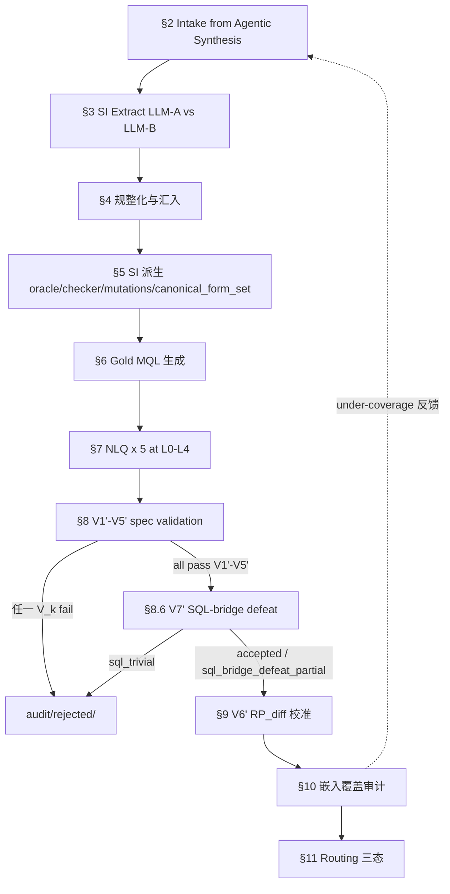

# TEND Dataset Construction Methodology


<a id="04-0"></a>
## §0 摘要：6 大核心原则

本文档定义 TEND benchmark 的 dataset construction SSoT（Single Source of Truth）。整篇文档遵循 6 条相互正交的核心原则，每条对应后续具体可验证约束：

1. **Agentic-single-source intake**：全集库级资产由 [03](./03_database_synthesis.md) Agentic 合成管线唯一产出（schema / world data / business_narrative / noise_plan），本文档从合成产物汇入起接管，详见 [§2](#04-2)；不存在其他来源，不设来源配额。
2. **Structured Intent (SI) DSL** 是 NLQ 与 MQL 之间唯一的 canonical 中间形态，详见 [§3](#04-3)；下游产物（oracle / checker / mutations / canonical_form_set / gold candidate alignment）从 SI 机械派生。
3. **Property-based correctness**：oracle / checker / mutations / canonical_form_set 完全从 SI 自动派生，机械 mutation 全枚举 + property-based 邻域 testing 强证 spec 紧致性，详见 [§5](#04-5) 与 [§8](#04-8) 的 V4'。
4. **Empirical difficulty calibration**：RP_diff 5 frozen 参考模型实测 pass_rate 决定 empirical_difficulty 分桶，详见 [§9](#04-9)；与 V3' / V5' 与 V7' SQL-bridge panel 三方 pairwise disjoint。
5. **Diversity by embedding coverage**：嵌入空间 facility-location 连续覆盖优化决定准入，详见 [§10](#04-10) 与 [§11](#04-11)；9 个覆盖轴含 `T_nosql_nativeness` 与 `T_topology_features`，与 [02 §5](./02_dataset_design.md#02-5) 一致。
6. **NoSQL-native by design**：每条 record 的 SI.nosql_nativeness 声明意图的 NoSQL 原生度（L0–L4，详见 [§3.1](#04-3) 与 [§3.5](#04-3) 附近契约）；V7' SQL-bridge defeat（[§8.6](#04-8)）用独立 panel 对抗准入，阻止 SQL-bridge 能同时通过 EX 与 QIM 的平凡样本进入主集；QIM 指标（[05 §1.8](./05_evaluation_methodology.md#05-1-8)）在评测期作为对 $q_p$ AST 的语法层代理，补充 EX 的语义判定。

任何 record 写入 train.json / test.json 须先通过 V1'-V7'（[§8](#04-8)）并被 V6'（[§9](#04-9)）校准；准入路径 V1'-V5' → V7' → V6'。

**SSoT 边界声明**：本文档不承担"库级合成"。Agentic 合成（schema + world data + business_narrative + noise_plan）由 [03](./03_database_synthesis.md) 定义；本文档从 Agentic 合成产物汇入起接管，承担：候选规整化与一致性校验、SI 抽取、SI 派生 oracle/checker/mutations/canonical_form_set、Gold MQL 选定、NLQ × 5 生成、V1'-V5' 实例级验证、V7' SQL-bridge defeat 对抗准入、V6' 经验难度校准、嵌入覆盖审计、主集/audit/rejected 三态路由。Record 字段名归 [02 §2](./02_dataset_design.md#02-2)；任务正确性 ≡_rec 与归一化契约 NormExec 归 [01 §3](./01_task_definition.md#01-3)、[01 §4](./01_task_definition.md#01-4)、[01 §5](./01_task_definition.md#01-5)；EX / QIM 诊断代理与方法架构归 [05](./05_evaluation_methodology.md)；F_topology 7 特性集合归 [03 §4](./03_database_synthesis.md#03-4)；Noise Taxonomy 36 条归 [03 §A](./03_database_synthesis.md#03-A)。

**Canonical 示例**：以 `orchestra` 库 + `record_id = 99001` + canonical NLQ "For each conductor, attach a total_performances field counting all performances across their orchestras, while preserving the original conductor document structure." 作为示例，库级资产由 [03](./03_database_synthesis.md) Agentic 合成管线产出，端到端贯穿全文（见 [§12](#04-12)）。canonical 示例位于 NoSQL-native level L4，采用 `shape_preserving_augment` pattern。

构造期产生 154 db / 105 domain / 347 collection / 17,020 (NLQ, NoSQL) record pairs；其中 14,245 train / 2,775 test 按 cross-domain 8:2 划分；每条 record 含 5 个 NLQ（共 85,100 NLQ）与 K = 2 个世界。


<a id="04-1"></a>
## §1 流水线总览

### §1.1 流水线 mermaid



规整化与汇入节把 Agentic 合成产物的 schema 形式化、字段命名规范化、一致性校验合并；库级合成职责归 [03](./03_database_synthesis.md)。V7' SQL-bridge defeat 作为对抗增强阶段坐落在 V1'-V5' 与 V6' 之间，仅对 `SI.nosql_nativeness.level ≥ L2` 的候选执行（详见 [§8.6](#04-8)）。

### §1.2 阶段-输入-输出-失败动作表

| 阶段            | 输入                                                              | 输出                                                    | 失败动作                                            |
| ------------- | --------------------------------------------------------------- | ----------------------------------------------------- | ----------------------------------------------- |
| §2 Intake     | Agentic 合成 bundle（schema + world data + business_narrative + noise_plan + complexity_vector + taxonomy_board snapshot） | 汇入候选 (schema, world data, business_narrative, noise_plan) + synthesis_manifest.json | 一致性校验失败（schema↔data / forbidden operator / noise_plan 对齐）→ audit/rejected/ 或反馈 [03](./03_database_synthesis.md) |
| §3 SI Extract | NLQ 候选 / MQL 候选 / business_narrative + schema                   | SI yaml（含 nosql_nativeness + canonical_form_set）+ noise_policies + ≡_SI 校验通过 | LLM-A vs LLM-B 不一致 → 专家复核队列                     |
| §4 规整化与汇入     | 候选 schema / Agentic bundle / noise_plan                         | normalized schema + schema_complexity_profile（10 分量）+ world data | forbidden operators 出现或 schema↔data 不对齐 → 拒收    |
| §5 SI 派生      | SI yaml + pattern 模板库（23 条）+ noise_policies                     | oracle.py / checker.py / mutations.json / canonical_form_set.json | 自洽性自检 fail → 回 [§3](#04-3) 修 SI                 |
| §6 Gold MQL   | SI + reference gold MQL + LLM candidate                         | 选定 gold MQL + idiomatic_score + noise-intent 耦合检查 + canonical_form_set AST_check | candidate alignment 全部 fail 或 noise 耦合漏处理 → 回 SI |
| §7 NLQ × 5    | SI + canonical NLQ                                              | nl_queries[5] + nlq_specificity_levels                | 任一槽位 V3' fail → 改写该槽位                           |
| §8 V1'-V5'    | gold MQL + checker + mutations + 5 NLQ                          | certificate.json（V1'-V5' 字段）                          | 任一 V_k fail → audit/rejected/                   |
| §8.6 V7' SQL-bridge defeat | gold MQL + NLQ + SI.nosql_nativeness                 | sql_bridge_defeat.json（三态：accepted / sql_trivial / sql_bridge_defeat_partial；若 level < L2 额外标 skipped） | sql_trivial → audit/rejected/；configs 不相符 → 中止构造 |
| §9 V6' 校准     | RP_diff 5 模型 + record                                           | empirical_difficulty.json + pass_rate                 | 三方 disjointness check fail → 中止构造                |
| §10 嵌入覆盖      | embed(record) + 已有主集 M                                          | coverage_report.json（9 轴）+ coverage_neighbors          | coverage gain < ε → 进 audit dev pool            |
| §11 Routing   | V1'-V5' / V7' / V6' / coverage 四态                                | train.json / test.json / audit/ / rejected/           | cross-domain 切分冲突 → db_id 整体迁移                  |


<a id="04-2"></a>
## §2 Agentic 合成产物汇入

TEND 的库级资产由 [03](./03_database_synthesis.md) Agentic 合成管线唯一产出；本节承担"从 03 合成产物接管到可供 [§3](#04-3) SI 抽取"的汇入职责，并为 [§10](#04-10) 嵌入覆盖审计的 under-coverage 反馈提供回灌接口。

### §2.1 合成产物接口清单

引用 [03 §10.1](./03_database_synthesis.md#03-10-1) 的 bundle 形态：

- `schema.json`：Agentic 合成的库级 schema（collection / field / type / 嵌套关系），含 F_topology 7 特性标注（见 [03 §4](./03_database_synthesis.md#03-4)）
- `world_0.json` / `world_1.json`：K = 2 个候选世界的完整 document 数据
- `business_narrative.json`：Domain Architect 写下的业务画像与事件流概要
- `noise_plan`：NoisePlan（applied_layers / type_ids / coupling_operators / noise_seed）；applied_layers 取值于 6 层 Noise 枚举
- `complexity_vector.json`：6 维复杂度向量 $\vec{C}$ 实测值
- `taxonomy_board snapshot`：Taxonomy Board 当前快照（含 Stratified Budget Matrix、T_nosql_nativeness 与 T_topology_features 轴的当前分布）

### §2.2 汇入周期与批次

- 从 [03](./03_database_synthesis.md) 的产出中按 `(db_id, record_id)` 维度逐条入 04 流水线
- 一个 batch 对应 [03](./03_database_synthesis.md) Orchestrator 的一个合成周期；batch 边界在 synthesis_manifest.json 中记录
- 每条 `(db_id, record_id)` 独立流经 §3 → §11

### §2.3 入库检查

逐条 record 在进入 §3 前必须通过三项一致性校验，任一不过 → audit/rejected/ 并反馈 [03](./03_database_synthesis.md)：

1. **schema ↔ data 同构**：`world_0` / `world_1` 的所有 collection 与字段必须被 `schema.json` 声明；反向每个非可选 schema 字段在采样 doc 中出现比例符合 sparsity 声明
2. **forbidden operators 不在 gold**：gold MQL 不得出现六件禁用算子 `$sample / $rand / $$NOW / $out / $merge / $function`（此项在 [§6](#04-6) 生成 gold 后复核）
3. **`noise_plan ↔ SI.noise_policies` 对齐**：[03 §10](./03_database_synthesis.md#03-10) 产出的 NoisePlan 必须与 [§3.5](#04-3) SI 的 `noise_policies` 字段字面对齐（applied_layers 集合相等、type_ids 集合相等；coupling_operators 为 [03](./03_database_synthesis.md) 暗示集合的超集）

### §2.4 synthesis_manifest.json 形态

追踪合成运行元数据。形态：

```json
{
  "manifest_version": "construction-frozen",
  "frozen_at": "<ISO8601>",
  "synthesis_runs": [
    {
      "run_id": "<taxonomy-cycle-id>",
      "taxonomy_board_snapshot": "sha256:...",
      "synth_seed": 0,
      "record_count": 0,
      "kept_count": 0,
      "rejection_reasons": {
        "schema_data_mismatch": 0,
        "forbidden_operator_in_gold": 0,
        "noise_plan_misalignment": 0
      }
    }
  ],
  "decoupling_at_test_freeze": true
}
```

写入 `audit/synthesis/synthesis_manifest.json`。

### §2.5 under-coverage 反馈

当 [§10](#04-10) 嵌入覆盖审计识别出 under-coverage 区域（包括 `T_noise_mix` / `T_operator_family` / `T_topology_features` / `T_nosql_nativeness` 轴上的缺口），反馈直接回灌 [03 §4](./03_database_synthesis.md#03-4) 的 Diversity Scheduler 触发定向补合成；Diversity Scheduler 可接收 target level ∈ {L2, L3, L4} 或 target topology feature ∈ F_topology 作为定向参数，更新 Stratified Budget Matrix 后再次产出 bundle，进入下一轮汇入。反馈循环直到 `global_facility_location_coverage` 收敛（连续 3 轮变化幅度 $< 1\%$）。


<a id="04-3"></a>
## §3 Structured Intent (SI) DSL

SI 是 NLQ 与 MQL 之间唯一的 canonical 中间形态。**SI 是构造期内部资产**：发布层 record 主体不携带 SI yaml；SI 通过 `record.structured_intent_ref` 指向 audit/<db_id>/<record_id>/structured_intent.yaml。

### §3.1 DSL 顶层 schema

SI 是结构化 yaml 文档，关键字段：

- `record_id`：与 record 一致
- `db_id`：与 record 一致
- `intent`：对象，含 `pattern`（取自 [§3.2](#04-3) pattern library 的 23 个枚举值）与该 pattern 的全部参数
- `output`：对象，含 `shape` / `length` / `keys` / `types`（部分 shape 使用 pattern 专属的形态描述键，如 `preserve_base` 与 `added_fields`）
- `properties`：列表，每项是一个声明式不变量；每项含 `id` 与 `statement`
- `noise_policies`：对象，声明该 record 所应用的噪声层次与耦合算子（详见 [§3.5](#04-3)）
- `nosql_nativeness`：对象，声明该 record 意图的 NoSQL 原生度等级 + rationale + sql_infeasibility_class（详见 [§3.5](#04-3) 契约与 [§3.6](#04-3) 示例）
- `canonical_form_set`：对象，四个 MQL operator token 集合约束；从 pattern 模板 + SI 参数机械派生（见 [§5.7](#04-5)），供评测层 QIM 指标消费（[05 §1.8](./05_evaluation_methodology.md#05-1-8)）

形式化 grammar 概览：

```
SI                 ::= record_id db_id intent output properties noise_policies nosql_nativeness canonical_form_set
intent             ::= pattern: <enum> + pattern_params
output             ::= shape: <enum> length: <bound> keys: <list> types: <map>
properties         ::= [ { id: <string>, statement: <claim> }, ... ]
noise_policies     ::= applied_layers coupling_operators type_ids noise_seed
nosql_nativeness   ::= { level: enum(L0, L1, L2, L3, L4),
                         rationale: string,
                         sql_infeasibility_class: enum(none, translation_lossy, no_equivalent) }
canonical_form_set ::= { must_contain: list of MQL operator token,
                         must_not_contain: list of MQL operator token,
                         must_contain_at_root: list of MQL operator token,
                         must_not_contain_at_root: list of MQL operator token }
shape              ::= "single_value" | "list_of_records" | "boolean" | "scalar_per_group"
                     | "shape_preserved_augmented" | "nested_with_projected_subtree" | "polymorphic_output"
length             ::= { eq: <int> } | { lte: <int> } | { gte: <int> } | { range: [<int>, <int>] }
```

`shape` 7 值：前 4 值 `single_value / list_of_records / boolean / scalar_per_group` 覆盖 SQL-风格可表达的 flat 输出；后 3 值 `shape_preserved_augmented / nested_with_projected_subtree / polymorphic_output` 覆盖 NoSQL-native 的 shape-preserving / 子树保留 / 多态输出意图。`shape` 控制 checker 的形状断言；`length` 控制基数断言；`keys` / `types` 控制结果列与列类型。`nosql_nativeness` 是构造期声明的意图 NoSQL 原生度标签（五级），与 [§3.5](#04-3) 的 5 级定义对齐；`canonical_form_set` 是从 pattern 模板 + SI 参数机械派生（见 [§5.7](#04-5)）的结构约束集合，供评测层 QIM 指标消费（[05 §1.8](./05_evaluation_methodology.md#05-1-8)）；`noise_policies` 是 SI 与 [03 §10](./03_database_synthesis.md#03-10) NoisePlan 的桥接字段。

### §3.2 intent pattern library

下列 23 个 pattern 覆盖 TEND 的 NoSQL-native 意图空间。每个 pattern 给出参数 schema 与默认 NoSQL-native level：

1. **simple_filter**（level L0）：select documents matching predicate
    - 参数：`collection`, `predicate`, `project_fields`
2. **project_only**（level L0）：project specific fields from documents（无聚合）
    - 参数：`collection`, `project_fields`
3. **group_count**（level L0）：group by key, count members
    - 参数：`collection`, `group.entity`, `group.key_field`, `group.display_fields`
4. **group_aggregate**（level L0）：group by key, aggregate（sum / avg / min / max）
    - 参数：`collection`, `group.{entity, key_field, display_fields}`, `aggregate.{op, target_field, predicate}`
5. **top_k_by_aggregate**（level L0）：top-k after aggregation
    - 参数：`collection`, `group.{entity, key_field, display_fields}`, `aggregate.{op, target_path, predicate}`, `k`, `order.{by, direction, tie_break}`, `scope`
6. **filter_then_aggregate**（level L0）：filter then group/aggregate
    - 参数：`collection`, `pre_filter`, `group`, `aggregate`
7. **lookup_join**（level L1）：cross-collection lookup, then project
    - 参数：`left_collection`, `right_collection`, `local_field`, `foreign_field`, `project_fields`
8. **unwind_then_aggregate**（level L1）：unwind nested arrays, then aggregate
    - 参数：`collection`, `unwind_paths`, `group`, `aggregate`
9. **facet_split**（level L1）：parallel pipelines, return as multi-key result
    - 参数：`collection`, `facets[name → sub_pipeline]`
10. **graph_traverse**（level L1）：`$graphLookup` recursive traversal
    - 参数：`collection`, `start_with`, `connect_from`, `connect_to`, `depth_field`, `max_depth`
11. **window_function**（level L1）：`$setWindowFields`-based windowed computation
    - 参数：`collection`, `partition_by`, `sort_by`, `window_fields[name → spec]`
12. **distinct_count**（level L0）：count distinct values in a field
    - 参数：`collection`, `target_field`, `predicate`
13. **existential**（level L0）：check if any document satisfies condition（boolean output）
    - 参数：`collection`, `predicate`
14. **time_window_aggregate**（level L0）：group by time bucket and aggregate
    - 参数：`collection`, `time_field`, `bucket_unit`, `aggregate`
15. **shape_preserving_augment**（NoSQL-native level L4）：保持输入文档嵌套结构，在根层追加计算字段；**canonical 示例使用此模式**
    - 参数：`collection`, `base_collection`, `augmented_field: {name, computation: {op, source}}`
    - `output.shape = shape_preserved_augmented`
    - idiomatic operators: `$addFields + $map / $reduce`
16. **polymorphic_branch**（level L2）：对 union / discriminator 字段的不同类型走不同分支
    - 参数：`collection`, `discriminator_field`, `branches: [type_value -> sub_logic]`
    - idiomatic operators: `$switch on $type` / discriminator 分支
17. **type_introspection**（level L2）：按 BSON 类型过滤或分组；`$type` 作为投影键 / 分组键
    - 参数：`collection`, `target_field`
18. **dynamic_key_expansion**（level L3）：以数据作为键（dynamic key），用 `$objectToArray` 展开后过滤
    - 参数：`collection`, `dynamic_key_field_path`, `predicate`
    - idiomatic operators: `$objectToArray + $filter`
19. **dynamic_key_aggregate**（level L3）：对动态键空间做聚合
    - 参数：`collection`, `dynamic_key_field_path`, `aggregate: {op, target}`
    - idiomatic operators: `$objectToArray + aggregate on values`
20. **array_positional_select**（level L4）：数组内按位置/谓词选择元素（不展开）
    - 参数：`collection`, `array_path`, `selector: {op, by, direction}`
    - idiomatic operators: `$filter + $arrayElemAt / $reduce`
21. **nested_in_place_aggregate**（level L4）：嵌套数组原位聚合（不 `$unwind`）
    - 参数：`collection`, `nested_array_path`, `aggregate: {op, target}`
    - idiomatic operators: `$map + $sum/$avg`
22. **graph_recursive_deep**（level L4）：`$graphLookup` 递归，`maxDepth ≥ 3`
    - 参数：`collection`, `start_with`, `connect_from`, `connect_to`, `max_depth`
23. **null_vs_missing_disambig**（level L2）：区分 missing / null / 非空值三种空态
    - 参数：`collection`, `target_field`, `distinguish: {missing, null_present, value_present}`
    - idiomatic operators: `$exists + $ifNull + $type`

每个 pattern 在构造侧维护一份 idiomatic MQL 模板（见 [§6.1](#04-6)）、一份 oracle 模板（[§5.2](#04-5)）、一份 canonical_form_set 模板（[§5.7](#04-5)），以及默认 `nosql_nativeness.level`。test 集配额遵守 L2+ ≥ 40% / L4 ≥ 15% 硬约束（见 [02](./02_dataset_design.md)）。

### §3.3 SI 编写双向独立路径

为消除 LLM 单源偏置，SI 由两条独立路径产生，两份结果必须 ≡_SI 一致；不一致 → 进专家复核队列。**LLM-A 与 LLM-B 必须来自不同 vendor**。

| 来源                                               | LLM-A 输入    | LLM-B 输入                                                                                           |
| ------------------------------------------------ | ----------- | -------------------------------------------------------------------------------------------------- |
| Agentic 合成产物（来自 [03](./03_database_synthesis.md)） | NLQ + schema | `business_narrative` + `noise_plan`（来自 [03 §10](./03_database_synthesis.md#03-10)）+ schema          |

LLM-B 以业务叙事与噪声计划作为意图锚定来源；这一设计使 SI 抽取不依赖 gold MQL 的存在，保持 SI 与 gold MQL 之间的独立性。LLM-A 与 LLM-B 与 [§9](#04-9) 的 RP_diff、[§8.6](#04-8) 的 V7' SQL-bridge panel 三方 pairwise disjoint。

### §3.4 ≡_SI canonical 等价

两份 SI A 与 B 满足 $A \equiv_{\mathrm{SI}} B$ 当且仅当：

- 同 `pattern`
- 同参数（按 canonical 形态正则化后比较：参数键字典序排序、enum 取值规范化、path 字符串规范化、数值常量按精度规范化）
- 同 `output` 规约（shape 相等、length 约束等价、keys 集合相等、types 映射相等；shape-preserving 三类下 preserve_base 字符串相等、added_fields 集合相等）
- 同 `properties` 集合（按 statement 等价类比较；statement 等价类由 SI 工具链规范化器给出）
- 同 `noise_policies`（`applied_layers` 集合相等、`type_ids` 集合相等、`coupling_operators` 集合相等；`noise_seed` 不参与等价比较）
- 同 `nosql_nativeness`（三元组按子字段正则化后字面相等：`level` enum 相等、`rationale` 字符串按 canonical 形式归一化后字面相等、`sql_infeasibility_class` enum 相等）
- 同 `canonical_form_set`（四个集合分别作为 multiset 比较：`must_contain` / `must_not_contain` / `must_contain_at_root` / `must_not_contain_at_root` 四组 operator token multiset 均相等）

≡_SI 是构造期闭包等价关系，不参与运行时执行；其唯一作用是 [§3.3](#04-3) 双路径一致性校验与 [§8.3](#04-8) V3' 5 槽位逐槽位校验。

### §3.5 noise_policies 字段语义与 NoSQL-native 5 级定义

`noise_policies` 与 [03 §10](./03_database_synthesis.md#03-10) NoisePlan 字面对齐（同名、同类型、同语义）。字段定义：

| 子字段                  | 类型                                                                             | 语义                                                                                            |
| -------------------- | ------------------------------------------------------------------------------ | --------------------------------------------------------------------------------------------- |
| `applied_layers`     | list of enum in `{Literal, Structural, Semantic, Historical, Pollution, Type-Polymorphism}` | 本 record 应用到的噪声层；6 层与 [03 §5](./03_database_synthesis.md#03-5) Noise Control 对齐               |
| `type_ids`           | list of string                                                                 | 引用 [03 §A](./03_database_synthesis.md#03-A) 附录 Noise Taxonomy 的 36 条 type_id（如 `Structural.sparse_optional_name`、`Type-Polymorphism.tp_union_payment`） |
| `coupling_operators` | list of enum in `{$ifNull, $type, $convert, $exists, $regex, $addFields, $switch, $isNumber, $getField, $toString, $toDecimal, $toInt, $map, $reduce, ...}` | gold MQL 中负责处理该噪声层的"防噪算子"集合；与 [§6.2](#04-6) Noise-Intent 强耦合检查对应                              |
| `noise_seed`         | int                                                                            | 扰动复现所需 seed；写入 audit 以保字节级可重放                                                                 |

第 6 层 Type-Polymorphism 的 6 条 `tp_*` type_id 为：`tp_union_payment` / `tp_numeric_string_mix` / `tp_array_or_scalar` / `tp_nested_vs_flat` / `tp_typed_vs_untyped` / `tp_decimal_vs_double`；其典型 coupling operators 子集包含 `$switch on $type` / `$convert` / `$type` / `$isNumber` / `$getField`。

对每个 `applied_layers` 中的层（含 Type-Polymorphism）至少要求 `type_ids` 中存在一个对应层条目，且 `coupling_operators` 中至少存在一个算子能在 gold MQL 的 AST 中被 $\mathrm{AST\_check}$ 匹配到。该约束在 [§5.5](#04-5) 自洽性自检与 [§8.4](#04-8) V4' 的 `noise_coupling_operator_triggered` property 上被强制。噪声预算 budget 向量为 6 维，对应 6 层的预算上限（由 [03 §5](./03_database_synthesis.md#03-5) 定义）。

**NoSQL-native 5 级定义**（`nosql_nativeness.level` 枚举）：

| level | 语义                                                                                                                        | 典型 pattern                                                                                                                                |
| ----- | ------------------------------------------------------------------------------------------------------------------------- | ---------------------------------------------------------------------------------------------------------------------------------------- |
| L0    | SQL-equivalent：意图可在关系模型下用等价 SQL 表达，MQL 实现是 SQL → MQL 的直译                                                                    | simple_filter / project_only / group_count / group_aggregate / top_k_by_aggregate / filter_then_aggregate / distinct_count / existential / time_window_aggregate |
| L1    | structure-aware：依赖嵌套数组或跨集合 lookup 结构；SQL 需要显式 flatten + join                                                               | lookup_join / unwind_then_aggregate / facet_split / graph_traverse / window_function                                                    |
| L2    | type-aware：涉及类型多态、discriminator 分支或 null/missing/value 空态区分                                                                 | polymorphic_branch / type_introspection / null_vs_missing_disambig                                                                      |
| L3    | schema-dynamic：以数据内容作为 schema 键（dynamic key）；要求运行时反射                                                                        | dynamic_key_expansion / dynamic_key_aggregate                                                                                           |
| L4    | NoSQL-exclusive：意图本质依赖 shape-preserving / 原位嵌套聚合 / 深度递归图遍历；关系型无等价或译后严重失真                                                   | shape_preserving_augment / array_positional_select / nested_in_place_aggregate / graph_recursive_deep                                   |

`sql_infeasibility_class` 枚举：`none`（SQL 有等价表达）/ `translation_lossy`（译后严重失真，例如 shape-preserving 被压平）/ `no_equivalent`（关系模型无原生对应）。test 集配额：L2+ ≥ 40% / L4 ≥ 15%（与 [02](./02_dataset_design.md) 契约一致）。

### §3.6 canonical 示例 SI

audit/orchestra/99001/structured_intent.yaml 内容：

```yaml
record_id: 99001
db_id: orchestra
intent:
  pattern: shape_preserving_augment
  base_collection: conductor
  augmented_field:
    name: total_performances
    computation:
      op: sum
      source:
        map_over: orchestra
        inner_op: array_size
        inner_source: orchestra[].performance
output:
  shape: shape_preserved_augmented
  preserve_base: conductor
  added_fields: [total_performances]
  types:
    total_performances: int_nonneg
properties:
  - id: shape_fidelity
    statement: |output| = |conductor| AND each output doc tree is isomorphic to input with one added top-level key
  - id: value_accuracy
    statement: total_performances[c] = sum over c.orchestra[] of |c.orchestra[].performance[]|
  - id: sparse_name_safe
    statement: null/missing Name fields do not raise errors and are propagated as $ifNull result
noise_policies:
  applied_layers: [Structural]
  type_ids:
    - "Structural.sparse_optional_name"
  coupling_operators:
    - "$ifNull"
  noise_seed: 42
nosql_nativeness:
  level: L4
  rationale: output must preserve the conductor document tree including embedded orchestra/performance/show arrays; no root-level unwind or group is permitted; in-place $map over embedded array is required
  sql_infeasibility_class: translation_lossy
canonical_form_set:
  must_contain: ["$addFields", "$map"]
  must_not_contain: []
  must_contain_at_root: ["$addFields"]
  must_not_contain_at_root: ["$unwind", "$group"]
```


<a id="04-4"></a>
## §4 规整化与汇入

本节承担"从 Agentic 合成产物接管到可供 SI 派生的 normalized schema + canonical world"职责。库级结构合成职责归 [03](./03_database_synthesis.md)。

### §4.1 来源归一化

Agentic 合成产物入库前统一做：

- 字段命名风格归一（snake_case vs camelCase 统一到文档保留原 casing、但抽象形态在 SI 端 canonical 化）
- 类型推断复核（与 schema 声明不一致的少数样本进 type_drift 候选）
- schema 指纹去重（collection-field-type 三元组指纹）
- 剥除合成期临时调试字段（仅保留 [03](./03_database_synthesis.md) 声明的 canonical 字段集）

### §4.3 Agentic 合成 bundle 汇入

直接接收 [03](./03_database_synthesis.md) Agentic 合成管线的产出 bundle：

```
(schema, world data, business_narrative, noise_plan)
```

本文档**不在**本地合成 schema 或数据；仅做三项一致性校验（与 [§2.3](#04-2) 的入库检查同源，[§4.3](#04-4) 侧重在 schema_complexity_profile 与 world_signature 计算后复核三项约束字面保持）：

1. **schema ↔ data 同构**：`world_0` / `world_1` 的所有 collection 与字段必须被 `schema.json` 声明；反向每个非可选 schema 字段在采样 doc 中出现比例符合 schema 的 sparsity 声明
2. **forbidden operators 不出现在 gold**：[§6](#04-6) 的 gold MQL 不得出现六件禁用算子 `$sample / $rand / $$NOW / $out / $merge / $function`
3. **noise_plan ↔ noise_policies 对齐**：[03 §10](./03_database_synthesis.md#03-10) 产出的 NoisePlan 必须与 SI 的 `noise_policies` 字段字面对齐（`applied_layers` 集合相等、`type_ids` 集合相等；`coupling_operators` 为 [03](./03_database_synthesis.md) 暗示集合的超集）

business_narrative 在该阶段仅作为 [§3.3](#04-3) LLM-B 的锚定输入，不写入发布层 record；仅写入 audit/<db_id>/<record_id>/business_narrative.json。

### §4.4 schema_complexity_profile

10 分量度量，写入 `record.schema_complexity_profile` 字段：

- `normalized_ratio`：1 减去（嵌入字段总数 / 全部字段总数），刻画 schema 的"非嵌入度"，$\in [0, 1]$
- `max_embed_depth`：最大嵌套层数（root collection 的根字段为深度 0；每多一层 `[]` 或子文档深度 +1）
- `polymorphism_rate`：注入了 polymorphism 的 collection 占总 collection 数的比例，$\in [0, 1]$
- `sparsity_rate`：注入了 sparsity 的字段占可注入字段总数的比例，$\in [0, 1]$
- `type_drift_count`：注入了 type_drift 的字段总数
- `dynamic_key_count`：注入了 dynamic_key 的字段总数
- `cross_collection_ref_count`：跨 collection 引用关系数（含 `$lookup` 触发关系）
- `polymorphic_collection_count`：被注入 F_topology 的 `polymorphic_collection` 特性的 collection 数
- `mixed_embed_ref_count`：同时使用嵌入与跨集合引用的 collection 数（F_topology 的 `mixed_embed_ref` 特性）
- `sparse_embedded_rate`：被注入 F_topology 的 `sparse_embedded` 特性的嵌入子文档占可注入子文档总数的比例，$\in [0, 1]$

10 分量联合覆盖 F_topology 7 特性（`flat` / `nested_N_deep` / `polymorphic_collection` / `dynamic_key_document` / `sparse_embedded` / `mixed_embed_ref` / `intentional_denormalization`）的结构性刻画（见 [03 §4](./03_database_synthesis.md#03-4)）。

### §4.5 最小 doc 数按 difficulty 分层

由 [03](./03_database_synthesis.md) Business Simulator 在合成期保证；本节仅验收而不扩充。

| target_difficulty | root collection 最小 doc 数 | 嵌入数组平均长度下界 | F_topology 特性采样下限（每 record 命中不同特性数） |
| ----------------- | ------------------------ | ---------- | ------------------------------ |
| easy              | 50                       | 3          | 1                              |
| medium            | 500                      | 8          | 2                              |
| hard              | 5,000                    | 20         | 3                              |
| expert            | 50,000                   | 50         | 4+                             |

### §4.6 K = 2 个世界

每个 record 对应 K = 2 个世界：1 个 canonical world + 1 个 property-preserving perturbed world。**发布层 mongodb_data/<db_id>/<record_id>.json 永远只承载 canonical world 一份**；perturbed 世界存于 audit/<db_id>/<record_id>/world_variants/w1_perturbed.json，仅 audit 用途。

perturbation 轴（property-preserving，扰动后所有 SI properties 仍被 gold 满足、所有 mutations 仍被拒绝；8 条）：

- **size scaling**（×2 或 ×0.5）：root collection 数量按比例缩放；嵌入数组同步缩放
- **sparsity rate** 在 [10%, 90%] 范围内变化
- **边界分布**：数值 / 时间字段在 gold predicate 阈值附近的密度可调
- **tie 模式**：排序型 intent 严格保持 top-k 边界无 tie
- **polymorphism 各 discriminator 子集占比**变化
- **type drift 各类型实际占比**变化
- **noise layer intensity**：在 `noise_policies.applied_layers` 中每层的强度可在允许区间内扰动
- **noise type 6 层覆盖率**：6 层噪声（Literal / Structural / Semantic / Historical / Pollution / Type-Polymorphism）在该世界上每层是否可达至少 1 次的布尔覆盖向量；候选世界必须保证 `applied_layers` 声明的每一层至少可达 1 次

candidate world 集合 $\geq K' \geq 4$，按以下标准择优为 canonical world（7 条）：

1. **spec-pass 必要条件**：候选世界必须先通过 V1'（gold 在该世界结果通过 checker）
2. **判别力评分**：在 [§8](#04-8) V4' 的 mechanical mutation 集合上跑该世界，违反 spec 的比率越高分越高
3. **边界紧致性**：gold predicate 的边界 ε 邻域内文档数 $\geq 1$ 且 $\leq k_\text{boundary}$（默认 5）
4. **tie 严格性**：排序型 intent 在 top-k 边界上严格无 tie
5. **长尾 polymorphism 子集出现 $\geq 1$ 次**（当 schema 注入 polymorphism 时）
6. **噪声耦合可达**：`noise_policies.applied_layers` 中每一层在该世界上至少触发一次 coupling operator 分支
7. **shape-preserving 严格性**：对 `SI.output.shape ∈ {shape_preserved_augmented, nested_with_projected_subtree, polymorphic_output}` 的意图，候选世界上的输入→输出文档树必须严格同构（除 `added_fields` 外），根层不出现 `$unwind` 或 `$group` 所诱导的压平形态

打平时按 world_id 字典序选最小者。

### §4.7 world_signature 计算

$$
\text{canonical\_world} := \{\text{collection\_name} : \text{sorted\_by\_id}([\text{canonical\_json}(\text{doc}) \mid \text{doc} \in \text{collection}])\}
$$

$$
\text{world\_signature} := \texttt{"sha256:"} + \text{hex}(\text{SHA256}(\text{canonical\_json}(\text{canonical\_world})))
$$

其中 `canonical_json` 指 RFC 8785 风格稳定序列化（key 按字典序、数值按规范十进制、字符串按 UTF-8 NFC、数组保持元素顺序）。deterministic seed $(db\_id, record\_id, world\_id, \text{noise\_seed})$ 完全决定 world，同一四元组重跑产生字节级一致快照。


<a id="04-5"></a>
## §5 SI 自动派生 oracle / checker / mutations / canonical_form_set

### §5.1 派生原则

oracle / checker / mutations / canonical_form_set 四件套**完全机械**派生于 SI yaml + pattern 模板库；**不引入 LLM 自由度**，从而保证 gold 真值与 LLM 推理路径独立。canonical_form_set 也从 pattern 模板 + SI 参数机械派生（见 [§5.7](#04-5)），不引入 LLM 自由度。下游 V1'-V4' 的所有判断都站在这条独立性之上。

### §5.2 oracle.py 自动生成

- 每个 [§3.2](#04-3) 的 pattern 对应一个固定 oracle 模板（Python 函数）
- pattern 模板 + SI 参数 → 可执行 oracle.py
- oracle 是纯函数：输入 `(world_data)` 返回 expected_result
- oracle 不依赖任何 MQL 执行路径

`top_k_by_aggregate` 模式 oracle 模板示例：

```python
from collections import Counter

def oracle(world_data):
    counts = Counter()
    names = {}
    for c in world_data["conductor"]:
        cid = c["Conductor_ID"]
        names[cid] = c.get("Name") or "(unknown)"
        for orch in c.get("orchestra", []):
            for perf in orch.get("performance", []):
                counts[cid] += 1
    ranked = sorted(
        counts.items(),
        key=lambda kv: (-kv[1], kv[0])
    )[:3]
    return [{"Name": names[cid], "performance_count": cnt} for cid, cnt in ranked]
```

`shape_preserving_augment` 模式 oracle 模板示例（以 canonical orchestra/99001 SI 实例化）：

```python
def oracle(world_data):
    out = []
    for c in world_data["conductor"]:
        total = 0
        for orch in (c.get("orchestra") or []):
            perfs = orch.get("performance") or []
            total += len(perfs)
        augmented = dict(c)
        augmented["total_performances"] = total
        out.append(augmented)
    return out
```

shape-preserving 模板的两个不变量：

- `augmented = dict(c)` 完整拷贝原文档，再在根层加 `total_performances`；这是 oracle 侧的 shape-fidelity 实现
- `(c.get("orchestra") or [])` 与 `(orch.get("performance") or [])` 体现 `$ifNull` coupling on `conductor.orchestra` 与 `orchestra.performance`，对应 `noise_policies.applied_layers = [Structural]` 中 `Structural.sparse_optional_name` 层的 oracle-side coupling

每个 pattern 对应一个固定 oracle 模板；shape_preserving 模板额外保留输入文档完整拷贝而非只投影选定字段。

### §5.3 checker.py 自动生成

- `output.shape` / `output.length` / `output.keys` / `output.types` → 类型 / 形状断言
- `properties` 列表 → property-based assertions（每条 property 转一段 Python assertion）
- checker 内部调用 oracle.py 比较语义一致性

`top_k_by_aggregate` 模式 checker.py 片段：

```python
from .oracle import oracle

def check(actual_result, world_data):
    expected = oracle(world_data)

    assert isinstance(actual_result, list), "shape: list_of_records"
    assert len(actual_result) == 3, "length: eq 3"
    for row in actual_result:
        assert set(row.keys()) == {"Name", "performance_count"}, "keys"
        assert isinstance(row["Name"], str), "types.Name"
        assert isinstance(row["performance_count"], int) and row["performance_count"] >= 0, \
            "types.performance_count: int_nonneg"

    counts = [r["performance_count"] for r in actual_result]
    assert counts == sorted(counts, reverse=True), "monotonic_in_count"

    assert len(actual_result) == min(3, _distinct_conductor_count(world_data)), \
        "cardinality_bound"

    if _has_rank4(world_data):
        assert actual_result[2]["performance_count"] > _rank4_count(world_data), \
            "order_strict_at_boundary"

    return _Verdict(accept=True, evidence={"oracle_match": actual_result == expected})
```

`shape_preserving_augment` 模式 checker.py 专用断言段（以 canonical orchestra/99001 SI 实例化）：

```python
from .oracle import oracle

def check(actual_result, world_data):
    expected = oracle(world_data)
    assert isinstance(actual_result, list)
    assert len(actual_result) == len(world_data["conductor"]), "shape: cardinality preserved"
    for row_actual, row_input in zip(actual_result, world_data["conductor"]):
        assert preserves_document_tree(row_input, row_actual, added_fields={"total_performances"}), \
            "shape: input tree preserved + added fields only"
        assert isinstance(row_actual["total_performances"], int) and row_actual["total_performances"] >= 0
    assert actual_result == expected, "value accuracy"
    return _Verdict(accept=True)
```

`preserves_document_tree(input, actual, added_fields)` 是 checker 库提供的结构级算子：

- 对 input 的每个键 / 子树在 actual 中严格存在且值递归相等
- actual 相对 input 多出的键必须全部落在 `added_fields` 集合内
- 嵌套子文档与数组递归比较；数组元素顺序保持

### §5.4 mutations.json 机械生成

每个 SI 参数有对应 mutation operator。mutation operator 分四类：

**A. intent 参数维度**（以 `top_k_by_aggregate` pattern 为例，部分）：

| SI 参数                        | mutation operator                                           | 说明                      |
| ---------------------------- | ----------------------------------------------------------- | ----------------------- |
| intent.k                     | k±1                                                         | cardinality mutation    |
| intent.order.direction       | desc → asc                                                  | sort direction mutation |
| intent.aggregate.op          | count → sum / avg / min / max                               | 同类替换                    |
| intent.aggregate.target_path | conductor.orchestra[].performance[] → conductor.orchestra[] | 邻近 path                 |
| intent.aggregate.predicate   | null → 注入新 predicate；non-null → 取反                          | predicate mutation      |
| intent.scope                 | all ↔ filtered                                              | scope mutation          |
| intent.group.key_field       | Conductor_ID ↔ Name                                         | 显示字段 vs 稳定 ID 互换        |
| intent.group.display_fields  | [Name] → [Name, Country]                                    | 列扩张                     |
| output.length                | eq 3 → eq 5                                                 | 基数 mutation             |

**B. output shape 维度**：shape 在 7 值枚举 `{single_value, list_of_records, boolean, scalar_per_group, shape_preserved_augmented, nested_with_projected_subtree, polymorphic_output}` 中做邻近替换。

**C. noise_policies 维度**（对每个 `applied_layers[j]` 派生至少 3 条 mutation）：

| noise_policies 子字段 | mutation operator                                                                                              | 期望结果                   |
| ------------------ | -------------------------------------------------------------------------------------------------------------- | ---------------------- |
| coupling_operators | 去掉某个 coupling_operator（让 gold 在 missing / type-drift / type-polymorphism 分支上抛 null 或 type error）               | reject                 |
| coupling_operators | 改为错误的 coupling_operator（如 `$ifNull` → `$toString`）                                                           | reject                 |
| type_ids           | 改为相邻噪声 type_id（如 `Structural.sparse_optional_name` → `Structural.unknown_union_variant`）                    | reject                 |

**D. canonical_form_set 维度**（对每条 `must_contain` / `must_contain_at_root` / `must_not_contain` / `must_not_contain_at_root` 中的条目派生对抗）：

| canonical_form_set 子字段      | mutation operator                                                                 | 期望结果                   |
| --------------------------- | --------------------------------------------------------------------------------- | ---------------------- |
| must_contain                | 从 gold 中去掉某个 must_contain 的操作符，让 gold 在该结构上退化                                    | reject                 |
| must_not_contain_at_root    | 向根层插入 must_not_contain_at_root 中的操作符                                              | reject                 |
| must_contain_at_root        | 把根层的 `$addFields` 改为 `$project`                                                  | reject                 |
| must_contain / shape        | 把 `$map` 改写为 `$unwind + $group` 合并回根（展开后压平，违反 shape-preserving）                   | reject                 |

每条 mutation 含：

```json
{
  "mutation_id": "<string>",
  "parameter": "<dotted-path-into-SI>",
  "original_value": "<JSON>",
  "mutated_value": "<JSON>",
  "mutated_MQL": "<MQL string>",
  "expected_outcome": "reject"
}
```

mutated_MQL 由对应 pattern 模板 + 替换后的参数机械生成（与 reference gold MQL 同源，仅在变异位置不同）。noise 维度 mutation 在噪声耦合位置作修改；canonical_form_set 维度 mutation 在 AST 根层或 operator token 集合上作修改。

### §5.5 自洽性自检

V1'-V5' 进入前必须先过自检：

1. gold MQL 在 canonical world 上 → checker.accept
2. $\geq 3$ 条已知 mutation → checker.reject
3. oracle 输出 $\equiv_\text{rec}$ gold MQL 在 canonical world 上的输出（按 [01 §5](./01_task_definition.md#01-5) 的 ≡_rec）
4. **noise-coupled 变异全部 reject**：对 `noise_policies.applied_layers` 中每一层，C 类 mutation 全集都必须被 checker 拒绝
5. **canonical_form_set 自洽**：$\mathrm{AST\_check}(\mathrm{Parse}(q_g), \mathrm{canonical\_form\_set}(q_g)) = \text{pass}$，即 gold MQL AST 自身满足声明的 canonical_form_set 约束

自检不通过则 SI 错误，回 [§3](#04-3) 修 SI。

### §5.6 canonical 示例派生资产

audit/orchestra/99001/derived/ 下：

- `oracle.py`：函数签名 `def oracle(world_data) -> list[dict]`，核心计算见 [§5.2](#04-5) 的 shape_preserving 模板
- `checker.py`：函数签名 `def check(actual_result, world_data) -> Verdict`，关键断言见 [§5.3](#04-5) 的 shape_preserving 断言段
- `canonical_form_set.json`：`must_contain: ["$addFields","$map"]` / `must_not_contain: []` / `must_contain_at_root: ["$addFields"]` / `must_not_contain_at_root: ["$unwind","$group"]`
- `mutations.json`：约 35 条 mutation 条目（含 3 条 noise 维度 + 3 条 canonical_form_set 维度 + 若干 shape-preserving 专属变异），示例：

```json
[
  { "mutation_id": "M01_drop_ifnull_outer",
    "parameter": "gold_mql.addFields.$map.input",
    "original_value": "{ $ifNull: [\"$orchestra\", []] }",
    "mutated_value": "\"$orchestra\"",
    "mutated_MQL": "...",
    "expected_outcome": "reject" },
  { "mutation_id": "M02_drop_ifnull_inner",
    "parameter": "gold_mql.addFields.$map.in",
    "original_value": "{ $size: { $ifNull: [\"$$orch.performance\", []] } }",
    "mutated_value": "{ $size: \"$$orch.performance\" }",
    "mutated_MQL": "...",
    "expected_outcome": "reject" },
  { "mutation_id": "M03_replace_sum_with_avg",
    "parameter": "gold_mql.addFields.total_performances",
    "original_value": "$sum",
    "mutated_value": "$avg",
    "mutated_MQL": "...",
    "expected_outcome": "reject" },
  { "mutation_id": "M04_project_instead_of_addFields",
    "parameter": "root_stage",
    "original_value": "$addFields",
    "mutated_value": "$project",
    "mutated_MQL": "...",
    "expected_outcome": "reject (shape violation: drops unselected subtree)" },
  { "mutation_id": "M05_flatten_via_unwind_group",
    "parameter": "root_pipeline",
    "original_value": "[{ $addFields: ... }]",
    "mutated_value": "[{ $unwind: \"$orchestra\" }, { $unwind: \"$orchestra.performance\" }, { $group: { _id: \"$_id\", ..., total_performances: { $sum: 1 } } }]",
    "mutated_MQL": "...",
    "expected_outcome": "reject (shape violation)" },
  { "mutation_id": "M33_noise_drop_ifnull",
    "parameter": "noise_policies.coupling_operators",
    "original_value": ["$ifNull"],
    "mutated_value": [],
    "mutated_MQL": "...",
    "expected_outcome": "reject" },
  { "mutation_id": "M34_noise_wrong_coupler",
    "parameter": "noise_policies.coupling_operators",
    "original_value": ["$ifNull"],
    "mutated_value": ["$toString"],
    "mutated_MQL": "...",
    "expected_outcome": "reject" },
  { "mutation_id": "M35_canonical_form_remove_map",
    "parameter": "canonical_form_set.must_contain",
    "original_value": ["$addFields","$map"],
    "mutated_value": ["$addFields"],
    "mutated_MQL": "[... $addFields without $map, e.g. using $reduce only ...]",
    "expected_outcome": "reject" }
]
```

### §5.7 canonical_form_set 机械派生规则

每个 [§3.2](#04-3) pattern 在构造侧维护一份 canonical_form_set 模板；模板从 pattern 语义派生出四个集合：

- `must_contain`：该 pattern 的 idiomatic 算子（如 `shape_preserving_augment → ["$addFields", "$map"]`；`polymorphic_branch → ["$switch"]`；`dynamic_key_expansion → ["$objectToArray"]`；`graph_recursive_deep → ["$graphLookup"]`；`null_vs_missing_disambig → ["$ifNull", "$exists"]`）
- `must_not_contain`：该 pattern 不允许出现的算子（通常为空；或当 pattern 是 in-place shape-preserving 时含 `["$unwind"]`）
- `must_contain_at_root`：根 pipeline 层必含的算子（如 shape-preserving 要求 `$addFields` 在根层；dynamic_key_aggregate 要求 `$addFields` 或 `$project` 在根层）
- `must_not_contain_at_root`：根层不许出现的算子（shape-preserving 禁 `$unwind` 与 `$group` 在根）

$\mathrm{AST\_check}(\mathrm{Parse}(q), C)$ 判定：

- Parse q 得 AST；提取 q 中出现的所有 operator token 集合 $T_q$ 与根层操作符序列 $T_q^{\text{root}}$
- $C.\text{must\_contain} \subseteq T_q$
- $T_q \cap C.\text{must\_not\_contain} = \varnothing$
- $C.\text{must\_contain\_at\_root} \subseteq T_q^{\text{root}}$
- $T_q^{\text{root}} \cap C.\text{must\_not\_contain\_at\_root} = \varnothing$
- 全部满足则 pass；任一不满足则 fail，$\mathrm{AST\_check}$ 返回 fail + 不匹配原因列表（如 `"must_contain: $addFields not found"`、`"must_not_contain_at_root: $unwind appears at root"`）

派生结果以 JSON 文件写入 `audit/<db_id>/<record_id>/derived/canonical_form_set.json`（[02 §1.1](./02_dataset_design.md#02-1) 登记）。


<a id="04-6"></a>
## §6 Gold MQL 生成

### §6.1 SI → reference gold MQL

每个 [§3.2](#04-3) pattern 在构造侧维护 idiomatic MQL 模板 + canonical_form_set 模板；pattern 模板 + SI 参数 → reference gold MQL（机械生成，不依赖 LLM）。reference_gold 是 [§6.2](#04-6) candidate alignment 的语义锚，同时被 canonical_form_set AST_check 硬校验。

### §6.2 LLM candidate alignment、Noise-Intent 强耦合检查与 canonical_form_set 硬阈值

- $\geq 3$ 跨 vendor LLM：从 SI + schema + sample data → 写 MQL candidate
- 全部 candidate 必须满足：

$$
\text{NormExec}(\text{candidate}, \text{canonical\_world}) \equiv_{\mathrm{rec}} \text{NormExec}(\text{reference\_gold}, \text{canonical\_world})
$$

按 [01 §5](./01_task_definition.md#01-5) 的 ≡_rec 与 NormExec 契约。

- 通过的 candidate → idiomatic candidate set
- 最终 gold MQL：从 idiomatic candidate set 中按 [§6.3](#04-6) 的 stylistic 偏好挑选
- candidate alignment 全部 fail → 回 [§3](#04-3) 修 SI

**Noise-Intent 强耦合检查（硬阈值，失败直接判 V4' fail）**：

$$
\forall \ell \in \text{noise\_policies.applied\_layers} \cup \{\texttt{Type-Polymorphism}\}: \quad \exists \text{op} \in \text{noise\_policies.coupling\_operators} \text{ s.t. op 显式出现在 gold MQL 的 AST 中}
$$

即 gold MQL 必须显式处理 `applied_layers` 中的每一层。该检查在 [§8.4](#04-8) V4' 的 `noise_coupling_operator_triggered` property 上作为逐层断言。第 6 层 Type-Polymorphism 的典型 op 为 `$switch on $type` / `$convert` / `$type` / `$isNumber` / `$getField`。

**canonical_form_set 硬阈值检查（同样是硬阈值，失败直接回 SI 修 canonical_form_set 或重写 gold）**：

$$
\mathrm{AST\_check}(\mathrm{Parse}(q_g), \mathrm{canonical\_form\_set}(q_g)) = \text{pass}
$$

该检查把 [§5.7](#04-5) 机械派生的 canonical_form_set 作用于 gold MQL 的 AST，要求根层与全体 token 集合四条约束全部满足；失败说明 gold 写法与 pattern idiomatic 形态不一致，需要回 SI 修或重写 gold。

### §6.3 stylistic 偏好清单

用于从 candidate set 选 gold；不作为硬阈值：

- 优先使用 aggregation pipeline（而非链式 `find().sort().limit()`）
- 善用 `$unwind` / `$lookup with pipeline` / `$group` / `$facet` / `$graphLookup` / `$setWindowFields` / `$objectToArray`
- 单 collection 查询尽量不用 `$lookup`（嵌入字段直接 `$unwind` 或 `$map`）
- 输出键命名按 NLQ 自然名（如 `Name`、`performance_count`、`total_performances`）
- 谓词下推（`$match` 前置；`$lookup` 内部用 pipeline 形式过滤）
- 禁用六件算子：`$sample / $rand / $$NOW / $out / $merge / $function` 在 gold 中全集禁止出现（[§4.3](#04-4)）
- 对 shape_preserving 意图优先 `$addFields + $map / $reduce` 而非 `$unwind + $group`（后者会压平嵌套结构，违反 shape-preserving）
- 对 polymorphic_branch 优先 `$switch on $type` 而非 `$cond` 长链
- 对 dynamic key 意图使用 `$objectToArray` 而非硬编码字段路径
- 对 graph_recursive_deep 使用 `$graphLookup maxDepth` 而非多重嵌套 `$lookup`

### §6.4 idiomatic_score

写入 `record.idiomatic_score` 字段；保留作为描述性度量；**不作为准入硬阈值**：

$$
\text{idiomatic\_score} = 0.4 \cdot \mathbb{1}[\text{uses\_aggregation}] + 0.2 \cdot \min\left(\frac{\text{unwind\_depth}}{\text{max\_embed\_depth}},\ 1\right) + 0.2 \cdot \mathbb{1}[\text{uses\_native\_operator}] + 0.2 \cdot (1 - \text{sql\_translator\_artifact\_rate})
$$

各分量定义：

- `uses_aggregation`：是否使用 `db.coll.aggregate([...])` 形式
- `unwind_depth`：gold MQL 中 `$unwind` 阶段数（shape-preserving 意图下该项为 0；由第三项 `uses_native_operator` 与 `$map / $reduce / $addFields` 补齐 idiomatic）
- `max_embed_depth`：来自 `schema_complexity_profile.max_embed_depth`
- `uses_native_operator`：是否至少使用一个 NoSQL-native operator，native 列表为 `{$unwind, $lookup, $facet, $objectToArray, $graphLookup, $setWindowFields, $ifNull, $type, $convert, $addFields, $map, $reduce, $switch, $arrayElemAt, $filter, $getField, $isNumber}`
- `sql_translator_artifact_rate`：候选中带有 SQL→MQL 翻译痕迹的阶段占比

该度量是事后描述性指标。canonical 示例（shape_preserving_augment）的 idiomatic_score = 0.92。

### §6.5 canonical 示例 gold MQL

reference_gold 由 `shape_preserving_augment` pattern 模板 + canonical SI 参数派生；3 个跨 vendor LLM candidate 全部 ≡_rec reference_gold；选定 gold 为 `$addFields + $map + $ifNull + $size + $sum` 管道，内嵌 `$ifNull` 耦合 `noise_policies.applied_layers = [Structural]`：

```javascript
db.conductor.aggregate([
  { $addFields: {
      total_performances: {
        $sum: {
          $map: {
            input: { $ifNull: ["$orchestra", []] },
            as: "orch",
            in: { $size: { $ifNull: ["$$orch.performance", []] } }
          }
        }
      }
  } }
]);
```

- `operator_family = "shape_preserving_augment"`
- Noise-Intent 耦合检查通过：`$ifNull` 显式处理 `Structural.sparse_optional_name`
- canonical_form_set AST_check 通过：根层含 `$addFields`，全体 token 集合含 `{$addFields, $map}`，根层不含 `{$unwind, $group}`，`must_not_contain = ∅`
- `idiomatic_score = 0.92`


<a id="04-7"></a>
## §7 NLQ × 5 at L0-L4 specificity

### §7.1 5 层判据

| 层级                           | 判据                                                           | canonical 示例                                                                                                                        |
| ---------------------------- | ------------------------------------------------------------ | ----------------------------------------------------------------------------------------------------------------------------------- |
| L0 underspecified            | NLQ 中关键操作 / 目标字段 / 计算口径至少缺一项需依赖默认；句长短，业务暗示明显                 | `"Add performance totals to conductors."`                                                                                           |
| L1 schema_naive              | 业务用户口吻；显式给出目标计算与结构约束；不暴露 schema 字段名或嵌套关系；canonical 槽位        | `"For each conductor, attach a total_performances field counting all performances across their orchestras, while preserving the original conductor document structure."` |
| L2 schema_aware              | 提及 schema 中具体集合名 / 字段名 / 嵌套关系                                | `"For each conductor document in the conductor collection, add a field total_performances equal to the total count of entries in the embedded orchestra.performance arrays, without flattening the document."` |
| L3 nosql_jargon              | 含 document / embedded / collection / nested array 等 NoSQL 术语 | `"For each conductor document, augment with a top-level total_performances field aggregating the sizes of nested performance arrays; preserve the embedded orchestra-performance-show array structure."` |
| L4 multilingual / colloquial | 跨语言（中文 / 日文 / 西文等）或口语化                                       | `"在每位指挥家的文档上附加 total_performances 字段，记录其旗下所有乐团的演出总数，并保持原文档的嵌套结构不变。"`                                                                 |

### §7.2 canonical 槽位映射

- `nl_queries[0]` 永远是 L1 canonical（这是数据集全局不变量）
- 其余 4 槽位的层级映射写入 `record.nlq_specificity_levels`
- 默认映射 `["L1", "L0", "L2", "L3", "L4"]`
- 允许 cell 级 override，但**必须保持** `{L0, L1, L2, L3, L4}` 排列约束（5 层各出现且仅出现一次）

### §7.3 多语言配额机制

语言轴在事后描述符 `tds_cell` 中体现；`record.nlq_specificity_levels[i] == "L4"` 的槽位的语种归 record 自身，audit 中记录语种标签（`lang_tag ∈ {zh, ja, es, fr, de, ...}`）。多语种在 L4 槽位均匀采样，避免单语种主导。

### §7.4 V3' 槽位独立校验

每条 NLQ 独立通过 V3'（[§8.3](#04-8) 的 SI 一致性按 5 槽位逐槽位校验）。任一槽位反复失败 → 反馈 [§2](#04-2) 触发该 cell 的 intent 替换。"反复失败"定义为：3 次 NLQ 改写后仍 V3' fail 的同一槽位。


<a id="04-8"></a>
## §8 Spec-grounded validation V1'-V7'

V1'-V7' 是构造侧的唯一**实例级**验证框架。V1'-V7' 共同操作化 [01 §6](./01_task_definition.md#01-6) 的 P1-P4 instance correctness root principles：

- V1' + V2' 操作 P1（spec-anchored correctness with K=2 world rigor）
- V3' 操作 P2（NLQ 语义唯一性）
- V4' 操作 P3（near-miss 判别力 + 噪声耦合紧致性 + canonical_form_set 结构紧致性）
- V5' 操作元正确性（人审 anchor 锚定 LLM 驱动管线）
- V7' 操作 P3 的对抗增强（SQL-bridge defeat：独立 NL2SQL + sqltomongo 组合作为攻击面，过滤能同时通过 EX 与 QIM 的平凡样本）
- P4（世界非平凡）由 [§4.6](#04-4) canonical world 选择标准与 V4' 邻域 testing 共同保证

每条 record 的证书写到 audit/<db_id>/<record_id>/certificate.json。

### §8.1 V1' Spec correctness

```
R := NormExec(gold_MQL, canonical_world)
assert checker.check(R, canonical_world).accept
```

其中 checker 是 [§5](#04-5) 自动派生的 checker.py。失败回 [§6](#04-6) 重写 gold 或回 [§3](#04-3) 修 SI。

### §8.2 V2' Perturbation robustness

```
forall world_k in {canonical_world, K-1 perturbed worlds}:  # K = 2
    R_k := NormExec(gold_MQL, world_k)
    assert checker.check(R_k, world_k).accept
```

任一世界 spec-fail → 回 [§6](#04-6) 重写或回 [§4.6](#04-4) 重生成扰动世界。V2' 的扰动结果详情写入 audit/<db_id>/<record_id>/world_robustness.json。

### §8.3 V3' SI consistency（每槽位）

```
forall slot i in 0..4:
    candidates_i := [LLM_j.parse(nl_queries[i] -> SI) for j in 1..N], N >= 3, vendor_count >= 2
    forall pair (a, b): assert candidates_i[a] ≡_SI candidates_i[b]
```

≡_SI 见 [§3.4](#04-3)。要点：

- **vendor_count $\geq 2$**：避免单 vendor 系统性偏好把假共识判为真共识
- 比较是在 canonical SI 形态上做（含 nosql_nativeness 与 canonical_form_set 字段），**不在 NormExec 结果上做**
- 任一对不一致 → NLQ 在该槽位有歧义 → 改写该槽位或回 [§3](#04-3) 改 SI
- 使用的 LLM vendor 必须与 [§9](#04-9) 的 RP_diff 以及 [§8.6](#04-8) 的 V7' SQL-bridge panel 三方 pairwise disjoint（disjointness 在 manifest 启动时检查）

### §8.4 V4' Mechanical mutation 全枚举 + property-based 邻域 testing

**A 部分（mechanical mutation 全枚举）**：

```
mutation_set := mutations.json 全枚举（§5.4 派生，含 intent / output / noise_policies / canonical_form_set 四维）
forall m in mutation_set:
    R_m := NormExec(m.mutated_MQL, canonical_world)
    assert not checker.check(R_m, canonical_world).accept
```

**B 部分（property-based 邻域 testing）**：

```
properties := SI.properties
            ∪ { noise_coupling_operator_triggered }
            ∪ { canonical_form_set_invariant }
            ∪ (if SI.output.shape in shape-preserving 三类: { shape_preserving_invariant } else: ∅)
forall property p in properties:
    perturbed_data_set := generate >= 10 micro-perturbations of canonical_world preserving p's bound
    forall perturbed in perturbed_data_set:
        assert checker.check(NormExec(gold_MQL, perturbed), perturbed).accept
        forall m in {>= 3 mutations targeting p}:
            assert not checker.check(NormExec(m.mutated_MQL, perturbed), perturbed).accept
```

各 property 语义：

- `noise_coupling_operator_triggered`：对 `noise_policies.applied_layers` 中每层 $\ell$，至少有一条 perturbed record 触发 `noise_policies.coupling_operators` 中对应算子的分支（如缺省字段触发 `$ifNull` else 分支、union 字段触发 `$switch` on `$type` 的某一 case 分支）。若任一层上无分支被触发，则该世界不满足 P4（"世界非平凡"）在 noise 维度上的要求，V4' fail
- `canonical_form_set_invariant`：对所有扰动世界，gold MQL AST 持续满足 `canonical_form_set` 的四条约束（根层与全体 token 集合 must_contain / must_not_contain / at_root 均合规）
- `shape_preserving_invariant`（仅当 `SI.output.shape ∈ {shape_preserved_augmented, nested_with_projected_subtree, polymorphic_output}`）：扰动后输出文档树与输入文档树同构（除 `added_fields` 之外的所有键 / 子树严格保留）

任一断言失败 → 回 [§4.6](#04-4) 替换 canonical world 或回 [§5](#04-5) 修 SI properties / mutation operator。

### §8.5 V5' 5% 人审 anchor sample audit

- test set 每个 cell 随机抽 $\max(1, \lceil N_\text{cell} \times 5\% \rceil)$ 条 record（test 侧整体约 140 条）
- 独立审计员（未参与构造管线、未训练于 RP_diff 模型族、未在 V3' / V7' SQL-bridge panel 中使用）逐条核对：
    1. NLQ 与 gold MQL 语义对齐（在 canonical world 上手算结果与 gold 输出一致）
    2. oracle.py 真值与人手算结果一致
    3. 5 个 NLQ 都能合理被任意 MongoDB 工程师写出同一意图
    4. `noise_policies` 所声明的噪声层（含 Type-Polymorphism）在 canonical world 上确实可被触发且被 gold 正确处理
    5. `canonical_form_set` 的每条 `must_contain` / `must_not_contain` / `must_contain_at_root` / `must_not_contain_at_root` 约束与 NLQ 意图的一致性人审验证（即人工确认这四条集合的选择忠实于 NLQ 的 NoSQL-native 意图，而非过紧或过松）
- 审计 fail 的 record → audit/rejected/<db_id>/<record_id>.json
- 审计 fail rate 写入 audit/human_anchor/spot_audit.json
- 该 fail rate 由评测层强制披露（详见 [05](./05_evaluation_methodology.md)）

### §8.6 V7' SQL-bridge defeat test

**定位**：V7' 对 P3（near-miss 判别力）做对抗增强；仅对 `SI.nosql_nativeness.level ≥ L2` 的候选执行。核心假设：如果一个意图能被 "NL → SQL → SQL-to-MQL 翻译" 的 SQL-bridge 同时满足 EX=1（执行结果等价）与 QIM=1（AST 满足 canonical_form_set），则该意图的 NoSQL 原生度被 SQL 直译打穿，属于平凡样本，不应进入主集。

**SQL-bridge 组件**：

- **NL2SQL panel**：3 models；跨 $\geq 2$ vendor；与 V3' / V5' LLMs 以及 RP_diff models 三方 pairwise disjoint
- **sqltomongo_translator**：确定性语法工具（非 LLM）；版本锁定；单次翻译对同一 SQL 输入字节级可复现

**panel manifest**：`audit/reference_panel/sql_bridge_manifest.json`

```json
{
  "panel_id": "SQL_bridge_construction",
  "frozen_at": "<ISO8601>",
  "nl2sql_models": [
    { "id": "<model-1-id>", "vendor": "<vendor-E>", "version": "<frozen-version>", "weight_hash": "<sha256-or-null>" },
    { "id": "<model-2-id>", "vendor": "<vendor-F>", "version": "<frozen-version>", "weight_hash": "<sha256-or-null>" },
    { "id": "<model-3-id>", "vendor": "<vendor-E>", "version": "<frozen-version>", "weight_hash": "<sha256-or-null>" }
  ],
  "vendor_set": ["<vendor-E>", "<vendor-F>"],
  "sqltomongo_translator_name": "<translator-tool-name>",
  "sqltomongo_translator_version": "<frozen-version>",
  "sqltomongo_translator_sha256": "sha256:...",
  "decoupling_at_test_freeze": true
}
```

**流程**：对每条 candidate record `r`（已通过 V1'-V5'）：

- **若 `r.SI.nosql_nativeness.level < L2`**：跳过 V7'，标 `sql_bridge_defeat_skipped`；仍写入 `sql_bridge_defeat.json`，`status=skipped`，`applicable=false`
- **若 `level ≥ L2`**：
    1. NL2SQL panel 中 3 models 各自独立 parse `r.NLQ` 为 SQL；取 majority vote（3 票中 $\geq 2$ 票一致视为 majority，一致 SQL 记作 `nl2sql_vote_sql`；否则以第 1 模型输出为 tie-breaker）
    2. 用 `sqltomongo_translator` 把 `nl2sql_vote_sql` 翻译为 MQL：`cand := sqltomongo_translator(nl2sql_vote_sql)`
    3. 计算 $\mathrm{EX}(\mathrm{cand}, r.\text{gold\_mql}) := \mathbb{1}[\mathrm{NormExec}(\mathrm{cand}, D_{r}) \equiv_{rec} \mathrm{NormExec}(r.\text{gold\_mql}, D_{r})]$
    4. 计算 $\mathrm{QIM}(\mathrm{cand}, r.\text{gold\_mql}) := \mathbb{1}[\mathrm{AST\_check}(\mathrm{Parse}(\mathrm{cand}), \mathrm{canonical\_form\_set}(r.\text{gold\_mql})) = \text{pass}]$
    5. 三态判定：
       - 若 EX=1 $\wedge$ QIM=1：flag `sql_trivial`；该 record → audit/rejected（理由："SQL-bridge 无损解出"；违反原则 6）
       - 若 EX=1 $\wedge$ QIM=0：flag `sql_bridge_defeat_partial`；accepted 进入 V6'，该事件是"gold 执行正确但 SQL-bridge 的写法与 canonical_form_set 不符"
       - 若 EX=0（含 parse_error / exec_error / 结果不等）：accepted 进入 V6'

**QIM 指标字面定义**：

$$
\mathrm{QIM}(x) = \mathbb{1}\left[\mathrm{Parse}(q_p) \neq \bot \wedge \mathrm{AST\_check}(\mathrm{Parse}(q_p), \mathrm{canonical\_form\_set}(q_g)) = \text{pass}\right]
$$

7 比特指纹（AST_check 输出）编码：must_contain 命中 / must_not_contain 命中 / must_contain_at_root 命中 / must_not_contain_at_root 命中 / parse 成功 / token 总集合 = $T_q$ 非空 / 根层非空，总合为 pass 的充要条件。EX 作 headline；QIM 作诊断代理。

**主集配额**：`sql_trivial` 占比 $\leq 20\%$；若超限，反馈 [03 §4](./03_database_synthesis.md#03-4) Diversity Scheduler 触发补合成更多 NoSQL-exclusive 意图（target level ∈ {L2, L3, L4}）。

**三方 disjointness 检查**：构造期启动时读取 `sql_bridge_manifest.json` / `diff_panel_manifest.json` / V3' 与 V5' LLM 清单，三组 model id 两两比对；任一相交 → 中止构造。评测期启动时，求解侧 LLM 主干 id 与三方同时比对；任一相交 → 中止评测。

### §8.7 P1-P4 → V1'-V7' 映射

| 根原则                      | 由哪些 V_k 操作化                                                                                    |
| ------------------------ | ---------------------------------------------------------------------------------------------- |
| P1 执行正确                  | V1' + V2'                                                                                      |
| P2 语义唯一                  | V3'                                                                                            |
| P3 判别力                   | V4'（含 canonical_form_set + noise_policies mutation） + V7' SQL-bridge defeat（对抗增强）             |
| P4 世界非平凡                 | [§4.6](#04-4) canonical world 选择标准 + V4' 邻域 testing（含 shape_preserving_invariant）              |
| 元正确性（LLM 驱动管线的人证 anchor） | V5'                                                                                            |

### §8.8 V1'-V7' 证书 JSON 形态

写入 audit/<db_id>/<record_id>/certificate.json，canonical 示例完整 skeleton：

```json
{
  "record_id": 99001,
  "db_id": "orchestra",
  "structured_intent_ref": "audit/orchestra/99001/structured_intent.yaml",
  "world_signature": "sha256:9c1f4a...",
  "validation": {
    "v1_spec_correctness": {
      "status": "pass",
      "evidence": {
        "checker_verdict": "accept",
        "oracle_match": true,
        "actual_result_digest": "sha256:..."
      }
    },
    "v2_perturbation_robustness": {
      "status": "pass",
      "evidence": {
        "world_robustness_path": "audit/orchestra/99001/world_robustness.json",
        "worlds": [
          { "world_id": "w0_canonical", "checker_verdict": "accept" },
          { "world_id": "w1_perturbed", "checker_verdict": "accept" }
        ]
      }
    },
    "v3_si_consistency": {
      "status": "pass",
      "evidence": {
        "per_slot": [
          { "slot": 0, "level": "L1", "n_candidates": 3, "vendor_count": 3, "all_equivalent": true },
          { "slot": 1, "level": "L0", "n_candidates": 3, "vendor_count": 3, "all_equivalent": true },
          { "slot": 2, "level": "L2", "n_candidates": 3, "vendor_count": 3, "all_equivalent": true },
          { "slot": 3, "level": "L3", "n_candidates": 3, "vendor_count": 3, "all_equivalent": true },
          { "slot": 4, "level": "L4", "n_candidates": 3, "vendor_count": 3, "all_equivalent": true }
        ],
        "v3_v6_v7_disjoint": true
      }
    },
    "v4_mutation_and_property": {
      "status": "pass",
      "evidence": {
        "mutation_total": 35,
        "mutation_rejected": 35,
        "noise_mutation_total": 3,
        "noise_mutation_rejected": 3,
        "canonical_form_set_mutation_total": 3,
        "canonical_form_set_mutation_rejected": 3,
        "property_neighborhood": {
          "shape_fidelity":                    { "n_perturbed": 12, "all_gold_pass": true, "all_mutation_fail": true },
          "value_accuracy":                    { "n_perturbed": 12, "all_gold_pass": true, "all_mutation_fail": true },
          "sparse_name_safe":                  { "n_perturbed": 12, "all_gold_pass": true, "all_mutation_fail": true },
          "canonical_form_set_invariant":      { "n_perturbed": 12, "all_gold_pass": true, "all_mutation_fail": true },
          "noise_coupling_operator_triggered": { "n_perturbed": 12, "all_gold_pass": true, "all_mutation_fail": true, "layers_triggered": ["Structural"] }
        }
      }
    },
    "v5_human_anchor": {
      "status": "pass",
      "sampled": true,
      "auditor_id": "<auditor_anonymous_id>",
      "evidence": { "manual_match": true, "noise_coupling_verified": true, "canonical_form_set_verified": true, "notes": "" }
    },
    "v7_sql_bridge_defeat": {
      "status": "sql_bridge_defeat_partial",
      "applicable": true,
      "level": "L4",
      "evidence": {
        "sql_bridge_manifest_digest": "sha256:...",
        "nl2sql_vote_sql": "SELECT c.Name, SUM(cnt) AS total_performances FROM conductor c LEFT JOIN (SELECT Conductor_ID, COUNT(*) AS cnt FROM orchestra_performance GROUP BY Conductor_ID) p ON c.Conductor_ID = p.Conductor_ID GROUP BY c.Conductor_ID, c.Name;",
        "sqltomongo_candidate_mql": "db.conductor.aggregate([{ $unwind: '$orchestra' }, { $unwind: '$orchestra.performance' }, { $group: { _id: '$Conductor_ID', Name: { $first: '$Name' }, total_performances: { $sum: 1 } } }])",
        "EX": 1,
        "QIM": 0,
        "ast_check_mismatches": [
          "must_contain: $addFields not found",
          "must_contain: $map not found",
          "must_contain_at_root: $addFields not found at root",
          "must_not_contain_at_root: $unwind appears at root",
          "must_not_contain_at_root: $group appears at root"
        ]
      }
    }
  },
  "schema_complexity_profile": {
    "normalized_ratio": 0.25,
    "max_embed_depth": 4,
    "polymorphism_rate": 0.25,
    "sparsity_rate": 0.30,
    "type_drift_count": 1,
    "dynamic_key_count": 0,
    "cross_collection_ref_count": 0,
    "polymorphic_collection_count": 0,
    "mixed_embed_ref_count": 0,
    "sparse_embedded_rate": 0.20
  },
  "tds_cell": "nested_4_deep+sparse_embedded × shape_preserving_augment × medium × schema_naive × english",
  "operator_family": "shape_preserving_augment",
  "nosql_nativeness_level": "L4"
}
```


<a id="04-9"></a>
## §9 V6' RP_diff 经验难度校准

### §9.1 reference panel 组成

- 5 个 frozen 模型，跨 $\geq 3$ vendor
- 全部 version-locked（model_id / version / weight_hash if open-source）
- 训练语料语言多样性：$\geq 1$ 模型的训练语料非英语为主
- **硬约束（三方 pairwise disjoint）**：RP_diff 模型清单必须与 V3' / V5' 用的 LLM id 以及 **V7' SQL-bridge panel model id** 三方 pairwise 完全不重合；disjointness 在构造期与评测期都强制检查

### §9.2 panel manifest

audit/reference_panel/diff_panel_manifest.json：

```json
{
  "panel_id": "RP_diff_construction",
  "frozen_at": "<ISO8601>",
  "models": [
    { "id": "<model-1-id>", "vendor": "<vendor-A>", "version": "<frozen-version>", "weight_hash": "<sha256-or-null>", "training_language_majority": "en" },
    { "id": "<model-2-id>", "vendor": "<vendor-B>", "version": "<frozen-version>", "weight_hash": "<sha256-or-null>", "training_language_majority": "en" },
    { "id": "<model-3-id>", "vendor": "<vendor-C>", "version": "<frozen-version>", "weight_hash": "<sha256-or-null>", "training_language_majority": "zh" },
    { "id": "<model-4-id>", "vendor": "<vendor-A>", "version": "<frozen-version>", "weight_hash": "<sha256-or-null>", "training_language_majority": "en" },
    { "id": "<model-5-id>", "vendor": "<vendor-D>", "version": "<frozen-version>", "weight_hash": "<sha256-or-null>", "training_language_majority": "en" }
  ],
  "vendor_set": ["<vendor-A>", "<vendor-B>", "<vendor-C>", "<vendor-D>"],
  "execution_environment": {
    "mongosh_image_digest": "sha256:...",
    "sqlite_version": "<x.y.z>",
    "python_version": "<x.y.z>"
  },
  "rotation_policy": "rebuild_per_construction_cycle",
  "decoupling_at_test_freeze": true,
  "sql_bridge_disjointness_verified_at": "<ISO8601>"
}
```

### §9.3 难度校准协议

- 每条 record 上，每个 RP_diff 模型从 `(NLQ, schema, db_id)` 推理 → MQL 预测
- 计算 $\text{EX}(m, r)$：按 [05](./05_evaluation_methodology.md) 的 EX 定义实例化（在 `mongosh_image_digest` 锁定的容器内执行，比对 NormExec 输出与 gold NormExec 输出）

$$
\text{pass\_rate}(r) = \frac{|\{m : \text{EX}(m, r) = 1\}|}{5}
$$

### §9.4 empirical_difficulty 分桶规则

写入 `record.empirical_difficulty`：

| empirical_difficulty | pass_rate 范围          |
| -------------------- | --------------------- |
| easy                 | pass_rate ≥ 0.8       |
| medium               | 0.4 ≤ pass_rate < 0.8 |
| hard                 | 0.1 ≤ pass_rate < 0.4 |
| expert               | pass_rate < 0.1       |

`target_difficulty`（构造期声明）与 `empirical_difficulty`（实测）双字段并存；评测层报告以 `empirical_difficulty` 为主切片。

### §9.5 disjointness 检查（三方 pairwise）

- **构造期启动**：检查三组 model id 集合 $\{V3'/V5'\ \text{LLMs}\}$ / $\{RP_diff\ \text{models}\}$ / $\{V7'\ \text{SQL-bridge panel models}\}$ 的三方 pairwise 交集；任一 pair 相交则中止构造
- **评测期启动**：检查求解侧（[05](./05_evaluation_methodology.md)）的 LLM 主干 id 与上述三组同时比对；任一相交则中止评测
- 三方 disjointness 验证时间戳同时写入 `diff_panel_manifest.json` 的 `sql_bridge_disjointness_verified_at` 与 `sql_bridge_manifest.json` 的对应字段（若扩展）

### §9.6 panel rotation policy

- 每个构造期重组 RP_diff（历史 manifest 归档）
- 测试集冻结后，RP_diff 不再用于该 test set 的任何 calibration / 评测
- 杜绝构造端与评测端共享模型导致的泄露

### §9.7 empirical_difficulty.json 形态

每 record 一份，audit/<db_id>/<record_id>/empirical_difficulty.json：

```json
{
  "record_id": 99001,
  "db_id": "orchestra",
  "diff_panel_manifest_digest": "sha256:...",
  "per_model_results": [
    { "model_id": "<model-1-id>", "vendor": "<vendor-A>", "EX": 1, "elapsed_ms": 1842, "pred_status": "ok" },
    { "model_id": "<model-2-id>", "vendor": "<vendor-B>", "EX": 1, "elapsed_ms": 1605, "pred_status": "ok" },
    { "model_id": "<model-3-id>", "vendor": "<vendor-C>", "EX": 0, "elapsed_ms": 2103, "pred_status": "ok" },
    { "model_id": "<model-4-id>", "vendor": "<vendor-A>", "EX": 1, "elapsed_ms": 1421, "pred_status": "ok" },
    { "model_id": "<model-5-id>", "vendor": "<vendor-D>", "EX": 0, "elapsed_ms": 2450, "pred_status": "parse_error" }
  ],
  "pass_rate": 0.6,
  "empirical_difficulty": "medium"
}
```


<a id="04-10"></a>
## §10 嵌入覆盖多样性审计

### §10.1 嵌入管线

$\text{embed}(\text{record}) \in \mathbb{R}^d$ 由三段拼接：

- **schema embedding**：以 collection-field 图为输入，用 GraphSAGE / GIN 等图神经网络编码；节点 = `(collection, field)`，边 = 嵌入关系 / 引用关系 / F_topology 特性标注（`polymorphic_collection` / `dynamic_key_document` / `sparse_embedded` / `mixed_embed_ref` / `intentional_denormalization`）；图级表示通过 readout（mean / sum）聚合
- **intent embedding**：把 SI yaml 序列化为 canonical 文本（含 `noise_policies` / `nosql_nativeness` / `canonical_form_set` 三段子串），过 sentence encoder
- **query AST embedding**：把 gold MQL 解析成 AST，用 tree kernel 或 tree-LSTM 编码；按 stage 序列展开，每个 stage 节点带 operator 标签（含 `$ifNull` / `$addFields` / `$map` / `$reduce` / `$switch` / `$objectToArray` / `$graphLookup` with `maxDepth` / `$arrayElemAt` / `$filter` / `$getField` / `$isNumber` 等 coupling / idiomatic operator）

三段拼接得到 $\text{embed}(\text{record}) \in \mathbb{R}^d$（d 在构造期固定）。

### §10.2 覆盖度量（facility-location coverage）

对数据集 $M = \{\text{record}_1, \ldots, \text{record}_N\}$，定义：

$$
d(c, M) := \min_{e \in M,\ e \neq c} \|\text{embed}(c) - \text{embed}(e)\|_2
$$

$$
\text{Coverage}(M) := \sum_{c \in M} d(c, M)
$$

**准入策略**：候选 record $c$ 当 $\text{Coverage}(M \cup \{c\}) - \text{Coverage}(M) \geq \varepsilon$ 时进入主集；否则进入 audit dev pool。$\varepsilon$ 在构造期单调下调以维持收敛。

### §10.3 9 覆盖轴

嵌入空间上叠加 9 个离散覆盖轴（与 [02 §5](./02_dataset_design.md#02-5) 一致）：

- `T_intent_pattern`：23 种 SI pattern
- `T_operator_family`：gold MQL 主算子族（含 `shape_preserving_augment` / `multi_unwind` / `graph_lookup` / `facet_split` / `window_function` / `dynamic_key_expansion` 等）
- `T_schema_shape`：schema 形态桶（normalized / deep / polymorphic / dynamic_key / sparse_embedded / mixed_embed_ref / intentional_denormalization）
- `T_difficulty`：`empirical_difficulty` 4 桶
- `T_specificity`：NLQ L0-L4 分布
- `T_lang`：多语种分布
- `T_noise_mix`：`noise_policies.applied_layers` 子集组合（6 层，$2^6 = 64$ 子集，按实际出现频次规约）
- `T_nosql_nativeness`：`nosql_nativeness.level` 5 档（L0 / L1 / L2 / L3 / L4）
- `T_topology_features`：`schema_complexity_profile` 对应的 F_topology 7 特性子集组合（按实际出现频次规约）

每轴独立的子空间覆盖由独立 facility-location 子度量补齐，避免单轴塌陷。`T_noise_mix` 轴用来防止所有 record 的 noise layer 退化到空集；`T_nosql_nativeness` 轴用来保证 L2+ ≥ 40% / L4 ≥ 15% 的 test 集配额；`T_topology_features` 轴用来避免 F_topology 7 特性中某几条长期缺失。

### §10.4 coverage_report.json 形态

audit/coverage/coverage_report.json：

```json
{
  "global_facility_location_coverage": 0.0,
  "embedding_dim": 0,
  "axes": [
    "T_intent_pattern",
    "T_operator_family",
    "T_schema_shape",
    "T_difficulty",
    "T_specificity",
    "T_lang",
    "T_noise_mix",
    "T_nosql_nativeness",
    "T_topology_features"
  ],
  "buckets": [
    {
      "bucket_id": "<schema-cluster-tag>",
      "n_records": 0,
      "avg_knn_distance_k8": 0.0,
      "avg_radius": 0.0,
      "tds_cell_distribution": { "<cell-tag>": 0 },
      "noise_mix_distribution": { "[]": 0, "[Structural]": 0, "[Type-Polymorphism]": 0, "[Structural,Semantic]": 0, "[Structural,Type-Polymorphism]": 0 },
      "nosql_nativeness_distribution": { "L0": 0, "L1": 0, "L2": 0, "L3": 0, "L4": 0 },
      "topology_features_distribution": { "[flat]": 0, "[nested_N_deep]": 0, "[polymorphic_collection]": 0, "[dynamic_key_document]": 0, "[sparse_embedded]": 0, "[mixed_embed_ref]": 0, "[intentional_denormalization]": 0 }
    }
  ],
  "under_coverage_regions": [
    {
      "bucket_id": "<schema-cluster-tag>",
      "deficit_estimate": 0,
      "deficit_axis": "T_nosql_nativeness",
      "preferred_action": "request_targeted_synthesis",
      "target_level": "L4",
      "target_topology_feature": "sparse_embedded"
    }
  ],
  "cell_distribution_overview": { "<cell-tag>": 0 }
}
```

`deficit_axis` 可取 `T_noise_mix` / `T_nosql_nativeness` / `T_topology_features` / `T_operator_family` 等 9 轴任一；`preferred_action = request_targeted_synthesis` 时可以附带 `target_level` 或 `target_topology_feature` 字段。

### §10.5 under-coverage 反馈

coverage_report.json 中标识出的 under-coverage 区域直接回灌 [03 §4](./03_database_synthesis.md#03-4) 的 Diversity Scheduler 与 NoisePlan 触发定向补合成；反馈可指定 target level ∈ {L2, L3, L4} 或 target topology feature ∈ F_topology 7 特性。反馈循环直到 `global_facility_location_coverage` 收敛（连续 3 轮变化幅度 $< 1\%$）。

### §10.6 coverage_neighbors

每条 record 落地后，计算其在嵌入空间中的 8 个最近邻 record_id；写入 `record.coverage_neighbors` 字段。该字段供评测层（[05](./05_evaluation_methodology.md)）的辅助切片审计与 near-duplicate 检查使用。


<a id="04-11"></a>
## §11 Coverage routing 与单桶原则

### §11.1 准入规则

```
if pass V1'-V5' AND V7' status in {accepted, sql_bridge_defeat_partial} AND coverage gain >= ε:
    route to train.json or test.json（按 cross-domain split, [02 §4]）
elif pass V1'-V5' AND V7' status in {accepted, sql_bridge_defeat_partial} but coverage redundant:
    route to audit/<db_id>/<record_id>/（audit dev pool，不在主集）
elif V7' status == sql_trivial:
    route to audit/rejected/<db_id>/<record_id>.json
else（任一 V_k fail 或 V7' 启用外的 reject）:
    route to audit/rejected/<db_id>/<record_id>.json
```

`sql_bridge_defeat_skipped`（即 `SI.nosql_nativeness.level < L2` 跳过 V7'）视同 `accepted`：按 `pass V1'-V5' AND coverage` 决定进入主集或 audit dev pool。

### §11.2 cross-domain 切分

与 [02 §4](./02_dataset_design.md#02-4) 一致：以 `db_id` 单位切分，

$$
\text{train}.\text{db\_id} \cap \text{test}.\text{db\_id} = \varnothing
$$

同 cell 同 `db_id` 的多条 record 聚合后再做 cross-domain 切分；切分比例固定为 14,245 train / 2,775 test。

### §11.3 audit dev pool

- 路径：audit/<db_id>/<record_id>/（与发布 record 同形目录），但**不出现在** train.json / test.json 中
- 角色：为下一轮构造保留候选；coverage 漂移后部分可重新被纳入主集
- 内容：与发布 record 同形（structured_intent.yaml / derived/ / world_variants/ / certificate.json / empirical_difficulty.json / noise_trace.json / complexity_vector.json / business_narrative.json / sql_bridge_defeat.json 按来源可选），仅缺少在 mongodb_data/<db_id>.json 与 train|test.json 的引用

### §11.4 单桶原则

整个 TEND 只有两个对外发布状态：

1. **主集**（train.json + test.json）
2. **rejected**（audit/rejected/）

dev pool 是 audit 内部缓存，不构成第三种发布桶。对外发布层仅暴露"通过全部验证 + 入选 coverage"或"完全 reject"两种状态；其余中间态都在 audit 内部。


<a id="04-12"></a>
## §12 端到端 canonical 示例

把 [§2](#04-2) - [§11](#04-11) 串到一起，演示 `record_id = 99001` 的完整生成（L4 `shape_preserving_augment` 形态）。

### §12.1 §2 阶段 Agentic 合成产物汇入

- 从 [03](./03_database_synthesis.md) Agentic 合成管线汇入；lineage 指向 Taxonomy Board 快照 `sha256:<taxonomy-board-hash>` 与合成 seed
- 合成 bundle：
    - `schema`：`conductor → orchestra[] → orchestra.performance[] → orchestra.performance.show[]`，4 层嵌套；F_topology 特性标注含 `nested_N_deep` 与 `sparse_embedded`
    - `world_0` / `world_1`：两个世界（canonical + perturbed）
    - `business_narrative`：业务叙事（指挥家与其所率乐团、演出、剧目的关系）
    - `noise_plan`：`applied_layers = [Structural]`，`type_ids = ["Structural.sparse_optional_name"]`，`noise_seed = 42`
    - `complexity_vector`：6 维（与 [03](./03_database_synthesis.md) 契约）
- 进入 synthesis_manifest.json 的当前合成周期 batch
- Taxonomy Board 指向 8 维 cell 坐标 `(orchestra, shape_preserving_augment, {nested_4_deep, sparse_embedded}, shape_preserving_augment, medium, {$addFields, $map, $ifNull, $size, $sum}, {Structural}, L4)`

### §12.2 §3 阶段 SI 抽取

- **LLM-A** 从 NLQ `"For each conductor, attach a total_performances field counting all performances across their orchestras, while preserving the original conductor document structure."` + `agentic_schema` → 产出 SI
- **LLM-B** 从 `business_narrative` + `noise_plan`（来自 [03 §10](./03_database_synthesis.md#03-10)）+ `agentic_schema` → 产出 SI
- 两份 ≡_SI 一致（pattern / 参数 / output / properties / noise_policies / nosql_nativeness / canonical_form_set 七维均等价）
- 写入 audit/orchestra/99001/structured_intent.yaml（字面见 [§3.6](#04-3)）

### §12.3 §4 阶段 规整化与汇入

- 直接接收 [03](./03_database_synthesis.md) 产出：4 层嵌套 schema + 2 worlds + noise_plan
- 一致性校验三项通过：
    - schema ↔ data 同构（所有 collection / 字段被 schema 声明；sparsity 声明与采样 doc 字段出现比例一致）
    - gold 中不出现六件禁用算子
    - noise_plan ↔ noise_policies 对齐（`applied_layers` = [Structural]、`type_ids` = ["Structural.sparse_optional_name"]、`coupling_operators` = ["$ifNull"]）
- `schema_complexity_profile`（10 分量）：

```json
{
  "normalized_ratio": 0.25,
  "max_embed_depth": 4,
  "polymorphism_rate": 0.25,
  "sparsity_rate": 0.30,
  "type_drift_count": 1,
  "dynamic_key_count": 0,
  "cross_collection_ref_count": 0,
  "polymorphic_collection_count": 0,
  "mixed_embed_ref_count": 0,
  "sparse_embedded_rate": 0.20
}
```

- target_difficulty = `medium`
- K = 2 个世界（`w0_canonical`, `w1_perturbed`）；canonical world 选择按 [§4.6](#04-4) 7 条择优标准（含第 7 条 shape-preserving 严格性）→ `w0_canonical`
- `w1_perturbed` 写入 audit/orchestra/99001/world_variants/w1_perturbed.json
- `world_signature = "sha256:9c1f4a..."`

### §12.4 §5 阶段 SI 自动派生

- 从 `shape_preserving_augment` pattern 模板 + canonical SI → 派生 oracle.py / checker.py / mutations.json / canonical_form_set.json 四件套
- 写入 audit/orchestra/99001/derived/
- mutations.json 含约 35 条 mutation：约 29 条 intent/output/shape-preserving 维度 + 3 条 noise_policies 维度（M33-M35）+ 3 条 canonical_form_set 维度（M04-M05 属 shape 违例，M35 属 canonical_form_set token 删除）
- 自洽性自检 5 条全过：
    1. gold 在 canonical world → checker.accept
    2. 35 条 mutation 全 reject
    3. oracle 输出 ≡_rec gold 输出
    4. 每个 `applied_layers` 层都有 noise-mutation 被拒
    5. $\mathrm{AST\_check}(\mathrm{Parse}(q_g), \mathrm{canonical\_form\_set}(q_g)) = \text{pass}$

### §12.5 §6 阶段 Gold MQL 生成

- reference_gold = `$addFields + $map + $ifNull + $size + $sum` 管道（见下），`$ifNull` 耦合 `Structural` 层
- 3 个跨 vendor LLM 写 candidate，全部 ≡_rec reference_gold
- Noise-Intent 强耦合检查通过：`$ifNull` 处理 `Structural.sparse_optional_name`
- canonical_form_set AST_check 通过：根层含 `$addFields`，全体 token 集合含 `{$addFields, $map}`，根层不含 `{$unwind, $group}`
- `idiomatic_score = 0.92`
- `operator_family = "shape_preserving_augment"`

```javascript
db.conductor.aggregate([
  { $addFields: {
      total_performances: {
        $sum: {
          $map: {
            input: { $ifNull: ["$orchestra", []] },
            as: "orch",
            in: { $size: { $ifNull: ["$$orch.performance", []] } }
          }
        }
      }
  } }
]);
```

### §12.6 §7 阶段 NLQ × 5

- `nl_queries`：
    - `[0]` L1：`"For each conductor, attach a total_performances field counting all performances across their orchestras, while preserving the original conductor document structure."`
    - `[1]` L0：`"Add performance totals to conductors."`
    - `[2]` L2：`"For each conductor document in the conductor collection, add a field total_performances equal to the total count of entries in the embedded orchestra.performance arrays, without flattening the document."`
    - `[3]` L3：`"For each conductor document, augment with a top-level total_performances field aggregating the sizes of nested performance arrays; preserve the embedded orchestra-performance-show array structure."`
    - `[4]` L4：`"在每位指挥家的文档上附加 total_performances 字段，记录其旗下所有乐团的演出总数，并保持原文档的嵌套结构不变。"`
- `nlq_specificity_levels = ["L1", "L0", "L2", "L3", "L4"]`
- 5 槽位逐槽位 V3' 通过

### §12.7 §8 阶段 V1'-V7' 证书

audit/orchestra/99001/certificate.json 关键字段：

- `v1_spec_correctness.status = pass`
- `v2_perturbation_robustness.status = pass`（2 个世界均 accept）
- `v3_si_consistency.status = pass`（5 槽位均等价，vendor_count = 3，三方 disjointness verified）
- `v4_mutation_and_property.status = pass`（35 条 mutation 全拒，含 3 条 noise 维度 + 3 条 canonical_form_set 维度；property_neighborhood 含 `shape_fidelity` / `value_accuracy` / `sparse_name_safe` / `canonical_form_set_invariant` / `noise_coupling_operator_triggered` 五条全过）
- `v5_human_anchor.status = pass`（含 `noise_coupling_verified = true` 与 `canonical_form_set_verified = true`）
- `v7_sql_bridge_defeat.status = sql_bridge_defeat_partial`：SQL-bridge panel 产出的 candidate 用 `$unwind + $group` 方式实现，NormExec 结果恰好与 gold 一致（EX=1），但 canonical_form_set AST_check 不通过（QIM=0，根层 `$unwind` 与 `$group` 命中 `must_not_contain_at_root`，且根层缺 `$addFields`、全体缺 `$map`）；该 record 被 V7' 接受进入 V6'

### §12.8 §9 阶段 V6' RP_diff 校准

- 5 个 frozen 模型在该 record 上跑 EX → pass_rate = 0.6 → `empirical_difficulty = medium`
- 三方 pairwise disjointness 已在构造期启动检查通过
- 写入 audit/orchestra/99001/empirical_difficulty.json（结构见 [§9.7](#04-9)）

### §12.9 §10 阶段 嵌入覆盖审计

- embed(99001) 落入 `nested_4_deep + sparse_embedded + shape_preserving_augment + {$addFields, $map} + noise[Structural] + L4` 桶
- `T_nosql_nativeness = L4` 子集偏稀 → coverage gain $\geq \varepsilon$ → 准入主集
- `coverage_neighbors = [99002, 99008, 99023, 99041, 99077, 99102, 99155, 99204]`

### §12.10 §11 阶段 路由

- 通过 V1'-V7'（V7' 状态为 `sql_bridge_defeat_partial`，视为 accepted 路径）且 coverage envelope → 主集
- 按 `db_id = orchestra` 进入 train.json 或 test.json（具体侧由 cross-domain split 决定）
- audit dev pool 不收

### §12.11 最终发布 record

```json
{
  "db_id": "orchestra",
  "record_id": 99001,
  "nl_queries": [
    "For each conductor, attach a total_performances field counting all performances across their orchestras, while preserving the original conductor document structure.",
    "Add performance totals to conductors.",
    "For each conductor document in the conductor collection, add a field total_performances equal to the total count of entries in the embedded orchestra.performance arrays, without flattening the document.",
    "For each conductor document, augment with a top-level total_performances field aggregating the sizes of nested performance arrays; preserve the embedded orchestra-performance-show array structure.",
    "在每位指挥家的文档上附加 total_performances 字段，记录其旗下所有乐团的演出总数，并保持原文档的嵌套结构不变。"
  ],
  "nlq_specificity_levels": ["L1", "L0", "L2", "L3", "L4"],
  "gold_mql": "db.conductor.aggregate([{ $addFields: { total_performances: { $sum: { $map: { input: { $ifNull: ['$orchestra', []] }, as: 'orch', in: { $size: { $ifNull: ['$$orch.performance', []] } } } } } } }])",
  "operator_family": "shape_preserving_augment",
  "nosql_nativeness_level": "L4",
  "target_difficulty": "medium",
  "empirical_difficulty": "medium",
  "schema_complexity_profile": {
    "normalized_ratio": 0.25,
    "max_embed_depth": 4,
    "polymorphism_rate": 0.25,
    "sparsity_rate": 0.30,
    "type_drift_count": 1,
    "dynamic_key_count": 0,
    "cross_collection_ref_count": 0,
    "polymorphic_collection_count": 0,
    "mixed_embed_ref_count": 0,
    "sparse_embedded_rate": 0.20
  },
  "idiomatic_score": 0.92,
  "world_signature": "sha256:9c1f4a...",
  "coverage_neighbors": [99002, 99008, 99023, 99041, 99077, 99102, 99155, 99204],
  "structured_intent_ref":              "audit/orchestra/99001/structured_intent.yaml",
  "canonical_form_set_ref":             "audit/orchestra/99001/derived/canonical_form_set.json",
  "sql_bridge_defeat_ref":              "audit/orchestra/99001/sql_bridge_defeat.json",
  "re_certificate_ref":                 "audit/orchestra/99001/certificate.json",
  "world_robustness_certificate_ref":   "audit/orchestra/99001/world_robustness.json",
  "empirical_difficulty_ref":           "audit/orchestra/99001/empirical_difficulty.json",
  "noise_trace_ref":                    "audit/orchestra/99001/noise_trace.json",
  "complexity_vector_ref":              "audit/orchestra/99001/complexity_vector.json",
  "business_narrative_ref":             "audit/orchestra/99001/business_narrative.json"
}
```

字段命名与含义详见 [02 §2](./02_dataset_design.md#02-2) 与 [02 §6](./02_dataset_design.md#02-6)；pass_rate = 0.6（实测）体现在 `empirical_difficulty_ref` 所指 audit 文件的 `pass_rate` 字段中；tds_cell 为 `"nested_4_deep+sparse_embedded × shape_preserving_augment × medium × schema_naive × english"`。
