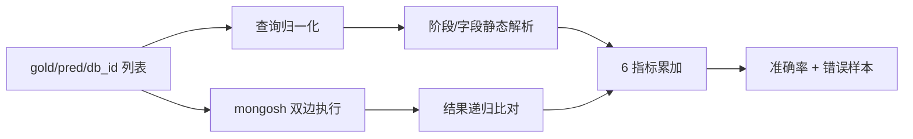

# 评估方法

> 文档定位: 阐述 6 指标体系、执行环境与 baseline 对照设计
> 目标读者: 评测复现者 / 模型作者
> 前置阅读: [01 任务定义](./01_task_definition.md), [02 数据集设计](./02_dataset_design.md)
> 最近更新: 2026-04-17

## 0. 摘要

本文档解释 Text-to-NoSQL 任务为何采用 6 指标 (EM / QSM / QFC / EX / EFM / EVM) 而非单一指标, 阐述 query-based 与 execution-based 两族的互补分工, 并说明以 EX 为核心指标的合理性。同一自然语言查询 (NLQ) 通常对应多个语义等价但结构不同的 MongoDB 查询 (MQL), 仅凭字符串或结构匹配容易低估模型能力; 反之, 若只看执行结果, 则难以诊断结构性缺陷。文档同时给出执行环境 (mongosh 子进程, 30 秒超时) 的设计权衡、baseline 类别对照, 以及当前已知的工程边界与风险。详见 [Paper §3.1.3 Evaluation Metrics](../Paper/main.tex)。

## 1. 6 指标体系总览

评估指标按"观测对象"分两族: 一族看查询本身 (静态结构), 另一族看执行结果 (动态语义)。前者可在不接触数据库的前提下给出快速反馈, 适合调试解析与生成; 后者刻画模型是否真正解决了用户问题。

| 族 | 指标 | 观测对象 | 顺序敏感 | 集合语义 |
|---|---|---|---|---|
| query-based | EM | 查询字符串 | — | 整体相等 |
| query-based | QSM | aggregation 阶段算子 | 是 | 列表相等 |
| query-based | QFC | 查询涉及字段 | 否 | 集合相等 |
| execution-based | EX | 执行结果全体 | 是 (zip) | 递归相等 |
| execution-based | EFM | 结果键名 | 否 | 集合相等 |
| execution-based | EVM | 结果取值 | 是 (zip) | 递归相等 |

设计依据: 单一指标无法同时覆盖"字面一致""结构一致""结果一致"三个层面; 同一 NLQ 存在多个等价 MQL, 需要多维度交叉校验。指标针对的任务输出形式见 [01 §3 输出规范](./01_task_definition.md#01-3)。

## 2. 各指标形式化定义

记 \(q_p\) 为预测查询, \(q_g\) 为标注查询; \(r_p, r_g\) 为其在同一数据库上的执行结果; \(\mathbb{1}[\cdot]\) 为指示函数。对单条样本:

\[ \text{EM} = \mathbb{1}[\text{normalize}(q_p) = \text{normalize}(q_g)] \]

归一化仅处理空白折叠, 其余字符原样比较。

\[ \text{QSM} = \mathbb{1}[\text{stages}(q_p) = \text{stages}(q_g)] \]

`stages` 返回 aggregation 管道算子 (如 `match`, `group`, `lookup`, `unwind`) 的有序列表, 顺序敏感。

\[ \text{QFC} = \mathbb{1}[\text{fields}(q_p) = \text{fields}(q_g)] \]

`fields` 基于目标库 schema 过滤后返回字段集合 (集合相等, 与出现顺序无关)。

\[ \text{EX} = \mathbb{1}[r_p \equiv_{\text{rec}} r_g] \]

\(\equiv_{\text{rec}}\) 为递归相等: 字典要求键集合一致且各键对应值递归相等; 列表按 zip 顺位递归比较; 标量用 `=`。

\[ \text{EFM} = \mathbb{1}[\text{keys}(r_p) = \text{keys}(r_g)] \]

keys 递归收集结果中出现的所有键名为集合。

\[ \text{EVM} = \mathbb{1}[\forall\,(d_p, d_g) \in \text{zip}(r_p, r_g):\; d_p \equiv_{\text{rec}} d_g] \]

逐文档 zip 后递归比对, 用于判定取值层一致。数据集整体指标为各样本指示函数的算术平均。

## 3. 执行环境

EX / EFM / EVM 依赖真实执行。设计上采用 mongosh 子进程调用而非 PyMongo 原生驱动, 主要权衡如下:

- 真实性: 子进程路径与终端用户使用 mongosh 的行为一致, 避免 Python 侧驱动版本引入的差异;
- 隔离性: 子进程崩溃不会带崩评测主程序, 且便于施加硬超时;
- 代价: 每条查询承担一次进程启动开销, 大规模评测吞吐受限。

固定 30 秒超时用于屏蔽缺 `$sort` 或笛卡尔积 `$lookup` 导致的长尾用例, 超时样本计为失败。结果经 `printjson` 序列化后进入 Python, BSON 特殊类型 (`ObjectId`, `ISODate`, `Date`, `Timestamp`, `BinData`, `DBRef` 等) 被替换成字符串占位, `NumberLong`, `NumberInt`, `NumberDecimal` 被剥去包装仅保留数值, 以便 `json.loads` 能落入标量相等比较。

执行的目标库形式见 [02 §4 MongoDB 库形式](./02_dataset_design.md#02-4); 执行环境依赖的数据导入流程见 [03 §9 数据导入 MongoDB](./03_dataset_construction.md#03-9)。

## 4. EX 为何是核心

- 语义高于形式: 同一 NLQ 常有多种等价 MQL (`$match` 顺序调换、`$project` 位置挪动、`find` 与 `aggregate` 互写等), 字符串或 AST 层面相等性严重低估等价模型;
- 与用户价值对齐: 终端用户只关心是否拿到正确结果, EX 直接度量这一点;
- 配合其他指标诊断归因: QSM/QFC 解释"结构差在哪里", EFM/EVM 解释"执行差在哪里", EX 决定总成败;
- 这也是论文将 EX 列为主报告指标、消融实验以 EX 变动幅度作为组件贡献依据的原因 (参见 [Paper §3.1.3 Evaluation Metrics](../Paper/main.tex))。

但 EX 并非无懈可击, 其局限详见 §5。

## 5. 已知边界与权衡

- 顺序敏感: 执行结果比对以 zip 顺位递归, 对未显式 `$sort` 的查询, 不同执行批次可能因磁盘遍历顺序差异被误判为不等。权衡: 直接采用集合比较会误放过"语义要求保序"的查询 (如 Top-K);
- 正则解析深度受限: `stages` 与 `fields` 均基于正则, 对 `$lookup.pipeline` 内层的嵌套 pipeline 仅解析一层, 更深嵌套将被忽略。权衡: 完整 AST 解析工程成本高, 当前数据集深嵌套占比低;
- QFC 不区分字段嵌套深度: `employees.FIRST_NAME` 与 `FIRST_NAME` 在集合中视为同一元素。好处是宽松召回, 代价是错判掩蔽;
- BSON 序列化精度损失: `NumberLong` 剥包装后可能在 JSON 环节丢失超 `Number.MAX_SAFE_INTEGER` 的精度, 极端大整数会误判不等;
- 以上权衡均为工程现实, 论文中应主动披露, 避免指标光鲜掩盖方法局限。

## 6. 评估流程脚本入口

单一入口由 `metric.py` 提供, 接收三元组列表并输出 6 项准确率与错误样本清单:

- 输入: 每条样本含 `db_id`、`NLQ`、`target` (标注 MQL)、`prediction` (模型 MQL);
- 输出: `{EM, QSM, QFC, EX, EFM, EVM}` 的数据集平均值 + EX 失败样本序列化到磁盘;
- 实现要点: 先做静态结构比对, 再执行两侧查询, 最后统一汇总。

## 7. baseline 性能对照

下表为 Paper Table 1 在 TEND 测试集上的简化重排, 聚焦 EM / EX 两列, 并标注各族设计与 SMART 的关键差异:

| 类别 | 代表方法 | EM | EX | 设计差异点评 |
|---|---|---|---|---|
| DNN-based | Seq2Seq / Transformer | 0.00 | 0.00 | 端到端, 无法生成合法 NoSQL 符号 |
| Direct Prompting | Instructing / Few-shot LLM | 5.91 / 10.41 | 35.06 / 35.82 | 只给 NLQ + schema, 无检索无反馈 |
| Advanced Prompting | Memory-augmented LLM | 16.32 | 53.26 | 引入记忆检索, 仍无 schema 预测 |
| Fine-tuned | Fine-tuned Llama | 20.54 | 53.12 | 全量微调, 缺运行时校正 |
| Cascaded | SQL→NoSQL (LLM / Grammar) | 10.09 / 0.00 | 44.76 / 10.81 | 间接路径, 未利用 NoSQL 原生算子 |
| **SMART (本文)** | deepseek-v3 | **23.82** | **65.08** | schema 预测 + 多视角检索 + 执行反馈 |

TODO(@eval-team): 表中 SMART 外的数值来源于 Paper Table 1, 发版前请核对一致性。SMART 与 baseline 的设计差异见 [05 §8 与 baseline 差异](./05_solution_design.md#05-8)。

## X. 主要构件清单

| 主题 | 文件 |
|---|---|
| 6 指标实现 | [src/utils/metric.py](../src/utils/metric.py) |
| 阶段提取 (QSM) | [src/utils/extract_stages.py](../src/utils/extract_stages.py) |
| 字段提取 (QFC) | [src/utils/extract_field.py](../src/utils/extract_field.py) |
| mongosh 执行封装 | [SMART/utils/mongosh_exec.py](../SMART/utils/mongosh_exec.py) |
| baseline 实现目录 | [baselines/](../baselines/) |

## Y. 未尽事项与已知风险

- TODO(@eval-team): `metric.py` 顶部 `import demjson` 在 Python 3.12+ 已失效, 需迁移到 `demjson3` 或改用 `json5` / `pyjson5`, 否则评测脚本在新环境直接 import 失败;
- TODO(@eval-team): `extract_field.py` 导出 `extract_fields(MQL)` (单参、无 schema), `extract_fields.py` 导出 `extract_fields(MQL, db_name)` (双参、有 schema), 而 `metric.py` 调用双参版; 两份同名实现长期并存易引入错 import, 建议统一到带 schema 的版本并删除另一份;
- 风险: 顺序敏感导致的误判, 下一轮应引入"缺失 `$sort` 时降级为多集合比较"的 fallback;
- 风险: BSON 大整数序列化精度损失, 应考虑在执行侧改用 `EJSON.stringify` 或在 Python 侧改 `Decimal` 包装;
- 风险: `stages` / `fields` 正则对深嵌套 pipeline 不展开, 评测可能低估复杂查询的结构相似度, 后续可用 AST 解析器替换。
