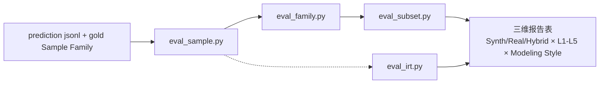

# 评估方法

> 文档定位: 阐述 3 层指标体系 (样本 / Family / 子集) / 执行环境 / IRT 难度评分协议 / baseline 对照设计
> 目标读者: 评测复现者 / 模型作者
> 前置阅读: [01 任务定义](./01_task_definition.md), [02 数据集设计](./02_dataset_design.md), [03 数据集构建方法](./03_dataset_construction.md)
> 最近更新: 2026-04-17

<a id="04-0"></a>
## 0. 摘要

MonGen 基准 Text-to-NoSQL 任务的评估方法采用**三层指标体系**, 以 EX (Execution Accuracy) 为核心, 以**三维报告**为标准呈现形式. 三层指标各司其职: **样本级** 6 指标 (EM / QSM / QFC / EX / EFM / EVM) 刻画单条 (NLQ, MQL) 对的细粒度正确性, 区分 "结构对还是语义对" 与 "形状对还是数值对"; **Family 级** 指标 (EX-Family / EX-Intent) 以 Sample Family 为单位评估意图鲁棒性, 要求 canonical 与全部 Intent Variant 同时 EX = 1 才算 Family 通过; **子集级** 报告以 MonGen-Synth / MonGen-Real / MonGen-Hybrid 三列分开给出, 主报告不合并总分, 其中 Synth ↔ Real gap 直接对应 RQ4 (外部有效性). 三子集规模 (MonGen-Synth 16,000 families / MonGen-Real 目标约 4,000 samples / MonGen-Hybrid 2,000 samples, 总约 60,000 (NLQ, MQL) pairs) 见 [02 §2-1 三子集规模总表](./02_dataset_design.md#02-2-1).

**三维报告**指在呈现结果时同时按下列三个维度切分, 不合并为单一数字:

- **维度一: 三子集分列** — 按 MonGen-Synth / MonGen-Real / MonGen-Hybrid 分别报告. 三子集的来源、分布与保证各不相同, 合并为一个总分会掩盖模型在特定子集的严重短板 (例如 "Synth 高 Real 低" 指向合成偏置过拟合, "Real 高 Synth 低" 指向只学到高频业务模式). Synth ↔ Real gap 作为 RQ4 的量化指标.
- **维度二: IRT 难度分桶** — 按 IRT Difficulty 的 5 等级分桶 (L1-L5 各 20%) 分列. 该维度揭示模型在哪档难度失分; 常见观察是大型 LLM 在 L4-L5 陡降, Fine-tuned 模型在 L1-L2 最强但 L4-L5 拉胯, 仅看平均 EX 会掩盖这种 "头强尾弱" 的剖面.
- **维度三: Modeling Style 分列** — 按 6 种 Modeling Style (Normalized / Embedded / Bucket / Polyglot / Legacy-drifting / Tenant-sharded) 分列, 分离 "业务语义理解" 与 "物理建模理解" 两种能力. Embedded 高 Bucket 低的模型多半缺时序分桶先验; Legacy-drifting 低的模型多半不会用 `$exists` / `$type` 做防御性查询.

执行环境采用 mongosh 子进程调用 + 30 秒硬超时 + 与数据集构造阶段严格一致的 BSON 归一化规则, 以保证合成侧落盘的 `exec_result_head` 与评估侧现场执行的结果在比对层面不会因格式抖动产生假阴性. IRT 评分由 8-12 个 pilot 模型集合产出, Discrimination ≥ 0.3 的样本方才纳入主报告 EX 分子, 对模型能力排序无区分价值的样本 (所有 pilot 都过或都过不了) 剔出分子但保留在总量中独立统计.

本文档贯穿使用的 ecommerce_017 主线 (`db_id = ecommerce_017`, 集合 `orders`, canonical NLQ: "Top 3 customers by total paid item spending in 2026.", Modeling Style = Legacy-drifting, IRT Difficulty = 0.42, Discrimination = 0.58, 归入 L3 桶, 激活 F9 / F10 / F15 / F17 四项特性) 在 §2 形式化定义与 §4 EX 为核心两节作为具体算例, 让抽象公式可以对照同一样本反复验证.

<a id="04-1"></a>
## 1. 指标体系

> 为何要分 3 层: 一条 NLQ 对应多个语义等价但结构不同的 MQL, 仅凭字符串或结构匹配会严重低估模型能力; 但只看执行结果又无法诊断 "错在结构还是错在谓词" 这类归因问题. 此外, MonGen 的记录单位是 Sample Family (1 canonical + K Intent Variant, K = 3 - 5), 只看 canonical 的 EX 会掩盖模型对 Intent Variant 的脆弱性. 再者, MonGen-Synth / MonGen-Real / MonGen-Hybrid 三子集的分布特性迥异, 合并总分会掩盖严重短板. 因此本文档采用样本级 / Family 级 / 子集级三层指标体系, 三者互补, 互不替代.

<a id="04-1-1"></a>
### 1.1 样本级指标 (EM / QSM / QFC / EX / EFM / EVM)

样本级 6 指标按 "观测对象" 分两族: query-based 族 (EM / QSM / QFC) 在不接触数据库的前提下直接比对查询本身, 适合调试解析与生成; execution-based 族 (EX / EFM / EVM) 刻画模型是否真正解决了用户问题.

| 族               | 指标  | 观测对象             | 顺序敏感    | 集合语义 |
| --------------- | --- | ---------------- | ------- | ---- |
| query-based     | EM  | 查询字符串            | —       | 整体相等 |
| query-based     | QSM | aggregation 阶段算子 | 是       | 列表相等 |
| query-based     | QFC | 查询涉及字段           | 否       | 集合相等 |
| execution-based | EX  | 执行结果全体           | 是 (zip) | 递归相等 |
| execution-based | EFM | 结果键名             | 否       | 集合相等 |
| execution-based | EVM | 结果取值             | 是 (zip) | 递归相等 |

实现侧重点: QSM / QFC 直接在 fAST 上计算, 避免字符串正则在 `$lookup.pipeline` 嵌套层、表达式括号匹配上的歧义与深度限制; fAST 作为 MongoDB 查询抽象语法树的完整镜像, 天然支持任意层嵌套的遍历与投影. EM 则保留在 MQL 字符串层面, 其价值正在 "字面一致性", 若放到 fAST 上会抹平空白折叠、引号风格、字段顺序等字面差异, 使 EM 退化为与 QSM 等价, 失去独立意义. EX / EFM / EVM 必须执行, 两侧查询在同一物理库上运行, 结果经 §3 的 BSON 归一化后拉齐比对.

下面逐一给出每个指标的 **公式 / 语义 / 局限** 三要素.

**EM (Exact Match)**. 公式: 预测 MQL 与 gold MQL 的规范化字符串逐字符相等. 语义: 最严的表面匹配, 用于度量模型是否可以逐字背下 gold. 局限: 对等价重写 (如 `$project` 位置挪动、字段顺序不同) 严重低估, 通常只能作为模型是否过拟合到训练分布字面的诊断指标, 不适合作为主报告指标.

**QSM (Query Stage Match)**. 公式: fAST 中 aggregation pipeline 的 stage 算子有序列表相等. 语义: 刻画 "骨架是否正确", 即 `$match → $unwind → $group → $sort → $limit` 这种阶段序列是否与 gold 一致. 局限: 对 "结构对但谓词错" 的错误无反应 (例如 `$match` 条件错了年份, 但 `$match` stage 仍然存在), 也对 "等价改写但 stage 顺序调换" 的模型低估 (例如 `$sort → $group` 与 `$group → $sort` 在特定场景语义等价).

**QFC (Query Field Coverage)**. 公式: fAST 中出现的字段路径去重后组成的集合, 与 gold 的字段集合相等. 语义: 刻画 "字段选对了吗", 即 schema linking 是否命中. 局限: 不区分字段嵌套深度 (`items.price` 与 `price` 视为同一元素), 好处是宽容 "同名不同路径" 的噪声, 坏处是错判可能被掩盖.

**EX (Execution Accuracy)**. 公式: 预测 MQL 在目标库上执行得到的结果与 gold 执行结果递归相等. 语义: 直接度量 "用户是否拿到正确数据", 与终端价值对齐, 是本基准的**主报告指标**. 局限: 顺序敏感 (依赖 zip 逐位递归), 对无 `$sort` 的查询可能因磁盘遍历顺序差异产生假阴性, 需配合 multiset fallback 降级 (见 §5); 对 `paid_at` 等可能为 NULL 的边界样本存在假阳 (见 §5).

**EFM (Execution Field Match)**. 公式: 执行结果中所有文档递归收集的键集合与 gold 相等. 语义: 刻画 "返回形状对不对", 即投影与聚合输出的 schema 是否与 gold 一致. 局限: 对取值差异不敏感 (键对但值错时 EFM = 1 而 EVM = 0), 必须与 EVM 联用.

**EVM (Execution Value Match)**. 公式: 执行结果两侧按 zip 顺位逐文档递归相等 (键集合忽略, 仅看值). 语义: 刻画 "数值对不对", 常用于发现 `$sum` 写成 `$avg` 这类聚合函数错用. 局限: 顺序敏感, 若 gold 与预测在相同位置给出相同键但键名不同, EVM 仍可能通过 (因为值是递归比对的, 与键无关); 该组合实际很少发生, 与 EFM 联用即可覆盖.

以 ecommerce_017 主线 "Top 3 customers by total paid item spending in 2026." 为例, 其 gold MQL 管道形态为 `[$match, $unwind, $group, $project, $sort, $limit]`. 若模型预测管道漏掉 `$limit`, QSM = 0 (有序列表不等), EX 也会因为返回 > 3 条结果而为 0; 若模型把 `$match` 的 `paid_at` 范围错成 2025, QSM = 1 (管道算子列表一致)、QFC = 1 (字段集合一致)、但 EX = 0 (执行结果不同), 此时便可通过 QSM / QFC 为 1 但 EX 为 0 定位到 "结构对而谓词错" 的缺陷. 同理, 若模型把 `$sum` 写成 `$avg`, QSM = 1 / QFC = 1 / EX = 0 / EFM = 1 (键名一致) / EVM = 0 (数值不同), 归因直接指向聚合算子误用.

<a id="04-1-2"></a>
### 1.2 Family 级指标 (EX-Family, EX-Intent)

MonGen 的记录单位是 Sample Family, 一个 Sample Family 由 1 个 canonical + K 个 Intent Variant (K = 3 - 5) 组成, 后者覆盖 negation / omission / coreference / jargon / composition 五类语义扰动. 只看 canonical 的 EX 会漏掉模型对意图变形的脆弱性; 只看全样本平均 EX 又会把 canonical 与 Intent Variant 的贡献平均化, 同样看不出 "主干对但变体差" 的鲁棒性缺口. Family 级指标补这一缺口. Sample Family 结构定义见 [02 §3-1 Sample Family 结构](./02_dataset_design.md#02-3-1).

定义两个 Family 级指标:

- **EX-Family (Family 全通过率)**: 一个 Sample Family 内 canonical + 全部 Intent Variant 的预测 MQL 必须逐条 EX = 1, 整个 Sample Family 才算通过. Sample Family 内哪怕单个 Intent Variant 错, EX-Family 即判 0. 这比 canonical 的 EX 严格得多, 刻画 "意图鲁棒性" 的整体水平. EX-Family 与 canonical-level EX 的差值即 "意图鲁棒性下降幅度", 主报告建议同时给出两者.
- **EX-Intent (每 variant 对 canonical 的 EX 保持率)**: 对每个 variant_type t ∈ {negation, omission, coreference, jargon, composition}, 独立计算在该 variant_type 上的 EX 平均值, 并给出 "EX-Intent(t) / EX(canonical)" 作为保持率, 直接反映模型在该类语义扰动上的相对衰退. 主报告应至少分列五类, 便于识别模型是在 "否定语义" 上弱还是在 "领域黑话" 上弱.

以 ecommerce_017 主线为例, 其 Sample Family 形态如下:

- canonical NLQ: "Top 3 customers by total paid item spending in 2026."
- negation Intent Variant: "Top 3 customers in 2026 whose orders are NOT in refunded / pending state, ranked by paid item spending."
- omission Intent Variant: "Top customers by paid spending." (隐含 2026、隐含 Top 3)
- coreference Intent Variant: "For last year's buyers, give me the three who spent the most on items they actually paid for." ("last year" 需结合当前时间锚定到 2026; "they" 指代需消解)
- jargon Intent Variant: "Heaviest 3 GMV contributors among paid cohort in FY26." ("GMV" / "FY26" / "paid cohort" 业务黑话)
- composition Intent Variant: canonical 再与 "按城市分组" 拼接

若模型对 canonical + 五个 Intent Variant 全部 EX = 1, EX-Family = 1; 若 omission Intent Variant 因 "Top 数量未指定" 而输出缺失 `$limit`, EX-Family 立刻变为 0, 同时 EX-Intent.omission 在此 Sample Family 上记 0, 其他 EX-Intent.* 仍按各自命中情况累加. 由此可以诊断该模型 "主干能力强但对省略语义不稳", 而不是被 EX-Family 单一数字蒙蔽.

**Abstention 的处理**: 对 3-way Verifier 裁决为 Ambiguous-Abstain Bucket 的样本, 其 gold 本身不是单一解, 默认策略是**在 EX 分母中剔除**, 单独以 "Ambiguous 覆盖率" 指标旁路报告, 不纳入 EX-Family / EX-Intent 计算. 这样可避免模型在 Ambiguous-Abstain Bucket 样本上的随机命中或随机失分扭曲 Family 级指标的信号.

<a id="04-1-3"></a>
### 1.3 子集级报告 (MonGen-Synth / MonGen-Real / MonGen-Hybrid 三列)

MonGen-Synth 覆盖 17 特性的组合 (每特性 ≥ 5%、二元组 ≥ 60%、三元组 ≥ 30%) 但分布受 Sampler 偏置影响; MonGen-Real 分布真实但随缘 (挖矿到什么算什么); MonGen-Hybrid 测 "真实意图 × 合成库" 的组合泛化. 三者性能不应合并为一个总分, 否则会掩盖模型在某子集的严重短板. 主报告必须给出三列分开的形式, 总体列只作可选参考. 推荐的报告表模板 (模型 × 子集 × 指标) 如下:

| 指标                    | MonGen-Synth | MonGen-Real | MonGen-Hybrid | Overall (可选, 规模加权) |
| --------------------- | ------------ | ----------- | ------------- | ------------------ |
| EM                    | ...          | ...         | ...           | 加权平均               |
| QSM                   | ...          | ...         | ...           | 加权平均               |
| QFC                   | ...          | ...         | ...           | 加权平均               |
| EX (主报告)              | ...          | ...         | ...           | 加权平均               |
| EFM                   | ...          | ...         | ...           | 加权平均               |
| EVM                   | ...          | ...         | ...           | 加权平均               |
| EX-Family             | ...          | ...         | ...           | 规模加权               |
| EX-Intent.negation    | ...          | ...         | ...           | 规模加权               |
| EX-Intent.omission    | ...          | ...         | ...           | 规模加权               |
| EX-Intent.coreference | ...          | ...         | ...           | 规模加权               |
| EX-Intent.jargon      | ...          | ...         | ...           | 规模加权               |
| EX-Intent.composition | ...          | ...         | ...           | 规模加权               |

**Synth ↔ Real gap 作为 RQ4 指标**: 定义 `gap_SR(model) = EX_Synth(model) - EX_Real(model)`. 该差值直接量化外部有效性 — gap_SR 越小, 模型跨越 "合成 → 真实" 的迁移能力越强. gap_SR 显著为正 (例如 > 15 个百分点) 提示模型可能过拟合到 Sampler 偏置; gap_SR 显著为负提示模型仅学到高频业务模式, 在受控特性组合覆盖上反而弱. 论文主表必须同时给出 EX_Synth / EX_Real / gap_SR 三列, 不允许只给总体 EX.

**Overall 列的加权方案**: 若给出 Overall 列作参考, 权重默认用 **三子集 (NLQ, MQL) pair 规模**, 即 MonGen-Synth ≈ 48,000 / MonGen-Real ≈ 12,000 / MonGen-Hybrid ≈ 6,000 对应权重约 0.73 / 0.18 / 0.09. 权重必须在报告中显式公开, 并在附录给出 "等权 (1/3 / 1/3 / 1/3)" 作为敏感性分析, 避免模型排名因权重选择暗移.

**主报告呈现规则**: Overall 列不允许作为 headline 数字单独出现. 论文的摘要、结论、图表 caption 都必须以三元组形式 (EX_Synth / EX_Real / EX_Hybrid) 或附带 gap_SR 呈现 EX. 该约束是本基准对 "单一数字 headline 误导性" 的主动抵抗, 强制读者关注跨子集的差异剖面.

<a id="04-2"></a>
## 2. 形式化定义

本节给出样本级 6 指标、Family 级 2 指标、子集级指标的严格数学定义, 并以 ecommerce_017 主线作具体算例.

**记号约定**. 记 $q_p$ 为预测 MQL, $q_g$ 为 gold MQL; $r_p, r_g$ 为它们在同一目标库上的执行结果 (均为 BSON 归一化后的 list[dict]); $\mathbb{1}[\cdot]$ 为指示函数; $\text{fAST}(q)$ 为 $q$ 的 fAST 表示; $\equiv_{\text{rec}}$ 为递归相等关系, 定义为: 字典要求键集合一致且各键对应值递归相等; 列表按 zip 顺位递归比较; 标量用 `=`.

**样本级 6 指标**:

$$\text{EM}(q_p, q_g) = \mathbb{1}\bigl[\text{normalize}(q_p) = \text{normalize}(q_g)\bigr]$$

其中 `normalize` 仅处理空白折叠, 其余字符原样比较, 保留 EM 的字面诊断价值.

$$\text{QSM}(q_p, q_g) = \mathbb{1}\bigl[\text{stages}(\text{fAST}(q_p)) = \text{stages}(\text{fAST}(q_g))\bigr]$$

`stages` 返回 aggregation pipeline 的 stage 算子 (如 `match`, `group`, `lookup`, `unwind`) 的**有序**列表, 对 `$lookup.pipeline` 的嵌套子管道以 DFS 展开.

$$\text{QFC}(q_p, q_g) = \mathbb{1}\bigl[\text{fields}(\text{fAST}(q_p)) = \text{fields}(\text{fAST}(q_g))\bigr]$$

`fields` 基于目标库 schema 过滤后返回字段集合, 顺序无关, 不区分嵌套深度.

$$\text{EX}(q_p, q_g) = \mathbb{1}\bigl[r_p \equiv_{\text{rec}} r_g\bigr]$$

执行结果的递归相等. 顺序敏感, 等价于要求两侧结果列表按 zip 顺位每一文档都递归相等.

$$\text{EFM}(q_p, q_g) = \mathbb{1}\bigl[\text{keys}(r_p) = \text{keys}(r_g)\bigr]$$

`keys` 递归收集结果中所有出现过的键名组成集合.

$$\text{EVM}(q_p, q_g) = \mathbb{1}\bigl[\forall (d_p, d_g) \in \text{zip}(r_p, r_g):\, d_p \equiv_{\text{rec}} d_g\bigr]$$

逐文档 zip 后递归比对取值.

**Family 级 2 指标**.

记 $F$ 为一个 Sample Family, $F.\text{canonical}$ 为其 canonical, $F.\text{variants}$ 为其 Intent Variant 集合:

$$\text{EX-Family}(F) = \mathbb{1}\Bigl[\text{EX}(F.\text{canonical}) = 1 \ \land\ \forall v \in F.\text{variants}:\, \text{EX}(v) = 1\Bigr]$$

对 variant_type $t \in \{\text{negation}, \text{omission}, \text{coreference}, \text{jargon}, \text{composition}\}$, 记 $\mathcal{V}_t$ 为全数据集中 variant_type = $t$ 的 Intent Variant 集合:

$$\text{EX-Intent}_t = \frac{1}{|\mathcal{V}_t|}\sum_{v \in \mathcal{V}_t}\text{EX}(v)$$

相应的保持率为 $\text{retain}_t = \text{EX-Intent}_t \,/\, \text{EX}(\text{canonical})$, 用于独立量化每类语义扰动相对 canonical 的相对衰退.

**子集级指标**. 样本级与 Family 级指标均可子集化. 记 $S \in \{\text{Synth}, \text{Real}, \text{Hybrid}\}$, $\mathcal{D}_S$ 为子集 $S$ 的样本集合:

$$\text{EX}_S = \frac{1}{|\mathcal{D}_S|}\sum_{s \in \mathcal{D}_S}\text{EX}(s), \qquad \text{gap}_{SR}(\text{model}) = \text{EX}_{\text{Synth}}(\text{model}) - \text{EX}_{\text{Real}}(\text{model})$$

**ecommerce_017 主线算例**.

gold MQL (已在 mongosh 上验证可执行):

```
db.orders.aggregate([
  {$match:{status:"paid",paid_at:{$exists:true,$gte:ISODate("2026-01-01")}}},
  {$unwind:"$items"},
  {$group:{_id:"$user_id",total_spent:{$sum:"$items.price"}}},
  {$project:{_id:0,user_id:"$_id",total_spent:1}},
  {$sort:{total_spent:-1}},
  {$limit:3}
])
```

执行结果 $r_g$ (BSON 归一化后, 假设 Top 3 为 u_A / u_B / u_C):

```
[
  {"user_id": "65a000000000000000000200", "total_spent": "2190.50"},
  {"user_id": "65a000000000000000000210", "total_spent": "1880.00"},
  {"user_id": "65a000000000000000000215", "total_spent": "1640.25"}
]
```

**EX 判定**. 模型 M_1 预测相同 MQL 但 `$sort` 为 `{total_spent: 1}` (升序), 则 $r_p$ 首位为 `u_X`, 与 $r_g$ 首位 `u_A` 不等, 故 $r_p \not\equiv_{\text{rec}} r_g$, $\text{EX}(q_p, q_g) = 0$. 模型 M_2 预测 MQL 交换 `$project` 与 `$sort` 的位置 (仍保证 Top 3 有序正确), 则 QSM = 0 (stage 顺序不同) 但 EX = 1 (执行结果递归相等), 这是 "结构不同但语义等价" 的典型. 模型 M_3 把 `$limit` 改为 `{$limit: 5}`, 则 $r_p$ 比 $r_g$ 多 2 行, zip 外行被视为差异, EX = 0.

**EX-Family 判定**. 设 ecommerce_017 的 Sample Family 有 5 个 Intent Variant. 模型 M_4 在 canonical / negation / jargon / composition 上 EX = 1, 在 omission 上漏掉 `$limit` 导致 EX = 0, 在 coreference 上因时间锚定到 2025 导致 EX = 0. 则 $\text{EX-Family}(F) = \mathbb{1}[1 \land 1 \land 0 \land 1 \land 0 \land 1] = 0$. 该 Sample Family 在 M_4 上的 Family-level 判 0, 但在 EX-Intent 分项中 $\text{EX-Intent.omission}$ 与 $\text{EX-Intent.coreference}$ 会记 0, 其他三类分别记 1, 从而精确暴露模型在 "省略" 与 "前指时序" 上的弱点, 而不是整族全判失败掩盖信号.

<a id="04-3"></a>
## 3. 执行环境

EX / EFM / EVM 三项指标依赖真实执行. MonGen 选用 **mongosh 子进程调用** 而非 PyMongo 原生驱动, 主要权衡:

- **真实性**: 子进程路径与终端用户使用 mongosh 的行为一致, 避免 Python 侧驱动版本 / 序列化差异引入偏置.
- **隔离性**: 子进程崩溃不会带崩评测主程序, 且便于施加硬超时.
- **代价**: 每条查询承担一次进程启动开销; 大规模评测吞吐受限, 需配合 §6 的批次并行.

**超时与降级**. 固定 **30 秒硬超时** 用于屏蔽缺 `$sort` 或笛卡尔积 `$lookup` 导致的长尾用例, 超时样本统一记为 EX = 0. 实测下 MonGen-Synth 16,000 families × (1 canonical + 5 Intent Variant 平均) ≈ 96,000 条查询的一轮全量评测串行耗时约 10+ 小时, 批次并行度建议 ≤ 8 以避免 MongoDB 实例连接风暴 (见 §Y 的风险记录).

**BSON 归一化**. 结果经 mongosh `printjson` 序列化后进入 Python 层, 其中的 BSON 特殊类型按与数据集构造阶段**严格一致**的规则归一化: `ObjectId` 转 hex 字符串; `Date` 转 ISO-8601 字符串; `Decimal128` 转字符串保留全精度; `Long` 在 53 bit 以内转 int、超 53 bit 保留字符串; `Binary` 转 base64 字符串. 完整规则表见 [03 §9-3 BSON 归一化](./03_dataset_construction.md#03-9-3). 评估时必须使用与构造阶段相同的归一化函数, 因为 MonGen 数据集落盘的 `exec_result_head` 是这一函数的产物, 任何偏离都会导致假阴性.

**评估前校验**. 评估脚本入口需在运行前校验: (a) 评估侧 BSON 归一化函数的版本 hash 与数据集 `MonGen/meta.json` 中记录的 hash 一致; (b) MongoDB 实例的 `serverVersion` 满足基准要求 (目前要求 ≥ 7.0 以支持 `$rank` / `$median` / `$percentile`); (c) 目标库 `db_id` 已成功导入且集合数与 schema 匹配. 任一校验失败直接 abort, 不允许降级运行.

**MonGen-Real 的特殊处理**. MonGen-Real 子集的库来自真实挖矿, schema 可能不完整 (例如 Stack Overflow 原问题只给了 `db.orders` 的两字段示例但没有完整 schema); 评估时容许 "schema 缺失 → 跳过该样本" 的降级策略, 此类样本从该模型在 MonGen-Real 子集的分母中剔除, 同时在报告中标注 "Real effective sample size" 让读者对分母有感知. 降级样本独立列入错误分析, 不混入主 EX.

<a id="04-4"></a>
## 4. EX 为核心

EX 是 MonGen 主报告指标, 其余指标作为补充诊断视角. 理由如下:

- **语义高于形式**: 同一 NLQ 常有多种等价 MQL (`$match` 顺序调换、`$project` 位置挪动、`find` 与 `aggregate` 互写、`$group → $sort` 与 `$sort → $group` 的某些场景等价等), 字符串或结构层面的相等性会严重低估等价模型.
- **与用户价值对齐**: 终端用户只关心是否拿到正确结果, EX 直接度量这一点.
- **配合其他指标诊断归因**: QSM / QFC 解释 "结构差在哪里", EFM / EVM 解释 "执行差在哪里", EX 决定总成败. QSM = 0 / EX = 1 意味 "结构不同但语义等价" (好事); QSM = 1 / EX = 0 意味 "结构对但谓词 / 常量错" (要查 `$match` / 字面值); EFM = 1 / EVM = 0 意味 "返回形状对但数值错" (常见于 `$sum` 写成 `$avg` 这种聚合函数误用).
- **与文献对标**: EX 等价于 Text-to-SQL 文献的 Execution Accuracy, 保留横向对标能力.

**EX 必须三子集分列**. MonGen 特有的观察是: 同一模型的 EX 在三子集上的**不对称性**本身就是有价值的信号, 绝不能合并:

- $\text{EX}_{\text{Synth}}$ 反映模型对 17 特性组合的覆盖; 高表示模型掌握了 cMRL 的受控表达空间, 但由于 Sampler 存在合成偏置, 高 EX_Synth 并不保证高 EX_Real.
- $\text{EX}_{\text{Real}}$ 反映模型对真实 workload 的外部有效性, 分布随缘但更接近生产部署. MonGen-Real 因来自真实挖矿, schema 噪声与意图歧义都比合成严重, 同一模型的 EX_Real 通常低于 EX_Synth 10-20 个百分点.
- $\text{EX}_{\text{Hybrid}}$ 反映 "真实意图 × 合成库" 组合泛化能力, 是 RQ4 组合泛化的最严苛考察. 由于既换库又换意图源, 模型常在此子集陡降.

例如 "EX_Synth = 0.70 / EX_Real = 0.40 / EX_Hybrid = 0.30" 的模型画像指向 "合成过拟合 + 弱迁移"; 反之 "EX_Synth = 0.45 / EX_Real = 0.55 / EX_Hybrid = 0.30" 指向 "仅掌握真实高频模式 + 组合泛化弱". 单独看任何一列都不完整, 必须三列合看.

**EX 判定的具体协议: ecommerce_017 主线示例**. 对顺序敏感的 Top-K 类查询 (本例), EX 判定协议如下:

1. 两侧 MQL 在同一目标库上以 mongosh 子进程执行, 30 秒超时;
2. 执行结果按 BSON 归一化规则序列化为 list[dict];
3. 对两侧结果计算 "有序哈希" (对每一位文档用规范 JSON 序列化后逐位拼接 SHA-256), 哈希相等则 EX = 1, 否则 EX = 0.

对 ecommerce_017 主线:

- $r_g = [\{user\_id: u_A, total\_spent: "2190.50"\}, \{user\_id: u_B, total\_spent: "1880.00"\}, \{user\_id: u_C, total\_spent: "1640.25"\}]$
- 预测侧若返回相同 3 条且顺序一致, 有序哈希相同, EX = 1.
- 若预测侧返回 `{u_A, u_C, u_B}` (顺序错位), 逐位 zip 比较在第 2 位即失败, EX = 0. 虽然集合语义上 "对了 3 人", 但 Top-3 查询的业务含义强依赖排名, EX 坚持顺序敏感以保留该信号.
- 若预测侧多返回 1 行 (漏掉 `$limit`), list 长度不等, 零 padding 后比较必然失败, EX = 0.

**对无 `$sort` 查询的 multiset fallback**. 对 gold fAST 不含任何 `$sort` stage 的查询 (此类在 MonGen-Real 中更多见, 真实代码常省略显式排序), EX 判定降级为 multiset 相等 — 逐文档哈希后比较 multiset, 避免磁盘遍历顺序差异导致假阴性. 降级触发由 fAST 静态检测, 不依赖模型声明.

**EX 与 IRT Discrimination 的关系**. IRT pilot 以 8-12 个模型跑出每样本的 IRT Difficulty (1 - pass_rate) 与 Discrimination (模型能力与样本 pass 的相关度). Discrimination ≥ 0.3 的样本才对排序模型有价值, Discrimination < 0.3 的样本 (所有模型都过或都过不了) 无排序信息含量, 应剔出主报告 EX 分子, 仍作为 "基础能力 / 极端挑战" 的独立统计旁挂. 该过滤由 §6 的 `--pilot-mode` 实现.

**EX 与 IRT Difficulty 分桶的关系**. IRT Difficulty 按 L1-L5 五等级分桶 (各 20%), 主报告除了给出三子集分列 EX, 还应给出 "每子集 × 每难度桶" 的双维 EX 矩阵 (3 × 5 = 15 格), 便于识别模型是 "所有难度均匀弱", 还是 "仅在 L4-L5 陡降". ecommerce_017 主线的 IRT Difficulty = 0.42, 归入 L3 桶, 属典型中等难度样本, 既不简单到所有模型都过, 也不难到所有模型都过不了, 正是主报告 EX 重点关注的 "信息量样本".

EX 并非无懈可击, 其具体局限详见 §5.

<a id="04-5"></a>
## 5. 已知边界与权衡

MonGen 的评估协议在设计时做了若干显式权衡, 以下为论文发布前必须主动披露的边界, 避免读者被单一数字误导.

- **(a) EX 在 `paid_at` NULL 边界样本存在假阳**: 对 Legacy-drifting Modeling Style 的 orders 集合, legacy 形态无 `paid_at` 字段. 若模型写 `{$match:{paid_at:{$gte:ISODate("2026-01-01")}}}` 而 gold 写 `{$match:{paid_at:{$exists:true,$gte:ISODate("2026-01-01")}}}`, 前者借助 "字段缺失自动不满足比较" 的 MongoDB 行为侥幸得到与 gold 相同的 Top 3 (因为缺 `paid_at` 的 legacy 文档都不会进入聚合), 但其语义其实是 "把未支付订单与 legacy 未迁移订单合并对待", 与 gold 的 "仅考虑显式已支付" 不等. EX 在该样本上会给出假阳 (= 1), 只有在 NULL 与缺失混合的边界数据扩充后才能暴露. 对策: 在 MonGen-Synth 的 Legacy-drifting 库中显式构造同时含 `paid_at: null` 与字段缺失两种 legacy 分支的文档, 将 EX 假阳转化为真阴.

- **(b) EX-Family 对 Sample Family 大小敏感**: EX-Family 要求 canonical + 全部 Intent Variant 都 EX = 1, 其期望值随 K (Intent Variant 个数) 增加而单调下降. 设单条 Intent Variant 的 EX 概率为 p, 则 EX-Family 的期望值为 $p^{K+1}$. 若某库的 K = 5 而另一库 K = 3, 即使模型能力相同, 前者的 EX-Family 会偏低. 对策: 主报告同时给出 K 归一化后的 EX-Family (按各 Sample Family 的 K 做几何平均归一), 附录给出原始 EX-Family 做对照.

- **(c) 3-way Verifier 的裁决不直接进评测**: 3-way Verifier 是数据集**入库阶段**的质量门, 其三家 LLM 的裁决 (3/3, 2/3, 1/3, 0/3, 互不一致) 只决定样本是否入库、入哪个桶 (pass / probable-pass / 人工仲裁 / 丢弃 / Ambiguous-Abstain Bucket). 评测阶段只使用已固化的 gold MQL 与 `exec_result_head` 做 EX 判定, Verifier 历史裁决不参与. 这样做是为了让评测协议与入库流程解耦, 避免评测 EX 被数据侧的裁决偏置再次污染. Ambiguous-Abstain Bucket 样本因不具单一 gold, 默认在主 EX 分母中剔除, 单独以 Ambiguous 覆盖率指标旁路呈现.

- **(d) IRT 评分依赖 pilot, 报告时需披露 pilot 列表**: IRT Difficulty 与 Discrimination 的数值取决于 pilot 模型集合的具体组成. pilot 集合若偏向某家族 (如三个模型都来自同一 base family), Difficulty 评估会系统性偏斜, 导致 Discrimination ≥ 0.3 的过滤门也会偏移. 本基准的对策是 pilot 集合至少跨 3 个不同家族 + 至少 2 个不同预训练语料基座, 并在每次评估报告中**必须披露**以下字段: pilot 模型列表 (模型名 + 供应商 + checkpoint hash 或 API 版本号), pilot 评分日期, Discrimination 分布直方图. 未披露此三项的评估结果不被主报告接受.

- **(e) BSON 浮点精度**: Decimal128 已以字符串形式落盘 `exec_result_head` (归一化规则详表已在 §3 引用), 大整数精度问题缓解; 但 `Long` 超 $2^{53}$ 时, 若评估侧 Python 用原生 `json.loads` 解析会在自动数值化环节丢失低 bit. 对策: 评估脚本统一用 `json.JSONDecoder(parse_int=decimal.Decimal)` 全程保全, 下游比对时显式处理 Decimal 与 int 的交叉比较; 或在 BSON 归一化时即把 `Long > 2^53` 保留为字符串 (与 §3 的规则一致). 未遵守该协议会在 IoT 时间戳等场景产生假阴性.

- **(f) 顺序敏感与 multiset fallback 的边界**: EX 默认顺序敏感, 对含 `$sort` 的查询直接 zip 递归比对; 对 gold fAST 无 `$sort` 的查询降级为 multiset. 降级触发条件基于 fAST 静态检测, 但存在 "gold 省略排序但语义实际要求排序" 的边界情形 (真实代码常有此类隐式约定), 此时 multiset fallback 反而会给模型过多宽容. 对策: 数据入库时通过 Intent Mutator 的 canonical 化规则把隐式排序补齐为显式 `$sort` stage; MonGen-Real 的真实代码经 fAST Parser 解析后若缺 `$sort` 则在 provenance 中标记 "unordered", 评估侧看到该标记时自动应用 multiset fallback, 不做二次猜测.

以上 6 条权衡均为工程现实, 论文中应主动披露, 避免指标光鲜掩盖方法局限.

<a id="04-6"></a>
## 6. 评估流程脚本入口

评估流水线拆分为 4 个独立脚本, 按职责解耦以便单独调试与组合复用:

| 脚本                        | 职责                                                                |
| ------------------------- | ----------------------------------------------------------------- |
| `scripts/eval_sample.py`  | 样本级指标 (EM / QSM / QFC / EX / EFM / EVM), 输入 prediction 与 gold 成对  |
| `scripts/eval_family.py`  | Family 级指标 (EX-Family / EX-Intent.*), 按 `family_id` 聚合样本级结果       |
| `scripts/eval_subset.py`  | 子集级报告 (Synth / Real / Hybrid 三列), 按 `subset` 字段汇总 + 三维报告 (难度/风格) |
| `scripts/eval_irt.py`     | 按 IRT 难度桶分列 + IRT Discrimination 过滤 + pilot 评分回写                  |

**`eval_sample.py` CLI 骨架**:

```
python scripts/eval_sample.py \
  --predictions path/to/pred.jsonl \
  --gold MonGen/synth_test.json \
  --db-uri mongodb://localhost:27017 \
  --timeout 30 \
  --output results/sample_level.json
```

输入: 每行一个 prediction 对象, 含 `family_id`, `variant_id` (canonical 时为 `"canonical"`), `prediction_mql`. gold 侧从 `--gold` 读取对应 Sample Family. 输出: 6 指标在全量样本上的平均值, 以及按 variant_type / Modeling Style / 难度桶分列的条件平均.

**`eval_family.py` CLI 骨架**:

```
python scripts/eval_family.py \
  --sample-results results/sample_level.json \
  --families MonGen/synth_test.json \
  --output results/family_level.json
```

输入: `eval_sample.py` 的输出 + Sample Family 列表. 输出: EX-Family (按 family_id 聚合), EX-Intent (按 variant_type 聚合); 并给出每 Sample Family 的 "哪条 Intent Variant 失分" 诊断列表便于错误分析.

**`eval_subset.py` CLI 骨架**:

```
python scripts/eval_subset.py \
  --sample-results results/sample_level.json \
  --family-results results/family_level.json \
  --families MonGen/synth_test.json MonGen/real.json MonGen/hybrid.json \
  --report-3d \
  --output results/subset_report.json
```

输出: §1-3 的三列报告表 (Synth / Real / Hybrid + Overall 可选) + 三维矩阵 (子集 × 难度桶 / 子集 × Modeling Style) + gap_SR 指标. `--report-3d` 开关控制是否输出三维矩阵.

**`eval_irt.py` CLI 骨架**:

```
python scripts/eval_irt.py \
  --pilot-predictions pilot_runs/ \
  --sample-results results/sample_level.json \
  --families MonGen/synth_test.json MonGen/real.json MonGen/hybrid.json \
  --write-back MonGen/ \
  --discrimination-floor 0.3 \
  --output results/irt_eval.json
```

职责: (1) 按难度桶 (L1-L5) 分列输入模型的 EX; (2) 读取 pilot 集合的 pass 向量, 重算每样本的 Discrimination, 对 < 0.3 的样本在主报告中剔除并单独列入 "low-discrimination" 桶; (3) 若指定 `--write-back`, 把新 pilot 数据并入 `irt.pilot_pass_vector` 并更新 Difficulty / Discrimination 回写 Sample Family. `--discrimination-floor` 默认 0.3, 可在敏感性分析中调 0.2 / 0.4 观察排名稳定性.

**依赖关系**: `eval_sample` → `eval_family` → `eval_subset` 为顺序依赖链; `eval_irt` 旁挂, 可在 `eval_sample` 后任意时机调用. 所有脚本写出的 JSON 均保留原始样本级结果, 便于后续按新维度重聚合而无需重跑执行.



<a id="04-7"></a>
## 7. baseline 性能对照

本节给出 baseline 对照表骨架. **表中所有数值占位为 TBD pending pilot**, 避免在实测前给出绝对值与 [05 §8 与 baseline 差异](./05_solution_design.md#05-8) 的具体数值冲突. baseline 类别沿用既有文献脉络 (DNN-based / Direct Prompting / Advanced Prompting / Fine-tuned / Cascaded / SMART), 目的是在同一三子集分列协议下横向对比 "生成式 vs 检索式"、"单次 vs 记忆增强"、"端到端 vs 级联" 的差异.

**主表 (子集 × Family)**:

| 类别                 | 代表方法                       | EX (Synth) | EX (Real) | EX (Hybrid) | EX-Family | EX-Intent (avg 5 类) |
| ------------------ | -------------------------- | ---------- | --------- | ----------- | --------- | ------------------- |
| DNN-based          | Seq2Seq / Transformer      | TBD        | TBD       | TBD         | TBD       | TBD                 |
| Direct Prompting   | Instructing / Few-shot LLM | TBD        | TBD       | TBD         | TBD       | TBD                 |
| Advanced Prompting | Memory-augmented LLM       | TBD        | TBD       | TBD         | TBD       | TBD                 |
| Fine-tuned         | Fine-tuned Llama           | TBD        | TBD       | TBD         | TBD       | TBD                 |
| Cascaded           | SQL → NoSQL (LLM / Grammar)| TBD        | TBD       | TBD         | TBD       | TBD                 |
| **SMART (本文)**     | deepseek-v3                | TBD        | TBD       | TBD         | TBD       | TBD                 |

**难度桶分列表 (每模型 × 5 桶 EX)**:

| 类别                 | 代表方法                       | L1 EX | L2 EX | L3 EX | L4 EX | L5 EX |
| ------------------ | -------------------------- | ----- | ----- | ----- | ----- | ----- |
| DNN-based          | Seq2Seq / Transformer      | TBD   | TBD   | TBD   | TBD   | TBD   |
| Direct Prompting   | Instructing / Few-shot LLM | TBD   | TBD   | TBD   | TBD   | TBD   |
| Advanced Prompting | Memory-augmented LLM       | TBD   | TBD   | TBD   | TBD   | TBD   |
| Fine-tuned         | Fine-tuned Llama           | TBD   | TBD   | TBD   | TBD   | TBD   |
| Cascaded           | SQL → NoSQL (LLM / Grammar)| TBD   | TBD   | TBD   | TBD   | TBD   |
| **SMART (本文)**     | deepseek-v3                | TBD   | TBD   | TBD   | TBD   | TBD   |

**预期行为画像 (实测回填前的定性假设, 不作绝对值)**:

- **DNN-based (Seq2Seq / Transformer)**: 端到端生成, 缺 schema 上下文与执行反馈; 预期在 MonGen-Synth 的简单 `find` 上有一定命中, 但对 `$unwind + $group + $lookup` 的复合管道失败率高; 难度桶上预期 L1 尚可、L3-L5 陡降.
- **Direct Prompting (Instructing / Few-shot LLM)**: 直接给 NLQ + schema, 无检索无反馈. 对 ecommerce_017 主线常能给对管道骨架 `[$match, $unwind, $group, $sort, $limit]`, 但在 `paid_at` 时间范围的边界处理 (`$exists: true` / 时区 / 跨年) 易失手; MonGen-Real 表现稳定, MonGen-Hybrid 因组合泛化不足而显著下滑.
- **Advanced Prompting (Memory-augmented LLM)**: 引入相似样本检索作为记忆; 对高频业务模式 (Top-K / 时间窗 / 金额求和) 受益显著, MonGen-Real 上预期最接近 SMART; 但在 MonGen-Hybrid 的 "真实意图 × 合成库" 组合上, 检索相似度下降, 优势缩水.
- **Fine-tuned (Fine-tuned Llama)**: 全量 SFT, 缺运行时校正. 若训练集偏 MonGen-Synth, 测试时在 Synth 上可能反超通用 LLM, 但 MonGen-Real / MonGen-Hybrid 因分布偏移打折; 难度桶上预期 L1-L2 最强, L4-L5 拉胯.
- **Cascaded (SQL → NoSQL)**: 间接路径, 先生成 SQL 再转译. 对 "Top 3 customers" 等可 SQL 化的查询有效, 但在 `$unwind` 展开嵌套数组、`$lookup.pipeline` 嵌套聚合等 MongoDB 原生算子上易失配.
- **SMART (本文)**: schema 预测 + 多视角检索 + 执行反馈三阶段, 预期在三子集上均有稳定优势, 特别是在 MonGen-Hybrid 的组合泛化场景下受益最大. 具体的方法论差异见本节开头引用的 05 §8.

**填表要求**. 回填时须同步补齐: (1) EX-Intent 五类分列 (本表省略以控篇幅, 以附录表补齐); (2) IRT 过滤后的主报告 EX 与全量 EX 两者均需给出, 以便读者判断 "主报告 EX 是否因过滤而虚高"; (3) 每模型的 gap_SR 单独列一列, 作为 RQ4 的量化读数.

<a id="04-X"></a>
## X. 主要构件清单

| 构件                    | 职责                                                             | 文件                                                              |
| --------------------- | -------------------------------------------------------------- | --------------------------------------------------------------- |
| EX Judge              | 执行双侧 MQL + 递归相等判定 (含有序哈希 / multiset fallback)                   | [src/eval/ex_judge.py](../src/eval/ex_judge.py)                 |
| Family Aggregator     | 按 `family_id` 聚合样本级结果, 产 EX-Family / EX-Intent                  | [src/eval/family_aggregator.py](../src/eval/family_aggregator.py) |
| Subset Reporter       | 按 `subset` / 难度桶 / Modeling Style 三维分列输出主报告表                     | [src/eval/subset_reporter.py](../src/eval/subset_reporter.py)   |
| IRT Scorer            | 按 pilot pass 向量重算 Difficulty / Discrimination, 过滤主报告分子          | [src/eval/irt_scorer.py](../src/eval/irt_scorer.py)             |
| Result Diff Viewer    | EX = 0 样本的可视化归因工具 (两侧结果逐字段 diff, 定位是键缺失 / 值错 / 顺序错)            | [src/eval/result_diff_viewer.py](../src/eval/result_diff_viewer.py) |
| BSON Normalizer       | 与构造阶段共享的 BSON 归一化库, 版本 hash 参与校验                                | [src/eval/bson_normalizer.py](../src/eval/bson_normalizer.py)   |
| Pilot Runner          | 批量跑 8-12 pilot 模型, 落 pass 向量并触发 IRT Scorer                      | [src/eval/pilot_runner.py](../src/eval/pilot_runner.py)         |
| Ambiguous Skip Filter | 识别 Ambiguous-Abstain Bucket 样本, 从 EX 分母剔除并旁路记 Ambiguous Coverage | [src/eval/ambiguous_skip.py](../src/eval/ambiguous_skip.py)     |

所有构件以独立模块形式存在, 共享 `src/eval/types.py` 的数据契约 (prediction / gold / metric result 的 typed dict 定义), 任一构件可单独替换或插桩.

<a id="04-Y"></a>
## Y. 未尽事项与已知风险

- **TODO(@eval-team)**: `eval_sample.py` 的 mongosh 子进程连接池实测 — 并行度 ≤ 8 的建议来自理论估算, 需在 MongoDB 7.0 实例上实测 `serverStatus().connections` 在 96,000 查询压测下的峰值, 调整到不触发连接风暴的经验上限. 若实测发现超过 4 就出现锁竞争, 建议把并行度参数文档化为 `MAX_PARALLEL=4` 并在 README 显式标注. 同时核验 `eval_sample.py` 的结果缓存策略 (按 `(family_id, variant_id, prediction_hash)` 三元组缓存, 避免重复执行相同查询), 以压缩首次全量评测的实际耗时到 4 小时以内.

- **TODO(@eval-team)**: Ambiguous-Abstain Bucket 的评分策略最终落档 — 当前默认 "从 EX 分母剔除 + 旁路报 Ambiguous Coverage", 但论文评审可能要求给出 "多解范围" (允许模型输出命中 Verifier 多解之一即计 1) 的敏感性分析. 需在 `eval_sample.py` 中加入 `--ambiguous-policy ∈ {skip, any-match, majority-vote}` 开关, 并在附录给出三策略下的模型排名差异; 若排名在三策略下稳定, 则以 skip 为主报告策略; 若不稳定, 需触发专门的 Ambiguous-Abstain Bucket 治理讨论.

- **TODO(@eval-team)**: 三维报告的 Modeling Style 切片实测 — 6 种 Modeling Style 在 MonGen-Real 中的分布未知 (真实代码的建模风格难以机械判定), `eval_subset.py` 的 `--by-modeling-style` 开关对 MonGen-Real 样本需依赖 Schema Exporter 的自动标签, 标签准确率需先在 500 样本人工校验后再开. 校验完成前, MonGen-Real 的 Modeling Style 分列只作参考, 不进主报告 headline.

- **风险: pilot 集合的可复现性** — 商业 LLM 的 API 后台模型可能在未通知情况下升级, 导致 Discrimination 在下次评估时漂移. 对策是优先用开源 checkpoint 锁定版本 (HuggingFace model hash); 闭源 API 必须在 pilot 清单中记录调用日期与响应签名, 并在基准版本升级时重跑一轮校准. 若漂移 > 15%, 触发 pilot 集合调整流程, 并重算全量样本的 Difficulty / Discrimination.

- **风险: EX 假阳 / 假阴的残余** — §5 列出 (a) (b) 两类具体假阳 / 假阴场景, 残余率需通过 200-500 条人工校验子集给出实测. 发布时若残余假阳率 > 3% 则需在报告中明确公示, 并提供 "假阳校正后 EX" 作为旁路列. 若超过 5%, 触发 gold MQL 的局部修订 (而非评估指标的变更), 优先修 gold 数据而非妥协指标定义.

- **风险: mongosh 子进程启动开销放大的评估成本** — 96,000 查询 × 子进程模型会使首次全量评测耗时达 10+ 小时; 若后续 pilot 模型集合从 10 扩到 15, 或 Sample Family 规模增长, 开销线性放大. 对策: 评估缓存按 `(db_id, canonical_mql_hash)` 分层, 相同 canonical 的重复执行读缓存; 在大规模评估时可考虑切换到 PyMongo 原生驱动的降级模式 (以牺牲与 mongosh 的行为一致性换取吞吐), 但降级模式的结果必须在报告中显式标注 `execution_path=pymongo`, 不与默认 `execution_path=mongosh` 结果混合对比.
