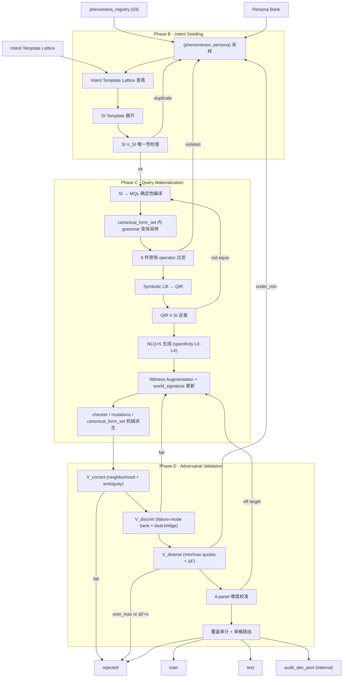

# TEND · 04 · Intent 播种与 Query 物化

> 本卷是 TEND 构造管线 **Phase B · Intent Seeding**、**Phase C · Query Materialization**、**Phase D · Adversarial Validation** 的单一事实源 (SSoT)。上游读取 [03 §5](./03_dataworld_synthesis.md#03-5) 产出的 `phenomena_registry`,下游向 [05 §1](./05_evaluation_methodology.md#05-1) 提交 `certificate.json` 认证的 record。本卷**不**重复定义任务签名、NormExec、gold-as-class、P1-P4 公理、asset 目录、F_topology、36 条 noise taxonomy 与 Phenomena 分类,统一通过交叉引用指向所有权卷。

---

<a id="04-0"></a>
## §04-0 摘要 (Intent-first 立场)

TEND 采取 **Phenomena-First / Intent-First** 管线:先在 Phase A 于 DataWorld 中植入可观测的 `phenomena`,再在 Phase B 用 `(phenomenon_instance, persona)` 在 **Intent Template Lattice** 上播种 **Structured Intent (SI)**,Phase C 由 SI 确定性编译为 MQL 并通过 **Symbolic Lift → QIR** 反向一致性校验,Phase D 以 `V_correct / V_discrim / V_diverse` 三联对抗完成认证。Intent 在本架构中是**第一类上游原子**,不是 MQL 的事后抽象。

### 五条核心原则

1. **Intent 为上游原子**。`SI` 是 `(phenomenon_instance, persona, schema)` → `MQL ∪ NLQ×5 ∪ QIR ∪ canonical_form_set` 之间唯一的公共源节点。任何下游产物 (MQL, NLQ, checker, mutations) 都可以从 SI 机械派生,反之不成立。
2. **QIR 是校验锚,不是生成源**。Symbolic Lift 把具体 MQL 抬升回 QIR 以反查 `≡ SI`,与 SI → MQL 确定性编译构成**双向不动点**,保证 `operator_family` 与 `semantic_kernel` 在 grammar 层变体之间稳定。QIR 从不直接驱动 NLQ 生成。
3. **canonical_form_set 是等价类的机械骨架**。四元组 `(must_contain, must_not_contain, must_contain_at_root, must_not_contain_at_root)` 由 `operator_graph + shape_policy` 可无歧义派生,详见 [01 §3-1](./01_task_definition.md#01-3-1)。
4. **验证三联是构造期闭环,不是离线评测**。`V_correct` 保证语义唯一性,`V_discrim` 保证 witness 判别力,`V_diverse` 保证覆盖无偏,三者任一失败则 record 回流到上游对应相位。
5. **难度是输入,不是输出**。4-panel 在构造期作为**反馈信号**,用于决定是否 `amplify` witness / persona / intent 参数;在评测期作为**观测指标**,经由冻结 20 模型的 4 分位桶 `(pr_small, pr_medium, pr_large, pr_frontier)` 公开。

### 规模画像

- **record 总量**:17,020 条 (见 [02 §2](./02_dataset_design.md#02-2) split)。
- **intent 单元格**:`(phenomenon_class × persona × SI_pattern) ≈ 12 × 5 × 23 → 按 Lattice 有效映射剪枝后 ≈ 1150` 个 (phenom × persona × pattern) 非空格,加上 `(compound_phenom, persona)` 复合条目再扩 ≈200 格。
- **frozen panel**:18–20 个模型,分成 small / medium / large / frontier 四档。
- **SI pattern 族数**:23 (见 [§04-4](#04-4))。
- **failure-mode bank 深度**:≥30 条/族,总库 ≥690 条。

### canonical 示例一句话

在 `orchestra/1001` 上,`(temporal_trend@Attendance + cross_conductor_comparison, analyst)` 经 Intent Template Lattice 映射到 `window_function_with_facet_filter`,编译出包含 `$setWindowFields`、`$facet`、`$ifNull` 的 MQL,Symbolic Lift 回到 QIR 并 `≡ SI`,5 条 NLQ 的 specificity 为 `[L1, L0, L2, L3, L4]`,四 panel 信心为 `(0.0, 0.2, 0.6, 0.2)` → `empirical_difficulty = hard`,world_signature 在 witness 增量注入后冻结为 `sha256:a47f3e...`。

---

<a id="04-1"></a>
## §04-1 管线总览

<a id="04-1-1"></a>
### §04-1-1 端到端流程图



说明:
- `phaseA` 位于 [03 §1](./03_dataworld_synthesis.md#03-1),不在本图内重复。
- 节点 `outTrain/outTest/outRejected` 对外 3 态,`outAuditPool` 是内部 audit dev pool,不对外暴露。
- 所有跨相位回流边 (`fail` → upstream) 统一由 [§04-10-3](#04-10-3) V_diverse 根因反馈协议调度。

<a id="04-1-2"></a>
### §04-1-2 阶段-输入-输出-失败动作表

| 阶段 | 输入 | 输出 | 关键算子 | 失败动作 |
|---|---|---|---|---|
| B1 (phenom, persona) 采样 | `phenomena_registry`, `persona_bank`, 当前 Diversity Budget | `seed_tuple = (phenom_instance, persona_id)` | 权重化抽样 + Lattice 剪枝 | 若 Lattice 映射为 `-` → 重抽 |
| B2 模板查表 | seed_tuple | `template_id` | `Lattice.lookup(phenom_class, persona_id)` | 未命中 → 回 B1 |
| B3 SI 展开 | template + phenom params + schema | `SI.yaml` | 占位符替换 + 参数实例化 | 参数范围越界 → 回 B1 |
| B4 SI 唯一性检查 | `SI.yaml` | `hash_SI` | `≡_SI canonical hash` | 与 registry 重复 → 回 B1 |
| C1 SI → MQL 编译 | `SI.yaml` | `mql_skeleton` | 模式 → stage 骨架查表 | 编译期检测到 6 件禁用 operator → 弃 |
| C2 grammar 变体采样 | skeleton + grammar_seed | `mql_candidate` | `canonical_form_set` 内 surface 变体 | 无变体 Lift 到 ≡ QIR → 回 B1 |
| C3 Symbolic Lift | `mql_candidate` | `QIR_candidate` | DFS + kernel 合成 | Lift 算法无法处理 → 记入 audit |
| C4 QIR ≡ SI 反查 | QIR + SI | bool | 6 子字段等价检查 | 失败 → 重采样 C2 |
| C5 NLQ×5 生成 | SI + schema + sample_data | `nl_queries[0..4]` + `specificity_levels[0..4]` | LLM writer 受控槽位 | 生成失败 → 重新 prompt |
| C6 Witness Augmentation | D + SI + mql_gold | D' + `world_signature'` | P1-P4 gap 检测 + 增量注入 | 无法补齐 → 回 B1 |
| C7 机械派生 | SI + operator_graph | checker.py + mutations + canonical_form_set + AST_check | 规则抽取 | 自洽性自检失败 → 回 C1 |
| D1 V_correct | NLQ + MQL_gold + D + canonical_form_set | 通过/拒绝 | 邻域挖掘 + 歧义攻击 | 拒绝 → `rejected` |
| D2 V_discrim | SI + D + mql_gold | 通过/拒绝 | failure-mode bank + dual-bridge | 拒绝 → 回 C6 witness 增量或回 B1 |
| D3 V_diverse | 当前 cell count + facility-location | 通过/拒绝 | 最小/最大配额 + ΔF 阈值 | 拒绝 → 根因反馈到 A/B/Lattice |
| D4 难度校准 | 4-panel predictions + target_difficulty | `(pr_small, pr_medium, pr_large, pr_frontier)` | 经验直方图 | 偏离 → `amplify` witness 或 persona |
| D5 覆盖审计与路由 | 10-axis grid + split policy | certificate.json + split label | facility-location + quota 调度 | 无覆盖增益 → `rejected` |

---

<a id="04-2"></a>
## §04-2 Persona Bank + Intent Template Lattice

<a id="04-2-1"></a>
### §04-2-1 Persona 目录

**Persona Bank 总数 = 5**,每个 persona 具有 `persona_id`、`framing_style`、`si_pattern_priors` (`pattern_family → prior probability`) 三项固定字段,以及 `linguistic_register` 与 `schema_awareness_baseline` 两项辅助字段。

| persona_id | framing_style | 语言语域 linguistic_register | 默认 schema_awareness_baseline | 典型 intent priorities |
|---|---|---|---|---|
| `analyst` | aggregate / compare / trend | 专业分析语 | medium–high | `top_k_by_aggregate`, `window_function`, `window_function_with_facet_filter`, `percentile_approximation`, `anomaly_vs_baseline`, `facet_split` |
| `ops` | filter / monitor / count | 简短指令语 | low–medium | `simple_filter`, `filter_then_aggregate`, `existential_quantifier`, `coalesce_with_default` |
| `auditor` | cross-reference / integrity | 合规稽核语 | high | `null_vs_missing_disambig`, `lookup_join`, `polymorphic_branch`, `graph_recursive_deep`, `universal_quantifier` |
| `researcher` | distribution / typology | 学术描述语 | medium–high | `time_window_aggregate`, `type_introspection`, `dynamic_key_expansion`, `facet_split`, `anomaly_vs_baseline` |
| `end-user` | lookup / single-record | 口语化 | low | `project_only`, `simple_filter`, `array_positional_select`, `coalesce_with_default` |

`si_pattern_priors` 的完整 23 维概率向量在 `audit/persona_bank.yaml` 固化,下列给出 `analyst` 的摘录示例:

```yaml
persona_id: analyst
framing_style: aggregate_compare_trend
linguistic_register: professional_analytic
schema_awareness_baseline: {min: 0.55, max: 0.85}
si_pattern_priors:
  top_k_by_aggregate: 0.14
  window_function: 0.12
  window_function_with_facet_filter: 0.10
  percentile_approximation: 0.08
  anomaly_vs_baseline: 0.07
  facet_split: 0.07
  filter_then_aggregate: 0.06
  group_then_aggregate: 0.06
  cross_field_ratio: 0.05
  time_window_aggregate: 0.05
  # ... 其余 13 项合计 0.20
```

priors 之和强制为 1.0;Diversity Budget 在每轮采样时对 priors 做 softmax 温度扰动。

<a id="04-2-2"></a>
### §04-2-2 (phenomenon_class × persona) → SI_pattern_family 完整映射

**Lattice 主表**:12 × 5 = 60 格,空格 (`-`) 表示该 (phenom, persona) 对不构成有意义的 intent,采样器会跳过并重抽。`*` 标注的单元格为 canonical 示例关联的映射(通过复合 phenomena 走 §04-2-2-b 表)。

| phenom \ persona | analyst | ops | auditor | researcher | end-user |
|---|---|---|---|---|---|
| **temporal_trend** | `window_function` / `time_window_aggregate` | `filter_then_aggregate` | `null_vs_missing_disambig` | `time_window_aggregate` | - |
| **outlier** | `top_k_by_aggregate` | `existential_quantifier` | `anomaly_vs_baseline` | `facet_split` | - |
| **null_cluster** | `cross_field_ratio` | `coalesce_with_default` | `null_vs_missing_disambig` | `type_introspection` | `project_only` |
| **pollution** | `facet_split` | `simple_filter` | `null_vs_missing_disambig` | `type_introspection` | - |
| **polymorphic_branch** | `facet_split` | `simple_filter` | `polymorphic_branch` | `type_introspection` | `project_only` |
| **graph_cycle** | - | `existential_quantifier` | `graph_recursive_deep` | `graph_recursive_deep` | - |
| **cross_group_comparison** | `window_function_with_facet_filter` `*` | `group_then_aggregate` | `anomaly_vs_baseline` | `facet_split` | - |
| **cardinality_boundary** | `top_k_by_aggregate` | `existential_quantifier` | `universal_quantifier` | `facet_split` | `array_positional_select` |
| **tie_cluster** | `percentile_approximation` | `top_k_by_aggregate` | `universal_quantifier` | `percentile_approximation` | - |
| **dynamic_key** | `dynamic_key_expansion` | `simple_filter` | `type_introspection` | `dynamic_key_expansion` | - |
| **rare_event** | `existential_quantifier` | `existential_quantifier` | `null_vs_missing_disambig` | `anomaly_vs_baseline` | - |
| **type_drift** | `facet_split` | `simple_filter` | `type_introspection` | `type_introspection` | - |

非空格计数:12 × 5 − 11 空格 = **49 格**。

#### §04-2-2-b 复合 phenomena 映射表 (摘录)

当 phenomena_registry 在同一 record 上同时命中两个 phenomenon_class 时,Lattice 允许 `(phenom_A + phenom_B, persona)` 的复合条目优先于单体条目,下列是高频条目:

| 复合 phenom | persona | SI_pattern_family | 备注 |
|---|---|---|---|
| `temporal_trend + cross_group_comparison` | analyst | `window_function_with_facet_filter` | **canonical 示例采用此行** |
| `outlier + null_cluster` | auditor | `anomaly_vs_baseline` | 带 `$ifNull` 基线 |
| `polymorphic_branch + type_drift` | researcher | `type_introspection` | 带 `$switch` 分支 |
| `graph_cycle + cardinality_boundary` | auditor | `graph_recursive_deep` | 带 `maxDepth` 硬上限 |
| `rare_event + tie_cluster` | analyst | `percentile_approximation` | 带 `$median` |
| `dynamic_key + pollution` | researcher | `dynamic_key_expansion` | 带 `$objectToArray` |

复合条目总数 ≈ 200,完整表固化在 `audit/intent_lattice_compound.yaml`。

<a id="04-2-3"></a>
### §04-2-3 Intent Template DSL

每个 Lattice 单元格挂接一到多个 **Intent Template**,Template 是 `(phenomenon_instance, persona, schema) → SI.yaml` 的函数式展开式。DSL 形式如下:

```yaml
template_id: t_window_facet_filter
applicable_phenomena:
  - temporal_trend
  - cross_group_comparison
  - "temporal_trend + cross_group_comparison"
applicable_personas: [analyst]
si_pattern: window_function_with_facet_filter
params_schema:
  window_size:
    type: int
    range: [3, 7]
    default_from: phenomenon_instance.params.window_hint
  partition_by:
    type: field_path
    must_be_in: schema.grouping_fields
  sort_by:
    type: field_path
    must_be_in: schema.temporal_fields
  global_aggregate:
    type: enum
    values: [median, mean, p95]
    default: median
  facet_filter_op:
    type: enum
    values: [gt_global, lt_global, within_global_pm]
    default: gt_global
  output_keys:
    type: field_list
    source: schema.identity_fields ∪ {computed: rolling_avg, global_agg}
si_expansion: |
  intent:
    pattern: window_function_with_facet_filter
    params:
      window_size: {{ window_size }}
      partition_by: "{{ partition_by }}"
      sort_by: "{{ sort_by }}"
      window_agg: mean
      facet_branches:
        A: {filter: "rolling_avg {{ facet_filter_op }} global_{{ global_aggregate }}"}
        B: {filter: "negation_of_A"}
      global_aggregate: {{ global_aggregate }}
  output:
    shape: reshape
    keys: {{ output_keys }}
    types: {{ infer_types(output_keys, schema) }}
    length: unknown
  properties:
    - "每个 partition 内 rolling_avg 按 sort_by 单调时间索引"
    - "facet 分支 A 与 B 互斥且并集等于全集"
    - "global_{{ global_aggregate }} 对所有 partition 共享"
    - "ifNull 保护缺失 sort_by"
  noise_policies:
    applied_layers: [L4_semantic_pollution, L2_null_vs_missing]
    type_ids: [S4_temporal_jitter, N1_sparse_null]
    coupling_operators: ["$ifNull"]
    noise_seed: {{ seed_from_record_id }}
  nosql_nativeness:
    level: L4
    rationale: "facet + window 组合在 SQL 需多次 self-join,NoSQL 管线一步完成"
    sql_infeasibility_class: structural
  canonical_form_set:
    must_contain: ["$setWindowFields", "$facet", "$ifNull"]
    must_not_contain: []
    must_contain_at_root: ["$setWindowFields", "$facet"]
    must_not_contain_at_root: []
postconditions:
  - "AST_check(compiled_mql, canonical_form_set) == pass"
  - "NormExec(compiled_mql, D_canonical) ≢ ∅"
```

DSL 关键约束:
1. `params_schema` 中每个参数必须声明 `type` 与 `range`/`values`,不允许匿名参数。
2. `si_expansion` 为字符串模板,占位符 `{{ ... }}` 由展开器做结构化替换,禁止 eval。
3. `postconditions` 是展开后的自洽自检;失败即拒绝该 template 的此次实例化。
4. `canonical_form_set` 必须与 SI → MQL 编译结果的机械派生值一致 (见 [§04-9-3](#04-9-3))。

---

<a id="04-3"></a>
## §04-3 Intent Seeding

<a id="04-3-1"></a>
### §04-3-1 (phenomenon, persona) 采样

采样器位置:`tools/intent_seeder.py`,输入 `phenomena_registry`、`persona_bank`、当前 `diversity_budget`,输出 `seed_tuple = (phenomenon_instance, persona_id)`。采样分 4 步:

1. **phenom 抽样**:对当前 db 的 `phenomena_registry` 按单元格 under-coverage 权重抽一个 `phenomenon_instance`。若开启复合模式 (`diversity_budget.compound_ratio > 0`),按概率抽取两个独立 phenom 组成复合。
2. **persona 抽样**:给定 phenom_class(或复合),读 Lattice 对应行非空列,作为 `allowed_personas`;在 `allowed_personas` 内按 `persona_bank` 的先验概率与 diversity budget 联合抽样。
3. **Lattice 查表**:`lattice.lookup(phenom_class, persona_id)` 或 `lattice_compound.lookup(phenom_pair, persona_id)`,返回 `template_ids` (允许多个模板,继续抽一个)。若返回 `-` → 回到步 1 重抽。
4. **配额预检**:查 10 轴覆盖表中对应单元格当前计数,若 `count >= max_quota` → 回到步 1。

示例(orchestra/1001):
- phenomena_registry 当前命中:`temporal_trend@Attendance`、`cross_conductor_comparison`、`null_cluster@Name`、`pollution@Attendance`、`cardinality_boundary@orchestra`。
- 复合抽样命中 `(temporal_trend + cross_conductor_comparison)`。
- allowed_personas = {analyst, ops, auditor, researcher};按先验 × diversity budget 抽到 `analyst`。
- lattice_compound.lookup → `template_id = t_window_facet_filter`。
- 单元格当前 count = 7,max_quota = 15,通过。

<a id="04-3-2"></a>
### §04-3-2 SI 模板展开

展开器位置:`tools/intent_expander.py`。输入 `(template, phenomenon_instance, persona, schema)`,输出 `SI.yaml`。关键动作:

1. **参数实例化**:
   - `window_size` ← phenom_instance.params.window_hint ∈ [3, 7];orchestra/1001 取 `3` (phenomenon planting 时已标记的 `windowBaseline=3`)。
   - `partition_by` ← schema.grouping_fields 中与 `cross_conductor_comparison.target_field` 对齐者 → `conductor.Name`。
   - `sort_by` ← schema.temporal_fields → `performance.Year`。
   - `global_aggregate` ← persona.si_pattern_priors 加权 → `median`。
2. **占位符替换**:将 `si_expansion` 中 `{{...}}` 结构化替换,生成中间 `SI_raw`。
3. **类型推断**:对 output.keys 查 schema 的 JSON Schema 得到 `types`;不可推断时记 `any`。
4. **噪声耦合算子提取**:从 phenomenon_instance 的 `noise_reference` 字段读出当前 record 的噪声类型,映射到 `coupling_operators`;orchestra/1001 因 `L2_null_vs_missing` 被触发 → `$ifNull` 加入。
5. **规范化序列化**:按 `SI DSL` 字段字母序序列化为 YAML,记 `SI.canonical_yaml`。
6. **canonical_form_set 派生**:调用 [§04-9-3](#04-9-3) 的派生函数直接产出 `must_contain / must_not_contain / must_contain_at_root / must_not_contain_at_root` 四元组,写回 SI。

输出的 `SI.yaml` 是此 record 的唯一 intent 来源,后续 MQL/NLQ/checker/mutations 全部从它派生。

<a id="04-3-3"></a>
### §04-3-3 SI 语义唯一性与非平凡性初检

展开后的 SI 进入两道快速筛:

1. **≡_SI 唯一性检查**:计算 `hash_SI = sha256(SI.canonical_yaml)` 并在 `si_registry.jsonl` 查重。若已存在 `hash_SI` 相同的 record,且 `db_id` 也相同 → 判为重复,拒绝并回到 §04-3-1。跨 db 的 `hash_SI` 重复允许,因为 schema 绑定使其 witness 完全不同。
2. **非平凡性 (non-triviality) 检查**:
   - 对当前 canonical witness 执行 `NormExec(SI_quick_compile(SI), D_witness)`,检查 `len(result) ≥ 1` 且 `result != preserve(input)`。
   - 若 `result = ∅` → 说明 intent 在此 witness 下无命中证据,拒绝并回到 §04-3-1。
   - 若 `result = preserve(input)` (shape_policy 被错误推断为 `preserve`,但实际是 `reduce/reshape`) → 同样拒绝。
   - `SI_quick_compile` 是 [§04-5-1](#04-5-1) 的简化版,只出 skeleton,不做 grammar 变体。

初检通过的 SI 进入 Phase C 。

---

<a id="04-4"></a>
## §04-4 SI DSL

SI 是 TEND 唯一的 intent 事实源,本节固化其 YAML schema 与 `≡_SI` 规范化等价。

<a id="04-4-1"></a>
### §04-4-1 SI yaml schema

**顶层字段**:`intent / output / properties / noise_policies / nosql_nativeness / canonical_form_set`。补充 `meta` 作为 provenance。

```yaml
# SI.yaml 形式规范
meta:
  record_id: string
  db_id: string
  phenom_refs: list<phenomenon_registry_id>
  persona_id: string
  template_id: string
  schema_fingerprint: sha256
  si_hash: sha256
intent:
  pattern: enum<23_SI_pattern_family>
  params: map<string, primitive|list|map>   # 由 pattern 决定键集合
output:
  shape: enum<preserve | augment | reshape | reduce>
  keys: list<string>                         # 输出记录的键集 (若 shape != scalar)
  types: map<key, json_schema_type>
  length: int | enum<unknown | scalar | singleton>
properties:
  - string                                   # 声明式不变式,多条
noise_policies:
  applied_layers: list<enum<Literal | Structural | Semantic | Historical | Pollution | Type-Polymorphism>>  # 引用 [03 §4-3](./03_dataworld_synthesis.md#03-4-3) 的 6 层分类
  type_ids: list<noise_taxonomy_id>          # 引用 [03 §4-4](./03_dataworld_synthesis.md#03-4-4) 的 36 条 id (形如 L01-L06 / S01-S06 / SE01-SE06 / H01-H06 / P01-P06 / T01-T06)
  coupling_operators: list<$operator>        # MQL 中必须出现的耦合算子
  noise_seed: int                            # 在 ≡_SI 中被忽略
nosql_nativeness:
  level: enum<L0 | L1 | L2 | L3 | L4>
  rationale: string
  sql_infeasibility_class: enum<structural | semantic | performative | feasible>
canonical_form_set:
  must_contain: list<$operator>
  must_not_contain: list<$operator>
  must_contain_at_root: list<$operator>
  must_not_contain_at_root: list<$operator>
```

#### 23 个 SI pattern family 及默认 nosql_nativeness_level

| pattern_id | 默认 level | 典型 output shape | 说明 |
|---|---|---|---|
| `simple_filter` | L0 | preserve | `$match` 单条件 |
| `project_only` | L0 | reshape | `$project` 投影 |
| `filter_then_aggregate` | L1 | reduce | `$match` + `$group` |
| `group_then_aggregate` | L1 | reduce | `$group` 主导 |
| `top_k_by_aggregate` | L2 | reshape | `$group` + `$sort` + `$limit` |
| `time_window_aggregate` | L2 | reshape | 时间桶 `$group` |
| `window_function` | L3 | augment | `$setWindowFields` 滚动 |
| `window_function_with_facet_filter` | L4 | reshape | window + facet + ifNull 复合 |
| `facet_split` | L3 | reshape | `$facet` 多视图 |
| `cross_field_ratio` | L2 | augment | `$addFields` 计算 |
| `anomaly_vs_baseline` | L3 | reshape | window + 阈值 |
| `null_vs_missing_disambig` | L3 | augment | `$ifNull` + `$type` 配合 |
| `coalesce_with_default` | L1 | augment | `$ifNull` |
| `polymorphic_branch` | L3 | reshape | `$switch` 按类型分支 |
| `type_introspection` | L3 | augment | `$type` + `$cond` |
| `dynamic_key_expansion` | L4 | reshape | `$objectToArray` + `$arrayToObject` |
| `array_positional_select` | L1 | augment | `$arrayElemAt` 位置选取 |
| `array_reshape` | L2 | reshape | `$map` + `$filter` 数组变换 |
| `lookup_join` | L2 | reshape | `$lookup` 嵌入 |
| `graph_recursive_deep` | L4 | reshape | `$graphLookup` 变深度 |
| `percentile_approximation` | L3 | reduce | `$median` 或手动百分位 |
| `existential_quantifier` | L1 | reduce | `$expr` + `$anyElementTrue` |
| `universal_quantifier` | L2 | reduce | `$expr` + `$allElementsTrue` |

level 分布标靶:L0 ≤ 10%, L1 ≈ 20%, L2 ≈ 25%, L3 ≈ 25%, L4 ≥ 20%。

<a id="04-4-2"></a>
### §04-4-2 ≡_SI canonical 等价

两条 SI `s1` 与 `s2` 满足 `s1 ≡_SI s2` 当且仅当下列 **7 条**同时成立:

1. `s1.intent.pattern == s2.intent.pattern`。
2. `canonicalize(s1.intent.params) == canonicalize(s2.intent.params)`,其中 `canonicalize` 对 map 键排序、数值类型统一、field_path 规范化、枚举值大小写对齐。
3. `s1.output.shape == s2.output.shape` 且 `multiset(s1.output.keys) == multiset(s2.output.keys)` 且 `s1.output.types == s2.output.types`(按键比较)且 `s1.output.length == s2.output.length` 或两者都是 `unknown`。
4. `multiset(s1.properties) == multiset(s2.properties)`,对声明式不变式做字符串规范化(去空白、小写化保留算子、field_path 规范)后比较。
5. `multiset(s1.noise_policies.applied_layers) == multiset(s2.noise_policies.applied_layers)`,`multiset(..type_ids) == ..`,`multiset(..coupling_operators) == ..`;`noise_seed` 被**忽略**。
6. `s1.nosql_nativeness.level == s2.nosql_nativeness.level` 且 `s1.nosql_nativeness.sql_infeasibility_class == s2.nosql_nativeness.sql_infeasibility_class`;`rationale` 被忽略。
7. `canonical_form_set` 四元组每项按 `$operator` 字典序排序后 multiset 相等。

`≡_SI` 是对称传递自反的等价关系。SI hash `h(s) = sha256(canonical_yaml(s))` 在忽略 `noise_seed/rationale` 之后生成,因此 `s1 ≡_SI s2 ↔ h(s1) = h(s2)`。

---

<a id="04-5"></a>
## §04-5 SI → MQL 确定性编译

<a id="04-5-1"></a>
### §04-5-1 编译器规则 (stage-level expansion)

编译器位置:`tools/si_compiler.py`。核心是 **pattern → 管线骨架 (stage-level)** 查表,骨架只包含 stage 名称顺序,不含 mongosh 字面量。后续 `grammar 变体采样` (§04-5-2) 与 `参数代入` 在骨架之上做具体化。完整 MQL literal 仅在 record 的最终 `answer.mql_pipeline` 字段中留存,本文件不重复。

完整字面量示例参见 [01 §2-2](./01_task_definition.md#01-2-2) 与 [02 §3](./02_dataset_design.md#02-3)。

| pattern_id | 管线骨架 (stage 顺序) |
|---|---|
| `simple_filter` | `[match]` |
| `project_only` | `[project]` |
| `filter_then_aggregate` | `[match, group, project?]` |
| `group_then_aggregate` | `[unwind*, group, project?]` |
| `top_k_by_aggregate` | `[unwind*, group, sort, limit, project?]` |
| `time_window_aggregate` | `[match?, unwind*, addFields(bucket), group, sort, project?]` |
| `window_function` | `[unwind*, setWindowFields, project?]` |
| `window_function_with_facet_filter` | `[unwind*, unwind*, setWindowFields, group, facet, project+filter, unwind, project]` |
| `facet_split` | `[unwind*, facet, project?]` |
| `cross_field_ratio` | `[addFields, project?]` |
| `anomaly_vs_baseline` | `[unwind*, setWindowFields, match(threshold), project?]` |
| `null_vs_missing_disambig` | `[addFields(type+ifNull), project?]` |
| `coalesce_with_default` | `[addFields(ifNull), project?]` |
| `polymorphic_branch` | `[addFields(switch), project?]` |
| `type_introspection` | `[addFields(type+cond), project?]` |
| `dynamic_key_expansion` | `[addFields(objectToArray), unwind, group, addFields(arrayToObject), project?]` |
| `array_positional_select` | `[addFields(arrayElemAt), project?]` |
| `array_reshape` | `[addFields(map|filter), project?]` |
| `lookup_join` | `[lookup, unwind?, project?]` |
| `graph_recursive_deep` | `[graphLookup, addFields?, project?]` |
| `percentile_approximation` | `[unwind*, group(median or manual), project?]` |
| `existential_quantifier` | `[match(expr+anyElementTrue), project?]` |
| `universal_quantifier` | `[match(expr+allElementsTrue), project?]` |

记号:
- `unwind*` 表示 0 到多个 `$unwind`,具体数量由 `F_topology` 与 SI.intent.params 的 `partition_by` 路径决定,详见 [03 §3](./03_dataworld_synthesis.md#03-3)。
- `project?` 为可选 project,受 `output.shape` 决定:shape=preserve 通常省略,shape=reshape 必选。

orchestra/1001 的编译骨架:`[unwind, unwind, setWindowFields, group, facet, project+filter, unwind, project]`。

<a id="04-5-2"></a>
### §04-5-2 canonical_form_set 内的 grammar 变体采样

**同一 SI 可以对应多条 MQL**,这些 MQL 必须全部 `Symbolic Lift` 到 `≡ SI` 的 QIR,且满足相同的 `canonical_form_set` 四元组。此过程称 `grammar variation`。

**变体采样器** 在骨架确定后对每个 stage 选择 surface 形式,受 `grammar_seed` 控制:

| 变体轴 | 典型选项 | 说明 |
|---|---|---|
| `$median` vs 手动 | `$median: {input:..., method:'approximate'}` / `$arrayElemAt` + `$floor` + `$divide` | 二者 QIR `semantic_kernel` 同为 `median` |
| `$ifNull` vs `$cond+$type` | `$ifNull: [$x, default]` / `$cond: [{$eq:[{$type:'$x'},'missing']}, default, $x]` | null/missing 处理等价形式 |
| `$switch` vs 嵌套 `$cond` | `$switch: {branches:[...]}` / 嵌套 `{$cond:[p1, a, {$cond:[p2, b, c]}]}` | 多路分支等价 |
| `$addFields` vs `$project` | `$addFields: {new_k: expr}` / `$project: {other_k:1, new_k:expr}` | 仅当 shape_policy 允许才等价 |
| `$expr+$anyElementTrue` vs `$in` | `$expr: {$anyElementTrue: [...]}` / `$in: [val, array]` | 存在量化等价 |
| `$group` + `$sum:1` vs `$count` | `$group:{_id:..., n:{$sum:1}}` / `$count` | 单一计数场景等价 |

`grammar_seed` 固化在 record.answer.grammar_seed,便于重放;任何变体都必须在 `canonical_form_set` 内 (must_contain 仍匹配)。

orchestra/1001 可行 grammar 变体:
1. `$median` 直用(MongoDB 7.0+)。
2. 手动百分位:`$arrayElemAt` + `$floor` + `$divide` + `$sort`。
3. `$ifNull` 直用 vs `$cond+$type`。
4. 共计 `2 × 2 = 4` 个等价 grammar variant,gold 取 variant 1,其余存入 `canonical_form_set.known_variants[]`(不对外暴露,仅 V_correct 使用)。

<a id="04-5-3"></a>
### §04-5-3 6 件禁用 operator 的编译期过滤

6 件禁用 operator 定义权威在 [01 §2-2](./01_task_definition.md#01-2-2):`$sample`、`$rand`、`$$NOW`、`$out`、`$merge`、`$function`。

编译器在 **骨架生成 + 变体采样** 两步都做静态过滤:

1. **骨架过滤**:23 个 pattern 的骨架预置均不含禁用 operator,若某 SI 参数组合被检测到会产生禁用 operator (例如 persona_id 触发 `$sample` 抽样风格),编译器直接 `raise TemplateInfeasible`,返回回 B1。
2. **变体过滤**:grammar_seed 采样到的变体在序列化为 BSON 前过一次 AST 扫描,命中任一 token `['$sample','$rand','$$NOW','$out','$merge','$function']` → 丢弃变体,回 §04-5-2 重采。若所有候选变体全部被过滤 → 整个 (phenom, persona, schema) 三元组拒绝。
3. **编译期日志**:过滤事件写入 `audit/forbidden_filter.log`,字段 `{record_id, pattern_id, variant_index, forbidden_token}`,供 [05 §4](./05_evaluation_methodology.md#05-4) 核查。

关键不变式:TEND 任何 gold MQL 与 canonical_form_set.known_variants 都**不含**这 6 件 operator。确定性保证了 `NormExec ≡_rec` 在任何执行顺序下稳定 (见 [01 §3](./01_task_definition.md#01-3))。

---

<a id="04-6"></a>
## §04-6 Symbolic Lift → QIR 一致性反查

QIR (Query Intent Representation) 是对 MQL 的**抽象解释语义**。与 SI 不同,QIR 是具体 MQL 被 Lift 回来的结果,承担"校验锚"角色。`SI → MQL → QIR` 构成不动点:若 `Lift(compile(SI)) ≡ SI` 不成立,则 record 拒绝回到上游。

<a id="04-6-1"></a>
### §04-6-1 QIR 6 子字段

QIR 由 6 个正交子字段组成:

| 子字段 | 类型 | 说明 |
|---|---|---|
| `input_shape` | `{collections: list<coll_id>, root_types: map<coll_id, json_schema>, cardinality_hints: map<coll_id, range>}` | 输入集合及其 schema 投影 |
| `semantic_kernel` | `{primary_op: enum, aggregations: list<agg_op>, filters: list<pred_expr>, group_keys: list<field_path>, window_spec: option<window_dsl>, facet_branches: option<list<branch_spec>>, limit: option<int>, sort_keys: list<(field, asc)>}` | 语义核心 DSL,抽象出意图 |
| `operator_graph` | `DAG<stage_node>`,节点 `{stage_type, in_fields, out_fields, effect_kind}` | 规范化 DAG,同构判定用 |
| `null_missing_spec` | `{nulls: list<field_path>, missings: list<field_path>, disambig_strategy: enum<ifNull|type|cond|none>}` | null/missing 处理策略 |
| `shape_policy` | `enum<preserve \| augment \| reshape \| reduce>` | 输出形状策略 |
| `side_effect_flags` | `{read_only: bool, deterministic: bool}` | 副作用与确定性标记,TEND 全部强制 `read_only=true, deterministic=true` |

orchestra/1001 的 QIR 摘录:

```yaml
input_shape:
  collections: [orchestra.conductor]
  root_types: {conductor: {Year_of_Work: int, orchestra: array<orchestra>}}
  cardinality_hints: {conductor: [8, 8]}
semantic_kernel:
  primary_op: window_function_with_facet_filter
  aggregations: [mean:performance.Attendance]
  window_spec: {partition: conductor.Name, sortBy: performance.Year, size: 3, direction: before}
  facet_branches:
    - name: above_global
      filter: rolling_avg > global_median
    - name: below_global
      filter: rolling_avg <= global_median
  group_keys: [conductor.Name]
  sort_keys: [(performance.Year, asc)]
  limit: null
operator_graph: <DAG with 8 stage nodes>
null_missing_spec:
  nulls: [orchestra.conductor.Name]
  missings: [performance.Attendance]
  disambig_strategy: ifNull
shape_policy: reshape
side_effect_flags: {read_only: true, deterministic: true}
```

<a id="04-6-2"></a>
### §04-6-2 Lift 算法

`Lift(mql) → QIR` 采用 DFS + 抽象解释 (Abstract Interpretation),6 步流水:

1. **parse**:把 mongosh pipeline 字符串解析为 AST (stage 列表 → 表达式子树)。
2. **effect analysis**:对每个 stage 推断 `effect_kind ∈ {read, filter, reshape, reduce, augment, window, facet, unwind, lookup, graph}`,配合 `read_only/deterministic` 标记。若检测到禁用 operator → `LiftFail(reason=forbidden_op)`。
3. **field path analysis**:对每个 stage 的 `in_fields/out_fields` 做 field path 传播,构造 schema projection,更新 `input_shape` 与 `null_missing_spec`。
4. **shape inference**:累计 stage 对形状的影响 `(1 → 1 / 1 → many / many → 1 / 1 → aug)`,推断最终 `shape_policy`。
5. **null/missing inference**:扫描 `$ifNull`, `$type`, `$cond` 的出现路径,标注 `nulls/missings/disambig_strategy`。
6. **semantic kernel synthesis**:依 `primary_op` 规则合成 `semantic_kernel.primary_op`,填 `aggregations/filters/group_keys/window_spec/facet_branches/limit/sort_keys`。

`Stage → kernel` 查表(摘录):

| stage | 贡献 |
|---|---|
| `$match` | `filters += [predicate_dsl]` |
| `$group` | `group_keys = [...]`, `aggregations += [...]` |
| `$setWindowFields` | `window_spec = {...}`, `primary_op = window_function` |
| `$facet` | `primary_op = facet_split` 或复合;`facet_branches = [...]` |
| `$sort` | `sort_keys = [(f, dir), ...]` |
| `$limit` | `limit = N` |
| `$unwind` | 影响 `input_shape.cardinality_hints`;不独立改 `primary_op` |
| `$lookup` | `input_shape.collections += [joined_coll]` |
| `$graphLookup` | `primary_op = graph_recursive_deep` |

若两个 stage 组合触发更复杂的 primary_op (如 `$setWindowFields` + `$facet` → `window_function_with_facet_filter`),查 `combination_override` 表。

<a id="04-6-3"></a>
### §04-6-3 QIR 与 SI 的 ≡ 条件

`QIR ≡ SI` 的充要条件为以下 6 条全部满足:

1. **primary_op 等价**:`QIR.semantic_kernel.primary_op` = `SI.intent.pattern`。
2. **operator_graph 同构**:`QIR.operator_graph` 与 `SI.intent.pattern` 对应的骨架 DAG 同构(允许 grammar 变体的节点替换,在 `known_variants` 内)。
3. **shape_policy 匹配**:`QIR.shape_policy` = `SI.output.shape`。
4. **group_keys / window_spec / facet_branches 一致**:按 SI.intent.params 中声明的字段逐项比较。
5. **null_missing_spec 一致**:`QIR.null_missing_spec.disambig_strategy` ∈ SI.noise_policies.coupling_operators 对应策略集合。
6. **side_effect_flags 全真**:`read_only=true, deterministic=true`。

若全部满足 → `≡` 通过,MQL 变体接受。任一条失败 → `≡` 不通过,返回 §04-5-2 重采变体;若 3 次重采仍失败 → 回 §04-3。

<a id="04-6-4"></a>
### §04-6-4 Lift 失败与反馈路径

Lift 可能在以下场景失败 / 返回 `not ≡`:

| 失败类型 | 判定条件 | 反馈路径 |
|---|---|---|
| `forbidden_op` | stage 含 6 件禁用 operator | 直接拒绝变体;全部变体如此 → 回 §04-3 |
| `shape_mismatch` | `QIR.shape_policy ≠ SI.output.shape` | 重采 grammar variant;仍失败 → 标记 template 参数与 schema 冲突,回 §04-3 |
| `kernel_mismatch` | `QIR.semantic_kernel.primary_op ≠ SI.intent.pattern` | 骨架与 SI 不匹配,属编译器 bug → 记入 `audit/compiler_bugs.log`,回 §04-3 |
| `graph_noniso` | `operator_graph` 与骨架非同构 | 变体不在 known_variants 内,拒绝 |
| `null_spec_mismatch` | disambig_strategy 与 coupling_operators 冲突 | 若 `$ifNull` 未出现但 SI 要求 → 变体错误;换变体或 witness 不含 null → 回 witness augmentation |
| `side_effect_violated` | read_only=false 或 deterministic=false | 不可恢复,直接拒绝 |

orchestra/1001 的 Lift 结果:
- variant 1 (`$median` 直用):`≡` 通过。
- variant 2 (手动百分位):`operator_graph` 同构(`$median` 节点被规范化为 `median_kernel`),`≡` 通过。
- variant 3 (`$cond+$type` 代替 `$ifNull`):`null_missing_spec.disambig_strategy = cond`,SI 允许 → `≡` 通过。

---

<a id="04-7"></a>
## §04-7 NLQ × 5 生成

<a id="04-7-1"></a>
### §04-7-1 5 层 specificity 定义 (L0-L4)

每条 record 固定产出 **5 条 NLQ**,对应 5 个互斥的 specificity 层级:

| 层级 | 名称 | 描述 | 典型特征 | SI 展开深度 |
|---|---|---|---|---|
| **L0** | underspecified colloquial | 模糊口语,缺 schema 线索 | 省略字段名、用俗称、省略阈值 | 只展开 `intent.pattern` 顶层语义 |
| **L1** | schema-naive canonical | 无 NoSQL 术语的标准表达 | 用自然语言描述 stage,不涉及 `$` | 展开 intent + 部分 params |
| **L2** | schema-aware | 显式提及字段、集合、键 | 出现 `conductor.Name`、`Year_of_Work` 等 | 展开 intent + 全部 params + output |
| **L3** | NoSQL-jargon | 使用 `$match`、`$facet` 等术语 | 技术语言,接近 MQL 伪码 | 展开 intent + params + properties + stage 名称 |
| **L4** | multilingual or strong colloquial | 多语或重口语 | 中英混杂 / 方言 / 隐喻 | 展开 intent 核心,框架口语化重包装 |

**记录约定**:`nl_queries[0..4]` 与 `specificity_levels[0..4]` 一一对应。顺序规则由 record_id 的 hash 决定,保证 per-record 伪随机但可重现。

orchestra/1001 的 `specificity_levels = [L1, L0, L2, L3, L4]`:
- `nl_queries[0]` = L1 schema-naive canonical NLQ (**默认呈现给评测集的 NL**)。
- `nl_queries[1]` = L0 underspecified。
- `nl_queries[2]` = L2 schema-aware。
- `nl_queries[3]` = L3 jargon。
- `nl_queries[4]` = L4 中英混杂 / colloquial。

`specificity_levels` 的 5-permutation 总数 = 120;在 construction 期对每 record 伪随机抽一个,保证 coverage 的 specificity 轴均衡。

<a id="04-7-2"></a>
### §04-7-2 SI 展开深度 = specificity

NLQ 生成遵循 `specificity = depth(SI 展开)` 的硬约束,展开深度表:

| 深度 | 字段 | 是否对 NLQ 可见 |
|---|---|---|
| 1 | `intent.pattern` | L0 及以上 |
| 2 | `intent.params` (顶层) | L1 及以上 |
| 3 | `intent.params` (全部) | L2 及以上 |
| 4 | `output.shape / output.keys` | L2 及以上 |
| 5 | `properties` | L3 及以上 |
| 6 | canonical stage 名称提示 | L3 及以上 |
| 7 | `noise_policies.coupling_operators` | L3 及以上 |
| 8 | `nosql_nativeness.level` | 仅 L4 允许隐喻地提及 |

**硬约束**:L0 的 NLQ 不得出现任何 schema 字段名;L1 不得出现 `$` 前缀的 operator 术语;L2 不得出现 stage 名 (如 `setWindowFields`);L3 可出现 stage 名但不得出现非公开术语(如 `QIR`);L4 允许跨语言与隐喻但必须仍指向同一 SI。

**specificity 可逆检查**:每条 NLQ 由反向 LLM 做 `NLQ → SI' parse`;若 `SI' ≡_SI SI` 失败 → 写入 `audit/nlq_parse_audit.jsonl` 并回 §04-7-3 重写。

<a id="04-7-3"></a>
### §04-7-3 LLM 作 NLQ writer 的受控槽位

LLM 在本管线中仅被允许**在一个严格槽位**执行一个严格任务:`(SI, schema, sample_data, target_specificity) → NLQ_text`。LLM **不允许**:
- 修改 SI。
- 修改 gold MQL。
- 修改 canonical_form_set。
- 修改 checker / mutations。
- 修改 witness。
- 产生多条 NLQ 之外的任何字段。

**受控 prompt 固定**:`audit/prompts/nlq_writer_prompt.<sha256_fingerprint>.md`,内嵌 `target_specificity` 的展开深度约束、禁词表、长度范围、风格标签。

**prompt 关键区段**(示意):
```
<ROLE>
你是一个受控 NLQ 改写器。你的输入是 SI (YAML)、schema 描述、sample documents、target specificity。
你的输出是一条且仅一条自然语言查询。
禁止输出任何 JSON、任何 SI 字段键、任何算子 $ 前缀(除非 target_specificity == L3 允许)。
</ROLE>
<SPECIFICITY_RULES>
L0: 省略字段名,口语化,可以只描述目标意图。
L1: 用自然语言描述 stage 动作,不得使用 $ 前缀。
L2: 可以显式提及 schema 字段路径。
L3: 可以使用 $match 等算子术语作为伪码提示。
L4: 中英混杂 / 方言 / 隐喻 / 反问句允许,但必须仍能映回同一 SI。
</SPECIFICITY_RULES>
<CONSTRAINTS>
长度: 12-80 tokens。
不得包含: "QIR", "canonical_form_set", "mutation", "panel", "witness"。
</CONSTRAINTS>
```

**输出验证**:LLM 输出通过两关
- 关 1(形式关):长度、禁词、术语合规性静态检查。
- 关 2(语义关):[§04-10-1](#04-10-1) 的 V_correct 语义邻域挖掘。

LLM 产生多样性受到 `specificity_levels` 的强制分层,避免单一风格漂移。

orchestra/1001 的 5 条 NLQ 草稿(翻译自 L1 canonical,仅作示意,非最终):
- L1: "每位指挥家下 3 场演出的 Attendance 滚动平均值,分成高于和低于总体 median 两组,列出 Year 与均值。"
- L0: "对照看看哪些人挣得多哪些人挣得少。"
- L2: "对 conductor.Name 分区,按 performance.Year 排序,取窗口大小 3 的 Attendance 平均,再用 $facet 分成大于和小于 global median 两组,输出指挥家姓名、年份、rolling avg。"
- L3: "用 $setWindowFields 开窗 ($partitionBy=conductor.Name,$sortBy=performance.Year,window=[-2,0]) 得到 rolling_avg,然后 $facet 两支,分支按 rolling_avg 与 $median 的关系过滤。"
- L4: "Hey, 拉一下每个指挥手下最近 3 场演出的出席率滑窗 mean,跟大家的 median 比一比,超过的一伙、不及的一伙,分两路扔出来。"

---

<a id="04-8"></a>
## §04-8 Witness Augmentation

<a id="04-8-1"></a>
### §04-8-1 per-query P1-P4 覆盖检查

TEND 在每条 record 的 MQL gold 确定后,对其 **canonical witness** 做 P1-P4 公理的逐条检查(P1-P4 定义在 [01 §6](./01_task_definition.md#01-6)):

| 公理 | 检查点 | 失败处理 |
|---|---|---|
| **P1 可观测性** | SI.intent.params 中每个 field_path 在 witness 至少有 1 条非空 instance | 缺失 → 注入最小 doc 补齐字段 |
| **P2 K-worlds 判别** | 存在 ≥2 个语义世界 (witness 的变体) 使得 gold 结果可区分 | 不足 → 注入额外 doc 形成第二世界 |
| **P3 tie/null/missing/boundary/noise coupling** | 每个噪声耦合算子 (`$ifNull`, `$type`, 等) 在 witness 上至少被激活 1 次 | 未激活 → 注入 tie/null/boundary doc |
| **P4 gold 基数下限** | gold 结果记录数 ≥ 阈值 (通常 3 或 patern-specific) | 低于阈值 → 注入正样本 doc |

每条 record 产出 `coverage_vector = {P1: bool, P2: bool, P3: bool, P4: bool}` 存入 certificate。

<a id="04-8-2"></a>
### §04-8-2 增量文档注入协议

Augmentation 的三条硬约束:**追加只读** (append-only),**最小化** (minimal doc set),**可追溯** (fully traceable)。

- **追加只读**:新 doc 的 `_id` 必须全新;已存在 doc 的任何字段**不得修改**;已植入 phenomena 的 witness 事实 (tie / boundary / null) **不得被抹除**。
- **最小化**:对每个 gap,注入 doc 数量取 `min_docs_to_cover(gap)`;禁止注入"保险用"冗余 doc。注入器以 `integer programming` 在 witness 模型上求最小可行点。
- **可追溯**:每次注入事件写入 `witness_augmentation_trace.json`,字段 `{record_id, gap_type, injected_doc_ids, reason, timestamp}`。

增量注入的典型场景:
1. **P1 field_path 缺失**:`performance.Attendance` 字段在 8 个 conductor 下有一个 conductor 完全缺失 → 注入 2 条 performance doc 至该 conductor 的 orchestra 下。
2. **P2 K-worlds 不足**:`window size=3` 的 rolling_avg 在 tie 边界上不可区分 → 注入一个 conductor 使得 `rolling_avg == global_median` 恰好成立。
3. **P3 coupling 未激活**:`$ifNull` 在当前 witness 上没有 null 输入 → 注入一条 `Name: null` 的 conductor doc。
4. **P4 gold 基数不够**:`facet.above_global` 分支只有 0 条命中 → 注入一个 conductor 使其分布偏移到 above。

orchestra/1001 的 augmentation 记录:
- gap:P2 中 `rolling_avg = global_median` 的 tie 边界未触发。
- 注入:1 条新 conductor (`Name=null`, 3 场 performance 使其 rolling_avg 精确等于 global median)。
- 此 augmentation 同时覆盖 P3 的 `$ifNull` 激活。
- 注入后 `coverage_vector = {P1: true, P2: true, P3: true, P4: true}`。

<a id="04-8-3"></a>
### §04-8-3 world_signature 更新

witness augmentation 改变了物理 DB 状态,`world_signature` 必须重新计算。协议:

1. 对 augmentation 后的全部 canonical witness doc 做字段路径规范化(按字典序 key、数值类型统一、数组顺序规范化)。
2. 逐 doc 计算 `sha256(canonical_bson(doc))`,按 `_id` 升序连接。
3. `world_signature' = sha256(concat(per_doc_hashes))`。
4. 写回 `mongodb_data/<db_id>.json` 的 `world_signature` 字段;旧 signature 进入 `signature_history[]` 列表(保留不删)。
5. 所有下游 record (同 db_id) 的 `gold_cache` 失效,需重新执行 NormExec。

orchestra/1001 的最终 world_signature = `sha256:a47f3e...`(augmentation 后第 1 次冻结)。

---

<a id="04-9"></a>
## §04-9 checker / mutations / canonical_form_set 机械派生

<a id="04-9-1"></a>
### §04-9-1 checker 从 semantic_kernel 派生

`checker.py` 是 per-record 的 **Python 断言脚本**,输入 `(candidate_result, gold_result, D, SI)`,输出 `{pass: bool, reasons: list<str>}`。它由 `semantic_kernel` 机械派生,每个 quantifier / aggregate / window / predicate 对应一条断言。

**派生规则表**(每条 kernel 元素 → 1 条断言):

| kernel 元素 | Python 断言 |
|---|---|
| `aggregations: [agg_op:field]` | `assert close_enough(compute(agg_op, candidate, field), gold_agg_value, rtol=1e-6)` |
| `group_keys: [k1, k2]` | `assert multiset_of_groups(candidate) == multiset_of_groups(gold)` |
| `window_spec: {partition, sortBy, size}` | `for each partition: assert rolling_monotonic(candidate[partition], sortBy, size)` |
| `facet_branches: [A, B]` | `assert set(candidate.branches) == {"A","B"}; assert disjoint(A, B); assert A ∪ B == universe` |
| `limit: N` | `assert len(candidate) <= N` |
| `sort_keys: [(f, asc)]` | `assert candidate == sorted(candidate, key=f, asc)` |
| `filters: [pred]` | `assert all(pred(doc) for doc in candidate)` |
| `null_missing_spec.disambig_strategy: ifNull` | `assert all("field_result" in doc and doc["field_result"] is not None for doc in candidate)` |
| `shape_policy` | `assert actual_shape(candidate, gold) == expected_shape_policy` |

orchestra/1001 派生的 checker(伪码):

```python
def check(candidate, gold, D, SI):
    reasons = []
    if set(candidate.keys()) != set(gold.keys()):
        reasons.append("facet branch set mismatch")
    for branch in ["above_global", "below_global"]:
        for doc in candidate[branch]:
            if "rolling_avg" not in doc or doc["rolling_avg"] is None:
                reasons.append(f"{branch}: missing or null rolling_avg")
    conductors_cov = {d["conductor_name"] for b in candidate.values() for d in b}
    if conductors_cov != set_of_gold_conductors(gold):
        reasons.append("conductor coverage mismatch")
    if not is_median(global_median_used(candidate), attended_values(D)):
        reasons.append("global_median not median")
    return {"pass": len(reasons) == 0, "reasons": reasons}
```

checker 的长度由 `semantic_kernel` 子字段元素数决定,orchestra/1001 的 checker ~40 行。checker 全部作为 record 附件,参见 [02 §2](./02_dataset_design.md#02-2)。

<a id="04-9-2"></a>
### §04-9-2 mutations 四维全枚举

mutations 是对 gold 的**故意破坏**,用来在评测期区分"蒙对"与"真懂"。四个维度彼此正交:

| 维度 | 子轴 | 说明 | 典型数量 |
|---|---|---|---|
| **A intent params** | window size ±1 | 扰动窗口大小,直观错位 | 2 |
| | facet branch add/remove | 增删分支,破坏 branch set | 2 |
| | agg op swap | 用 mean 代 median / sum 代 count | 3 |
| | group key swap | 换 partition 字段 | 2 |
| | sortBy reverse | 反转排序 | 1 |
| | partition drop | 丢 partition,降维 | 1 |
| | window direction swap | forward ↔ backward | 1 |
| | limit ±k | 截断数不对 | 1 |
| | filter predicate flip | 谓词取反 | 1 |
| **B output shape** | shape_policy adjacent swap | reshape ↔ augment / reduce ↔ reshape | 2 |
| | delete output key | 丢失一个键 | 1 |
| | wrong dtype | 将 int 错标 double | 1 |
| | length wrong | unknown → singleton | 1 |
| | keys reorder | (通常无效,仅敏感任务) | 1 |
| **C noise_policies** | drop coupling operator | 丢 `$ifNull` / `$type` | 2 |
| | wrong type_id | 噪声类型 id 错 | 2 |
| | wrong applied_layer | 层级标错 | 2 |
| | coupling operator replace | `$ifNull` → `$cond+$type` 但没对齐 null 语义 | 1 |
| **D canonical_form_set** | remove must_contain | 丢 `$setWindowFields` | 2 |
| | add must_not_contain_at_root | 强禁某根算子 | 2 |
| | swap root operator | root 换成 `$unwind` | 1 |
| | add must_contain 不该有的 | 加入 `$sample` 等 | 2 |
| | root/non-root 混淆 | 强制非根算子在根 | 1 |

**orchestra/1001 数量**(canonical 分布):
- A = 14
- B = 6
- C = 7
- D = 8
- **总 35**

mutations 序列化为 `mutations.jsonl`,每行一条 `{mutation_id, dim, subaxis, operator, expected_reject: true}`,由 checker 逐条判定应被拒绝。

<a id="04-9-3"></a>
### §04-9-3 canonical_form_set 四元组派生

给定 `operator_graph + shape_policy`,派生规则如下。

**must_contain** (必须出现的 MQL 算子集合):
- 所有 `semantic_kernel.primary_op` 的**核心算子**:例如 `window_function_with_facet_filter` → `{$setWindowFields, $facet}`。
- 所有 `null_missing_spec.disambig_strategy` 的耦合算子:`ifNull → {$ifNull}`、`type → {$type}`、`cond → {$cond}`。
- 所有 `aggregations` 中用到的 accumulator:`{mean} → {$avg}`、`{median} → {$median}` 或手动集合。

**must_contain_at_root** (必须是**顶层 stage** 出现的):
- 对于 primary_op 的主 stage(例如 `$setWindowFields`、`$facet`、`$graphLookup`、`$lookup`)必须位于 root。
- `$group` 如果出现,且 shape_policy = reduce,则位于 root;若 shape_policy = reshape / augment,则 `$group` 可在 facet 分支内。

**must_not_contain** (禁止出现):
- 6 件禁用 operator 总在此;`{$sample, $rand, $$NOW, $out, $merge, $function}` 全入。
- pattern 特定禁止:如 `simple_filter` 禁止 `{$group, $setWindowFields, $facet}`。

**must_not_contain_at_root** (禁止在根出现):
- 对于 `shape_policy ∈ {preserve, augment}`:`{$unwind, $group}` 不得在根(因为它们会改变形状)。
- 对于 `shape_policy = reshape`:`$project` 允许在根;`$unwind` 允许在根(通常必要)。
- 对于 `shape_policy = reduce`:`$group` 必须在根;`$unwind` 允许在根(用于展开嵌套)。

**orchestra/1001 派生结果**:
- must_contain = `[$setWindowFields, $facet, $ifNull]`
- must_not_contain = `[]`
- must_contain_at_root = `[$setWindowFields, $facet]`
- must_not_contain_at_root = `[]`(shape_policy=reshape,$unwind 允许在根)

**AST_check(q, C) 协议**所有权归 [01 §3-1](./01_task_definition.md#01-3),本卷说明其**派生来源**。AST_check 读取 canonical_form_set 四元组,对 `q` 的 AST 做:
1. 收集 `q` 全部出现的 `$operator` → `q_all_ops`。
2. 收集 `q` 根级 stage 的 operator → `q_root_ops`。
3. 检查 `must_contain ⊆ q_all_ops`。
4. 检查 `must_contain_at_root ⊆ q_root_ops`。
5. 检查 `must_not_contain ∩ q_all_ops == ∅`。
6. 检查 `must_not_contain_at_root ∩ q_root_ops == ∅`。
7. 四项全过 → `AST_check = pass`,否则 `fail` 并返回首个失败条款。

<a id="04-9-4"></a>
### §04-9-4 自洽性自检

每条 record 在离开 Phase C 前通过 5 条**自洽性自检** (self-consistency):

1. **gold accept**:`checker(gold_result, gold_result, D, SI).pass == True` 且 `AST_check(gold_mql, canonical_form_set) == pass` 且 `NormExec(gold_mql, D) == gold_result`。
2. **≥3 mutations reject**:从 `mutations.jsonl` 中采样 ≥3 条,对每条构造 `mutated_mql_or_result`,检查 `checker(mutated, gold, D, SI).pass == False`。
3. **oracle 归一后等价**:对 `gold_mql` 与一条 grammar variant 都做 NormExec,结果必 `≡_rec` (NormExec 定义见 [01 §1-4](./01_task_definition.md#01-1-4),≡_rec 定义见 [01 §5](./01_task_definition.md#01-5))。
4. **applied_layer × noise-dim 至少 1 mutation reject**:对每个 `noise_policies.applied_layers[i]`,mutations 中至少有 1 条来自 C 维的对应子轴,且被 checker 拒绝。保证噪声层与 mutations 的关联可观测。
5. **AST_check(gold) = pass**:重复检查(防止骨架变动导致 canonical_form_set 脱同步)。

任一检查失败 → record 回 §04-5 重采 grammar variant,或回 §04-3 重新展开 SI。

---

<a id="04-10"></a>
## §04-10 对抗三联验证

三联 `V_correct / V_discrim / V_diverse` 是构造期的**闭环验证**,顺序为 correct → discrim → diverse → 难度校准 → 路由。本节覆盖前三项的内部机制。

<a id="04-10-1"></a>
### §04-10-1 V_correct: 语义邻域挖掘 + NLQ 歧义攻击

V_correct 的目标:保证 `NLQ_0` (即 `nl_queries[0]`) 的**语义唯一性**且与 gold MQL 形成不可替代的对应。两道工序:

#### 语义邻域挖掘 (Semantic Neighborhood Mining)

- **模型池**:`≥5 LLMs` 跨 `≥2 vendors`(例如 OpenAI + Anthropic + Google + Meta + xAI 中任意 ≥2 家,具体 5 模型当轮从 `mining_pool` 无放回采样)。
- **步骤**:
  1. 每个 LLM 独立读取 `(NLQ_0, schema, sample_data)`,产出 `mql_candidate_i`。
  2. 对每 `mql_candidate_i`,计算两件事:
     - `ast_pass_i = AST_check(mql_candidate_i, canonical_form_set)`
     - `exec_equiv_i = (NormExec(mql_candidate_i, D_canonical) ≡_rec gold_result)`
  3. 按 `(ast_pass_i, exec_equiv_i)` 四元组分类:

    | ast_pass | exec_equiv | 含义 | 动作 |
    |---|---|---|---|
    | true | true | 合法 grammar 变体 | 加入 `canonical_form_set.known_variants`;通过 |
    | true | false | AST 过但执行不等 | 表明 canonical_form_set 过宽 → **V_correct 失败** |
    | false | true | 执行等但 AST 不过 | **关键**:witness 存在语义洞 → **V_correct 失败**,不可用 augmentation 修复 |
    | false | false | 错变体,符合预期 | 通过 |
  4. 关键约束:**任何 `(false, true)` 候选都立刻拒绝 record**,原因是 NLQ 或 SI 的语义允许了一条不在等价类内却在 witness 上同行为的 MQL,这是**语义歧义的结构性证据**。

#### NLQ 歧义攻击 (NLQ Ambiguity Attack)

- **模型**:1 个对抗型 LLM(独立于 neighborhood mining 池的 vendor),prompt 固化为 `audit/prompts/nlq_attack_prompt.<sha256>.md`。
- **任务**:读取 `NLQ_0`(不看 SI, 不看 gold),产出 `5-10 个不同的 SI' 解读`。
- **校验**:
  - 对每个 `SI'_j`,计算 `SI'_j ≡_SI SI`。若所有 `SI'_j` 均 `≡_SI SI` → 无歧义,通过。
  - 若存在 `SI'_j ≠_SI SI`,则调用 `human rater`(来自 A 族 —— V_correct LLM + 人审)判断 `SI'_j` 是否"也合理"。若合理,则 `NLQ_0` 存在歧义 → V_correct 失败;拒绝 record(或回 §04-7 重写 NLQ,但同一 record 最多 2 轮)。

#### 失败反馈

- `(false, true)` 类候选:回 [§04-8](#04-8) witness augmentation(极低概率可修复)或直接拒绝。
- NLQ 歧义:回 §04-7 重写 `nl_queries[0]`;若 2 轮仍歧义 → 拒绝 record。

<a id="04-10-2"></a>
### §04-10-2 V_discrim: 故障模式库 + dual-bridge defeat

V_discrim 的目标:保证 canonical witness 对**错误查询**具有区分力,**杜绝浅层模式匹配蒙对**。

#### Failure Mode Bank

- **规模**:每个 SI_pattern_family 至少 **30 种**典型错误;总库 ≥ 690 条。库位 `audit/failure_mode_bank/<pattern_id>.jsonl`。
- **典型错误分类**:
  - 结构性 miss (miss `$facet`, miss `$setWindowFields`, miss `$unwind`)
  - 错替换 (用 `$group` 代 `$setWindowFields`、用 `$sort + $limit` 代 `$top`)
  - 参数错 (wrong window size, wrong sortBy field, wrong partition_by)
  - null/missing 错 (miss `$ifNull`, wrong `$type` branch)
  - 顺序错 (facet 前后换位导致依赖链断)
  - 边界错 (limit off-by-one, window boundary inclusive/exclusive)
  - 类型错 (accumulator op mismatched dtype)
- **实例化**:针对当前 SI 实例化每条 failure mode,产生 `failure_mql_k`。
- **期望**:`NormExec(failure_mql_k, D_canonical) ≠_rec gold_result`。即 EX 应为 0。
- **阈值**:若超过 **2%** 的 failure mode 实例 `EX = 1` → V_discrim 失败。回 §04-8 witness 增量或回 §04-3 重新 seed。

#### Dual-Bridge Defeat

- **SQL-bridge**:`NLQ_0` → SQL(由 NL2SQL 专家 LLM 翻译)→ `sql_to_mongo` 翻译器 → `mql_sql_bridge`。
- **Template-bridge**:基于 `persona.framing_style` 抽取关键词 → 在 SI pattern 模板库 (独立于 TEND 的 intent template) 做模板匹配 → `mql_template_bridge`。
- **期望**:两桥产物在 canonical witness 上均 `EX = 0 OR QIM = 0`。
- **失败处理**:任一桥命中 `EX = 1 AND QIM = 1` → witness 判别力不足,回 §04-8 witness 增量(尤其是增加 tie / boundary / null 类 doc),若 2 轮不成 → 拒绝 record。

orchestra/1001 的 V_discrim 结果:
- 30 个 failure modes 全部 EX=0。
- SQL-bridge:无法用 SQL 同步 facet + window,翻译失败/生成含 `$function` 被 AST 拒绝 → EX=0。
- Template-bridge:选用 lookup_join 模板(因为 framing 含 "compared with others"),结果结构错位 → EX=0。
- V_discrim 通过。

<a id="04-10-3"></a>
### §04-10-3 V_diverse: min/max 双配额 + 根因反馈

V_diverse 的目标:保证多维覆盖无偏,防止单轴堆积。

#### 10 轴 grid

10 轴定义(与 [02 §2](./02_dataset_design.md#02-2) coverage axes 对齐):
1. db_id (110 个)
2. F_topology (6 层)
3. operator_family / SI_pattern_family (23)
4. nosql_nativeness_level (L0-L4, 5 档)
5. shape_policy (4 档)
6. phenomenon_class (12)
7. persona_id (5)
8. noise layers (6)
9. empirical_difficulty (4 档)
10. specificity × NLQ index 组合 (5 档)

**核心单元格**:`(phenom × persona × SI_pattern)` 的 3D 投影约 1150 格,是 V_diverse 的主要控制面。

#### min/max 双配额

- `min_quota[cell]` 与 `max_quota[cell]` 由 `target_dataset_size` 与 cell 可行性启发式决定。
- 接受规则:
  - 若 `count[cell] < min_quota[cell]`:接受(硬通过)。
  - 若 `min_quota[cell] ≤ count[cell] < max_quota[cell]`:计算 `ΔF`,若 `ΔF ≥ ε` 则接受;否则拒绝(冗余)。
  - 若 `count[cell] ≥ max_quota[cell]`:拒绝(overflow)。

#### Facility-location 增益

- 嵌入模型:固定的 NLQ encoder(例如 `bge-m3`),对 `nl_queries[0]` 编码为 `e_r ∈ R^d`。
- `ΔF(r) = Σ_{r' ∈ pool} max(0, d_min(r') − dist(r, r'))` 的归一化版,或使用 facility-location function
  `F(S) = Σ_v max_{s ∈ S} sim(v, s)`,`ΔF(r) = F(pool ∪ {r}) − F(pool)`。
- `ε` 阈值按 cell 可调,默认 `0.02`(归一化后)。

#### 根因反馈

当 `count[cell] < min_quota[cell]` 长期无法填满,V_diverse 触发**根因反馈** (root-cause feedback):

| 根因类别 | 反馈目标 | 动作 |
|---|---|---|
| phenom 供给不足 | Phase A ([03 §5](./03_dataworld_synthesis.md#03-5)) | 增加该 phenomenon_class 的 planting priority |
| persona 采样不足 | Phase B ([§04-3-1](#04-3-1)) | 提升该 persona 的 sampling weight |
| Lattice 无映射 | [§04-2-2](#04-2-2) | 审查是否需要新增 Lattice 条目或新 template |
| template 参数空间过窄 | [§04-2-3](#04-2-3) | 扩大 params_schema range |
| witness 结构不允许 | Phase A F_topology ([03 §3](./03_dataworld_synthesis.md#03-3)) | 该 db 天然不支持该 pattern,标注并跳过 |

<a id="04-10-4"></a>
### §04-10-4 certificate.json 形态

每条通过三联的 record 产出 `certificate.json`,字段如下:

```yaml
certificate:
  record_id: orchestra/1001
  db_id: orchestra
  si_hash: sha256:...
  world_signature: sha256:a47f3e...
  v_correct:
    neighborhood:
      models: [m1, m2, m3, m4, m5]
      vendors: [v1, v2, v3]
      all_candidates:
        - {model: m1, ast_pass: true,  exec_equiv: true,  action: added_variant}
        - {model: m2, ast_pass: false, exec_equiv: false, action: pass}
        - {model: m3, ast_pass: true,  exec_equiv: true,  action: already_variant}
        - {model: m4, ast_pass: false, exec_equiv: false, action: pass}
        - {model: m5, ast_pass: false, exec_equiv: false, action: pass}
    ambiguity:
      attacker_model: m_attack
      si_candidates_count: 7
      si_equiv_to_gold_count: 7
      ambiguous: false
    pass: true
  v_discrim:
    failure_modes:
      total: 30
      ex_one_count: 0
      threshold: 2%
      pass: true
    dual_bridge:
      sql_bridge: {ex: 0, qim: 0}
      template_bridge: {ex: 0, qim: 0}
      pass: true
    pass: true
  v_diverse:
    cell: [temporal_trend+cross_conductor_comparison, analyst, window_function_with_facet_filter, L4]
    cell_count_before: 7
    min_quota: 5
    max_quota: 15
    delta_f: 0.034
    epsilon: 0.02
    pass: true
  calibration:
    target_difficulty: hard
    pr_small: 0.0
    pr_medium: 0.2
    pr_large: 0.6
    pr_frontier: 0.2
    empirical_difficulty: hard
    amplify_rounds: 0
  routing:
    split: test
    reason: cross_domain_holdout_selected
  panel_disjointness_check:
    A_models: [...]
    B_models: [... frozen 20 ...]
    C_models: [sql_bridge_llm, template_bridge_llm]
    F_models: [subset of B frontier tier]
    A_cap_B: []
    A_cap_C: []
    B_cap_C: []
    passed: true
  timestamp: 2026-02-14T03:27:00Z
  construction_trace: {phase_b_attempts: 1, phase_c_attempts: 1, phase_d_attempts: 1}
```

certificate 作为 train/test 分裂决策的唯一依据;certificate 本身不对外公开,仅内部审计保留。

---

<a id="04-11"></a>
## §04-11 迭代难度校准

<a id="04-11-1"></a>
### §04-11-1 4-panel (small / medium / large / frontier) 定义

4 个 panel 均为构造期冻结模型集合,跨 vendor,承担不同难度信号。总规模 18–20 模型。

| panel | 规模 | tier 定位 | vendor 跨度要求 | 示例模型(仅示意,实际集合在 `audit/panels/frozen_20.yaml` 固化) |
|---|---|---|---|---|
| **small** | 5 | 弱 (1B–3B 级别) | ≥3 vendors | llama-3.2-1b, phi-mini, gemma-2-2b, qwen-2.5-3b, tinyllama-chat |
| **medium** | 5 | 中 (7B–13B 级别) | ≥3 vendors | gpt-3.5 家族, llama-3-8b, mistral-7b-instruct, qwen-2.5-7b, gemma-2-9b |
| **large** | 5 | 强 (顶级开源 + 上一代 frontier) | ≥3 vendors | deepseek-v3, claude-3.5-sonnet, gpt-4-turbo, llama-3.1-70b, mistral-large |
| **frontier** | 3–5 | SOTA (当前最强) | ≥3 vendors | claude-4-opus, gpt-5, gemini-3, grok-4, deepseek-v4(若当期可用) |

**旋转策略**:panel 每轮构造(如每 3 个月)整体冻结,期间模型不可替换;版本号由 `audit/panels/frozen_20.<yyyyqq>.yaml` 记录。评测期沿用构造期 panel(详见 [05 §4](./05_evaluation_methodology.md#05-4) 4-party disjointness)。

<a id="04-11-2"></a>
### §04-11-2 迭代 amplify 协议

目标 difficulty 是**输入** (target_difficulty ∈ {easy, medium, hard, expert}),最终经 4-panel 反馈得到**观测 empirical_difficulty**。amplify 协议是构造期可控闭环。

#### empirical_difficulty 主桶映射 (pr_medium 主桶)

empirical_difficulty 由 pr_medium 主桶决定:

| empirical_difficulty | 判定 |
|---|---|
| easy | `pr_medium ≥ 0.8` |
| medium | `0.5 ≤ pr_medium < 0.8` |
| hard | `0.2 ≤ pr_medium < 0.5` |
| expert | `pr_medium < 0.2` |

主桶跨 panel 扩容稳定性承诺详见 [05 §05-3-4](./05_evaluation_methodology.md#05-3-4)。`pr_small / pr_large / pr_frontier` 不参与主桶判定,仅作为下面 amplify 方向判断的辅助信号与 [05 §05-3](./05_evaluation_methodology.md#05-3) 的并列视图。

#### amplify 方向判断 (4-panel 联合信号)

主桶给出 empirical_difficulty,而 amplify 需要更细粒度的信号决定朝哪个方向用力:

| 模式 | 四元组特征 | amplify 方向 |
|---|---|---|
| 过易 (off-target 向 easy) | `pr_medium ≥ target+1 bucket` 且 `pr_small ≥ 0.4` | 注入 noise 文档、加对抗边界样本 |
| 过易,大模型饱和 | `pr_medium ≥ 0.7` 且 `pr_large ≥ 0.85` | 精化 intent params(`window_size`、facet branch 数) |
| 过难 (off-target 向 expert) | `pr_medium ≤ 0.1` 且 `pr_small = 0` | 回撤 noise、简化 params |
| 过难,frontier 也败 | `pr_frontier ≤ 0.1` | 若 `nosql_nativeness_level` 非 L0,可降一级 |
| 方向难判 | 多 panel 分布不单调 | 先补 witness 覆盖度,再重新 4-panel 评估 |

#### amplify 步骤

1. 第 0 轮构造完成 → 4-panel 预测 → 计算 `(pr_small, pr_medium, pr_large, pr_frontier)`。
2. 若 `empirical_difficulty == target_difficulty` → accept。
3. 若 `empirical_difficulty < target_difficulty`(太容易):
   - 注入更多 noise doc(偏向 Structural / Pollution / Type-Polymorphism 层的 36 条 taxonomy,见 [03 §4-4](./03_dataworld_synthesis.md#03-4-4))。
   - 加 adversarial doc(贴近 tie / boundary)。
   - 精化 intent params(如 `window_size` 从 3 → 5,facet branch 从 2 → 3)。
4. 若 `empirical_difficulty > target_difficulty`(太难):
   - 减少 noise doc。
   - 简化 intent params。
   - 降低 `nosql_nativeness_level` 若参数允许。
5. 重新 4-panel 预测。
6. 最多 **3 轮**迭代。
7. 若 3 轮后仍偏离:record 转去 **`empirical_difficulty` 实际落入的桶**,不再 amplify。若落入桶已满(max_quota) → rejected。

#### amplify 的三条硬约束

- **只改 witness 与 params**,不改 SI.intent.pattern、不改 canonical_form_set、不改 gold MQL skeleton。
- **不影响 P1-P4 公理**,每轮 amplify 后重做 §04-8-1 检查。
- **amplify trace 全保留**,每轮 witness diff 写入 `audit/amplify_trace/<record_id>.jsonl`。

orchestra/1001 的 amplify:第 0 轮已达 `hard`,`amplify_rounds = 0`。

<a id="04-11-3"></a>
### §04-11-3 4 方 panel disjointness 构造期检查

TEND 在构造期与评测期双重强制 4 方不相交。本节说明**构造期**检查,评测期对偶检查在 [05 §4](./05_evaluation_methodology.md#05-4)。

#### 4 方定义

| 方 | 含义 | 典型组成 |
|---|---|---|
| **A** | V_correct LLM + 人审 | neighborhood mining 池 + ambiguity attacker + 人类复审 rater |
| **B** | 4-panel 冻结 20 模型 | small + medium + large + frontier,全部 |
| **C** | V_discrim dual-bridge LLMs | NL2SQL 翻译器 + template-bridge 生成器 |
| **F** | frontier panel(仅 D 末段与 B 合并管理) | B 的 frontier 子集 |

#### 不相交规则

- `A ∩ B = ∅`:V_correct 用的 LLM 不得进入 4-panel。
- `A ∩ C = ∅`:V_correct 与 V_discrim 用不同模型。
- `B ∩ C = ∅`:4-panel 不得参与 dual-bridge。
- `F ⊆ B`:frontier 是 B 的子集,其评测逻辑在 D 末段合并管理。

#### 构造期检查点

- 每个 record 的 certificate.json 自报 `A_models / B_models / C_models / F_models`,管线在 record 写盘前做集合交集校验,任何非空交集 → **record 作废**。
- 每日批量再做一次 `audit/panel_disjointness_daily.report`,汇总当日所有 record 的 panel 使用情况。

#### 评测期冻结

- 构造期结束后 panel 集合冻结,写入 `audit/panels/frozen_20.<yyyyqq>.yaml` 并 sha256 签名。
- 任何对评测时使用的模型,必须在**评测期**也做 4 方 disjointness 检查,确保 A/B/C 对被评 model 都不重合。见 [05 §4](./05_evaluation_methodology.md#05-4)。

---

<a id="04-12"></a>
## §04-12 覆盖审计与单桶路由

<a id="04-12-1"></a>
### §04-12-1 嵌入覆盖 facility-location

#### facility-location 函数

设 `U` 为当前 pool 中的 record 嵌入集合,`v` 为候选 record 嵌入,`sim(v, s)` 为余弦相似度:

$$F(S) = \sum_{v \in U} \max_{s \in S} \mathrm{sim}(v, s)$$

$$\Delta F(r) = F(S \cup \{r\}) - F(S)$$

> 注:此处 `r` 为候选 record 本身,`S` 为当前 pool;`U` 为参考宇宙,可取 pool 与一个预定义 reference bank 的并集。

#### gain 阈值

- cell-wise 阈值 `ε_cell` 默认 `0.02`(归一化 F 值)。
- 跨 cell 全局阈值 `ε_global = 0.005`,防止 cell 内无增益 record 被全局抢占。
- `ΔF < ε_cell` → 拒绝;`ΔF ∈ [ε_cell, ε_global)` → 转入 audit_dev_pool;`ΔF ≥ ε_global` → 通过全局覆盖。

#### 多轴增益拆解

`ΔF` 可拆为 `ΔF_nlq + ΔF_params + ΔF_shape` 三个正交子增益,便于根因反馈 (§04-10-3)。默认总 `ΔF` 作为接受信号,拆分仅在 overflow 分析时使用。

<a id="04-12-2"></a>
### §04-12-2 routing 四态

TEND 构造期共 4 个内部状态:`train / test / audit_dev_pool / rejected`;对外只公开 3 态 `train / test / rejected`,`audit_dev_pool` 仅供内部审计。

#### 路由伪码

```python
def route(record, cert):
    if not (cert.v_correct.pass and cert.v_discrim.pass and cert.v_diverse.pass):
        return "rejected"
    if not cert.panel_disjointness_check.passed:
        return "rejected"
    if cert.calibration.empirical_difficulty != cert.calibration.target_difficulty \
       and cert.calibration.amplify_rounds >= 3:
        bucket = cert.calibration.empirical_difficulty
        if quota_full(bucket):
            return "rejected"

    if record.db_id in HOLDOUT_DBS:
        return "test"
    if record.cell_delta_f < EPSILON_GLOBAL:
        return "audit_dev_pool"
    split_rand = hash(record.record_id + split_seed) % 100
    if split_rand < TEST_PROPORTION_PCT:
        return "test"
    else:
        return "train"
```

#### 内外 3/4 态映射

- 内部 4 态:`train, test, audit_dev_pool, rejected`
- 外部 3 态:`train, test, rejected`
- `audit_dev_pool` 映射到**不公开**;在发布包 [02 §3](./02_dataset_design.md#02-3) 的 split label 中不出现。

#### 跨 db 保障

`HOLDOUT_DBS` 是按 `db_id` 做 holdout 的集合;整个 db 要么在 train,要么在 test,`holdout` 保证 **cross-domain test** 的独立性。详见 [02 §2](./02_dataset_design.md#02-2)。

---

<a id="04-13"></a>
## §04-13 canonical 示例 (orchestra/1001) 端到端

本节以 `orchestra/1001` 为例完整走通 Phase B → C → D。所有数值与上游 canonical 快照严格对齐。

### 13.1 Phase A 传入事实(来自 [03 §5](./03_dataworld_synthesis.md#03-5))

- db_id = `orchestra`,F_topology = `topoE3` (tier-E three-level embedded)。
- schema: `conductor → orchestra[] → performance[]`;`conductor.Name` sparse。
- 已注册 phenomena:
  - `temporal_trend@Attendance` (params: window_hint=3)
  - `cross_conductor_comparison`
  - `null_cluster@Name`
  - `pollution@Attendance`(噪声耦合 `$ifNull`)
  - `cardinality_boundary@orchestra`(8 个 conductor)
- world_signature (augmentation 前) = `sha256:...old...`

### 13.2 Phase B · Intent Seeding

- **(phenom, persona) 采样**:
  - phenom 复合抽样命中 `(temporal_trend + cross_conductor_comparison)`。
  - persona 按先验抽 `analyst`。
- **Lattice 查表**:`lattice_compound.lookup((temporal_trend + cross_conductor_comparison), analyst)` → `template_id = t_window_facet_filter`。
- **SI 模板展开**:参数 `window_size=3, partition_by=conductor.Name, sort_by=performance.Year, global_aggregate=median, facet_filter_op=gt_global`。
- **SI 关键字段**(摘录):
  ```yaml
  intent:
    pattern: window_function_with_facet_filter
    params: {window_size: 3, partition_by: conductor.Name, sort_by: performance.Year, window_agg: mean, global_aggregate: median, facet_filter_op: gt_global}
  output:
    shape: reshape
    keys: [conductor_name, year, rolling_avg, bucket]
    types: {conductor_name: string_or_null, year: int, rolling_avg: double, bucket: enum}
    length: unknown
  properties:
    - "每个 partition 内 rolling_avg 按 sort_by 单调时间索引"
    - "facet 分支 above/below 互斥且并集等于全集"
    - "global_median 对所有 partition 共享"
    - "ifNull 保护缺失 Name"
  noise_policies:
    applied_layers: [L4_semantic_pollution, L2_null_vs_missing]
    type_ids: [S4_temporal_jitter, N1_sparse_null]
    coupling_operators: ["$ifNull"]
  nosql_nativeness:
    level: L4
    sql_infeasibility_class: structural
  canonical_form_set:
    must_contain: ["$setWindowFields", "$facet", "$ifNull"]
    must_contain_at_root: ["$setWindowFields", "$facet"]
    must_not_contain: []
    must_not_contain_at_root: []
  ```
- **SI ≡_SI 唯一性**:hash = `sha256:<si_hash>`,未在 si_registry 出现 → 通过。
- **非平凡性初检**:快速编译得 skeleton `[unwind, unwind, setWindowFields, group, facet, project, unwind, project]`,在 pre-augmentation witness 上 NormExec 返回 4 条 docs → 通过。

### 13.3 Phase C · Query Materialization

- **SI → MQL 编译**:骨架 `[unwind, unwind, setWindowFields, group, facet, project+filter, unwind, project]`。
- **grammar 变体**:variant 1 用 `$median` 直用 + `$ifNull` 直用。variant 2 用手动 `$arrayElemAt` + `$ifNull`。variant 3 用 `$median` + `$cond+$type`。variant 4 用手动百分位 + `$cond+$type`。
- **6 件禁用 operator 过滤**:静态扫描 4 个变体无一命中禁词 → 通过。
- **Symbolic Lift**:对 variant 1 Lift 得 QIR:
  - primary_op = `window_function_with_facet_filter`,shape_policy = `reshape`。
  - operator_graph DAG 同构于骨架。
  - null_missing_spec.disambig_strategy = `ifNull`。
  - `≡ SI` 通过。
  - variant 2/3/4 同样 Lift 通过 → 加入 canonical_form_set.known_variants。
  - **gold MQL 取 variant 1**。
- **NLQ×5 生成**(见 §04-7-3 草稿),`specificity_levels = [L1, L0, L2, L3, L4]`。
- **Witness Augmentation**:
  - P2 检测到 `rolling_avg = global_median` tie 边界未触发 → 注入 1 条 conductor(`Name=null`, 3 场 performance,精确贴边)。
  - 该注入同时覆盖 P3 的 `$ifNull` 激活。
  - world_signature 重算:`sha256:a47f3e...`。
  - 存入 `witness_augmentation_trace.json`:`{record_id: orchestra/1001, gap_type: [P2_tie, P3_ifnull], injected_doc_ids: [c_009], reason: tie_boundary, ts: ...}`。
- **机械派生**:
  - checker 40 行,断言覆盖 facet 分支集、rolling_avg 非空、conductor 覆盖、global_median 是 median。
  - mutations: A=14, B=6, C=7, D=8, 共 **35 条**,每条 `expected_reject=True`。
  - canonical_form_set 四元组上文已给。
- **自洽性自检**:5 条全通过;gold accept,随机 5 条 mutation 全部 reject,oracle NormExec ≡_rec gold,每个 applied_layer 至少 1 条 C 维 mutation 被 reject,AST_check(gold)=pass。

### 13.4 Phase D · Adversarial Validation

- **V_correct**:
  - neighborhood mining:5 LLMs 跨 3 vendors;
    - m1 (vendor A): ast_pass=false, exec_equiv=false → 误解为 per-orchestra window(良性错误)。
    - m2 (vendor A): ast_pass=false, exec_equiv=false → 漏 `$facet`。
    - m3 (vendor B): ast_pass=true, exec_equiv=true → 使用 `$median` accumulator,加入 known_variants(事实上已存在)。
    - m4 (vendor C): ast_pass=true, exec_equiv=true → 使用 gold 同骨架,正常。
    - m5 (vendor C): ast_pass=true, exec_equiv=true → 同 m4。
  - `(false, true)` 候选数 = 0 → 通过。
  - ambiguity attack:7 个 `SI'`,全部 `≡_SI SI` → 无歧义。
  - **V_correct pass**。
- **V_discrim**:
  - 30 条 failure modes,全部 EX=0。
  - SQL-bridge:翻译失败(SQL 不能表达 facet 与 window 同时存在)→ EX=0。
  - Template-bridge:选到 lookup_join 模板(被 "compared with others" 关键词误导)→ EX=0。
  - **V_discrim pass**。
- **V_diverse**:
  - cell = `(temporal_trend+cross_conductor_comparison, analyst, window_function_with_facet_filter, L4)`。
  - 当前 count = 7,min_quota = 5,max_quota = 15。
  - ΔF = 0.034,ε_cell = 0.02 → ΔF ≥ ε_cell → 通过。
  - **V_diverse pass**。
- **难度校准**:
  - 4-panel 预测:
    - small: 0/5 正确 → `pr_small = 0.0`
    - medium: 1/5 正确 → `pr_medium = 0.2`
    - large: 3/5 正确 → `pr_large = 0.6`
    - frontier: 1/5 正确(假设 frontier 用 5 模型)→ `pr_frontier = 0.2`
  - empirical_difficulty = `hard`,target = `hard` → 无 amplify。
- **panel disjointness 检查**:A/B/C/F 集合计算 → 全 ∅ → 通过。
- **certificate.json** 写盘,含以上所有字段。

### 13.5 Routing

- `orchestra` 在 HOLDOUT_DBS 内(即跨域 holdout) → routing 为 `test`。
- 写入 `test.jsonl`。

### 13.6 最终 record 概览(快照)

| 字段 | 值 |
|---|---|
| db_id / record_id | `orchestra / 1001` |
| operator_family | `window_function_with_facet_filter` |
| nosql_nativeness_level | `L4` |
| shape_policy | `reshape` |
| (pr_small, pr_medium, pr_large, pr_frontier) | `(0.0, 0.2, 0.6, 0.2)` |
| empirical_difficulty | `hard` |
| world_signature | `sha256:a47f3e...` |
| specificity_levels | `[L1, L0, L2, L3, L4]` |
| canonical_form_set.must_contain | `["$setWindowFields","$facet","$ifNull"]` |
| canonical_form_set.must_contain_at_root | `["$setWindowFields","$facet"]` |
| mutations 总数 | `35 (A=14, B=6, C=7, D=8)` |

---

<a id="04-14"></a>
## §04-14 符号表

| 符号 | 含义 | 定义处 |
|---|---|---|
| `SI` | Structured Intent,intent 第一类原子 | [§04-4](#04-4) |
| `≡_SI` | SI canonical 等价,7 条件 | [§04-4-2](#04-4-2) |
| `hash_SI` | `sha256(canonical_yaml(SI))` | [§04-4-2](#04-4-2) |
| `persona_bank` | 5 persona 目录 | [§04-2-1](#04-2-1) |
| `Intent Template Lattice` | (phenom × persona) → pattern 映射 | [§04-2-2](#04-2-2) |
| `Intent Template DSL` | (phenom_instance, persona, schema) → SI 展开器 | [§04-2-3](#04-2-3) |
| `si_registry` | 全体已构造 SI 的 hash 注册表 | [§04-3-3](#04-3-3) |
| `QIR` | Query Intent Representation,抽象解释语义 | [§04-6](#04-6) |
| `Lift` | MQL → QIR 反向抽取算法 | [§04-6-2](#04-6-2) |
| `canonical_form_set` | gold 的等价类四元组骨架 | [§04-9-3](#04-9-3);引用权在 [01 §3-1](./01_task_definition.md#01-3) |
| `AST_check(q, C)` | q 的 AST 相对四元组 C 的检查 | [§04-9-3](#04-9-3);所有权 [01 §3-1](./01_task_definition.md#01-3) |
| `NormExec` | 结果归一化执行 | [01 §1-4](./01_task_definition.md#01-1-4) |
| `≡_rec` | record 级结果等价 | [01 §5](./01_task_definition.md#01-5) |
| `P1-P4` | 4 公理:可观测、K-worlds、tie/null/boundary/noise、gold 基数 | [01 §6](./01_task_definition.md#01-6) |
| `F_topology` | schema 拓扑族,6 层 | [03 §3](./03_dataworld_synthesis.md#03-3) |
| `phenomena_registry` | phenom 事实登记表 | [03 §5-3](./03_dataworld_synthesis.md#03-5-3) |
| `phenomenon_class` | 12 类现象分类 | [03 §5-1](./03_dataworld_synthesis.md#03-5-1) |
| `noise_taxonomy` | 36 条噪声分类 | [03 §4-4](./03_dataworld_synthesis.md#03-4-4) |
| `V_correct` | 语义邻域挖掘 + NLQ 歧义攻击 | [§04-10-1](#04-10-1) |
| `V_discrim` | failure-mode bank + dual-bridge defeat | [§04-10-2](#04-10-2) |
| `V_diverse` | min/max 双配额 + facility-location | [§04-10-3](#04-10-3) |
| `certificate.json` | per-record 认证包 | [§04-10-4](#04-10-4) |
| `4-panel` | small / medium / large / frontier 构造期 panel | [§04-11-1](#04-11-1) |
| `pr_{small,medium,large,frontier}` | 4 panel 的平均 EX | [§04-11-2](#04-11-2) |
| `empirical_difficulty` | (easy / medium / hard / expert) 4 桶 | [§04-11-2](#04-11-2) |
| `target_difficulty` | 构造期输入的目标难度 | [§04-11-2](#04-11-2) |
| `amplify_rounds` | 迭代 amplify 轮数,≤3 | [§04-11-2](#04-11-2) |
| `A / B / C / F` | 4 方 panel 集合 | [§04-11-3](#04-11-3) |
| `ΔF` | facility-location 增益 | [§04-12-1](#04-12-1) |
| `ε_cell / ε_global` | facility-location 阈值 | [§04-12-1](#04-12-1) |
| `routing` | 4 态路由:train / test / audit_dev_pool / rejected | [§04-12-2](#04-12-2) |
| `world_signature` | canonical witness 规范化 BSON 之 sha256 | [§04-8-3](#04-8-3) |
| `witness_augmentation_trace.json` | witness 增量注入日志 | [§04-8-2](#04-8-2) |
| `grammar_seed` | grammar 变体采样随机种子 | [§04-5-2](#04-5-2) |
| `known_variants` | canonical_form_set 允许的等价 grammar 变体集合 | [§04-5-2](#04-5-2) |
| `specificity_levels` | 每 record 的 5 条 NLQ 的 specificity 排列 | [§04-7-1](#04-7-1) |
| `nlq_writer_prompt` | LLM NLQ 生成受控 prompt | [§04-7-3](#04-7-3) |
| `failure_mode_bank` | 每 pattern ≥30 错误模式库 | [§04-10-2](#04-10-2) |
| `dual_bridge` | SQL-bridge + Template-bridge | [§04-10-2](#04-10-2) |
| `6 件禁用 operator` | `{$sample,$rand,$$NOW,$out,$merge,$function}` | [01 §2-2](./01_task_definition.md#01-2-2) |

---

> **本卷职责结束于:** 每条 record 的 `certificate.json` 附随其 routing 决策(train / test / audit_dev_pool / rejected)送达 [02 §3](./02_dataset_design.md#02-3) 的发布管线。评测阶段的 7 指标、4-panel 报告、4 方对偶 disjointness、披露规范由 [05](./05_evaluation_methodology.md) 负责。求解器侧的 SMART 协议、solver 边界由 [06](./06_solution_design.md) 负责。
