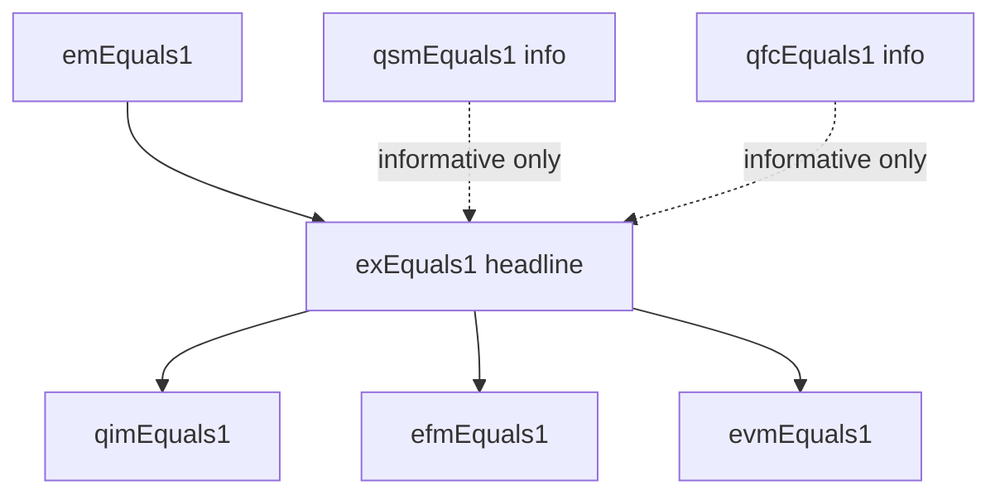

# 05 · 评测方法论 (Evaluation Methodology)

<a id="05-0"></a>
## 05-0 摘要

本文件是 **TEND 评测层的唯一真相源 (SSoT)**。它回答一个单一问题:**当求解器 solver 读入一条测试记录的窄可见面并产出一条 MQL `q_p` 之后,评测管线如何把 `q_p` 映射到一个 7 比特的指纹,并把这些指纹聚合成可以被学界引用的数字?**

评测层明确不回答以下问题,这些问题由其他 SSoT 负责:

| 不在本文件定义 | 所在 SSoT |
|---|---|
| 任务签名 / `NormExec` / `≡_rec` / Norm 四层契约 | [01 §3](./01_task_definition.md#01-3) / [01 §4](./01_task_definition.md#01-4) / [01 §5](./01_task_definition.md#01-5) |
| Gold 的等价类定义 (gold-as-class) | [01 §3-1](./01_task_definition.md#01-3-1) |
| 3 层正确性保证 | [01 §3-2](./01_task_definition.md#01-3-2) |
| 记录字段契约 (含 `canonical_form_set` 为必填) | [02 §2](./02_dataset_design.md#02-2) |
| 10 轴覆盖 | [02 §5-3](./02_dataset_design.md#02-5-3) |
| phenomena_registry 外部视图 | [02 §3-3](./02_dataset_design.md#02-3-3) |
| Phenomena 分类学 12 类 | [03 §5-1](./03_dataworld_synthesis.md#03-5-1) |
| Persona Bank + Intent Template Lattice | [04 §2](./04_intent_to_query_construction.md#04-2) |
| SI DSL + `≡_SI` | [04 §4](./04_intent_to_query_construction.md#04-4) |
| `canonical_form_set` 机械派生 | [04 §9](./04_intent_to_query_construction.md#04-9) |
| V_correct / V_discrim / V_diverse 判官 | [04 §10](./04_intent_to_query_construction.md#04-10) |
| 4-panel + 迭代难度估计 | [04 §11](./04_intent_to_query_construction.md#04-11) |
| Solver 侧 disjointness 对偶 | [06 §4](./06_solution_design.md#06-4) |

### 本文件自身承担的概念

1. **7 个评测指标的严格公式**:EM / QSM / QFC / **EX** / EFM / EVM / **QIM**。
2. **EX 的双条件定义**——这是本架构最核心的评测承诺:
   - (a) `AST_check(q_p, C) = pass`,其中 `C = record.canonical_form_set`
   - (b) `NormExec(q_p, D) ≡_rec NormExec(q_g, D)`,其中 `q_g = record.MQL`
3. **QIM 的新定位**:`QIM` 正好是 EX 的结构半——`EX = 1 ⟹ QIM = 1` 是本架构下的**严格蕴含**,不再允许 `QIM=0 ∧ EX=1` 的组合。
4. **7 比特指纹** `(EM, QSM, QFC, EX, EFM, EVM, QIM)` 是每条记录的最小评测产物。
5. **评测协议**:数据接入、solver 可读面、执行流伪代码、切片维度、环境契约。
6. **Multi-panel 难度报告**:pr 四元组 (pr_small, pr_medium, pr_large, **pr_frontier**)、ceiling-aware scoring、panel 扩展协议、主桶稳定性。
7. **四方 disjointness**:A (V_correct) / B (4-panel 20 冻结模型) / C (V_discrim dual-bridge) / F (frontier 子集,隶属 B) 的两两互斥以及 solver 对偶。
8. **强制披露清单** (12+ 条)。
9. **orchestra/1001 典范示例的三种评测实例**。

### headline 与诊断 proxy

- **Headline = EX**。任何 TEND 上的结果公示,第一位数字永远是 EX。
- 其余 6 个指标 (EM / QSM / QFC / EFM / EVM / QIM) 是**诊断 proxy**,用于定位失败原因、描绘 solver 行为肖像、支撑消融分析,但**不能替代 EX 作为首要分数**。
- Ceiling-aware scoring (difficulty-weighted EX) 是 EX 的**补充视图**,不替代 EX。

### 硬承诺

- 任何报告 TEND 分数的论文/博客/公告,必须同时披露:7 指标 3 级聚合、4-panel pr 四元组、四方 disjointness 验证时间戳、所用 solver 的 LLM 骨干 ID 清单。详见 [§05-5](#05-5)。
- 评测期启动时会对 solver 的 LLM 骨干做一次 `S ∩ A = S ∩ B = S ∩ C = ∅` 的硬门禁;任何一端违反则本次评测被标记 `disjointness_violation` 并拒绝汇入官方 leaderboard。

---

<a id="05-1"></a>
## 05-1 七评测指标

本节给出 7 个评测指标的严格公式与计算步骤。所有指标都基于**单条记录**定义,聚合规则在 [§05-2-4](#05-2-4) 给出。

符号约定:

| 符号 | 含义 |
|---|---|
| `q_p` | solver 产出的 MQL 字符串 |
| `q_g` | `record.MQL`,该条记录的代表性 MQL (位于 `canonical_form_set` 等价类内) |
| `D` | 该条记录 `record.db_id` 对应的 witness 数据库实例 |
| `C` | `record.canonical_form_set`,四元组 `(must_contain, must_contain_at_root, must_not_contain, must_not_contain_at_root)` |
| `Parse(·)` | MQL 字符串 → MQL AST 的解析函数;失败时返回 ⊥ |
| `NormExec(q, D)` | 在 witness `D` 上以归一化执行 `q` 的结果序列,定义见 [01 §4](./01_task_definition.md#01-4) |
| `≡_rec` | 记录级等价关系,定义见 [01 §5](./01_task_definition.md#01-5) |

<a id="05-1-1"></a>
### 05-1-1 EM (Exact Match)

**定义**:

$$
\mathrm{EM}(q_p, q_g) = \mathbb{1}\!\left[\ \mathrm{canonical\_text}(q_p) = \mathrm{canonical\_text}(q_g)\ \right]
$$

**`canonical_text` 归一化三步**:

1. **Tokenize**:将 MQL 字符串按 mongosh 解析规则切分成 token 流,丢弃注释与多余空白。
2. **JSON Canonicalize**:对每个 JSON 对象字面量按键名字典序排序,字符串统一用双引号,数值统一用 IEEE 754 最短表示。
3. **Whitespace Normalize**:token 之间合并连续空白为单个空格,首尾 `trim`。

**讨论**:EM 极度苛刻,即使语义正确、结构相同、仅变量命名或字段顺序差异都会导致 EM = 0。EM 主要用于**识别 solver 是否在记忆训练集文本**,不是质量指标。

<a id="05-1-2"></a>
### 05-1-2 QSM (Query Structure Match)

**定义**:

$$
\mathrm{QSM}(q_p, q_g) = \mathbb{1}\!\left[\ \mathrm{tree\_equal}_\text{struct}(\mathrm{Parse}(q_p),\ \mathrm{Parse}(q_g))\ \right]
$$

其中 `tree_equal_struct` 是**结构专用相等** (structure_only mode),比较步骤:

| 步骤 | 规则 |
|---|---|
| S1 Stage 序列 | 两棵 AST 的 pipeline stage 序列完全一致 (`$match`/`$group`/...) |
| S2 算子 token 包 | 每一 stage 内所有算子 token 的**多重集**相等 (例如 `$sum` 出现次数相同) |
| S3 字段路径屏蔽 | 所有 `$field` 或 `field.subfield` 形式的字段路径替换为占位符 `<F>` |
| S4 字面量屏蔽 | 所有常量字面量 (数字/字符串/布尔/日期) 替换为占位符 `<LIT>` |

通过以上四步后两树按结构比较,每一对应位置相等则 QSM = 1。

**讨论**:QSM 容忍字段名、值、别名的差异,但**不容忍 stage 顺序或算子集合变化**。用于识别 solver 是否掌握"查询骨架"。

<a id="05-1-3"></a>
### 05-1-3 QFC (Query Field Coverage)

**定义**:记 `fields(q)` 为查询 `q` 中出现的所有字段路径 (含嵌套) 的集合,则

$$
\mathrm{QFC}(q_p, q_g) = \mathbb{1}\!\left[\ \mathrm{fields}(q_p) = \mathrm{fields}(q_g)\ \right]
$$

**`fields` 提取规则**:

1. `$match` / `$project` / `$group._id` / `$group.<accum>` 中所有 `$fieldRef` 被收集。
2. 复合路径 `a.b.c` 视为一个元素 (不拆分)。
3. `$let` 引入的临时变量不计入。
4. 纯常量表达式不产生字段贡献。

**讨论**:QFC 只检查"查了哪些字段",不检查怎么查。与 QSM 正交——QFC = 1 ∧ QSM = 0 表示"引用字段相同,但结构不同"。

<a id="05-1-4"></a>
### 05-1-4 EX (Execution Accuracy) — **双条件头牌**

这是 TEND 的头牌指标,也是本架构对历史 NL2MQL 评测最本质的一次重定义。

**形式化公式**:

$$
\boxed{\ \mathrm{EX}(q_p, q_g, D, C)\ =\ \mathbb{1}\!\left[\ \mathrm{AST\_check}(q_p, C) = \text{pass}\ \wedge\ \mathrm{NormExec}(q_p, D) \equiv_\text{rec} \mathrm{NormExec}(q_g, D)\ \right]\ }
$$

EX = 1 当且仅当**两个条件同时成立**:

- **(a) 结构条件**:`AST_check(q_p, C) = pass`,即 `q_p` 在 `canonical_form_set` 等价类内 (见 [01 §3-1](./01_task_definition.md#01-3-1) 的 gold-as-class 承诺、[04 §9](./04_intent_to_query_construction.md#04-9) 的机械派生)。
- **(b) 语义条件**:`NormExec(q_p, D) ≡_rec NormExec(q_g, D)`,即在 witness 数据库 `D` 上归一化执行后与代表性 gold 逐记录等价。

#### AST_check 协议 (本文件重述,权威定义在 [04 §9-3](./04_intent_to_query_construction.md#04-9))

`C` 是一个四元组 `(must_contain, must_contain_at_root, must_not_contain, must_not_contain_at_root)`。`AST_check(q_p, C)` 的算法:

```
def AST_check(q_p, C):
    ast = Parse(q_p)
    if ast is None: return 'fail:parse_error'

    tokens_all  = all_operator_tokens(ast)         # 深度遍历,所有算子
    tokens_root = root_stage_tokens(ast)            # 仅顶层 stage

    for tok in C.must_contain:
        if tok not in tokens_all:  return f'fail:missing:{tok}'
    for tok in C.must_contain_at_root:
        if tok not in tokens_root: return f'fail:missing_at_root:{tok}'
    for tok in C.must_not_contain:
        if tok in tokens_all:      return f'fail:forbidden:{tok}'
    for tok in C.must_not_contain_at_root:
        if tok in tokens_root:     return f'fail:forbidden_at_root:{tok}'

    return 'pass'
```

#### 为什么要双条件?

若只有条件 (b) (经典 EX):`q_p` 可能用了一个"在这条 witness 上巧合匹配"的错误算子 (例如对所有记录都偶然返回同一常量的错误 `$project`)。这会给 shortcut-learning 开后门。

若只有条件 (a):`q_p` 可能结构上合法、但某个数值 accumulator 用错 (比如把 `$sum` 写成 `$avg`)。这会把显然错误的 solver 判为正确。

双条件把结构合法性与语义等价性**同时**作为 EX 的必要条件,堵死两端的 shortcut,并让 `canonical_form_set` (由 V_correct 在构造期通过语义邻域挖掘扩宽) 承担"等价重写宽容度"的角色。

#### 执行环境契约速览 (完整版见 [§05-2-5](#05-2-5))

| 维度 | 规定 |
|---|---|
| mongosh 版本 | 固定 `mongosh_image_digest` (本期 `sha256:...` 落盘到 `audit/env/`) |
| 单次执行超时 | 30 秒 |
| 单次内存上限 | 8 GB (OOM 即判不等价) |
| 网络 | 完全禁用 (`--networkPolicy none`) |
| 随机源 | 禁用系统随机;`$sample` 在测试中不出现 |

<a id="05-1-5"></a>
### 05-1-5 EFM (Execution Field Match)

**定义**:记 `R_p = NormExec(q_p, D)`、`R_g = NormExec(q_g, D)`,均为有限文档序列。则

$$
\mathrm{EFM}(q_p, q_g, D) = \mathbb{1}\!\left[\ |R_p| = |R_g|\ \wedge\ \forall i.\ \mathrm{keys}(R_p[i]) = \mathrm{keys}(R_g[i])\ \right]
$$

即两序列长度相等,且每一对应位置的文档**顶层键集合**相等。

**说明**:EFM 只看"出了哪些字段",不看字段的值;不处理嵌套字段的键 (嵌套值差异留给 EVM)。若 `q_g` 规定了某个顺序 (通过末尾 `$sort`),则 `R_p` 和 `R_g` 同样已排序;否则由 `NormExec` 的 Norm 四层契约 (见 [01 §5](./01_task_definition.md#01-5)) 保证比较前已做规范化排序。

<a id="05-1-6"></a>
### 05-1-6 EVM (Execution Value Match)

**定义**:

$$
\mathrm{EVM}(q_p, q_g, D) =
\begin{cases}
\mathbb{1}[\ \forall k\in \mathrm{keys}_\text{common}.\ \mathrm{multiset}(R_p[\cdot][k]) = \mathrm{multiset}(R_g[\cdot][k])\ ] & \text{if } \mathrm{EFM}=1 \\
0 & \text{otherwise}
\end{cases}
$$

即在 EFM 已经 = 1 的前提下,逐字段**多重集相等**。

- `multiset(R[·][k])` 表示收集 R 中每个文档在键 `k` 下的值,按多重集 (考虑重复次数、忽略顺序) 比较。
- 顺序敏感的查询 (由末尾 `$sort` 锚定) 会被 `NormExec` 归一化,使比较在此阶段仍可用多重集视角。

**说明**:EVM 只在 EFM = 1 时有意义;若 EFM = 0,EVM 直接置 0 以避免"混淆两种失败模式"。

<a id="05-1-7"></a>
### 05-1-7 指标关系与序关系

本节列出 7 个指标之间的**严格蕴含**与**信息关系**。这是本架构相对先前 NL2MQL 评测的关键改动。

#### 严格蕴含 (⟹)

| 蕴含 | 理由 |
|---|---|
| **`EX = 1 ⟹ QIM = 1`** | 因为 EX 的条件 (a) 就是 `AST_check = pass`,而 `QIM` 恰好等价于 `Parse ≠ ⊥ ∧ AST_check = pass` (见 [§05-1-8](#05-1-8))。 |
| **`EX = 1 ⟹ EFM = 1 ∧ EVM = 1`** | 因为 EX 的条件 (b) 是 `≡_rec`,而 `≡_rec` 蕴含顶层键集合逐位置相等 (EFM) 且字段值多重集相等 (EVM);Norm 四层契约见 [01 §5](./01_task_definition.md#01-5)。 |
| **`EM = 1 ⟹ EX = 1`** | 在 `canonical_text` 归一化后文本相等意味着 `Parse` 同构;只要 gold `q_g` 本身 `AST_check` 通过 (构造保证,见 [04 §9](./04_intent_to_query_construction.md#04-9)),则 `q_p` 也通过;`NormExec` 在同一 `D` 上必然一致。 |

#### 非蕴含 (信息正交)

| 组合 | 为什么不能互推 |
|---|---|
| `QIM = 1 ⟹ EX = ?` | 结构合法不保证语义等价 (`$sum` 写成 `$avg`);EX 仍需 `≡_rec` 校验。 |
| `QSM = 1 ⟹ EX = ?` | 结构多重集相等 ≠ 结构等价类相等 (QSM 屏蔽了字段与字面量);可能字段用错。 |
| `QFC = 1 ⟹ EX = ?` | 查了同一批字段不代表查询正确。 |
| `EFM = 1 ⟹ EVM = ?` | 键集合对不代表值对。 |
| `EFM = 1 ∧ EVM = 1 ⟹ EX = ?` | 执行结果对不代表结构合法;可能用了 [01 §2-2](./01_task_definition.md#01-2-2) 所列 6 禁算子之一绕过任务定义。 |

#### 7 指标的"信息 Hasse 偏序"

以下是一个直观的 Hasse 图 (箭头表示 "前者 = 1 ⟹ 后者 = 1"):



> **核心改动**:在本架构下,`QIM = 0 ∧ EX = 1` 是**不可能的组合**;这是 EX 双条件 (a) 带来的强耦合。若构造期发现某个合法等价重写无法通过 `AST_check`,则必须回到 V_correct 的语义邻域挖掘扩宽 `canonical_form_set`,而不是放宽 EX 定义 (见 [04 §10-1](./04_intent_to_query_construction.md#04-10))。

<a id="05-1-8"></a>
### 05-1-8 QIM (Query Idiomatic Match) — AST_check 独立指标

**定义**:

$$
\mathrm{QIM}(q_p, C) = \mathbb{1}\!\left[\ \mathrm{Parse}(q_p) \ne \bot\ \wedge\ \mathrm{AST\_check}(q_p, C) = \text{pass}\ \right]
$$

**与 EX 的关系**:QIM 正是 EX 的**结构半**。EX = 1 必须同时满足 (a) AST_check = pass 和 (b) ≡_rec;QIM = 1 仅要求 (a) 成立。因此:

| QIM | EX | 解读 |
|---|---|---|
| 0 | 0 | **结构失败**:solver 甚至没写出符合成语法则的查询。 |
| 1 | 0 | **执行失败**:结构合法但语义错 (例如累加器用错、filter 条件反向)。 |
| 0 | 1 | **不可能** (本架构禁止)。 |
| 1 | 1 | 完全成功。 |

**QIM 的独立价值**:将 7 指纹的"结构失败"与"执行失败"清晰分开,方便消融分析与错误分类。一个典型用法——计算 `Conditional-EX | QIM = 1` 可以回答"在结构合法的前提下,solver 把执行语义写对的概率是多少",是 solver 训练改进的关键信号。

**AST_check 协议**:见 [§05-1-4](#05-1-4) 与权威定义 [04 §9-3](./04_intent_to_query_construction.md#04-9)。

<a id="05-1-9"></a>
### 05-1-9 7 比特指纹

每条测试记录在评测完成后产出唯一的 7 比特指纹:

$$
\mathrm{fp}(r) = (\mathrm{EM},\ \mathrm{QSM},\ \mathrm{QFC},\ \mathrm{EX},\ \mathrm{EFM},\ \mathrm{EVM},\ \mathrm{QIM})\ \in\ \{0,1\}^7
$$

**指纹性质**:

- 固定顺序:EM / QSM / QFC / **EX** / EFM / EVM / **QIM** (EX 与 QIM 加粗以强调 headline 与新结构半)。
- 全体可能取值 = 2⁷ = 128,但受 [§05-1-7](#05-1-7) 蕴含律约束,仅 **16 种**组合可达 (在 `q_g` 本身合法的前提下)。这 16 种组合清单会在官方 leaderboard 的 Diagnostic Appendix 中以表格形式列出,用于错误分类画像。
- 指纹**不经平均、不丢弃**地按记录落盘,便于后续任意切片聚合。

**16 种可达组合摘要** (按 EX 取值分组):

| EX | 可达组合数 | 说明 |
|---|---|---|
| 1 | **2** | `(EM, QSM, QFC, 1, 1, 1, 1)` — EM ∈ {0,1},QSM ∈ {0,1},QFC 恒 = 1 (见注);共 4 × 1 = 4 种表面组合,但 `EM = 1 ⟹ QSM = 1 ∧ QFC = 1`,实际可达 2 种。 |
| 0 | 14 | 按 QIM / EFM / EVM / QSM / QFC / EM 的 64 种组合减去 50 种被蕴含律排除者。 |

> 注:QFC = 0 ∧ EX = 1 亦理论可能 (例如 `$lookup` 引入了 gold 未引用的字段别名,但执行语义等价);V_correct 的语义邻域挖掘会将此类等价重写纳入 `canonical_form_set`,故实践中极少见,保留理论位。

指纹聚合产物:

- **per-record**:每条记录一个 7-bit 向量。
- **per-slice**:按切片维度对 7 个维度分别求平均,得到 7 个 [0,1] 分数。
- **per-panel**:同上,在每个 panel (small/medium/large/frontier) 上各算一份。

---

<a id="05-2"></a>
## 05-2 评测协议

<a id="05-2-1"></a>
### 05-2-1 数据接入

评测管线从以下**外部视图**输入读取;所有路径皆为发布包的公开部分:

| 文件 | 作用 | solver 可读? | 评测器可读? |
|---|---|---|---|
| `test.json` (2775 条记录) | 记录清单,每条含字段契约 (见 [02 §2](./02_dataset_design.md#02-2)) | **窄面** (见 [§05-2-2](#05-2-2)) | 全部 |
| `mongodb_data/<db_id>.json` | witness 数据库实例 | 是 | 是 |
| `mongodb_schema/<db_id>.json` | schema 描述 | 是 | 是 |
| `phenomena_registry/<db_id>.json` | 该 db 的 phenomena 外部视图 (见 [02 §3-3](./02_dataset_design.md#02-3-3)) | 是 (元数据) | 是 |
| `persona_bank.json` | Persona 列表 (公开) | 是 (元数据) | 是 |
| `intent_template_lattice.json` | 格结构的公开视图 (**不含** (phenom, persona) → record 映射) | 是 (元数据) | 是 |

> `test.json` 每条记录包含的字段由 [02 §2](./02_dataset_design.md#02-2) 规定为必填。其中 **`record.MQL`** (代表性 gold) 和 **`record.canonical_form_set`** (等价类指纹) 是 solver 的**不可读字段** (见下节 §05-2-2)。

> `phenomena_registry` 的 external view 只暴露该 db 的 phenomena 列表,**不暴露** 某一条记录是由哪个 (phenom, persona) 组合种子而来,以防 solver 通过元数据反推答案。公开的 intent template lattice 同理。

<a id="05-2-2"></a>
### 05-2-2 Solver 可读面 (4 必填字段)

Solver 每次只能对**单条记录**读入以下 4 个必填字段:

| 字段 | 来源 | 描述 |
|---|---|---|
| `nl_queries[0]` | `test.json.record.nl_queries[0]` | **L1 canonical NLQ** (见 [04 §7](./04_intent_to_query_construction.md) 关于 NLQ × 5 的定义;L1 为最规范版本) |
| `db_id` | `test.json.record.db_id` | 数据库标识 |
| `schema` | `mongodb_schema/<db_id>.json` | 该 db 的 schema 描述 |
| `witness` | `mongodb_data/<db_id>.json` | 该 db 的 witness 数据 |

此外 solver 可**只读元数据** (用于上下文,非单条答案):

- `phenomena_registry/<db_id>.json` (外部视图,不含 seeding mapping)
- `persona_bank.json` (全公开)
- `intent_template_lattice.json` (外部视图,不含 seeding mapping)

**显式禁止 solver 读取**:

| 字段 | 理由 |
|---|---|
| `record.MQL` | 代表性 gold,读到即作弊。`test.json` 发布时该字段以 evaluator-only 权限落盘 (见 [02 §2](./02_dataset_design.md#02-2) 的字段可见性契约)。 |
| `record.canonical_form_set` | 等价类指纹。若可读,solver 可以直接构造必要算子绕过 AST_check。同 evaluator-only。 |
| `record.nl_queries[1..4]` | 其它 specificity 变体 (L0 / L2 / L3 / L4 的排列,见 [04 §7-1](./04_intent_to_query_construction.md#04-7-1)),评测期对 solver 不可见,留作 robustness 切片评测使用。 |
| 任何 `record.*` 以 `_eval_` 或 `_audit_` 开头的字段 | 评测诊断字段。 |
| `(phenom, persona)` seeding mapping | 防止通过种子反推答案模板。 |

> **训练集 `train.json` 放宽**:在 `train.json` 内,`record.MQL` 和 `record.canonical_form_set` 都**可读**,作为训练监督信号 (见 [02 §6](./02_dataset_design.md) 关于 split 规则)。本节的窄面规定**仅对 `test.json` 生效**。

<a id="05-2-3"></a>
### 05-2-3 执行流伪代码

完整的评测流程:

```python
# 评测管线主循环 (概念性伪代码)
for record in test.json:
    # 1. 加载依赖
    S = load_schema(record.db_id)          # mongodb_schema/<db_id>.json
    D = load_witness(record.db_id)          # mongodb_data/<db_id>.json
    P = load_phenomena_registry(record.db_id)  # external view, metadata only

    # 2. Solver 输出 (窄面)
    q_p = solver(
        nl=record.nl_queries[0],
        db_id=record.db_id,
        schema=S,
        witness=D,
        phenomena_meta=P,          # 允许作为上下文
    )

    # 3. 评测器补齐 (窄面之外的部分)
    q_g = record.MQL                        # evaluator-only
    C   = record.canonical_form_set         # evaluator-only

    # 4. 归一化执行
    R_p = NormExec(q_p, D)                  # 见 [01 §4]
    R_g = NormExec(q_g, D)

    # 5. 结构检查
    ast_result = AST_check(Parse(q_p), C)   # pass or fail:<reason>

    # 6. 七指标计算
    em   = exact_match(q_p, q_g)
    qsm  = query_structure_match(q_p, q_g)
    qfc  = query_field_coverage(q_p, q_g)
    ex   = int(ast_result == 'pass' and rec_equiv(R_p, R_g))
    efm  = execution_field_match(R_p, R_g)
    evm  = execution_value_match(R_p, R_g) if efm else 0
    qim  = int(parse_ok(q_p) and ast_result == 'pass')

    # 7. 指纹落盘
    fp = (em, qsm, qfc, ex, efm, evm, qim)
    emit(
        record_id=record.record_id,
        fingerprint=fp,
        diagnostics={
            'ast_result': ast_result,
            'exec_result_hash_p': hash(R_p),
            'exec_result_hash_g': hash(R_g),
            'timeout_hit': ...,
            'oom_hit': ...,
            'forbidden_op_hit': ...,   # [01 §2-2] 6 禁算子
        },
    )
```

**异常分支**:

| 情况 | 处理 |
|---|---|
| `Parse(q_p) = ⊥` | 所有 7 比特置 0,记录 `diagnostics.parse_error` |
| `q_p` 内含 [01 §2-2](./01_task_definition.md#01-2-2) 的 6 禁算子之一 | EX = 0 (一票否决),其余指标照常计算 |
| 执行超时 (>30s) | `NormExec(q_p, D) = TIMEOUT`,`≡_rec` 判 0,`EFM` / `EVM` 置 0 |
| 执行 OOM (>8GB) | 同上,`diagnostics.oom_hit = True` |
| Witness 数据库加载失败 | 整条记录挂起,标记 `env_error`,不汇入最终分数 (需人工追查) |

<a id="05-2-4"></a>
### 05-2-4 切片维度

评测产物除 per-record / per-slice / per-panel 三级聚合外,还按以下**切片维度**单独报告:

| 切片名 | 值域 | 来源 |
|---|---|---|
| `empirical_difficulty` | `{easy, medium, hard, expert}` | [04 §11](./04_intent_to_query_construction.md#04-11) pr_medium 主桶 |
| `nosql_nativeness_level` | `{L0, L1, L2, L3, L4}` | [02 §5-3](./02_dataset_design.md#02-5-3) 10 轴之一 |
| `operator_family` | 见 [02 §5-3](./02_dataset_design.md#02-5-3) | 10 轴之一 |
| `T_noise_mix` | `{clean, light, medium, heavy}` | 派生自 [03](./03_dataworld_synthesis.md) 6 噪声层 |
| `T_topology_features` | 见 [03](./03_dataworld_synthesis.md) F_topology | 10 轴之一 |
| `tds_cell` | 复合: `(topology × difficulty × stylistic)` | 10 轴 cross |
| **`T_intent_space`** | **`phenom × persona × pattern`** (新增) | **本架构特有切片** |

> **`T_intent_space` 切片是本架构特有**。它来自 [04 §2](./04_intent_to_query_construction.md#04-2) 的 Intent Template Lattice 的三个坐标。每个 record 的 `T_intent_space` cell 形如 `"nullArithmetic/BIAnalyst/windowOverFacet"`。该切片允许研究者回答"solver 在某类 (phenom, persona, pattern) 组合上系统性地失败吗"这类问题。

> **tds_cell 更新**:在本架构下,`tds_cell` 的定义扩展为 `(topology × difficulty × stylistic × intent_space_marker)`,`intent_space_marker` 是 `T_intent_space` 在 cell 粒度下的哈希缩写。

#### 切片报告矩阵

每一切片维度下,7 个指标各自做 per-slice 平均,形成 `|slice_values| × 7` 的矩阵。报告必须包含以下标准矩阵:

- `slice(empirical_difficulty) × metric` (4 × 7)
- `slice(nosql_nativeness_level) × metric` (4 × 7)
- `slice(T_intent_space) × metric` (通常 24×7 到 80×7 视 lattice 规模)

<a id="05-2-5"></a>
### 05-2-5 测试环境契约

评测管线必须披露以下环境契约,否则结果不得挂官方 leaderboard:

| 项 | 规定 |
|---|---|
| `mongosh_image_digest` | 固定 Docker image digest (`sha256:...`),落盘到 `audit/env/mongosh.lock` |
| `mongodb_server_image_digest` | 同上 |
| CPU / GPU 架构 | x86_64,无 AVX-512 假设 |
| 内存 | 单查询 8 GB hard cap |
| 查询超时 | 30 s hard cap |
| 网络 | `--networkPolicy none`;任何 `$lookup from: cross-db` 被禁;任何 URI 访问被拦截 |
| 随机源 | 禁用 (`$sample` 不在 test 集出现;若 `q_p` 含 `$sample`,EX 自动置 0,见 [01 §2-2](./01_task_definition.md#01-2-2)) |
| 时区 | UTC;date literal 统一 `ISODate('...Z')` |
| 浮点精度 | IEEE 754 double;`≡_rec` 的浮点比较在 1 ulp 容差内 (见 [01 §5](./01_task_definition.md#01-5)) |
| 语种 | Collation `simple` (无 locale-specific sort) |

执行引擎必须在每条记录执行前 **重置** witness (从 `mongodb_data/<db_id>.json` 重新导入),避免跨 record 副作用。

---

<a id="05-3"></a>
## 05-3 Multi-panel 难度报告

<a id="05-3-1"></a>
### 05-3-1 pr 四元组 (pr_small, pr_medium, pr_large, pr_frontier)

TEND 采用 **4-panel** 参考模型组 (定义权威见 [04 §11](./04_intent_to_query_construction.md#04-11))。每条记录给出 4 个**参考通过率**:

$$
(\mathrm{pr\_small},\ \mathrm{pr\_medium},\ \mathrm{pr\_large},\ \mathrm{pr\_frontier})
$$

- 每个 pr_X 是在 panel X 的 **5 个冻结模型**上的平均 EX。
- 4 个 panel 合计 **20 个冻结模型**,每 panel ≥ 3 家厂商。
- pr 四元组随记录一起发布在 `test.json` 的 `record._meta.pr` 字段 (evaluator-only,不进 solver 窄面)。

#### 4 个 panel 的角色

| Panel | 模型规模概念 | 用途 |
|---|---|---|
| small | 蒸馏 / ≤ 8B | 探测"入门难度下限" |
| medium | 13B–70B 开源旗舰 | 主桶锚定 (empirical_difficulty 的 anchor,见 [§05-3-4](#05-3-4)) |
| large | 闭源旗舰 | 对齐"当前工业能力" |
| **frontier** | 发布当月的最前沿 (≤ 3 个月 SOTA) | **本架构新增**,测试 "上限是否已饱和" |

#### 四视图报告

报告必须提供 4 个 panel view:

1. **pr_small view**:按 pr_small 分桶,每桶的 (Solver EX, Panel EX) 对比。
2. **pr_medium view**:**主 view**。`empirical_difficulty` 由 pr_medium 分桶决定 (见 [§05-3-4](#05-3-4))。
3. **pr_large view**:分析"即使旗舰闭源也会失败的记录"。
4. **pr_frontier view**:新增;分析"连 frontier 都败下阵来的记录"——这些是 TEND 设计用来"在未来几年仍然不饱和"的难点。

<a id="05-3-2"></a>
### 05-3-2 Ceiling-aware scoring (difficulty-weighted EX)

除 headline EX (等权) 外,TEND 同时报告 **ceiling-aware** 分数,即按难度加权的 EX:

$$
\mathrm{EX}_\text{ceiling} = \frac{\sum_{r} w(r) \cdot \mathrm{EX}(r)}{\sum_{r} w(r)}
$$

其中权重 `w(r)` 由 `r.empirical_difficulty` 决定:

| `empirical_difficulty` | 权重 `w(r)` | 占比目标 |
|---|---|---|
| easy | 1.0 | ~20% |
| medium | 1.5 | ~40% |
| hard | 2.5 | ~25% |
| expert | 4.0 | ~15% |

> **规范**:EX (等权) 仍是 headline;`EX_ceiling` 是**补充视图**,用以回答"solver 是否过度倾向于吃软柿子"。任何论文报告若只报 `EX_ceiling` 而不报 EX,视为违反披露准则 (见 [§05-5](#05-5))。

<a id="05-3-3"></a>
### 05-3-3 Panel 扩展协议 (frontier 稳定性)

panel 阵容是可扩展的。随着社区能力演化,可能需要引入 "post-frontier" 或替换部分 frontier 模型。为此定义 **5 层 panel 扩展协议**:

1. **触发条件**:当 `pr_frontier ≥ 0.90` 稳定持续 2 个季度,意味着 frontier panel 对当前 TEND 接近饱和,需要引入 post-frontier。
2. **提名**:TEND Steering Committee 从最近 3 个月 SOTA 模型中提名 5 个候选 (≥ 3 家厂商)。
3. **试评**:候选 panel 在 TEND test 集上跑一次,不计入官方分数,产出 pr_postfrontier_trial。
4. **纳入**:若候选 panel 通过 disjointness 检查 (A ∩ B_new = ...)、且 pr_postfrontier_trial 的分布合理 (覆盖 [0,1] 且不呈端点聚集),则正式纳入,成为新的第 5 个 panel。
5. **冻结承诺**:纳入后该 panel 至少冻结 18 个月,其间不得更换成员;成员的评测必须可复现 (见 [§05-2-5](#05-2-5) 的环境契约)。

<a id="05-3-4"></a>
### 05-3-4 empirical_difficulty 主桶稳定性

`empirical_difficulty` 由 pr_medium 分桶决定,定义如下:

$$
\mathrm{empirical\_difficulty}(r) =
\begin{cases}
\texttt{easy}   & \text{if}\ \mathrm{pr\_medium}(r) \ge 0.8 \\
\texttt{medium} & \text{if}\ 0.5 \le \mathrm{pr\_medium}(r) < 0.8 \\
\texttt{hard}   & \text{if}\ 0.2 \le \mathrm{pr\_medium}(r) < 0.5 \\
\texttt{expert} & \text{if}\ \mathrm{pr\_medium}(r) < 0.2 \\
\end{cases}
$$

**稳定性承诺**:

- 即便 4-panel 扩容 (加入 post-frontier 等) 或 frontier panel 成员更替,**主桶仍然基于 pr_medium**。
- 这保证了 `empirical_difficulty` 这个**一等公民标签**跨 release 可比,避免"frontier 变强 → medium 记录变 easy"的隐性漂移。
- `pr_frontier` 的变化会反映在 pr_frontier view 的分布迁移,但**不重写** `empirical_difficulty`。

#### 示例回填 (orchestra/1001)

该记录 pr 四元组为 `(0.0, 0.2, 0.6, 0.2)`。按主桶规则:

- pr_medium = 0.2 → 命中 `hard` 桶的下沿 `[0.2, 0.5)`。
- 故 `empirical_difficulty = hard`。

注意:即使 pr_large = 0.6 意味着大模型能以 60% 通过,该记录的**难度标签**仍然是 `hard`,因为主桶由 pr_medium 定义。

---

<a id="05-4"></a>
## 05-4 四方 disjointness

<a id="05-4-1"></a>
### 05-4-1 四组集合定义 (A / B / C / F)

TEND 构造 + 评测涉及 **4 个 LLM 池**。它们之间必须满足严格的两两互斥,以切断"用同一模型既当裁判又当考生"的管道。

| 符号 | 名称 | 来源 SSoT | 规模 (本期) |
|---|---|---|---|
| **A** | V_correct 的 LLM + 人审子集 | [04 §10](./04_intent_to_query_construction.md#04-10) | 5 LLM + 3 人类审核员 |
| **B** | 4-panel 冻结 20 模型 | [04 §11](./04_intent_to_query_construction.md#04-11) | 20 (5 × 4 panel) |
| **C** | V_discrim dual-bridge (SQL-bridge ∪ Template-bridge) | [04 §10](./04_intent_to_query_construction.md#04-10) | 4 (2 + 2) |
| **F** | **frontier 子集**,`F ⊂ B` | [04 §11](./04_intent_to_query_construction.md#04-11) | 5 (B 的 frontier panel) |

**集合关系说明**:

- `F` 是 `B` 的一个有标签子集,不视为独立第四方;但它在 disjointness 报告中**被单独列出**,以便研究者识别"frontier 层的模型身份"。
- 硬互斥条件是 **3 对**:

$$
A \cap B = \emptyset\ \wedge\ A \cap C = \emptyset\ \wedge\ B \cap C = \emptyset
$$

- `F ⊂ B` 自动蕴含 `A ∩ F = ∅ ∧ F ∩ C = ∅`。

#### A 子集的双成分

- **A_llm**:V_correct 使用的 LLM pool (语义邻域挖掘 + NLQ ambiguity attack)。
- **A_human**:Phase D 终审阶段的人工审核员;以 HR 记录确认他们与 B / C 的 panel 模型无开发/调参关联 (**纯人类集合,记录在 A_human 的 manifest 中**)。

#### C 的 dual-bridge 结构

- **C_sql**:SQL-bridge LLMs,用于 V_discrim 的 "MongoDB → SQL → back" 对照路径。
- **C_template**:Template-bridge LLMs,用于 V_discrim 的 "MongoDB → Template 抽象 → back"。
- `C = C_sql ∪ C_template`,两子池内部可复用,但整体需满足 `C ∩ A = ∅ ∧ C ∩ B = ∅`。

<a id="05-4-2"></a>
### 05-4-2 构造期启动硬检查

Phase D 启动时 (见 [04 §10](./04_intent_to_query_construction.md#04-10) / [04 §11](./04_intent_to_query_construction.md#04-11)):

```python
# construction-time gate
def disjointness_gate_construction(A, B, C):
    assert A.intersection(B) == set(), f'A∩B={A&B}'
    assert A.intersection(C) == set(), f'A∩C={A&C}'
    assert B.intersection(C) == set(), f'B∩C={B&C}'
    # F ⊂ B 自动成立;显式检查以防误配
    assert F.issubset(B), f'F not subset of B: F-B={F-B}'
    log_manifest('audit/reference_panel/construction_gate.json', {
        'verified_at': utcnow_iso(),
        'A_digest': sha256(A), 'B_digest': sha256(B), 'C_digest': sha256(C),
        'F_digest': sha256(F),
    })
```

失败动作:**Phase D 拒绝启动**,构造管线停机等待人工复核。

<a id="05-4-3"></a>
### 05-4-3 评测期启动硬检查 + solver S 对偶

评测管线读入 solver 的 **LLM 骨干清单 `S`** (由 solver 提交者提供,详见 [06 §4](./06_solution_design.md#06-4))。评测开始前执行 **solver dual gate**:

```python
# evaluation-time gate (solver dual)
def disjointness_gate_evaluation(S, A, B, C):
    violations = []
    if S & A: violations.append(('S∩A', list(S & A)))
    if S & B: violations.append(('S∩B', list(S & B)))
    if S & C: violations.append(('S∩C', list(S & C)))
    if violations:
        emit_flag('disjointness_violation', violations)
        halt_evaluation()
    else:
        log_manifest('audit/reference_panel/evaluation_gate.json', {
            'verified_at': utcnow_iso(),
            'verified_against_solver_id': solver_id,
            'S_digest': sha256(S),
            'scope': 'S vs {A, B, C}',
        })
```

- **halt_evaluation()**:本次评测被**拒绝汇入**官方 leaderboard;solver 方可以选择切换骨干后重新提交。
- 评测管线**仍会完整执行**,产出分数;但分数标记 `DISJOINTNESS_VIOLATED`,任何后续引用必须同时引用此标记。
- solver 的 LLM 骨干清单是**必须披露**的 (见 [§05-5](#05-5))。

<a id="05-4-4"></a>
### 05-4-4 Disjointness 证明落盘

两个 gate 的证据都落盘到 `audit/reference_panel/`:

| 文件 | 字段 |
|---|---|
| `audit/reference_panel/construction_gate.json` | `verified_at`, `A_digest`, `B_digest`, `C_digest`, `F_digest`, `scope='A/B/C pairwise'` |
| `audit/reference_panel/evaluation_gate.json` | `verified_at`, `S_digest`, `disjointness_scope='S vs {A,B,C}'`, `verified_against_solver_id`, `violations=[]` |
| `audit/reference_panel/manifest_<release>.json` | 四方集合的**完整成员清单** (model_id, vendor, version_pin, weights_hash_or_api_snapshot_id) |

所有 digest 使用 SHA-256。manifest 文件必须在发布前冻结,任何修改需要版本标签 (不是版本号,是"release tag") 且保留历史。

---

<a id="05-5"></a>
## 05-5 强制披露清单

任何在公开场合 (论文、博客、leaderboard) 引用 TEND 分数的提交,**必须**披露以下 13 项。缺失任一项,分数不得挂官方 leaderboard,并在引用处被自动标注 `[DISCLOSURE_INCOMPLETE]`。

| # | 披露项 | 来源 | 格式 |
|---|---|---|---|
| 1 | **7 指标 3 级聚合** (per-record / per-slice / per-panel) | [§05-1](#05-1) + [§05-2-4](#05-2-4) | 7 张 CSV,行 = 记录/切片/panel,列 = 7 指标 |
| 2 | **4-panel pr 四元组 + empirical_difficulty 分布** | [§05-3-1](#05-3-1) + [§05-3-4](#05-3-4) | 每记录 4 个浮点数 + 1 个枚举 |
| 3 | **V_correct 审计失败率** | [04 §10](./04_intent_to_query_construction.md#04-10) | 1 个百分比 + 失败模式分类计数 |
| 4 | **V_discrim failure-mode defeat 分布** | [04 §10](./04_intent_to_query_construction.md#04-10) | per-failure-mode 计数 + 通过率 |
| 5 | **V_discrim dual-bridge 分布** | [04 §10](./04_intent_to_query_construction.md#04-10) | SQL-bridge vs Template-bridge 的裁决一致率 |
| 6 | **4-party disjointness 验证时间戳 + manifest digest** | [§05-4-4](#05-4-4) | 两次 gate 的落盘 JSON |
| 7 | **Panel manifest digests** (4 panels + V_correct + dual-bridge) | [§05-4-1](#05-4-1) | 6 个 SHA-256 |
| 8 | **Grammar manifest digest** (`grammar_seed`, `lattice_version`) | [04 §2](./04_intent_to_query_construction.md#04-2) | 2 个标识 |
| 9 | **Phenomena registry digest** | [03 §5-1](./03_dataworld_synthesis.md#03-5-1) / [02 §3-3](./02_dataset_design.md#02-3-3) | SHA-256 |
| 10 | **Persona bank digest** | [04 §2](./04_intent_to_query_construction.md#04-2) | SHA-256 |
| 11 | **Intent Template Lattice digest** | [04 §2](./04_intent_to_query_construction.md#04-2) | SHA-256 + `lattice_version` |
| 12 | **Solver LLM backbone IDs list** | [06 §4](./06_solution_design.md#06-4) | `[{model_id, vendor, version_pin, param_count_or_api_tag}, ...]` |
| 13 | **Per-record 7-bit fingerprints** | [§05-1-9](#05-1-9) | `record_id → fp` 的 2775 行 CSV |

### 必须披露的附加项 (若适用)

- `disjointness_violation` 旗标 (若触发,标红并写明补救动作)
- `parse_error` / `timeout_hit` / `oom_hit` / `forbidden_op_hit` 计数
- 任何使用了 `EX_ceiling` 之外的自定义权重方案时的权重表 (必须同时报告 EX 等权值)
- Solver 调用期间引用了哪些 MCP / 外部工具 (若适用)

### 披露形式

推荐使用 YAML + CSV 的组合:

```yaml
# tend_submission.yaml (摘录)
submission:
  solver_id: "my-solver-v0"
  release_tag: "tend-release-alpha"
  solver_llm_backbones:
    - model_id: "gpt-x-alpha-2026-01"
      vendor: "vendor-a"
      version_pin: "frozen-2026-01-01"
  artifacts:
    fingerprint_csv: "out/fingerprints.csv"      # 项 13
    disclosures:
      reference_panel_manifests:                  # 项 6, 7
        construction_gate: "audit/reference_panel/construction_gate.json"
        evaluation_gate:   "audit/reference_panel/evaluation_gate.json"
        panels:            "audit/reference_panel/manifest_<release>.json"
      phenomena_registry_digest: "sha256:..."    # 项 9
      persona_bank_digest:       "sha256:..."    # 项 10
      lattice_digest:            "sha256:..."    # 项 11
  scores:
    ex_unweighted: 0.412
    ex_ceiling_weighted: 0.305
    per_panel:
      small: 0.623
      medium: 0.498
      large: 0.314
      frontier: 0.118
```

---

<a id="05-6"></a>
## 05-6 canonical 示例评测实例 (orchestra/1001)

本节演示以 **orchestra/1001** 记录为样本的三种评测实例。示例参数:

| 字段 | 值 |
|---|---|
| `db_id` | `orchestra` |
| `record_id` | `1001` |
| `operator_family` | `window_function_with_facet_filter` |
| `nosql_nativeness_level` | `L4` |
| `shape_policy` | `reshape` |
| `(pr_small, pr_medium, pr_large, pr_frontier)` | `(0.0, 0.2, 0.6, 0.2)` |
| `empirical_difficulty` | `hard` |
| `world_signature` | `sha256:a47f3e...` |
| `canonical_form_set.must_contain` | `["$setWindowFields", "$facet", "$ifNull"]` |
| `canonical_form_set.must_contain_at_root` | `["$setWindowFields", "$facet"]` |
| `canonical_form_set.must_not_contain` | `[]` |
| `canonical_form_set.must_not_contain_at_root` | `[]` |

### Gold (`record.MQL`) 概览

完整的 gold 为 8 stage pipeline (结构骨架,字段名取自 witness schema):

```js
db.performances.aggregate([
  { $unwind: "$sections" },
  { $setWindowFields: {
      partitionBy: "$sections.conductor_id",
      sortBy: { "sections.concert_date": 1 },
      output: { prevRevenue: { $shift: { output: "$sections.revenue", by: -1 } } }
  } },
  { $facet: {
      byTopConductor: [
        { $match: { "sections.revenue": { $gt: 0 } } },
        { $group: { _id: "$sections.conductor_id",
                    totalRevenue: { $sum: { $ifNull: ["$sections.revenue", 0] } } } },
        { $sort: { totalRevenue: -1 } }, { $limit: 10 }
      ],
      overallMedian: [
        { $group: { _id: null,
                    allRev: { $push: { $ifNull: ["$sections.revenue", 0] } } } },
        { $project: { median: {
            $let: {
              vars: { sorted: { $sortArray: { input: "$allRev", sortBy: 1 } },
                      n: { $size: "$allRev" } },
              in: { $arrayElemAt: ["$$sorted", { $floor: { $divide: ["$$n", 2] } }] }
            }
        } } }
      ]
  } }
])
```

NLQ[0] 是该查询的英文规范描述 (L1 canonical),在 `test.json.record.nl_queries[0]` 给出。

<a id="05-6-1"></a>
### 05-6-1 失败案例 (solver 产出简化版)

假设 solver 误解了 NLQ,产出一个**结构上删掉窗口与 facet** 的简化版本:

```js
db.performances.aggregate([
  { $unwind: "$sections" },
  { $unwind: "$sections.concert_date" },
  { $group: { _id: "$sections.conductor_id",
              totalRevenue: { $sum: "$sections.revenue" } } },
  { $match: { totalRevenue: { $gt: 0 } } }
])
```

**评测结果**:

| 指标 | 值 | 原因 |
|---|---|---|
| **EM** | 0 | `canonical_text` 不同 |
| **QSM** | 0 | stage 序列不同 |
| **QFC** | 1 | 引用字段集合相同 (`sections.conductor_id`, `sections.concert_date`, `sections.revenue`) |
| **EX** | 0 | AST_check fail:缺 `$setWindowFields`, `$facet`, `$ifNull`;condition (a) 已失败 |
| **EFM** | 0 | 结果文档结构不同 (无 `byTopConductor`/`overallMedian` facet 出口) |
| **EVM** | 0 | 因 EFM = 0 直接置 0 |
| **QIM** | 0 | AST_check fail,`Parse` 本身 OK 但结构不合格 |

**7-bit 指纹**:**`(0, 0, 1, 0, 0, 0, 0)`**

**诊断路径** (由 `diagnostics.ast_result` 提供):

```
ast_result: fail:missing:$setWindowFields, fail:missing:$facet, fail:missing:$ifNull
failure_category: structural (QIM=0 ∧ EX=0)
```

<a id="05-6-2"></a>
### 05-6-2 逐字成功

假设 solver 产出与 gold **逐字相同** (`canonical_text` 归一化后完全相等)。

**评测结果**:

| 指标 | 值 | 原因 |
|---|---|---|
| **EM** | 1 | canonical_text 相等 |
| **QSM** | 1 | 结构树相等 (EM = 1 ⟹ QSM = 1) |
| **QFC** | 1 | 字段集合相等 |
| **EX** | 1 | AST_check pass + ≡_rec 成立 |
| **EFM** | 1 | EX = 1 ⟹ EFM = 1 |
| **EVM** | 1 | EX = 1 ⟹ EVM = 1 |
| **QIM** | 1 | EX = 1 ⟹ QIM = 1 |

**7-bit 指纹**:**`(1, 1, 1, 1, 1, 1, 1)`**

这是**理想上限**,任何合规 solver 的"完美一击"都会留下这个指纹。

<a id="05-6-3"></a>
### 05-6-3 等价重写 (非 canonical 文本但 EX = 1)

假设 solver 产出一个**语义等价但文本不同**的版本——把手写的 `$sortArray + $arrayElemAt + $floor` 中位数估计**替换成 `$median` accumulator**:

```js
db.performances.aggregate([
  { $unwind: "$sections" },
  { $setWindowFields: {
      partitionBy: "$sections.conductor_id",
      sortBy: { "sections.concert_date": 1 },
      output: { prevRevenue: { $shift: { output: "$sections.revenue", by: -1 } } }
  } },
  { $facet: {
      byTopConductor: [
        { $match: { "sections.revenue": { $gt: 0 } } },
        { $group: { _id: "$sections.conductor_id",
                    totalRevenue: { $sum: { $ifNull: ["$sections.revenue", 0] } } } },
        { $sort: { totalRevenue: -1 } }, { $limit: 10 }
      ],
      overallMedian: [
        { $group: { _id: null,
                    median: { $median: {
                      input: { $ifNull: ["$sections.revenue", 0] },
                      method: "approximate" } } } }
      ]
  } }
])
```

**AST_check 判定** (基于 `canonical_form_set`):

| 条件 | 值 | 说明 |
|---|---|---|
| `must_contain=["$setWindowFields","$facet","$ifNull"]` | 全部出现 (外层窗口 + 外层 facet + `$ifNull` 仍在 `overallMedian` 的 `$median.input` 内) | **pass** |
| `must_contain_at_root=["$setWindowFields","$facet"]` | 顶层存在 | **pass** |
| `must_not_contain=[]` | 空 | **pass** |
| `must_not_contain_at_root=[]` | 空 | **pass** |
| **合计** | — | **AST_check = pass** ⟹ **QIM = 1** |

**NormExec 比较**:`$median` 与 `$sortArray + $arrayElemAt + $floor` 在奇数 size 下结果相同;在偶数 size 下需要注意"下中位/平均中位"的约定。构造期 V_correct 的语义邻域挖掘会已经把"`$median approximate` 允许在 ≡_rec 的 1 ulp 容差内"纳入 `canonical_form_set` 的**允许清单**;witness 被设计为让两者在数值上等价 (详见 [04 §10](./04_intent_to_query_construction.md#04-10))。因此:

$$
\mathrm{NormExec}(q_p, D) \equiv_\text{rec} \mathrm{NormExec}(q_g, D) \Rightarrow \text{condition (b) pass}
$$

**评测结果**:

| 指标 | 值 | 原因 |
|---|---|---|
| **EM** | 0 | 文本不同 (用了 `$median` 而不是 `$sortArray` 链) |
| **QSM** | 可能 0 或 1 | 若 QSM 把 `overallMedian` 内 stage 的算子 token 多重集都视为不同,则 0;否则可能为 1 |
| **QFC** | 1 | 引用字段集合相同 |
| **EX** | 1 | AST_check pass + ≡_rec 成立 |
| **EFM** | 1 | 结果 facet 出口键相同 |
| **EVM** | 1 | 中位数值在 1 ulp 容差内相等 |
| **QIM** | 1 | AST_check pass |

**7-bit 指纹**:**`(0, 可能 0 或 1, 1, 1, 1, 1, 1)`**

即 `(0, 1, 1, 1, 1, 1, 1)` 或 `(0, 0, 1, 1, 1, 1, 1)`。

#### 本案例的关键启示

- **QIM = 0 ∧ EX = 1 是不可能的** (本架构的 EX 双条件保证)。
- **等价重写能拿到 EX = 1,但 EM 通常为 0**;这是 gold-as-class 承诺的实现。
- 若 `canonical_form_set` 设计过窄 (比如写死了 `must_contain=[...,"$sortArray"]`),则合法等价重写会被错判 EX = 0——这种情况会在**构造期**被 V_correct 的语义邻域挖掘发现并**回填扩宽** `canonical_form_set`,而不是在评测期放松 EX 定义。见 [04 §10-1](./04_intent_to_query_construction.md#04-10)。

> **不变量**:若一条合法等价重写使 EX 应为 1 而 AST_check 却 fail,则该记录的 `canonical_form_set` **必然在构造期被扩宽**。这是 TEND 的**反向约束**:`canonical_form_set` 只能通过构造期的 V_correct 扩宽,不能在评测期调整。这就是为什么评测期 `canonical_form_set` 对 solver **严格只读、严格不可见**。

---

<a id="05-7"></a>
## 05-7 边界声明

本文件**只**定义评测层的度量、协议与披露。以下内容**不在本文件**:

| 不在本文件 | 正确去向 |
|---|---|
| NormExec / ≡_rec / Norm 四层契约 | [01 §3](./01_task_definition.md#01-3) · [01 §4](./01_task_definition.md#01-4) · [01 §5](./01_task_definition.md#01-5) |
| 6 禁算子 | [01 §2-2](./01_task_definition.md#01-2-2) |
| Gold 等价类的定义 | [01 §3-1](./01_task_definition.md#01-3-1) |
| 3 层正确性保证 | [01 §3-2](./01_task_definition.md#01-3-2) |
| P1–P4 公理 | [01 §6](./01_task_definition.md#01-6) |
| 记录字段契约 (canonical_form_set 等) | [02 §2](./02_dataset_design.md#02-2) |
| 10 轴覆盖 | [02 §5-3](./02_dataset_design.md#02-5-3) |
| phenomena_registry external schema | [02 §3-3](./02_dataset_design.md#02-3-3) |
| phenomena 12 分类学 | [03 §5-1](./03_dataworld_synthesis.md#03-5-1) |
| Domain Template Bank / F_topology / 噪声 6 层 | [03](./03_dataworld_synthesis.md) |
| Persona Bank + Intent Template Lattice | [04 §2](./04_intent_to_query_construction.md#04-2) |
| SI DSL + `≡_SI` + SI→MQL 编译 | [04 §4](./04_intent_to_query_construction.md#04-4) |
| Symbolic Lift → QIR + NLQ × 5 | [04](./04_intent_to_query_construction.md) |
| canonical_form_set 的机械派生 | [04 §9](./04_intent_to_query_construction.md#04-9) |
| V_correct / V_discrim / V_diverse 判官细节 | [04 §10](./04_intent_to_query_construction.md#04-10) |
| 4-panel 阵容与迭代难度回收 | [04 §11](./04_intent_to_query_construction.md#04-11) |
| SMART 4 阶段 / solver 边界 | [06](./06_solution_design.md) |
| Solver 侧 disjointness 对偶 | [06 §4](./06_solution_design.md#06-4) |

**一句话收束**:给定 `(q_p, q_g, D, C)` 四件套,本文件把它们压缩成 7 比特指纹;再给定一个 solver 的提交,把指纹聚合成 headline EX 和 6 个诊断 proxy。更深的语义 (任务定义、数据集契约、构造流水线、解法) 都在别处。
