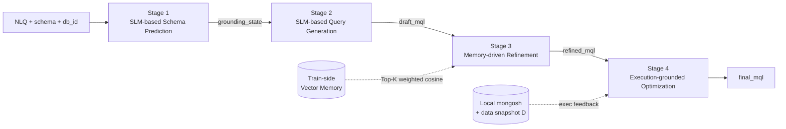
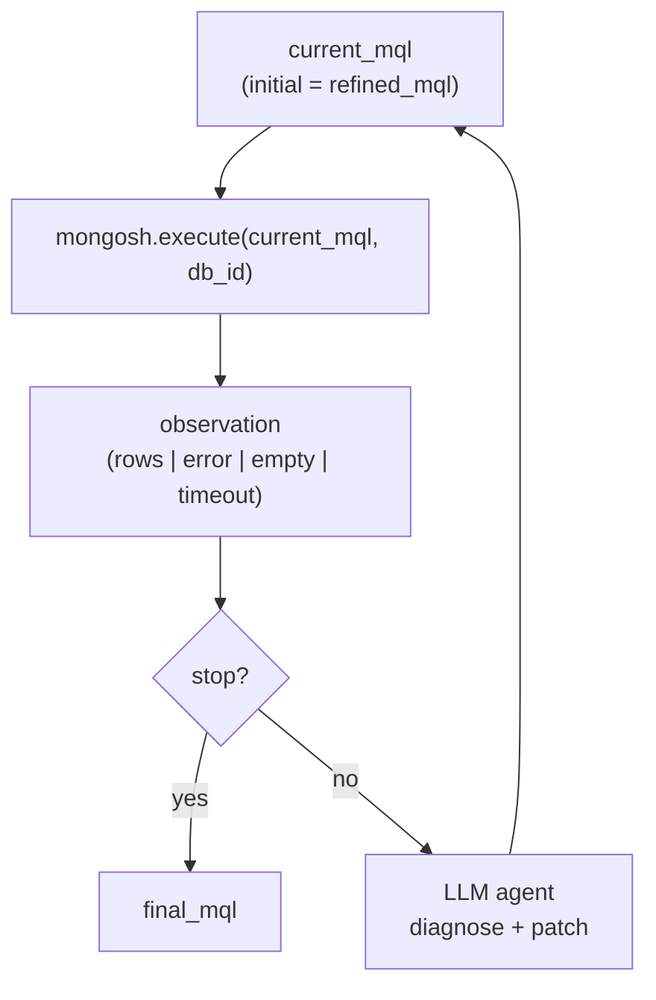

# 05 · 方法设计（SMART）

> 本文件是 Text-to-NoSQL benchmark TEND 上**求解方法层**的根定义（SSoT）。它只回答"给定一条 NLQ + schema + db_id，我们如何把它解到一条可执行的 MongoDB 查询"。它不重定义任务输入输出（[01](./01_task_definition.md) 的事）、不重定义 record 字段（[02](./02_dataset_design.md) 的事）、不重定义构造流程（[03](./03_dataset_construction.md) 的事），也不重定义评测指标（[04](./04_evaluation_methodology.md) 的事）。

---

## §0 摘要 <a id="05-0"></a>

**SMART** 是一个面向 Text-to-NoSQL 的**4 阶段推理流水线**：

1. **SLM-based Schema Prediction**（[§2](#05-2)）—— 微调 Llama-3.2-1B，对每条 NLQ 预测 4 路 schema 标签：`collection` / `db_fields` / `alias_fields` / `target_fields`。
2. **SLM-based Query Generation**（[§3](#05-3)）—— 微调 Llama-3.2-1B，把 NLQ + 上一阶段预测出的结构化 schema 喂给生成器，输出**草稿 MQL**（draft_mql）。
3. **Memory-driven Refinement**（[§4](#05-4)）—— LLM Agent 用**多视角向量库**（V_nlq / V_fields / V_collections / V_draft）对训练侧记忆做**加权 cosine** 检索，召回 Top-K 示例，重写草稿 → refined_mql。
4. **Execution-grounded Optimization**（[§5](#05-5)）—— Debug Agent 把当前 MQL 提交本地 mongosh 执行，根据执行反馈（错误信息、空结果、字段绑定异常等）迭代修正 → final_mql。

整条流水线在 [01 §1](./01_task_definition.md#01-1) 定义的任务签名下闭合：输入 `(NLQ, schema, db_id)`，输出 `q^MQL`，由 [04](./04_evaluation_methodology.md) 的 6 指标体系统一判定。论文报告 SMART (deepseek-v3 作为 Refiner / Debugger 的对话主干) 在 TEND 测试集上 EX = 65.08%。

本文档共 10 节：总体架构（[§1](#05-1)）、4 个阶段（[§2](#05-2)/[§3](#05-3)/[§4](#05-4)/[§5](#05-5)）、训练与推理接口（[§6](#05-6)）、方法侧硬边界（[§7](#05-7)）、部署与监控（[§8](#05-8)）、与 baseline 的比较假设（[§9](#05-9)）、canonical 示例的 4 阶段 trace（[§10](#05-10)）。

---

## §1 总体架构 <a id="05-1"></a>

### 1.1 推理流程的形式化签名

按 [01 §1](./01_task_definition.md#01-1)，TEND 任务是函数 $f:(\mathrm{NLQ}, S, \mathit{db\_id}) \to q^{\mathrm{MQL}}$。SMART 给出该函数的一个具体实现 $f_{\text{SMART}}$，它由 4 个内部子算子复合而成：

$$
f_{\text{SMART}}\ \triangleq\ \mathrm{Optimize} \circ \mathrm{Refine} \circ \mathrm{Generate} \circ \mathrm{Predict}
$$

其中：

| 子算子 | 输入 | 输出 | 角色 |
|---|---|---|---|
| $\mathrm{Predict}$ | $(\mathrm{NLQ}, S, \mathit{db\_id})$ | `grounding_state`（4 路 schema 标签） | Stage 1：SLM 4 路 schema 预测 |
| $\mathrm{Generate}$ | $(\mathrm{NLQ}, S, \mathit{db\_id}, \text{grounding\_state})$ | `draft_mql` | Stage 2：SLM 草稿 MQL 生成 |
| $\mathrm{Refine}$ | $(\mathrm{NLQ}, S, \mathit{db\_id}, \text{grounding\_state}, \text{draft\_mql})$ | `refined_mql` | Stage 3：检索 Top-K 训练记忆并重写 |
| $\mathrm{Optimize}$ | $(\mathrm{NLQ}, S, \mathit{db\_id}, \text{refined\_mql})$ | `final_mql` | Stage 4：mongosh 执行兜底 |

最终 `final_mql` 即任务签名要求的 $q^{\mathrm{MQL}}$。

### 1.2 4 阶段流水线全景图



- **训练侧记忆**（`TrainMem`）只在 Stage 3 检索时被读取，且只装载 [02](./02_dataset_design.md) 定义的 `train.json` 派生的多视角嵌入。
- **mongosh + 数据快照 D**（`Mongosh`）只在 Stage 4 执行时被调用，遵守 [04](./04_evaluation_methodology.md) 给出的复现性契约（同一 mongosh 镜像、同一 collation / locale / timezone、同一超时上限）。

### 1.3 阶段产物的内部状态

| 状态名 | 产生阶段 | 形态 | 是否对外暴露 |
|---|---|---|---|
| `grounding_state` | Stage 1 | 4 路标签字典：`{collection, db_fields, alias_fields, target_fields}` | 否，仅在系统内部流转 |
| `draft_mql` | Stage 2 | 字符串形式的 MQL（`find` 或 aggregation pipeline） | 否 |
| `refined_mql` | Stage 3 | 字符串形式的 MQL | 否 |
| `final_mql` | Stage 4 | 字符串形式的 MQL，对应任务签名的 $q^{\mathrm{MQL}}$ | **是**，作为任务输出 |
| `debug_trace` | Stage 4 | 每轮 mongosh 反馈与 patch 动作的列表 | 仅作为可观测产物（[§8.3](#05-8)） |

---

## §2 Stage 1 · SLM-based Schema Prediction <a id="05-2"></a>

### 2.1 任务定义

给定 `(NLQ, schema_markdown, db_id)`，预测 NLQ 在该数据库上对应 MQL 所**会用到的**结构化 schema 元素。这一步把"自然语言意图"先压缩到"结构化 grounding"上，是后续 Stage 2 生成 MQL 的硬约束。

### 2.2 4 个子任务

| 子任务 | 含义 | 输出形态 |
|---|---|---|
| `collection` | 该 NLQ 对应 MQL 主入口涉及的 collection 名集合（包含会被 `$lookup` 引入的从表） | 字符串集合 |
| `db_fields` | 涉及的 schema 字段路径集合（`Name`、`orchestra.performance.Show_ID` 等） | 字符串集合 |
| `alias_fields` | 在 `$project` / `$group` 中需要起别名的字段（如 `count`、`avg_Salary`） | 字符串集合 |
| `target_fields` | 最终输出文档保留的字段集合（也就是结果 BSON 顶层键） | 字符串集合 |

> 4 路标签对应 [01 §4](./01_task_definition.md#01-4) 归一化结果的"结构骨架"：`target_fields` 决定结果文档键集，`db_fields` + `alias_fields` 决定从 schema 字段到结果键的映射，`collection` 决定查询入口与 join 形态。

### 2.3 模型与训练

- **基座**：Llama-3.2-1B。
- **微调形态**：4 个子任务可以走以下两种之一（实现选择，论文采用 4 头独立微调以避免任务间干扰）：
  - 4 个独立的 LoRA / full-fine-tune checkpoint，每个针对一个子任务；
  - 1 个共享主干 + 4 个 prompt 模板切换的多任务微调。
- **训练样本来源**：[02](./02_dataset_design.md) 定义的 `TEND/train.json`。每条 record 提供 5 条 NLQ + 1 条 gold MQL + db_id；4 路标签从 gold MQL 中按解析规则抽取（如 `db.X.aggregate(...)` 中的 collection 名、`$project` 中的字段、别名等）。
- **数据增广**：record 自带 5 条 NLQ，逐条作为独立训练样本（gold MQL 与 4 路标签共享）。这相当于把"句法表面变体不变意图"的鲁棒性直接嵌进微调监督。
- **训练 / 推理边界**：训练记忆**只用** `train.json`；`test.json` 不进入任何 SLM 训练或检索语料；任何 [02](./02_dataset_design.md) 定义的 audit 字段都不进入 SLM 输入或监督信号（详见 [§7](#05-7)）。

### 2.4 输出格式

Stage 1 的产物是一个固定 4 字段的 `grounding_state` 对象：

```json
{
  "collection":     ["conductor"],
  "db_fields":      ["Name", "orchestra.performance"],
  "alias_fields":   ["count"],
  "target_fields":  ["Name", "count"]
}
```

字段顺序与字符串形态约定按字典序归一化，方便 Stage 2 prompt 与 Stage 3 嵌入构造在同一份字符串上对齐。

---

## §3 Stage 2 · SLM-based Query Generation <a id="05-3"></a>

### 3.1 任务定义

给定 `(NLQ, schema_markdown, db_id, grounding_state)`，生成一条**草稿 MQL**（`draft_mql`）。这一步把 Stage 1 抽出的 grounding 物化为具体的 MongoDB 算子序列。草稿允许不完美 —— 后两阶段就是用来兜底的。

### 3.2 输入构造

Stage 2 prompt 的硬槽位包括：

- 当前样本的 NLQ；
- `db_id` 对应的 schema markdown（由 schema → markdown 转换器渲染，与 [02 §3](./02_dataset_design.md#02-3) 的库级资产保持一致）；
- Stage 1 输出的 4 路 grounding 标签（按 [§2.4](#05-2) 的格式）。

### 3.3 模型与训练

- **基座**：Llama-3.2-1B（与 Stage 1 同基座，但参数独立；训练任务与 Stage 1 解耦）。
- **训练样本来源**：仍来自 [02](./02_dataset_design.md) 的 `train.json`。每条样本：
  - **输入**：NLQ + schema markdown + 4 路 grounding 标签。训练时 4 路标签可使用**同来源**的 `train.json` gold 标签（teacher forcing），也可使用 Stage 1 模型在 train 切片上的预测（match 推理时分布）。论文采用混合策略以兼顾训练稳定性与推理一致性。
  - **输出**：gold MQL 字符串。
- **数据增广**：同 Stage 1，5 条 NLQ 共用 1 条 gold MQL，提供句法变体鲁棒性。

### 3.4 输出格式

Stage 2 输出 `draft_mql`，是一个完整的 MQL 字符串，例如：

```javascript
db.conductor.aggregate([ /* ... */ ]);
```

不要求 `draft_mql` 在 mongosh 上一次执行通过 —— 它只是 Stage 3 检索 / Stage 4 执行兜底的起点。

---

## §4 Stage 3 · Memory-driven Refinement <a id="05-4"></a>

### 4.1 多视角向量库

把 [02](./02_dataset_design.md) 的 `train.json` 每条 record 离线编码成 4 个视角的稠密向量，存入训练记忆库 $\mathcal{M}_{\text{train}}$：

| 视角 | 编码内容 | 角色 |
|---|---|---|
| $V_{\text{nlq}}$ | NLQ 字符串 | 自然语言意图相似度 |
| $V_{\text{fields}}$ | `db_fields` ∪ `alias_fields` ∪ `target_fields` 的字典序拼接字符串 | 字段级 schema 相似度 |
| $V_{\text{collections}}$ | `collection` 的字典序拼接字符串 | collection 拓扑相似度 |
| $V_{\text{draft}}$ | gold MQL 字符串本体（offline 时 = gold；online 时被 query 侧的 `draft_mql` 嵌入对齐） | MQL 表面结构相似度 |

> 实现侧"fields"视角可进一步拆成 `db_fields` / `alias_fields` / `target_fields` 三个子视角分别编码，再在打分时合并。本文沿用 4 视角抽象，便于陈述加权公式（[§4.2](#05-4)）。具体子拆分由实现决定，不改变方法语义。

每条训练样本最终在 $\mathcal{M}_{\text{train}}$ 中表示为：

$$
e\ =\ \bigl(V^e_{\text{nlq}},\ V^e_{\text{fields}},\ V^e_{\text{collections}},\ V^e_{\text{draft}},\ \text{NLQ}^e,\ \text{schema}^e,\ \text{gold\_mql}^e\bigr)
$$

### 4.2 加权 cosine 检索

在线推理时，对当前样本 $q$ 计算 4 个视角的查询向量：

| 查询向量 | 来源 |
|---|---|
| $V^q_{\text{nlq}}$ | 当前 NLQ 的嵌入 |
| $V^q_{\text{fields}}$ | Stage 1 输出的字段集合（按字典序）拼接后嵌入 |
| $V^q_{\text{collections}}$ | Stage 1 输出的 collection 集合（按字典序）拼接后嵌入 |
| $V^q_{\text{draft}}$ | Stage 2 输出的 `draft_mql` 嵌入 |

候选示例 $e \in \mathcal{M}_{\text{train}}$ 的相关度按加权 cosine 计算：

$$
\operatorname{score}(q, e)\ =\ \sum_{v \in \{\text{nlq},\ \text{fields},\ \text{collections},\ \text{draft}\}}\ w_v \cdot \cos\bigl(V^q_v,\ V^e_v\bigr)
$$

权重 $w_v$ 体现各视角对最终 MQL 重写质量的相对贡献。论文经验权重大致结构是：

| 视角 | 权重直觉 |
|---|---|
| nlq | 最高，负责锁定语义意图 |
| fields | 次高，负责锁定 schema 绑定 |
| collections | 与 fields 同量级，约束 join 拓扑 |
| draft | 较低，避免被表面 MQL 字符串噪声主导，但不为零（保留"结构相似的算子序列"先验） |

具体数值上下界由实现方按训练侧 ablation 决定；本文不固定一组数值，只声明**权重结构**：意图视角 ≥ schema 视角 > 表面结构视角，且没有视角的权重为零。

### 4.3 Top-K 检索与上下文打包

按 $\operatorname{score}$ 降序取前 $K$ 个示例，建议 $K \in [5, 20]$。$K$ 越大，prompt 中提供的"近邻 NLQ–MQL pair"越多，但也越接近 prompt 上限并稀释最相似那条的信号。论文默认 $K = 20$ 并依靠 LLM 自身做加权理解；实践中 $K = 10$ 通常已经足够稳定。

打包到 Refiner prompt 的字段（每条示例）：

- 该示例的 NLQ；
- 该示例的 db_id；
- 该示例的 4 路 schema 标签（与当前 `grounding_state` 对齐展示）；
- 该示例的 gold MQL。

### 4.4 Refiner Agent

Refiner 是一个 LLM 对话 Agent（论文使用 deepseek-v3 / gpt-4o-mini 作为主干），其 system prompt 把它定位为"MongoDB 查询调整组件"，task prompt 装入：

- 当前 `(NLQ, schema_markdown, grounding_state, draft_mql)`；
- Top-K 示例（按 [§4.3](#05-4) 的形态）；
- 一组 generic 改写指令（保持只读、保持 deterministic、参照示例的算子序列与命名约定等）。

Agent 输出一段 `javascript` 代码块，提取后即 `refined_mql`。

> Refiner 只重写 MQL，不写库、不写文件、不调外部工具。重写遵守 [01 §2.1](./01_task_definition.md#01-2) 的输出空间约束（read-only / deterministic / mongosh-executable）。

---

## §5 Stage 4 · Execution-grounded Optimization <a id="05-5"></a>

### 5.1 Debug Agent 协议

Debug Agent 的输入是 `(NLQ, schema_markdown, db_id, refined_mql)`。它在一个**有界循环**里与本地 mongosh 交互：



### 5.2 执行反馈分类与 patch 策略

每轮 mongosh 调用返回的观察被 Agent 归为下表中的一类，并按对应策略生成 patch：

| 观察类型 | 典型现象 | Agent 的 patch 策略 |
|---|---|---|
| **解析错误** | mongosh 抛出语法异常 | 修正括号 / 拼写 / `$`-prefix 算子名 |
| **字段绑定错误** | `Path collision`、`field path not found` | 对照 schema markdown 与 grounding_state 修正字段路径 |
| **算子误用** | `$lookup` 缺 `from` / `$group` 缺 `_id` / `$unwind` 用在非数组字段 | 替换或补全算子，必要时插入 `$unwind` 展开嵌套数组 |
| **空结果但 NLQ 应非空** | 查询返回 `[]` 但 NLQ 隐含非平凡输出 | 检查过滤条件是否过严、是否漏 join、是否大小写敏感 |
| **缺阶段** | 输出文档少了 `target_fields` 中的字段 | 补 `$project` 或修正 `$group` 的输出键 |
| **超时** | 超过预设超时上限 | 简化或保守化（裁剪 `$lookup`、加 `$limit`、合并冗余阶段） |
| **正常返回** | 返回非空、字段集合与 `target_fields` 对齐 | 终止循环 |

### 5.3 终止条件与产物

循环以下面任一条件终止，并把当时的 `current_mql` 作为 `final_mql`：

- mongosh 返回**正常非空结果**且字段集合与 Stage 1 的 `target_fields` 对齐；
- mongosh 返回**正常空结果**而 NLQ 在该 `(NLQ, schema)` 上确实可能为空（Agent 的判断阈值由 prompt 给出）；
- 达到最大重试次数 $N$（建议 $N = 5$）—— 此时输出最后一次未引入新错误的 `current_mql`，避免一直发散。

执行环境必须与 [04 复现性契约](./04_evaluation_methodology.md) 一致：同一 mongosh 镜像版本、同一 collation 与 locale、同一 timezone（UTC）、同一执行超时上限。否则 Stage 4 的"执行兜底"与 [04](./04_evaluation_methodology.md) 的执行级评测之间会出现不可见的分布漂移。

> Debug Agent 只在**测试**期使用 `db_id` 对应的数据快照 $D$ 作为 grounding 信号；它**不**修改 $D$、**不**写新 collection（[01 §2.2](./01_task_definition.md#01-2) 禁止 `$out` / `$merge` 进入输出空间，本阶段也禁止它们出现在中间 patch 里）。

---

## §6 训练与推理接口 <a id="05-6"></a>

### 6.1 训练接口

| 阶段 | 训练样本来源 | 输入字段 | 监督信号 |
|---|---|---|---|
| Stage 1（4 路 SLM） | [02](./02_dataset_design.md) `TEND/train.json` | `nl_queries[i]` + 库级 schema markdown（来自 [02 §3](./02_dataset_design.md#02-3) 的库级资产） | 从 gold MQL 抽取的 `collection` / `db_fields` / `alias_fields` / `target_fields` |
| Stage 2（SLM 草稿生成） | 同上 | NLQ + schema markdown + 4 路标签（gold 或 Stage 1 预测） | gold MQL 字符串 |
| Stage 3（向量库构建） | 同上 | NLQ / 4 路标签字符串 / gold MQL 字符串 | 离线编码为 4 视角嵌入，无显式损失 |
| Stage 4（Debug Agent） | 不需要训练样本 | 在线 mongosh 反馈即监督信号 | — |

> Stage 1 / Stage 2 训练不消耗 `test.json` 任何 record；Stage 3 的检索记忆库 $\mathcal{M}_{\text{train}}$ 也只装载 `train.json` 派生的嵌入。这保证 SMART 整条流水线在 cross-domain 设定下的评测有效性（参见 [§7](#05-7) 与 [04](./04_evaluation_methodology.md) 关于训练 / 评测分离的契约）。

#### 5 NLQ 的处理

[02](./02_dataset_design.md) 每条 record 自带 5 条 `nl_queries`。SMART 训练侧把它们作为 **5 个独立训练样本**（同一 gold MQL、同一 4 路标签）：

- Stage 1：5 条 NLQ × 1 个 gold 标签集合 → 5 个独立 `(NLQ, schema, label)` 训练对；
- Stage 2：5 条 NLQ × 1 个 gold MQL → 5 个独立 `(NLQ, schema, labels, gold_mql)` 训练对；
- Stage 3 向量库：5 条 NLQ 通常合并为同一条记忆（`gold_mql` 共享），但 NLQ 视角 $V_{\text{nlq}}$ 上可登记为 5 个候选嵌入，在线检索时取最近匹配。

这一约定不重新定义 [02](./02_dataset_design.md) 的 record 形态，只是说明 SMART 如何"消费"已有 record。

### 6.2 推理接口

```
SmartRequest {
    nlq: str,                # 当前 NLQ
    schema_markdown: str,    # 当前 db_id 的 schema markdown
    db_id: str,
    mongosh_handle: object   # 仅 Stage 4 使用，连接到与 db_id 绑定的本地数据快照
}

SmartResponse {
    final_mql: str,                      # 任务输出 q^MQL
    intermediate_traces: object {        # 仅监控用，不进入评测
        grounding_state: dict,
        draft_mql: str,
        refined_mql: str,
        debug_trace: list
    }
}
```

- `intermediate_traces` 只用于 [§8.3](#05-8) 的离线监控与错误分析，不参与 [04](./04_evaluation_methodology.md) 的指标计算。
- `mongosh_handle` 必须连接到 [01 §1.3](./01_task_definition.md#01-1) 定义的、由 `db_id` 唯一绑定的只读快照 $D$。

---

## §7 方法侧硬边界（contract-safe） <a id="05-7"></a>

SMART 在推理期对以下对象执行**严格屏蔽**，它们不进入任何模型输入、不进入任何检索向量、不进入任何 prompt 上下文：

| 对象 | 来源 | 屏蔽原因 |
|---|---|---|
| `test.json` 的 record | [02](./02_dataset_design.md) | 评测语料，进入即数据泄漏 |
| 任何 [03](./03_dataset_construction.md) 输出的 audit 资产 | [03](./03_dataset_construction.md) 的构造产出 | 仅审计用，不构成 NLQ 解题信号 |
| 库级 `world_signature` | [02 §3](./02_dataset_design.md#02-3) | 数据快照指纹，仅用于 reproducibility 而非解题 |
| `schema_complexity_profile` | [02](./02_dataset_design.md) 的 audit 字段 | 描述性元信息，进入会引入 leakage |
| 任何 record 级的 audit 字段 | [02](./02_dataset_design.md) | 同上 |

训练侧记忆**只**装载 [02](./02_dataset_design.md) `train.json` 的 `(NLQ, db_id, schema_markdown, gold_mql)` 与从其中抽出的 4 路标签。任何 audit 字段都不参与嵌入计算或被检索器返回。

> 该硬边界与 [03](./03_dataset_construction.md) 的契约对偶：[03](./03_dataset_construction.md) 负责**构造侧**保证 audit 信息不混进 record 主体；[05](#05-7) 负责**求解侧**保证即便 record 主体之外的 audit 资产被并行存放，求解流水线也不读取它们。

---

## §8 部署与监控 <a id="05-8"></a>

### 8.1 服务分层

| 服务 | 对应阶段 | 资源画像 |
|---|---|---|
| **Schema Predictor** | Stage 1 | Llama-3.2-1B × 4 路（或共享主干 + 4 prompt），GPU 推理，batch friendly |
| **Query Drafter** | Stage 2 | Llama-3.2-1B × 1，GPU 推理 |
| **Refiner with Vector Memory** | Stage 3 | 嵌入服务（OpenAI-style API 或本地 encoder）+ 向量索引 + LLM 主干（deepseek-v3 / gpt-4o-mini） |
| **Executor + Debugger** | Stage 4 | 本地 mongosh + 数据快照集群 + LLM 主干 |

四个服务在拓扑上松耦合：Stage 1/2 输出可被 cache，Stage 3 的检索结果与 Stage 4 的执行结果都可单独缓存。

### 8.2 缓存

| 缓存名 | 键 | 值 | 失效条件 |
|---|---|---|---|
| `schema_md_cache` | `db_id` | schema markdown 字符串 | schema 文件变更 |
| `nlq_emb_cache` | `hash(nlq)` | NLQ 嵌入向量 | encoder 版本 / 模型变更 |
| `train_mem_cache` | `hash(train.json) + encoder_id` | 整个 $\mathcal{M}_{\text{train}}$ 索引 | train.json 变更或 encoder 升级 |
| `mongosh_exec_cache` | `(db_id, normalized_mql)` | mongosh 执行结果（含错误信号） | 数据快照 $D$ 变更 |

`mongosh_exec_cache` 在 Stage 4 的迭代循环里作用最大：同一个 patch 反复被试探时无须真打 mongosh。

### 8.3 监控指标

下列监控量来自 SMART 自身的内部 trace，与 [04](./04_evaluation_methodology.md) 的 6 评测指标解耦，仅用于服务侧诊断：

| 指标 | 阶段 | 含义 |
|---|---|---|
| 4 路预测准确率 | Stage 1 | `collection` / `db_fields` / `alias_fields` / `target_fields` 各自的集合层 F1（与 train 侧 gold 对比） |
| Draft 合法率 | Stage 2 | `draft_mql` 被 mongosh 解析通过的比例 |
| 检索命中分布 | Stage 3 | Top-K 的 score 分布、Top-1 与 Top-K 的 score 差、检索是否落在与当前 db_id 同 domain 的样本上 |
| Patch 次数分布 | Stage 4 | Debug Agent 平均 patch 轮数、达到 $N$ 终止的样本占比 |
| 终止状态分布 | Stage 4 | 正常返回 / 接受空结果 / 强制终止 三种终止类别的占比 |
| EX / EFM / EVM 离线漂移 | 全流程 | 在 cross-domain 切片上对比上线前后的 [04 §3](./04_evaluation_methodology.md) 指标，监测分布漂移 |

> 监控量永远不直接进入 prompt 或参与决策，只供运维与方法迭代分析使用。

---

## §9 与 baseline 的比较假设 <a id="05-9"></a>

下列陈述都是**方法侧的设计期望**，不是数据结论。最终对 SMART 与各 baseline 的优劣判断仍由 [04](./04_evaluation_methodology.md) 的 6 指标体系（EM / QSM / QFC / EX / EFM / EVM）在 TEND 测试集上的实验结果决定。

| 对比对象 | SMART 的设计期望 | 期望生效的样本面 |
|---|---|---|
| **Direct Prompting**（zero-shot LLM） | 在 schema linking 歧义大的样本上更稳：Stage 1 显式做 schema 预测，避免生成器把字段名瞎猜 | 多 collection 数据库、字段名同义近邻多的库 |
| **Single-pass Fine-tuned 生成**（一步生成，无 RAG，无执行兜底） | 在多阶段聚合查询上更稳：Stage 3 用近邻示例补结构、Stage 4 用 mongosh 兜执行 | aggregation pipeline 长、跨 collection、含嵌套展开的查询 |
| **纯语义 RAG** | 在结构合法性上更稳：Stage 4 mongosh 执行能捕捉到 RAG 漏检的字段绑定与算子误用 | 纯检索能召回意图相近示例但 schema 不一致的样本 |
| **SQL → NoSQL 中转级联** | 直接面向 MongoDB 文档结构，无需先解 SQL；对嵌套数组类查询不会被 SQL flat-join 中转扭曲 | 嵌套子文档 / 数组路径多层的查询（如 canonical 示例） |

期望仅在"假设 baseline 与 SMART 共用 [04](./04_evaluation_methodology.md) 的执行环境与 6 指标"前提下成立。实际差异、显著性以及在哪些 cross-domain 切片上差距最大，由实验侧给出。

---

## §10 canonical 示例的 4 阶段 trace <a id="05-10"></a>

为让读者把 [§1](#05-1)–[§5](#05-5) 抽象描述与具体推理对齐，这里走一遍 [01 §7](./01_task_definition.md#01-7) 的 canonical 三元组：

| 项 | 值 |
|---|---|
| `db_id` | `orchestra` |
| `record_id` | `99001` |
| NLQ | *"List the top 3 conductors with the most performances."* |

schema 的语义形态（嵌套 4 层）已由 [01 §7.2](./01_task_definition.md#01-7) 给出：`conductor → orchestra[] → performance[] → show[]`。

### 10.1 Stage 1 — Schema Prediction

Stage 1 的 `Schema Predictor` 接收 NLQ + 库级 schema markdown，输出 4 路标签：

```json
{
  "collection":     ["conductor"],
  "db_fields":      ["Name", "orchestra.performance"],
  "alias_fields":   ["count"],
  "target_fields":  ["Name", "count"]
}
```

关键判断：

- `collection` 锁定主入口为 `conductor`，不需要 `$lookup`（performance 嵌在 conductor 文档内）；
- `db_fields` 包含 `orchestra.performance` 这条**穿过两层数组**的路径，提示 Stage 2 必须穿透到该路径才能数 performance；
- `target_fields` = `{Name, count}`，提示结果文档只保留这两个键。

### 10.2 Stage 2 — Query Generation

Stage 2 的 `Query Drafter` 拿到 NLQ + schema markdown + Stage 1 的 4 路标签，可能输出一个**结构上接近但缺穿透**的草稿，例如：

```javascript
db.conductor.aggregate([
  { $project: { Name: 1, count: { $size: "$orchestra.performance" } } },
  { $sort: { count: -1 } },
  { $limit: 3 }
]);
```

这个草稿的问题在于：`$size` 不会自动穿透两层数组。`$orchestra.performance` 在嵌套结构下解析得到的是"数组的数组"，`$size` 直接作用其上会得到错误计数（数到的是 orchestra 数量而不是 performance 总数），违反 [01 §7.4](./01_task_definition.md#01-7) 的"必须跨两层数组进行计数"硬约束。

但 Stage 2 不必把它解到完美 —— 后两阶段会兜底。

### 10.3 Stage 3 — Memory-driven Refinement

Refiner 在 $\mathcal{M}_{\text{train}}$ 上做 4 视角加权 cosine 检索：

- $V_{\text{nlq}}$ 命中训练侧若干 *"top-K by count"* 模式的 NLQ；
- $V_{\text{collections}}$ + $V_{\text{fields}}$ 命中训练侧带嵌套数组展开（`$unwind` 两层）的 aggregation；
- $V_{\text{draft}}$ 命中带 `$group → $sort → $limit → $project` 算子序列的草稿。

Top-K 中至少有一条示例是"对嵌套数组分组计数"的 gold 形态。Refiner 据此把 `$size` 替换为两层 `$unwind` + `$group` 的计数模式，输出：

```javascript
db.conductor.aggregate([
  { $unwind: "$orchestra" },
  { $unwind: "$orchestra.performance" },
  { $group: { _id: "$Name", count: { $sum: 1 } } },
  { $sort: { count: -1 } },
  { $limit: 3 },
  { $project: { _id: 0, Name: "$_id", count: 1 } }
]);
```

### 10.4 Stage 4 — Execution-grounded Optimization

Debug Agent 把 `refined_mql` 提交本地 mongosh：

| 轮次 | 观察 | Patch |
|---|---|---|
| 1 | 返回 3 行 `{Name, count}`，按 count 降序 | 满足"正常返回 + 字段集合与 `target_fields` 对齐"，**终止** |

`final_mql` = `refined_mql`，循环未触发任何 patch。

#### 10.4.1 一个失败–恢复支线

如果 Stage 3 重写时漏掉了第二层 `$unwind`，Stage 4 第一次执行可能返回的 count 偏低（数到的是 orchestra 而非 performance），Debug Agent 会观察到"结果数量与 NLQ 隐含的'最多 performance'不匹配，且 schema 中 performance 嵌于 orchestra 之下"，下一轮 patch 会插入 `{ $unwind: "$orchestra.performance" }`，然后再执行验证。这条支线展示了 Stage 4 不是只接 syntax-level 错误，也接 semantic-level 的"结构未穿透"错误。

### 10.5 输出与评测对接

Stage 4 输出的 `final_mql` 被作为 $q^{\mathrm{MQL}}$ 喂给 [04](./04_evaluation_methodology.md) 的评测器：

- **EX**：在 `orchestra` 数据快照 $D$ 上执行 `final_mql` 与 gold MQL，按 [01 §3](./01_task_definition.md#01-3) 的递归相等关系判定；
- **EFM / EVM**：进一步比较结果文档的字段集合与值；
- **EM / QSM / QFC**：query 串层面的近似比较（不依赖执行结果，但与 [01 §3](./01_task_definition.md#01-3) 的执行锚一致性挂钩）。

整个 trace 走完后，SMART 在该 record 上"是否解对"由 EX 判定；它在 [04](./04_evaluation_methodology.md) 的 cross-domain 切片下的总体表现就是论文报告的 SMART (deepseek-v3) EX = 65.08%。

---

> 文档定位：任务输入输出 → [01 任务定义](./01_task_definition.md)；record 字段与库级资产 → [02 数据集设计](./02_dataset_design.md)；构造流水线与训练 / audit 边界 → [03 数据集构造](./03_dataset_construction.md)；6 指标公式与复现性契约 → [04 评测方法](./04_evaluation_methodology.md)；本文档 → SMART 4 阶段求解方法的根定义。
