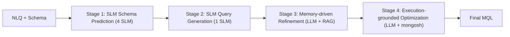

# SMART 解决方案设计

> 文档定位: 阐述 SMART 4 阶段框架的设计动机、关键决策与部署清单
> 目标读者: 模型团队 / 复现者 / 运维
> 前置阅读: [01 任务定义](./01_task_definition.md), [02 数据集设计](./02_dataset_design.md), [03 数据集构建方法](./03_dataset_construction.md), [04 评估方法](./04_evaluation_methodology.md)
> 最近更新: 2026-04-17

<a id="05-0"></a>
## 0. 摘要

SMART (SLM-guided, Memory-augmented, multi-Agent for Text-to-NoSQL) 是一条 4 阶段流水线: Stage 1/2 由 5 个全参数微调的 Llama-3.2-1B 分别承担 schema 预测与 MQL 初稿生成; Stage 3 借助 6 视角加权向量检索召回 Top-20 示例, 由 LLM 重写初稿; Stage 4 用本地 mongosh 执行反馈驱动 LLM 再次修正。方案的设计哲学是"轻量 SLM 做粗预测, 大 LLM 做精修, 多视角检索与执行闭环防幻觉", 在 TEND 测试集上以 deepseek-v3 作后端达到 EX 65.08%。该方案回答的研究问题见 [01 §6 研究问题 RQ](./01_task_definition.md#01-6); 性能由以下评估流程度量 [04 §6 评估流程脚本入口](./04_evaluation_methodology.md#04-6)。

<a id="05-1"></a>
## 1. 设计动机与总览

Text-to-NoSQL 的两大难点是: 嵌套文档的 schema linking 高度结构化 (需要字段级精度), 而 MQL pipeline 的顺序语义又高度脆弱 (需要执行才能验证)。单一模型同时吃下两端负担过重: LLM 足够灵活但字段级稳定性差且推理成本高, SLM 成本低但开放式生成能力不足。SMART 的解法是把整个问题沿"结构化/开放式"二分, 前半交给专精 SLM, 后半交给 LLM, 再用 RAG 与执行反馈两条外部信号"接地"。



核心设计依据有二。其一, schema linking 属于有限候选的分类/抽取问题, SLM 经过任务专精微调后, 在命名一致性、字段拼写、collection 选择上与 LLM 持平甚至更稳, 而单次推理成本低两个数量级, 非常适合作为"预测器"; 其二, refinement/optimization 需要对照 in-context 范例做抽象迁移, 是典型的 LLM 强项, 但只有把"相似案例"与"本次执行结果"同时注入 prompt 才能避免幻觉式改写。两股逻辑合流即得到上图的 4 阶段形态, 每阶段的产物都被显式保留下来, 方便做消融与回退。

<a id="05-2"></a>
## 2. Stage 1+2 SLM Schema Prediction & Query Generation

Stage 1 与 Stage 2 共享同一个 Llama-3.2-1B 骨架, 但被独立微调成 **5 个角色**: 4 个 schema preference SLM (`query_collection` / `db_fields` / `alias_fields` / `target_fields`) + 1 个 MQL draft SLM (`text2nosql`)。拆分的理由是让每个头只学一种结构化标签, 输出空间受限, 微调样本信噪比高, 且便于逐类做错误分析 (见 `error_analysis/` 下 4 类 schema 预测细分)。

训练材料来自 TEND 训练集经递归下降解析器抽取的 5 类 instruction 样本, 每条样本前置 Markdown 化 schema + NLQ, 监督目标是"字母序排好的逗号分隔串" —— 刻意规范化输出形态, 避免同义等价串导致的虚假错误。训练超参: full-parameter fine-tuning, batch=4, 框架为 llama-factory, 推理期 `temperature=0.0` 以保证可复现。

这一阶段回答 **RQ1**: 用 SLM 取代 LLM 做 schema 预测是否可行。论文 ablation 里 w/o SP 分支 (去掉 schema preference) 相对完整 SMART 的 EX 下降 ~1.3 个百分点, 说明 SLM 预测的结构化线索对下游 refinement 有可量化贡献, 且成本远低于调一次 LLM。

训练数据基于的切分策略见 [02 §5 切分策略](./02_dataset_design.md#02-5)。

<a id="05-3"></a>
## 3. Stage 3 Memory-driven Refinement

Stage 3 是 SMART 的"记忆检索大脑", 由两件事组成: 多视角加权检索 + LLM Refiner。

**6 视角嵌入库**。对 TEND 训练集的每条 (NLQ, MQL) 对, 预计算 6 条 `text-embedding-ada-002` 向量, 分别覆盖自然语言意图 (NLQ)、查询草稿 (MQL)、底层 schema (fields_db)、alias 字段 (fields_alias)、目标投影 (target_fields) 与使用的 collection (query_collection)。测试时, 对当前 NLQ + 4 个 SLM schema 预测 + MQL 初稿同样计算 6 条嵌入, 再与库内每条训练样本做**加权 cosine**。

\[ \text{score}(q, e) = \sum_{v \in V} w_v \cdot \cos(\mathbf{x}_v^q, \mathbf{x}_v^e) \]

其中 \(V = \{\text{nlq}, \text{mql}, \text{fields\_db}, \text{fields\_alias}, \text{target\_fields}, \text{query\_collection}\}\), 权重取 \(w_{\text{nlq}}=1.0\), \(w_{\text{fields\_db}}=w_{\text{query\_collection}}=0.7\), \(w_{\text{fields\_alias}}=w_{\text{target\_fields}}=0.5\), \(w_{\text{mql}}=0.3\)。

设计依据是一条"信号可信度"轴: NLQ 是用户真实意图、最可靠, 赋主导权重 1.0; 底层字段与 collection 是强 schema 信号、对结构对齐决定性强, 取 0.7; alias 与 target 是弱 schema 信号 (alias 由 pipeline 生造, 存在预测漂移), 取 0.5; draft MQL 来自 SLM, 可能把错误也编码进去, 只留 0.3 作"风格参考"。若一视同仁, 错误草稿会把检索拽向错误邻域, 从而污染示例库 (消融见 `SMART_all/` 内 `_no_pref` 分支)。

**Top-K = 20** 来源于论文 Parameter Study 拐点 —— K < 10 时召回不足、K > 30 时噪声与 prompt 长度成本都抬升, K=20 在 EX 曲线上出现稳定峰值。

**Refiner Prompt** 按"角色-契约-示例-案件"4 段式组织:

```text
system:   MongoDB NLI 的 query fine-tuner, 输出契约 javascript
instruction: 逐步判断是否需改, 若需则按 schema 约束重写
RAG exemplars (K 条): NLQ / cols / fields / alias / target / gold MQL
current case: schema markdown + NLQ + 4 项 SLM 预测 + draft MQL
```

这一阶段回答 **RQ2**: 多视角加权检索是否优于单视角 NLQ 检索。消融中 w/o RF (去掉 refinement) 相对完整 SMART 的 EX 下降 ~2.2 个百分点。记忆库基于的训练记录字段见 [02 §3 数据记录 schema](./02_dataset_design.md#02-3)。

<a id="05-4"></a>
## 4. Stage 4 Execution-grounded Optimization

Stage 4 的角色是 Optimizer, 与 Refiner 的**关键差异**有三条:
- Refiner 只看到 RAG 示例的 `(NLQ, MQL)`, Optimizer 同时看到这些示例在 MongoDB 上的**真实执行结果**, 形成"对照学习";
- Refiner 的修正依据是"是否贴合 schema", Optimizer 的依据是"结果文档的字段与值是否符合 target_fields 与 NLQ 语义";
- Refiner 不触发执行, Optimizer 每次调用都通过 mongosh 子进程跑当前候选 + 最多 10 行结果截断。

执行返回被分成「结果 JSON / 语法错误 / 超时 / `ObjectId` 不可序列化」等类别, 对应的反馈文本直接回注到 Prompt。例如当出现 `_id` 序列化失败, 会自动提示 `Set the _id in project stage to 0`, 把常见修补模式预置为运维约束, 减少一轮不必要的对话。终止条件是"执行成功且结果非空" (或触达默认最大重试次数), 保证 Stage 4 不会陷入无限循环。

这一阶段回答 **RQ3**: 执行反馈闭环能否进一步提升 EX/EFM/EVM。消融中 w/o OPT 分支 EX 下降 ~1.3 个百分点, 而 EFM 下降更明显, 说明执行反馈对"结果键名/值层面"的修正增益最大。执行依赖的数据导入流程见 [03 §9 数据导入 MongoDB](./03_dataset_construction.md#03-9); 执行环境复用评估设施 [04 §3 执行环境](./04_evaluation_methodology.md#04-3)。

<a id="05-5"></a>
## 5. 关键设计决策

以下 4 条决策是 SMART 形态的支柱, 选择依据如下表:

| 决策 | 替代方案 | 选择依据 |
| --- | --- | --- |
| 用 SLM 做 schema 预测 (5 个 Llama-3.2-1B 角色) | 全 LLM zero-shot / few-shot | 成本低两个数量级; 结构化标签上微调后一致性强; 可逐类做错误分析 |
| 6 视角加权 cosine 检索 | 单 NLQ 视角 / 等权多视角 | 减少结构错配; NLQ 主导 + schema 辅助 + draft 弱化, 召回邻域更稳 |
| 权重 (1.0 / 0.7 / 0.7 / 0.5 / 0.5 / 0.3) | 等权 / 可学权重 | 按信号可信度经验排序; 可学权重在 14k 样本上易过拟合, 且难以解释 |
| Top-K = 20 | K = 5 / 10 / 30 / 40 | Parameter Study 拐点: K<10 召回不足, K>30 噪声 + 上下文长度成本抬升 |

两条贯穿性原则值得单独提出: 一是"显式 schema 前置注入"优于"按需检索 schema", 因为 MongoDB 字段命名自由度高 (大小写、单复数、嵌套路径), 必须把字段命名空间硬约束到 prompt 里; 二是"每阶段产物独立持久化" (例如 `test_SLM_prediction.json` / `test_SLM_prediction_rag.json` / `test_debug_rag20_*.json` / `test_debug_rag_exec20_*.json`), 让每个阶段可单独跑消融, 也便于复用到 baseline 对照。

<a id="05-6"></a>
## 6. 推理资源/延迟分析

单条样本端到端调用次数与典型耗时量级:

| 环节 | 调用次数 | 单次耗时 | 备注 |
| --- | --- | --- | --- |
| SLM 前向 (Stage 1+2) | 5 | ~50 ms | 1B 参数, 24GB 显存可并行加载 |
| ada-002 嵌入 (Stage 3) | 6 | ~100-300 ms | 受网络波动; 可批量 |
| LLM Refine 调用 | 1 | ~3-5 s | deepseek-v3 / gpt-4o-mini |
| LLM Optimize 调用 | 1 (+ 重试) | ~3-5 s | temperature=0.0 |
| mongosh 执行 | 1 + K | ~100-500 ms | 当前候选 1 次 + Top-K 示例的 gold MQL 逐条执行 (可缓存) |

端到端单条在 ~10-15 s 量级, 绝大部分时间消耗在两次 LLM API 调用与 K=20 的 exemplar mongosh 执行上。优化方向有两个: 一是对训练集的 RAG exemplar 执行结果做离线缓存, 避免推理期反复跑 mongosh; 二是让 Stage 3/4 的 Refiner/Optimizer 共享同一个 LLM session, 减少上下文重复传输。在 TEND 2,775 条测试集上, 整体完成时间约 6-10 小时 (单机串行)。

<a id="05-7"></a>
## 7. 部署清单

复现 SMART 需要以下组件齐备:

- **5 个 SLM 权重**: 4 个 schema preference + 1 个 MQL draft, 单张 RTX 4090 (24GB) 即可加载推理; 若显存紧张可顺序加载。
- **本地 MongoDB 7.0+**: 必须预先导入 TEND 的 154 个数据库 (含 schema 与数据); 连接串默认 `mongodb://localhost:27017/`。
- **向量库**: TEND 训练集 14,245 条的 6 视角 ada-002 嵌入, 以 pickle 持久化到 `vector_store/train.pkl` 与 `vector_store/test.pkl` (约 800 MB)。
- **API Key**: OpenAI (嵌入) + DeepSeek 或 OpenAI (LLM); **必须**通过环境变量 `OPENAI_API_KEY` 注入, 禁止硬编码到源码 (见 §Y)。
- **mongosh 可执行文件**: Windows 上位于 MongoDB 安装目录 `bin/mongosh.exe`, Linux/Mac 需在 `PATH` 中可见; 当前实现以 Windows 路径为主, 跨平台适配见 §Y TODO。

**启动顺序**: MongoDB up → 向量库就绪 → SLM 权重加载 → LLM / 嵌入 API 可达 → 跑 `SMART/debug.sh`。

**失败回退**: SLM 异常时切回"LLM schema prediction" (用 zero-shot LLM 顶替 4 个 SLM 角色); 向量库异常时关闭 RAG 走 zero-shot Refiner; mongosh 超时或不可达时直接跳过 Stage 4, 只保留 Stage 3 的输出。这三条回退链让 SMART 在资源受限或外部故障时仍能降级输出。

<a id="05-8"></a>
## 8. 与 baseline 差异

SMART 的"完整态"恰好对应每一条 baseline 缺失的某一环, 形成天然的消融对照:

| 方法 | Schema 预测 | 多视角检索 | 执行反馈 | 备注 |
| --- | --- | --- | --- | --- |
| Zero-shot | 无 | 无 | 无 | 仅 NLQ + schema, 依赖 LLM 通用能力 |
| ICL (Few-shot) | 无 | 单视角 (NLQ) | 无 | 固定示例拼接, 不做相似度召回 |
| RAG (Memory-aug) | 无 | 单视角 (NLQ) | 无 | 动态召回但仅按 NLQ 匹配 |
| Self-Debug | 无 | 无 | 有 (单 LLM 自检) | 缺 schema 预测与多视角召回 |
| SQL→NoSQL Cascaded | 间接 (经 SQL) | 无 | 无 | 依赖 Text-to-SQL 先验, 不利用 NoSQL 原生算子 |
| **SMART** | 有 (5 SLM) | 6 视角加权 | 有 (mongosh 闭环) | 本方案, 全部启用 |

从上表看出, "SLM 结构化预测"与"多视角加权检索"是只有 SMART 具备的两条独立信号, 而执行反馈虽与 Self-Debug 重叠, 但 Self-Debug 缺少 RAG exemplar 的执行对照, 其 LLM 只能"自我反省"而非"对照学习", 修正能力受限。baseline 性能数据见 [04 §7 baseline 性能对照](./04_evaluation_methodology.md#04-7)。

<a id="05-X"></a>
## X. 主要构件清单

| 主题 | 文件 |
| --- | --- |
| 向量库构建 (训练集 6 视角嵌入) | [SMART/build_vec_lib.py](../SMART/build_vec_lib.py) |
| 多视角加权检索 | [SMART/rag_by_nlq_pref.py](../SMART/rag_by_nlq_pref.py) |
| Refiner Agent (Stage 3) | [SMART/LLM_debugger.py](../SMART/LLM_debugger.py) |
| Optimizer Agent (Stage 4) | [SMART/LLM_Optimizer.py](../SMART/LLM_Optimizer.py) |
| SLM 预测整合 (5 路合并) | [SMART/get_SLM_precidtion.py](../SMART/get_SLM_precidtion.py) |
| SLM 训练数据 (cross-domain 5 类 instruction) | [SMART/SLM_data_cross_domain/](../SMART/SLM_data_cross_domain/) |
| mongosh 执行封装 | [SMART/utils/mongosh_exec.py](../SMART/utils/mongosh_exec.py) |
| Schema → Markdown 转换 | [SMART/utils/schema_to_markdown.py](../SMART/utils/schema_to_markdown.py) |
| 启动脚本 | [SMART/debug.sh](../SMART/debug.sh) |

<a id="05-Y"></a>
## Y. 未尽事项与已知风险

- **API key 硬编码**: 当前 `SMART/rag_by_nlq_pref.py` 与 `SMART/build_vec_lib.py` 的模块顶部直接写入了 OpenAI API key (真实字符串以 `<REDACTED>` 表示), 公开复现前必须改为读取环境变量 `OPENAI_API_KEY`; 同时 `api_base` 指向第三方代理域, 建议迁回官方 endpoint。
- **Schema 路径硬编码**: `SMART/utils/schema_to_markdown.py` 中 `folder_path` 写死为 Windows 绝对路径, 与仓库内实际的 `TEND/mongodb_schema/` 不一致, Linux / 团队共享环境下会直接 `FileNotFoundError`; 应改为相对路径或环境变量 `TEND_SCHEMA_DIR`。
- **mongosh 路径仅 Windows**: `SMART/utils/mongosh_exec.py` 的 `_get_mongosh_path` 罗列的均为 Windows 安装路径, Linux / Mac 上会直接抛 `FileNotFoundError`; 需补一条 `shutil.which('mongosh')` 的平台无关回退分支。
- **`debug.sh` 调用 `_ori` 版本**: 当前 `SMART/debug.sh` 实际调用的是 `LLM_debugger_ori.py` 与 `LLM_Optimizer_ori.py`, 而非本文所述的新版主脚本, 两者在 prompt 模板与执行反馈格式上可能有细微差异, 论文报告性能基于哪一版需在复现前确认。
- **文件名 typo**: `SMART/get_SLM_precidtion.py` 的 `precidtion` 应为 `prediction`, 已在 README 与下游多处引用, 后续重命名需同步更新 `debug.sh` / 脚本 import / CI。
- TODO(@infra): 提供统一的环境变量化配置层 (API key / schema 路径 / mongosh 路径), 并在 CI 中加一个"无硬编码密钥"的静态扫描。
- TODO(@model): 量化 6 视角权重的消融贡献, 并探索可学权重是否在足够大的训练集上能击败当前经验权重。
- TODO(@infra): 为 Stage 4 的 RAG exemplar 执行结果建立持久化缓存, 降低 6-10 小时的测试集推理耗时。
