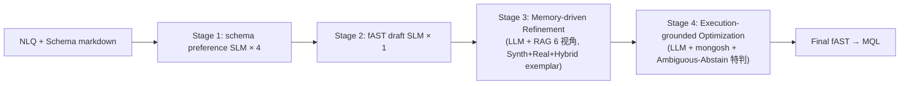

# SMART 解决方案设计

> 文档定位: 阐述 SMART 4 阶段框架的设计动机、关键决策与部署清单
> 目标读者: 模型团队 / 复现者 / 运维
> 前置阅读: [01 任务定义](./01_task_definition.md), [02 数据集设计](./02_dataset_design.md), [03 数据集构建方法](./03_dataset_construction.md), [04 评估方法](./04_evaluation_methodology.md)
> 最近更新: 2026-04-17

<a id="05-0"></a>
## 0. 摘要

SMART (SLM-guided, Memory-augmented, multi-Agent for Text-to-NoSQL) 是一条面向 MonGen 基准的 4 阶段 Text-to-NoSQL 推理流水线。它的核心信条是把 "NLQ 意图歧义 + heterogeneous schema + 长尾算子" 三个结构性困难拆分给四段彼此正交的信号源: Stage 1+2 用 5 个全参数微调的 Llama-3.2-1B (4 个 schema preference SLM + 1 个 fAST draft SLM) 同时吃下 NLQ + schema markdown, 产出 schema 预测与 **fAST draft**; Stage 3 用 6 视角加权向量检索召回 Top-20 exemplar, 由 LLM Refiner 在 fAST 节点粒度做结构化改写; Stage 4 让 LLM Optimizer 在本地 mongosh 执行反馈下反复微调 fAST, 直到 "执行成功且结果非空" 或触达重试上限; 对落入 Ambiguous-Abstain Bucket 的样本, Stage 4 会显式放宽阈值并允许输出弃权信号, 与 3-way Verifier 桶语义保持一致。

相较过去基于 TEND 旧基准参考的 SMART 形态, 本方案做了三处实质性升级: **(1) Stage 2 的监督目标由 MQL 字符串切换为 fAST**, 让 SLM 产物进入下游时自带结构化节点信息, 不再承担字符串层的语法噪声; **(2) Stage 3 的 RAG 记忆库同时收纳 MonGen-Synth / MonGen-Real / MonGen-Hybrid 三路 exemplar**, MonGen-Real exemplar 按 Sample Family 结构 (1 个 canonical + K 个 Intent Variant 共享 db_id 与 Modeling Style) 组织, 给 Refiner 注入真实意图分布锚点; **(3) Stage 4 对 3-way Verifier 裁决落入 Ambiguous-Abstain Bucket 的样本显式放宽执行阈值, 触发一次二次重写, 避免模型对 "未定意图" 样本硬输出错误 MQL**。

性能报告策略相应调整: **不再沿用旧 TEND 基线上的历史 EX 数值作为 headline**, 该数值对应的数据分布与 MonGen 三路子集不兼容, 直接搬运会给读者误导性参照。主报告改为在 MonGen-Synth / MonGen-Real / MonGen-Hybrid 三列上分别给出 EX-Synth / EX-Real / EX-Hybrid, 且统一以 Discrimination ≥ 0.3 为主报告分子过滤门槛; MonGen-Synth 基线的具体数值待 pilot 实测后填入, 期望 MonGen-Real 相对 MonGen-Synth 的 EX gap 控制在 15 个百分点以内。这一目标来自 MonGen-Hybrid 共训练对跨子集分布差异的收敛性预估, 而非既有数值的外推。按 IRT Difficulty 5 等级 (各 20%) 分桶的二维报告由评估协议统一给出, 本文不列具体 EX 绝对数值。

本方案回答 RQ1 (SLM 替代 LLM 做 schema 预测 + fAST draft 的可行性)、RQ2 (多视角加权检索的增益)、RQ3 (执行反馈闭环的增益), 并参与 RQ4 (跨子集外部有效性) 的回填。完整评估协议与三子集分列报告格式在本系列第 4 份文档中定义, 本文重在方法本身的组件拆解与关键决策。

<a id="05-1"></a>
## 1. 设计动机与总览

Text-to-NoSQL 相比 Text-to-SQL 的三个本质性难点合起来决定了单一模型无法吃下全部:

- **NLQ 意图歧义**. Intent Mutator 在每一个 Sample Family 内把 canonical 意图变形成 negation / omission / coreference / jargon / composition 5 种 Intent Variant, 每一类都引入 cMRL 层的结构性修改; 同一句 NLQ 可能在 omission 与 coreference 间摇摆, 3-way Verifier 裁决偶尔也会把样本判入 Ambiguous-Abstain Bucket。单一 LLM zero-shot 对 Intent Variant 的稳定性差, 容易在 canonical 上命中、在某一类 Intent Variant 上集体崩盘。
- **heterogeneous schema**. MonGen-Synth 硬约束同 collection 内 ≥3 种 distinct 文档结构、字段稀疏率 ≥30%、6 种 Modeling Style (Normalized / Embedded / Bucket / Polyglot / Legacy-drifting / Tenant-sharded) 按目标占比分布在 220 个逻辑库上。模型要在陌生 Modeling Style 上正确链字段, 必须被显式约束到 schema 命名空间之内; 这类结构化约束是 SLM 的强项, 也是 LLM zero-shot 最易出错的地方。
- **长尾算子**. cMRL 30 原语覆盖日常 `$match / $group / $unwind / $lookup / $sort` 等高频算子, 但 MonGen-Real 与 MonGen-Hybrid 常含 `$setWindowFields / $densify / $fill / $facet / $graphLookup` 等 cMRL 原语表外算子; 一个只识别 cMRL 原语的模型在真实 workload 上必然结构性失能, 必须让推理层直接操作 fAST 以覆盖 MongoDB 完整表达力。

三个困难各需要不同信号: 歧义要靠 RAG 的邻近 exemplar 引入 "相似意图的正确解法", heterogeneous schema 要靠 SLM 的 schema 预测把字段命名空间硬约束住, 长尾算子要靠 fAST 直接参与推理而不做 cMRL 瓶颈过滤, 残余错误再交给执行反馈在真实 MongoDB 实例上兜底。四段信号合流得到 SLM + RAG + Execution Feedback + LLM 的四段接力形态。



**为什么 Stage 2 产物是 fAST, 不是 MQL 字符串**. 这是当前形态的技术引子: 若让 Stage 2 SLM 直接产 MQL 字符串, 下游 stage 要做的第一件事永远是 "把 MQL 字符串解析回结构", 而字符串解析本身会引入括号配对 / 引号转义 / BSON 字面量 (`ISODate` / `ObjectId` / `NumberDecimal`) 的二次失败路径, 把 Stage 2 的任何结构瑕疵都放大成无法修复的字面层错误。改为 Stage 2 SLM 直接产 fAST 之后, 下游 stage 可以在 fAST 节点层做精准改写 (例如 Stage 3 只改一个 `$group.accumulators[0].expr` 节点, Stage 4 只重写一个 `$match.predicate` 节点), 每次改动都有明确的节点坐标, 与字符串补丁方式天然隔离; 而 fAST → MQL 的 unparse 又是确定性的, 无论 fAST 怎么改, 最终 MQL 都不会产生 "引号不闭合" 这类低级失败。这让每一阶段都能专注 "语义错" 而非 "字面错", 是 4 阶段接力能稳定工作的前提。

**四段信号的正交性**. Stage 1 SLM 的信号源是 "NLQ + schema" 的结构化对齐模式 (训练分布); Stage 2 SLM 的信号源是 Stage 1 输出 + NLQ 的 fAST 组装模式 (仍是训练分布, 但更接近生成侧); Stage 3 Refiner 的信号源是 6 视角向量检索命中的邻近 Sample Family exemplar (跨样本记忆); Stage 4 Optimizer 的信号源是 mongosh 子进程的执行反馈 (真实 MongoDB 实例对候选 MQL 的反事实判定)。这四路信号两两不可互相替代: 训练分布学不到长尾算子, 记忆检索无法确保字段命名, 执行反馈没有语义先验只能做局部修补。任一路信号缺失, SMART 都会在某一类错误上系统性崩塌。

<a id="05-2"></a>
## 2. Stage 1+2 SLM 预测与生成

Stage 1 与 Stage 2 共享同一 Llama-3.2-1B 骨架, 独立微调成 5 个角色:

- 4 个 schema preference SLM: `query_collection` / `db_fields` / `alias_fields` / `target_fields`
- 1 个 fAST draft SLM: `text2fast`

拆成 5 个角色让每个头只学一种结构化标签或一种结构, 输出空间受限, 微调样本信噪比高, 便于逐类做错误分析。

### 2.1 Stage 2 draft 产物是 fAST 而非 MQL

Stage 2 SLM 的监督目标是 **fAST draft**, 这是本方案与 SMART 早期形态最显著的差异, 具体权衡四条:

- **fAST 是执行真源**. MQL 字符串只是 fAST 经确定性 unparse 得到的副产物, 上游 SLM 直接产 fAST 等于 "直接产最接近执行的结构"; 若非得先产 MQL 字符串再解析回结构, 既增加一次不可逆的字面层噪声, 又让下游 stage 对每一条 MQL 都要跑一次 fAST parser。
- **draft 保 fAST 也可直接 unparse 到 MQL**. unparse 是确定性的, 不引入语义歧义; 因此 "产出 fAST" 并未让任何下游环节失去灵活性, 只是把字符串形态的转换推迟到流水线末尾一次完成。
- **fAST 节点粒度支持 RAG patch**. Stage 3 Refiner 需要对 draft 做差异化修正 (例如补 `$sort` 节点、替换 `$group` 的 accumulator、重写 `$match` 的时间边界), 若操作对象是字符串则所有 patch 都要写正则, 在 `$lookup.pipeline` 嵌套或 `$expr.$let.in` 深表达式上极易破坏括号配对; 若操作对象是 fAST, Refiner 可直接在语法树上做节点级替换, 既安全又便于做 diff 日志。
- **Lifting 回 cMRL 校验**. 若某 draft fAST 可以 Lifting 回合法 cMRL, 就能在 cMRL 层复用形式语义做一次语义等价性校验, 作为 Stage 3 触发 patch 的前置信号; 若 Lifting 失败, 说明 draft 落在 cMRL 原语表外的长尾算子上, 正好是要优先命中 MonGen-Real exemplar 的候选。

Stage 2 SLM 的监督目标是 MonGen-Synth 训练切分的 Sample Family canonical fAST, 加上部分 MonGen-Hybrid 训练切分 fAST (借 MonGen-Hybrid 的真实意图骨架让模型接触 cMRL 外算子); 训练样本前置 Markdown 化 schema + NLQ, 让 SLM 同时看到字段命名空间与用户意图。推理期 `temperature=0.0`, full-parameter fine-tuning, batch=4, 框架为 llama-factory。

### 2.2 fAST 序列化规则

为了让 SLM 在训练期与推理期看到一致的序列形式, fAST 紧凑 JSON 必须遵守固定规则:

- 字段按字典序排列, 顺序稳定可比对;
- `$` 开头的算子名原样保留, 不做别名替换;
- 数值字面量保留原始类型, Decimal128 标注 `{"$numberDecimal": "..."}`;
- 日期常量统一为 `{"$date": "ISO8601"}`;
- ObjectId 常量统一为 `{"$oid": "..."}`;
- 嵌套深度不折叠, 严格按 fAST 结构展开, 但去除所有无语义空格。

这套规则让 SLM 把注意力聚焦在语义结构上, 而不必学 MQL 字符串层的风格变种; 在评估侧, 相同规则也被用于 BSON 归一化, 保证训练与评估对同一 fAST 给出位比特级一致的字符串形式。

### 2.3 训练数据来源与分布

Stage 1/2 SLM 的训练数据主干来自 MonGen-Synth 训练切分的 Sample Family 展开: 每个 Sample Family 包含 1 个 canonical + K 个 Intent Variant (K = 3-5), 展平后构成 "NLQ → 4 项 schema preference + fAST" 的监督样本。Intent Variant 与 canonical 共享 db_id 与 Modeling Style, 但 canonical fAST 会按 Intent Mutator 的机械规则做 cMRL AST rewrite 后重新 Lowering 得到对应的 Intent Variant fAST (negation / composition 会真正改到 fAST, omission / coreference / jargon 通常只改 NLQ 表达)。

schema preference SLM 的监督目标是 "字母序排好的逗号分隔串", 规范化输出形态避免等价串差异导致的虚假错误; fAST draft SLM 的监督目标是紧凑序列化后的 fAST JSON, 规则如 §2-2 所述。train:test 比为 8:2, 切分粒度始终是逻辑库 × Modeling Style, 单库内 Sample Family 不分裂, 避免 schema 泄漏造成的训练期虚高。

### 2.4 运行示例 (ecommerce_017 主线)

以主线 NLQ "Top 3 customers by total paid item spending in 2026." 为例, 所属 Sample Family 激活特性 F9/F10/F15/F17, IRT Difficulty = 0.42 (L3 桶), Discrimination = 0.58, Modeling Style 为 Legacy-drifting (schema_version=1 与 schema_version=3 两代文档形态并存, 部分文档甚至没有 `paid_at` 字段)。schema preference SLM 预测:

- `query_collection`: `orders, order_items, customers`
- `db_fields`: `customer_id, item_price, paid_at, customer_name`
- `alias_fields`: `total_spending`
- `target_fields`: `customer_name, total_spending`

fAST draft SLM 直出 fAST JSON, 骨架含 `$match` (含 `paid_at` `$exists` + 2026 时间边界) / `$unwind items` / `$group` (按 customer sum item_price) / `$project` (剔除 `_id`, 保留 customer_name + total_spending) / `$lookup` customers。**注意 draft 在此阶段可能漏掉 `$sort` 节点**, 即 SLM 学到 "按 customer sum 后取 top N" 的主干但忘了显式排序; 这种错误在字符串层很难修, 但在 fAST 层只需 Stage 3 Refiner 按节点插入一个 `SortStage` 就能补齐, 后续 unparse 得到的 MQL 再送 Stage 4 执行。05-3 会继续展开 Refiner 如何补 `$sort` 节点。

### 2.5 w/o SP 与 w/o draft 两条消融

Stage 1+2 的作用量化通过两条消融分支:

- **w/o SP**: 关掉 4 个 schema preference SLM, 仅保留 fAST draft SLM, Refiner 在 RAG 命中时拿不到 SLM 的字段预测, 仅靠 NLQ + schema markdown 拟合; 用来回答 "schema preference 4 路预测的边际贡献"。
- **w/o draft**: 保留 schema preference, 但砍掉 fAST draft SLM, Refiner 从空候选起步; 用来回答 "fAST draft 的边际贡献"。

两条消融独立运行, 数值占位待 MonGen 三路子集全量评测后在 baseline 对照表中填入, 不在本节给出具体 EX 绝对值。

<a id="05-3"></a>
## 3. Stage 3 Memory-driven Refinement

Stage 3 是 SMART 的 "记忆检索大脑", 由两件事组成: **多视角加权检索** + **LLM Refiner**。相比早期仅命中 MonGen-Synth 训练样本的 RAG 配置, 当前设计把检索库扩展为 MonGen-Synth + MonGen-Real + MonGen-Hybrid 三路混合, 且 MonGen-Real exemplar 按 Sample Family 结构 (结构定义见 [02 §3-1 Sample Family 结构](./02_dataset_design.md#02-3-1)) 展开为 canonical + Intent Variant 的扁平集合, 让 Refiner 在面对陌生意图时也能命中真实业务上的等意图案例。

### 3.1 Sample Family exemplar index 扩展

嵌入库的来源由单源切换为三路:

- **MonGen-Synth 训练 Sample Family**: 每个 Sample Family 扁平化为 1 canonical + K Intent Variant 共 K+1 条 exemplar, 目标 16,000 families;
- **MonGen-Real Sample Family**: 全量作外部锚点, 目标 4,000 samples, 每个 Sample Family 按同样 canonical + Intent Variant 形态拆开, 让真实业务意图进入检索空间;
- **MonGen-Hybrid Sample Family**: 训练切分部分, 目标 2,000 samples, 提供 "真实意图骨架 × 合成异质库" 的桥接样本。

三路 exemplar 共享同一 embedding 空间 (text-embedding-ada-002 或同等 OpenAI 兼容嵌入模型), 每条 exemplar 预计算 6 视角向量。Sample Family 结构在索引构建期被完整保留: 同一 family_id 下的 canonical 与 Intent Variant 共享 db_id / Modeling Style / provenance, 但每个 Intent Variant 独立参与检索, 命中时能通过 family_id 回溯到同族其他 Intent Variant, 给 Refiner 提供 "这类意图的相邻改写应当长什么样" 的对照面。

### 3.2 6 视角嵌入与加权 cosine

对每条 exemplar 与每一条在线查询, 都预计算 6 条向量:

- `nlq`: 自然语言意图;
- `fast_draft`: fAST 紧凑序列化串 (按 §2-2 字段字典序);
- `fields_db`: 底层 schema 字段集合;
- `fields_alias`: alias 字段集合;
- `target_fields`: 目标投影字段集合;
- `query_collection`: 使用的 collection 集合。

在线检索时, 对 exemplar e 与在线查询 q 计算:

\[ \text{score}(q, e) = \sum_{v \in V} w_v \cdot \cos(\mathbf{x}_v^q, \mathbf{x}_v^e) \]

其中 \(V = \{\text{nlq}, \text{fast\_draft}, \text{fields\_db}, \text{fields\_alias}, \text{target\_fields}, \text{query\_collection}\}\), 权重按信号可信度轴排:

\[ w_{\text{nlq}}=1.0, \quad w_{\text{fields\_db}}=w_{\text{query\_collection}}=0.7, \quad w_{\text{fields\_alias}}=w_{\text{target\_fields}}=0.5, \quad w_{\text{fast\_draft}}=0.3 \]

设计依据: NLQ 是用户真实意图, 最可靠, 给主导权重 1.0; 底层字段 / collection 作强 schema 信号, 对结构对齐决定性强, 取 0.7; alias / target 作弱 schema 信号 (alias 由 Stage 1 SLM 二次生造, 存在预测漂移), 取 0.5; fAST draft 来自 Stage 2 SLM, 可能把错误也编码进检索串, 只给 0.3 作 "风格参考"。等权或可学权重在 MonGen 当前规模下都易过拟合, 且缺乏信号可信度的物理解释。

### 3.3 Top-K = 20 与子集配额

Top-K = 20 来自 Parameter Study 的拐点: K<10 召回不足, K>30 噪声与 prompt 长度成本同步抬升, K=20 在 EX 曲线上出现稳定峰值。在 MonGen 三路子集上的拐点复验数值待填入; 经验先验是 K=20 附近仍稳定, 因为 MonGen 的 Sample Family 规模与 TEND 旧基线同量级。

检索在内部做 "子集配额" 过滤: 每次 Top-20 里 MonGen-Synth / MonGen-Real / MonGen-Hybrid 各占一定配额 (典型 12:5:3), 避免同源 exemplar 覆盖全部 20 个位置把多样性压扁; 对 MonGen-Hybrid 的在线查询, 配额可动态上调 MonGen-Real 占比以抓更多真实意图锚点。

### 3.4 Refiner Prompt 与 fAST 层改写

Refiner 的 prompt 按 "角色-契约-示例-案件" 4 段式组织:

```text
system:    你是 MongoDB NLI 的 fAST 精修器, 单一合法 fAST JSON 作为输出
instruction: 逐节点判断 fAST draft 是否需改, 若需则按 schema 约束重写节点
RAG exemplar (K=20):
  每条含 NLQ / cols / fields / alias / target / gold fAST / subset 标签 / family_id
  来源混合 MonGen-Synth + MonGen-Real + MonGen-Hybrid
  同族 Intent Variant 作为辅助展示 (不直接进入比对, 仅做风格对照)
current case:
  schema markdown + NLQ + 4 项 SLM schema 预测 + fAST draft
```

Refiner 的输入输出都在 fAST 层, 改写工具是 "节点级替换 / 插入 / 删除" 而不是字符串正则。改完再由确定性 unparse 落到 MQL 送 Stage 4 执行。这让修正能做 diff 级精修: 例如 "把 `$group.accumulators[0].expr` 从 `$item_price` 改为 `$multiply: [$item_price, $qty]`", 或者 "在 `$limit` 前插入 `$sort: {total_spending: -1}` 节点", 都是可预期、可回放的 fAST 操作。

### 3.5 运行示例 (ecommerce_017 主线)

继 05-2 的 ecommerce_017 主线 fAST draft (缺 `$sort` 节点): Top-20 检索命中若干 MonGen-Real exemplar (来自 GitHub / Stack Overflow 上的 "顾客消费榜单" 真实查询), 其 Sample Family canonical 的 fAST 典型形态是 `$match → $unwind → $group → $sort → $limit 3`, 与 draft 比对后立即暴露缺 `$sort` 节点。Refiner 按以下两条 patch 重写 draft:

- **Patch 1 (补 `$sort`)**: 在 `$limit 3` 节点前插入 `SortStage{keys: [{field: "total_spending", direction: -1}]}`, 对应 fAST stages 列表的第 4 位。
- **Patch 2 (补 `$exists`)**: MonGen-Real exemplar 常见 "对 `paid_at` 做 `$exists: true` 防御" 模式, Refiner 按 Legacy-drifting 的 schema_version=1 + schema_version=3 共存特点, 把 draft 的 `$match` 节点 predicate 扩成 `$and: [{paid_at: {$exists: true}}, {paid_at: {$gte: ISODate("2026-01-01")}}, {status: {$eq: "paid"}}]`。

两次 patch 都发生在 fAST 树节点, unparse 后得到的 MQL 继续送 Stage 4 执行, 预计在真实 MongoDB 7.0+ 实例上能跑通并返回 3 条非空结果。同族 Intent Variant (例如 negation 版本 "Top 3 customers with no paid orders in 2026") 因共享 Sample Family 结构, 被检索命中时可作为 "对照 fAST" 参考, 防止 Refiner 把 canonical 错改为 negation。

### 3.6 消融分支

Stage 3 的多视角检索是 SMART 相对各 baseline 最独特的信号源, 因此当前设计安排 3 条消融分支:

- **w/o RF** (去 Refiner): 关掉整个 Stage 3, Stage 2 fAST draft 直接送 Stage 4 执行, 只保留 "SLM 预测 + 执行反馈" 骨架;
- **w/o multi-view** (单视角退化): 保留 Refiner, 但检索权重退化为 \(w_{\text{nlq}}=1.0\), 其余 0, 对应传统 NLQ 单视角 RAG baseline;
- **w/o Real-mix** (去 MonGen-Real 与 MonGen-Hybrid exemplar): 保留 6 视角加权与 Top-K=20, 但嵌入库只含 MonGen-Synth, 用来量化真实锚点混入带来的跨子集迁移增益。

3 条组合回答: "Refiner 本身贡献多少", "多视角相对单视角贡献多少", "真实 exemplar 的外部锚点贡献多少"。数值占位同样待三路子集实测后填入。

<a id="05-4"></a>
## 4. Stage 4 Execution-grounded Optimization

Stage 4 的角色是 Optimizer, 与 Refiner 的关键差异有三:

- Refiner 只看到 RAG exemplar 的 `(NLQ, fAST)`, Optimizer 同时看到这些 exemplar 在 MongoDB 上的**真实执行结果**, 形成对照学习;
- Refiner 的判据是 "是否贴合 schema", Optimizer 的判据是 "执行结果字段集与值集与 target_fields + NLQ 语义是否对齐";
- Refiner 不触发执行, Optimizer 每次调用都通过 mongosh 子进程跑当前候选 + 截断前 10 行结果作反馈。

### 4.1 fAST 层优化

Optimizer 的修正依旧作用于 fAST 本身 (而非 MQL 字符串), 每次迭代都重新做 fAST → MQL → mongosh 的闭环: 执行反馈显示 "结果为空, 但 exemplar 结果非空" 时, Optimizer 会在 fAST 的 `$match` 节点上做 "放宽时间边界 / 替换字段名 / 增补 `$or` 条件" 这类结构级修改; 若 `$lookup` 接错 foreign collection, 则替换 `from` 字段; 若 `$group.accumulators[i].expr` 写错 (例如 `$sum: "$item_price"` 而应为 `$sum: {"$multiply": ["$item_price", "$qty"]}`), 也由 Optimizer 在节点层重写。所有修改之后由确定性 unparse 得到合法 MQL, 保证不会因 fAST 树操作产生语法错。

### 4.2 执行反馈分类

mongosh 子进程返回被分成若干类, 对应反馈文本直接回注 prompt:

- `结果 JSON`: 成功, 附前 10 行结果;
- `语法错`: MQL 不合法 (通常意味着 fAST unparse 漏处理某个新增算子);
- `超时`: pipeline 阶段过多或索引缺失, 30 秒 hard timeout;
- `ObjectId 不可序列化`: 典型 `_id` 投影遗漏;
- `运行时错`: 类型转换失败、字段不存在等。

当出现 `_id` 序列化失败, 自动提示 `Set the _id in project stage to 0`, 把常见修补模式预置为运维约束, 减少一轮不必要的对话。主流样本的终止条件是 "执行成功且结果非空"; 触达 `MAX_RETRY` 默认 3 次后直接返回当前候选。

### 4.3 Ambiguous-Abstain Bucket 特判

对 3-way Verifier 裁决落入 Ambiguous-Abstain Bucket 的样本 (三家异源 LLM 互不一致, 或 probable-pass 标记), Stage 4 显式放宽阈值并触发一次二次重写:

- **阈值放宽**: 主流样本的终止条件是 "执行成功且结果非空"; Ambiguous-Abstain Bucket 样本允许 "执行成功且行数 ≥ 1" 或 "行数为 0 但 `$match` predicate 在 schema 上合法" 两种情况任一作为中止条件, 避免对弱确定性意图反复重试;
- **二次重写信号**: Optimizer 在 prompt 中额外注入 "本样本是 Ambiguous-Abstain Bucket 样本, 请优先给出两个候选 fAST (解释分歧), 再选出最贴近 NLQ 的一条" 指令, 让 LLM 在意图模糊时显式给出多解并自评;
- **弃权回退**: 若二次重写两个候选执行结果都为空, 且 3-way Verifier 原 gold 也为 Ambiguous 状态, Optimizer 可输出显式 abstain 信号 (`<ABSTAIN>`), 进入评估侧的 Abstention Rate 统计; 这让模型在 "该知而不知" 的样本上不被强行打负分;
- **重试上限上调**: Ambiguous-Abstain Bucket 样本的 `MAX_RETRY` 上调至 5, 给弃权出口留出足够探索空间, 但仍有上界避免无意义打转。

这套特判只在 Ambiguous-Abstain Bucket 生效, 不影响主流样本; 它的存在把 "评估侧承认弱确定性样本" 与 "推理侧允许不硬输出" 闭环起来, 是 3-way Verifier 桶语义在推理端的镜像。

### 4.4 运行示例 (ecommerce_017 主线)

若 Stage 3 输出的 fAST 在 `$match` 时间窗写成 `paid_at: {$gte: ISODate("2026-01-01")}` 但 Legacy-drifting 库的部分 collection 实际只有 `payment_ts` 字段, 执行可能返回 "结果为空"; Optimizer 依据 exemplar 执行结果的对照, 判断候选 stage 数与键名与 exemplar 基本一致、唯独时间字段不同, 把 `paid_at` 改为 `$or: [{paid_at: {$gte: ISODate("2026-01-01")}}, {payment_ts: {$gte: ISODate("2026-01-01")}}]` 并再次执行。此类修正在 fAST 层表达为一次 `$match` predicate 节点替换, unparse 后就是合法 MQL, 送 mongosh 即可得到非空结果。

### 4.5 重试循环

```text
fast = refined_fast_from_stage3
for attempt in range(MAX_RETRY):
    mql      = fast_unparse(fast)
    feedback = mongosh_exec(mql, timeout=30s, limit=10)
    if meets_stop_condition(feedback, sample.is_ambiguous):
        return fast
    prompt = build_optimize_prompt(
        fast=fast,
        feedback=feedback,
        exemplars=topk_exemplars_with_exec_result,
        hybrid_field_binding=field_role_binding,  # MonGen-Hybrid 专用
        ambiguous_hint=sample.is_ambiguous,        # Ambiguous-Abstain 特判
    )
    fast = llm_optimize(prompt)
return fast
```

重试之间不共享 LLM state, 每次都重新构建 prompt, 避免 "连续错误累积" 的幻觉链。`MAX_RETRY` 默认为 3, 主流样本单条 Optimizer 端延迟上界约 16 s; Ambiguous-Abstain Bucket 样本上调至 5。

### 4.6 MonGen-Hybrid 的字段角色绑定

MonGen-Hybrid 样本的库是合成的, 字段命名可能与 MonGen-Real exemplar 的意图骨架不对齐 (例如 MonGen-Real exemplar 的 `userName`, 合成库叫 `customer_name`); Optimizer 需接收由 MonGen-Hybrid 构建流水线提供的 "字段角色绑定表":

```json
{
  "intent_anchor_field:userName": "synthetic_db_field:customer_name",
  "intent_anchor_field:orderDate": "synthetic_db_field:paid_at"
}
```

有了这张表, Optimizer 才能安全借 MonGen-Real exemplar 的意图结构修正 MonGen-Hybrid 候选, 而不会把 MonGen-Real exemplar 的字面字段名直接抄错进合成库的 fAST。

<a id="05-5"></a>
## 5. 关键设计决策

下列决策是 SMART 形态的支柱:

| 决策 | 替代方案 | 选择依据 |
| --- | --- | --- |
| SLM 承担 schema 预测 (4 SLM) | LLM zero-shot / few-shot | 成本低两个数量级; 结构化标签经 full-parameter fine-tuning 后一致性强; 可逐类做错误分析 |
| **Stage 2 监督目标为 fAST, 非 MQL 字符串** | MQL 字符串 / cMRL YAML | 结构化便于 Stage 3/4 在节点层 patch; fAST 覆盖 MongoDB 全算子, cMRL 仅覆盖 30 原语; unparse 确定性避免语法错 |
| 6 视角加权 cosine 检索 | 单 NLQ 视角 / 等权多视角 | 按信号可信度分权; 主导项 NLQ + 强 schema 辅助 + 弱 schema 修饰 + draft 低权参考 |
| 权重 (1.0 / 0.7 / 0.7 / 0.5 / 0.5 / 0.3) | 等权 / 可学权重 | 按信号可信度经验排序; 可学权重在 MonGen 当前规模下易过拟合 |
| Top-K = 20 | K = 5 / 10 / 30 / 40 | Parameter Study 拐点; K<10 召回不足, K>30 噪声与上下文成本同步抬升 |
| RAG 记忆库含 MonGen-Real / MonGen-Hybrid exemplar | 仅 MonGen-Synth exemplar | 引入真实意图分布锚点, 缩小跨子集迁移 gap |
| Ambiguous-Abstain Bucket 在 Stage 4 放宽阈值 + 允许 abstain | 全样本同一阈值 | 与 3-way Verifier 桶语义对齐; 弱确定性样本不被强制硬输出 |

### 5.1 为何选 fAST 作中间产物 (决策深挖)

相比把 MQL 字符串当 stage 间传输格式, fAST 的优势分三条:

1. **节点级改写可定位**. Stage 3 Refiner 与 Stage 4 Optimizer 的修正几乎都是局部的 (改一个节点、插一个节点、替一个字段), fAST 作为语法树让修正天然有坐标; 而 MQL 字符串改写必然走正则, 在 `$lookup.pipeline` 嵌套或 `$expr.$let.in` 深表达式上极易破坏括号配对与引号转义, 这是许多 baseline 在真实 workload 上折戟的主要原因。
2. **差异化 patch 跨 stage 可合流**. Refiner 的 patch 与 Optimizer 的 patch 都是对同一 fAST 的节点变更, 可以直接写成 JSON Patch (RFC 6902) 风格的 diff 序列, 在后期做错误分析时能精确回放每一阶段对 draft 做了哪些改动; 若中间产物是字符串, 连续两次字符串改动很难做语义级 diff, 也无法可靠地叠加。
3. **Lifting 回 cMRL 做语义校验**. 若某条 fAST 可以 Lifting 回合法 cMRL, 就能调用 cMRL 层的形式语义做一次 "预期结果集 vs 实际结果集" 校验, 这条通路对 cMRL 原语表内的主干样本特别有效; 对原语表外的长尾样本, Lifting 失败也能作为明确信号告知 Stage 4 "这是 cMRL 外算子, 执行反馈权重上调"。这是把 cMRL + fAST 双层表示贯穿到推理端的关键收益 (规范见 [03 §3-2 fAST 规范](./03_dataset_construction.md#03-3-2))。

**ecommerce_017 主线的决策落点**. 主线 Sample Family 的 canonical 在 Legacy-drifting 库上, 主干算子都在 cMRL 30 原语内 (Match / Unwind / Group / Project / Sort / Limit); Stage 2 产出的 fAST draft 可以 Lifting 回合法 cMRL, 与 cMRL canonical 做语义比较后仍有瑕疵 (缺 `$sort`), 这种 "Lifting 成功但结构漏算子" 状态会在 Stage 3 Refiner 被优先识别, 是 fAST 作中间产物的一个典型收益场景; 若 Stage 2 换成 MQL 字符串 draft, 无论是从字符串解析回 fAST 还是直接用字符串比对 canonical, 都会把 "漏 `$sort`" 这个结构错误淹没在字面层噪声里, 需要更多重试才能纠正。

### 5.2 两条贯穿性原则

1. **显式 schema 前置注入 > 按需检索 schema**. MongoDB 字段命名自由度高 (大小写 / 单复数 / 嵌套路径), 必须把字段命名空间硬约束到 prompt 里; 按需检索 schema 在嵌套路径上极易丢分, 而显式注入能稳定住 Refiner / Optimizer 对字段名的感知。
2. **每阶段产物独立持久化**. Stage 1 SLM 预测 / Stage 2 fAST draft / Stage 3 refined fAST / Stage 4 final fAST 各自落盘 (例如 `test_SLM_prediction.json` / `test_fast_draft.json` / `test_refined_rag20.json` / `test_final_exec20.json`), 每个阶段都能独立跑消融, 也便于复用到 baseline 对照。

<a id="05-6"></a>
## 6. 推理资源/延迟分析

单条样本端到端调用次数与典型耗时量级:

| 环节 | 调用次数 | 单次耗时 | 备注 |
| --- | --- | --- | --- |
| SLM 前向 (Stage 1+2) | 5 | ~50 ms | Llama-3.2-1B, 24GB 显存可并行加载; Stage 2 输出 fAST JSON |
| fAST 紧凑序列化 + Lifting 校验 | 1 | ~3-8 ms | 纯 CPU, 不阻塞 GPU |
| ada-002 嵌入 (Stage 3) | 6 | ~100-300 ms | 网络波动主导; 可批量 |
| Sample Family exemplar index 加权检索 | 1 | ~30-80 ms | Top-20 over ~22k Sample Family × (K+1) 条, FAISS IVF 索引 |
| LLM Refine 调用 | 1 | ~3-5 s | deepseek-v3 / gpt-4o; 输入含 fAST, 输出 fAST |
| LLM Optimize 调用 | 1 (+ 重试) | ~3-5 s | temperature=0.0; 输入 fAST + 执行反馈, 输出 fAST |
| mongosh 执行 | 1 + exemplar | ~100-500 ms | 当前候选 1 次 + Top-K exemplar gold MQL 逐条执行 (可缓存) |

**fAST parser 与 MRL lifter 的延迟开销**. 两者都是纯 Python 树操作, 典型耗时在毫秒级: fAST parser (把 MQL 字符串还原为 fAST) 主要服务于 MonGen-Real exemplar 入库, 推理期仅在 RAG 命中样本需要回溯 fAST 时调用, 单次 < 5 ms; MRL lifter (fAST → cMRL 尽力还原) 用于 Stage 2 draft 语义校验与 Ambiguous-Abstain Bucket 判分, 单次 < 8 ms。两者合计每样本 < 20 ms, 相对 Stage 1+2 SLM 总前向延迟 (~50 ms) 占比 **< 10%**, 不拖慢关键路径; 对 RTX 4090 单卡推理而言, 它们是 CPU 侧工作, 还能与 SLM 前向并行折叠, 实际 wall-clock 开销更低。

端到端单条在 ~10-15 s 量级, 绝大部分时间消耗在两次 LLM API 调用与 K=20 exemplar mongosh 执行上。两个主要优化方向:

1. **exemplar 执行结果离线缓存**. Sample Family exemplar 的 gold MQL 执行结果是纯函数, 完全可在构建 Sample Family exemplar index 时顺手跑一遍并落盘, 推理期直接读缓存, 把 mongosh 执行项从 "1 + K" 降到 "1";
2. **Stage 3/4 共享 LLM session**. Refiner 与 Optimizer 的 prompt 前缀 (schema markdown / NLQ / SLM 预测 / Top-K exemplar) 高度重合, 若用支持 prefix caching 的 LLM 后端可省下相当一部分重复 token 的解码开销。

在 MonGen 测试切分上, 按 MonGen-Real 目标 4,000 samples 的 8:2 切分 ≈ 800 Sample Family, 平均每 Sample Family 3-4 个 Intent Variant 展开 ≈ 2,400-3,200 NLQ; 加上 MonGen-Synth 与 MonGen-Hybrid 对应测试切分, 单机串行估计总耗时 6-12 小时。生产落地会配合批次并行与结果缓存, 真实耗时另计。

<a id="05-7"></a>
## 7. 部署清单

复现 SMART 需要以下组件齐备, 分为原有 4 大核心组件与围绕 fAST 中间产物新增的 4 个组件。

**原有 4 大核心组件**:

- **5 个 SLM 权重**: 4 个 schema preference + 1 个 fAST draft, 单张 RTX 4090 (24GB) 即可推理; 显存紧张时顺序加载, 每次只保留当前角色的权重常驻。
- **本地 MongoDB 7.0+ 实例**: 预先导入 MonGen-Synth 的 220 个逻辑库 (schema + 数据), 以及 MonGen-Real 与 MonGen-Hybrid 所需的合成库部分; 连接串默认 `mongodb://localhost:27017/`。MongoDB 版本需 ≥7.0 以原生支持 `$setWindowFields` / `$densify` / `$fill` 等 cMRL 原语表外算子。
- **LLM 调用能力**: OpenAI / DeepSeek / Anthropic 任一后端通过环境变量注入 API key (`OPENAI_API_KEY` / `DEEPSEEK_API_KEY` / `ANTHROPIC_API_KEY`), 禁止硬编码到源码。
- **mongosh 可执行文件**: 通过 `shutil.which('mongosh')` 做跨平台回退, Windows / Linux / Mac 均需 `PATH` 中可见 mongosh 可执行文件。

**新增 4 个组件** (围绕 fAST 中间产物与 Sample Family exemplar index 的推理生态):

- **fAST parser**: 把 MQL 字符串还原为 fAST 结构, 服务于 MonGen-Real exemplar 入库与运行时回溯。解析需足够宽容, 兼容真实代码的 JSON5 / `new Date(...)` / 变量引用等形式; 对无法解析的样本标记为 "降级样本", 仅走字符串模式而不参与 fAST-aware 评估。打包在 `SMART/utils/fast_codec.py`。
- **MRL lifter**: 把 fAST 尽力还原为 cMRL, 用于 Stage 2 draft 语义校验与 Ambiguous-Abstain Bucket 判分。Lifting 失败的样本保留 fAST-only 标记, 继续参与推理但不走 cMRL 层捷径, 对应的 `provenance.lifting_status = "failed"` 字段在运行时作为分桶依据。
- **Sample Family exemplar index**: 基于 FAISS 或同等向量检索引擎, 预计算 6 视角 ada-002 嵌入并按 Sample Family 结构分组, 支持 canonical + Intent Variant 展平检索与 family_id 回溯。按子集分目录持久化 (`vector_store/synth/` / `vector_store/real/` / `vector_store/hybrid/`), 总体积 GB 级; 同时维护 "family_id → Intent Variant 对照" 的旁路映射, 让 Refiner 命中时能反查同族其他 variant。
- **Ambiguous sample handler**: Stage 4 的 Ambiguous-Abstain Bucket 特判调度器, 负责阈值放宽、二次重写、显式 abstain 输出三条分支的编排; 同时维护弃权样本的落盘, 便于评估侧统计 Abstention Rate。

**启动顺序**: MongoDB up → Sample Family exemplar index 就绪 → SLM 权重加载 → LLM / 嵌入 API 可达 → fAST parser / MRL lifter 就绪 → 运行 `SMART/run.sh`。`run.sh` 内部依次调用 `get_SLM_prediction.py` → `rag_by_nlq_pref.py` → `LLM_debugger.py` → `LLM_Optimizer.py`, 每阶段产物独立落盘, 便于单独跑消融。

**健康检查**:

- Sample Family exemplar index 完整性: 对比 pickle 元数据中的 exemplar 数与 MonGen 训练切分的预期 Sample Family 数, 误差 >1% 视为异常;
- MongoDB 数据完整性: 抽样 10 个 MonGen-Synth 逻辑库, 检查 `db.stats().collections` 与 schema 描述一致;
- mongosh 可执行: 跑一条 `mongosh --version`, 失败则进入 fAST parser 异常回退;
- fAST 往返等价: 随机抽 100 条 MonGen-Real MQL 做 parse → unparse → parse, 检查语法树一致;
- MRL lifter 健全性: 对 cMRL 30 原语各采样 50 条, 做 Lowering → Lifting round-trip, 要求结果与原始 cMRL 等价, 失败率 < 1%;
- Ambiguous sample handler 连通性: 注入一个人造 Ambiguous-Abstain Bucket 样本, 验证阈值放宽与弃权出口的行为与配置一致。

**失败回退**:

- SLM 异常 → 切 LLM zero-shot, 用 LLM 顶替 5 个 SLM 角色;
- Sample Family exemplar index 异常 → 关闭 RAG, 走 zero-shot Refiner;
- mongosh 不可达 / 超时 → 跳过 Stage 4, 保留 Stage 3 输出;
- fAST parser / unparser 异常 → 在线 fallback 到 MQL 字符串模式, 样本标记为 "降级样本", 纳入评估但不计入 fAST-aware 专用指标;
- Ambiguous sample handler 异常 → 退化为主流样本流程, 不启用弃权出口, 仅记录一次 warn 日志供后处理。

五条回退链让 SMART 在资源受限或外部故障时能降级输出, 而不至于整条流水线失能。

<a id="05-8"></a>
## 8. 与 baseline 差异

SMART 的 "完整态" 恰好对应每一条 baseline 缺失的某一环, 形成天然的消融对照。在当前方案里, 对比表引入 **fAST-aware** 与 **Sample Family 一致性** 两列, 刻画本方案区别于传统 Text-to-NoSQL baseline 的两条结构性优势:

| 方法 | Schema 预测 | 多视角检索 | 执行反馈 | fAST-aware | Sample Family 一致性 | 备注 |
| --- | --- | --- | --- | --- | --- | --- |
| Zero-shot | 无 | 无 | 无 | 否 | 否 | 仅 NLQ + schema, 依赖 LLM 通用能力 |
| ICL (Few-shot) | 无 | 单视角 (NLQ) | 无 | 否 | 否 | 固定示例拼接, 不做相似度召回 |
| RAG (Memory-aug) | 无 | 单视角 (NLQ) | 无 | 否 | 否 | 动态召回但仅按 NLQ 匹配, exemplar 不做 Sample Family 分组 |
| Self-Debug | 无 | 无 | 有 (单 LLM 自检) | 否 | 否 | 缺 schema 预测与多视角召回 |
| SQL→NoSQL Cascaded | 间接 (经 SQL) | 无 | 无 | 否 | 否 | 依赖 Text-to-SQL 先验, 不利用 NoSQL 原生算子 |
| **SMART** | **5 SLM** | **6 视角加权 + Real 混入** | **mongosh 闭环** | **是 (Stage 2/3/4 全程 fAST)** | **是 (exemplar 按 Sample Family 展平, 同族可互相兼容)** | 本方案 |

**fAST-aware 列的意义**. 能否避免 MQL 字符串正则化这一类脆弱处理, 以及能否覆盖 cMRL 原语表外算子 (`$setWindowFields` / `$densify` / `$fill` / `$facet` / `$graphLookup` 等)。SMART 是当前方案中唯一在 Stage 2-4 全程使用 fAST 的方法; 其余 baseline 均仅在 MQL 字符串层工作, 在 MonGen-Real / MonGen-Hybrid 上存在结构性劣势——超过 cMRL 原语表的算子会让字符串层 baseline 生成非法或截断的 MQL, 再多的执行反馈也救不回来。fAST-aware 与 cMRL 原语表外算子的覆盖是一体两面: 有 fAST 就有对长尾算子的结构化承载, 没 fAST 就只能走字符串级特判, 维护成本与正确性都远高于结构化方案。

**Sample Family 一致性列的意义**. 能否在推理期把同一 Sample Family 内 canonical 与 Intent Variant 视为等价意图族, 从而在 RAG 命中同族 Intent Variant 时互相兼容, 不会出现 "canonical 命中 A 解法、negation Intent Variant 命中 B 解法" 这种族内不一致。SMART 的 Sample Family exemplar index 在检索时显式保留 family_id 分组, Refiner / Optimizer 有意识利用同族 Intent Variant 做对照; 其他 baseline 把 exemplar 视为独立样本, 无法跨 Intent Variant 保持一致解法, 在 Intent Variant 密集的样本上容易前后输出风格漂移。

具体数值对照留在评估协议里填入, 本节不列任何 EX 绝对数值; 这里的表格只回答 "SMART 具备哪些结构性优势", 不回答 "这些优势具体值多少百分点"。性能数值以三列 (EX-Synth / EX-Real / EX-Hybrid) 报告, 并按 IRT Difficulty 5 等级分桶 (各 20%) 进一步细分; Family 级指标 (EX-Family / EX-Intent) 的对照按 variant_type (negation / omission / coreference / jargon / composition) 分列; 详细协议见评估方法文档, 本文不重复。

<a id="05-X"></a>
## X. 主要构件清单

| 主题 | 文件 |
| --- | --- |
| Stage 1 · 4 个 schema preference SLM 权重 | [SMART/slm_weights/schema_preference/](../SMART/slm_weights/schema_preference/) |
| Stage 1 · SLM 预测整合 (5 路合并) | [SMART/get_SLM_prediction.py](../SMART/get_SLM_prediction.py) |
| Stage 2 · fAST draft SLM 权重 | [SMART/slm_weights/fast_draft/](../SMART/slm_weights/fast_draft/) |
| Stage 2 · SLM 训练数据 (cross-domain 5 类 instruction + fAST) | [SMART/SLM_data_cross_domain/](../SMART/SLM_data_cross_domain/) |
| Stage 3 · Sample Family exemplar index 构建 (6 视角 + 三路子集) | [SMART/build_vec_lib.py](../SMART/build_vec_lib.py) |
| Stage 3 · 多视角加权检索 | [SMART/rag_by_nlq_pref.py](../SMART/rag_by_nlq_pref.py) |
| Stage 3 · Refiner Agent (fAST 层改写) | [SMART/LLM_debugger.py](../SMART/LLM_debugger.py) |
| Stage 4 · Optimizer Agent (fAST 层 + 执行反馈) | [SMART/LLM_Optimizer.py](../SMART/LLM_Optimizer.py) |
| Stage 4 · Ambiguous sample handler (阈值放宽 + 弃权出口) | [SMART/ambiguous_handler.py](../SMART/ambiguous_handler.py) |
| fAST parser / unparser | [SMART/utils/fast_codec.py](../SMART/utils/fast_codec.py) |
| MRL lifter (fAST → cMRL 尽力还原) | [SMART/utils/mrl_lifter.py](../SMART/utils/mrl_lifter.py) |
| mongosh 执行封装 (跨平台) | [SMART/utils/mongosh_exec.py](../SMART/utils/mongosh_exec.py) |
| Schema → Markdown 转换 | [SMART/utils/schema_to_markdown.py](../SMART/utils/schema_to_markdown.py) |
| 启动脚本 | [SMART/run.sh](../SMART/run.sh) |

<a id="05-Y"></a>
## Y. 未尽事项与已知风险

### Y.1 代码卫生 (blocking)

- **API key 与路径硬编码**: `SMART/rag_by_nlq_pref.py` / `SMART/build_vec_lib.py` / `SMART/utils/schema_to_markdown.py` / `SMART/utils/mongosh_exec.py` 仍残留写死的 OpenAI API key、Windows 绝对路径、mongosh 可执行路径等; 公开复现前必须改为环境变量 (`OPENAI_API_KEY` / `MONGEN_SCHEMA_DIR` / `MONGOSH_PATH`), 并在 pre-commit hook 里加 "无硬编码密钥" 静态扫描。
- **启动脚本统一**: 将启动脚本统一为 `SMART/run.sh`, 确保调用 Stage 2/3/4 的 fAST-aware 主脚本; 历史入口 `SMART/debug.sh` 移除, 避免误引导到已过时的主脚本。
- **文件名 typo**: 将 `SMART/get_SLM_precidtion.py` 修正为 `get_SLM_prediction.py`, 同步更新 import 与 CI。

### Y.2 待落地 TODO

- **TODO(@model)**: Stage 2 fAST draft SLM 的完整训练——fAST 紧凑序列化的训练样本构造已铺设, 需落实 batch / lr schedule / epoch 并给出三子集分列 EX 的首版 baseline; 同时验证 1B SLM 在 fAST 长序列上的生成稳定性, 必要时引入课程学习。
- **TODO(@model)**: 6 视角权重的可学权重探索——能否在 MonGen-Synth 训练切分 (16,000 Sample Family) 上训出超越经验权重的可学权重; 同时验证 K=20 的 Parameter Study 在 MonGen 三路子集上的拐点是否仍稳定。
- **TODO(@infra)**: Sample Family exemplar index 的 gold MQL 执行结果离线缓存——降低 6-12 小时测试切分推理耗时, 尤其是 K=20 × N 样本的 mongosh 调用洪峰; 缓存需带 schema 版本与 MongoDB 版本戳, 防止库数据更新后读到过期结果。
- **TODO(@infra)**: 统一环境变量化配置 + pre-commit 硬编码扫描——把 Y.1 中的路径 / key / URL 集中到 `SMART/config.yaml` + 环境变量覆盖模式, 配合 CI 跑 gitleaks / detect-secrets 静态扫描。
- **TODO(@eval)**: SMART 在 MonGen 三路子集上的全量评测——发表前把 EX-Synth / EX-Real / EX-Hybrid 三列数值与 Family 级指标 (EX-Family / EX-Intent × 5) 填入 baseline 性能对照表, 并按 IRT Difficulty 5 桶做二维细分, 同步报告 Abstention Rate 与 Discrimination ≥ 0.3 过滤前后的 EX 对照。

### Y.3 风险

- **MonGen-Real exemplar 的许可证与归属**: MonGen-Real exemplar 来自 GitHub MIT/Apache 与 Stack Overflow CC BY-SA, 使用必须保留归属; Sample Family exemplar index 发布时需附 attribution 表 (样本级来源映射), 不得丢失源 URL 与作者信息, 否则触发合规回退。
- **fAST parser 鲁棒性**: 真实 MQL 字符串可能含复杂变量引用、JSON5 风格 (尾逗号 / 未加引号的键)、`new Date(...)` 或 `ObjectId(...)` 构造器调用; parser 需要足够宽容才能覆盖 MonGen-Real 的 ~4,000 samples。解析失败的样本只能降级为字符串模式, 失去 fAST-aware 优势, 风险是 MonGen-Real 侧 fAST-aware 覆盖率不达预期, 进而影响 Stage 3/4 在该子集上的节点级 patch 能力。
- **Stage 2 fAST draft SLM 的长序列稳定性**: fAST JSON 比 MQL 字符串更长 (字段名显式化、嵌套更深), 1B SLM 在长序列上的生成稳定性待验证; 必要时对 fAST 做字段 alias 表压缩, 或切分成 "per-stage 局部生成" 的课程学习曲线, 代价是训练复杂度与工程链路成本上升。
- **Ambiguous-Abstain Bucket 特判的误触发**: 阈值放宽与弃权出口若被主流样本误触发 (例如 3-way Verifier 偶发误判为 Ambiguous), 会让本该正确修复的样本过早放弃; 对策是把 Ambiguous-Abstain 判定与 3-way Verifier 原始 pass 向量双重绑定, 单一信号不触发特判, 并在评估侧监控 Abstention Rate 的月度漂移。
- **Sample Family exemplar index 的子集配额调参**: 每次检索内部的 MonGen-Synth / MonGen-Real / MonGen-Hybrid 三路配额是当前方案新增的自由度, 真实配额过高削弱合成库字段对齐能力, 过低又失去真实意图锚点; 需在 MonGen 验证切分上做 grid search 再定档。
- **MonGen-Hybrid 字段角色绑定表的准确性**: Optimizer 依赖 "字段角色绑定表" 做意图骨架到合成库的字段映射, 绑定表由 MonGen-Hybrid 构建流水线提供, 其质量直接决定 MonGen-Hybrid 上的 EX 上限; 若构建流水线漏绑定或绑定错误, 该样本在 Optimizer 端很难自愈, 属于上游对下游的单向依赖风险。
- **降级样本的数据污染**: fAST parser / unparser 异常导致的 "降级样本" 必须单独标记, 在 fAST-aware 专用指标中剔除; 否则会把字符串层失败混入 fAST 指标, 虚低整体分数。建议在评估输出里用独立列标出 "降级样本占比"。
