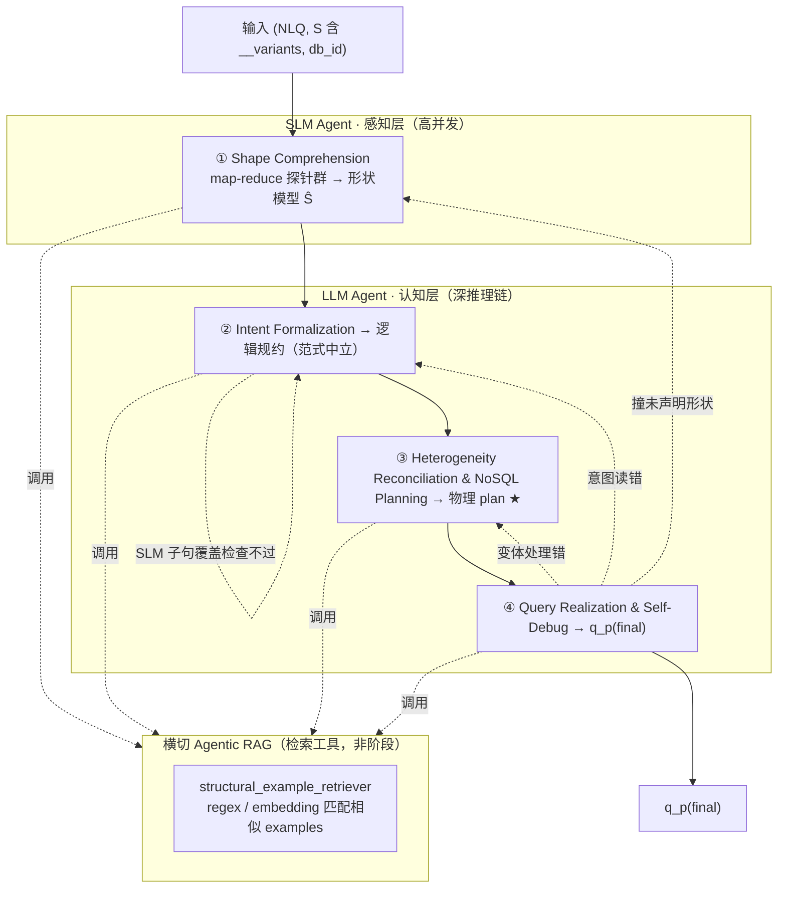

# 06 · Solution Design — SMART 求解侧参考架构与硬边界

> 本文件是 TEND **求解侧** 的单一真源 (SSoT)。定义 SMART **schema-less agentic 参考求解器**(2 智能体 / 4 阶段 + 横切 Agentic RAG)、阶段间接口契约、求解侧硬边界、shape-preserving target_fields 协议,以及 canonical 示例 `orchestra/1001` 的完整调用轨迹。不重复定义任务 IO、评测指标、gold 等价类、DataWorld 构造或 Agent 查询构造,这些概念的权威文档见 [§06-7 边界声明](#06-7)。
>
> **v3 设计立场**:MongoDB 是 **schema-less** 的——同一 collection 内每条 document 结构可不同。求解器的核心难点不是"从固定 schema 挑字段",而是 **把 NL 意图调和到「每条 document 形状都可能不同」的数据上**;谁绕过它谁就退化成 SQL 直译。SMART 为此设计为:**SLM 感知层**(高并发扫清整库异质结构)+ **LLM 认知层**(沿"意图 → Mongo 策略 → 落地"深推理)+ **横切 Agentic RAG**(按抽象结构跨域迁移 NoSQL 惯用法)。**全程零训练**,两类智能体权重冻结。求解侧硬边界与本架构 **正交**,逐字保留。

---

## Part I

## TL;DR

TEND 将 Text-to-NoSQL 求解任务定义为 `f: (NLQ, S, db_id) → q^{MQL}`(权威形式见 [01 §01-1](./01_task_definition.md#01-1))。本文档给出一个 **schema-less agentic 参考求解器 SMART**,并规定 **任意求解器** 提交到 TEND 时必须遵守的 **求解侧硬边界**。SMART 本身并非评测必需,但其智能体架构与硬边界是**互相正交**的两层。

**两智能体**:**SLM Agent(感知层)** 独占阶段 ①;**LLM Agent(认知层)** 独占阶段 ②③④。SLM 的强项是**高并发**——以 map-reduce 探针群并发探索整库异质结构;LLM 的强项是**深推理**——沿表示链串行求解。

**四阶段(按「输出表示类型」切边界)**:`① Shape Comprehension → ② Intent Formalization → ③ Heterogeneity Reconciliation & NoSQL Planning → ④ Query Realization & Self-Debug`。① 产出**形状模型 Ŝ**(字段×变体定位图);② 产出**逻辑规约**(范式中立);③ 产出**物理 plan**(含显式变体处理);④ 产出 `q_p^{(final)}`。**②→③ 这条边正是 Text-to-SQL 停下、TEND 真正难点开始的地方**:② 之前 SQL 也能表达,③ 起才是 schema-less 下 SQL 表达不出来的部分。"同一阶段 = 同一种产物上的不同操作"——所以生成与执行调试同属 ④(只差一个 executor 工具),不再拆开。

**Agentic RAG = 横切共享检索工具,不是阶段**(§06-2-5):单一 `structural_example_retriever`,暴露两个匹配方法——`regex_example_retriever`(按算子指纹 / shape_flex 签名 / stage 骨架正则匹配相似 examples)与 `embedding_example_retriever`(按去域化意图向量的 embedding 相似度匹配相似 examples)。各阶段按需调用、按阶段换键。**cross-domain holdout 下 surface 检索全是噪声,只迁移 NoSQL-native 结构/惯用法**——这是检索设计的命门。

**求解侧硬边界**(§06-4)—— 无论架构均须同时满足。**Audit 屏蔽**:`audit/` 整树、`test.json.{MQL, canonical_form_set, shape_policy, *_ref}`、`train.json.*_ref`、`rejected/` 均不可读(Tier-1 可读面以 [02 §02-1](./02_dataset_design.md#02-1) 与 `schemas/solver_allow_list.json` 为准)。**6 件禁用 operator**:`$sample`、`$rand`、`$$NOW`、`$out`、`$merge`、`$function`(语义权威 [01 §01-2-2](./01_task_definition.md#01-2-2));④ 出口零容忍。**构造–panel disjointness 求解侧对偶**:`S_solver`(SLM backbone + LLM backbone + 检索 embedding 模型)须与 20 个 4-panel 冻结模型及构造期 Agent 池 `{QPS, MS, MUT, PV, NLP, RTV, NNC, RA}` 双重不相交。**shape-preserving target_fields 协议**(§06-5):`preserve` 语义时强制 `$addFields` / `$map` 就地惯用法。

**Allow-list 与披露**:完整 allow-list 矩阵见 `schemas/solver_allow_list.json` 与 §06-3-1;求解器须披露 `S_solver` 全清单、witness K 限额、`R_max`(回退上限)、`R_retr`(检索调用上限)、allow-list 合规自检与 disjointness 核验结果([05 §05-5](./05_evaluation_methodology.md#05-5))。Canonical anchor `orchestra/1001`(L4、`reshape`、嵌套 embed、无 schema_flex)的 SMART 轨迹见 §06-6;因 `shape_policy = reshape`,§06-5 不适用。

---

<a id="06-1"></a>
## §06-1 SMART 两智能体 / 四阶段总览

<a id="06-1-1"></a>
### §06-1-1 架构图



**"②→③ 边 = SQL/NoSQL 分水岭"**:② 的逻辑规约是范式中立的(可映射到 SQL 窗口函数,也可映射到 Mongo);③ 才决定在 schema-less Mongo 里**按形状原生表达**,这是 SQL 直译必死之处。

**回路按"哪个表示错了"分流**(§06-2-4):`④→③`(变体处理错)/ `④→②`(意图读错)/ `④→①`(执行撞到未声明形状);`②` 出口加廉价 **SLM 子句覆盖检查**。`R_max`(总回退)与 `R_retr`(检索调用)由求解器披露([05 §05-5](./05_evaluation_methodology.md#05-5))。

<a id="06-1-2"></a>
### §06-1-2 各阶段 / 智能体职责简述

| 阶段 | 智能体 | 输出表示 | 一句话职责 |
| :-- | :-- | :-- | :-- |
| ① Shape Comprehension | **SLM Agent** | 形状模型 `Ŝ` | 并发探针扫整库异质结构:有哪些变体、判别键、同一逻辑字段散落各形状的定位图(`field_locus`)。无权重更新。 |
| ② Intent Formalization | **LLM Agent** | 逻辑规约 | 把 NLQ 解析成范式中立的逻辑规约(谓词/分组/窗口/聚合/输出形态/`shape_policy`);出口经 SLM 子句覆盖检查。 |
| ③ Heterogeneity Reconciliation & NoSQL Planning ★ | **LLM Agent** | 物理 plan | 把逻辑意图调和到 `Ŝ` 的异质形状上,选 NoSQL-native 访问策略并产出含 `variant_handling` 的 pipeline 骨架。命门。 |
| ④ Query Realization & Self-Debug | **LLM Agent** | `q_p^{(final)}` | 按 plan 落地 MQL;`mongo_executor` 在按变体分层的本地样本上跑;失败自纠正并分流回路;`ast_filter` 出口零容忍。 |

> 分工本质:**SLM = 感知(广度并行扫结构,重召回)** vs **LLM = 认知(深度串行推理,重精度)**。

<a id="06-1-3"></a>
### §06-1-3 接口契约与工具访问

阶段间 **只允许** 通过下表显式输入/输出通信;智能体的自治(探针 fan-out、检索、自纠正 turn)受限于本契约:禁止侧信道(全局变量、跨阶段文件缓存、隐藏字段、跨阶段隐式 agent memory)。机器可读 allow-list 见 `schemas/solver_allow_list.json`。

| 阶段 / 智能体 | 显式输入 | 显式输出 | 允许的外部访问 | 禁止访问(节选) |
| :-- | :-- | :-- | :-- | :-- |
| ① / SLM Agent | `NLQ`、`S`(含 `__variants`) | `Ŝ`(形状模型) | schema 公开字段、`__variants`、检索工具 | `mongodb_data` 任意载入、`test.json.MQL/shape_policy`、`audit/*` |
| ② / LLM Agent | `NLQ`、`Ŝ` | 逻辑规约 | 检索工具 | `test.json.{MQL, canonical_form_set, shape_policy, *_ref}` |
| ③ / LLM Agent | 逻辑规约、`Ŝ` | 物理 plan | `agent_design_rationale` 公开摘要、检索工具 | `test.json.{MQL, canonical_form_set, shape_policy, *_ref}` |
| ④ / LLM Agent | 物理 plan、本地 MongoDB | `q_p^{(final)}` | 本地库执行 API、≤ K witness(入 prompt)、`ast_filter`、检索工具 | 评测 gold 库、`test.json.MQL` |

> 契约要点:`Ŝ` 是下游唯一的 schema 视图;**① 严守 schema-only,禁任何 data 载入**(`__variants` 即形状权威契约,§06-4-4);witness ≤ K **入 prompt** 只在 ③/④ 允许,而 ④ 的 executor 可在**本地副本全量/分层样本**上执行(用于跨变体调试,§06-2-4)。

---

<a id="06-2"></a>
## §06-2 各阶段与共享工具细节

<a id="06-2-0"></a>
### §06-2-0 无训练原则

**求解全程不训练、不微调任何模型。** SLM Agent 与 LLM Agent 权重冻结;一切任务适配靠 in-context、检索增强与工具调用。早期 SMART(v1)的 SFT 路线(如 `SMART/get_SLM_precidtion.py` 加载离线微调预测)被 **推理期 SLM 探针群** 取代(映射见 Part II §06-II-4)。`train.json` 仅作**检索 examples**(few-shot / 相似样例),不作训练标签,且受 [§06-3-1](#06-3-1) allow-list 约束。检索工具的向量索引为**离线索引**,不动权重。求解器须在报告中声明「无权重更新」并披露 `S_solver`。

<a id="06-2-1"></a>
### §06-2-1 ① Shape Comprehension(SLM Agent · 高并发)

schema-less 下"理解结构"不是读一张固定 schema,而是**并发扫清一个异质形状空间**。单个 agent 串行决定"看哪儿"易 tunnel-vision、漏变体;漏一个形状,③ 的调和就会错。故 ① 以 **map-reduce 探针群** 完成,超额发探针以冗余换召回。

- **输入**:`(NLQ, S)`,`S` 含 `__variants`(结构由 [02 §02-1](./02_dataset_design.md#02-1) / [03 §03-6](./03_spider_anchored_dataworld.md#03-6) 给出)。
- **fan-out(并发探针,互相盲视)**:
  - 每 collection 一个探针:变体集合、判别键(discriminator)、覆盖率;
  - 每变体分支一个探针:字段/类型/嵌套;
  - 每个 NLQ 概念字段一个探针:**它散落在哪些变体、路径、类型、present/sparse/missing**;
  - 每个动态键/属性袋子树一个探针。
  - 每个探针可调 `structural_example_retriever` 找"类似变体形状别人怎么查"。
- **fan-in(reduce)**:**确定性代码**做 union / 去重 / 按规范化路径归并(不让聚合器幻觉造字段);仅"同一逻辑字段出现在多处是不是一回事"这类**语义冲突**交一个 SLM 归约探针裁定;标注 `coverage_gaps`。
- **输出 `Ŝ`(形状模型)**:核心是 `field_locus`——逻辑字段 × 变体的定位图(结构定义见 [§06-II-1](#06-ii-1))。
- **硬边界**:**schema-only**,禁任何 `mongodb_data` 载入(§06-4-4.2);`__variants` 为形状权威。真实数据若有未声明形状,留给 ④ 兜底并经 `④→①` 回路。

<a id="06-2-2"></a>
### §06-2-2 ② Intent Formalization(LLM Agent)

- **输入**:`(NLQ, Ŝ)`。
- **输出**:**逻辑规约**——范式中立地刻画"算什么":实体、谓词、分组键、窗口/聚合语义(含 missing 处理意图)、输出字段与缺失占位、排序语义、`shape_policy`(从 NLQ 自推断,§06-5)。**此刻不决定任何 Mongo 算子**。
- **消歧**:canonical NLQ 为精确锚;colloquial 作交叉核对(二者应指向同一意图)。
- **RAG 键**:`embedding_example_retriever` 用**去域化意图向量**(剥掉领域名词)找逻辑近邻。
- **出口检查**:廉价 **SLM 子句覆盖检查**——逐条核对 NLQ 的每个子句是否在逻辑规约中有落点;漏读则回 ② 修正(`②→②`)。意图漏读是"执行查不出来的灾难性错误",故在此设廉价闸。
- **②→③ 边**:逻辑规约里 SQL 可表达的部分到此为止;下一步进入 SQL 表达不出来的 Mongo 异质性调和。

<a id="06-2-3"></a>
### §06-2-3 ③ Heterogeneity Reconciliation & NoSQL Planning(LLM Agent · 命门 ★)

把逻辑意图调和到 `Ŝ` 的异质形状上,决定 **NoSQL-native 访问策略**并产出物理 plan。

- **输入**:逻辑规约、`Ŝ`(尤其 `field_locus`)。
- **输出**:**物理 plan**——Mongo pipeline 骨架(有序 stage + 算子选型)+ **`variant_handling`**(显式记录跨形状访问策略)。
- **典型 native 策略**(SQL 表达不出来,对应 `structural_schema_flex`):
  - 多态 document → `$switch` / `$type` 按判别键分派;
  - 动态键 → `$objectToArray` / `$arrayToObject`;
  - schema 版本演进 → 多层 `$ifNull` 链;
  - 稀疏属性袋 → `$reduce` / `$arrayToObject`;
  - null-vs-missing 严格区分(Norm 第三层,[01 §01-4-3](./01_task_definition.md#01-4-3));
  - 数组就地计算 → `$map` / `$reduce` / `$filter`。
- **RAG 键**(最高价值):`structural_example_retriever` 按算子指纹正则(`canonical_form_set.must_contain` 在 train 可读)+ shape_flex 签名匹配"用了同一 native 惯用法的相似 examples"。
- 这是跨域迁移真正起作用的地方:**域内容不迁移,native 惯用法迁移**。

<a id="06-2-4"></a>
### §06-2-4 ④ Query Realization & Self-Debug(LLM Agent + 工具)

生成与执行调试同属本阶段(只差一个 executor 工具,不拆)。

- **输入**:物理 plan、求解器自持的本地 MongoDB(与评测库 **不** 同源)。
- **动作**:
  1. 按 plan 落地成具体 MQL;可调检索工具取同骨架 MQL 片段;
  2. `mongo_executor` 解析 + dry-run;**必须在「按变体分层的本地样本」上跑**——每个相关变体 ≥ 1 条 + null/missing/空数组/动态键边界,否则"变体 A 通过 ≠ 变体 C 不出错"必漏;
  3. `ast_filter` 扫 6 件禁用 operator,命中则重写;
  4. 失败时按错误**分流回路**:变体处理错 → ③;意图读错 → ②;撞到 `Ŝ` 未声明的形状 → ①。
- **反馈纯度**:回路信息裁剪为 `{error_code, stage_index, suspect_field, failing_variant}` 结构化摘要;executor 原始结果留在 agent 上下文是合法工作记忆,但 **`q_p^{(final)}` 不得内嵌原始执行行或任何 gold 派生内容**。
- **预算**:`R_max`(总回退)+ `R_retr`(检索调用)须披露;`R_max` 次内仍失败则以 `[]` 自我放弃,EX 记未命中。
- **输出**:通过 dry-run 并经最后一次 AST 过滤的 `q_p^{(final)}`。不得将评测 gold 库执行结果用作调试目标。

<a id="06-2-5"></a>
### §06-2-5 Agentic RAG —— 横切共享工具(跨域迁移结构)

**定位**:Agentic RAG **不是阶段、不是 agent**,而是暴露给两类 agent 的**检索工具**——`structural_example_retriever`,提供两个**匹配相似 examples** 的方法:

| 方法 | 匹配方式 | 典型用途 |
| :-- | :-- | :-- |
| `regex_example_retriever` | 正则(算子指纹 `canonical_form_set.must_contain`、stage 骨架、shape_flex 签名) | 找同型变体 / 同骨架 / 同 native 惯用法的 examples |
| `embedding_example_retriever` | embedding 相似度(去域化意图向量、草稿 MQL 向量、`Ŝ` 字段路径签名) | 找逻辑意图近邻的 examples |

**核心约束**:TEND 是 **cross-domain holdout**([02 §02-3](./02_dataset_design.md#02-3))——test 域在 train 不存在。按 surface NL / 字段名检索只会捞回不存在的同域邻居,全是噪声。**能跨域迁移的只有 NoSQL-native 结构 / 惯用法**,故两个方法的键一律打在**抽象结构**上,而非领域内容。

- **可调阶段**:①②③④ 均可按需调用、按阶段换键。
- **可读语料**(`train.json` 每条):`record_id`、`db_id`、`nl_queries`、`MQL`、`canonical_form_set`、`difficulty`、`shape_policy`、`world_signature`。**`canonical_form_set.must_contain` 可读 = 白送每个例子的算子签名**,正则键好打;`shape_policy`/`difficulty` 可读 = 直接做检索过滤(注意:这是 **train** 的 `shape_policy`,可读;**test** 记录的 `shape_policy` 不可读,§06-4-1)。
- **屏蔽**:所有 `train.json.*_ref`、`audit/*`。
- **embedding 模型**计入 `S_solver`(§06-4-3);正则匹配无模型。向量索引为离线索引,不动权重。
- **为什么必须 agentic**:有用的检索键随阶段变(② 意图向量、③ 算子指纹、④ 错误模式);一次性 RAG 开局取死一批就废。检索预算 `R_retr` 须披露。

---

<a id="06-3"></a>
## §06-3 跨阶段信息流

<a id="06-3-1"></a>
### §06-3-1 各阶段可读字段

完整 allow-list 以 `schemas/solver_allow_list.json` 为准。下表为摘要(列名按阶段;最后一列为共享检索工具可读面):

| 资产 / 字段 | ① Shape<br/>(SLM) | ② Intent<br/>(LLM) | ③ Plan<br/>(LLM) | ④ Realize<br/>(LLM) | RAG 工具 |
| :-- | :--: | :--: | :--: | :--: | :--: |
| `mongodb_schema/<db_id>.json`(含 `__variants`) | 读 | 读 | 读 | 读 | — |
| `mongodb_data`(样本受限) | 禁 | 禁 | ≤ K 入 prompt | 本地副本执行 + ≤ K 入 prompt | — |
| `agent_design_rationale/<db_id>.yaml` | 可选 | — | 可选 | 可选 | — |
| `test.json.nl_queries` | 读 | 读 | 读 | — | — |
| `test.json.db_id` | 读 | 读 | 读 | 读 | — |
| `test.json.difficulty` | 读 | 读 | — | — | — |
| `test.json.MQL` / `canonical_form_set` | 禁 | 禁 | 禁 | 禁 | 禁 |
| **`test.json.shape_policy`** | 禁 | 禁 | 禁 | 禁 | 禁 |
| `test.json.*_ref`(所有后缀) | 禁 | 禁 | 禁 | 禁 | 禁 |
| `train.json.{nl_queries, MQL, canonical_form_set, difficulty, shape_policy, …}` | 经检索工具 | 经检索工具 | 经检索工具 | 经检索工具 | 读 |
| `train.json.*_ref` | 禁 | 禁 | 禁 | 禁 | 禁 |
| `audit/*`(整棵树) | 禁 | 禁 | 禁 | 禁 | 禁 |

> 要点:**test 记录的 `shape_policy` 不可读**(§06-5 要求 solver 从 NLQ 自推断,故不作 gold 提示);**train 记录的 `shape_policy` 可读**(检索过滤)。`train.json` 可读字段统一**经检索工具承载**,agent 不直接遍历 `train.json`。

<a id="06-3-2"></a>
### §06-3-2 不可读字段(不完全列表)

- `audit/` 整棵树(展开见 [§06-4-1](#06-4-1));
- `test.json` 中:`MQL`、`canonical_form_set`、`shape_policy`,及任何 `*_ref`;
- `train.json` 中任何 `*_ref`(检索工具同样屏蔽);
- `rejected/` 目录。

<a id="06-3-3"></a>
### §06-3-3 状态共享规则

1. **只通过显式输出传递状态**:阶段间信息须出现在显式 output 或下一阶段显式 input;探针 scratchpad / 检索结果 / 中间表示不得作为跨阶段隐式状态(除非作为显式产物 `Ŝ` / 逻辑规约 / 物理 plan 传递)。
2. **禁止跨阶段隐藏上下文**:不得把探针 prompt、检索 examples 或执行日志 **原文** 注入 `q_p^{(final)}`。
3. **禁止外部服务污染**:不得将求解数据外发至评测方控制外的第三方持久化存储。
4. **回路信息纯度**:见 §06-2-4。

---

<a id="06-4"></a>
## §06-4 求解侧硬边界

> 本节四项约束 **架构无关**:无论 SMART 是 fixed workflow 还是 schema-less agentic,均逐字适用。

<a id="06-4-1"></a>
### §06-4-1 audit 屏蔽清单

**原则**:凡 `audit/` 下任何资产求解器均不可读;`test.json` 的 gold 字段(含 `MQL`、`canonical_form_set`、`shape_policy`)与任何 `*_ref` 不可读。违反即 **评测无效**。机器可读枚举见 `solver_allow_list.json` 的 `audit_blocklist` 与 `tier1_forbidden_glob`。

<details>
<summary><strong>audit/ 子树(完整屏蔽清单)</strong></summary>

- `audit/<db_id>/wp_output.yaml`
- `audit/<db_id>/migration_log.json`
- `audit/<db_id>/phenomena_audit.json`
- `audit/<db_id>/qra_trace.json`
- `audit/<db_id>/nnc_trace.json`
- `audit/ra_audit.json`
- `audit/ra_augment_trace.json`
- `audit/reference_panel/*`
- `audit/rejected/*`

</details>

**额外屏蔽**:`test.json.MQL`(gold 答案)、`test.json.canonical_form_set`(gold 等价类)、`test.json.shape_policy`(gold 提示,§06-5 要求自推断)、`test.json.<任何 *_ref>`、`train.json.<任何 *_ref>`。

<a id="06-4-2"></a>
### §06-4-2 6 件禁用 operator 的生成约束

权威语义见 [01 §01-2-2](./01_task_definition.md#01-2-2);AST 过滤实现见 Part II §06-II-2。6 件:`$sample`、`$rand`、`$$NOW`、`$out`、`$merge`、`$function`。

| # | operator / token | 禁用原因(摘要) |
| :-- | :-- | :-- |
| 1 | `$sample` | 随机采样,破坏确定性评测 |
| 2 | `$rand` | 纯随机数,破坏 P_det |
| 3 | `$$NOW` | 墙钟时间,破坏 P_det |
| 4 | `$out` | 写操作,破坏只读不可变性 |
| 5 | `$merge` | 写操作,破坏只读不可变性 |
| 6 | `$function` | 服务器端 JS 逃逸,破坏可分析性与确定性 |

`ast_filter` 工具须在 **每次 query 生成/重写后**(④ 落地、检索驱动的重写、自纠正修复)立刻运行,命中则重采样或规则重写;`R_max` 次内仍命中则以 `[]` 自我放弃([05 §05-1](./05_evaluation_methodology.md#05-1))。

<a id="06-4-3"></a>
### §06-4-3 构造–panel disjointness(求解侧对偶)

[05 §05-3](./05_evaluation_methodology.md#05-3) 规定 `A ∩ B = ∅`(A = 构造 Agent 池 `{QPS, MS, MUT, PV, NLP, RTV, NNC, RA}`,B = 20 个冻结参考模型)。

**求解侧对偶**:`S_solver` = **SLM Agent backbone** + **LLM Agent backbone** + **检索 embedding 模型**(`structural_example_retriever`)+ 任何辅助模型(正则匹配与确定性 reduce 无模型,不计)。须同时满足:

- `S_solver ∩ B_frozen = ∅`(20 个 4-panel 冻结模型,manifest 见 `audit/reference_panel/manifest_<release>.json`);
- `S_solver ∩ C_pool = ∅`(构造期 Agent 池)。

**示例**:若 LLM Agent backbone = `claude-4-opus` 且它在 frontier panel 冻结名单内,则 disjointness 失败,整份评测不合规。求解器须在 [05 §05-5](./05_evaluation_methodology.md#05-5) 披露 `S_solver` 全清单;`solver_allow_list.json` 的 `four_party_disjointness` 提供机器可读 invariant。

<a id="06-4-4"></a>
### §06-4-4 额外边界

1. **`world_signature` 不可反推** —— 不得重建 DataWorld 构造链或反推 Phase B audit trace。
2. **① 严守 schema-only** —— `mongodb_data` 禁任何载入进 ① Shape Comprehension;witness ≤ K **入 prompt** 推迟到 ③/④;④ 的 executor 在本地副本上执行(用于跨变体调试)不受 K 限(K 限的是入 prompt 的样本数,不是本地执行的数据量)。
3. **`audit/rejected/` 不可读**。
4. **任何 `*_ref` dereference 均屏蔽**;检索工具同样不得返回 `*_ref`。
5. **智能体工具调用受 allow-list 约束** —— 任何探针/agent 的任何工具调用(含检索、executor)所读路径,必须落在其所属阶段 allow-list 与该工具可读面内;agent 自治不豁免硬边界。

---

<a id="06-5"></a>
## §06-5 shape-preserving target_fields 协议

<a id="06-5-1"></a>
### §06-5-1 协议触发条件

当 NLQ 出现以下语义时,solver 内部 `shape_policy` 推断为 `preserve`:

- 英文关键词:`attach`、`augment`、`add field`、`preserve structure`、`in place`、`decorate`、`annotate`(不限于);
- 中文语义:`为每个 X 附加 / 增补 / 标注 / 就地计算`、`保持原结构` 等;
- 语义形式:返回的每个顶层文档 **一一对应** 输入集合的每个文档,只在原文档上 **新增字段**,不改文档数与嵌套层次。

非触发:`reshape`(改变文档数、展平、透视、分组)或 `reduce`(聚合到更少文档/标量)。**record 上的 `shape_policy` 真值对求解器不可读**(§06-4-1);求解器在 **② Intent Formalization** 阶段由 LLM Agent **从 NLQ 自推断**,SLM ① 提供的 `field_locus` 辅助判断"是否一一对应原文档"。

<a id="06-5-2"></a>
### §06-5-2 生成惯用法

触发后,④ Query Realization 必须用 **就地惯用法**:`$addFields`(或 `$set`)叠加新字段,内部用 `$map`、`$reduce`、`$filter` 等表达式级算子。**反模式**:`$unwind + $group` 重建数组——preserve 语义下导致 NormExec 后 BSON 排序不等价,`≡_rec` 失败,EX=0。

<a id="06-5-3"></a>
### §06-5-3 solver 内部 meta 约定

求解器可在内部 prompt 注入(**仅提示词辅助,不进评测输出**):`shape_policy: preserve`、`target_fields`(新增顶层字段名数组)。`target_fields` 由 **② Intent Formalization** 写入逻辑规约(借 ① 的 `field_locus`),贯穿 ③④;评测 `q_p^{(final)}` **不**含 meta。

<a id="06-5-4"></a>
### §06-5-4 不适用场景

- **`reshape`**:NLQ 明显要求重塑形态时按标准 pipeline 自由选型(canonical `orchestra/1001` 即属此类)。
- **`reduce`**:NLQ 要求聚合到更少文档或单一标量时自由选型。

---

<a id="06-6"></a>
## §06-6 canonical 示例 `orchestra/1001` 的 SMART 调用轨迹

本样本为嵌套 embed、`reshape`、**无 schema_flex** 的 L4 题;因 `shape_policy = reshape`,**[§06-5](#06-5) 不适用**,`variant_handling` 为空(其异质性机制由 schema_flex 类 record 行使,非本例)。

<a id="06-6-1"></a>
### §06-6-1 Canonical Anchor Record

<!-- canonical-anchor: orchestra/1001 -->
```json
{
  "record_id": 1001,
  "db_id": "orchestra",
  "nl_queries": {
    "canonical": "对每位 conductor，先在其指挥的 orchestra 的 performance 上按 Performance_ID 升序、对 Attendance 计算窗口大小为 (当前, 前 2 场) 的滑动平均；取该 conductor 的最后一次窗口平均值作为代表值 (Attendance 缺失视为 0)。然后计算所有 conductor 代表值的中位数。最终只输出代表值严格大于该中位数的 conductor，字段为 Name 与 last_window_avg；若 Name 缺失则显示为 (unknown)；不要求排序。",
    "colloquial": "列出最近场次出勤趋势高于同行中位数的指挥。"
  },
  "MQL": "db.conductor.aggregate([
  { $unwind: { path: \"$orchestra\", preserveNullAndEmptyArrays: false } },
  { $unwind: { path: \"$orchestra.performance\", preserveNullAndEmptyArrays: false } },
  { $setWindowFields: {
      partitionBy: \"$_id\",
      sortBy: { \"orchestra.performance.Performance_ID\": 1 },
      output: {
        moving_avg_attendance: {
          $avg: { $ifNull: [\"$orchestra.performance.Attendance\", 0] },
          window: { documents: [-2, 0] }
        }
      }
  } },
  { $group: {
      _id: \"$_id\",
      Name: { $first: { $ifNull: [\"$Name\", \"(unknown)\"] } },
      last_window_avg: { $last: \"$moving_avg_attendance\" }
  } },
  { $facet: {
      per_conductor: [ { $project: { _id: 0, Name: 1, last_window_avg: 1 } } ],
      global_median: [
        { $sort: { last_window_avg: 1 } },
        { $group: { _id: null, vals: { $push: \"$last_window_avg\" } } },
        { $project: { _id: 0, median: { $arrayElemAt: [\"$vals\", { $floor: { $divide: [{ $size: \"$vals\" }, 2] } }] } } }
      ]
  } },
  { $project: {
      kept: { $filter: {
        input: \"$per_conductor\",
        as: \"c\",
        cond: { $gt: [\"$$c.last_window_avg\", { $arrayElemAt: [\"$global_median.median\", 0] }] }
      } }
  } },
  { $unwind: \"$kept\" },
  { $project: { _id: 0, Name: \"$kept.Name\", last_window_avg: \"$kept.last_window_avg\" } }
])",
  "canonical_form_set": {
    "must_contain": ["$setWindowFields", "$facet", "$ifNull"],
    "must_not_contain": [],
    "must_contain_at_root": ["$setWindowFields", "$facet"],
    "must_not_contain_at_root": []
  },
  "difficulty": "L4",
  "shape_policy": "reshape",
  "world_signature": "sha256:a47f3e8b1c2d4e5f6a7b8c9d0e1f2a3b4c5d6e7f8a9b0c1d2e3f4a5b6c7d8e90",
  "agent_design_rationale_ref": "fixtures/orchestra/sra.yaml",
  "mutations_ref": "fixtures/orchestra/mutations.json"
}
```

<a id="06-6-2"></a>
### §06-6-2 ① Shape Comprehension(SLM)输出 `Ŝ`

```text
Ŝ.collections.conductor.variants = [ {id: "v0", coverage: 1.0} ]   # 无 schema_flex，单一形状
Ŝ.field_locus = {
  _id:               [ {variant: v0, path: "_id"} ],
  Name:              [ {variant: v0, path: "Name", presence: "sometimes"} ],   # 可缺失 → ④ 关注
  performance.Pid:   [ {variant: v0, path: "orchestra[].performance[].Performance_ID"} ],
  performance.Att:   [ {variant: v0, path: "orchestra[].performance[].Attendance", presence: "sparse"} ]
}
Ŝ.coverage_gaps = []
Ŝ.shape_flex_signature = []        # 本例无变体；命门 ③ 退化为常规 pipeline 规划
```

并发探针:`conductor` 集合探针 + `orchestra/performance` 嵌套探针 + `Name/Performance_ID/Attendance` 三个字段定位探针;reduce 确定性合并,无语义冲突。

<a id="06-6-3"></a>
### §06-6-3 ②→③→④ 摘要

- **② Intent(LLM)**:逻辑规约 = {per: conductor;compute: last_window_avg = window_avg(Attendance, 当前+前2, sortBy Performance_ID, missing→0, take last);aggregate: median(last_window_avg, global);filter: last_window_avg > median(strict);output: {Name(missing→"(unknown)"), last_window_avg}, order: none;shape_policy: reshape}。SLM 子句覆盖检查通过(窗口/中位数/缺失/排序四子句均有落点)。
- **③ Plan(LLM)**:`$unwind`×2 → `$setWindowFields`(window[-2,0]) → `$group`(last) → `$facet`(per_conductor + global_median via sort+arrayElemAt+floor) → `$project/$filter`($gt) → `$unwind` → `$project`;`variant_handling = []`(无 flex)。RAG 命中"窗口+facet 中位数"骨架。
- **④ Realize+Debug(LLM)**:落地后 `mongo_executor` 在本地样本(含 Attendance 缺失、Name 缺失边界)跑;首跑因 `Performance_Id` 拼写失败,收 `{error_code: FIELD_PATH, stage_index: 3, suspect_field: Performance_Id}` 自纠正;`ast_filter` 通过(无 6 禁用算子);提交 `q_p^{(final)}`。
- **评测**:NormExec ≡_rec gold ⇒ EX=1。

---

<a id="06-7"></a>
## §06-7 边界声明

| 主题 | 权威文档 |
| :-- | :-- |
| 任务签名、6 件禁用 operator 语义、EX 双条件 | [01](./01_task_definition.md) |
| 资产目录、record 字段契约、Tier-1/Audit 边界 | [02](./02_dataset_design.md) |
| Spider 锚定 DataWorld、SRA/DM、`__variants` | [03](./03_spider_anchored_dataworld.md) |
| QPS/MS/MUT/PV/NLP/RTV/NNC/RA、canonical_form_set 派生 | [04](./04_agent_framework.md) |
| 7 指标、4-panel 报告、构造–panel disjointness | [05](./05_evaluation_methodology.md) |

**本文档声明所有权的内容**:SMART schema-less agentic 双智能体 / 四阶段参考求解器(SLM 感知层 + LLM 认知层,无训练)、Agentic RAG 共享检索工具(structural_example_retriever:regex + embedding 匹配相似 examples)、三个中间表示(Ŝ / 逻辑规约 / 物理 plan)、求解侧 audit 屏蔽清单、6 件禁用 operator 的 AST 过滤、构造–panel disjointness 求解侧对偶、shape-preserving target_fields 协议、canonical `orchestra/1001` SMART 轨迹、机器可读 allow-list `solver_allow_list.json`。

---

## Part II

<a id="06-ii-1"></a>
### §06-II-1 接口契约与三个中间表示(Typed)

# uses: typing

```
# 两类冻结权重智能体（prompt + 工具驱动；无微调）
slm_agent = SLMAgent(tools=[schema_browser, fk_path_tracer, structural_example_retriever])  # 高并发探针
llm_agent = LLMAgent(tools=[structural_example_retriever,
                            ast_filter, mongo_executor, witness_sampler])
# structural_example_retriever 提供两个匹配方法: regex_example_retriever, embedding_example_retriever

# ---- 三个中间表示（阶段边界 = 表示类型改变）----
ShapeModel = {                      # ① 输出
  "collections": {str: {
      "variants": [{"id": str, "discriminator": dict, "coverage": float, "fields": dict}],
      "field_locus": {str: [        # 逻辑字段 → 它散落各变体的定位
          {"variant": str, "path": str, "type": str, "presence": str}  # presence: always|sometimes|sparse
      ]}
  }},
  "coverage_gaps": [str],
  "shape_flex_signature": [str],    # e.g. ["polymorphic","dynamic_key"]
}
LogicalSpec = {                     # ② 输出（范式中立）
  "entity": str, "per": str,
  "compute":   [{"name": str, "op": str, "over": str, "window": str|None,
                 "order": str|None, "missing": object}],
  "aggregate": [{"name": str, "op": str, "of": str, "scope": str}],
  "filter":    [{"keep": str}],
  "output":    {"fields": [str], "missing": dict, "order": str},
  "shape_policy": str,              # 自 NLQ 推断：preserve|reshape|reduce
}
PhysicalPlan = {                    # ③ 输出（Mongo 专属）
  "collection": str,
  "stages": [{"op": str, "note": str}],
  "variant_handling": [{"strategy": str, "on": str}],  # $switch|$objectToArray|$ifNull_chain|...
}

def smart_solve(NLQ: str, S: dict, db_id: str) -> str:
    S_hat: ShapeModel = slm_agent.comprehend_shapes(NLQ, S)        # ① 并发探针 → Ŝ
    retries, feedback = 0, None
    while retries <= R_MAX:
        spec: LogicalSpec = llm_agent.formalize_intent(NLQ, S_hat, feedback=feedback)  # ②
        if not slm_clause_coverage_ok(spec, NLQ):                  # ② 出口廉价 SLM 检查
            feedback = {"to": "intent", "miss": clause_gap(spec, NLQ)}; retries += 1; continue
        plan: PhysicalPlan = llm_agent.plan_nosql(spec, S_hat)     # ③ 命门
        q = llm_agent.realize_and_debug(plan, S_hat, db_id)        # ④ 生成+executor+自纠正
        q = ast_reject_or_rewrite(q)                               # §06-II-2
        ok, feedback = llm_agent.verify_executable(q, db_id)       # 跨变体本地 dry-run
        if ok:
            return q
        retries += 1                                              # feedback.to ∈ {shape, intent, plan}
    return "[]"  # 自我放弃
```

契约校验:每次工具调用(含探针检索、executor)经 `assert_allow_list(stage, paths_read)`,对照 `solver_allow_list.json` 的 `stages.*` 与 `tools.*`;agent 自治不豁免 allow-list(§06-4-4.5)。

---

<a id="06-ii-2"></a>
### §06-II-2 AST 过滤工具实现伪代码

与 [01 §01-II-5](./01_task_definition.md#01-ii-5) `disabled_operator_scanner` 对齐;6 件禁用 operator 须在 pipeline 任意深度被拒。④ 每次 query 生成/重写后调用。

# uses: typing
```

DISABLED_OPERATORS = {"$sample", "$rand", "$out", "$merge", "$function"}
DISABLED_SYSTEM_VARS = {"$$NOW"}

def ast_reject(pipeline: list) -> tuple[bool, list[str]]:
    hits: list[str] = []

    def walk(node, path="$"):
        if isinstance(node, dict):
            for k, v in node.items():
                if k in DISABLED_OPERATORS:
                    hits.append(f"{path}.{k}")
                walk(v, f"{path}.{k}")
        elif isinstance(node, list):
            for i, item in enumerate(node):
                walk(item, f"{path}[{i}]")

    walk(pipeline)
    return (len(hits) == 0, hits)

def ast_reject_or_rewrite(q_mql: str) -> str:
    pipeline = Parse(q_mql)
    ok, hits = ast_reject(pipeline)
    if ok and not any(v in q_mql for v in DISABLED_SYSTEM_VARS):
        return q_mql
    return resample_or_rule_rewrite(q_mql, hits)  # agent-specific
```

---

<a id="06-ii-3"></a>
### §06-II-3 机器可读 allow-list JSON

权威文件:`proposals/schemas/solver_allow_list.json`

| 键 | 用途 |
| :-- | :-- |
| `disabled_operators` / `disabled_system_vars` | 6 件禁用 operator + `$$NOW` |
| `stages.*.readable` / `forbidden` | 四阶段字段 allow-list(`shape_comprehension`(SLM)/ `intent_formalization` / `heterogeneity_planning` / `query_realization`(LLM)) |
| `tools.example_retrieval` | 共享检索工具(regex + embedding 匹配相似 examples)的可读面、可调阶段、跨域检索原则 |
| `audit_blocklist` / `tier1_forbidden_glob` | audit 屏蔽 glob(含 `test.json:shape_policy`) |
| `four_party_disjointness` | disjointness invariant 与 `S_solver` 范围(SLM + LLM backbone + 检索 embedding) |
| `frozen_panels` | 4-panel 冻结模型占位 |
| `shape_preserving` | preserve 语义触发词与 required idiom |

**校验命令**

```bash
jsonschema --schema https://json-schema.org/draft/2020-12/schema \
  --instance proposals/schemas/solver_allow_list.json
python -m json.tool proposals/schemas/solver_allow_list.json > /dev/null
```

---

<a id="06-ii-4"></a>
### §06-II-4 SMART Pilot 骨架(映射现有 `/SMART/` 代码,agentic 重构 · 无训练)

现有模块被 **包装为智能体的工具或能力**,**权重一律冻结、不再 SFT**:

| 智能体 / 工具 | 阶段 | 复用模块 | agentic 重构要点 |
| :-- | :-- | :-- | :-- |
| **SLM Agent** | ① Shape Comprehension | `SMART/get_SLM_precidtion.py` | 离线 SFT 预测加载 → **推理期 SLM 探针群**,并发产出形状/字段定位 hint,无权重更新 |
| **LLM Agent** | ②③④ | `SMART/LLM_debugger.py`、`SMART/LLM_Optimizer.py`、`SMART/utils/mongosh_exec.py` | 生成 + 检索驱动改写 + `MongoShellExecutor` dry-run,组成 ②→③→④ 的串行推理 + 自纠正回路 |
| **structural_example_retriever** | ①②③④ | `SMART/rag_by_nlq_pref.py`、`SMART/build_vec_lib.py` | 包装为两个匹配方法:`embedding_example_retriever`(向量库)+ `regex_example_retriever`(算子指纹正则);按阶段换键,匹配相似 examples |

**Pilot 编排骨架**

# uses: SMART.* (pseudocode orchestrator — new file SMART/smart_agentic_pilot.py)
```

from SMART.get_SLM_precidtion import slm_probe                    # ① SLM 探针（inference, no SFT）
from SMART.LLM_debugger import query_debug                        # ②③④ LLM 生成
from SMART.LLM_Optimizer import rag_optimize                      # ③④ 检索驱动改写
from SMART.rag_by_nlq_pref import rag_by_nlq_pref                 # → structural_example_retriever
from SMART.utils.mongosh_exec import MongoShellExecutor           # ④ executor 工具
from proposals.schemas.solver_allow_list import ast_reject_or_rewrite  # §06-II-2

executor = MongoShellExecutor()

def shape_comprehension(NLQ, S):                  # ① 并发探针 → Ŝ（map-reduce）
    probes = fan_out_probes(NLQ, S)               # per-collection / per-variant / per-field / per-dynamic-key
    parts  = parallel_map(slm_probe, probes)      # 高并发；每个探针可调检索工具
    return deterministic_reduce(parts)            # union/dedup + 仅语义冲突交 SLM 裁定 → ShapeModel

def run_record(record: dict) -> str:
    NLQ, db_id = record["nl_queries"]["canonical"], record["db_id"]
    S = load_schema(db_id)                        # 含 __variants；① 不读 mongodb_data
    S_hat = shape_comprehension(NLQ, S)           # ①
    feedback = None
    for _ in range(R_MAX):
        spec = formalize_intent(NLQ, S_hat, feedback)         # ②（LLM）
        if not slm_clause_coverage_ok(spec, NLQ):             # ② 出口 SLM 检查
            feedback = {"to": "intent"}; continue
        plan = plan_nosql(spec, S_hat)                        # ③（LLM，命门）
        q = query_debug(NLQ, spec, plan, S_hat, db_id)        # ④ 落地
        q = rag_optimize(NLQ, db_id, plan, q)                 # ④ 检索驱动改写
        q = ast_reject_or_rewrite(q)
        result = executor.execute_query(q, db_name=db_id, get_str=True,
                                        sample="variant_stratified")  # ④ 跨变体本地 dry-run
        if not isinstance(result, str):                       # 通过
            return q
        feedback = route_feedback(parse_exec_error(result))   # {to: shape|intent|plan}
    return "[]"
```

**TEND 合规改造清单**(pilot → 正式 solver):

1. 接入 `solver_allow_list.json` gate,对 **每次工具调用(含探针检索、executor)** 校验;禁读 `test.json.{MQL, canonical_form_set, shape_policy}` / `*_ref` / `audit/*`。
2. ④ 每次 query 生成/重写出口挂 §06-II-2 AST 过滤(6 件禁用 operator)。
3. 披露 `S_solver`(SLM + LLM backbone + 检索 embedding)并运行 disjointness 检查;声明「无权重更新」。
4. `target_fields` / `shape_policy` 由 ② 从 NLQ 自推断(test 的 `shape_policy` 不可读);preserve 时强制 `$addFields`/`$map`(§06-5)。
5. ④ 仅用本地 MongoDB 副本,且 executor 在**按变体分层样本**上跑;不得连接评测 gold 库。
6. ① 严守 schema-only;披露 `R_max`、`R_retr`、检索 embedding 模型。

> **本卷职责结束于:** 规定求解侧 SMART schema-less agentic 参考架构、硬边界、allow-list 与 pilot 映射。评测期 7 指标、4-panel 报告与 disjointness gate 由 [05](./05_evaluation_methodology.md) 负责。
