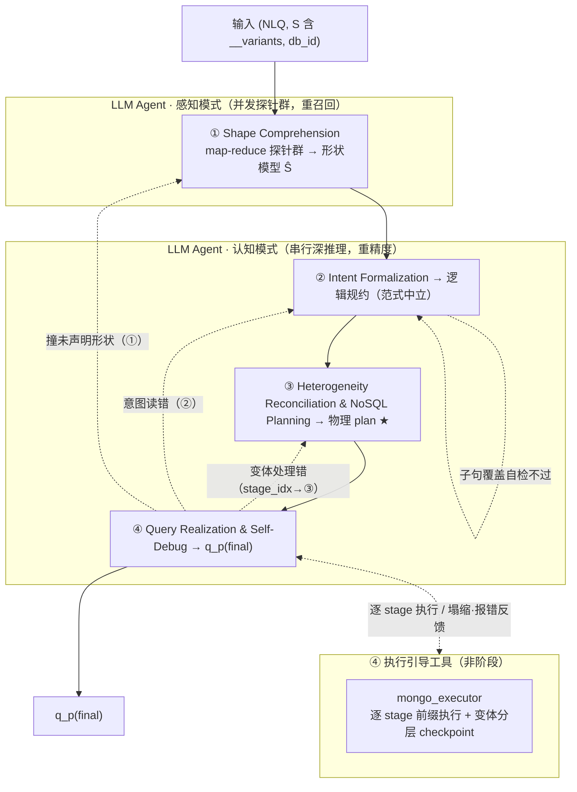

# 06 · Solution Design — SMART 求解侧参考架构与硬边界

> 本文件是 TEND **求解侧** 的单一真源 (SSoT)。定义 SMART **schema-less agentic 参考求解器**(单一 LLM backbone / 4 阶段)、阶段间接口契约、求解侧硬边界、shape-preserving target_fields 协议,以及 canonical 示例 `financial/1001` 的完整调用轨迹。不重复定义任务 IO、评测指标、gold 等价类、DataWorld 构造或 Agent 查询构造,这些概念的权威文档见 [§06-7 边界声明](#06-7)。
>
> **v3 设计立场**:MongoDB 是 **schema-less** 的——同一 collection 内每条 document 结构可不同。求解器的核心难点不是"从固定 schema 挑字段",而是 **把 NL 意图调和到「每条 document 形状都可能不同」的数据上**;谁绕过它谁就退化成 SQL 直译。SMART 为此设计为 **单一 LLM backbone / 4 阶段流水线**:先以 **感知模式**(map-reduce 探针群高并发扫清整库异质结构、重召回)产出形状,再 **认知模式**(沿"意图 → Mongo 策略 → 落地"串行深推理、重精度)求解,并在落地阶段以 **逐 stage 执行引导(per-stage execution-guided decoding)** 在本地分层样本上验证、定位、自纠正。**全程零训练**,backbone 权重冻结;**求解器完全不依赖 `train.json`**(既不训练也不检索)。求解侧硬边界与本架构 **正交**,逐字保留。

---

## Part I

## TL;DR

TEND 将 Text-to-NoSQL 求解任务定义为 `f: (NLQ, S, db_id) → q^{MQL}`(权威形式见 [01 §01-1](./01_task_definition.md#01-1))。本文档给出一个 **schema-less agentic 参考求解器 SMART**,并规定 **任意求解器** 提交到 TEND 时必须遵守的 **求解侧硬边界**。SMART 本身并非评测必需,但其求解架构与硬边界是**互相正交**的两层。

**单一 backbone,两种工作模式**:同一 **LLM Agent** 贯穿四阶段——① 以 **感知模式**(map-reduce 探针群并发扫整库异质结构,重召回),②③④ 以 **认知模式**(沿表示链串行深推理,重精度)。感知探针在成本敏感时可降级为同族小模型(纯工程优化,不入架构契约)。

**四阶段(按「输出表示类型」切边界)**:`① Shape Comprehension → ② Intent Formalization → ③ Heterogeneity Reconciliation & NoSQL Planning → ④ Query Realization & Self-Debug`。① 产出**形状模型 Ŝ**(字段×变体定位图);② 产出**逻辑规约**(范式中立);③ 产出**物理 plan**(含显式变体处理);④ 产出 `q_p^{(final)}`。**②→③ 这条边正是 Text-to-SQL 停下、TEND 真正难点开始的地方**:② 之前 SQL 也能表达,③ 起才是 schema-less 下 SQL 表达不出来的部分。"同一阶段 = 同一种产物上的不同操作"——所以生成与执行调试同属 ④(只差一个 executor 工具),不再拆开。

**Per-Stage Execution-Guided Decoding = ④ 的执行引导机制,不是阶段**(§06-2-5):Mongo aggregation pipeline 是有序 stage 序列 `[stage₁,…,stage_N]`,**任意前缀 `[stage₁…stage_k]` 自身即一条合法可执行 pipeline**。④ 每落一个 stage,即在按变体分层的本地样本上执行该前缀,在 stage 边界设廉价 checkpoint(文档数塌缩、target 字段丢失、报错、某变体异常),命中即以 `stage_index` 精确定位并分流自纠正。**SQL 是单条语句、前缀执行不自然;MQL 是 stage 序列,前缀执行天然**——这是 NoSQL 求解相对 Text-to-SQL 的结构性优势,也是去掉检索后 ④ 自纠正的主引擎。**为什么不做 example 检索**:TEND 基准 **test-only**(零训练、不依赖 `train.json`,见 §06-2-0),求解须在去域化迁移下成立——任何 surface 检索都没有同源训练语料可捞,只会捞回不存在的近邻噪声;而 NoSQL-native 惯用法**域无关、可枚举**,由冻结 LLM 的预训练知识与 §06-2-3 策略表直接提供,无需检索。

**求解侧硬边界**(§06-4)—— 无论架构均须同时满足。**Audit 屏蔽**:`audit/` 整树、`test.json.{MQL, canonical_form_set, shape_policy, *_ref}`、`train.json.*_ref`、`rejected/` 均不可读(Tier-1 可读面以 [02 §02-1](./02_dataset_design.md#02-1) 与 `schemas/solver_allow_list.json` 为准)。**6 件禁用 operator**:`$sample`、`$rand`、`$$NOW`、`$out`、`$merge`、`$function`(语义权威 [01 §01-2-2](./01_task_definition.md#01-2-2));④ 出口零容忍。**构造–panel disjointness 求解侧对偶**:`S_solver`(单一 LLM backbone + 任何辅助模型)须与 20 个 4-panel 冻结模型及构造期 Agent 池 `{QPS, MS, MUT, PV, NLP, RTV, NNC, RA}` 双重不相交。**shape-preserving target_fields 协议**(§06-5):`preserve` 语义时强制 `$addFields` / `$map` 就地惯用法。

**Allow-list 与披露**:完整 allow-list 矩阵见 `schemas/solver_allow_list.json` 与 §06-3-1;求解器须披露 `S_solver` 全清单、witness K 限额、`R_max`(回退上限)、allow-list 合规自检与 disjointness 核验结果([05 §05-4](./05_evaluation_methodology.md#05-4))。canonical 锚 `financial/1001`(L4、`preserve`、account 聚合、稀疏 `loan` + 多态 `trans` 异构;pending DAR Phase A 执行验证)的 SMART 轨迹见 §06-6;因 `shape_policy = preserve`,§06-5 适用。

---

<a id="06-1"></a>
## §06-1 SMART 单 backbone / 四阶段总览

<a id="06-1-1"></a>
### §06-1-1 架构图



**"②→③ 边 = SQL/NoSQL 分水岭"**:② 的逻辑规约是范式中立的(可映射到 SQL 窗口函数,也可映射到 Mongo);③ 才决定在 schema-less Mongo 里**按形状原生表达**,这是 SQL 直译必死之处。

**回路按"哪个表示错了"分流**(§06-2-4):`④→③`(变体处理错)/ `④→②`(意图读错)/ `④→①`(执行撞到未声明形状);分流的触发与定位由 **逐 stage 执行引导**(§06-2-5)给出——哪个 `stage_index` 的前缀执行塌缩/报错,直接决定回哪一阶段。`②` 出口加廉价 **子句覆盖自检**。`R_max`(总回退)由求解器披露([05 §05-4](./05_evaluation_methodology.md#05-4))。

<a id="06-1-2"></a>
### §06-1-2 各阶段 / 模式职责简述

| 阶段 | 模式 | 输出表示 | 一句话职责 |
| :-- | :-- | :-- | :-- |
| ① Shape Comprehension | **感知**(并发探针) | 形状模型 `Ŝ` | 并发探针扫整库异质结构:有哪些变体、判别键、同一逻辑字段散落各形状的定位图(`field_locus`)。无权重更新。 |
| ② Intent Formalization | **认知** | 逻辑规约 | 把 NLQ 解析成范式中立的逻辑规约(谓词/分组/窗口/聚合/输出形态/`shape_policy`);出口经 子句覆盖自检。 |
| ③ Heterogeneity Reconciliation & NoSQL Planning ★ | **认知** | 物理 plan | 把逻辑意图调和到 `Ŝ` 的异质形状上,选 NoSQL-native 访问策略并产出含 `variant_handling` 的 pipeline 骨架。命门。 |
| ④ Query Realization & Self-Debug | **认知** | `q_p^{(final)}` | 按 plan 落地 MQL;`mongo_executor` 在按变体分层的本地样本上跑;失败自纠正并分流回路;`ast_filter` 出口零容忍。 |

> 模式本质:**感知(广度并行扫结构,重召回)** → **认知(深度串行推理,重精度)**,同一 backbone 两种用法。

<a id="06-1-3"></a>
### §06-1-3 接口契约与工具访问

阶段间 **只允许** 通过下表显式输入/输出通信;智能体的自治(探针 fan-out、逐 stage 执行、自纠正 turn)受限于本契约:禁止侧信道(全局变量、跨阶段文件缓存、隐藏字段、跨阶段隐式 agent memory)。机器可读 allow-list 见 `schemas/solver_allow_list.json`。

| 阶段 / 模式 | 显式输入 | 显式输出 | 允许的外部访问 | 禁止访问(节选) |
| :-- | :-- | :-- | :-- | :-- |
| ① / 感知 | `NLQ`、`S`(含 `__variants`) | `Ŝ`(形状模型) | schema 公开字段、`__variants` | `mongodb_data` 任意载入、`test.json.MQL/shape_policy`、`audit/*` |
| ② / 认知 | `NLQ`、`Ŝ` | 逻辑规约 | —(纯 in-context 推理) | `test.json.{MQL, canonical_form_set, shape_policy, *_ref}` |
| ③ / 认知 | 逻辑规约、`Ŝ` | 物理 plan | `agent_design_rationale` 公开摘要 | `test.json.{MQL, canonical_form_set, shape_policy, *_ref}` |
| ④ / 认知 | 物理 plan、本地 MongoDB | `q_p^{(final)}` | 本地库执行 API(逐 stage 前缀执行)、≤ K witness(入 prompt)、`ast_filter` | 评测 gold 库、`test.json.MQL` |

> 契约要点:`Ŝ` 是下游唯一的 schema 视图;**① 严守 schema-only,禁任何 data 载入**(`__variants` 即形状权威契约,§06-4-4);witness ≤ K **入 prompt** 只在 ③/④ 允许,而 ④ 的 executor 可在**本地副本全量/分层样本**上**逐 stage 前缀执行**(用于跨变体调试,§06-2-5)。

---

<a id="06-2"></a>
## §06-2 各阶段与共享工具细节

<a id="06-2-0"></a>
### §06-2-0 无训练原则

**求解全程不训练、不微调任何模型。** 单一 LLM backbone 权重冻结;一切任务适配靠 in-context 推理与工具调用(执行引导)。早期 SMART(v1)的 SFT 路线(如 `SMART/get_SLM_precidtion.py` 加载离线微调预测)被 **推理期并发探针群** 取代——探针不再绑定专门微调的 SLM,由主 backbone 执行(成本敏感时可换同族小模型,纯工程优化,§06-4-3);映射见 Part II §06-II-4。**求解器完全不依赖 `train.json`**——既不作训练标签,也不作检索语料;NoSQL-native 惯用法由冻结 LLM 的预训练知识与 §06-2-3 策略表提供。**TEND 基准 test-only**:DAR 由 BIRD mini-dev 构造、基准仅发布 test 切分,本就不存在可供训练或检索的 train 语料,故「无训练 / 不依赖 train.json」与 test-only 立场自洽。求解器须在报告中声明「无权重更新」「不使用 train.json」并披露 `S_solver`。

<a id="06-2-1"></a>
### §06-2-1 ① Shape Comprehension(感知模式 · 并发探针群)

schema-less 下"理解结构"不是读一张固定 schema,而是**并发扫清一个异质形状空间**。单个 agent 串行决定"看哪儿"易 tunnel-vision、漏变体;漏一个形状,③ 的调和就会错。故 ① 以 **map-reduce 探针群** 完成,超额发探针以冗余换召回。

- **输入**:`(NLQ, S)`,`S` 含 `__variants`(结构由 [02 §02-1](./02_dataset_design.md#02-1) / [03 §03-6](./03_dataworld_construction.md#03-6) 给出)。
- **fan-out(并发探针,互相盲视)**:
  - 每 collection 一个探针:变体集合、判别键(discriminator)、覆盖率;
  - 每变体分支一个探针:字段/类型/嵌套;
  - 每个 NLQ 概念字段一个探针:**它散落在哪些变体、路径、类型、present/sparse/missing**;
  - 每个动态键/属性袋子树一个探针。
- **fan-in(reduce)**:**确定性代码**做 union / 去重 / 按规范化路径归并(不让聚合器幻觉造字段);仅"同一逻辑字段出现在多处是不是一回事"这类**语义冲突**交一个归约探针裁定;标注 `coverage_gaps`。
- **输出 `Ŝ`(形状模型)**:核心是 `field_locus`——逻辑字段 × 变体的定位图(结构定义见 [§06-II-1](#06-ii-1))。
- **硬边界**:**schema-only**,禁任何 `mongodb_data` 载入(§06-4-4.2);`__variants` 为形状权威。真实数据若有未声明形状,留给 ④ 兜底并经 `④→①` 回路。

<a id="06-2-2"></a>
### §06-2-2 ② Intent Formalization(认知模式)

- **输入**:`(NLQ, Ŝ)`。
- **输出**:**逻辑规约**——范式中立地刻画"算什么":实体、谓词、分组键、窗口/聚合语义(含 missing 处理意图)、输出字段与缺失占位、排序语义、`shape_policy`(从 NLQ 自推断,§06-5)。**此刻不决定任何 Mongo 算子**。
- **消歧**:canonical NLQ 为精确锚;colloquial 作交叉核对(二者应指向同一意图)。
- **出口检查**:廉价 **子句覆盖自检**——逐条核对 NLQ 的每个子句是否在逻辑规约中有落点;漏读则回 ② 修正(`②→②`)。意图漏读是"执行查不出来的灾难性错误",故在此设廉价闸。
- **②→③ 边**:逻辑规约里 SQL 可表达的部分到此为止;下一步进入 SQL 表达不出来的 Mongo 异质性调和。

<a id="06-2-3"></a>
### §06-2-3 ③ Heterogeneity Reconciliation & NoSQL Planning(认知模式 · 命门 ★)

把逻辑意图调和到 `Ŝ` 的异质形状上,决定 **NoSQL-native 访问策略**并产出物理 plan。

- **输入**:逻辑规约、`Ŝ`(尤其 `field_locus`)。
- **输出**:**物理 plan**——Mongo pipeline 骨架(有序 stage + 算子选型)+ **`variant_handling`**(显式记录跨形状访问策略)。
- **典型 native 策略**(SQL 表达不出来,对应 `structural_schema_flex`):
  - 多态 document → `$switch` / `$type` 按判别键分派;
  - 动态键 → `$objectToArray` / `$arrayToObject`;
  - schema 版本演进 → 多层 `$ifNull` 链;
  - 稀疏属性袋 → `$reduce` / `$arrayToObject`;
  - null-vs-missing 严格区分(Norm 第三层,[01 §01-4-3](./01_task_definition.md#01-4-3));
  - 数组就地计算 → `$map` / `$reduce` / `$filter`。
- **idiom 来源**(去检索后):上列 native 惯用法**域无关、可枚举**,由冻结 LLM 的预训练知识 + 本节策略表直接提供;不检索 train 语料(test-only 基准下无同源训练语料,检索只是噪声)。
- plan 立即交 ④ 用**逐 stage 执行引导**(§06-2-5)在分层样本上验证每个 stage 的形状假设——这才是"native 惯用法是否真的调和了异质性"的判据,而非"是否检到相似例子"。

<a id="06-2-4"></a>
### §06-2-4 ④ Query Realization & Self-Debug(认知模式 + 工具)

生成与执行调试同属本阶段(只差一个 executor 工具,不拆)。**执行验证不是"整条 query 跑一次",而是逐 stage 执行引导**(机制详见 §06-2-5)。

- **输入**:物理 plan、求解器自持的本地 MongoDB(与评测库 **不** 同源)。
- **动作**:
  1. 按 plan 落地成具体 MQL;
  2. `mongo_executor` 按 §06-2-5 **逐 stage 前缀执行**:在「按变体分层的本地样本」上依次执行 `[stage₁…stage_k]`,每个 stage 边界设 checkpoint(文档数塌缩到 0 / target 字段丢失 / 报错 / 某变体异常)——每个相关变体 ≥ 1 条 + null/missing/空数组/动态键边界,否则"变体 A 通过 ≠ 变体 C 不出错"必漏;
  3. `ast_filter` 扫 6 件禁用 operator,命中则重写;
  4. checkpoint 命中时按 `stage_index` **精确分流回路**:变体处理错 → ③;意图读错 → ②;撞到 `Ŝ` 未声明的形状 → ①(per-stage 定位把"整条错了回哪"降解为"第 k 个 stage 塌缩")。
- **反馈纯度**:回路信息裁剪为 `{error_code, stage_index, suspect_field, failing_variant}` 结构化摘要;executor 原始结果留在 agent 上下文是合法工作记忆,但 **`q_p^{(final)}` 不得内嵌原始执行行或任何 gold 派生内容**。
- **预算**:`R_max`(总回退)须披露;逐 stage 执行在本地副本上进行、不受 witness K 限(K 限的是入 prompt 的样本数,§06-4-4.2);`R_max` 次内仍失败则以 `[]` 自我放弃,EX 记未命中。
- **输出**:通过逐 stage 执行并经最后一次 AST 过滤的 `q_p^{(final)}`。不得将评测 gold 库执行结果用作调试目标。

<a id="06-2-5"></a>
### §06-2-5 Per-Stage Execution-Guided Decoding —— ④ 的执行引导机制

**定位**:不是阶段、不是 agent,而是 ④ 落地时的执行引导机制。**核心观察**:Mongo aggregation pipeline 是有序 stage 序列 `[stage₁,…,stage_N]`,**任意前缀 `[stage₁…stage_k]` 都是一条合法可执行的 pipeline**(补 `])` 闭合 + `.toArray()` 即可)。故不必等整条写完才跑,可逐 stage 验证。

**机制**:

1. ④ 每确定一个 stage,就在**按变体分层的本地样本**上执行前缀 `[stage₁…stage_k]`;
2. 在每个 stage 边界设廉价 **checkpoint**,只看执行信号(零额外模型成本):
   - 文档数是否塌缩到 0(`$match` 谓词写错、`$unwind` 路径错的头号信号);
   - target / 分组键字段是否还在(投影、改名、`$addFields` 写错);
   - 是否报错 / **哪个变体**报错(分层样本让 `failing_variant` 当场可见);
3. checkpoint 命中 → 以 `stage_index` 精确定位 → 走 §06-2-4 的分流回路(`③`/`②`/`①`)。

**为什么是最契合 schema-less 的设计**:

- **结构性优势**:SQL 是单条语句,前缀执行不自然;MQL 是 stage 序列,前缀执行天然——这是 NoSQL 求解能独占的红利。
- **正面命中跨变体 failure mode**:在分层样本上逐 stage 跑,"变体 A 通过、变体 C 在第 3 个 stage 塌缩"立刻暴露——这正是 schema-less 最难、靠"整条跑一次"最难定位的东西。
- **精确分流**:把"整条 query 错了该回 ①/②/③ 哪一阶段"的模糊判断,降解为"第 `stage_index` 个前缀塌缩"的确定信号。
- **复用既有基础设施**:executor 已能执行任意 query string(`SMART/utils/mongosh_exec.py`),分层样本 ④ 已要求;前缀执行只是切 pipeline、闭合、`.toArray()`,无新模型、无新预算。

**边界**:逐 stage 执行只在**本地副本**上进行(与评测库不同源),不受 witness K 限(K 限的是入 prompt 的样本数,非本地执行的数据量,§06-4-4.2);执行结果不得内嵌进 `q_p^{(final)}`(§06-3-3)。

---

<a id="06-3"></a>
## §06-3 跨阶段信息流

<a id="06-3-1"></a>
### §06-3-1 各阶段可读字段

完整 allow-list 以 `schemas/solver_allow_list.json` 为准。下表为摘要(列名按阶段):

| 资产 / 字段 | ① Shape<br/>(感知) | ② Intent<br/>(认知) | ③ Plan<br/>(认知) | ④ Realize<br/>(认知) |
| :-- | :--: | :--: | :--: | :--: |
| `mongodb_schema/<db_id>.json`(含 `__variants`) | 读 | 读 | 读 | 读 |
| `mongodb_data`(样本受限) | 禁 | 禁 | ≤ K 入 prompt | 本地副本执行 + ≤ K 入 prompt |
| `agent_design_rationale/<db_id>.yaml` | — | — | 可选 | — |
| `test.json.nl_queries` | 读 | 读 | 读 | 读 |
| `test.json.db_id` | 读 | 读 | 读 | 读 |
| `test.json.difficulty` | 读 | 读 | — | — |
| `test.json.MQL` / `canonical_form_set` | 禁 | 禁 | 禁 | 禁 |
| **`test.json.shape_policy`** | 禁 | 禁 | 禁 | 禁 |
| `test.json.*_ref`(所有后缀) | 禁 | 禁 | 禁 | 禁 |
| `train.json.*`(整条记录,含 `*_ref`) | 禁 | 禁 | 禁 | 禁 |
| `audit/*`(整棵树) | 禁 | 禁 | 禁 | 禁 |

> 要点:**test 记录的 `shape_policy` 不可读**(§06-5 要求 solver 从 NLQ 自推断,故不作 gold 提示)。**求解器完全不读 `train.json`**(去检索后既不训练也不作检索语料,§06-2-0);NoSQL-native 惯用法由冻结 LLM 知识 + §06-2-3 策略表提供。

<a id="06-3-2"></a>
### §06-3-2 不可读字段(不完全列表)

- `audit/` 整棵树(展开见 [§06-4-1](#06-4-1));
- `test.json` 中:`MQL`、`canonical_form_set`、`shape_policy`,及任何 `*_ref`;
- `train.json` 整棵树(求解器不再使用,§06-2-0);
- `rejected/` 目录。

<a id="06-3-3"></a>
### §06-3-3 状态共享规则

1. **只通过显式输出传递状态**:阶段间信息须出现在显式 output 或下一阶段显式 input;探针 scratchpad / 逐 stage 执行结果 / 中间表示不得作为跨阶段隐式状态(除非作为显式产物 `Ŝ` / 逻辑规约 / 物理 plan 传递)。
2. **禁止跨阶段隐藏上下文**:不得把探针 prompt、逐 stage 执行行或执行日志 **原文** 注入 `q_p^{(final)}`。
3. **禁止外部服务污染**:不得将求解数据外发至评测方控制外的第三方持久化存储。
4. **回路信息纯度**:见 §06-2-4。

---

<a id="06-4"></a>
## §06-4 求解侧硬边界

> 本节四项约束 **架构无关**:无论 SMART 是 fixed workflow 还是 schema-less agentic,均逐字适用。

<a id="06-4-1"></a>
### §06-4-1 audit 屏蔽清单

**原则**:凡 `audit/` 下任何资产求解器均不可读;`test.json` 的 gold 字段(含 `MQL`、`canonical_form_set`、`shape_policy`)与任何 `*_ref` 不可读。违反即 **评测无效**。机器可读枚举见 `solver_allow_list.json` 的 `audit_blocklist` 与 `tier1_forbidden_glob`。

<details>
<summary><strong>audit/ 子树(完整屏蔽清单)</strong></summary>

- `audit/<db_id>/wp_output.yaml`
- `audit/<db_id>/migration_log.json`
- `audit/<db_id>/phenomena_audit.json`
- `audit/<db_id>/qra_trace.json`
- `audit/<db_id>/nnc_trace.json`
- `audit/ra_audit.json`
- `audit/ra_augment_trace.json`
- `audit/reference_panel/*`
- `audit/rejected/*`

</details>

**额外屏蔽**:`test.json.MQL`(gold 答案)、`test.json.canonical_form_set`(gold 等价类)、`test.json.shape_policy`(gold 提示,§06-5 要求自推断)、`test.json.<任何 *_ref>`、`train.json.<任何 *_ref>`。

<a id="06-4-2"></a>
### §06-4-2 6 件禁用 operator 的生成约束

权威语义见 [01 §01-2-2](./01_task_definition.md#01-2-2);AST 过滤实现见 Part II §06-II-2。6 件:`$sample`、`$rand`、`$$NOW`、`$out`、`$merge`、`$function`。

| # | operator / token | 禁用原因(摘要) |
| :-- | :-- | :-- |
| 1 | `$sample` | 随机采样,破坏确定性评测 |
| 2 | `$rand` | 纯随机数,破坏 P_det |
| 3 | `$$NOW` | 墙钟时间,破坏 P_det |
| 4 | `$out` | 写操作,破坏只读不可变性 |
| 5 | `$merge` | 写操作,破坏只读不可变性 |
| 6 | `$function` | 服务器端 JS 逃逸,破坏可分析性与确定性 |

`ast_filter` 工具须在 **每次 query 生成/重写后**(④ 落地、逐 stage 重写、自纠正修复)立刻运行,命中则重采样或规则重写;`R_max` 次内仍命中则以 `[]` 自我放弃([05 §05-1](./05_evaluation_methodology.md#05-1))。

<a id="06-4-3"></a>
### §06-4-3 构造–panel disjointness(求解侧对偶)

[05 §05-3](./05_evaluation_methodology.md#05-3) 规定 `A ∩ B = ∅`(A = 构造 Agent 池 `{QPS, MS, MUT, PV, NLP, RTV, NNC, RA}`,B = 20 个冻结参考模型)。

**求解侧对偶**:`S_solver` = **单一 LLM backbone** + 任何辅助模型(确定性 reduce、AST 过滤、逐 stage 执行均无模型,不计;① 感知探针若用同族小模型则一并计入)。须同时满足:

- `S_solver ∩ B_frozen = ∅`(20 个 4-panel 冻结模型,manifest 见 `audit/reference_panel/manifest_<release>.json`);
- `S_solver ∩ C_pool = ∅`(构造期 Agent 池)。

**示例**:若 LLM backbone = `claude-4-opus` 且它在 frontier panel 冻结名单内,则 disjointness 失败,整份评测不合规。求解器须在 [05 §05-4](./05_evaluation_methodology.md#05-4) 披露 `S_solver` 全清单;`solver_allow_list.json` 的 `four_party_disjointness` 提供机器可读 invariant。

<a id="06-4-4"></a>
### §06-4-4 额外边界

1. **`world_signature` 不可反推** —— 不得重建 DataWorld 构造链或反推 Phase B audit trace。
2. **① 严守 schema-only** —— `mongodb_data` 禁任何载入进 ① Shape Comprehension;witness ≤ K **入 prompt** 推迟到 ③/④;④ 的 executor 在本地副本上执行(用于跨变体调试)不受 K 限(K 限的是入 prompt 的样本数,不是本地执行的数据量)。
3. **`audit/rejected/` 不可读**。
4. **任何 `*_ref` dereference 均屏蔽**。
5. **智能体工具调用受 allow-list 约束** —— 任何探针/agent 的任何工具调用(含逐 stage executor)所读路径,必须落在其所属阶段 allow-list 与该工具可读面内;agent 自治不豁免硬边界。

---

<a id="06-5"></a>
## §06-5 shape-preserving target_fields 协议

<a id="06-5-1"></a>
### §06-5-1 协议触发条件

当 NLQ 出现以下语义时,solver 内部 `shape_policy` 推断为 `preserve`:

- 英文关键词:`attach`、`augment`、`add field`、`preserve structure`、`in place`、`decorate`、`annotate`(不限于);
- 中文语义:`为每个 X 附加 / 增补 / 标注 / 就地计算`、`保持原结构` 等;
- 语义形式:返回的每个顶层文档 **一一对应** 输入集合的每个文档,只在原文档上 **新增字段**,不改文档数与嵌套层次。

非触发:`reshape`(改变文档数、展平、透视、分组)或 `reduce`(聚合到更少文档/标量)。**record 上的 `shape_policy` 真值对求解器不可读**(§06-4-1);求解器在 **② Intent Formalization** 阶段(认知模式)**从 NLQ 自推断**,① 感知提供的 `field_locus` 辅助判断"是否一一对应原文档"。

<a id="06-5-2"></a>
### §06-5-2 生成惯用法

触发后,④ Query Realization 必须用 **就地惯用法**:`$addFields`(或 `$set`)叠加新字段,内部用 `$map`、`$reduce`、`$filter` 等表达式级算子。**反模式**:`$unwind + $group` 重建数组——preserve 语义下导致 NormExec 后 BSON 排序不等价,`≡_rec` 失败,EX=0。

<a id="06-5-3"></a>
### §06-5-3 solver 内部 meta 约定

求解器可在内部 prompt 注入(**仅提示词辅助,不进评测输出**):`shape_policy: preserve`、`target_fields`(新增顶层字段名数组)。`target_fields` 由 **② Intent Formalization** 写入逻辑规约(借 ① 的 `field_locus`),贯穿 ③④;评测 `q_p^{(final)}` **不**含 meta。

<a id="06-5-4"></a>
### §06-5-4 不适用场景

- **`reshape`**:NLQ 明显要求重塑形态(展平/透视/分组、改变文档数)时按标准 pipeline 自由选型。
- **`reduce`**:NLQ 要求聚合到更少文档或单一标量时自由选型。

---

<a id="06-6"></a>
## §06-6 Canonical 锚 `financial/1001`(pending DAR Phase A 执行验证)的 SMART 调用轨迹

本样本为 account 聚合反范式化、**`preserve`**、**含真实 query-bearing 异构形状**(稀疏可选 `loan` embed + 多态 `trans`)的 L4 题——正是 orchestra/1001(`reshape`、无变体)无法演练的三项:**[§06-5](#06-5) 适用**(就地惯用法)、③ `variant_handling` **非空**(present/missing + polymorphic dispatch)、④ 逐 stage 命中**真实跨变体塌缩**(非 typo)。异构信号实测(`loan` 682/4500、`trans.type` 多态),MongoDB 布局/MQL 为 DAR Phase A 提议态、待执行验证(§06-6-1)。

<a id="06-6-1"></a>
### §06-6-1 Canonical Record（pending DAR Phase A 执行验证）

> **⚠ PENDING DAR Phase A**: 下方 record 取自 BIRD 真实库 `financial`(已在 test-only 集),异构信号实测;但 account 反范式化布局、gold MQL 与 `world_signature`(当前为确定性占位)**尚未经 DAR Phase A 在真实 MongoDB 上构造 + 执行验证**。跨卷 7 份拷贝逐字节一致(Gate 3)。

<!-- canonical-anchor: financial/1001 -->
```json
{
  "record_id": 1001,
  "db_id": "financial",
  "nl_queries": {
    "canonical": "为每个 account 附加一个字段 loan_to_credit_ratio:若该 account 有 loan,取 loan.amount 除以该 account 所有贷记交易(trans.type = 'PRIJEM')的 amount 之和(该和为 0 时按 1 计);若该 account 无 loan,则该字段为 0。保留每个 account 文档(含无 loan 的),只在原文档上新增该字段,不改变文档数与嵌套结构;不要求排序。",
    "colloquial": "给每个账户标注它的贷款相对贷记流水的占比;没有贷款的账户记 0,一个账户都别漏。"
  },
  "MQL": "db.account.aggregate([
  { $lookup: {
      from: \"trans\",
      let: { aid: \"$_id\" },
      pipeline: [
        { $match: { $expr: { $and: [ { $eq: [\"$account_id\", \"$$aid\"] }, { $eq: [\"$type\", \"PRIJEM\"] } ] } } },
        { $group: { _id: null, credit_sum: { $sum: \"$amount\" } } }
      ],
      as: \"_credit\"
  } },
  { $addFields: {
      loan_to_credit_ratio: {
        $cond: [
          { $ne: [ { $type: \"$loan\" }, \"missing\" ] },
          { $divide: [ \"$loan.amount\", { $max: [ { $ifNull: [ { $arrayElemAt: [\"$_credit.credit_sum\", 0] }, 0 ] }, 1 ] } ] },
          0
        ]
      }
  } },
  { $project: { _credit: 0 } }
])",
  "canonical_form_set": {
    "must_contain": ["$lookup"],
    "must_not_contain": ["$sample", "$rand", "$$NOW", "$out", "$merge", "$function"],
    "must_contain_at_root": [],
    "must_not_contain_at_root": ["$unwind", "$group"]
  },
  "difficulty": "L4",
  "sql_infeasibility_class": "structural_schema_flex",
  "shape_policy": "preserve",
  "world_signature": "sha256:58d575b0eb62b1499642ec46e9efe5d5576082ce45d871df0326821f44751346",
  "agent_design_rationale_ref": "fixtures/financial/sra.yaml",
  "mutations_ref": "fixtures/financial/mutations.json"
}
```

<a id="06-6-2"></a>
### §06-6-2 ① Shape Comprehension(感知)输出 `Ŝ`

```text
Ŝ.collections.account.variants = [
  {id: "v0", discriminator: {loan: "present"}, coverage: 0.152},   # 682/4500 有 loan
  {id: "v1", discriminator: {loan: "absent"},  coverage: 0.848}    # 3818/4500 无 loan → ③/④ 命门
]
Ŝ.field_locus = {
  account_id:    [ {variant: "*",  path: "_id"} ],
  loan.amount:   [ {variant: v0,   path: "loan.amount", presence: "sometimes"} ],     # v1 整体缺失
  trans.credit:  [ {variant: "*",  path: "trans[type=PRIJEM].amount", presence: "polymorphic"} ]
}
Ŝ.coverage_gaps = []
Ŝ.shape_flex_signature = ["sparse_optional_embed", "polymorphic_collection"]   # ③ 不退化:须显式调和
```

并发探针:`account` 集合探针(测出 loan present/absent 两变体 + 覆盖率)+ `trans` 多态探针(`type` 判别键)+ `loan.amount`/`trans.credit` 两字段定位探针;reduce 确定性合并(union/去重),无语义冲突。

<a id="06-6-3"></a>
### §06-6-3 ②→③→④ 摘要

- **② Intent(认知)**:逻辑规约 = {per: account;compute: `loan_to_credit_ratio` = has(loan) ? loan.amount / max(Σ trans.amount[type=PRIJEM], 1) : 0(missing loan→0);output: 原字段 + 新字段;target_fields: [loan_to_credit_ratio];order: none;**shape_policy: preserve**(从 NLQ「附加/保留每个 account/不改结构」自推断,§06-5)}。子句覆盖自检通过(有-loan 分支 / 无-loan→0 / 仅贷记过滤 / 保留全部 四子句均有落点)。
- **③ Plan(认知,命门 ★)**:`variant_handling` **非空**——{strategy: `$cond on $type:'$loan'`, on: "loan present|missing"(机制②稀疏)}+{strategy: `$lookup 子管道 $match type=='PRIJEM'`, on: "trans 多态判别"(机制①)}。骨架:`$lookup`(credit_sum)→ `$addFields`(`$cond` on loan)→ `$project`(去 helper);**全程 `$addFields`、无 `$unwind`+`$group`**(§06-5 就地惯用法;native 惯用法靠 LLM 知识 + §06-2-3 策略表,无需检索)。
- **④ Realize+Debug(认知)—— 逐 stage 命中真实跨变体塌缩**:首攻按 **SQL 平移反射**落地 `{$match: {"loan.status": {$exists: true}}}` 作 stage 1(镜像 gold 的 `INNER JOIN loan`)。变体分层样本(含 v1 无-loan 账户)上执行前缀 `[stage₁]`:文档数 **4500→682 塌缩**,checkpoint 收 `{error_code: DOC_COUNT_COLLAPSE, stage_index: 1, failing_variant: "v1(loan-absent)"}`;按 `stage_index` 精确分流 → **③**(变体处理错:preserve 语义下对稀疏 embed 误用 drop-惯用法)。③ 改 `$addFields`+`$cond`(不 drop),重执行前缀保 4500(v1 算得 ratio=0、v0 算实值);续完余下 stage,`ast_filter` 通过(无 6 禁用算子);提交 `q_p^{(final)}`。
- **评测**:NormExec ≡_rec gold(gold 用 `$cond` preserve 全 4500 行)⇒ EX=1。

---

<a id="06-7"></a>
## §06-7 边界声明

| 主题 | 权威文档 |
| :-- | :-- |
| 任务签名、6 件禁用 operator 语义、EX 双条件 | [01](./01_task_definition.md) |
| 资产目录、record 字段契约、Tier-1/Audit 边界 | [02](./02_dataset_design.md) |
| BIRD mini-dev 锚定 DataWorld、SRA/DM、`__variants` | [03](./03_dataworld_construction.md) |
| QPS/MS/MUT/PV/NLP/RTV/NNC/RA、canonical_form_set 派生 | [04](./04_agent_framework.md) |
| 7 指标、4-panel 报告、构造–panel disjointness | [05](./05_evaluation_methodology.md) |

**本文档声明所有权的内容**:SMART schema-less agentic 单 backbone / 四阶段参考求解器(感知模式 + 认知模式,无训练、不依赖 train.json)、Per-Stage Execution-Guided Decoding(逐 stage 前缀执行 + 变体分层 checkpoint + stage_index 精确分流)、三个中间表示(Ŝ / 逻辑规约 / 物理 plan)、求解侧 audit 屏蔽清单、6 件禁用 operator 的 AST 过滤、构造–panel disjointness 求解侧对偶、shape-preserving target_fields 协议、canonical `financial/1001` SMART 轨迹、机器可读 allow-list `solver_allow_list.json`。

---

## Part II

<a id="06-ii-1"></a>
### §06-II-1 接口契约与三个中间表示(Typed)

# uses: typing

```
# 单一冻结权重 LLM Agent（prompt + 工具驱动；无微调）；① 感知探针成本敏感时可换同族小模型
agent = LLMAgent(tools=[schema_browser, fk_path_tracer,                     # ① 感知：并发探针（纯 schema 结构）
                        ast_filter, mongo_executor, witness_sampler])       # ②③④ 认知 + 逐 stage 前缀执行

# ---- 三个中间表示（阶段边界 = 表示类型改变）----
ShapeModel = {                      # ① 输出
  "collections": {str: {
      "variants": [{"id": str, "discriminator": dict, "coverage": float, "fields": dict}],
      "field_locus": {str: [        # 逻辑字段 → 它散落各变体的定位
          {"variant": str, "path": str, "type": str, "presence": str}  # presence: always|sometimes|sparse
      ]}
  }},
  "coverage_gaps": [str],
  "shape_flex_signature": [str],    # e.g. ["polymorphic","dynamic_key"]
}
LogicalSpec = {                     # ② 输出（范式中立）
  "entity": str, "per": str,
  "compute":   [{"name": str, "op": str, "over": str, "window": str|None,
                 "order": str|None, "missing": object}],
  "aggregate": [{"name": str, "op": str, "of": str, "scope": str}],
  "filter":    [{"keep": str}],
  "output":    {"fields": [str], "missing": dict, "order": str},
  "shape_policy": str,              # 自 NLQ 推断：preserve|reshape|reduce
}
PhysicalPlan = {                    # ③ 输出（Mongo 专属）
  "collection": str,
  "stages": [{"op": str, "note": str}],
  "variant_handling": [{"strategy": str, "on": str}],  # $switch|$objectToArray|$ifNull_chain|...
}

def smart_solve(NLQ: str, S: dict, db_id: str) -> str:
    S_hat: ShapeModel = agent.comprehend_shapes(NLQ, S)            # ① 感知：并发探针 → Ŝ（纯 schema，不读 data、不检索）
    retries, feedback = 0, None
    while retries <= R_MAX:
        spec: LogicalSpec = agent.formalize_intent(NLQ, S_hat, feedback=feedback)      # ②
        if not clause_coverage_ok(spec, NLQ):                      # ② 出口廉价子句覆盖自检
            feedback = {"to": "intent", "miss": clause_gap(spec, NLQ)}; retries += 1; continue
        plan: PhysicalPlan = agent.plan_nosql(spec, S_hat)         # ③ 命门（native 惯用法靠 LLM 知识 + §06-2-3 表）
        q, ok, feedback = agent.realize_per_stage(plan, S_hat, db_id)      # ④ 逐 stage 前缀执行 + checkpoint + 自纠正
        if ok:
            return q
        retries += 1                                              # feedback.to ∈ {shape, intent, plan}，由塌缩的 stage_index 决定
    return "[]"  # 自我放弃

# ④ 逐 stage 执行引导（§06-2-5）：每落一个 stage 即执行其前缀，命中 checkpoint 立刻分流回路
def realize_per_stage(plan: PhysicalPlan, S_hat: ShapeModel, db_id: str):
    pipeline = []                                                 # stage 列表，逐步追加
    for k, stage in enumerate(plan["stages"]):
        pipeline.append(materialize(stage, S_hat))                # 落地第 k 个 stage
        q_k = ast_reject_or_rewrite(render_mql(pipeline))         # §06-II-2：渲染前缀 → 扫 6 禁用算子
        ok, info = exec_prefix(q_k, db_id)                        # 执行前缀 [stage_1..stage_k]（变体分层样本）
        if not ok:                                                # checkpoint：塌缩 / 字段丢失 / 报错 / 变体异常
            return None, False, route_feedback({**info, "stage_index": k})
    return render_mql(pipeline), True, None

def exec_prefix(q_prefix: str, db_id: str):                       # 前缀本身即合法 pipeline（executor 自动补 .toArray()）
    res = executor.execute_query(db_id, q_prefix, get_str=True)   # 复用 SMART/utils/mongosh_exec，本地副本
    return checkpoint(res)                                        # (ok, info)：文档数塌缩 / target 字段缺失 / 报错 / failing_variant
```

契约校验:每次工具调用(含探针、逐 stage executor)经 `assert_allow_list(stage, paths_read)`,对照 `solver_allow_list.json` 的 `stages.*` 与 `tools.*`;agent 自治不豁免 allow-list(§06-4-4.5)。

---

<a id="06-ii-2"></a>
### §06-II-2 AST 过滤工具实现伪代码

与 [01 §01-II-5](./01_task_definition.md#01-ii-5) `disabled_operator_scanner` 对齐;6 件禁用 operator 须在 pipeline 任意深度被拒。④ 每次 query 生成/重写后调用。

# uses: typing
```

DISABLED_OPERATORS = {"$sample", "$rand", "$out", "$merge", "$function"}
DISABLED_SYSTEM_VARS = {"$$NOW"}

def ast_reject(pipeline: list) -> tuple[bool, list[str]]:
    hits: list[str] = []

    def walk(node, path="$"):
        if isinstance(node, dict):
            for k, v in node.items():
                if k in DISABLED_OPERATORS:
                    hits.append(f"{path}.{k}")
                walk(v, f"{path}.{k}")
        elif isinstance(node, list):
            for i, item in enumerate(node):
                walk(item, f"{path}[{i}]")

    walk(pipeline)
    return (len(hits) == 0, hits)

def ast_reject_or_rewrite(q_mql: str) -> str:
    pipeline = Parse(q_mql)
    ok, hits = ast_reject(pipeline)
    if ok and not any(v in q_mql for v in DISABLED_SYSTEM_VARS):
        return q_mql
    return resample_or_rule_rewrite(q_mql, hits)  # agent-specific
```

---

<a id="06-ii-3"></a>
### §06-II-3 机器可读 allow-list JSON

权威文件:`proposals/schemas/solver_allow_list.json`

| 键 | 用途 |
| :-- | :-- |
| `disabled_operators` / `disabled_system_vars` | 6 件禁用 operator + `$$NOW` |
| `stages.*.readable` / `forbidden` | 四阶段字段 allow-list(`shape_comprehension`(感知)/ `intent_formalization` / `heterogeneity_planning` / `query_realization`(认知)) |
| `tools.mongo_executor` | 逐 stage 执行引导工具的可读面(本地副本)、可调阶段(④)、不受 K 限的执行边界 |
| `audit_blocklist` / `tier1_forbidden_glob` | audit 屏蔽 glob(含 `test.json:shape_policy`) |
| `four_party_disjointness` | disjointness invariant 与 `S_solver` 范围(单一 LLM backbone) |
| `frozen_panels` | 4-panel 冻结模型占位 |
| `shape_preserving` | preserve 语义触发词与 required idiom |

**校验命令**

```bash
jsonschema --schema https://json-schema.org/draft/2020-12/schema \
  --instance proposals/schemas/solver_allow_list.json
python -m json.tool proposals/schemas/solver_allow_list.json > /dev/null
```

---

<a id="06-ii-4"></a>
### §06-II-4 SMART Pilot 骨架(映射现有 `/SMART/` 代码,agentic 重构 · 无训练)

现有模块被 **包装为单一 LLM Agent 的工具或能力**,**权重一律冻结、不再 SFT**:

| 角色 / 工具 | 阶段 | 复用模块 | agentic 重构要点 |
| :-- | :-- | :-- | :-- |
| **感知模式** | ① Shape Comprehension | `SMART/get_SLM_precidtion.py` | 离线 SFT 预测加载 → **推理期并发探针群**(主 backbone;成本敏感可换同族小模型),并发产出形状/字段定位 hint,无权重更新 |
| **认知模式** | ②③④ | `SMART/LLM_debugger.py`、`SMART/utils/mongosh_exec.py` | 生成 + 逐 stage 执行引导改写 + `MongoShellExecutor` 前缀执行,组成 ②→③→④ 的串行推理 + 自纠正回路 |
| **mongo_executor(逐 stage)** | ④ | `SMART/utils/mongosh_exec.py` | `execute_query` 已可执行任意 query string;包装为前缀执行 `[stage₁…stage_k]` + 变体分层 checkpoint,产出 `{stage_index, failing_variant}` 反馈 |

**Pilot 编排骨架**

# uses: SMART.* (pseudocode orchestrator — new file SMART/smart_agentic_pilot.py)
```

from SMART.get_SLM_precidtion import probe                    # ① 感知探针（inference, no SFT；主 backbone 或同族小模型）
from SMART.LLM_debugger import query_debug                        # ②③④ LLM 生成（逐 stage 落地）
from SMART.utils.mongosh_exec import MongoShellExecutor           # ④ executor（逐 stage 前缀执行）
from proposals.schemas.solver_allow_list import ast_reject_or_rewrite  # §06-II-2

executor = MongoShellExecutor()

def shape_comprehension(NLQ, S):                  # ① 并发探针 → Ŝ（map-reduce）
    probes = fan_out_probes(NLQ, S)               # per-collection / per-variant / per-field / per-dynamic-key
    parts  = parallel_map(probe, probes)      # 高并发；纯 schema 结构，不读 data、不检索
    return deterministic_reduce(parts)            # union/dedup + 仅语义冲突交归约探针裁定 → ShapeModel

def exec_prefix(q_prefix, db_id):                 # ④ 前缀本身即合法 pipeline（executor 自动补 .toArray()）
    res = executor.execute_query(db_id, q_prefix, get_str=True)   # 复用 mongosh_exec；本地副本 + variant-stratified 样本
    return checkpoint(res)                         # (ok, info)：文档数塌缩 / target 字段缺失 / 报错 / failing_variant

def run_record(record: dict) -> str:
    NLQ, db_id = record["nl_queries"]["canonical"], record["db_id"]
    S = load_schema(db_id)                        # 含 __variants；① 不读 mongodb_data
    S_hat = shape_comprehension(NLQ, S)           # ①
    feedback = None
    for _ in range(R_MAX):
        spec = formalize_intent(NLQ, S_hat, feedback)         # ②（LLM）
        if not clause_coverage_ok(spec, NLQ):             # ② 出口子句覆盖自检
            feedback = {"to": "intent"}; continue
        plan = plan_nosql(spec, S_hat)                        # ③（LLM，命门；native 惯用法靠 LLM 知识 + §06-2-3 表）
        pipeline, ok, feedback = [], True, None               # ④ 逐 stage 执行引导（§06-2-5）
        for k, stage in enumerate(plan["stages"]):
            pipeline.append(query_debug(NLQ, spec, stage, S_hat, db_id))  # 落地第 k 个 stage
            q_k = ast_reject_or_rewrite(render_mql(pipeline))             # 渲染前缀后扫 6 禁用算子
            ok, info = exec_prefix(q_k, db_id)                            # 执行前缀 [stage_1..stage_k]
            if not ok:                                                    # checkpoint 命中：塌缩/字段丢失/报错/变体异常
                feedback = route_feedback({**info, "stage_index": k})     # {to: shape|intent|plan}
                break
        if ok:
            return render_mql(pipeline)
    return "[]"
```

**TEND 合规改造清单**(pilot → 正式 solver):

1. 接入 `solver_allow_list.json` gate,对 **每次工具调用(含探针、逐 stage executor)** 校验;禁读 `test.json.{MQL, canonical_form_set, shape_policy}` / `*_ref` / `audit/*` / `train.json.*`。
2. ④ 每次 query 生成/重写出口挂 §06-II-2 AST 过滤(6 件禁用 operator)。
3. 披露 `S_solver`(单一 LLM backbone;含 ① 探针若用小模型)并运行 disjointness 检查;声明「无权重更新」与「不使用 train.json」。
4. `target_fields` / `shape_policy` 由 ② 从 NLQ 自推断(test 的 `shape_policy` 不可读);preserve 时强制 `$addFields`/`$map`(§06-5)。
5. ④ 仅用本地 MongoDB 副本,且 executor 在**按变体分层样本**上跑;不得连接评测 gold 库。
6. ① 严守 schema-only;披露 `R_max`;④ 逐 stage 执行仅在本地副本、variant-stratified 样本上进行。

> **本卷职责结束于:** 规定求解侧 SMART schema-less agentic 参考架构、硬边界、allow-list 与 pilot 映射。评测期 7 指标、4-panel 报告与 disjointness gate 由 [05](./05_evaluation_methodology.md) 负责。
