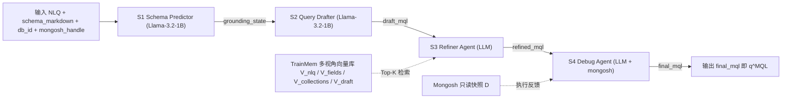
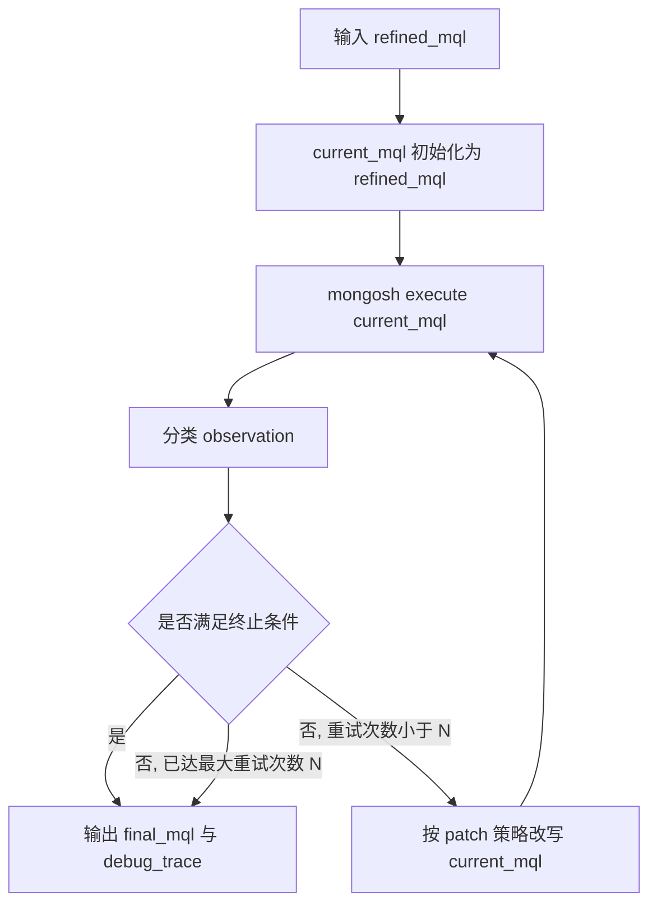

# 06 · SMART 求解方法层设计 SSoT

<a id="06-0"></a>
## §0 摘要

SMART 是一个面向 Text-to-NoSQL 的 4 阶段推理流水线：

1. **SLM-based Schema Prediction**（[§2](#06-2)）—— 微调 Llama-3.2-1B，对每条 NLQ 预测 4 路 schema 标签：collection / db_fields / alias_fields / target_fields
2. **SLM-based Query Generation**（[§3](#06-3)）—— 微调 Llama-3.2-1B，把 NLQ + 上一阶段预测出的结构化 schema 喂给生成器，输出草稿 MQL（draft_mql）
3. **Memory-driven Refinement**（[§4](#06-4)）—— LLM Agent 用多视角向量库（V_nlq / V_fields / V_collections / V_draft）对训练侧记忆做加权 cosine 检索，召回 Top-K 示例，重写草稿 → refined_mql
4. **Execution-grounded Optimization**（[§5](#06-5)）—— Debug Agent 把当前 MQL 提交本地 mongosh 执行，根据执行反馈迭代修正 → final_mql

整条流水线在 [01 §1](./01_task_definition.md#01-1) 定义的任务签名下闭合：输入 (NLQ, schema, db_id)，输出 q^MQL，由 [05 §1](./05_evaluation_methodology.md#05-1) 的 7 指标体系（EM / QSM / QFC / EX / EFM / EVM / QIM）统一判定，其中 EX 作为 headline 指标衡量端到端解对率，QIM 作为诊断代理度量最终 MQL 的 idiomatic 程度。论文报告 SMART（deepseek-v3 作为 Refiner / Debugger 的对话主干）在 TEND 测试集上 EX = 65.08%；在 TEND 的 NoSQL-exclusive 数据分布下，SMART 相对 NL2SQL-bridge baseline 的相对优势期望在 L2+ 样本切片上显著放大（见 [§9](#06-9)）。

对 NoSQL-native 意图（nosql_nativeness L2-L4，其 5 级语义见 [04 §3.1](./04_dataset_construction.md#04-3)）的设计预期：Stage 1 Schema Predictor 在 4 路标签中保留 shape-preserving / polymorphic / dynamic-key 等语义信号（见 [§2.2](#06-2)）；Stage 3 Refiner 的检索记忆在训练侧预存 shape_preserving_augment / polymorphic_branch / dynamic_key_expansion / nested_in_place_aggregate 等 pattern 的示例；Stage 4 Debug Agent 对"shape 退化"做显式 patch 修正（见 [§5.2](#06-5)）；这使 SMART 在 L2-L4 样本上同时具备 EX 与 QIM 的竞争力。

TEND 数据底盘锁定为 17,020 records，14,245 train / 2,775 test；SMART 训练侧只取 train.json 的 14,245 条，test.json 的 2,775 条仅在 [05](./05_evaluation_methodology.md) 评测期消费。库级合成由 [03](./03_database_synthesis.md) 定义；本文档求解侧零加载其产物中的 audit 资产。

本文档共 11 节：总体架构（[§1](#06-1)）、4 个阶段（[§2](#06-2) / [§3](#06-3) / [§4](#06-4) / [§5](#06-5)）、训练与推理接口（[§6](#06-6)）、方法侧硬边界（[§7](#06-7)）、部署与监控（[§8](#06-8)）、与 baseline 的比较假设（[§9](#06-9)）、canonical 示例的 4 阶段 trace（[§10](#06-10)）。

<a id="06-1"></a>
## §1 总体架构

### §1.1 推理流程的形式化签名

按 [01 §1](./01_task_definition.md#01-1)，TEND 任务是函数 $f:(\mathrm{NLQ}, S, \mathit{db\_id}) \to q^{\mathrm{MQL}}$。SMART 给出该函数的具体实现 $f_{\text{SMART}}$，由 4 个内部子算子复合：

$$f_{\text{SMART}} \triangleq \mathrm{Optimize} \circ \mathrm{Refine} \circ \mathrm{Generate} \circ \mathrm{Predict}$$

子算子表：

| 子算子 | 输入 | 输出 | 角色 |
|---|---|---|---|
| Predict | (NLQ, schema_markdown, db_id) | grounding_state（4 路标签字典） | 把 NLQ 映射到 4 路结构化 schema 元素 |
| Generate | (NLQ, schema_markdown, db_id, grounding_state) | draft_mql（字符串） | 在 grounding 之上生成草稿 MQL |
| Refine | (NLQ, schema_markdown, grounding_state, draft_mql) | refined_mql（字符串） | 用训练侧多视角检索召回 Top-K 示例改写草稿 |
| Optimize | (refined_mql, mongosh_handle) | (final_mql, debug_trace) | 用 mongosh 执行反馈迭代修正 |

grounding_state 是 4 路标签字典，作为 Stage 2 / Stage 3 / Stage 4 的共同 grounding 信号。

### §1.2 4 阶段流水线全景图



TrainMem 只在 S3 检索时被读取，且只装载 [02](./02_dataset_design.md) 定义的 train.json 派生的多视角嵌入；Mongosh 只在 S4 执行时被调用，且遵守 [05 §3](./05_evaluation_methodology.md#05-3) 复现性 manifest 契约。

### §1.3 阶段产物的内部状态

| 状态 | 产生阶段 | 类型 | 是否对外暴露 |
|---|---|---|---|
| grounding_state | S1 | 4 路标签字典（collection / db_fields / alias_fields / target_fields） | 仅在 SmartResponse.intermediate_traces 中可观测 |
| draft_mql | S2 | 字符串 | 仅在 SmartResponse.intermediate_traces 中可观测 |
| refined_mql | S3 | 字符串 | 仅在 SmartResponse.intermediate_traces 中可观测 |
| final_mql | S4 | 字符串，对应任务签名 q^MQL 的实例化，进入 [05 §1](./05_evaluation_methodology.md#05-1) 7 指标计算 | 对外暴露 |
| debug_trace | S4 | patch 动作列表 | 仅可观测 |

<a id="06-2"></a>
## §2 Stage 1 · SLM-based Schema Prediction

### §2.1 任务定义

给定 (NLQ, schema_markdown, db_id)，预测 NLQ 在该数据库上对应 MQL 所会用到的结构化 schema 元素。Stage 1 的输出 grounding_state 是一个 4 字段字典，作为后续 3 阶段的共同 grounding。

### §2.2 4 个子任务与 shape-preserving 语义对齐

基础 4 子任务：

| 子任务 | 含义 |
|---|---|
| collection | NLQ 对应 MQL 主入口涉及的 collection 名集合，含会被 $lookup 引入的从表 |
| db_fields | 涉及的 schema 字段路径集合，如 Name / orchestra.performance.Show_ID |
| alias_fields | 在 $project / $group 中需要起别名的字段，如 performance_count |
| target_fields | 最终输出文档保留的字段集合 |

**shape-preserving 意图下的语义对齐**

当 NLQ 意图属于 shape-preserving（其 gold MQL 的 output.shape ∈ `{shape_preserved_augmented, nested_with_projected_subtree, polymorphic_output}`，见 [04 §3.1](./04_dataset_construction.md#04-3)）时，4 路标签按如下方式对齐：

- `collection` 语义不变（入口集合；$lookup 引入的从表一并登记）
- `db_fields` 含参与计算的字段路径（例如 shape_preserving_augment 下的 `orchestra.performance`，作为 `$map` 遍历对象；而非 `$unwind` 目标）
- `alias_fields` 含根层追加的计算字段名（例如 `total_performances`）
- **`target_fields` 在此类意图下的语义**：不再仅指"输出文档保留的字段子集"，而是指"输出文档最终应包含的字段集合" = `set(collection 所有原始字段) ∪ alias_fields`——该语义隐含"原文档所有字段都保留、只在根层追加 alias_fields"的 shape-preserving 约束
- 训练期对 shape_preserving 样本按该语义生成 target_fields 监督信号；推理期 Stage 4 Debug Agent 用该语义做 shape 对齐检查（见 [§5.2](#06-5) "shape 退化"反馈类别）

当意图属于 flat output.shape 类（即非 shape-preserving）时，target_fields 仍按基础语义工作，即输出文档保留的字段集合。

### §2.3 模型与训练

- 基座：Llama-3.2-1B
- 微调形态：4 头独立 LoRA / full-fine-tune（论文采用）或 1 个共享主干 + 4 prompt 模板
- 训练样本：[02](./02_dataset_design.md) 定义的 TEND/train.json 的 14,245 条 record；每条 record 提供 5 条 NLQ + 1 条 gold MQL + db_id；4 路标签从 gold MQL 中按解析规则抽取（$lookup / from 字段抽 collection、字段引用路径抽 db_fields、$project / $group 别名抽 alias_fields、最终输出字段集合抽 target_fields，对 shape-preserving 样本按 §2.2 扩展语义抽）
- 数据增广：record 自带 5 条 NLQ 覆盖 5 个 specificity 层级（详见 [§6.1](#06-6) 与 [02 §2.2](./02_dataset_design.md#02-2)），逐条作为独立训练样本（gold MQL 与 4 路标签共享）
- 训练 / 推理边界：训练记忆只用 train.json；test.json 不进入任何 SLM 训练或检索语料；任何 [02 §2.2](./02_dataset_design.md#02-2) audit 字段都不进入 SLM 输入或监督信号（详见 [§7](#06-7)）

### §2.4 输出格式

grounding_state 以 JSON 形式向下游传递，4 个字段示例（flat output.shape）：

```json
{
  "collection": ["conductor"],
  "db_fields": ["Conductor_ID", "Name", "orchestra.performance"],
  "alias_fields": ["performance_count"],
  "target_fields": ["Name", "performance_count"]
}
```

shape-preserving output.shape 示例（canonical record `orchestra/99001`，pattern = `shape_preserving_augment`）：

```json
{
  "collection": ["conductor"],
  "db_fields": ["orchestra.performance"],
  "alias_fields": ["total_performances"],
  "target_fields": ["Conductor_ID", "Name", "Age", "Nationality", "orchestra", "total_performances"]
}
```

此 target_fields = `set(conductor 原 4 字段) ∪ {total_performances}` = 5 个字段；`orchestra` 字段整体保留即隐含 4 层嵌套结构（conductor → orchestra[] → orchestra.performance[] → orchestra.performance.show[]）不被压平。Stage 4 Debug Agent 以此 target_fields 集合做 shape 对齐检查。

<a id="06-3"></a>
## §3 Stage 2 · SLM-based Query Generation

### §3.1 任务定义

给定 (NLQ, schema_markdown, db_id, grounding_state)，生成草稿 MQL（draft_mql）。Stage 2 不要求 draft_mql 一次执行通过，只要求结构上覆盖 grounding_state 给出的 collection / db_fields / target_fields 信号即可，剩余结构错误交由 Stage 3 / Stage 4 兜底。

特别地，对 shape-preserving 意图，Stage 2 草稿期可能错写为 `$unwind + $group + $first` / `$unwind + $group + $push` 形态（SQL-flatten 先验偶发），这是 Stage 3 Refiner 检索改写与 Stage 4 Debug Agent shape 退化 patch 的共同设计前提。

### §3.2 输入构造

输入 = 当前样本 NLQ + db_id 对应的 schema markdown + Stage 1 输出的 4 路 grounding 标签。3 部分按固定模板拼接：先 schema markdown（提供 collection 列表与字段类型）、再 4 路 grounding 标签（圈定本条 NLQ 的目标 schema 元素）、最后 NLQ 本体（提供自然语言意图）。

### §3.3 模型与训练

- 基座：Llama-3.2-1B（与 Stage 1 同基座，参数独立）
- 训练样本来自 train.json；输入 = NLQ + schema markdown + 4 路标签（gold 或 Stage 1 预测，论文采用混合策略以缓解推理期的 grounding 噪声）；输出 = gold MQL 字符串
- 数据增广同 Stage 1：5 条 specificity-level NLQ 共用 1 条 gold MQL，逐条作为独立训练样本

### §3.4 输出格式

draft_mql 以纯字符串向下游传递；不要求一次执行通过，也不要求语法上完全合法。Stage 3 / Stage 4 会在此基础上做结构改写与执行修正。

<a id="06-4"></a>
## §4 Stage 3 · Memory-driven Refinement

### §4.1 多视角向量库

把 [02](./02_dataset_design.md) 的 train.json 每条 record 离线编码成 4 个视角的稠密向量，存入训练侧记忆库 $\mathcal{M}_{\text{train}}$：

| 视角 | 编码对象 |
|---|---|
| $V_{\text{nlq}}$ | NLQ 字符串（5 条 specificity 层级各登记一份候选嵌入，详见 [§6.1](#06-6)） |
| $V_{\text{fields}}$ | db_fields ∪ alias_fields ∪ target_fields 的字典序拼接字符串 |
| $V_{\text{collections}}$ | collection 字典序拼接字符串 |
| $V_{\text{draft}}$ | gold MQL 字符串本体（offline 时取 gold；online 时被 query 侧 draft_mql 嵌入对齐） |

每条训练样本最终在 $\mathcal{M}_{\text{train}}$ 中表示为：

$$e = (V^e_{\text{nlq}}, V^e_{\text{fields}}, V^e_{\text{collections}}, V^e_{\text{draft}}, \mathrm{NLQ}^e, \mathrm{schema}^e, \mathrm{gold\_mql}^e)$$

### §4.2 加权 cosine 检索

把推理侧的 (NLQ, grounding_state, draft_mql) 编码成同 4 视角的查询向量 $V^q_v$，在 $\mathcal{M}_{\text{train}}$ 上做加权 cosine 打分：

$$\operatorname{score}(q, e) = \sum_{v \in \{\text{nlq}, \text{fields}, \text{collections}, \text{draft}\}} w_v \cdot \cos(V^q_v, V^e_v)$$

权重结构：意图视角 ≥ schema 视角 > 表面结构视角，且没有视角的权重为零，即

$$w_{\text{nlq}} \ge w_{\text{fields}} \ge w_{\text{collections}},\quad w_{\text{draft}} > 0,\quad \sum_v w_v = 1$$

NLQ 视角的多 specificity 候选嵌入处理：当某条训练 record 在 $V_{\text{nlq}}$ 上登记 5 个候选嵌入时，打分时取该 record 在 5 个 specificity 表面上的最大 cosine：

$$\max_i \cos(V^q_{\text{nlq}}, V^{e,i}_{\text{nlq}})$$

作为该 record 在 NLQ 视角的最终相似度分量。

### §4.3 Top-K 检索与上下文打包

按 score 降序取 Top-K 训练 record；K ∈ [5, 20]；论文默认 K = 20。每条示例打包为 (NLQ, db_id, 4 路 schema 标签, gold MQL) 四字段元组，按 score 降序拼成 prompt。

### §4.4 Refiner Agent

LLM 对话 Agent（论文使用 deepseek-v3 / gpt-4o-mini）；system prompt 把它定位为"MongoDB 查询调整组件"；task prompt 装入 (NLQ, schema_markdown, grounding_state, draft_mql) + Top-K 示例 + 一组 generic 改写指令；输出 javascript 代码块即 refined_mql。

**输出空间约束**：refined_mql 必须遵守 [01 §2](./01_task_definition.md#01-2) 的输出空间约束（read-only / deterministic / mongosh-executable，禁用六件算子 `$out / $merge / $function / $sample / $rand / $$NOW`）；对 shape_preserving 意图还需满足 gold MQL 的 canonical_form_set 暗示的 idiomatic 结构（Stage 4 会 verify）——该 canonical_form_set 由 [04 §5.7](./04_dataset_construction.md#04-5) 从 SI 自动派生并归属 audit/derived（求解侧零加载），Refiner 通过训练侧记忆中"同构 pattern 邻居"间接习得，而非读取该 audit 资产。违反输出空间约束或根层结构退化则进入 Stage 4 时由 Debug Agent 回退到 draft_mql 重做。

<a id="06-5"></a>
## §5 Stage 4 · Execution-grounded Optimization

### §5.1 Debug Agent 协议



### §5.2 执行反馈分类与 patch 策略

| 反馈类别 | 触发条件 | patch 策略 |
|---|---|---|
| 解析错误 | mongosh 报 SyntaxError / Unexpected token | 按错误位置最近的代码块重写；若 3 次仍解析失败回退到 draft_mql |
| 字段绑定错误 | mongosh 报 field undefined / path resolution failed | 与 grounding_state.db_fields 比对，按 schema_markdown 正确字段路径替换 |
| 算子误用 | $unwind 作用在非数组、$group 缺 _id、$size 作用在嵌套数组等 | 按算子签名重写：补 _id、把 $size 拆为 $unwind + $group 计数模式（仅用于 flat 意图） |
| 空结果但 NLQ 应非空 | 返回 [] 且 NLQ 含 top-K / count 等显式存在性信号 | 检查是否漏 $unwind 嵌套层、是否过滤条件过严，逐步放宽 |
| 缺阶段 | 输出文档字段集与 target_fields 不对齐（flat 意图） | 在 pipeline 末尾追加 $project 把字段补齐 |
| 超时 | mongosh 执行超过 [05 §3](./05_evaluation_methodology.md#05-3) 复现性 manifest 设定的超时上限 | 添加 $limit 早截、把 $unwind 顺序前移以减少中间结果膨胀 |
| **shape 退化** | mongosh 返回的文档数不等于预期输入文档数、或输出文档缺少 target_fields 声明的原嵌套子树、或 pipeline 根层含 `$unwind` 或 `$group` 而 grounding_state 对应意图属 shape-preserving | 改写策略：把 `$unwind + $group + $first/$push` 根层模式替换为 `$addFields + $map / $reduce`；若 pipeline 根层已有 `$addFields`，检查其子表达式是否对嵌套数组做了 in-place 计算；必要时按 noise_policies 对应层插入 `$ifNull` 兜底（避免 null vs missing 歧义） |
| 正常返回 | 无 error、结果非空（或合理为空）、字段对齐 target_fields、shape 对齐（shape-preserving 意图下根层无 `$unwind` / `$group`） | 终止，进入 §5.3 |

### §5.3 终止条件与产物

满足以下任一条件即终止：

- mongosh 返回正常非空结果且字段集合与 Stage 1 target_fields 对齐
- mongosh 返回正常空结果而 NLQ 在该 (NLQ, schema) 上确实可能为空
- 输出文档集合与 grounding_state.target_fields 对齐，且根层未引入 `$unwind` / `$group`（当意图属 shape-preserving 时必须满足该条件）
- 达到最大重试次数 N（建议 N = 5）

执行环境必须与 [05 §3](./05_evaluation_methodology.md#05-3) 复现性 manifest 一致（同一 mongosh 镜像、同一 collation、同一 timezone UTC、同一执行超时上限）。

Debug Agent 只在测试期使用 db_id 对应的数据快照 D 作为 grounding 信号；它不修改 D、不写新 collection；[01 §2](./01_task_definition.md#01-2) 禁用的六件算子 `$out / $merge / $function / $sample / $rand / $$NOW` 也不得出现在中间 patch 里。

终止后 final_mql 与 debug_trace 一并写回 SmartResponse；final_mql 进入下游评测。

<a id="06-6"></a>
## §6 训练与推理接口

### §6.1 训练接口

| 阶段 | 训练样本来源 | 输入字段 | 监督信号 |
|---|---|---|---|
| Stage 1 Predictor | train.json，5 NLQ × 1 record 展开 | NLQ + schema_markdown + db_id | 4 路标签（从 gold MQL 解析；shape-preserving 样本按 [§2.2](#06-2) 扩展语义抽取 target_fields） |
| Stage 2 Drafter | train.json，5 NLQ × 1 record 展开 | NLQ + schema_markdown + db_id + 4 路标签 | gold MQL 字符串 |
| Stage 3 Refiner | train.json，离线编码 4 视角 | record 主体 4 字段（NLQ / db_fields ∪ alias_fields ∪ target_fields / collection / gold_mql） | 在线检索打分（无离线监督训练） |
| Stage 4 Debugger | 不需离线训练 | mongosh 执行反馈 | 由 LLM 主干现学现用 |

5 NLQ specificity 层级的处理：

- nl_queries[0] 永远是 L1 schema_naive（canonical 槽位）
- 其余 4 槽位覆盖 L0 underspecified（隐含默认 K、排序方向、依据 metric）/ L2 schema_aware / L3 nosql_jargon / L4 multilingual / colloquial
- SMART 训练侧把 5 条 NLQ 当作 5 个独立训练样本，共享同一条 gold MQL 与同一份 4 路 grounding 标签
- Stage 1：5 条 NLQ × 1 个 4 路标签集合 → 5 个独立 (NLQ, schema, label) 训练对；L0 underspecified 是关键训练信号——NLQ 不显式给出 K / 排序方向 / ranking metric / shape 约束，Stage 1 必须显式补出默认值；其余层级 L1-L4 在显式信号上递增，让 Predictor 学到"按 NLQ 显式信号覆盖默认值"
- Stage 2：5 条 NLQ × 1 个 gold MQL → 5 个独立训练对；同一 gold MQL 在 5 个 specificity 表面下被反复监督
- Stage 3 向量库：每条训练 record 在 NLQ 视角 $V_{\text{nlq}}$ 上登记 5 个候选嵌入；在线检索打分时按 [§4.2](#06-4) 末尾的 max 规则
- 注意：nlq_specificity_levels 字段本身只在训练管线内部用于 5 条 NLQ 的层级标注，不进入 Stage 1 / Stage 2 的 prompt，也不进入 Stage 3 的向量库（它是 audit 字段，按 [§7](#06-7) 屏蔽）

**NoSQL-native 先验的训练信号分布**：对属于 nosql_nativeness level L2+ 的样本，Stage 2 Drafter 训练时 gold MQL 监督信号天然覆盖 shape-preserving / polymorphic / dynamic-key / graph-recursive / nested-in-place-aggregate 等 NoSQL-native 结构；由于这些结构在训练集中的占比（L2+ ≥ 40%、L4 ≥ 15%，配额详见 [04 §3.1](./04_dataset_construction.md#04-3)）不再是长尾，SLM 基座学到的先验是 NoSQL-idiomatic 的，而非 SQL-flatten 的；这从根源减少 Stage 2 草稿落入 `$unwind + $group` 退化形态的频率，并为 Stage 3 Refiner 的检索记忆提供充分的 shape-preserving / polymorphic / dynamic-key 样例基础。

### §6.2 推理接口

SmartRequest 与 SmartResponse 两个 dataclass-like 结构：

```python
class SmartRequest:
    nlq: str
    schema_markdown: str
    db_id: str
    mongosh_handle: MongoshHandle

class SmartResponse:
    final_mql: str
    intermediate_traces: dict
```

接口契约：

- intermediate_traces 含 grounding_state / draft_mql / refined_mql / debug_trace，仅供监控与离线复盘，不参与 [05 §1](./05_evaluation_methodology.md#05-1) 指标计算
- mongosh_handle 必须连接到 [01 §1](./01_task_definition.md#01-1) 定义的、由 db_id 唯一绑定的只读快照 D
- final_mql 是任务签名 q^MQL 的实例化，作为 [05](./05_evaluation_methodology.md) 评测器的唯一输入

<a id="06-7"></a>
## §7 方法侧硬边界（contract-safe）

SMART 在训练与推理期对以下对象执行严格屏蔽：它们不进入任何模型输入、不进入任何检索向量、不进入任何 prompt 上下文，也不参与任何阶段的监督信号计算。

### §7.1 屏蔽对象清单

**评测语料**

| 对象 | 来源 | 屏蔽原因 |
|---|---|---|
| test.json 的 record（2,775 条） | [02](./02_dataset_design.md) | 评测语料，进入即数据泄漏 |

**库级 audit 资产路径**（[03](./03_database_synthesis.md) 合成期与 [04](./04_dataset_construction.md) 构造期产出，发布层不进入 record 主体；求解侧不读取）

| 对象 | 来源 | 屏蔽原因 |
|---|---|---|
| audit/taxonomy_board/board_snapshot_*.json | [03 §8](./03_database_synthesis.md#03-8) Taxonomy Board | 暴露合成期多样性 cell 分布与调度先验，等价 Stage 1 / Stage 3 部分答案 |
| audit/taxonomy_board/budget_matrix.json | [03 §8](./03_database_synthesis.md#03-8) Stratified Budget Matrix | 暴露复杂度-多样性-噪声联合预算，等价难度与噪声先验泄漏 |
| audit/coverage/coverage_report.json | [04 §10](./04_dataset_construction.md#04-10) 嵌入覆盖审计报告 | 暴露嵌入空间多样性结构与 under-coverage 区域 |
| audit/reference_panel/diff_panel_manifest.json | [04 §9](./04_dataset_construction.md#04-9) RP_diff 经验难度参考面板 | 暴露经验难度校准的具体模型清单与版本，引入分布漂移与对抗过拟合风险（同时见 [§7.3](#06-7) disjointness 硬约束） |
| audit/reference_panel/sql_bridge_manifest.json | [04 §8.6](./04_dataset_construction.md#04-8) V7' SQL-bridge defeat panel | 暴露 V7' 对抗 panel 的 NL2SQL 模型与 sqltomongo translator，使求解侧能针对性规避 V7' 的对抗先验（同时见 [§7.3](#06-7) disjointness 硬约束） |
| audit/human_anchor/spot_audit.json | [04 §8](./04_dataset_construction.md#04-8) 5% 人审 anchor | 暴露 anchor 样本失败 pattern，引入选择性偏置 |

**Record 级 audit 资产路径**

| 对象 | 来源 | 屏蔽原因 |
|---|---|---|
| audit/<db_id>/<record_id>/noise_trace.json | [03 §5](./03_database_synthesis.md#03-5) Noise Control Line | 暴露本条 record 的噪声 6 层组合、coupling operators 与 si policy keys，等价向求解侧泄漏"应对噪声的解题路径" |
| audit/<db_id>/<record_id>/complexity_vector.json | [03 §3](./03_database_synthesis.md#03-3) Complexity Control Line | 暴露 6 维复杂度向量 $\vec{C}$，引入难度先验 leakage |
| audit/<db_id>/<record_id>/business_narrative.json | [03 §6](./03_database_synthesis.md#03-6) Business Simulator | 暴露业务叙事与事件流，是 Stage 2 Query Generation 的隐式答案模板 |
| audit/<db_id>/<record_id>/structured_intent.yaml | [04 §3](./04_dataset_construction.md#04-3) Structured Intent | canonical SI 即解题 oracle，等价答案泄漏 |
| audit/<db_id>/<record_id>/derived/oracle.py | [04 §5](./04_dataset_construction.md#04-5) SI 自动派生 oracle | 独立 ground-truth oracle，等价于答案泄漏 |
| audit/<db_id>/<record_id>/derived/checker.py | 同上 | 可执行 spec checker，等价于直接给 grader |
| audit/<db_id>/<record_id>/derived/mutations.json | 同上 | 暴露 near-miss 家族结构，引导模型规避机械变异 |
| audit/<db_id>/<record_id>/derived/canonical_form_set.json | [04 §5.7](./04_dataset_construction.md#04-5) 派生 | 暴露 QIM 的 AST 约束（must_contain / must_not_contain / must_contain_at_root / must_not_contain_at_root），等价于直接把评测层 QIM 的判据喂给 Stage 3 Refiner；SMART 生成 final_mql 时只凭 NLQ + schema + 训练记忆，不读该资产 |
| audit/<db_id>/<record_id>/world_variants/<world_id>.json | [04 §4](./04_dataset_construction.md#04-4) 多世界物化 | 构造期 K-1 个备选世界 |
| audit/<db_id>/<record_id>/world_robustness.json | [04 §4](./04_dataset_construction.md#04-4) | 暴露 K 个世界上的 gold 行为与 robustness 证据链 |
| audit/<db_id>/<record_id>/certificate.json | [04 §8](./04_dataset_construction.md#04-8) V1'-V7' 证书 | 暴露 spec / world / NLQ / SQL-bridge 验证轨迹 |
| audit/<db_id>/<record_id>/empirical_difficulty.json | [04 §9](./04_dataset_construction.md#04-9) RP_diff 实测 | 暴露 RP_diff per-record EX 结果，可被反推为难度先验 |
| audit/<db_id>/<record_id>/sql_bridge_defeat.json | [04 §8.6](./04_dataset_construction.md#04-8) | 暴露本条 record 的 V7' SQL-bridge 对抗候选 MQL 与 EX/QIM 判定，引入方法侧规避 SQL-bridge 类错误的捷径 |

**Record 主体 audit ref 字段**（即便 record 携带 ref，求解侧也不解引用、不读取目标内容）

| 字段 | 来源 | 屏蔽原因 |
|---|---|---|
| structured_intent_ref | [02 §2.2](./02_dataset_design.md#02-2) | 指向 SI / oracle / checker / mutations，等价答案泄漏 |
| re_certificate_ref | [02 §2.2](./02_dataset_design.md#02-2) | 指向 V1'-V7' 证书 |
| world_robustness_certificate_ref | [02 §2.2](./02_dataset_design.md#02-2) | 指向多世界鲁棒性证书 |
| empirical_difficulty_ref | [02 §2.2](./02_dataset_design.md#02-2) | 指向 RP_diff per-record 结果 |
| noise_trace_ref | [02 §2.2](./02_dataset_design.md#02-2) | 指向 noise_trace.json，暴露噪声 6 层组合与 coupling operators 即泄漏应对噪声的解题路径 |
| complexity_vector_ref | [02 §2.2](./02_dataset_design.md#02-2) | 指向 complexity_vector.json，暴露 6 维复杂度向量即引入难度先验 leakage |
| business_narrative_ref | [02 §2.2](./02_dataset_design.md#02-2) | 指向 business_narrative.json，业务叙事与事件流是 Stage 2 的隐式答案模板 |
| canonical_form_set_ref | [02 §2.2](./02_dataset_design.md#02-2) | 指向 canonical_form_set.json，暴露 QIM 的 AST 判据（等价把评测层 QIM 的判据直接喂给 Stage 3 Refiner） |
| sql_bridge_defeat_ref | [02 §2.2](./02_dataset_design.md#02-2) | 指向 sql_bridge_defeat.json，暴露 V7' SQL-bridge 对抗候选与 EX/QIM 判定 |

**Record 主体 audit 描述性字段**（不构成解题信号，进入即引入分布或难度先验 leakage）

| 字段 | 来源 | 屏蔽原因 |
|---|---|---|
| target_difficulty | [02 §2.2](./02_dataset_design.md#02-2) | 难度标签先验 leakage |
| empirical_difficulty | [02 §2.2](./02_dataset_design.md#02-2) | 实测难度先验 leakage |
| pass_rate | [02 §2.2](./02_dataset_design.md#02-2) | RP_diff 上 EX 通过率，难度先验 leakage |
| tds_cell | [02 §2.2](./02_dataset_design.md#02-2) | 暴露事后描述符的分布坐标 |
| operator_family | [02 §2.2](./02_dataset_design.md#02-2) | 主算子族，等价 Stage 1 / Stage 2 部分答案 |
| idiomatic_score | [02 §2.2](./02_dataset_design.md#02-2) | gold MQL 风格度量，与 gold 强相关 |
| nlq_specificity_levels | [02 §2.2](./02_dataset_design.md#02-2) | 5 NLQ 的 specificity 层级标签；其语义在 [§6.1](#06-6) 训练管线内部使用，但作为字段值不进入 prompt 或检索向量 |
| nosql_nativeness_level | [02 §2.2](./02_dataset_design.md#02-2) | 意图的 L0-L4 档位标签；暴露即引入难度先验 leakage，SMART 不消费该字段 |
| schema_complexity_profile | [02 §2.2](./02_dataset_design.md#02-2) | schema 难度 leakage |
| world_signature | [02 §2.2](./02_dataset_design.md#02-2) | 数据快照指纹，仅用于 reproducibility 而非解题 |
| coverage_neighbors | [02 §2.2](./02_dataset_design.md#02-2) | 嵌入空间邻居 record_id，等价于检索"答案邻居"的快捷路径 |

### §7.2 训练记忆的最小输入集

训练侧记忆 $\mathcal{M}_{\text{train}}$ 只装载从 [02 §2.2](./02_dataset_design.md#02-2) train.json 中抽出的最小输入集：

$$\mathcal{M}_{\text{train}} = \bigl\{(\mathrm{NLQ},\ \mathit{db\_id},\ \text{schema\_markdown},\ \text{gold\_mql})\bigr\}$$

加上从 gold_mql 解析得到的 4 路 grounding 标签（collection / db_fields / alias_fields / target_fields）。**没有任何 audit 字段、audit 资产路径或 ref 解引用结果（含 canonical_form_set_ref / sql_bridge_defeat_ref / noise_trace_ref / complexity_vector_ref / business_narrative_ref / structured_intent_ref / re_certificate_ref / world_robustness_certificate_ref / empirical_difficulty_ref，以及 nosql_nativeness_level 等所有描述性字段）参与嵌入计算或被检索器返回。**

[05 §3](./05_evaluation_methodology.md#05-3) 复现性 manifest 中只对 mongosh 镜像与执行环境做约束，不强制 SMART 加载任何 audit 资产；本节明确"零加载"是设计契约。

### §7.3 RP_diff + SQL-bridge panel 三方解耦硬约束

SMART 部署时必须满足下列硬约束（三方 pairwise 不相交）：

1. **Stage 3 Refiner LLM 主干 ID** 必须与 `audit/reference_panel/diff_panel_manifest.json` 中 `models[].id` 集合**完全不相交**
2. **Stage 4 Debug Agent LLM 主干 ID** 必须与 `diff_panel_manifest.json` 中 `models[].id` 集合**完全不相交**
3. **Stage 3 Refiner LLM 主干 ID** 必须与 `audit/reference_panel/sql_bridge_manifest.json` 中 `nl2sql_models[].id` 集合**完全不相交**
4. **Stage 4 Debug Agent LLM 主干 ID** 必须与 `sql_bridge_manifest.json` 中 `nl2sql_models[].id` 集合**完全不相交**
5. **任意 SMART LLM 主干 ID** 必须与 [04 §8.3](./04_dataset_construction.md#04-8) V3' / V5' LLM id 集合**完全不相交**（已有隐含约束显式化）

**部署启动期检查**：SmartRequest handler 在初始化时分别读取 `diff_panel_manifest.json`（仅 `models[].id` 字段）与 `sql_bridge_manifest.json`（仅 `nl2sql_models[].id` 字段）；与本地配置的 Refiner / Debugger 模型 ID 比对；任一相交则拒绝启动并写入错误日志。两份 manifest 仅在启动期被 handler 读取其 id 白名单字段，不进入 prompt、检索向量或其它推理路径。

**评测期检查**：[05 §3](./05_evaluation_methodology.md#05-3) 的 manifest 摘要不一致中止规则覆盖 `diff_panel_manifest_sha256` 与 `sql_bridge_manifest_sha256`；评测器在启动时读取两者（在 runtime_lock 中）并验证与 SMART 配置的 LLM ID 在两个 panel 上同时不相交；任一相交则评测流程中止。

**设计动机**：RP_diff 用于 empirical_difficulty 校准；SQL-bridge panel 用于 V7' 对抗。如果 SMART 的 Refiner / Debugger LLM 主干与任一 panel 相交：

- 与 RP_diff 相交：同一模型在 RP_diff 测得的 pass_rate 会人为偏高（因为该模型在 SMART 中享受了 4 阶段流水线增益），导致 empirical_difficulty 分桶失真，进而污染 [02 §2.2](./02_dataset_design.md#02-2) 的 empirical_difficulty / pass_rate 字段
- 与 SQL-bridge panel 相交：V7' 对抗失效（SQL-bridge 生成的候选就是 SMART 将来产生的输出，自我对抗退化为自我验证），导致 [04 §8.6](./04_dataset_construction.md#04-8) 的 sql_bridge_defeat 检出率被系统低估

三方 disjointness 消除这两条循环路径。

### §7.4 与 [03](./03_database_synthesis.md) / [04](./04_dataset_construction.md) 的契约对偶

| 责任方 | 保证 |
|---|---|
| [03](./03_database_synthesis.md) Agentic 合成侧 | 保证 Taxonomy Board 快照、Budget Matrix、noise_trace / complexity_vector / business_narrative 全部生成于合成期、归属 audit 区；不与 record 主体字段共通道；不与求解侧 LLM 主干相交 |
| [04](./04_dataset_construction.md) 构造流水线侧 | 保证 SI DSL 的 `noise_policies` 字段与 [03](./03_database_synthesis.md) 的 NoisePlan 字面对齐；V1'-V7' 证书、empirical_difficulty.json 仅作 gold 可信度与难度参考留痕 |
| [04](./04_dataset_construction.md) V7' SQL-bridge defeat（[§8.6](./04_dataset_construction.md#04-8)） | 保证 SQL-bridge panel manifest（`audit/reference_panel/sql_bridge_manifest.json`）归属 audit 区；panel 的 NL2SQL models 与 sqltomongo translator 不与 V3' / V5' / RP_diff / 求解侧 LLM 相交；V7' 的 candidate MQL、sql_bridge_defeat 结果归 audit；canonical_form_set 归 audit/derived；SMART 零加载这三类资产 |
| [06](#06-7) 求解侧 | 即便 audit 资产与发布层 record 在文件系统中并行存放、即便 record 主体本身列出 ref 字段（含 canonical_form_set_ref / sql_bridge_defeat_ref 等），SMART 流水线不解引用任何 ref、不读取上述任何 audit 资产路径；不与 RP_diff / SQL-bridge panel / V3' / V5' 模型 ID 相交；Agentic 合成阶段的所有中间态（Agent 轨迹、Taxonomy Board 快照、Noise Plan、业务叙事）全部隶属构造时，不得进入方法侧推理路径 |

这一对偶约束保证：构造侧信息不会通过任何隐式管道（文件路径同目录、ref 字段、co-located audit 子树、共享 LLM）流入求解侧，从而 [05 §1](./05_evaluation_methodology.md#05-1) 的 7 指标在 cross-domain 测试集上的报告值忠实反映 SMART 在"无 audit 先验"条件下的真实表现；[04 §8](./04_dataset_construction.md#04-8) V1'-V7' 与 [04 §9](./04_dataset_construction.md#04-9) RP_diff 仅作为 gold 可信度、难度参考、SQL-bridge 对抗的来源，而非求解信号。agentic_synth 合成期中间态（Agent 轨迹、Taxonomy Board 快照、Noise Plan、业务叙事）均遵守同一契约，不通过任何隐式管道进入求解侧。

<a id="06-8"></a>
## §8 部署与监控

### §8.1 服务分层

| 服务 | 阶段 | 资源画像 | 对接的 manifest |
|---|---|---|---|
| Schema Predictor | Stage 1 | Llama-3.2-1B 微调权重；GPU 推理；批处理友好 | — |
| Query Drafter | Stage 2 | Llama-3.2-1B 微调权重（与 Stage 1 参数独立）；GPU 推理；批处理友好 | — |
| Refiner with Vector Memory | Stage 3 | LLM API（deepseek-v3 / gpt-4o-mini）+ 4 路向量索引（FAISS 或等价）；CPU + 远端 LLM；按 K = 20 拼 prompt | `diff_panel_manifest.json`, `sql_bridge_manifest.json`（仅 read disjointness 检查，见 [§7.3](#06-7)） |
| Executor + Debugger | Stage 4 | LLM API + 本地 mongosh 进程池；mongosh 镜像与 [05 §3](./05_evaluation_methodology.md#05-3) 复现性 manifest 一致；最多 N = 5 轮重试 | `diff_panel_manifest.json`, `sql_bridge_manifest.json`（仅 read disjointness 检查，见 [§7.3](#06-7)） |

两份 manifest 仅被 Refiner / Debugger 服务在启动期读取其 id 白名单字段用于 disjointness 检查，不被任何阶段的推理路径消费。

### §8.2 缓存

| 缓存 | 键 | 值 | 失效条件 |
|---|---|---|---|
| schema_md_cache | db_id | schema_markdown 字符串 | db_id 对应数据快照 D 的 world_signature 变化 |
| nlq_emb_cache | sha256(NLQ) | 4 视角中 $V_{\text{nlq}}$ 的查询嵌入 | 嵌入模型升级 |
| train_mem_cache | manifest_sha256(train.json) | $\mathcal{M}_{\text{train}}$ 的 4 路索引 | train.json 内容变化或嵌入模型升级 |
| mongosh_exec_cache | sha256(current_mql + db_id + manifest_sha256) | mongosh 执行结果文档列表 | manifest_sha256 变化 |

### §8.3 监控指标

| 指标 | 计算方式 | 触发动作 |
|---|---|---|
| 4 路预测准确率 | Stage 1 输出与 gold 4 路标签的集合 IoU | 准确率明显下行 → 复审 SLM 训练数据 |
| Draft 合法率 | Stage 2 输出能被 mongosh 解析的比例 | 合法率下行 → 检查 grounding 模板拼接 |
| 检索命中分布 | Stage 3 Top-K 中 score 头部 K' 的命中分布 | 头部过窄 → 调权重；头部过散 → 加视角 |
| Patch 次数分布 | Stage 4 重试次数直方图 | 长尾偏大 → 检查反馈分类规则 |
| 终止状态分布 | Stage 4 终止时各类原因占比 | "达到 N 仍未成功"占比上行 → 审计 patch 策略 |
| EX / EFM / EVM 离线漂移 | 同一 manifest 下离线复测与历史值差 | 漂移超过阈值 → 检查 LLM 主干漂移与 mongosh 镜像漂移 |
| **QIM 分布** | Stage 4 输出 final_mql 的 AST_check 通过率（按 nosql_nativeness_level 分桶 L0 / L1 / L2 / L3 / L4） | 某一档 QIM 通过率明显下行 → 检查训练集中该档 shape-preserving / polymorphic / dynamic-key 示例的覆盖，可能需补强 Stage 2 训练数据 |
| **SQL-bridge 退化率** | (EX=1, QIM=0) 占比（按 L2+ 子集） | 上行 → Refiner Top-K 检索命中过于偏向 `$unwind + $group` 样本，调权重或过滤 canonical_form_compliance |

监控量永远不直接进入 prompt 或参与决策；nosql_nativeness_level 作为监控分桶维度在运维指标管道内部使用，不进入求解侧任何阶段的 prompt 或检索向量（与 [§7.1](#06-7) 的屏蔽契约一致）。

<a id="06-9"></a>
## §9 与 baseline 的比较假设

下列陈述都是方法侧的设计期望，不是数据结论。最终对 SMART 与各 baseline 的优劣判断仍由 [05 §1](./05_evaluation_methodology.md#05-1) 的 7 指标体系（EM / QSM / QFC / EX / EFM / EVM / QIM）在 TEND 测试集上的实验结果决定。

| 对比对象 | SMART 的设计期望 | 期望生效的样本面 |
|---|---|---|
| Direct Prompting（zero-shot LLM） | schema linking 歧义大的样本上更稳：Stage 1 显式 schema 预测 | 多 collection 数据库、字段名同义近邻多的库 |
| Single-pass Fine-tuned 生成 | 多阶段聚合查询上更稳：Stage 3 用近邻示例补结构、Stage 4 用 mongosh 兜执行 | aggregation pipeline 长、跨 collection、含嵌套展开的查询 |
| 纯语义 RAG | 结构合法性上更稳：Stage 4 mongosh 执行能捕捉到 RAG 漏检的字段绑定与算子误用 | 纯检索能召回意图相近示例但 schema 不一致的样本 |
| SQL → NoSQL 中转级联 | 直接面向 MongoDB 文档结构，无需先解 SQL；对嵌套数组类查询不会被 SQL flat-join 中转扭曲 | 嵌套子文档 / 数组路径多层的查询 |
| **NL2SQL-bridge（NL2SQL model ∘ sqltomongo translator）** | 在 L2+（nosql_nativeness ≥ L2）样本上显著压制：SMART 的 Stage 3 Refiner 记忆库覆盖 shape-preserving / polymorphic / dynamic-key 等 NoSQL-native 模式示例；Stage 4 Debug Agent 对"shape 退化"做显式 patch；这使 SMART 同时具备 EX 与 QIM 的竞争力，而 NL2SQL-bridge 在 L2+ 上 QIM → 0（`$unwind + $group` 风格天然不符合 canonical_form_set.must_not_contain_at_root），EX 因 V7' SQL-bridge defeat test 已过滤无损解出的平凡样本（见 [04 §8.6](./04_dataset_construction.md#04-8)）而显著下降 | L2 / L3 / L4 样本切片（含 shape_preserving_augment / polymorphic_branch / type_introspection / dynamic_key_expansion / dynamic_key_aggregate / array_positional_select / nested_in_place_aggregate / graph_recursive_deep / null_vs_missing_disambig 等 pattern） |

期望仅在"baseline 与 SMART 共用 [05 §3](./05_evaluation_methodology.md#05-3) 的复现性 manifest 与 [05 §1](./05_evaluation_methodology.md#05-1) 的 7 指标"前提下成立；baseline 与 SMART 的最终优劣由 TEND 测试集上的实验结果决定。

<a id="06-10"></a>
## §10 canonical 示例的 4 阶段 trace

为让读者把 [§1](#06-1)-[§5](#06-5) 抽象描述与具体推理对齐，走一遍 [01 §7](./01_task_definition.md#01-7) 的 canonical 三元组（shape-preserving L4 形态）：

| 项 | 值 |
|---|---|
| db_id | orchestra |
| record_id | 99001 |
| NLQ（L1 canonical 槽位） | `"For each conductor, attach a total_performances field counting all performances across their orchestras, while preserving the original conductor document structure."` |

schema 嵌套 4 层：conductor → orchestra[] → orchestra.performance[] → orchestra.performance.show[]。

5 条 NLQ 对应 5 个 specificity 层级（`nlq_specificity_levels = ["L1", "L0", "L2", "L3", "L4"]`）：

| 层级 | NLQ |
|---|---|
| L1 schema_naive（canonical） | `"For each conductor, attach a total_performances field counting all performances across their orchestras, while preserving the original conductor document structure."` |
| L0 underspecified | `"Add performance totals to conductors."` |
| L2 schema_aware | `"For each conductor document in the conductor collection, add a field total_performances equal to the total count of entries in the embedded orchestra.performance arrays, without flattening the document."` |
| L3 nosql_jargon | `"For each conductor document, augment with a top-level total_performances field aggregating the sizes of nested performance arrays; preserve the embedded orchestra-performance-show array structure."` |
| L4 multilingual / colloquial | `"在每位指挥家的文档上附加 total_performances 字段，记录其旗下所有乐团的演出总数，并保持原文档的嵌套结构不变。"` |

SI 元数据（归 audit，求解侧零加载）：pattern = `shape_preserving_augment`，nosql_nativeness level = L4，output.shape = `shape_preserved_augmented`，operator_family = `shape_preserving_augment`；canonical_form_set.must_contain = `["$addFields","$map"]`、must_not_contain_at_root = `["$unwind","$group"]`；noise_policies = Structural.sparse_optional_name + `$ifNull` 兜底；idiomatic_score = 0.92；target_difficulty / empirical_difficulty = medium；pass_rate = 0.6。

### §10.1 Stage 1 — Schema Prediction（L4 shape-preserving）

grounding_state JSON：

```json
{
  "collection": ["conductor"],
  "db_fields": ["orchestra.performance"],
  "alias_fields": ["total_performances"],
  "target_fields": ["Conductor_ID", "Name", "Age", "Nationality", "orchestra", "total_performances"]
}
```

关键判断逐条：

- `collection` 只含 `conductor`（入口集合；从表通过嵌套子文档到达，不需要 `$lookup`）
- `db_fields` 含 `orchestra.performance`（嵌套数组路径，用作 `$map` 作用对象；非 `$unwind` 目标）
- `alias_fields` 含 `total_performances`（根层追加的计算字段）
- `target_fields` 按 [§2.2](#06-2) shape-preserving 语义：`set(conductor 原 4 字段) ∪ {total_performances}` = 5 个字段；`orchestra` 字段整体保留即隐含 4 层嵌套结构不被压平

若该样本走 L0 underspecified 槽位（`"Add performance totals to conductors."`），Stage 1 的 4 路标签完全相同：必须补默认值——默认聚合 op 为 count（计数 performance 条目数）、默认增强字段名 `total_performances`、默认保持嵌套结构。这正是 [§6.1](#06-6) 中"L0 是关键训练信号"的体现。

### §10.2 Stage 2 — Query Generation

Stage 2 可能输出一个退化草稿（SQL-bridge 式 `$unwind + $group`），即便 grounding_state 已暗示 shape-preserving，SLM 基座在罕见情形下仍可能召回 SQL-flatten 先验：

```javascript
db.conductor.aggregate([
  { $unwind: { path: "$orchestra", preserveNullAndEmptyArrays: true } },
  { $unwind: { path: "$orchestra.performance", preserveNullAndEmptyArrays: true } },
  { $group: {
      _id: "$_id",
      Conductor_ID: { $first: "$Conductor_ID" },
      Name: { $first: "$Name" },
      Age: { $first: "$Age" },
      Nationality: { $first: "$Nationality" },
      orchestra: { $first: "$orchestra" },
      total_performances: { $sum: { $cond: [ { $ifNull: ["$orchestra.performance", false] }, 1, 0 ] } }
  } }
]);
```

该草稿执行可能产出 `total_performances` 数值正确，但 shape 上压平了 `orchestra` 数组（`$first` 只保留分组边界上观察到的第一个 orchestra 元素），完整 4 层嵌套结构破损；这正是 Stage 3 / Stage 4 兜底的设计前提。

### §10.3 Stage 3 — Memory-driven Refinement

Refiner 在 train 记忆库上做 4 视角加权 cosine 检索；命中训练侧 `shape_preserving_augment` 模式的若干示例（含 `$addFields + $map + $ifNull` 在嵌套数组上的 in-place 计算 pattern）；据此把根层 `$unwind + $group` 改写为 `$addFields + $map`，输出与 canonical gold MQL 一致的单 stage 管道：

```javascript
db.conductor.aggregate([
  { $addFields: {
      total_performances: {
        $sum: {
          $map: {
            input: { $ifNull: ["$orchestra", []] },
            as: "orch",
            in: { $size: { $ifNull: ["$$orch.performance", []] } }
          }
        }
      }
  } }
]);
```

该 refined_mql 遵守 [01 §2](./01_task_definition.md#01-2) 输出空间约束（read-only / deterministic / mongosh-executable、未触发六件禁用算子），且满足 canonical_form_set 暗示的 idiomatic 结构（根层 `$addFields + $map`、无 `$unwind` / `$group`）。

### §10.4 Stage 4 — Execution-grounded Optimization

Debug Agent 把 refined_mql 提交本地 mongosh；返回与 `conductor` 数量相同的文档列表；每条文档结构与输入 conductor 文档同构（保留 4 层嵌套 `conductor → orchestra[] → orchestra.performance[] → orchestra.performance.show[]`）+ 根层多出 `total_performances` 整型字段；target_fields 校验通过；根层无 `$unwind` / `$group` → 满足 shape-preserving 验证 → 终止，final_mql = refined_mql。

#### §10.4.1 失败-恢复支线

如 Stage 3 产出仍含 `$unwind` 在根层（Refiner 偶尔召回了非 shape-preserving 示例），Stage 4 检测到"shape 退化"反馈（见 [§5.2](#06-5)）：

- 触发条件命中：pipeline 根层含 `$unwind` / `$group` 且 grounding_state 对应意图 target_fields 包含 `orchestra` 原嵌套子树（shape-preserving）；或 mongosh 返回文档数不等于 conductor 输入文档数
- patch 策略：把根层 `$unwind + $group + $first` 替换为 `$addFields + $map`；检查表达式是否对嵌套数组做了 in-place 计算；必要时按 noise_policies 对应层（Structural.sparse_optional_name）插入 `$ifNull` 兜底（避免 null vs missing 歧义）

第二轮执行通过 → 终止；debug_trace 记录这步 patch 动作供监控复盘。

### §10.5 输出与评测对接

Stage 4 输出的 final_mql 作为 q^MQL 喂给 [05 §1](./05_evaluation_methodology.md#05-1) 评测器：

- **EX** 按 [01 §3](./01_task_definition.md#01-3) 判定：$\mathrm{NormExec}(\text{final\_mql}, D) \equiv_{\text{rec}} \mathrm{NormExec}(\text{gold\_mql}, D)$
- **QIM** 按 [05 §1.8](./05_evaluation_methodology.md#05-1-8) 判定：$\mathrm{AST\_check}(\mathrm{Parse}(\text{final\_mql}), \mathrm{canonical\_form\_set}(\text{gold\_mql})) = \text{pass}$；对本 record，canonical_form_set.must_contain = `["$addFields","$map"]`、must_not_contain_at_root = `["$unwind","$group"]` 全部满足 → QIM = 1
- gold MQL 可信度由 [04 §8](./04_dataset_construction.md#04-8) V1'-V7' 证书保证（V1' spec correctness、V2' perturbation robustness、V7' SQL-bridge defeat 等）
- [04 §9](./04_dataset_construction.md#04-9) RP_diff 给出 empirical_difficulty 标签；本 record = medium
- SMART 求解侧不读取证书、不读取 diff_panel / sql_bridge panel manifest（见 [§7](#06-7)）；只消费 gold MQL + canonical world 的数据快照 D
- **EFM / EVM** 比较结果文档的字段集合与值；**EM / QSM / QFC** 在 query 串层面近似比较

整个 trace 走完后，SMART 在该 record 上"是否解对"由 EX 判定；"是否写得 idiomatic"由 QIM 判定；在 [05 §5](./05_evaluation_methodology.md#05-5) cross-domain 切片下的 EX / QIM 双指标表现是 SMART 与 NL2SQL-bridge baseline 的关键差异证据。

---

下游指针：任务 IO / 正确性锚 / 归一化 → [01 §1](./01_task_definition.md#01-1) + [01 §2](./01_task_definition.md#01-2)；record 字段与库级资产 → [02 §2](./02_dataset_design.md#02-2) + [02 §3](./02_dataset_design.md#02-3)；Agentic 合成方法（6-Agent、三控制线、8 轴 Taxonomy、6 层 Noise Taxonomy）→ [03 §1](./03_database_synthesis.md#03-1) ~ [03 §12](./03_database_synthesis.md#03-12)；构造流水线、V1'-V7'、V7' SQL-bridge defeat、V6' RP_diff、9 覆盖轴 → [04 §1](./04_dataset_construction.md#04-1) + [04 §2](./04_dataset_construction.md#04-2) + [04 §8](./04_dataset_construction.md#04-8) + [04 §9](./04_dataset_construction.md#04-9) + [04 §10](./04_dataset_construction.md#04-10)；7 指标（含 QIM）与复现性 manifest → [05 §1](./05_evaluation_methodology.md#05-1) + [05 §3](./05_evaluation_methodology.md#05-3)；本文档 → SMART 4 阶段求解方法的根定义。
