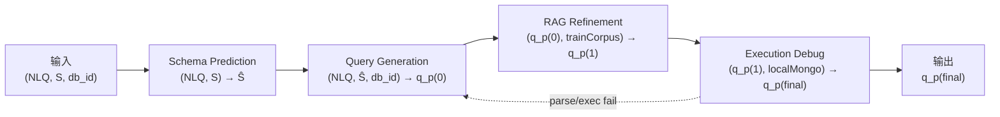

# 06 · Solution Design — SMART 求解侧参考架构与硬边界

> 本文件是 TEND 基准 **求解侧** 的单一真源。定义 SMART 四阶段参考求解器、阶段间接口契约、求解侧硬边界、shape-preserving target_fields 协议，以及 canonical 示例 `orchestra/1001` 的完整调用轨迹。不重复定义任务 IO、评测指标、gold 等价类、DataWorld 构造或 Intent 派生，这些概念的权威文档见 [§06-7 边界声明](#06-7)。

---

<a id="06-0"></a>
## §06-0 摘要

TEND 将 Text-to-NoSQL 求解任务定义为 `f: (NLQ, S, db_id) → q^{MQL}`（权威形式见 [01 §1](./01_task_definition.md#01-1)）。本文档给出一个 **参考求解器架构 SMART**，并规定 **任意求解器** 提交到 TEND 时必须遵守的 **求解侧硬边界**。SMART 本身并非评测必需，但其四阶段与硬边界是**互相正交**的两层：

1. **SMART 四阶段参考求解架构**（§06-1 / §06-2）
   `Schema Prediction → Query Generation → RAG Refinement → Execution Debug`，从 `(NLQ, S, db_id)` 输出 `q_p^{(final)}`，其中 Execution Debug 失败时回路到 Query Generation。
2. **求解侧硬边界**（§06-4）—— 求解器作者无论采用何种架构，均须同时满足：
   - **audit 屏蔽清单** —— `audit/` 整树 + `test.json.{MQL, canonical_form_set, *_ref}` + `intent_template_lattice` 映射 + `frontier_panel` manifest 不可读；
   - **6 件禁用 operator 的 AST 生成约束** —— 权威定义在 [01 §2-2](./01_task_definition.md#01-2-2)；
   - **四方 panel disjointness 求解侧对偶** —— `S_solver ∩ A = S_solver ∩ B = S_solver ∩ C = ∅`，其中 B 含 20 个冻结模型（4 panels × 5），见 [04 §11](./04_intent_to_query_construction.md#04-11)；
   - **shape-preserving target_fields 协议** —— 见 [§06-5](#06-5)。

### 职责边界

| 概念 | 权威文档 | 本文档角色 |
| :-- | :-- | :-- |
| 任务签名 / NormExec / `≡_rec` / gold 三层保障 | [01 §1](./01_task_definition.md#01-1) · [01 §3](./01_task_definition.md#01-3) | 仅引用 |
| 6 禁用 operator 的语义定义 | [01 §2-2](./01_task_definition.md#01-2-2) | 仅引用，AST 过滤实现在本文档 |
| P1–P4 | [01 §6](./01_task_definition.md#01-6) | 仅引用 |
| 资产目录 / 记录字段契约 | [02 §1](./02_dataset_design.md#02-1) · [02 §2](./02_dataset_design.md#02-2) | 仅引用 |
| phenomena_registry / persona_bank 公开视图 | [02 §3-3](./02_dataset_design.md#02-3-3) · [02 §3-4](./02_dataset_design.md#02-3-4) | 列为可读面 |
| DataWorld 合成 / F_topology / 噪声层 | [03 §0](./03_dataworld_synthesis.md#03-0) · [03 §6](./03_dataworld_synthesis.md#03-6) | 仅引用 |
| QIR / SI / canonical_form_set 机械派生 | [04 §4](./04_intent_to_query_construction.md#04-4) · [04 §9](./04_intent_to_query_construction.md#04-9) | **求解侧不可访问** |
| V_correct / V_discrim / V_diverse | [04 §10](./04_intent_to_query_construction.md#04-10) | 仅引用 |
| 4-panel 冻结清单 | [04 §11](./04_intent_to_query_construction.md#04-11) | 用作 disjointness 对偶 |
| 7 指标 / EX 公式 / 评测协议 / 强制披露 | [05 §1](./05_evaluation_methodology.md#05-1) · [05 §2](./05_evaluation_methodology.md#05-2) · [05 §5](./05_evaluation_methodology.md#05-5) | 仅引用 |
| 四方 disjointness 构造侧 | [05 §4](./05_evaluation_methodology.md#05-4) | 本文档给出求解侧对偶 |

---

<a id="06-1"></a>
## §06-1 SMART 四阶段总览

<a id="06-1-1"></a>
### §06-1-1 架构图



反馈回路唯一：`Execution Debug` 检测到 parse 或 dry-run 执行失败时回跳至 `Query Generation`，`RAG Refinement` 缓存的检索结果允许复用但必须重新调用生成。最大重试次数由求解器自定义，并在评测报告中按 [05 §5](./05_evaluation_methodology.md#05-5) 的要求强制披露。

<a id="06-1-2"></a>
### §06-1-2 各阶段职责简述

| 阶段 | 一句话职责 |
| :-- | :-- |
| Schema Prediction | 在完整 schema `S` 上根据 NLQ 预测与任务相关的字段子集 `Ŝ ⊆ S`，避免在生成阶段塞入整张 schema。 |
| Query Generation | 以 `(NLQ, Ŝ, db_id)` 为输入生成首版 MongoDB aggregation pipeline `q_p^{(0)}`，并通过 AST 过滤拒绝 6 件禁用 operator。 |
| RAG Refinement | 以 `q_p^{(0)}` 为种子，从 `train.json` 可读字段检索相似示例，对 operator 选型、字段命名、窗口/分组键进行就地修正得到 `q_p^{(1)}`。 |
| Execution Debug | 在求解器自持的本地 MongoDB 上对 `q_p^{(1)}` 做干跑；语法/运行失败回路到 Query Generation；通过后产出 `q_p^{(final)}`。 |

<a id="06-1-3"></a>
### §06-1-3 四阶段数据流接口契约

阶段间 **只允许** 通过下表中列出的显式输入/输出进行通信。禁止任何侧信道（全局变量、文件系统缓存跨阶段共享、隐藏字段等）。

| 阶段 | 显式输入 | 显式输出 | 允许的外部访问 | 禁止访问（节选） |
| :-- | :-- | :-- | :-- | :-- |
| Schema Prediction | `NLQ`、`S`（JSON Schema 序列化） | `Ŝ`（字段路径集合） | schema 公开字段名、简要注释 | `mongodb_data` 整库加载、`test.json.MQL`、`audit/*` |
| Query Generation | `NLQ`、`Ŝ`、`db_id`、可选 witness 样本（每集合 ≤ K 条） | `q_p^{(0)}`（MQL pipeline 字符串） | `phenomena_registry` 公开视图、`persona_bank` 公开视图 | `intent_template_lattice` 映射、`test.json.{MQL, canonical_form_set, *_ref}` |
| RAG Refinement | `q_p^{(0)}`、`train.json` 检索语料 | `q_p^{(1)}` | `train.json.{nl_queries, MQL, canonical_form_set, record_id, db_id}` | `train.json.*_ref` dereferences、`audit/*` |
| Execution Debug | `q_p^{(1)}`、本地 MongoDB 实例 | `q_p^{(final)}` | 求解器自持数据库的执行 API | 评测用 test 数据库的 gold 答案 |

> 契约要点：`Ŝ` 作为 Query Generation 唯一来源的 schema 视图；witness 样本 **只在 Query Generation 阶段以 K-sample 限额允许引入**，禁止在 Schema Prediction 阶段全库载入（见 [§06-4-4](#06-4-4)）。

---

<a id="06-2"></a>
## §06-2 各阶段细节

<a id="06-2-1"></a>
### §06-2-1 Schema Prediction

- **输入**：`(NLQ, S)`，`S` 为 db_id 对应的 `mongodb_schema.json`（结构由 [02 §1](./02_dataset_design.md#02-1) 的资产目录给出）。
- **输出**：`Ŝ ⊆ S`，以字段路径集合形式表示（例 `conductor._id`、`conductor.orchestra[].performance[].Attendance`）。
- **允许操作**：字段级裁剪、嵌套路径推导、外键关联追踪。
- **禁用操作**：加载 `mongodb_data` 整库、读取 `audit/*`、跨 db_id 聚合。
- **训练信号**：弱监督来自 `train.json` 中 `NLQ → MQL` 的字段引用抽取（MQL AST 中出现的字段集合即 `Ŝ_gold^{train}`）。求解器自行选择训练/推理策略（规则、微调、提示词等），本文档不约束具体方法。
- **常见失败模式**：
  1. 过度裁剪 → 在 Query Generation 阶段补不回必需字段，触发 Execution Debug 回路；
  2. 过度保留 → 相当于 no-op，增加下游 prompt 噪声，降低 EX。

<a id="06-2-2"></a>
### §06-2-2 Query Generation

- **输入**：`(NLQ, Ŝ, db_id)`；可选加入每集合 ≤ K 条 witness 样本用于辅助字段语义推断（K 由求解器披露）。
- **Prompt 可含内容**：
  - `Ŝ` 的 schema 序列化；
  - 可选 witness 样本（受 K 限额）；
  - 可选 `phenomena_registry` 公开视图；
  - 可选 `persona_bank` 公开视图；
  - 求解器 **自己的** `(NLQ → phenomena)` 与 `(NLQ → persona)` 推断。
- **不可含内容**：
  - `intent_template_lattice` 的 `(phenomenon, persona) → SI` 映射（即使公开目录能列出 SI 模式目录，其 **seeding 规则** 对求解器屏蔽）；
  - 任何 `test.json.MQL` / `test.json.canonical_form_set` 及其 `*_ref`；
  - `audit/*`。
- **输出**：`q_p^{(0)}`，MongoDB aggregation pipeline 的 JSON 字符串。
- **强制后处理**：AST 过滤（见 [§06-4-2](#06-4-2)），若命中 6 件禁用 operator，则回调重采样或规则重写。

> 说明：`phenomena_registry` 是 **公开** 资产（[02 §3-3](./02_dataset_design.md#02-3-3)），求解器可自由阅读并形成 "NLQ 涉及哪些 phenomena" 的 **本地推断**。但 "gold SI 是如何由 `(phenomenon, persona)` 派生出的" 这一 **seeding 规则** 通过 `intent_template_lattice` 的内部字段承载，对求解器屏蔽，以防 gold SI 以及进而 `canonical_form_set` 被反推。

<a id="06-2-3"></a>
### §06-2-3 RAG Refinement

- **输入**：`q_p^{(0)}` 与 `train.json` 检索语料。
- **检索键**：
  1. `NLQ` 向量表示（求解器自选 embedding 模型，需披露）；
  2. MQL operator 指纹（`q_p^{(0)}` 使用的 stage 顺序 + operator 集合）；
  3. Schema signature（`Ŝ` 的字段路径哈希）。
- **可读字段**（`train.json` 每条记录）：
  - `record_id`、`db_id`、`nl_queries[0..4]`、`MQL`、`canonical_form_set`（作为分类训练信号）。
- **屏蔽字段**（`train.json`）：所有 `*_ref` dereferences（例 `qir_ref`、`structured_intent_ref`、`phenomena_registry_ref`、`persona_bank_ref`、`audit_*_ref`），即使 schema 里存在该字段，求解器也不得通过这些引用回溯审计侧资产。
- **输出**：`q_p^{(1)}`。
- **典型修正**：
  - 字段名大小写对齐（schema 里 `Performance_ID` 而非 `Performance_Id`）；
  - 窗口函数的 `sortBy` 字段纠正；
  - `$facet` 分支命名与下游 `$project` 的一致性；
  - operator 选型（例如 `$bucket` vs `$bucketAuto`）。
- **AST 过滤**：与 Query Generation 同一份过滤器，在 `q_p^{(1)}` 生效。

<a id="06-2-4"></a>
### §06-2-4 Execution Debug

- **输入**：`q_p^{(1)}` 与求解器自持的本地 MongoDB 实例（与评测库 **不** 同源）。
- **动作**：
  1. MongoDB 驱动解析 `q_p^{(1)}`，捕获 parse 错误；
  2. 在本地副本数据上 dry-run，捕获运行时错误（字段不存在、类型不匹配、窗口语义错误等）；
  3. 若失败，反馈信息（error code、失败 stage index、疑似字段）送回 Query Generation。
- **反馈回路**：反馈只能以文本形式追加到 Query Generation 的 prompt 末尾；**不允许** 跨阶段共享隐式状态。
- **最大重试**：`R_max` 由求解器指定；评测报告需披露：
  - `R_max`、平均重试次数、单记录最长重试、本地 debug 数据与评测库的差异说明（见 [05 §5](./05_evaluation_methodology.md#05-5)）。
- **输出**：通过 dry-run 的 `q_p^{(final)}`。不得将 test 数据库的执行结果用作调试目标（即 **不可以** 直接以评测库的 runtime 行为作为 debug 信号）。

---

<a id="06-3"></a>
## §06-3 跨阶段信息流

<a id="06-3-1"></a>
### §06-3-1 各阶段可读字段

| 资产 / 字段 | Schema Pred. | Query Gen. | RAG Refine | Exec Debug |
| :-- | :--: | :--: | :--: | :--: |
| `S` = `mongodb_schema.json` | 读 | 读（经 `Ŝ` 裁剪） | 读（用于 signature 检索） | — |
| `mongodb_data`（样本受限） | 禁 | 读（每集合 ≤ K） | 禁 | 本地副本用于 dry-run |
| `phenomena_registry` 公开视图 | 可选 | 可选 | 可选 | — |
| `persona_bank` 公开视图 | 可选 | 可选 | 可选 | — |
| `test.json.nl_queries[0]` | 读 | 读 | 读 | — |
| `test.json.db_id` | 读 | 读 | 读 | 读 |
| `test.json.MQL` | 禁 | 禁 | 禁 | 禁 |
| `test.json.canonical_form_set` | 禁 | 禁 | 禁 | 禁 |
| `test.json.*_ref`（所有后缀） | 禁 | 禁 | 禁 | 禁 |
| `train.json.nl_queries[*]` | — | — | 读 | — |
| `train.json.MQL` | — | — | 读（训练信号） | — |
| `train.json.canonical_form_set` | — | — | 读（类成员训练信号） | — |
| `train.json.*_ref` | — | — | 禁 | — |
| `intent_template_lattice`（映射字段） | 禁 | 禁 | 禁 | 禁 |
| `frontier_panel` manifest | 禁 | 禁 | 禁 | 禁 |
| `audit/*`（整棵树） | 禁 | 禁 | 禁 | 禁 |

<a id="06-3-2"></a>
### §06-3-2 不可读字段（不完全列表）

- `audit/` 整棵树（展开列表见 [§06-4-1](#06-4-1)）；
- `test.json` 记录中：`MQL`、`canonical_form_set`、`structured_intent_ref`、`qir_ref`、`phenomena_ref`、`persona_ref`、`witness_augmentation_ref`、`frontier_panel_ref`、`empirical_difficulty_ref`、`world_signature_ref` 等任何以 `_ref` 结尾的字段；
- `phenomena_registry.phenomenon_seed_weight`（内部构造字段，非公开）；
- `persona_bank.persona_intent_seed_rule`（内部构造字段，非公开）；
- `intent_template_lattice` 中承载 `(phenomenon, persona) → SI` 的 **seeding 映射** 字段；
- `frontier_panel_manifest.json`（4-panel 中 frontier 层的冻结模型清单）；
- `rejected/` 目录（因为被拒记录的失效原因会泄露 failure-mode 防御策略）。

<a id="06-3-3"></a>
### §06-3-3 状态共享规则

1. **只通过显式输出传递状态**：阶段间传递的信息必须出现在本阶段的显式 output 上，或作为下一阶段的显式 input。
2. **禁止跨阶段隐藏上下文**：禁止把 Schema Prediction 的 prompt、RAG Refinement 的检索结果或 Execution Debug 的错误日志 **原文** 注入到评测输出 `q_p^{(final)}` 里。
3. **禁止外部服务污染**：求解器不得在四阶段任一环节将求解数据外发至评测方控制外的第三方持久化存储，以避免 test 数据污染训练语料。
4. **回路信息的纯度**：Execution Debug 的反馈必须被裁剪为 `{error_code, stage_index, suspect_field}` 的结构化摘要；禁止直接把本地 dry-run 结果（行数据）回传到 Query Generation 的 prompt。

---

<a id="06-4"></a>
## §06-4 求解侧硬边界

<a id="06-4-1"></a>
### §06-4-1 audit 屏蔽清单

**原则**：凡出现在 `audit/` 下的任何资产，求解器均不可读；`test.json` 的 gold 字段与任何 `*_ref` 字段均不可读。违反即构成 **评测无效**。

<details>
<summary><strong>audit/ 子树（完整屏蔽清单）</strong></summary>

- `audit/structured_intent/<record_id>.yaml`
- `audit/qir/<record_id>.yaml`
- `audit/derived/canonical_form_set/<record_id>.json`
- `audit/derived/checker_set/<record_id>.json`
- `audit/derived/mutation_set/<record_id>.json`
- `audit/world_variants/<db_id>/*`
- `audit/certificate/<record_id>.json`
- `audit/empirical_difficulty/<record_id>.json`
- `audit/lift_trace/<record_id>.yaml`
- `audit/complexity_vector/<db_id>.json`
- `audit/noise_trace/<db_id>.yaml`
- `audit/sql_bridge_defeat/<record_id>.json`
- `audit/template_bridge_defeat/<record_id>.json`
- `audit/witness_augmentation_trace/<record_id>.yaml`
- `audit/phenomena_seed/<record_id>.json`
- `audit/frontier_panel_verdict/<record_id>.json`
- `audit/reference_panel/diff_panel_small_manifest.json`
- `audit/reference_panel/diff_panel_medium_manifest.json`
- `audit/reference_panel/diff_panel_large_manifest.json`
- `audit/reference_panel/diff_panel_frontier_manifest.json`
- `audit/reference_panel/sql_bridge_manifest.json`
- `audit/reference_panel/template_bridge_manifest.json`
- `audit/reference_panel/ambiguity_attack_manifest.json`
- `audit/reference_panel/failure_mode_bank.json`
- `audit/taxonomy_board/*`
- `audit/coverage/*`
- `audit/grammar/*`
- `audit/human_anchor/*`
- `audit/rejected/*`

</details>

**额外屏蔽**：

- `test.json.MQL` —— gold 答案；
- `test.json.canonical_form_set` —— gold 等价类；
- `test.json.<任何 *_ref 字段>` —— 以引用方式承载 gold 推导链；
- `train.json.<任何 *_ref 字段>` —— `train.json` 仅允许读 `record_id`、`db_id`、`nl_queries`、`MQL`、`canonical_form_set` 五类字段；
- `intent_template_lattice.json` 的 **seeding 映射字段** —— 公开目录可能列出模式名，但 "`(phenomenon, persona)` 如何 seed 出具体 SI 模式" 这一映射对求解器屏蔽。

<a id="06-4-2"></a>
### §06-4-2 6 件禁用 operator 的生成约束

权威语义定义见 [01 §2-2](./01_task_definition.md#01-2-2)。本节给出求解侧的 **AST 过滤实现约束**：

| # | operator | 禁用原因（摘要） |
| :-- | :-- | :-- |
| 1 | `$out` | 写操作，破坏只读不可变性 |
| 2 | `$merge` | 写操作，破坏只读不可变性 |
| 3 | `$function` | 服务器端 JS 逃逸，破坏可分析性与确定性 |
| 4 | `$accumulator` | 自定义 JS 累加器，与 `$function` 同源 |
| 5 | `$where` | 字符串 JS 谓词，无法静态分析 |
| 6 | `$sample` | 随机采样，破坏确定性评测 |

**AST 过滤（求解侧，Python 伪代码）**：

```python
FORBIDDEN_OPS = {"$out", "$merge", "$function", "$accumulator", "$where", "$sample"}

def ast_reject(pipeline: list) -> tuple[bool, list[str]]:
    hits: list[str] = []

    def walk(node, path="$"):
        if isinstance(node, dict):
            for k, v in node.items():
                if k in FORBIDDEN_OPS:
                    hits.append(f"{path}.{k}")
                walk(v, f"{path}.{k}")
        elif isinstance(node, list):
            for i, item in enumerate(node):
                walk(item, f"{path}[{i}]")

    walk(pipeline)
    return (len(hits) == 0, hits)
```

AST 过滤必须在 **Query Generation** 与 **RAG Refinement** 两阶段的每一次生成/修正后立刻运行。若命中，求解器必须通过重采样或规则重写替换，不得将命中项提交为 `q_p^{(final)}`。若经过 `R_max` 次重试仍命中，该条目以空 pipeline `[]` 标注为 **自我放弃**，评测按 [05 §1](./05_evaluation_methodology.md#05-1) 的 EX 公式记为未命中（因为空 pipeline 的 NormExec 输出不属于 gold `canonical_form_set` 的任意成员）。

<a id="06-4-3"></a>
### §06-4-3 四方 panel disjointness（求解侧对偶）

[05 §4](./05_evaluation_methodology.md#05-4) 从 **评测与构造侧** 规定了四方不相交：
`A ∩ B = A ∩ C = B ∩ C = ∅`，其中 A = 被评测求解器、B = 20 个冻结 V_diverse 模型（4 panels × 5，见 [04 §11](./04_intent_to_query_construction.md#04-11)）、C = V_correct 与 V_discrim 的 LLM 池（见 [04 §10](./04_intent_to_query_construction.md#04-10)）。

本节给出 **求解侧对偶**：记 `S_solver` 为当前求解器在四阶段中使用的所有模型/服务集合（包括 Schema Prediction 的预测模型、Query Generation 的主干 LLM、RAG Refinement 的 embedding 与 rerank 模型、Execution Debug 附带的任何辅助模型）。求解器必须同时满足：

- `S_solver ∩ A_frozen = ∅`（A 指被评测 = 自身，此条默认成立）；
- `S_solver ∩ B_frozen = ∅`（20 个 4-panel 冻结模型）；
- `S_solver ∩ C_pool = ∅`（V_correct + V_discrim 池）。

**示例检查**：若某求解器把 `claude-4-opus` 作为 Query Generation 主干，而 `frontier panel` 的 5 个冻结模型名单中包含 `claude-4-opus`，则 `S_solver ∩ B_frozen ≠ ∅`，disjointness 失败，整份评测结果视为不合规。

求解器需在评测报告 [05 §5](./05_evaluation_methodology.md#05-5) 的披露段落中列出 `S_solver` 全部条目（模型名、服务版本、训练截止期），评测方据此核验三重不相交。

<a id="06-4-4"></a>
### §06-4-4 额外边界

1. **`world_signature` 不可反推**
   - `world_signature = sha256:...` 是 DataWorld 合成侧的完整性指纹（见 [03 §0](./03_dataworld_synthesis.md#03-0)）。
   - 求解器不得通过穷举 schema + 部分 witness 等方式试图重建 DataWorld 构造链或反推 `structured_intent`；即使技术上可行也构成违规。
2. **`mongodb_data` 整库禁输入 Schema Prediction**
   - Schema Prediction 只允许访问 `S`（schema 描述）与 NLQ；若求解器需要样本数据辅助字段语义推断，必须延后到 Query Generation 阶段以每集合 `≤ K` 条的形式引入（K 由求解器披露）。
   - 违规形式包括但不限于：在 Schema Prediction 提示词中嵌入整库采样、把 witness 全量作为附件上传、通过 `$sample` 等价操作间接泄露数据分布（即便仅在离线 profiling 中）。
3. **`audit/rejected/` 不可读**
   - `rejected/` 记录的是 V_correct / V_discrim / V_diverse 判定为假阳/假阴的样本（见 [04 §10](./04_intent_to_query_construction.md#04-10)）。
   - 读取此目录等同于获知 failure-mode 防御表，会让求解器学习到 **如何躲避** 对抗校验；因此即使在 **训练阶段** 也一并屏蔽。
4. **任何 `*_ref` dereference 均屏蔽**
   - 即使求解器有能力枚举引用路径，也不得 dereference。`*_ref` 是资产跨文件引用的语义化标识（见 [02 §2](./02_dataset_design.md#02-2)），不构成 "公开授权"。

---

<a id="06-5"></a>
## §06-5 shape-preserving target_fields 协议

<a id="06-5-1"></a>
### §06-5-1 协议触发条件

当 NLQ 出现以下关键词/语义时，`shape_policy` 被记为 `augment`，触发本协议：

- 英文关键词：`attach`、`augment`、`add field`、`preserve structure`、`in place`、`decorate`、`annotate`（不限于）；
- 中文语义：`为每个 X 附加 / 增补 / 标注 / 就地计算`、`保持原结构` 等；
- 语义形式：NLQ 要求返回的每个顶层文档 **一一对应** 输入集合的每个文档，且只是在原文档上 **新增字段**，不改变文档数与嵌套层次。

非触发情况（常见）：

- `shape_policy = reshape` —— NLQ 要求改变文档数、展平、透视、分组；
- `shape_policy = reduce` —— NLQ 要求聚合到更少的文档/标量。

> `shape_policy` 的权威标注来自构造侧（由 SI 在 Symbolic Lift 时写入），求解器 **无法读取** 其真值；本节协议让求解器 **从 NLQ 侧自检** 并在必要时强制切换到就地惯用法。

<a id="06-5-2"></a>
### §06-5-2 生成惯用法

触发协议后，Query Generation 必须采用 **就地惯用法**：以 `$addFields`（或 `$set`）叠加新字段，内部用 `$map`、`$reduce`、`$filter` 等表达式级算子完成计算。

**就地惯用法示例**（`orders` 集合，为每个 `items[]` 元素叠加 `line_total` 字段）：

```javascript
db.orders.aggregate([
  {
    $addFields: {
      items_with_total: {
        $map: {
          input: "$items",
          as: "it",
          in: {
            $mergeObjects: [
              "$$it",
              { line_total: { $multiply: ["$$it.qty", "$$it.price"] } }
            ]
          }
        }
      }
    }
  }
])
```

**反模式**：使用 `$unwind + $group` 重建数组。

```javascript
db.orders.aggregate([
  { $unwind: "$items" },
  { $addFields: { "items.line_total": { $multiply: ["$items.qty", "$items.price"] } } },
  { $group: { _id: "$_id", items: { $push: "$items" }, /* ...其他字段... */ } }
])
```

在 `shape_policy = augment` 下这种反模式会导致：

- 字段顺序与其他顶层字段丢失或需要逐一重建；
- NormExec 后 BSON 排序不等价，`≡_rec` 判定失败；
- 与 `canonical_form_set` 中 `augment-idiom` 形式的成员均不等价，EX=0。

<a id="06-5-3"></a>
### §06-5-3 solver 内部 meta 约定

求解器可在内部 prompt 中显式注入如下 meta（**仅作为提示词辅助**，**不进入评测输出**）：

```yaml
shape_policy: augment
target_fields:
  - items_with_total
```

- `target_fields`：本次补齐后新增的顶层字段名数组；
- 供 Query Generation 决定 `$addFields` vs `$project` 的语义选择；
- 评测 `q_p^{(final)}` **不** 包含 meta 条目。任何把 meta 以字段方式混入 pipeline 的实现会被 AST 过滤（非禁用 operator，但如果 pipeline 被 meta 弄脏，NormExec 行为会偏离 gold）。

<a id="06-5-4"></a>
### §06-5-4 不适用场景

- **`reshape`**：NLQ 明显要求重塑文档形态、展开嵌套、改变主键语义时。按标准 pipeline 流程自由选型。
- **`reduce`**：NLQ 要求聚合到更少文档或单一标量时（如 `total sum`、`global median`、`per-group count`）。按标准 pipeline 流程自由选型。

在非触发情况下使用 `$unwind + $group` 组合属于正常选型。本协议的约束仅在 `augment` 语义下生效。

---

<a id="06-6"></a>
## §06-6 canonical 示例 `orchestra/1001` 的 SMART 调用轨迹

以下轨迹对应基准中的 canonical 样本，元数据：

| 字段 | 值 |
| :-- | :-- |
| `db_id` | `orchestra` |
| `record_id` | `1001` |
| `operator_family` | `window_function_with_facet_filter` |
| `nosql_nativeness_level` | `L4` |
| `shape_policy` | `reshape` |
| `(pr_small, pr_medium, pr_large, pr_frontier)` | `(0.0, 0.2, 0.6, 0.2)` |
| `empirical_difficulty` | `hard` |
| `world_signature` | `sha256:a47f3e...` |

因 `shape_policy = reshape`，**[§06-5](#06-5) 不适用**。

<a id="06-6-1"></a>
### §06-6-1 输入

- `NLQ_0`（原文，英文）：
  > *For each conductor, compute the 3-performance moving average of attendance across performances under their orchestras, and return those whose moving average is above the global median across all conductors.*
- `S`：`orchestra` 的 NoSQL 嵌套 schema（`conductor` 文档内嵌 `orchestra[]`，其元素再内嵌 `performance[]`）；
- `db_id = "orchestra"`。

求解器侧推断（通过读取公开 `phenomena_registry` + 自身语言理解）：

- Phenomena：`temporal_trend`（"3-performance moving average"）、`cross_conductor_comparison`（"above global median across all conductors"）。
- Persona：`analyst`（"return those whose ..." 的分析汇报语气）。

求解器 **不访问** `intent_template_lattice`，因此 **不知** 上述 `(phenomena, persona)` 的 gold SI 模式。

<a id="06-6-2"></a>
### §06-6-2 Schema Prediction 输出 `Ŝ`

```text
Ŝ = {
  conductor._id,
  conductor.Name,
  conductor.orchestra,
  conductor.orchestra[].performance,
  conductor.orchestra[].performance[].Performance_ID,
  conductor.orchestra[].performance[].Attendance
}
```

排除了 `Age`、`Year_of_Work`、`Nationality`、`Record_Company`、`Year_of_Founded`、`Major_Record_Format`、`Type`、`Weekly_rank`、`Share` 等与 NLQ 不相关字段。

<a id="06-6-3"></a>
### §06-6-3 Query Generation 输出 `q_p^{(0)}`

**Operator 选型映射**（求解器的推理过程）：

| NLQ 片段 | 推出的 operator |
| :-- | :-- |
| "3-performance moving average" | `$setWindowFields` + window size 3 |
| "above global median across all conductors" | `$facet`（2 分支：各 conductor 的 rolling avg + 全局 median） |
| "across performances under their orchestras" | `$unwind` × 2（`orchestra`、`performance`） |
| "for each conductor" | `$group` by `_id = "$_id"` |

**Pipeline 骨架**：`[unwind, unwind, setWindowFields, group, facet, project+filter, unwind, project]`，AST 过滤通过（未命中 6 件禁用）。

```javascript
db.conductor.aggregate([
  { $unwind: "$orchestra" },
  { $unwind: "$orchestra.performance" },
  {
    $setWindowFields: {
      partitionBy: "$_id",
      sortBy: { "orchestra.performance.Performance_Id": 1 },
      output: {
        rollingAvg: {
          $avg: "$orchestra.performance.Attendance",
          window: { documents: [-2, 0] }
        }
      }
    }
  },
  { $group: { _id: "$_id", name: { $first: "$Name" }, rollingAvgs: { $push: "$rollingAvg" } } },
  {
    $facet: {
      perConductor: [{ $project: { _id: 1, name: 1, rollingAvgs: 1 } }],
      globalMedian: [
        { $unwind: "$rollingAvgs" },
        { $group: { _id: null, median: { $median: { input: "$rollingAvgs", method: "approximate" } } } }
      ]
    }
  },
  {
    $project: {
      perConductor: 1,
      medianValue: { $arrayElemAt: ["$globalMedian.median", 0] }
    }
  },
  { $unwind: "$perConductor" },
  {
    $project: {
      _id: "$perConductor._id",
      name: "$perConductor.name",
      aboveMedian: {
        $gt: [
          { $avg: "$perConductor.rollingAvgs" },
          "$medianValue"
        ]
      }
    }
  }
])
```

注意：此版本存在字段名 **`Performance_Id` 的拼写错误**（schema 真实字段为 `Performance_ID`），为下一阶段的修正埋下伏笔。

<a id="06-6-4"></a>
### §06-6-4 RAG Refinement 输出 `q_p^{(1)}`

检索命中 `train.json` 中 `operator_family = moving_avg_with_facet_median` 的 3 条近邻样本（按 `NLQ` 向量 + operator 指纹 + schema signature 综合排序）。

修正点（仅对 `q_p^{(0)}` 的局部改动）：

- `sortBy` 字段 `Performance_Id` → `Performance_ID`（依据近邻样本 + `Ŝ` 中的真实字段名）；
- window 输出命名 `rollingAvg` 与下游 `$group.rollingAvgs` 的一致性通过重命名为 `perfRollingAvg` 显式对齐（防止下游歧义）；
- `$facet` 分支命名修正，`globalMedian` 分支里 `$group` 的 `median` → `globalMedianValue`，使下游 `$project` 中 `$arrayElemAt` 取值路径明确。

AST 过滤通过，`q_p^{(1)}` 产出。

<a id="06-6-5"></a>
### §06-6-5 Execution Debug 与最终提交

- **第一次 dry-run**：在求解器本地 MongoDB 副本上失败，错误为 `Invalid field path 'orchestra.performance.Performance_Id' at stage 3 ($setWindowFields)`。反馈 `{error_code: "FIELD_PATH", stage_index: 3, suspect_field: "Performance_Id"}` 回传 Query Generation。

> 说明：第一次反馈是在 `q_p^{(0)}` 的语义层被命中；RAG Refinement 的修正本应消除该错误，但由于求解器 RAG 检索返回的其中一个近邻恰好沿用了历史写法 `Performance_Id`，在修正阶段遗漏了此处的替换。反馈信息被裁剪为 `{error_code, stage_index, suspect_field}` 结构化摘要，未把行数据原文带回 Query Generation。

- **第二次生成**：Query Generation 收到反馈，重新执行生成 + AST 过滤 + RAG Refinement，把剩余的 `Performance_Id` 全部替换为 `Performance_ID`。
- **第二次 dry-run**：通过。
- **提交 `q_p^{(final)}`**：上述修正后的 pipeline，向评测接口提交。

评测方按 [05 §2](./05_evaluation_methodology.md#05-2) 的协议对 `q_p^{(final)}` 做 NormExec，判定其 NormExec 输出是否属于 gold `canonical_form_set`（由 [04 §9](./04_intent_to_query_construction.md#04-9) 的机械派生产生）；`≡_rec` 成立 ⇒ EX=1。

求解器披露（节选，进入评测报告 [05 §5](./05_evaluation_methodology.md#05-5)）：

```yaml
solver_disclosure:
  s_solver:
    - model: "<求解器主干模型名>"
      stage: "Query Generation"
      version: "<…>"
    - model: "<求解器 embedding 模型名>"
      stage: "RAG Refinement"
      version: "<…>"
  r_max: 3
  avg_retries: 0.42
  witness_k_per_collection: 5
  record_1001:
    retries: 1
    retry_reason:
      - "FIELD_PATH: Performance_Id -> Performance_ID"
  disjointness_check:
    s_solver_intersect_b_frozen: empty
    s_solver_intersect_c_pool: empty
```

---

<a id="06-7"></a>
## §06-7 边界声明

本文件的所有"定义"只涵盖 **求解侧架构与约束**。下列概念在本文件中 **仅以引用形式出现**，任何看似矛盾以权威文档为准：

| 主题 | 权威文档 |
| :-- | :-- |
| 任务签名 `f: (NLQ, S, db_id) → q^{MQL}` | [01 §1](./01_task_definition.md#01-1) |
| 6 件禁用 operator 的 **语义定义** | [01 §2-2](./01_task_definition.md#01-2-2) |
| NormExec、`≡_rec`、gold-as-class 三层保障 | [01 §3](./01_task_definition.md#01-3) |
| P1–P4 | [01 §6](./01_task_definition.md#01-6) |
| 资产目录 / `audit/` 子树路径 | [02 §1](./02_dataset_design.md#02-1) |
| 记录字段契约 / `canonical_form_set` 必填 | [02 §2](./02_dataset_design.md#02-2) |
| `phenomena_registry` 公开视图 | [02 §3-3](./02_dataset_design.md#02-3-3) |
| `persona_bank` 公开视图 | [02 §3-4](./02_dataset_design.md#02-3-4) |
| DataWorld 合成与 `world_signature` | [03 §0](./03_dataworld_synthesis.md#03-0) |
| 噪声层 / schema_complexity_profile | [03 §6](./03_dataworld_synthesis.md#03-6) |
| `structured_intent` / `QIR` / 机械派生 | [04 §4](./04_intent_to_query_construction.md#04-4) |
| `canonical_form_set` 派生 / checker / mutations | [04 §9](./04_intent_to_query_construction.md#04-9) |
| V_correct / V_discrim LLM 池 | [04 §10](./04_intent_to_query_construction.md#04-10) |
| 4-panel 冻结清单（20 模型） | [04 §11](./04_intent_to_query_construction.md#04-11) |
| 7 指标 / EX 公式 / 评测协议 | [05 §1](./05_evaluation_methodology.md#05-1) · [05 §2](./05_evaluation_methodology.md#05-2) |
| 四方 disjointness（构造侧） | [05 §4](./05_evaluation_methodology.md#05-4) |
| 强制披露清单 | [05 §5](./05_evaluation_methodology.md#05-5) |

**本文档声明所有权的内容**：

- SMART 四阶段参考求解器的名称、拓扑、阶段职责与接口契约；
- 求解侧 audit 屏蔽清单（尤其是 `intent_template_lattice` 映射屏蔽、`frontier_panel` manifest 屏蔽、`rejected/` 屏蔽）；
- 6 件禁用 operator 的 **求解侧 AST 过滤实现形式**（语义权威在 [01 §2-2](./01_task_definition.md#01-2-2)）；
- 四方 disjointness 的 **求解侧对偶**（覆盖 20 冻结模型的不相交约束）；
- 额外边界（`world_signature` 反推、整库禁输入、`rejected/` 屏蔽、`*_ref` dereference 屏蔽）；
- shape-preserving target_fields 协议（触发条件、就地惯用法、反模式、内部 meta 约定、非触发场景）；
- canonical 示例 `orchestra/1001` 的完整 SMART 调用轨迹。
