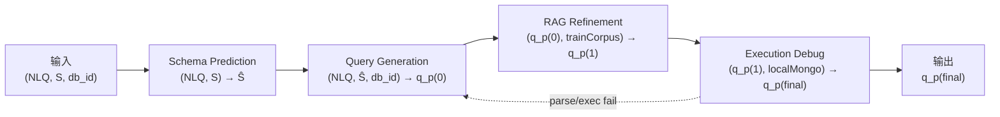

# 06 · Solution Design — SMART 求解侧参考架构与硬边界

> 本文件是 TEND **求解侧** 的单一真源 (SSoT)。定义 SMART 四阶段参考求解器、阶段间接口契约、求解侧硬边界、shape-preserving target_fields 协议，以及 canonical 示例 `orchestra/1001` 的完整调用轨迹。不重复定义任务 IO、评测指标、gold 等价类、DataWorld 构造或 Agent 查询构造，这些概念的权威文档见 [§06-7 边界声明](#06-7)。

---

## Part I

## TL;DR

TEND 将 Text-to-NoSQL 求解任务定义为 `f: (NLQ, S, db_id) → q^{MQL}`（权威形式见 [01 §01-1](./01_task_definition.md#01-1)）。本文档给出一个 **参考求解器架构 SMART**，并规定 **任意求解器** 提交到 TEND 时必须遵守的 **求解侧硬边界**。SMART 本身并非评测必需，但其四阶段与硬边界是**互相正交**的两层。

**SMART 四阶段**（§06-1 / §06-2）：`Schema Prediction → Query Generation → RAG Refinement → Execution Debug`，从 `(NLQ, S, db_id)` 输出 `q_p^{(final)}`；Execution Debug 在 parse 或 dry-run 失败时唯一回路到 Query Generation。Schema Prediction 在完整 schema `S` 上预测字段子集 `Ŝ`；Query Generation 以 `(NLQ, Ŝ, db_id)` 生成首版 pipeline `q_p^{(0)}` 并立即运行 AST 过滤；RAG Refinement 以 `train.json` 检索相似示例修正 operator 与字段命名得到 `q_p^{(1)}`；Execution Debug 在求解器自持本地 MongoDB 上 dry-run，通过后产出 `q_p^{(final)}`。

**求解侧硬边界**（§06-4）—— 无论架构，均须同时满足四项约束。**Audit 屏蔽**：`audit/` 整树、`test.json.{MQL, canonical_form_set, *_ref}`、`train.json.*_ref` dereference、`rejected/` 均不可读；Tier-1 可读面以 [02 §02-1](./02_dataset_design.md#02-1) 与机器可读 **allow-list** `schemas/solver_allow_list.json` 为准。**6 件禁用 operator**：`$sample`、`$rand`、`$$NOW`、`$out`、`$merge`、`$function`（语义权威 [01 §01-2-2](./01_task_definition.md#01-2-2)）；Query Generation 与 RAG Refinement 每次生成后须经 AST 过滤，命中 6 件禁用项则重采样或规则重写，不得提交。**构造–panel disjointness 求解侧对偶**：记 `S_solver` 为四阶段全部模型/服务集合，须满足 `S_solver ∩ B_frozen = ∅`（20 个 4-panel 冻结模型）且 `S_solver ∩ C_pool = ∅`（构造期 Agent 池 `{QPS, MS, MUT, PV, NLP, RTV, NNC, RA}`）；disjointness 失败则整份评测标记不合规（构造侧 disjointness 见 [05 §05-3](./05_evaluation_methodology.md#05-3)）。**shape-preserving target_fields 协议**（§06-5）：当 NLQ 语义要求 preserve 原文档形态时，solver 内部以 `target_fields` meta 驱动 `$addFields` / `$map` 就地惯用法，禁止 `$unwind + $group` 反模式。

**Allow-list 与披露**：各阶段可读/禁读字段的完整 allow-list 矩阵见 `schemas/solver_allow_list.json` 与 §06-3-1；求解器须在评测报告中披露 `S_solver` 全清单、witness K 限额、`R_max`、allow-list 合规自检结果与 disjointness 核验结果（[05 §05-5](./05_evaluation_methodology.md#05-5)）。AST 过滤对 6 件禁用 operator 为零容忍：任一阶段输出命中即不得进入 `q_p^{(final)}`。Canonical anchor `orchestra/1001`（L4、`reshape` shape_policy）的 SMART 轨迹见 §06-6；因 `shape_policy = reshape`，§06-5 不适用。

---

<a id="06-1"></a>
## §06-1 SMART 四阶段总览

<a id="06-1-1"></a>
### §06-1-1 架构图



反馈回路唯一：`Execution Debug` 检测到 parse 或 dry-run 执行失败时回跳至 `Query Generation`，`RAG Refinement` 缓存的检索结果允许复用但必须重新调用生成。最大重试次数由求解器自定义，并在评测报告中按 [05 §05-5](./05_evaluation_methodology.md#05-5) 的要求强制披露。

<a id="06-1-2"></a>
### §06-1-2 各阶段职责简述

| 阶段 | 一句话职责 |
| :-- | :-- |
| Schema Prediction | 在完整 schema `S` 上根据 NLQ 预测与任务相关的字段子集 `Ŝ ⊆ S`，避免在生成阶段塞入整张 schema。 |
| Query Generation | 以 `(NLQ, Ŝ, db_id)` 为输入生成首版 MongoDB aggregation pipeline `q_p^{(0)}`，并通过 AST 过滤拒绝 6 件禁用 operator。 |
| RAG Refinement | 以 `q_p^{(0)}` 为种子，从 `train.json` 可读字段检索相似示例，对 operator 选型、字段命名、窗口/分组键进行就地修正得到 `q_p^{(1)}`。 |
| Execution Debug | 在求解器自持的本地 MongoDB 上对 `q_p^{(1)}` 做干跑；语法/运行失败回路到 Query Generation；通过后产出 `q_p^{(final)}`。 |

<a id="06-1-3"></a>
### §06-1-3 四阶段数据流接口契约

阶段间 **只允许** 通过下表中列出的显式输入/输出进行通信。禁止任何侧信道（全局变量、文件系统缓存跨阶段共享、隐藏字段等）。机器可读 allow-list 见 `schemas/solver_allow_list.json`。

| 阶段 | 显式输入 | 显式输出 | 允许的外部访问 | 禁止访问（节选） |
| :-- | :-- | :-- | :-- | :-- |
| Schema Prediction | `NLQ`、`S`（JSON Schema 序列化） | `Ŝ`（字段路径集合） | schema 公开字段名、SRA rationale 摘要 | `mongodb_data` 整库加载、`test.json.MQL`、`audit/*` |
| Query Generation | `NLQ`、`Ŝ`、`db_id`、可选 witness 样本（每集合 ≤ K 条） | `q_p^{(0)}`（MQL pipeline 字符串） | `agent_design_rationale` 公开摘要、≤ K witness | `test.json.{MQL, canonical_form_set, *_ref}` |
| RAG Refinement | `q_p^{(0)}`、`train.json` 检索语料 | `q_p^{(1)}` | `train.json.{nl_queries, MQL, canonical_form_set, record_id, db_id}` | `train.json.*_ref` dereferences、`audit/*` |
| Execution Debug | `q_p^{(1)}`、本地 MongoDB 实例 | `q_p^{(final)}` | 求解器自持数据库的执行 API | 评测用 test 数据库的 gold 答案 |

> 契约要点：`Ŝ` 作为 Query Generation 唯一来源的 schema 视图；witness 样本 **只在 Query Generation 阶段以 K-sample 限额允许引入**，禁止在 Schema Prediction 阶段全库载入（见 [§06-4-4](#06-4-4)）。

---

<a id="06-2"></a>
## §06-2 各阶段细节

<a id="06-2-1"></a>
### §06-2-1 Schema Prediction

- **输入**：`(NLQ, S)`，`S` 为 db_id 对应的 `mongodb_schema/<db_id>.json`（结构由 [02 §02-1](./02_dataset_design.md#02-1) 给出）。
- **输出**：`Ŝ ⊆ S`，以字段路径集合形式表示（例 `conductor._id`、`conductor.orchestra[].performance[].Attendance`）。
- **允许操作**：字段级裁剪、嵌套路径推导、外键关联追踪。
- **禁用操作**：加载 `mongodb_data` 整库、读取 `audit/*`、跨 db_id 聚合。
- **训练信号**：弱监督来自 `train.json` 中 `NLQ → MQL` 的字段引用抽取（MQL AST 中出现的字段集合即 `Ŝ_gold^{train}`）。求解器自行选择训练/推理策略（规则、微调、提示词等），本文档不约束具体方法。
- **常见失败模式**：
  1. 过度裁剪 → 在 Query Generation 阶段补不回必需字段，触发 Execution Debug 回路；
  2. 过度保留 → 相当于 no-op，增加下游 prompt 噪声，降低 EX。

<a id="06-2-2"></a>
### §06-2-2 Query Generation

- **输入**：`(NLQ, Ŝ, db_id)`；可选加入每集合 ≤ K 条 witness 样本用于辅助字段语义推断（K 由求解器披露）。
- **Prompt 可含内容**：
  - `Ŝ` 的 schema 序列化；
  - 可选 witness 样本（受 K 限额）；
  - 可选 `agent_design_rationale/<db_id>.yaml` 的公开摘要字段；
  - 求解器 **自己的** NLQ → schema 关联推断。
- **不可含内容**：
  - 任何 `test.json.MQL` / `test.json.canonical_form_set` 及其 `*_ref`；
  - `audit/*`。
- **输出**：`q_p^{(0)}`，MongoDB aggregation pipeline 的 JSON 字符串。
- **强制后处理**：AST 过滤（见 [§06-4-2](#06-4-2)），若命中 6 件禁用 operator，则回调重采样或规则重写。

<a id="06-2-3"></a>
### §06-2-3 RAG Refinement

- **输入**：`q_p^{(0)}` 与 `train.json` 检索语料。
- **检索键**：
  1. `NLQ` 向量表示（求解器自选 embedding 模型，需披露）；
  2. MQL operator 指纹（`q_p^{(0)}` 使用的 stage 顺序 + operator 集合）；
  3. Schema signature（`Ŝ` 的字段路径哈希）。
- **可读字段**（`train.json` 每条记录）：
  - `record_id`、`db_id`、`nl_queries`、`MQL`、`canonical_form_set`（作为分类训练信号）、`difficulty`、`shape_policy`、`world_signature`。
- **屏蔽字段**（`train.json`）：所有 `*_ref` dereferences，即使 schema 里存在该字段，求解器也不得通过这些引用回溯 audit 侧资产。
- **输出**：`q_p^{(1)}`。
- **典型修正**：
  - 字段名大小写对齐（schema 里 `Performance_ID` 而非 `Performance_Id`）；
  - 窗口函数的 `sortBy` 字段纠正；
  - `$facet` 分支命名与下游 `$project` 的一致性；
  - operator 选型（例如 `$bucket` vs `$bucketAuto`）。
- **AST 过滤**：与 Query Generation 同一份过滤器，在 `q_p^{(1)}` 生效。

<a id="06-2-4"></a>
### §06-2-4 Execution Debug

- **输入**：`q_p^{(1)}` 与求解器自持的本地 MongoDB 实例（与评测库 **不** 同源）。
- **动作**：
  1. MongoDB 驱动解析 `q_p^{(1)}`，捕获 parse 错误；
  2. 在本地副本数据上 dry-run，捕获运行时错误（字段不存在、类型不匹配、窗口语义错误等）；
  3. 若失败，反馈信息（error code、失败 stage index、疑似字段）送回 Query Generation。
- **反馈回路**：反馈只能以文本形式追加到 Query Generation 的 prompt 末尾；**不允许** 跨阶段共享隐式状态。
- **最大重试**：`R_max` 由求解器指定；评测报告需披露 `R_max`、平均重试次数、单记录最长重试、本地 debug 数据与评测库的差异说明（见 [05 §05-5](./05_evaluation_methodology.md#05-5)）。
- **输出**：通过 dry-run 的 `q_p^{(final)}`。不得将 test 数据库的执行结果用作调试目标。

---

<a id="06-3"></a>
## §06-3 跨阶段信息流

<a id="06-3-1"></a>
### §06-3-1 各阶段可读字段

完整 allow-list 以 `schemas/solver_allow_list.json` 为准。下表为摘要：

| 资产 / 字段 | Schema Pred. | Query Gen. | RAG Refine | Exec Debug |
| :-- | :--: | :--: | :--: | :--: |
| `S` = `mongodb_schema/<db_id>.json` | 读 | 读（经 `Ŝ` 裁剪） | 读（用于 signature 检索） | — |
| `mongodb_data`（样本受限） | 禁 | 读（每集合 ≤ K） | 禁 | 本地副本用于 dry-run |
| `agent_design_rationale/<db_id>.yaml` | 可选 | 可选 | 可选 | — |
| `test.json.nl_queries` | 读 | 读 | 读 | — |
| `test.json.db_id` | 读 | 读 | 读 | 读 |
| `test.json.MQL` | 禁 | 禁 | 禁 | 禁 |
| `test.json.canonical_form_set` | 禁 | 禁 | 禁 | 禁 |
| `test.json.*_ref`（所有后缀） | 禁 | 禁 | 禁 | 禁 |
| `train.json.nl_queries[*]` | — | — | 读 | — |
| `train.json.MQL` | — | — | 读（训练信号） | — |
| `train.json.canonical_form_set` | — | — | 读（类成员训练信号） | — |
| `train.json.*_ref` | — | — | 禁 | — |
| `audit/*`（整棵树） | 禁 | 禁 | 禁 | 禁 |

<a id="06-3-2"></a>
### §06-3-2 不可读字段（不完全列表）

- `audit/` 整棵树（展开列表见 [§06-4-1](#06-4-1)）；
- `test.json` 记录中：`MQL`、`canonical_form_set` 及任何以 `_ref` 结尾的字段；
- `train.json` 中任何 `*_ref` dereference；
- `rejected/` 目录（被拒记录的失效原因会泄露 failure-mode 防御策略）。

<a id="06-3-3"></a>
### §06-3-3 状态共享规则

1. **只通过显式输出传递状态**：阶段间传递的信息必须出现在本阶段的显式 output 上，或作为下一阶段的显式 input。
2. **禁止跨阶段隐藏上下文**：禁止把 Schema Prediction 的 prompt、RAG Refinement 的检索结果或 Execution Debug 的错误日志 **原文** 注入到评测输出 `q_p^{(final)}` 里。
3. **禁止外部服务污染**：求解器不得在四阶段任一环节将求解数据外发至评测方控制外的第三方持久化存储。
4. **回路信息的纯度**：Execution Debug 的反馈必须被裁剪为 `{error_code, stage_index, suspect_field}` 的结构化摘要。

---

<a id="06-4"></a>
## §06-4 求解侧硬边界

<a id="06-4-1"></a>
### §06-4-1 audit 屏蔽清单

**原则**：凡出现在 `audit/` 下的任何资产，求解器均不可读；`test.json` 的 gold 字段与任何 `*_ref` 字段均不可读。违反即构成 **评测无效**。机器可读枚举见 `schemas/solver_allow_list.json` 的 `audit_blocklist` 与 `tier1_forbidden_glob`。

<details>
<summary><strong>audit/ 子树（完整屏蔽清单）</strong></summary>

- `audit/<db_id>/wp_output.yaml`
- `audit/<db_id>/migration_log.json`
- `audit/<db_id>/phenomena_audit.json`
- `audit/<db_id>/qra_trace.json`
- `audit/<db_id>/nnc_trace.json`
- `audit/ra_audit.json`
- `audit/ra_augment_trace.json`
- `audit/reference_panel/*`
- `audit/rejected/*`

</details>

**额外屏蔽**：

- `test.json.MQL` —— gold 答案；
- `test.json.canonical_form_set` —— gold 等价类；
- `test.json.<任何 *_ref 字段>` —— 以引用方式承载 gold 推导链；
- `train.json.<任何 *_ref 字段>` —— `train.json` 仅允许读 [§06-3-1](#06-3-1) 列出的字段子集。

<a id="06-4-2"></a>
### §06-4-2 6 件禁用 operator 的生成约束

权威语义定义见 [01 §01-2-2](./01_task_definition.md#01-2-2)。求解侧 **AST 过滤实现约束** 见 Part II §06-II-2；6 件禁用 operator 为：`$sample`、`$rand`、`$$NOW`、`$out`、`$merge`、`$function`。

| # | operator / token | 禁用原因（摘要） |
| :-- | :-- | :-- |
| 1 | `$sample` | 随机采样，破坏确定性评测 |
| 2 | `$rand` | 纯随机数，破坏 P_det |
| 3 | `$$NOW` | 墙钟时间，破坏 P_det |
| 4 | `$out` | 写操作，破坏只读不可变性 |
| 5 | `$merge` | 写操作，破坏只读不可变性 |
| 6 | `$function` | 服务器端 JS 逃逸，破坏可分析性与确定性 |

AST 过滤必须在 **Query Generation** 与 **RAG Refinement** 两阶段的每一次生成/修正后立刻运行。若命中 6 件禁用 operator，求解器必须通过重采样或规则重写替换，不得将命中项提交为 `q_p^{(final)}`。若经过 `R_max` 次重试仍命中，该条目以空 pipeline `[]` 标注为 **自我放弃**，评测按 [05 §05-1](./05_evaluation_methodology.md#05-1) 的 EX 公式记为未命中。

<a id="06-4-3"></a>
### §06-4-3 构造–panel disjointness（求解侧对偶）

[05 §05-3](./05_evaluation_methodology.md#05-3) 从 **评测与构造侧** 规定 `A ∩ B = ∅`，其中 A = 构造 Agent LLM 池 `{QPS, MS, MUT, PV, NLP, RTV, NNC, RA}`、B = 20 个冻结参考模型（4 panels × 5）。

本节给出 **求解侧对偶**：记 `S_solver` 为当前求解器在四阶段中使用的所有模型/服务集合。求解器必须同时满足：

- `S_solver ∩ B_frozen = ∅`（20 个 4-panel 冻结模型，manifest 见 `audit/reference_panel/manifest_<release>.json`）；
- `S_solver ∩ C_pool = ∅`（构造期 Agent 池 `{QPS, MS, MUT, PV, NLP, RTV, NNC, RA}`）。

**示例检查**：若某求解器把 `claude-4-opus` 作为 Query Generation 主干，而 frontier panel 的 5 个冻结模型名单中包含 `claude-4-opus`，则 `S_solver ∩ B_frozen ≠ ∅`，disjointness 失败，整份评测结果视为不合规。

求解器需在评测报告 [05 §05-5](./05_evaluation_methodology.md#05-5) 的披露段落中列出 `S_solver` 全部条目，评测方据此核验双重不相交。`schemas/solver_allow_list.json` 的 `four_party_disjointness` 节提供机器可读 invariant。

<a id="06-4-4"></a>
### §06-4-4 额外边界

1. **`world_signature` 不可反推** —— 求解器不得试图重建 DataWorld 构造链或反推 Phase B audit trace；即使技术上可行也构成违规。
2. **`mongodb_data` 整库禁输入 Schema Prediction** —— witness 必须延后到 Query Generation 阶段以每集合 `≤ K` 条的形式引入。
3. **`audit/rejected/` 不可读** —— 读取此目录等同于获知 failure-mode 防御表。
4. **任何 `*_ref` dereference 均屏蔽** —— `*_ref` 不构成 "公开授权"。

---

<a id="06-5"></a>
## §06-5 shape-preserving target_fields 协议

<a id="06-5-1"></a>
### §06-5-1 协议触发条件

当 NLQ 出现以下关键词/语义时，solver 内部 `shape_policy` 推断为 `preserve`，触发本协议：

- 英文关键词：`attach`、`augment`、`add field`、`preserve structure`、`in place`、`decorate`、`annotate`（不限于）；
- 中文语义：`为每个 X 附加 / 增补 / 标注 / 就地计算`、`保持原结构` 等；
- 语义形式：NLQ 要求返回的每个顶层文档 **一一对应** 输入集合的每个文档，且只是在原文档上 **新增字段**，不改变文档数与嵌套层次。

非触发情况：`shape_policy = reshape`（改变文档数、展平、透视、分组）或 `reduce`（聚合到更少文档/标量）。record 上的 `shape_policy` 真值对求解器 **不可读**（test.json 不发布该字段给 solver 作 gold 提示）；本节协议让求解器 **从 NLQ 侧自检**。

<a id="06-5-2"></a>
### §06-5-2 生成惯用法

触发协议后，Query Generation 必须采用 **就地惯用法**：以 `$addFields`（或 `$set`）叠加新字段，内部用 `$map`、`$reduce`、`$filter` 等表达式级算子完成计算。**反模式**：使用 `$unwind + $group` 重建数组——在 preserve 语义下会导致 NormExec 后 BSON 排序不等价，`≡_rec` 判定失败，EX=0。

<a id="06-5-3"></a>
### §06-5-3 solver 内部 meta 约定

求解器可在内部 prompt 中显式注入如下 meta（**仅作为提示词辅助**，**不进入评测输出**）：

- `shape_policy: preserve`
- `target_fields`: 本次补齐后新增的顶层字段名数组

`target_fields` 供 Query Generation 决定 `$addFields` vs `$project` 的语义选择；评测 `q_p^{(final)}` **不** 包含 meta 条目。SMART 参考实现中 `target_fields` 由 Schema Prediction 阶段（SLM）预测并贯穿 RAG / Debug（见 Part II §06-II-4）。

<a id="06-5-4"></a>
### §06-5-4 不适用场景

- **`reshape`**：NLQ 明显要求重塑文档形态时，按标准 pipeline 流程自由选型（canonical `orchestra/1001` 即属此类）。
- **`reduce`**：NLQ 要求聚合到更少文档或单一标量时，按标准 pipeline 流程自由选型。

---

<a id="06-6"></a>
## §06-6 canonical 示例 `orchestra/1001` 的 SMART 调用轨迹

以下轨迹对应基准中的 canonical 样本。因 `shape_policy = reshape`，**[§06-5](#06-5) 不适用**。

<a id="06-6-1"></a>
### §06-6-1 Canonical Anchor Record

<!-- canonical-anchor: orchestra/1001 -->
```json
{
  "record_id": 1001,
  "db_id": "orchestra",
  "nl_queries": {
    "canonical": "对每位 conductor，先在其指挥的 orchestra 的 performance 上按 Performance_ID 升序、对 Attendance 计算窗口大小为 (当前, 前 2 场) 的滑动平均；取该 conductor 的最后一次窗口平均值作为代表值 (Attendance 缺失视为 0)。然后计算所有 conductor 代表值的中位数。最终只输出代表值严格大于该中位数的 conductor，字段为 Name 与 last_window_avg；若 Name 缺失则显示为 (unknown)；不要求排序。",
    "colloquial": "列出最近场次出勤趋势高于同行中位数的指挥。"
  },
  "MQL": "db.conductor.aggregate([
  { $unwind: { path: \"$orchestra\", preserveNullAndEmptyArrays: false } },
  { $unwind: { path: \"$orchestra.performance\", preserveNullAndEmptyArrays: false } },
  { $setWindowFields: {
      partitionBy: \"$_id\",
      sortBy: { \"orchestra.performance.Performance_ID\": 1 },
      output: {
        moving_avg_attendance: {
          $avg: { $ifNull: [\"$orchestra.performance.Attendance\", 0] },
          window: { documents: [-2, 0] }
        }
      }
  } },
  { $group: {
      _id: \"$_id\",
      Name: { $first: { $ifNull: [\"$Name\", \"(unknown)\"] } },
      last_window_avg: { $last: \"$moving_avg_attendance\" }
  } },
  { $facet: {
      per_conductor: [ { $project: { _id: 0, Name: 1, last_window_avg: 1 } } ],
      global_median: [
        { $sort: { last_window_avg: 1 } },
        { $group: { _id: null, vals: { $push: \"$last_window_avg\" } } },
        { $project: { _id: 0, median: { $arrayElemAt: [\"$vals\", { $floor: { $divide: [{ $size: \"$vals\" }, 2] } }] } } }
      ]
  } },
  { $project: {
      kept: { $filter: {
        input: \"$per_conductor\",
        as: \"c\",
        cond: { $gt: [\"$$c.last_window_avg\", { $arrayElemAt: [\"$global_median.median\", 0] }] }
      } }
  } },
  { $unwind: \"$kept\" },
  { $project: { _id: 0, Name: \"$kept.Name\", last_window_avg: \"$kept.last_window_avg\" } }
])",
  "canonical_form_set": {
    "must_contain": ["$setWindowFields", "$facet", "$ifNull"],
    "must_not_contain": [],
    "must_contain_at_root": ["$setWindowFields", "$facet"],
    "must_not_contain_at_root": []
  },
  "difficulty": "L4",
  "shape_policy": "reshape",
  "world_signature": "sha256:a47f3e8b1c2d4e5f6a7b8c9d0e1f2a3b4c5d6e7f8a9b0c1d2e3f4a5b6c7d8e90",
  "agent_design_rationale_ref": "fixtures/orchestra/sra.yaml",
  "mutations_ref": "fixtures/orchestra/mutations.json"
}
```

<a id="06-6-2"></a>
### §06-6-2 Schema Prediction 输出 `Ŝ`

```text
Ŝ = {
  conductor._id,
  conductor.Name,
  conductor.orchestra,
  conductor.orchestra[].performance,
  conductor.orchestra[].performance[].Performance_ID,
  conductor.orchestra[].performance[].Attendance
}
```

<a id="06-6-3"></a>
### §06-6-3 Query Generation → RAG → Execution Debug（摘要）

- **Operator 选型**：3-performance moving average → `$setWindowFields`；global median → `$facet`；nested performances → `$unwind` × 2；per conductor → `$group`。
- **AST 过滤**：通过（未命中 6 件禁用 operator）。
- **RAG 修正**：`Performance_Id` → `Performance_ID`（字段名对齐）；`$facet` 分支命名与 `$project` 路径一致性。
- **Execution Debug**：首次 dry-run 可能因字段拼写失败；反馈 `{error_code: "FIELD_PATH", stage_index: 3, suspect_field: "Performance_Id"}` 回传 Query Generation；修正后通过并提交 `q_p^{(final)}`。
- **评测**：NormExec 输出是否属于 gold `canonical_form_set` 等价类；`≡_rec` 成立 ⇒ EX=1。

---

<a id="06-7"></a>
## §06-7 边界声明

| 主题 | 权威文档 |
| :-- | :-- |
| 任务签名、6 件禁用 operator 语义、EX 双条件 | [01](./01_task_definition.md) |
| 资产目录、record 字段契约、Tier-1/Audit 边界 | [02](./02_dataset_design.md) |
| Spider 锚定 DataWorld、SRA/DM | [03](./03_spider_anchored_dataworld.md) |
| QPS/MS/MUT/PV/NLP/RTV/NNC/RA、canonical_form_set 派生 | [04](./04_agent_framework.md) |
| 7 指标、4-panel 报告、构造–panel disjointness | [05](./05_evaluation_methodology.md) |

**本文档声明所有权的内容**：SMART 四阶段参考求解器、求解侧 audit 屏蔽清单、6 件禁用 operator 的 AST 过滤实现、构造–panel disjointness 求解侧对偶、shape-preserving target_fields 协议、canonical `orchestra/1001` SMART 轨迹、机器可读 allow-list `schemas/solver_allow_list.json`。

---

## Part II

<a id="06-ii-1"></a>
### §06-II-1 四阶段接口契约（Typed）

# uses: typing

```
# Stage I/O types (pseudocode)

StageInput = {
  "schema_prediction": {"NLQ": str, "S": dict},
  "query_generation": {"NLQ": str, "S_hat": set[str], "db_id": str, "witness": dict | None},
  "rag_refinement": {"q_p_0": str, "train_corpus": list[dict], "S_hat": set[str], "NLQ": str},
  "execution_debug": {"q_p_1": str, "db_id": str, "local_mongo_uri": str},
}

StageOutput = {
  "schema_prediction": {"S_hat": set[str]},
  "query_generation": {"q_p_0": str},
  "rag_refinement": {"q_p_1": str},
  "execution_debug": {"q_p_final": str, "debug_trace": list[dict]},
}

def smart_solve(NLQ: str, S: dict, db_id: str) -> str:
    S_hat = schema_prediction(NLQ, S)
    q, r_max, retries = None, R_MAX, 0
    rag_cache = None
    while retries <= r_max:
        q = query_generation(NLQ, S_hat, db_id)
        q = ast_reject_or_rewrite(q)          # §06-II-2
        q = rag_refinement(q, train_corpus(), S_hat, NLQ, cache=rag_cache)
        q = ast_reject_or_rewrite(q)
        ok, feedback = execution_debug(q, db_id)
        if ok:
            return q
        q = query_generation(NLQ, S_hat, db_id, feedback=feedback)
        retries += 1
    return "[]"  # self-abstain after R_max
```

契约校验：各 stage 入口须调用 `assert_allow_list(stage, paths_read)`，对照 `schemas/solver_allow_list.json` 的 `stages.<name>.readable` / `forbidden`。

---

<a id="06-ii-2"></a>
### §06-II-2 AST 过滤实现伪代码

与 [01 §01-II-5](./01_task_definition.md#01-ii-5) `disabled_operator_scanner` 对齐；6 件禁用 operator 必须在 pipeline 任意深度被拒绝。

# uses: typing
```

DISABLED_OPERATORS = {"$sample", "$rand", "$out", "$merge", "$function"}
DISABLED_SYSTEM_VARS = {"$$NOW"}

def ast_reject(pipeline: list) -> tuple[bool, list[str]]:
    hits: list[str] = []

    def walk(node, path="$"):
        if isinstance(node, dict):
            for k, v in node.items():
                if k in DISABLED_OPERATORS:
                    hits.append(f"{path}.{k}")
                walk(v, f"{path}.{k}")
        elif isinstance(node, list):
            for i, item in enumerate(node):
                walk(item, f"{path}[{i}]")

    walk(pipeline)
    return (len(hits) == 0, hits)

def ast_reject_or_rewrite(q_mql: str) -> str:
    pipeline = Parse(q_mql)
    ok, hits = ast_reject(pipeline)
    if ok and not any(v in q_mql for v in DISABLED_SYSTEM_VARS):
        return q_mql
    return resample_or_rule_rewrite(q_mql, hits)  # solver-specific
```

**调用点**：Query Generation 与 RAG Refinement 每次 LLM 输出后立即调用；Execution Debug 提交前最后一次扫描。

---

<a id="06-ii-3"></a>
### §06-II-3 机器可读 allow-list JSON

权威文件：`proposals/schemas/solver_allow_list.json`

| 键 | 用途 |
| :-- | :-- |
| `disabled_operators` / `disabled_system_vars` | 6 件禁用 operator + `$$NOW` |
| `stages.*.readable` / `forbidden` | 四阶段字段 allow-list |
| `audit_blocklist` / `tier1_forbidden_glob` | audit 屏蔽 glob |
| `four_party_disjointness` | disjointness invariant 与 `S_solver` 范围 |
| `frozen_panels` | 4-panel 冻结模型占位（release 时自 manifest 填充） |
| `shape_preserving` | preserve 语义触发词与 required idiom |

**校验命令**

```bash
jsonschema --schema https://json-schema.org/draft/2020-12/schema \
  --instance proposals/schemas/solver_allow_list.json
python -m json.tool proposals/schemas/solver_allow_list.json > /dev/null
```

---

<a id="06-ii-4"></a>
### §06-II-4 SMART Pilot 骨架（映射现有 `/SMART/` 代码）

仓库内 `SMART/` 目录提供可运行的四阶段 pilot，映射关系如下：

| SMART 阶段 | 现有模块 | 职责 |
| :-- | :-- | :-- |
| Schema Prediction | `SMART/get_SLM_precidtion.py` | SLM 预测 `query_collection`、`fields_db`、`alias_fields`、`target_fields`、`text2nosql` |
| Query Generation | `SMART/LLM_debugger.py` | 首版 MQL 生成与字段/debug 微调 |
| RAG Refinement | `SMART/rag_by_nlq_pref.py` + `SMART/LLM_Optimizer.py` | 多键向量检索 + 执行结果对齐修正 |
| Execution Debug | `SMART/utils/mongosh_exec.py` | `MongoShellExecutor.execute_query` dry-run |

**Pilot 编排骨架**

# uses: SMART.* (pseudocode orchestrator — new file SMART/smart_pilot.py)
```

from SMART.get_SLM_precidtion import load_slm_predictions   # Schema Prediction hints
from SMART.LLM_debugger import query_debug                  # Query Generation
from SMART.rag_by_nlq_pref import rag_by_nlq_pref           # RAG retrieval
from SMART.LLM_Optimizer import prompt_maker, generate_reply  # RAG rewrite
from SMART.utils.mongosh_exec import MongoShellExecutor
from proposals.schemas.solver_allow_list import ast_reject_or_rewrite  # wrap §06-II-2

executor = MongoShellExecutor()

def run_record(record: dict) -> str:
    NLQ = record["nl_queries"]["canonical"]
    db_id = record["db_id"]
    hints = load_slm_predictions(record)  # S_hat, target_fields, cols, fields_db, fields_alias
    rag_examples = rag_by_nlq_pref(
        nlq_emb=embed(NLQ),
        rough_mql_emb=embed(hints["text2nosql_pred"]),
        fields_db_emb=embed(hints["fields_db_pred"]),
        fields_alias_emb=embed(hints["alias_fields_pred"]),
        target_fields_emb=embed(hints["target_fields_pred"]),
        collection_emb=embed(hints["query_collection_pred"]),
        k=20,
    )
    q = query_debug(
        NLQ, hints["text2nosql_pred"], db_id,
        hints["query_collection_pred"], hints["fields_db_pred"],
        hints["alias_fields_pred"], hints["target_fields_pred"],
        rag_examples,
    )
    q = ast_reject_or_rewrite(q)
    # RAG Refinement pass (LLM_Optimizer-style)
    q = rag_optimize(NLQ, db_id, hints["target_fields_pred"], rag_examples, q)
    q = ast_reject_or_rewrite(q)
    for attempt in range(R_MAX):
        result = executor.execute_query(q, db_name=db_id, get_str=True)
        if not isinstance(result, str):  # success
            return q
        q = query_debug(NLQ, q, db_id, ..., feedback=parse_exec_error(result))
        q = ast_reject_or_rewrite(q)
    return "[]"
```

**TEND 合规改造清单**（pilot → 正式 solver）：

1. 接入 `solver_allow_list.json` gate，禁止读取 `test.json.MQL` / `audit/*`。
2. 在 `query_debug` / `rag_optimize` 出口挂载 §06-II-2 AST 过滤（6 件禁用 operator）。
3. 披露 `S_solver` 并运行 disjointness 检查（`four_party_disjointness.solver_invariant`）。
4. `target_fields` 仅作内部 meta；preserve 语义时强制 `$addFields` / `$map` 惯用法（§06-5）。
5. Execution Debug 仅使用本地 MongoDB 副本，不得连接评测 gold 库。

> **本卷职责结束于：** 规定求解侧 SMART 参考架构、硬边界、allow-list 与 pilot 映射。评测期 7 指标、4-panel 报告与 disjointness gate 由 [05](./05_evaluation_methodology.md) 负责。
